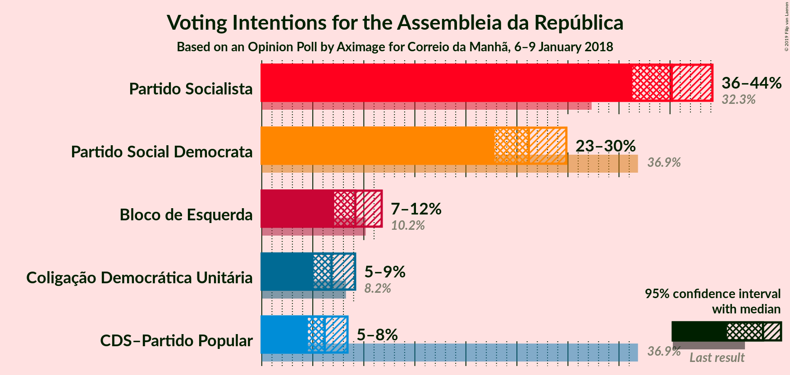

# Opinion Poll by Aximage for Correio da Manhã, 6–9 January 2018

<a href="#voting-intentions">Voting Intentions</a> | <a href="#seats">Seats</a> | <a href="#coalitions">Coalitions</a> | <a href="#technical-information">Technical Information</a>

## Voting Intentions

### Confidence Intervals

| Party | Last Result | Poll Result | 80% Confidence Interval | 90% Confidence Interval | 95% Confidence Interval | 99% Confidence Interval |
|:-----:|:-----------:|:-----------:|:-----------------------:|:-----------------------:|:-----------------------:|:-----------------------:|
| Partido Socialista | 32.3% | 40.2% | 37.6–42.8% |36.9–43.5% |36.3–44.2% |35.1–45.4% |
| Partido Social Democrata | 36.9% | 26.2% | 24.0–28.6% |23.3–29.2% |22.8–29.8% |21.8–31.0% |
| Bloco de Esquerda | 10.2% | 9.2% | 7.8–10.9% |7.4–11.3% |7.1–11.8% |6.5–12.6% |
| Coligação Democrática Unitária | 8.2% | 6.8% | 5.7–8.3% |5.3–8.8% |5.1–9.1% |4.6–9.9% |
| CDS–Partido Popular | 36.9% | 6.2% | 5.1–7.6% |4.8–8.0% |4.5–8.4% |4.0–9.1% |

*Note:* The poll result column reflects the actual value used in the calculations. Published results may vary slightly, and in addition be rounded to fewer digits.

## Seats

### Confidence Intervals

| Party | Last Result | Median | 80% Confidence Interval | 90% Confidence Interval | 95% Confidence Interval | 99% Confidence Interval |
|:-----:|:-----------:|:------:|:-----------------------:|:-----------------------:|:-----------------------:|:-----------------------:|
| <a href="#partido-socialista">Partido Socialista</a> | 86 | 122 | 116–129 |112–129 |110–129 |109–129 |
| <a href="#partido-social-democrata">Partido Social Democrata</a> | 89 | 69 | 58–75 |58–83 |58–86 |56–86 |
| <a href="#bloco-de-esquerda">Bloco de Esquerda</a> | 19 | 18 | 17–24 |17–27 |10–27 |10–30 |
| <a href="#coligação-democrática-unitária">Coligação Democrática Unitária</a> | 17 | 10 | 5–18 |5–18 |5–18 |5–23 |
| <a href="#cds–partido-popular">CDS–Partido Popular</a> | 18 | 10 | 4–16 |4–17 |4–22 |4–23 |

### Partido Socialista

*For a full overview of the results for this party, see the [Partido Socialista](party-partidosocialista.html) page.*

| Number of Seats | Probability | Accumulated | Special Marks |
|:---------------:|:-----------:|:-----------:|:-------------:|
| 86 | 0% | 100% | Last Result |
| 87 | 0% | 100% |  |
| 88 | 0% | 100% |  |
| 89 | 0% | 100% |  |
| 90 | 0% | 100% |  |
| 91 | 0% | 100% |  |
| 92 | 0% | 100% |  |
| 93 | 0% | 100% |  |
| 94 | 0.1% | 100% |  |
| 95 | 0% | 99.9% |  |
| 96 | 0% | 99.8% |  |
| 97 | 0.1% | 99.8% |  |
| 98 | 0% | 99.8% |  |
| 99 | 0% | 99.8% |  |
| 100 | 0% | 99.8% |  |
| 101 | 0% | 99.8% |  |
| 102 | 0% | 99.8% |  |
| 103 | 0% | 99.7% |  |
| 104 | 0% | 99.7% |  |
| 105 | 0% | 99.7% |  |
| 106 | 0% | 99.7% |  |
| 107 | 0% | 99.7% |  |
| 108 | 0% | 99.7% |  |
| 109 | 0.4% | 99.7% |  |
| 110 | 3% | 99.3% |  |
| 111 | 0.5% | 96% |  |
| 112 | 2% | 96% |  |
| 113 | 2% | 94% |  |
| 114 | 0.5% | 92% |  |
| 115 | 0% | 91% |  |
| 116 | 7% | 91% | Majority |
| 117 | 21% | 85% |  |
| 118 | 0% | 64% |  |
| 119 | 0% | 64% |  |
| 120 | 0% | 64% |  |
| 121 | 5% | 64% |  |
| 122 | 13% | 59% | Median |
| 123 | 0% | 47% |  |
| 124 | 0% | 46% |  |
| 125 | 0% | 46% |  |
| 126 | 0% | 46% |  |
| 127 | 0% | 46% |  |
| 128 | 7% | 46% |  |
| 129 | 40% | 40% |  |
| 130 | 0% | 0% |  |

### Partido Social Democrata

*For a full overview of the results for this party, see the [Partido Social Democrata](party-partidosocialdemocrata.html) page.*

| Number of Seats | Probability | Accumulated | Special Marks |
|:---------------:|:-----------:|:-----------:|:-------------:|
| 56 | 0.7% | 100% |  |
| 57 | 0.4% | 99.3% |  |
| 58 | 17% | 98.9% |  |
| 59 | 3% | 82% |  |
| 60 | 0% | 79% |  |
| 61 | 0.5% | 79% |  |
| 62 | 2% | 78% |  |
| 63 | 0% | 76% |  |
| 64 | 0% | 76% |  |
| 65 | 0% | 76% |  |
| 66 | 0% | 76% |  |
| 67 | 0% | 76% |  |
| 68 | 0% | 76% |  |
| 69 | 46% | 76% | Median |
| 70 | 0.6% | 30% |  |
| 71 | 0% | 30% |  |
| 72 | 0% | 30% |  |
| 73 | 0.5% | 30% |  |
| 74 | 19% | 29% |  |
| 75 | 5% | 10% |  |
| 76 | 0% | 5% |  |
| 77 | 0% | 5% |  |
| 78 | 0% | 5% |  |
| 79 | 0% | 5% |  |
| 80 | 0% | 5% |  |
| 81 | 0% | 5% |  |
| 82 | 0% | 5% |  |
| 83 | 0.1% | 5% |  |
| 84 | 0% | 5% |  |
| 85 | 0% | 5% |  |
| 86 | 5% | 5% |  |
| 87 | 0.1% | 0.2% |  |
| 88 | 0% | 0.1% |  |
| 89 | 0% | 0.1% | Last Result |
| 90 | 0% | 0.1% |  |
| 91 | 0% | 0.1% |  |
| 92 | 0% | 0.1% |  |
| 93 | 0% | 0.1% |  |
| 94 | 0% | 0.1% |  |
| 95 | 0% | 0.1% |  |
| 96 | 0% | 0.1% |  |
| 97 | 0% | 0.1% |  |
| 98 | 0.1% | 0.1% |  |
| 99 | 0% | 0% |  |

### Bloco de Esquerda

*For a full overview of the results for this party, see the [Bloco de Esquerda](party-blocodeesquerda.html) page.*

| Number of Seats | Probability | Accumulated | Special Marks |
|:---------------:|:-----------:|:-----------:|:-------------:|
| 9 | 0.3% | 100% |  |
| 10 | 4% | 99.7% |  |
| 11 | 0% | 95% |  |
| 12 | 0% | 95% |  |
| 13 | 0% | 95% |  |
| 14 | 0.1% | 95% |  |
| 15 | 0% | 95% |  |
| 16 | 0% | 95% |  |
| 17 | 16% | 95% |  |
| 18 | 40% | 79% | Median |
| 19 | 7% | 39% | Last Result |
| 20 | 0.3% | 32% |  |
| 21 | 2% | 32% |  |
| 22 | 0.7% | 30% |  |
| 23 | 0.5% | 29% |  |
| 24 | 23% | 28% |  |
| 25 | 0% | 6% |  |
| 26 | 0% | 6% |  |
| 27 | 4% | 6% |  |
| 28 | 0% | 2% |  |
| 29 | 0% | 2% |  |
| 30 | 2% | 2% |  |
| 31 | 0% | 0% |  |

### Coligação Democrática Unitária

*For a full overview of the results for this party, see the [Coligação Democrática Unitária](party-coligaçãodemocráticaunitária.html) page.*

| Number of Seats | Probability | Accumulated | Special Marks |
|:---------------:|:-----------:|:-----------:|:-------------:|
| 5 | 23% | 100% |  |
| 6 | 5% | 77% |  |
| 7 | 0% | 73% |  |
| 8 | 2% | 73% |  |
| 9 | 0.6% | 70% |  |
| 10 | 46% | 70% | Median |
| 11 | 0% | 24% |  |
| 12 | 2% | 24% |  |
| 13 | 0.5% | 22% |  |
| 14 | 0% | 21% |  |
| 15 | 0% | 21% |  |
| 16 | 0% | 21% |  |
| 17 | 4% | 21% | Last Result |
| 18 | 17% | 18% |  |
| 19 | 0% | 0.8% |  |
| 20 | 0% | 0.8% |  |
| 21 | 0% | 0.8% |  |
| 22 | 0% | 0.8% |  |
| 23 | 0.7% | 0.8% |  |
| 24 | 0% | 0.1% |  |
| 25 | 0% | 0% |  |

### CDS–Partido Popular

*For a full overview of the results for this party, see the [CDS–Partido Popular](party-cds–partidopopular.html) page.*

| Number of Seats | Probability | Accumulated | Special Marks |
|:---------------:|:-----------:|:-----------:|:-------------:|
| 3 | 0.2% | 100% |  |
| 4 | 46% | 99.8% |  |
| 5 | 2% | 54% |  |
| 6 | 0.2% | 51% |  |
| 7 | 0% | 51% |  |
| 8 | 0.7% | 51% |  |
| 9 | 0% | 50% |  |
| 10 | 23% | 50% | Median |
| 11 | 3% | 28% |  |
| 12 | 2% | 24% |  |
| 13 | 0% | 23% |  |
| 14 | 0.2% | 23% |  |
| 15 | 13% | 23% |  |
| 16 | 4% | 10% |  |
| 17 | 3% | 7% |  |
| 18 | 0.4% | 3% | Last Result |
| 19 | 0% | 3% |  |
| 20 | 0% | 3% |  |
| 21 | 0% | 3% |  |
| 22 | 0.5% | 3% |  |
| 23 | 2% | 2% |  |
| 24 | 0% | 0.2% |  |
| 25 | 0% | 0.2% |  |
| 26 | 0.1% | 0.2% |  |
| 27 | 0% | 0% |  |

## Coalitions

### Confidence Intervals

| Coalition | Last Result | Median | Majority? | 80% Confidence Interval | 90% Confidence Interval | 95% Confidence Interval | 99% Confidence Interval |
|:---------:|:-----------:|:------:|:---------:|:-----------------------:|:-----------------------:|:-----------------------:|:-----------------------:|
| Partido Socialista – Bloco de Esquerda – Coligação Democrática Unitária | 122 | 157 | 100% | 145–157 | 141–157 | 133–157 | 132–166 |
| Partido Socialista – Bloco de Esquerda | 105 | 141 | 99.9% | 137–147 | 127–147 | 127–147 | 126–147 |
| Partido Socialista – Coligação Democrática Unitária | 103 | 139 | 99.8% | 122–140 | 121–140 | 121–140 | 121–144 |
| Partido Socialista | 86 | 122 | 91% | 116–129 | 112–129 | 110–129 | 109–129 |
| Partido Social Democrata – CDS–Partido Popular | 107 | 73 | 0% | 73–85 | 73–89 | 73–97 | 64–98 |

### Partido Socialista – Bloco de Esquerda – Coligação Democrática Unitária

| Number of Seats | Probability | Accumulated | Special Marks |
|:---------------:|:-----------:|:-----------:|:-------------:|
| 122 | 0% | 100% | Last Result |
| 123 | 0% | 100% |  |
| 124 | 0% | 100% |  |
| 125 | 0% | 100% |  |
| 126 | 0.1% | 100% |  |
| 127 | 0% | 99.9% |  |
| 128 | 0% | 99.9% |  |
| 129 | 0% | 99.9% |  |
| 130 | 0% | 99.9% |  |
| 131 | 0.1% | 99.9% |  |
| 132 | 2% | 99.8% |  |
| 133 | 3% | 98% |  |
| 134 | 0% | 95% |  |
| 135 | 0% | 95% |  |
| 136 | 0% | 95% |  |
| 137 | 0% | 95% |  |
| 138 | 0% | 95% |  |
| 139 | 0% | 95% |  |
| 140 | 0% | 95% |  |
| 141 | 0.1% | 95% |  |
| 142 | 0% | 95% |  |
| 143 | 0% | 95% |  |
| 144 | 0% | 95% |  |
| 145 | 8% | 95% |  |
| 146 | 17% | 87% |  |
| 147 | 0.5% | 70% |  |
| 148 | 0% | 70% |  |
| 149 | 0% | 70% |  |
| 150 | 0% | 70% | Median |
| 151 | 2% | 70% |  |
| 152 | 0.5% | 68% |  |
| 153 | 0.4% | 67% |  |
| 154 | 3% | 67% |  |
| 155 | 0% | 64% |  |
| 156 | 5% | 64% |  |
| 157 | 58% | 59% |  |
| 158 | 0.4% | 1.2% |  |
| 159 | 0% | 0.7% |  |
| 160 | 0% | 0.7% |  |
| 161 | 0% | 0.7% |  |
| 162 | 0% | 0.7% |  |
| 163 | 0% | 0.7% |  |
| 164 | 0% | 0.7% |  |
| 165 | 0% | 0.7% |  |
| 166 | 0.7% | 0.7% |  |
| 167 | 0% | 0% |  |

### Partido Socialista – Bloco de Esquerda

| Number of Seats | Probability | Accumulated | Special Marks |
|:---------------:|:-----------:|:-----------:|:-------------:|
| 105 | 0% | 100% | Last Result |
| 106 | 0% | 100% |  |
| 107 | 0% | 100% |  |
| 108 | 0.1% | 100% |  |
| 109 | 0% | 99.9% |  |
| 110 | 0% | 99.9% |  |
| 111 | 0% | 99.9% |  |
| 112 | 0% | 99.9% |  |
| 113 | 0% | 99.9% |  |
| 114 | 0% | 99.9% |  |
| 115 | 0% | 99.9% |  |
| 116 | 0% | 99.9% | Majority |
| 117 | 0% | 99.9% |  |
| 118 | 0% | 99.9% |  |
| 119 | 0% | 99.9% |  |
| 120 | 0% | 99.9% |  |
| 121 | 0% | 99.9% |  |
| 122 | 0% | 99.9% |  |
| 123 | 0% | 99.8% |  |
| 124 | 0.1% | 99.8% |  |
| 125 | 0.1% | 99.7% |  |
| 126 | 2% | 99.7% |  |
| 127 | 3% | 98% |  |
| 128 | 0% | 95% |  |
| 129 | 0% | 95% |  |
| 130 | 0% | 95% |  |
| 131 | 0% | 95% |  |
| 132 | 0% | 95% |  |
| 133 | 2% | 95% |  |
| 134 | 0.5% | 93% |  |
| 135 | 0% | 92% |  |
| 136 | 0.4% | 92% |  |
| 137 | 3% | 92% |  |
| 138 | 4% | 89% |  |
| 139 | 13% | 85% |  |
| 140 | 6% | 72% | Median |
| 141 | 17% | 67% |  |
| 142 | 0% | 49% |  |
| 143 | 2% | 49% |  |
| 144 | 0.5% | 47% |  |
| 145 | 0% | 46% |  |
| 146 | 0% | 46% |  |
| 147 | 46% | 46% |  |
| 148 | 0.2% | 0.2% |  |
| 149 | 0% | 0% |  |

### Partido Socialista – Coligação Democrática Unitária

| Number of Seats | Probability | Accumulated | Special Marks |
|:---------------:|:-----------:|:-----------:|:-------------:|
| 103 | 0% | 100% | Last Result |
| 104 | 0% | 100% |  |
| 105 | 0% | 100% |  |
| 106 | 0% | 100% |  |
| 107 | 0% | 100% |  |
| 108 | 0% | 100% |  |
| 109 | 0% | 100% |  |
| 110 | 0% | 100% |  |
| 111 | 0% | 100% |  |
| 112 | 0.1% | 100% |  |
| 113 | 0% | 99.9% |  |
| 114 | 0.1% | 99.8% |  |
| 115 | 0% | 99.8% |  |
| 116 | 0% | 99.8% | Majority |
| 117 | 0% | 99.8% |  |
| 118 | 0% | 99.8% |  |
| 119 | 0% | 99.8% |  |
| 120 | 0% | 99.8% |  |
| 121 | 7% | 99.8% |  |
| 122 | 19% | 93% |  |
| 123 | 4% | 74% |  |
| 124 | 3% | 70% |  |
| 125 | 0% | 67% |  |
| 126 | 0.4% | 67% |  |
| 127 | 3% | 67% |  |
| 128 | 0% | 64% |  |
| 129 | 0% | 64% |  |
| 130 | 0% | 64% |  |
| 131 | 0% | 64% |  |
| 132 | 0% | 64% | Median |
| 133 | 0% | 64% |  |
| 134 | 0% | 64% |  |
| 135 | 0% | 64% |  |
| 136 | 0% | 64% |  |
| 137 | 0% | 64% |  |
| 138 | 8% | 64% |  |
| 139 | 43% | 56% |  |
| 140 | 13% | 13% |  |
| 141 | 0% | 0.7% |  |
| 142 | 0% | 0.7% |  |
| 143 | 0% | 0.7% |  |
| 144 | 0.7% | 0.7% |  |
| 145 | 0% | 0% |  |

### Partido Socialista

| Number of Seats | Probability | Accumulated | Special Marks |
|:---------------:|:-----------:|:-----------:|:-------------:|
| 86 | 0% | 100% | Last Result |
| 87 | 0% | 100% |  |
| 88 | 0% | 100% |  |
| 89 | 0% | 100% |  |
| 90 | 0% | 100% |  |
| 91 | 0% | 100% |  |
| 92 | 0% | 100% |  |
| 93 | 0% | 100% |  |
| 94 | 0.1% | 100% |  |
| 95 | 0% | 99.9% |  |
| 96 | 0% | 99.8% |  |
| 97 | 0.1% | 99.8% |  |
| 98 | 0% | 99.8% |  |
| 99 | 0% | 99.8% |  |
| 100 | 0% | 99.8% |  |
| 101 | 0% | 99.8% |  |
| 102 | 0% | 99.8% |  |
| 103 | 0% | 99.7% |  |
| 104 | 0% | 99.7% |  |
| 105 | 0% | 99.7% |  |
| 106 | 0% | 99.7% |  |
| 107 | 0% | 99.7% |  |
| 108 | 0% | 99.7% |  |
| 109 | 0.4% | 99.7% |  |
| 110 | 3% | 99.3% |  |
| 111 | 0.5% | 96% |  |
| 112 | 2% | 96% |  |
| 113 | 2% | 94% |  |
| 114 | 0.5% | 92% |  |
| 115 | 0% | 91% |  |
| 116 | 7% | 91% | Majority |
| 117 | 21% | 85% |  |
| 118 | 0% | 64% |  |
| 119 | 0% | 64% |  |
| 120 | 0% | 64% |  |
| 121 | 5% | 64% |  |
| 122 | 13% | 59% | Median |
| 123 | 0% | 47% |  |
| 124 | 0% | 46% |  |
| 125 | 0% | 46% |  |
| 126 | 0% | 46% |  |
| 127 | 0% | 46% |  |
| 128 | 7% | 46% |  |
| 129 | 40% | 40% |  |
| 130 | 0% | 0% |  |

### Partido Social Democrata – CDS–Partido Popular

| Number of Seats | Probability | Accumulated | Special Marks |
|:---------------:|:-----------:|:-----------:|:-------------:|
| 64 | 0.7% | 100% |  |
| 65 | 0% | 99.3% |  |
| 66 | 0% | 99.3% |  |
| 67 | 0% | 99.3% |  |
| 68 | 0% | 99.3% |  |
| 69 | 0% | 99.3% |  |
| 70 | 0% | 99.3% |  |
| 71 | 0% | 99.3% |  |
| 72 | 0.4% | 99.3% |  |
| 73 | 58% | 98.8% |  |
| 74 | 5% | 41% |  |
| 75 | 0% | 36% |  |
| 76 | 3% | 36% |  |
| 77 | 0% | 33% |  |
| 78 | 0.5% | 33% |  |
| 79 | 2% | 32% | Median |
| 80 | 0% | 30% |  |
| 81 | 0% | 30% |  |
| 82 | 0% | 30% |  |
| 83 | 0.5% | 30% |  |
| 84 | 17% | 30% |  |
| 85 | 8% | 13% |  |
| 86 | 0% | 5% |  |
| 87 | 0% | 5% |  |
| 88 | 0% | 5% |  |
| 89 | 0.1% | 5% |  |
| 90 | 0% | 5% |  |
| 91 | 0% | 5% |  |
| 92 | 0% | 5% |  |
| 93 | 0% | 5% |  |
| 94 | 0% | 5% |  |
| 95 | 0% | 5% |  |
| 96 | 0% | 5% |  |
| 97 | 3% | 5% |  |
| 98 | 2% | 2% |  |
| 99 | 0.1% | 0.2% |  |
| 100 | 0% | 0.1% |  |
| 101 | 0% | 0.1% |  |
| 102 | 0% | 0.1% |  |
| 103 | 0% | 0.1% |  |
| 104 | 0.1% | 0.1% |  |
| 105 | 0% | 0% |  |
| 106 | 0% | 0% |  |
| 107 | 0% | 0% | Last Result |

## Technical Information

### Opinion Poll

+ **Polling firm:** Aximage
+ **Commissioner(s):** Correio da Manhã
+ **Fieldwork period:** 6–9 January 2018

### Calculations

+ **Sample size:** 600
+ **Simulations done:** 1,024
+ **Error estimate:** 5.15%

