# Opinion Poll by Eurosondagem for Expresso and SIC, 14–17 January 2018

<a href="#voting-intentions">Voting Intentions</a> | <a href="#seats">Seats</a> | <a href="#coalitions">Coalitions</a> | <a href="#technical-information">Technical Information</a>

## Voting Intentions

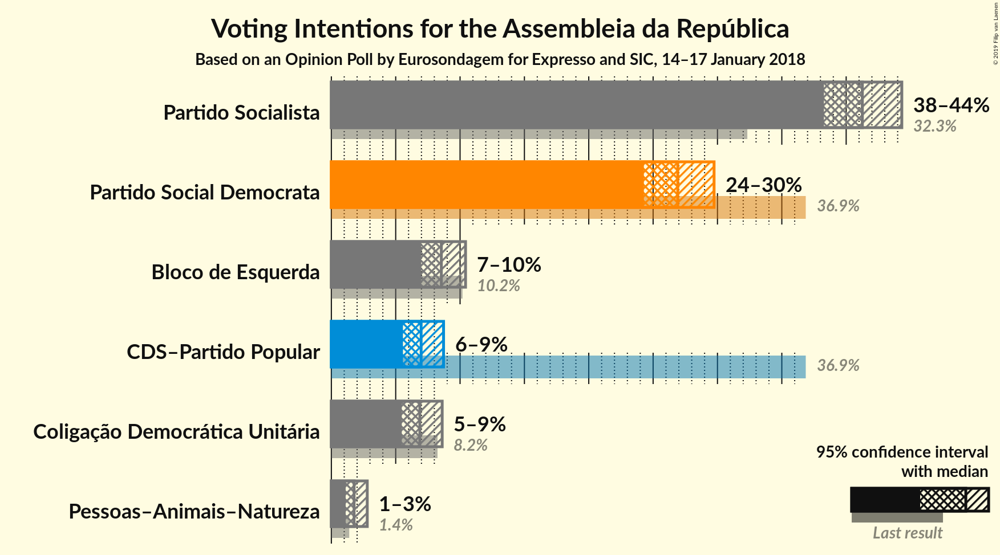

### Confidence Intervals

| Party | Last Result | Poll Result | 80% Confidence Interval | 90% Confidence Interval | 95% Confidence Interval | 99% Confidence Interval |
|:-----:|:-----------:|:-----------:|:-----------------------:|:-----------------------:|:-----------------------:|:-----------------------:|
| Partido Socialista | 32.3% | 41.3% | 39.3–43.3% |38.7–43.8% |38.3–44.3% |37.3–45.3% |
| Partido Social Democrata | 36.9% | 26.9% | 25.2–28.8% |24.7–29.3% |24.3–29.7% |23.5–30.6% |
| Bloco de Esquerda | 10.2% | 8.5% | 7.5–9.8% |7.2–10.1% |7.0–10.4% |6.5–11.1% |
| CDS–Partido Popular | 36.9% | 7.0% | 6.1–8.1% |5.8–8.4% |5.6–8.7% |5.2–9.3% |
| Coligação Democrática Unitária | 8.2% | 6.9% | 6.0–8.0% |5.7–8.3% |5.5–8.6% |5.1–9.2% |
| Pessoas–Animais–Natureza | 1.4% | 1.8% | 1.3–2.4% |1.2–2.6% |1.1–2.8% |0.9–3.1% |

*Note:* The poll result column reflects the actual value used in the calculations. Published results may vary slightly, and in addition be rounded to fewer digits.

## Seats

### Confidence Intervals

| Party | Last Result | Median | 80% Confidence Interval | 90% Confidence Interval | 95% Confidence Interval | 99% Confidence Interval |
|:-----:|:-----------:|:------:|:-----------------------:|:-----------------------:|:-----------------------:|:-----------------------:|
| <a href="#partido-socialista">Partido Socialista</a> | 86 | 115 | 110–119 |109–122 |108–124 |104–128 |
| <a href="#partido-social-democrata">Partido Social Democrata</a> | 89 | 74 | 68–78 |66–81 |64–81 |62–84 |
| <a href="#bloco-de-esquerda">Bloco de Esquerda</a> | 19 | 17 | 13–19 |13–20 |11–22 |10–24 |
| <a href="#cds–partido-popular">CDS–Partido Popular</a> | 18 | 11 | 9–14 |8–17 |7–18 |6–19 |
| <a href="#coligação-democrática-unitária">Coligação Democrática Unitária</a> | 17 | 12 | 9–16 |8–17 |7–17 |6–18 |
| <a href="#pessoas–animais–natureza">Pessoas–Animais–Natureza</a> | 1 | 1 | 1–2 |0–2 |0–3 |0–3 |

### Partido Socialista

*For a full overview of the results for this party, see the [Partido Socialista](party-partidosocialista.html) page.*

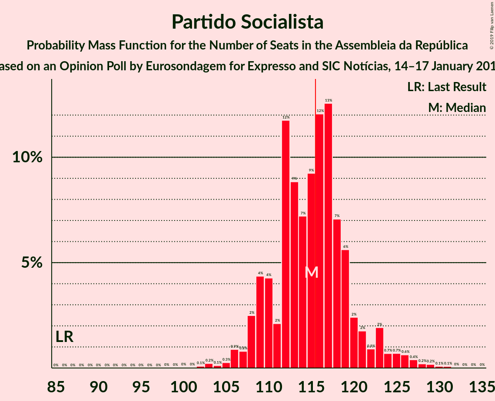

| Number of Seats | Probability | Accumulated | Special Marks |
|:---------------:|:-----------:|:-----------:|:-------------:|
| 86 | 0% | 100% | Last Result |
| 87 | 0% | 100% |  |
| 88 | 0% | 100% |  |
| 89 | 0% | 100% |  |
| 90 | 0% | 100% |  |
| 91 | 0% | 100% |  |
| 92 | 0% | 100% |  |
| 93 | 0% | 100% |  |
| 94 | 0% | 100% |  |
| 95 | 0% | 100% |  |
| 96 | 0% | 100% |  |
| 97 | 0% | 100% |  |
| 98 | 0% | 100% |  |
| 99 | 0% | 100% |  |
| 100 | 0% | 100% |  |
| 101 | 0% | 100% |  |
| 102 | 0.1% | 99.9% |  |
| 103 | 0.2% | 99.8% |  |
| 104 | 0.1% | 99.6% |  |
| 105 | 0.3% | 99.5% |  |
| 106 | 0.9% | 99.2% |  |
| 107 | 0.8% | 98% |  |
| 108 | 2% | 98% |  |
| 109 | 4% | 95% |  |
| 110 | 4% | 91% |  |
| 111 | 2% | 86% |  |
| 112 | 12% | 84% |  |
| 113 | 9% | 73% |  |
| 114 | 7% | 64% |  |
| 115 | 9% | 57% | Median |
| 116 | 12% | 47% | Majority |
| 117 | 13% | 35% |  |
| 118 | 7% | 23% |  |
| 119 | 6% | 16% |  |
| 120 | 2% | 10% |  |
| 121 | 2% | 8% |  |
| 122 | 0.9% | 6% |  |
| 123 | 2% | 5% |  |
| 124 | 0.7% | 3% |  |
| 125 | 0.7% | 2% |  |
| 126 | 0.6% | 2% |  |
| 127 | 0.4% | 1.0% |  |
| 128 | 0.2% | 0.6% |  |
| 129 | 0.2% | 0.4% |  |
| 130 | 0.1% | 0.2% |  |
| 131 | 0.1% | 0.1% |  |
| 132 | 0% | 0.1% |  |
| 133 | 0% | 0% |  |

### Partido Social Democrata

*For a full overview of the results for this party, see the [Partido Social Democrata](party-partidosocialdemocrata.html) page.*

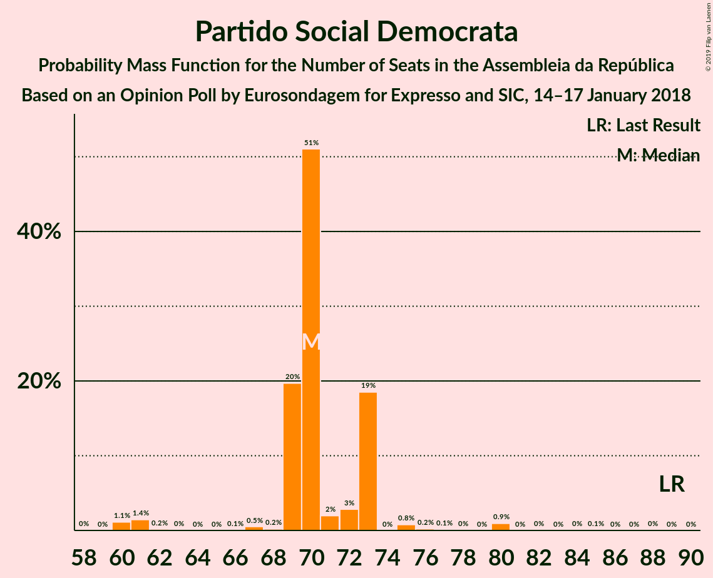

| Number of Seats | Probability | Accumulated | Special Marks |
|:---------------:|:-----------:|:-----------:|:-------------:|
| 59 | 0.1% | 100% |  |
| 60 | 0.1% | 99.9% |  |
| 61 | 0.2% | 99.8% |  |
| 62 | 0.2% | 99.7% |  |
| 63 | 0.7% | 99.4% |  |
| 64 | 1.4% | 98.7% |  |
| 65 | 1.1% | 97% |  |
| 66 | 1.3% | 96% |  |
| 67 | 2% | 95% |  |
| 68 | 5% | 92% |  |
| 69 | 4% | 87% |  |
| 70 | 6% | 83% |  |
| 71 | 11% | 78% |  |
| 72 | 6% | 66% |  |
| 73 | 9% | 60% |  |
| 74 | 6% | 51% | Median |
| 75 | 12% | 45% |  |
| 76 | 11% | 34% |  |
| 77 | 6% | 23% |  |
| 78 | 7% | 16% |  |
| 79 | 2% | 10% |  |
| 80 | 3% | 8% |  |
| 81 | 3% | 5% |  |
| 82 | 0.7% | 2% |  |
| 83 | 0.9% | 1.4% |  |
| 84 | 0.1% | 0.5% |  |
| 85 | 0.2% | 0.4% |  |
| 86 | 0.1% | 0.2% |  |
| 87 | 0.1% | 0.1% |  |
| 88 | 0% | 0% |  |
| 89 | 0% | 0% | Last Result |

### Bloco de Esquerda

*For a full overview of the results for this party, see the [Bloco de Esquerda](party-blocodeesquerda.html) page.*

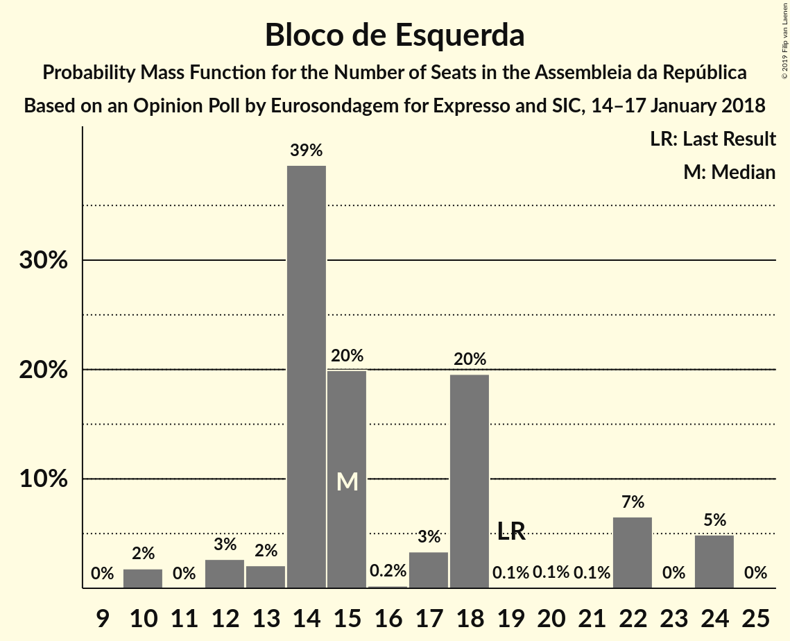

| Number of Seats | Probability | Accumulated | Special Marks |
|:---------------:|:-----------:|:-----------:|:-------------:|
| 9 | 0.1% | 100% |  |
| 10 | 1.3% | 99.9% |  |
| 11 | 1.3% | 98.6% |  |
| 12 | 2% | 97% |  |
| 13 | 7% | 95% |  |
| 14 | 10% | 88% |  |
| 15 | 11% | 77% |  |
| 16 | 5% | 67% |  |
| 17 | 21% | 62% | Median |
| 18 | 31% | 41% |  |
| 19 | 4% | 10% | Last Result |
| 20 | 2% | 6% |  |
| 21 | 1.1% | 4% |  |
| 22 | 1.3% | 3% |  |
| 23 | 0.4% | 1.5% |  |
| 24 | 1.1% | 1.1% |  |
| 25 | 0% | 0% |  |

### CDS–Partido Popular

*For a full overview of the results for this party, see the [CDS–Partido Popular](party-cds–partidopopular.html) page.*

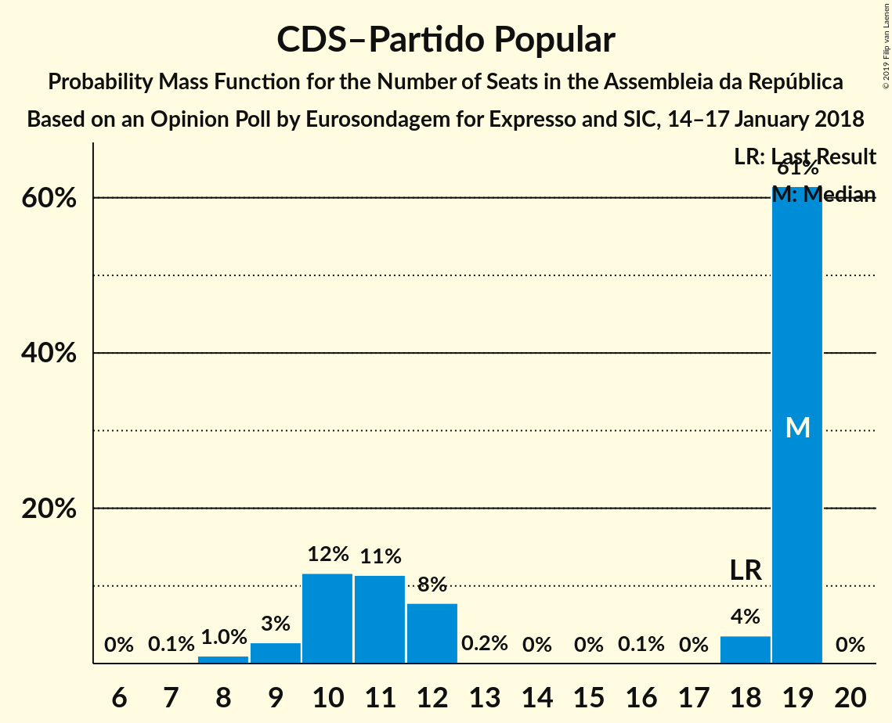

| Number of Seats | Probability | Accumulated | Special Marks |
|:---------------:|:-----------:|:-----------:|:-------------:|
| 6 | 1.3% | 100% |  |
| 7 | 2% | 98.7% |  |
| 8 | 6% | 96% |  |
| 9 | 8% | 90% |  |
| 10 | 28% | 82% |  |
| 11 | 11% | 54% | Median |
| 12 | 12% | 43% |  |
| 13 | 15% | 31% |  |
| 14 | 8% | 17% |  |
| 15 | 2% | 9% |  |
| 16 | 1.1% | 6% |  |
| 17 | 1.4% | 5% |  |
| 18 | 1.5% | 4% | Last Result |
| 19 | 2% | 2% |  |
| 20 | 0.1% | 0.1% |  |
| 21 | 0% | 0% |  |

### Coligação Democrática Unitária

*For a full overview of the results for this party, see the [Coligação Democrática Unitária](party-coligaçãodemocráticaunitária.html) page.*

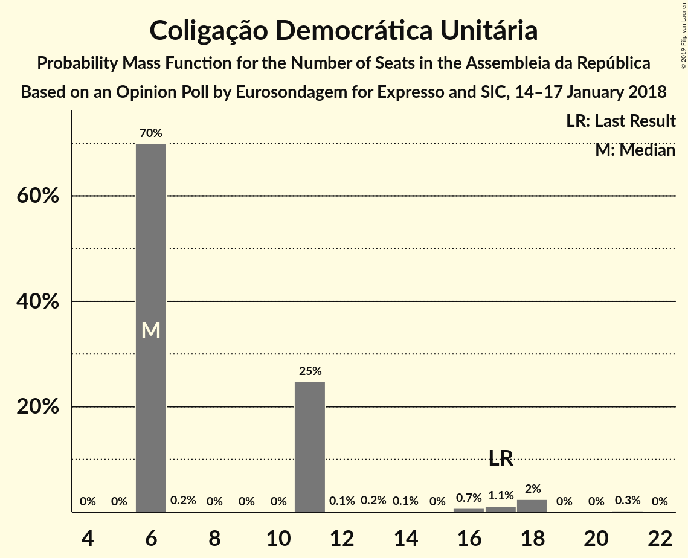

| Number of Seats | Probability | Accumulated | Special Marks |
|:---------------:|:-----------:|:-----------:|:-------------:|
| 5 | 0.1% | 100% |  |
| 6 | 1.3% | 99.9% |  |
| 7 | 1.2% | 98.6% |  |
| 8 | 3% | 97% |  |
| 9 | 15% | 95% |  |
| 10 | 8% | 80% |  |
| 11 | 12% | 72% |  |
| 12 | 10% | 60% | Median |
| 13 | 8% | 49% |  |
| 14 | 25% | 41% |  |
| 15 | 6% | 17% |  |
| 16 | 4% | 10% |  |
| 17 | 5% | 6% | Last Result |
| 18 | 0.8% | 1.1% |  |
| 19 | 0.2% | 0.4% |  |
| 20 | 0.1% | 0.1% |  |
| 21 | 0% | 0% |  |

### Pessoas–Animais–Natureza

*For a full overview of the results for this party, see the [Pessoas–Animais–Natureza](party-pessoas–animais–natureza.html) page.*

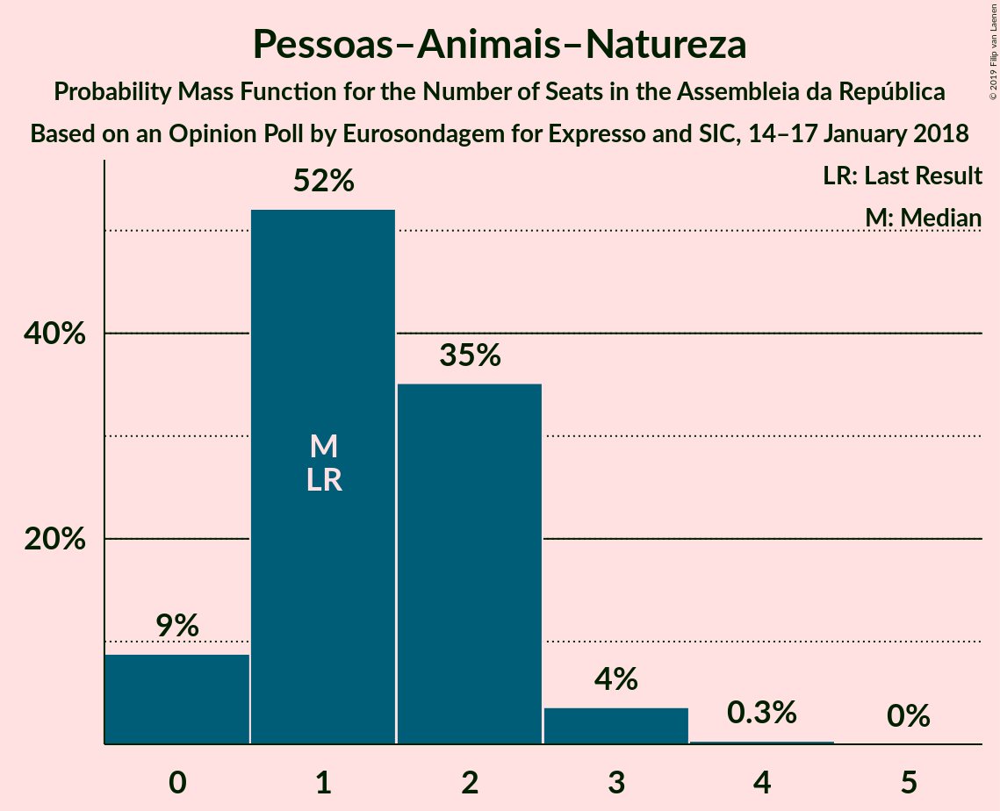

| Number of Seats | Probability | Accumulated | Special Marks |
|:---------------:|:-----------:|:-----------:|:-------------:|
| 0 | 9% | 100% |  |
| 1 | 52% | 91% | Last Result, Median |
| 2 | 35% | 39% |  |
| 3 | 4% | 4% |  |
| 4 | 0.3% | 0.3% |  |
| 5 | 0% | 0% |  |

## Coalitions

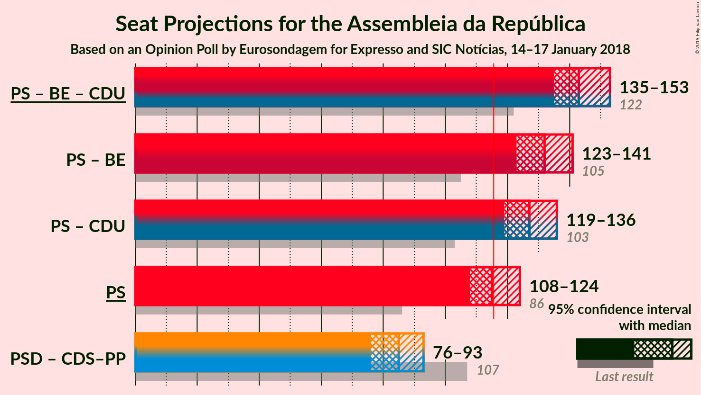

### Confidence Intervals

| Coalition | Last Result | Median | Majority? | 80% Confidence Interval | 90% Confidence Interval | 95% Confidence Interval | 99% Confidence Interval |
|:---------:|:-----------:|:------:|:---------:|:-----------------------:|:-----------------------:|:-----------------------:|:-----------------------:|
| Partido Socialista – Bloco de Esquerda – Coligação Democrática Unitária | 122 | 143 | 100% | 139–149 | 137–151 | 135–153 | 133–156 |
| Partido Socialista – Bloco de Esquerda | 105 | 132 | 100% | 126–137 | 125–139 | 123–141 | 121–144 |
| Partido Socialista – Coligação Democrática Unitária | 103 | 127 | 99.8% | 122–133 | 121–134 | 119–136 | 116–140 |
| Partido Socialista | 86 | 115 | 47% | 110–119 | 109–122 | 108–124 | 104–128 |
| Partido Social Democrata – CDS–Partido Popular | 107 | 85 | 0% | 79–90 | 78–91 | 76–93 | 72–96 |

### Partido Socialista – Bloco de Esquerda – Coligação Democrática Unitária

| Number of Seats | Probability | Accumulated | Special Marks |
|:---------------:|:-----------:|:-----------:|:-------------:|
| 122 | 0% | 100% | Last Result |
| 123 | 0% | 100% |  |
| 124 | 0% | 100% |  |
| 125 | 0% | 100% |  |
| 126 | 0% | 100% |  |
| 127 | 0% | 100% |  |
| 128 | 0% | 100% |  |
| 129 | 0% | 100% |  |
| 130 | 0.1% | 99.9% |  |
| 131 | 0.1% | 99.9% |  |
| 132 | 0.2% | 99.8% |  |
| 133 | 0.2% | 99.6% |  |
| 134 | 0.9% | 99.4% |  |
| 135 | 1.1% | 98% |  |
| 136 | 1.3% | 97% |  |
| 137 | 2% | 96% |  |
| 138 | 4% | 94% |  |
| 139 | 6% | 90% |  |
| 140 | 9% | 85% |  |
| 141 | 8% | 76% |  |
| 142 | 11% | 68% |  |
| 143 | 8% | 57% |  |
| 144 | 5% | 49% | Median |
| 145 | 7% | 43% |  |
| 146 | 7% | 36% |  |
| 147 | 5% | 29% |  |
| 148 | 12% | 23% |  |
| 149 | 2% | 12% |  |
| 150 | 4% | 10% |  |
| 151 | 3% | 6% |  |
| 152 | 0.9% | 4% |  |
| 153 | 1.4% | 3% |  |
| 154 | 0.4% | 2% |  |
| 155 | 0.4% | 1.1% |  |
| 156 | 0.4% | 0.8% |  |
| 157 | 0.2% | 0.4% |  |
| 158 | 0% | 0.1% |  |
| 159 | 0% | 0.1% |  |
| 160 | 0% | 0% |  |

### Partido Socialista – Bloco de Esquerda

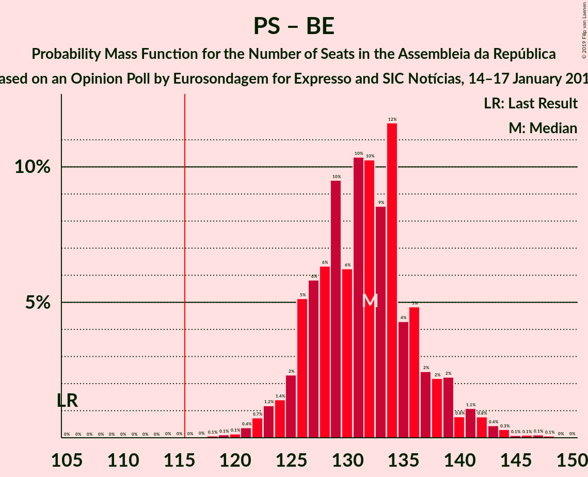

| Number of Seats | Probability | Accumulated | Special Marks |
|:---------------:|:-----------:|:-----------:|:-------------:|
| 105 | 0% | 100% | Last Result |
| 106 | 0% | 100% |  |
| 107 | 0% | 100% |  |
| 108 | 0% | 100% |  |
| 109 | 0% | 100% |  |
| 110 | 0% | 100% |  |
| 111 | 0% | 100% |  |
| 112 | 0% | 100% |  |
| 113 | 0% | 100% |  |
| 114 | 0% | 100% |  |
| 115 | 0% | 100% |  |
| 116 | 0% | 100% | Majority |
| 117 | 0% | 100% |  |
| 118 | 0.1% | 99.9% |  |
| 119 | 0.1% | 99.9% |  |
| 120 | 0.1% | 99.8% |  |
| 121 | 0.4% | 99.6% |  |
| 122 | 0.7% | 99.3% |  |
| 123 | 1.2% | 98.5% |  |
| 124 | 1.4% | 97% |  |
| 125 | 2% | 96% |  |
| 126 | 5% | 94% |  |
| 127 | 6% | 88% |  |
| 128 | 6% | 83% |  |
| 129 | 10% | 76% |  |
| 130 | 6% | 67% |  |
| 131 | 10% | 61% |  |
| 132 | 10% | 50% | Median |
| 133 | 9% | 40% |  |
| 134 | 12% | 31% |  |
| 135 | 4% | 20% |  |
| 136 | 5% | 15% |  |
| 137 | 2% | 11% |  |
| 138 | 2% | 8% |  |
| 139 | 2% | 6% |  |
| 140 | 0.8% | 4% |  |
| 141 | 1.1% | 3% |  |
| 142 | 0.8% | 2% |  |
| 143 | 0.4% | 1.1% |  |
| 144 | 0.3% | 0.7% |  |
| 145 | 0.1% | 0.4% |  |
| 146 | 0.1% | 0.3% |  |
| 147 | 0.1% | 0.2% |  |
| 148 | 0.1% | 0.1% |  |
| 149 | 0% | 0% |  |

### Partido Socialista – Coligação Democrática Unitária

| Number of Seats | Probability | Accumulated | Special Marks |
|:---------------:|:-----------:|:-----------:|:-------------:|
| 103 | 0% | 100% | Last Result |
| 104 | 0% | 100% |  |
| 105 | 0% | 100% |  |
| 106 | 0% | 100% |  |
| 107 | 0% | 100% |  |
| 108 | 0% | 100% |  |
| 109 | 0% | 100% |  |
| 110 | 0% | 100% |  |
| 111 | 0% | 100% |  |
| 112 | 0% | 100% |  |
| 113 | 0.1% | 100% |  |
| 114 | 0% | 99.9% |  |
| 115 | 0.1% | 99.8% |  |
| 116 | 0.3% | 99.8% | Majority |
| 117 | 0.8% | 99.4% |  |
| 118 | 0.2% | 98.7% |  |
| 119 | 2% | 98% |  |
| 120 | 2% | 97% |  |
| 121 | 3% | 95% |  |
| 122 | 5% | 92% |  |
| 123 | 10% | 88% |  |
| 124 | 6% | 78% |  |
| 125 | 6% | 72% |  |
| 126 | 10% | 67% |  |
| 127 | 9% | 56% | Median |
| 128 | 9% | 47% |  |
| 129 | 7% | 39% |  |
| 130 | 8% | 31% |  |
| 131 | 8% | 23% |  |
| 132 | 4% | 15% |  |
| 133 | 4% | 11% |  |
| 134 | 2% | 7% |  |
| 135 | 0.8% | 4% |  |
| 136 | 1.1% | 3% |  |
| 137 | 0.7% | 2% |  |
| 138 | 0.6% | 2% |  |
| 139 | 0.4% | 1.1% |  |
| 140 | 0.4% | 0.6% |  |
| 141 | 0.1% | 0.2% |  |
| 142 | 0.1% | 0.2% |  |
| 143 | 0% | 0.1% |  |
| 144 | 0% | 0% |  |

### Partido Socialista

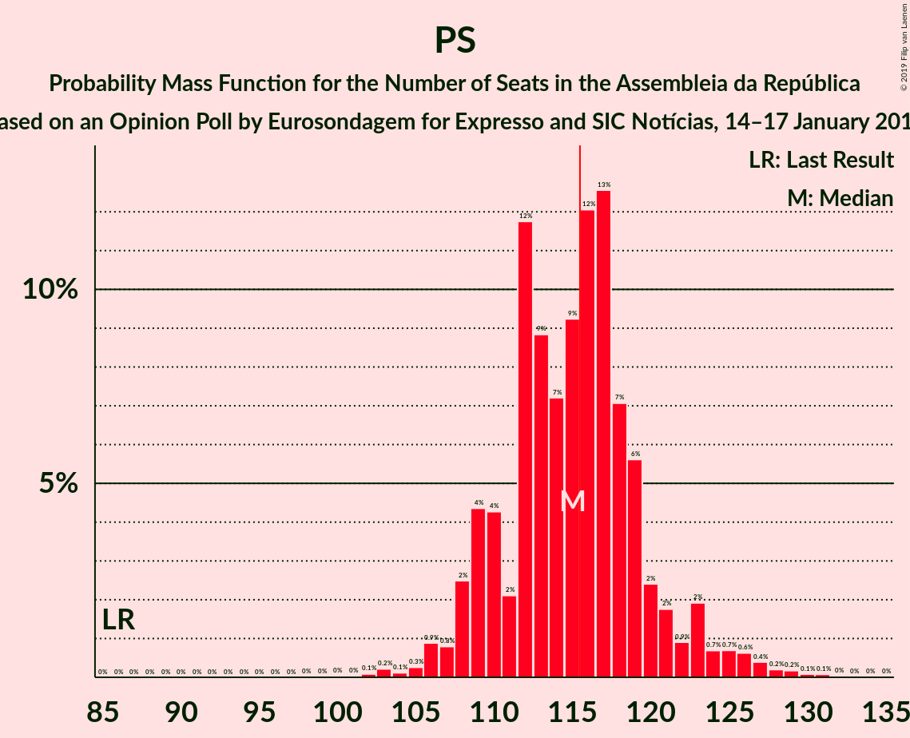

| Number of Seats | Probability | Accumulated | Special Marks |
|:---------------:|:-----------:|:-----------:|:-------------:|
| 86 | 0% | 100% | Last Result |
| 87 | 0% | 100% |  |
| 88 | 0% | 100% |  |
| 89 | 0% | 100% |  |
| 90 | 0% | 100% |  |
| 91 | 0% | 100% |  |
| 92 | 0% | 100% |  |
| 93 | 0% | 100% |  |
| 94 | 0% | 100% |  |
| 95 | 0% | 100% |  |
| 96 | 0% | 100% |  |
| 97 | 0% | 100% |  |
| 98 | 0% | 100% |  |
| 99 | 0% | 100% |  |
| 100 | 0% | 100% |  |
| 101 | 0% | 100% |  |
| 102 | 0.1% | 99.9% |  |
| 103 | 0.2% | 99.8% |  |
| 104 | 0.1% | 99.6% |  |
| 105 | 0.3% | 99.5% |  |
| 106 | 0.9% | 99.2% |  |
| 107 | 0.8% | 98% |  |
| 108 | 2% | 98% |  |
| 109 | 4% | 95% |  |
| 110 | 4% | 91% |  |
| 111 | 2% | 86% |  |
| 112 | 12% | 84% |  |
| 113 | 9% | 73% |  |
| 114 | 7% | 64% |  |
| 115 | 9% | 57% | Median |
| 116 | 12% | 47% | Majority |
| 117 | 13% | 35% |  |
| 118 | 7% | 23% |  |
| 119 | 6% | 16% |  |
| 120 | 2% | 10% |  |
| 121 | 2% | 8% |  |
| 122 | 0.9% | 6% |  |
| 123 | 2% | 5% |  |
| 124 | 0.7% | 3% |  |
| 125 | 0.7% | 2% |  |
| 126 | 0.6% | 2% |  |
| 127 | 0.4% | 1.0% |  |
| 128 | 0.2% | 0.6% |  |
| 129 | 0.2% | 0.4% |  |
| 130 | 0.1% | 0.2% |  |
| 131 | 0.1% | 0.1% |  |
| 132 | 0% | 0.1% |  |
| 133 | 0% | 0% |  |

### Partido Social Democrata – CDS–Partido Popular

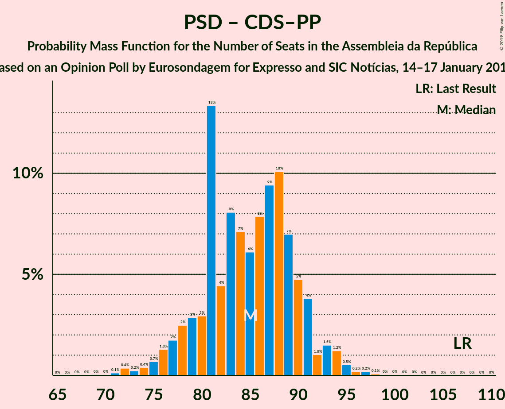

| Number of Seats | Probability | Accumulated | Special Marks |
|:---------------:|:-----------:|:-----------:|:-------------:|
| 69 | 0% | 100% |  |
| 70 | 0% | 99.9% |  |
| 71 | 0.1% | 99.9% |  |
| 72 | 0.4% | 99.8% |  |
| 73 | 0.2% | 99.4% |  |
| 74 | 0.4% | 99.2% |  |
| 75 | 0.7% | 98.8% |  |
| 76 | 1.3% | 98% |  |
| 77 | 2% | 97% |  |
| 78 | 2% | 95% |  |
| 79 | 3% | 93% |  |
| 80 | 3% | 90% |  |
| 81 | 13% | 87% |  |
| 82 | 4% | 73% |  |
| 83 | 8% | 69% |  |
| 84 | 7% | 61% |  |
| 85 | 6% | 54% | Median |
| 86 | 8% | 48% |  |
| 87 | 9% | 40% |  |
| 88 | 10% | 30% |  |
| 89 | 7% | 20% |  |
| 90 | 5% | 13% |  |
| 91 | 4% | 9% |  |
| 92 | 1.0% | 5% |  |
| 93 | 1.5% | 4% |  |
| 94 | 1.2% | 2% |  |
| 95 | 0.5% | 1.1% |  |
| 96 | 0.2% | 0.5% |  |
| 97 | 0.2% | 0.3% |  |
| 98 | 0.1% | 0.2% |  |
| 99 | 0% | 0.1% |  |
| 100 | 0% | 0% |  |
| 101 | 0% | 0% |  |
| 102 | 0% | 0% |  |
| 103 | 0% | 0% |  |
| 104 | 0% | 0% |  |
| 105 | 0% | 0% |  |
| 106 | 0% | 0% |  |
| 107 | 0% | 0% | Last Result |

## Technical Information

### Opinion Poll

+ **Polling firm:** Eurosondagem
+ **Commissioner(s):** Expresso and SIC
+ **Fieldwork period:** 14–17 January 2018

### Calculations

+ **Sample size:** 1018
+ **Simulations done:** 131,072
+ **Error estimate:** 1.20%

