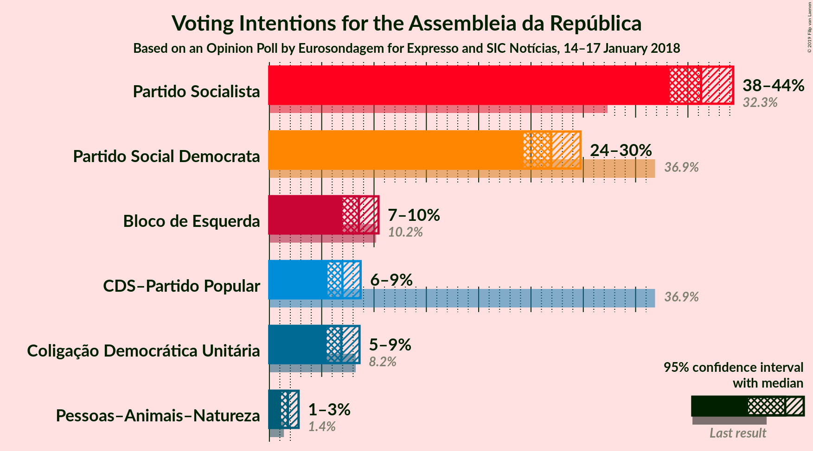
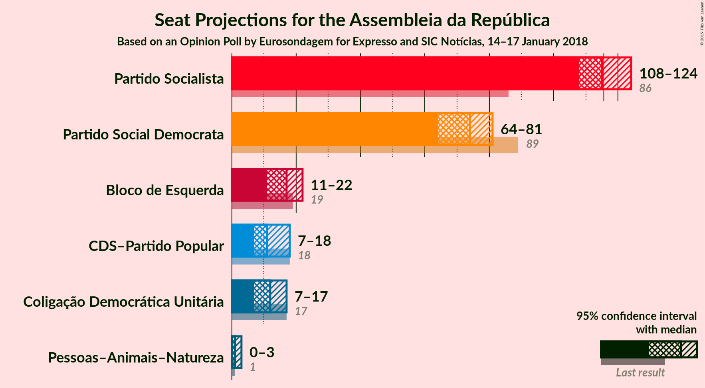
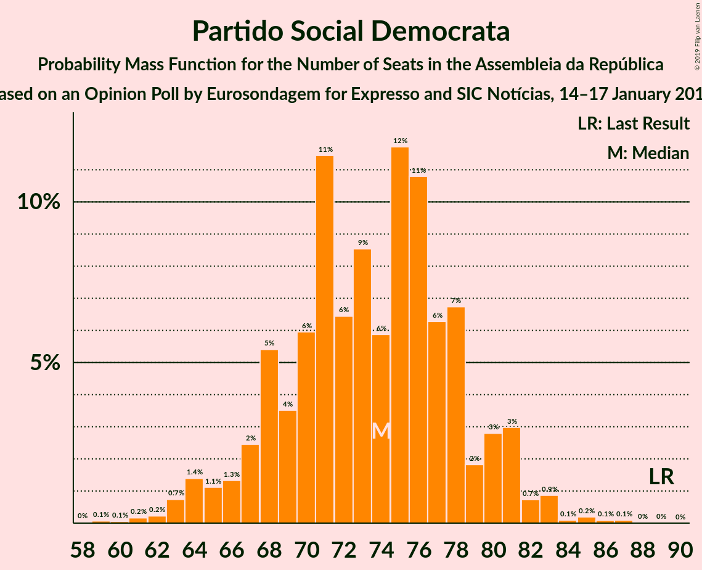
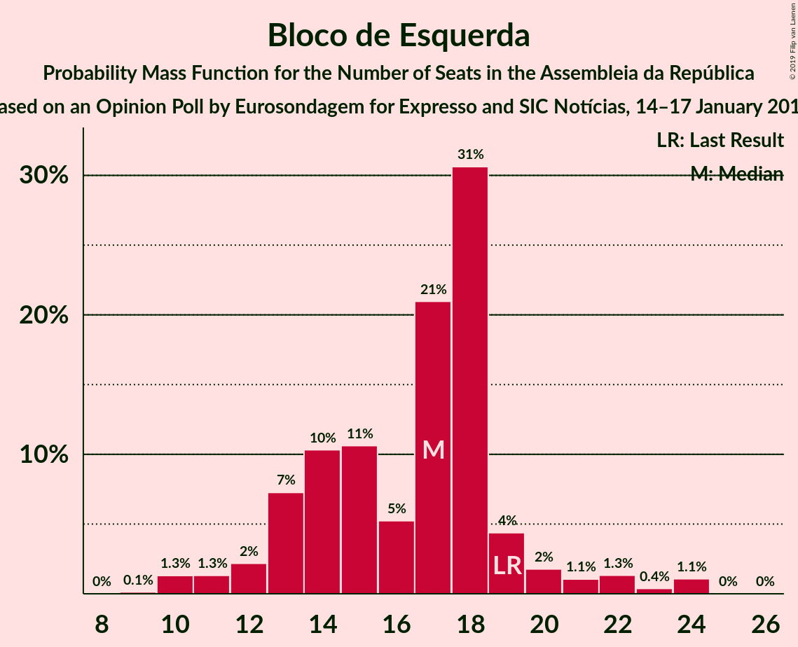
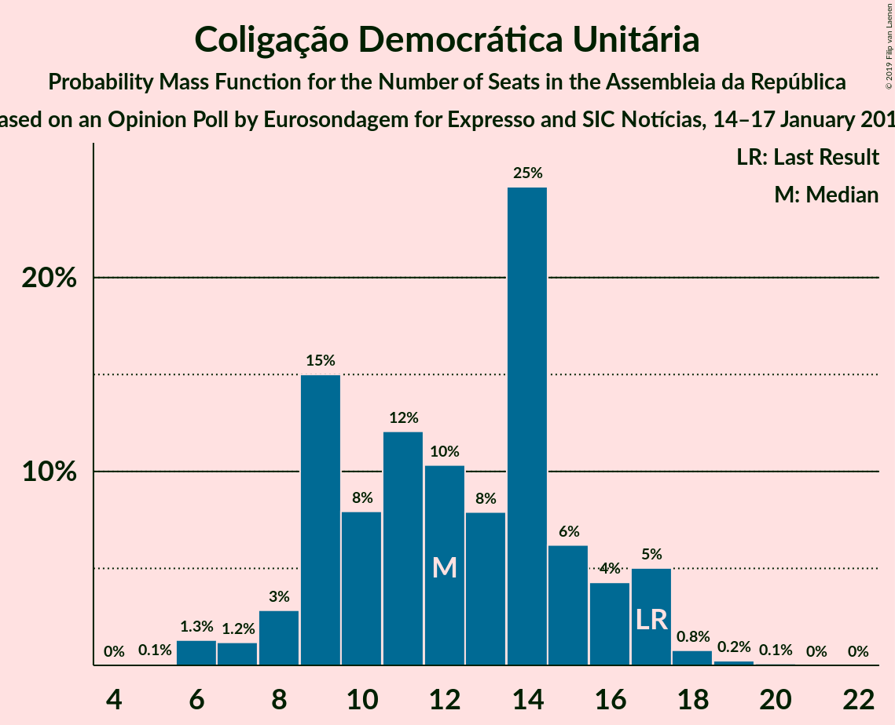
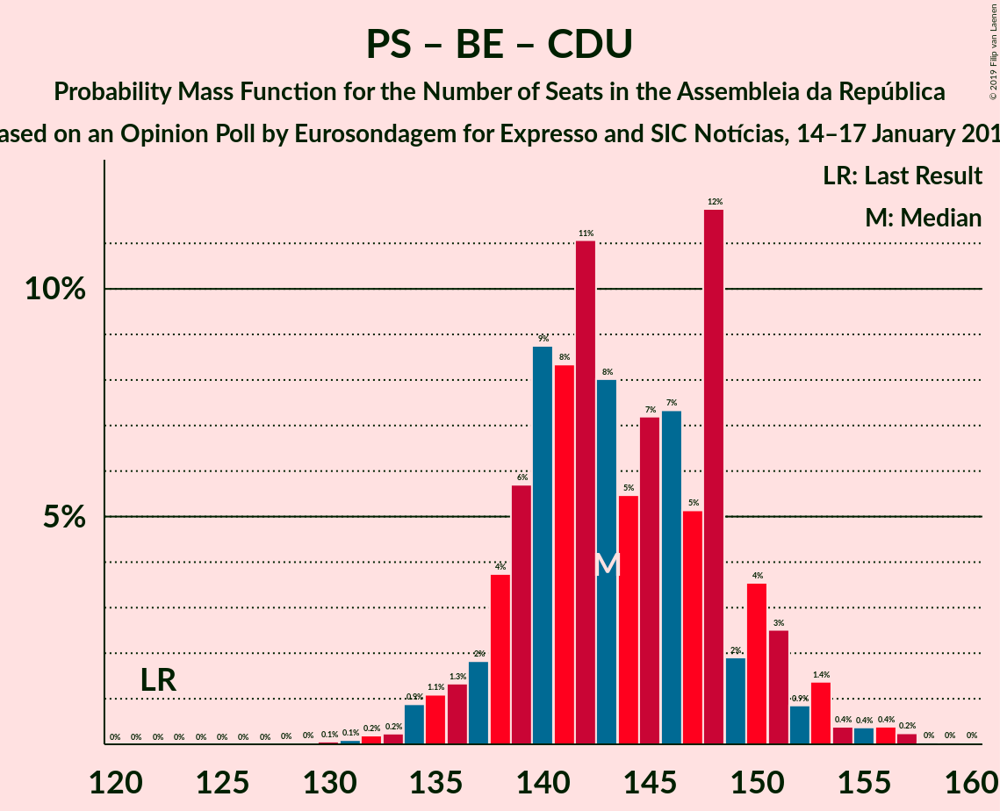

# Opinion Poll by Eurosondagem for Expresso and SIC, 14–17 January 2018

<a href="#voting-intentions">Voting Intentions</a> | <a href="#seats">Seats</a> | <a href="#coalitions">Coalitions</a> | <a href="#technical-information">Technical Information</a>

## Voting Intentions

### Confidence Intervals

| Party | Last Result | Poll Result | 80% Confidence Interval | 90% Confidence Interval | 95% Confidence Interval | 99% Confidence Interval |
|:-----:|:-----------:|:-----------:|:-----------------------:|:-----------------------:|:-----------------------:|:-----------------------:|
| Partido Socialista | 32.3% | 41.3% | 39.3–43.3% |38.7–43.8% |38.3–44.3% |37.3–45.3% |
| Partido Social Democrata | 36.9% | 26.9% | 25.2–28.8% |24.7–29.3% |24.3–29.7% |23.5–30.6% |
| Bloco de Esquerda | 10.2% | 8.5% | 7.5–9.8% |7.2–10.1% |7.0–10.4% |6.5–11.1% |
| CDS–Partido Popular | 36.9% | 7.0% | 6.1–8.1% |5.8–8.4% |5.6–8.7% |5.2–9.3% |
| Coligação Democrática Unitária | 8.2% | 6.9% | 6.0–8.0% |5.7–8.3% |5.5–8.6% |5.1–9.2% |
| Pessoas–Animais–Natureza | 1.4% | 1.8% | 1.3–2.4% |1.2–2.6% |1.1–2.8% |0.9–3.1% |

*Note:* The poll result column reflects the actual value used in the calculations. Published results may vary slightly, and in addition be rounded to fewer digits.

## Seats

### Confidence Intervals

| Party | Last Result | Median | 80% Confidence Interval | 90% Confidence Interval | 95% Confidence Interval | 99% Confidence Interval |
|:-----:|:-----------:|:------:|:-----------------------:|:-----------------------:|:-----------------------:|:-----------------------:|
| <a href="#partido-socialista">Partido Socialista</a> | 86 | 120 | 116–121 |116–122 |116–123 |103–124 |
| <a href="#partido-social-democrata">Partido Social Democrata</a> | 89 | 70 | 69–73 |69–73 |61–73 |60–80 |
| <a href="#bloco-de-esquerda">Bloco de Esquerda</a> | 19 | 15 | 14–22 |13–22 |12–24 |10–24 |
| <a href="#cds–partido-popular">CDS–Partido Popular</a> | 18 | 19 | 10–19 |10–19 |9–19 |8–19 |
| <a href="#coligação-democrática-unitária">Coligação Democrática Unitária</a> | 17 | 6 | 6–11 |6–12 |6–18 |6–18 |
| <a href="#pessoas–animais–natureza">Pessoas–Animais–Natureza</a> | 1 | 1 | 0–1 |0–2 |0–2 |0–4 |

### Partido Socialista

*For a full overview of the results for this party, see the [Partido Socialista](party-partidosocialista.html) page.*

| Number of Seats | Probability | Accumulated | Special Marks |
|:---------------:|:-----------:|:-----------:|:-------------:|
| 86 | 0% | 100% | Last Result |
| 87 | 0% | 100% |  |
| 88 | 0% | 100% |  |
| 89 | 0% | 100% |  |
| 90 | 0% | 100% |  |
| 91 | 0% | 100% |  |
| 92 | 0% | 100% |  |
| 93 | 0% | 100% |  |
| 94 | 0% | 100% |  |
| 95 | 0% | 100% |  |
| 96 | 0% | 100% |  |
| 97 | 0% | 100% |  |
| 98 | 0% | 100% |  |
| 99 | 0% | 100% |  |
| 100 | 0% | 100% |  |
| 101 | 0.1% | 99.9% |  |
| 102 | 0% | 99.8% |  |
| 103 | 0.3% | 99.8% |  |
| 104 | 0.6% | 99.5% |  |
| 105 | 0% | 98.8% |  |
| 106 | 0.1% | 98.8% |  |
| 107 | 0.7% | 98.7% |  |
| 108 | 0.2% | 98% |  |
| 109 | 0% | 98% |  |
| 110 | 0% | 98% |  |
| 111 | 0.1% | 98% |  |
| 112 | 0% | 98% |  |
| 113 | 0% | 98% |  |
| 114 | 0% | 98% |  |
| 115 | 0% | 98% |  |
| 116 | 13% | 98% | Majority |
| 117 | 11% | 85% |  |
| 118 | 0% | 74% |  |
| 119 | 2% | 74% |  |
| 120 | 59% | 72% | Median |
| 121 | 4% | 13% |  |
| 122 | 7% | 10% |  |
| 123 | 1.4% | 3% |  |
| 124 | 1.0% | 1.2% |  |
| 125 | 0.1% | 0.2% |  |
| 126 | 0% | 0.1% |  |
| 127 | 0.1% | 0.1% |  |
| 128 | 0% | 0% |  |

### Partido Social Democrata

*For a full overview of the results for this party, see the [Partido Social Democrata](party-partidosocialdemocrata.html) page.*

| Number of Seats | Probability | Accumulated | Special Marks |
|:---------------:|:-----------:|:-----------:|:-------------:|
| 60 | 1.1% | 100% |  |
| 61 | 1.4% | 98.8% |  |
| 62 | 0.2% | 97% |  |
| 63 | 0% | 97% |  |
| 64 | 0% | 97% |  |
| 65 | 0% | 97% |  |
| 66 | 0.1% | 97% |  |
| 67 | 0.5% | 97% |  |
| 68 | 0.2% | 97% |  |
| 69 | 20% | 96% |  |
| 70 | 51% | 77% | Median |
| 71 | 2% | 26% |  |
| 72 | 3% | 24% |  |
| 73 | 19% | 21% |  |
| 74 | 0% | 2% |  |
| 75 | 0.8% | 2% |  |
| 76 | 0.2% | 2% |  |
| 77 | 0.1% | 1.3% |  |
| 78 | 0% | 1.2% |  |
| 79 | 0% | 1.2% |  |
| 80 | 0.9% | 1.2% |  |
| 81 | 0% | 0.2% |  |
| 82 | 0% | 0.2% |  |
| 83 | 0% | 0.2% |  |
| 84 | 0% | 0.2% |  |
| 85 | 0.1% | 0.2% |  |
| 86 | 0% | 0.1% |  |
| 87 | 0% | 0.1% |  |
| 88 | 0% | 0.1% |  |
| 89 | 0% | 0% | Last Result |

### Bloco de Esquerda

*For a full overview of the results for this party, see the [Bloco de Esquerda](party-blocodeesquerda.html) page.*

| Number of Seats | Probability | Accumulated | Special Marks |
|:---------------:|:-----------:|:-----------:|:-------------:|
| 10 | 2% | 100% |  |
| 11 | 0% | 98% |  |
| 12 | 3% | 98% |  |
| 13 | 2% | 96% |  |
| 14 | 39% | 93% |  |
| 15 | 20% | 55% | Median |
| 16 | 0.2% | 35% |  |
| 17 | 3% | 35% |  |
| 18 | 20% | 31% |  |
| 19 | 0.1% | 12% | Last Result |
| 20 | 0.1% | 12% |  |
| 21 | 0.1% | 12% |  |
| 22 | 7% | 11% |  |
| 23 | 0% | 5% |  |
| 24 | 5% | 5% |  |
| 25 | 0% | 0% |  |

### CDS–Partido Popular

*For a full overview of the results for this party, see the [CDS–Partido Popular](party-cds–partidopopular.html) page.*

| Number of Seats | Probability | Accumulated | Special Marks |
|:---------------:|:-----------:|:-----------:|:-------------:|
| 7 | 0.1% | 100% |  |
| 8 | 1.0% | 99.9% |  |
| 9 | 3% | 98.9% |  |
| 10 | 12% | 96% |  |
| 11 | 11% | 85% |  |
| 12 | 8% | 73% |  |
| 13 | 0.2% | 65% |  |
| 14 | 0% | 65% |  |
| 15 | 0% | 65% |  |
| 16 | 0.1% | 65% |  |
| 17 | 0% | 65% |  |
| 18 | 4% | 65% | Last Result |
| 19 | 61% | 61% | Median |
| 20 | 0% | 0% |  |

### Coligação Democrática Unitária

*For a full overview of the results for this party, see the [Coligação Democrática Unitária](party-coligaçãodemocráticaunitária.html) page.*

| Number of Seats | Probability | Accumulated | Special Marks |
|:---------------:|:-----------:|:-----------:|:-------------:|
| 6 | 70% | 100% | Median |
| 7 | 0.2% | 30% |  |
| 8 | 0% | 30% |  |
| 9 | 0% | 30% |  |
| 10 | 0% | 30% |  |
| 11 | 25% | 30% |  |
| 12 | 0.1% | 5% |  |
| 13 | 0.2% | 5% |  |
| 14 | 0.1% | 5% |  |
| 15 | 0% | 5% |  |
| 16 | 0.7% | 5% |  |
| 17 | 1.1% | 4% | Last Result |
| 18 | 2% | 3% |  |
| 19 | 0% | 0.3% |  |
| 20 | 0% | 0.3% |  |
| 21 | 0.3% | 0.3% |  |
| 22 | 0% | 0% |  |

### Pessoas–Animais–Natureza

*For a full overview of the results for this party, see the [Pessoas–Animais–Natureza](party-pessoas–animais–natureza.html) page.*

| Number of Seats | Probability | Accumulated | Special Marks |
|:---------------:|:-----------:|:-----------:|:-------------:|
| 0 | 35% | 100% |  |
| 1 | 60% | 65% | Last Result, Median |
| 2 | 3% | 6% |  |
| 3 | 1.1% | 2% |  |
| 4 | 1.0% | 1.1% |  |
| 5 | 0% | 0.1% |  |
| 6 | 0.1% | 0.1% |  |
| 7 | 0% | 0% |  |

## Coalitions

### Confidence Intervals

| Coalition | Last Result | Median | Majority? | 80% Confidence Interval | 90% Confidence Interval | 95% Confidence Interval | 99% Confidence Interval |
|:---------:|:-----------:|:------:|:---------:|:-----------------------:|:-----------------------:|:-----------------------:|:-----------------------:|
| Partido Socialista – Bloco de Esquerda – Coligação Democrática Unitária | 122 | 141 | 100% | 140–150 | 140–150 | 139–158 | 138–159 |
| Partido Socialista – Bloco de Esquerda | 105 | 134 | 99.9% | 134–144 | 128–144 | 128–144 | 121–144 |
| Partido Socialista – Coligação Democrática Unitária | 103 | 126 | 99.9% | 126–128 | 126–128 | 126–141 | 120–142 |
| Partido Socialista | 86 | 120 | 98% | 116–121 | 116–122 | 116–123 | 103–124 |
| Partido Social Democrata – CDS–Partido Popular | 107 | 88 | 0% | 80–89 | 80–90 | 70–91 | 69–91 |

### Partido Socialista – Bloco de Esquerda – Coligação Democrática Unitária

| Number of Seats | Probability | Accumulated | Special Marks |
|:---------------:|:-----------:|:-----------:|:-------------:|
| 122 | 0% | 100% | Last Result |
| 123 | 0% | 100% |  |
| 124 | 0.1% | 100% |  |
| 125 | 0% | 99.9% |  |
| 126 | 0% | 99.9% |  |
| 127 | 0% | 99.9% |  |
| 128 | 0% | 99.9% |  |
| 129 | 0% | 99.9% |  |
| 130 | 0% | 99.9% |  |
| 131 | 0% | 99.9% |  |
| 132 | 0% | 99.9% |  |
| 133 | 0% | 99.9% |  |
| 134 | 0% | 99.9% |  |
| 135 | 0% | 99.9% |  |
| 136 | 0% | 99.9% |  |
| 137 | 0% | 99.8% |  |
| 138 | 0.6% | 99.8% |  |
| 139 | 3% | 99.2% |  |
| 140 | 39% | 96% |  |
| 141 | 24% | 57% | Median |
| 142 | 0.8% | 34% |  |
| 143 | 0.1% | 33% |  |
| 144 | 0% | 33% |  |
| 145 | 8% | 33% |  |
| 146 | 10% | 25% |  |
| 147 | 0% | 14% |  |
| 148 | 0% | 14% |  |
| 149 | 0% | 14% |  |
| 150 | 11% | 14% |  |
| 151 | 0% | 3% |  |
| 152 | 0% | 3% |  |
| 153 | 0% | 3% |  |
| 154 | 0% | 3% |  |
| 155 | 0.2% | 3% |  |
| 156 | 0% | 3% |  |
| 157 | 0.1% | 3% |  |
| 158 | 1.4% | 3% |  |
| 159 | 1.1% | 1.1% |  |
| 160 | 0% | 0% |  |

### Partido Socialista – Bloco de Esquerda

| Number of Seats | Probability | Accumulated | Special Marks |
|:---------------:|:-----------:|:-----------:|:-------------:|
| 105 | 0% | 100% | Last Result |
| 106 | 0% | 100% |  |
| 107 | 0% | 100% |  |
| 108 | 0% | 100% |  |
| 109 | 0% | 100% |  |
| 110 | 0% | 100% |  |
| 111 | 0% | 100% |  |
| 112 | 0% | 100% |  |
| 113 | 0% | 100% |  |
| 114 | 0% | 100% |  |
| 115 | 0.1% | 100% |  |
| 116 | 0% | 99.9% | Majority |
| 117 | 0% | 99.9% |  |
| 118 | 0% | 99.9% |  |
| 119 | 0.1% | 99.8% |  |
| 120 | 0% | 99.8% |  |
| 121 | 0.3% | 99.8% |  |
| 122 | 0.6% | 99.5% |  |
| 123 | 0.1% | 98.8% |  |
| 124 | 0.7% | 98.7% |  |
| 125 | 0% | 98% |  |
| 126 | 0% | 98% |  |
| 127 | 0.3% | 98% |  |
| 128 | 3% | 98% |  |
| 129 | 4% | 95% |  |
| 130 | 0% | 91% |  |
| 131 | 0% | 91% |  |
| 132 | 0% | 91% |  |
| 133 | 0% | 91% |  |
| 134 | 43% | 91% |  |
| 135 | 34% | 49% | Median |
| 136 | 0.5% | 15% |  |
| 137 | 0.1% | 14% |  |
| 138 | 0% | 14% |  |
| 139 | 0.1% | 14% |  |
| 140 | 1.4% | 14% |  |
| 141 | 1.0% | 13% |  |
| 142 | 0.1% | 12% |  |
| 143 | 0% | 12% |  |
| 144 | 11% | 12% |  |
| 145 | 0.1% | 0.1% |  |
| 146 | 0% | 0% |  |

### Partido Socialista – Coligação Democrática Unitária

| Number of Seats | Probability | Accumulated | Special Marks |
|:---------------:|:-----------:|:-----------:|:-------------:|
| 103 | 0% | 100% | Last Result |
| 104 | 0% | 100% |  |
| 105 | 0% | 100% |  |
| 106 | 0% | 100% |  |
| 107 | 0% | 100% |  |
| 108 | 0% | 99.9% |  |
| 109 | 0% | 99.9% |  |
| 110 | 0% | 99.9% |  |
| 111 | 0% | 99.9% |  |
| 112 | 0% | 99.9% |  |
| 113 | 0% | 99.9% |  |
| 114 | 0% | 99.9% |  |
| 115 | 0% | 99.9% |  |
| 116 | 0% | 99.9% | Majority |
| 117 | 0% | 99.9% |  |
| 118 | 0.1% | 99.9% |  |
| 119 | 0% | 99.8% |  |
| 120 | 0.3% | 99.8% |  |
| 121 | 0.8% | 99.5% |  |
| 122 | 0% | 98.7% |  |
| 123 | 0.9% | 98.7% |  |
| 124 | 0.1% | 98% |  |
| 125 | 0% | 98% |  |
| 126 | 59% | 98% | Median |
| 127 | 16% | 38% |  |
| 128 | 18% | 22% |  |
| 129 | 0% | 4% |  |
| 130 | 2% | 4% |  |
| 131 | 0% | 3% |  |
| 132 | 0% | 3% |  |
| 133 | 0% | 3% |  |
| 134 | 0% | 3% |  |
| 135 | 0% | 3% |  |
| 136 | 0% | 3% |  |
| 137 | 0% | 3% |  |
| 138 | 0% | 3% |  |
| 139 | 0% | 3% |  |
| 140 | 0.3% | 3% |  |
| 141 | 2% | 3% |  |
| 142 | 1.0% | 1.0% |  |
| 143 | 0% | 0% |  |

### Partido Socialista

| Number of Seats | Probability | Accumulated | Special Marks |
|:---------------:|:-----------:|:-----------:|:-------------:|
| 86 | 0% | 100% | Last Result |
| 87 | 0% | 100% |  |
| 88 | 0% | 100% |  |
| 89 | 0% | 100% |  |
| 90 | 0% | 100% |  |
| 91 | 0% | 100% |  |
| 92 | 0% | 100% |  |
| 93 | 0% | 100% |  |
| 94 | 0% | 100% |  |
| 95 | 0% | 100% |  |
| 96 | 0% | 100% |  |
| 97 | 0% | 100% |  |
| 98 | 0% | 100% |  |
| 99 | 0% | 100% |  |
| 100 | 0% | 100% |  |
| 101 | 0.1% | 99.9% |  |
| 102 | 0% | 99.8% |  |
| 103 | 0.3% | 99.8% |  |
| 104 | 0.6% | 99.5% |  |
| 105 | 0% | 98.8% |  |
| 106 | 0.1% | 98.8% |  |
| 107 | 0.7% | 98.7% |  |
| 108 | 0.2% | 98% |  |
| 109 | 0% | 98% |  |
| 110 | 0% | 98% |  |
| 111 | 0.1% | 98% |  |
| 112 | 0% | 98% |  |
| 113 | 0% | 98% |  |
| 114 | 0% | 98% |  |
| 115 | 0% | 98% |  |
| 116 | 13% | 98% | Majority |
| 117 | 11% | 85% |  |
| 118 | 0% | 74% |  |
| 119 | 2% | 74% |  |
| 120 | 59% | 72% | Median |
| 121 | 4% | 13% |  |
| 122 | 7% | 10% |  |
| 123 | 1.4% | 3% |  |
| 124 | 1.0% | 1.2% |  |
| 125 | 0.1% | 0.2% |  |
| 126 | 0% | 0.1% |  |
| 127 | 0.1% | 0.1% |  |
| 128 | 0% | 0% |  |

### Partido Social Democrata – CDS–Partido Popular

| Number of Seats | Probability | Accumulated | Special Marks |
|:---------------:|:-----------:|:-----------:|:-------------:|
| 68 | 0.1% | 100% |  |
| 69 | 1.0% | 99.9% |  |
| 70 | 1.4% | 98.9% |  |
| 71 | 0.1% | 97% |  |
| 72 | 0% | 97% |  |
| 73 | 0.2% | 97% |  |
| 74 | 0% | 97% |  |
| 75 | 0% | 97% |  |
| 76 | 0% | 97% |  |
| 77 | 0% | 97% |  |
| 78 | 0% | 97% |  |
| 79 | 0% | 97% |  |
| 80 | 11% | 97% |  |
| 81 | 0% | 86% |  |
| 82 | 0% | 86% |  |
| 83 | 0.1% | 86% |  |
| 84 | 11% | 86% |  |
| 85 | 8% | 75% |  |
| 86 | 1.4% | 67% |  |
| 87 | 0.2% | 66% |  |
| 88 | 24% | 65% |  |
| 89 | 36% | 41% | Median |
| 90 | 2% | 5% |  |
| 91 | 3% | 3% |  |
| 92 | 0.3% | 0.4% |  |
| 93 | 0% | 0.1% |  |
| 94 | 0% | 0.1% |  |
| 95 | 0% | 0.1% |  |
| 96 | 0% | 0.1% |  |
| 97 | 0% | 0.1% |  |
| 98 | 0% | 0.1% |  |
| 99 | 0% | 0.1% |  |
| 100 | 0% | 0.1% |  |
| 101 | 0% | 0.1% |  |
| 102 | 0% | 0.1% |  |
| 103 | 0% | 0.1% |  |
| 104 | 0.1% | 0.1% |  |
| 105 | 0% | 0% |  |
| 106 | 0% | 0% |  |
| 107 | 0% | 0% | Last Result |

## Technical Information

### Opinion Poll

+ **Polling firm:** Eurosondagem
+ **Commissioner(s):** Expresso and SIC
+ **Fieldwork period:** 14–17 January 2018

### Calculations

+ **Sample size:** 1018
+ **Simulations done:** 1,024
+ **Error estimate:** 1.40%

