# Opinion Poll by Aximage for Correio da Manhã, 3–6 February 2018

<a href="#voting-intentions">Voting Intentions</a> | <a href="#seats">Seats</a> | <a href="#coalitions">Coalitions</a> | <a href="#technical-information">Technical Information</a>

## Voting Intentions

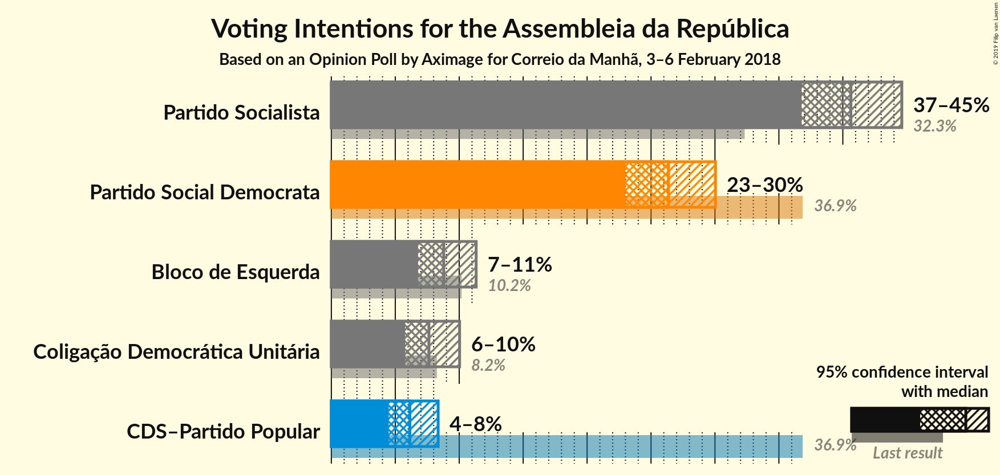

### Confidence Intervals

| Party | Last Result | Poll Result | 80% Confidence Interval | 90% Confidence Interval | 95% Confidence Interval | 99% Confidence Interval |
|:-----:|:-----------:|:-----------:|:-----------------------:|:-----------------------:|:-----------------------:|:-----------------------:|
| Partido Socialista | 32.3% | 40.6% | 38.1–43.2% |37.4–44.0% |36.8–44.6% |35.6–45.9% |
| Partido Social Democrata | 36.9% | 26.4% | 24.2–28.8% |23.5–29.4% |23.0–30.0% |22.0–31.2% |
| Bloco de Esquerda | 10.2% | 8.8% | 7.5–10.4% |7.1–10.9% |6.8–11.3% |6.2–12.2% |
| Coligação Democrática Unitária | 8.2% | 7.6% | 6.4–9.2% |6.1–9.6% |5.8–10.0% |5.2–10.8% |
| CDS–Partido Popular | 36.9% | 6.1% | 5.0–7.6% |4.7–8.0% |4.5–8.4% |4.0–9.1% |

*Note:* The poll result column reflects the actual value used in the calculations. Published results may vary slightly, and in addition be rounded to fewer digits.

## Seats

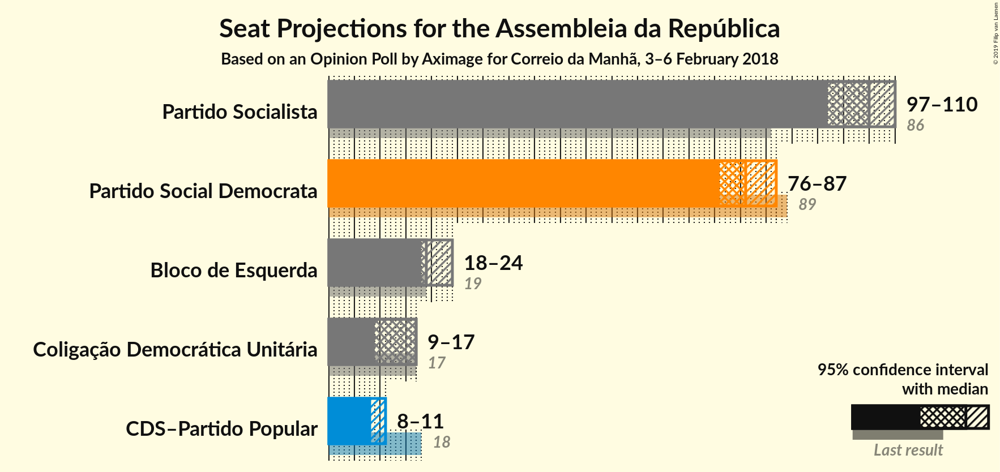

### Confidence Intervals

| Party | Last Result | Median | 80% Confidence Interval | 90% Confidence Interval | 95% Confidence Interval | 99% Confidence Interval |
|:-----:|:-----------:|:------:|:-----------------------:|:-----------------------:|:-----------------------:|:-----------------------:|
| <a href="#partido-socialista">Partido Socialista</a> | 86 | 105 | 104–109 |102–109 |97–110 |97–110 |
| <a href="#partido-social-democrata">Partido Social Democrata</a> | 89 | 81 | 76–81 |76–81 |76–87 |76–88 |
| <a href="#bloco-de-esquerda">Bloco de Esquerda</a> | 19 | 19 | 18–24 |18–24 |18–24 |18–24 |
| <a href="#coligação-democrática-unitária">Coligação Democrática Unitária</a> | 17 | 17 | 10–17 |10–17 |9–17 |9–17 |
| <a href="#cds–partido-popular">CDS–Partido Popular</a> | 18 | 8 | 8–11 |8–11 |8–11 |6–11 |

### Partido Socialista

*For a full overview of the results for this party, see the [Partido Socialista](party-partidosocialista.html) page.*

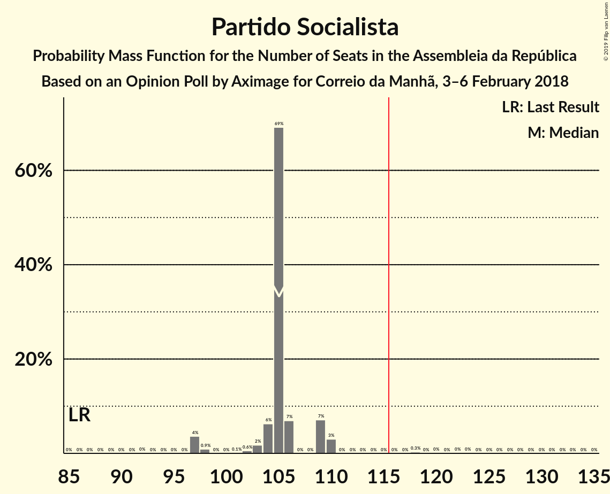

| Number of Seats | Probability | Accumulated | Special Marks |
|:---------------:|:-----------:|:-----------:|:-------------:|
| 86 | 0% | 100% | Last Result |
| 87 | 0% | 100% |  |
| 88 | 0% | 100% |  |
| 89 | 0% | 100% |  |
| 90 | 0% | 100% |  |
| 91 | 0% | 100% |  |
| 92 | 0% | 100% |  |
| 93 | 0% | 100% |  |
| 94 | 0% | 100% |  |
| 95 | 0% | 100% |  |
| 96 | 0% | 100% |  |
| 97 | 4% | 100% |  |
| 98 | 0.9% | 96% |  |
| 99 | 0% | 95% |  |
| 100 | 0% | 95% |  |
| 101 | 0.1% | 95% |  |
| 102 | 0.6% | 95% |  |
| 103 | 2% | 95% |  |
| 104 | 6% | 93% |  |
| 105 | 69% | 87% | Median |
| 106 | 7% | 18% |  |
| 107 | 0% | 11% |  |
| 108 | 0% | 11% |  |
| 109 | 7% | 11% |  |
| 110 | 3% | 3% |  |
| 111 | 0% | 0.5% |  |
| 112 | 0% | 0.5% |  |
| 113 | 0% | 0.5% |  |
| 114 | 0% | 0.5% |  |
| 115 | 0% | 0.5% |  |
| 116 | 0% | 0.5% | Majority |
| 117 | 0% | 0.5% |  |
| 118 | 0.3% | 0.5% |  |
| 119 | 0% | 0.2% |  |
| 120 | 0% | 0.2% |  |
| 121 | 0% | 0.1% |  |
| 122 | 0% | 0.1% |  |
| 123 | 0% | 0.1% |  |
| 124 | 0% | 0.1% |  |
| 125 | 0% | 0.1% |  |
| 126 | 0% | 0.1% |  |
| 127 | 0% | 0.1% |  |
| 128 | 0% | 0.1% |  |
| 129 | 0% | 0.1% |  |
| 130 | 0% | 0.1% |  |
| 131 | 0% | 0% |  |

### Partido Social Democrata

*For a full overview of the results for this party, see the [Partido Social Democrata](party-partidosocialdemocrata.html) page.*

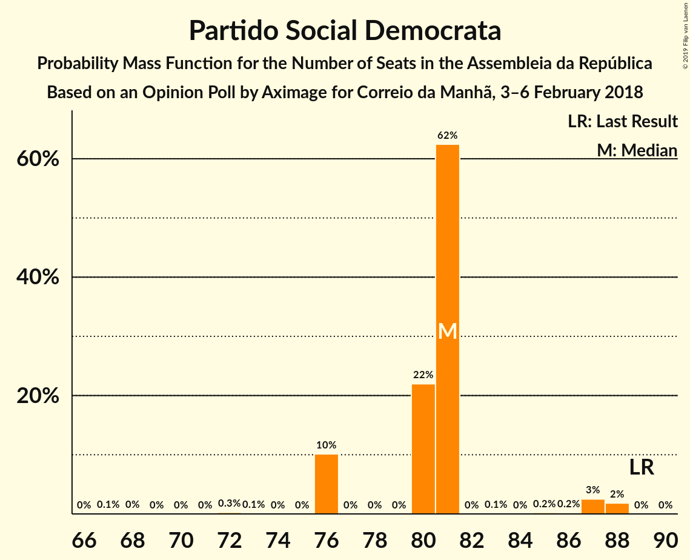

| Number of Seats | Probability | Accumulated | Special Marks |
|:---------------:|:-----------:|:-----------:|:-------------:|
| 67 | 0.1% | 100% |  |
| 68 | 0% | 99.9% |  |
| 69 | 0% | 99.9% |  |
| 70 | 0% | 99.9% |  |
| 71 | 0% | 99.8% |  |
| 72 | 0.3% | 99.8% |  |
| 73 | 0.1% | 99.6% |  |
| 74 | 0% | 99.5% |  |
| 75 | 0% | 99.5% |  |
| 76 | 10% | 99.5% |  |
| 77 | 0% | 89% |  |
| 78 | 0% | 89% |  |
| 79 | 0% | 89% |  |
| 80 | 22% | 89% |  |
| 81 | 62% | 67% | Median |
| 82 | 0% | 5% |  |
| 83 | 0.1% | 5% |  |
| 84 | 0% | 5% |  |
| 85 | 0.2% | 5% |  |
| 86 | 0.2% | 5% |  |
| 87 | 3% | 4% |  |
| 88 | 2% | 2% |  |
| 89 | 0% | 0% | Last Result |

### Bloco de Esquerda

*For a full overview of the results for this party, see the [Bloco de Esquerda](party-blocodeesquerda.html) page.*

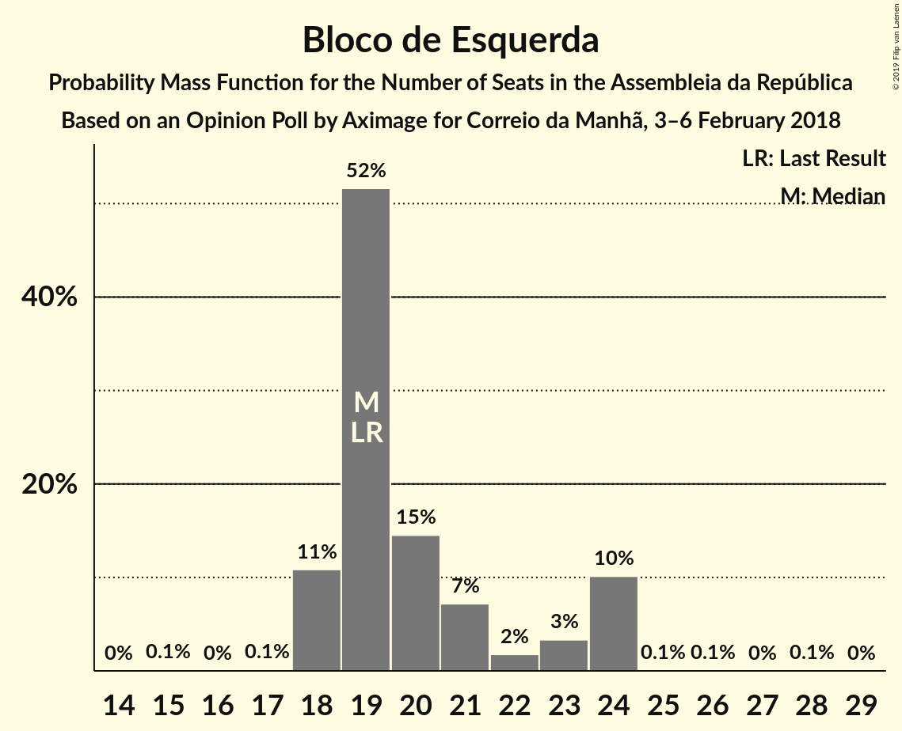

| Number of Seats | Probability | Accumulated | Special Marks |
|:---------------:|:-----------:|:-----------:|:-------------:|
| 15 | 0.1% | 100% |  |
| 16 | 0% | 99.8% |  |
| 17 | 0.1% | 99.8% |  |
| 18 | 11% | 99.7% |  |
| 19 | 52% | 89% | Last Result, Median |
| 20 | 15% | 37% |  |
| 21 | 7% | 23% |  |
| 22 | 2% | 15% |  |
| 23 | 3% | 14% |  |
| 24 | 10% | 10% |  |
| 25 | 0.1% | 0.3% |  |
| 26 | 0.1% | 0.2% |  |
| 27 | 0% | 0.1% |  |
| 28 | 0.1% | 0.1% |  |
| 29 | 0% | 0% |  |

### Coligação Democrática Unitária

*For a full overview of the results for this party, see the [Coligação Democrática Unitária](party-coligaçãodemocráticaunitária.html) page.*

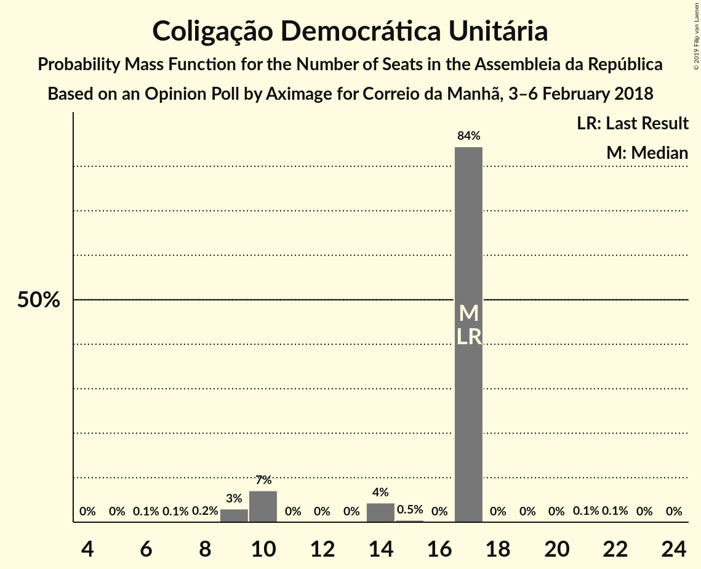

| Number of Seats | Probability | Accumulated | Special Marks |
|:---------------:|:-----------:|:-----------:|:-------------:|
| 6 | 0.1% | 100% |  |
| 7 | 0.1% | 99.9% |  |
| 8 | 0.2% | 99.9% |  |
| 9 | 3% | 99.7% |  |
| 10 | 7% | 97% |  |
| 11 | 0% | 90% |  |
| 12 | 0% | 90% |  |
| 13 | 0% | 90% |  |
| 14 | 4% | 90% |  |
| 15 | 0.5% | 85% |  |
| 16 | 0% | 85% |  |
| 17 | 84% | 85% | Last Result, Median |
| 18 | 0% | 0.3% |  |
| 19 | 0% | 0.3% |  |
| 20 | 0% | 0.3% |  |
| 21 | 0.1% | 0.3% |  |
| 22 | 0.1% | 0.1% |  |
| 23 | 0% | 0% |  |

### CDS–Partido Popular

*For a full overview of the results for this party, see the [CDS–Partido Popular](party-cds–partidopopular.html) page.*

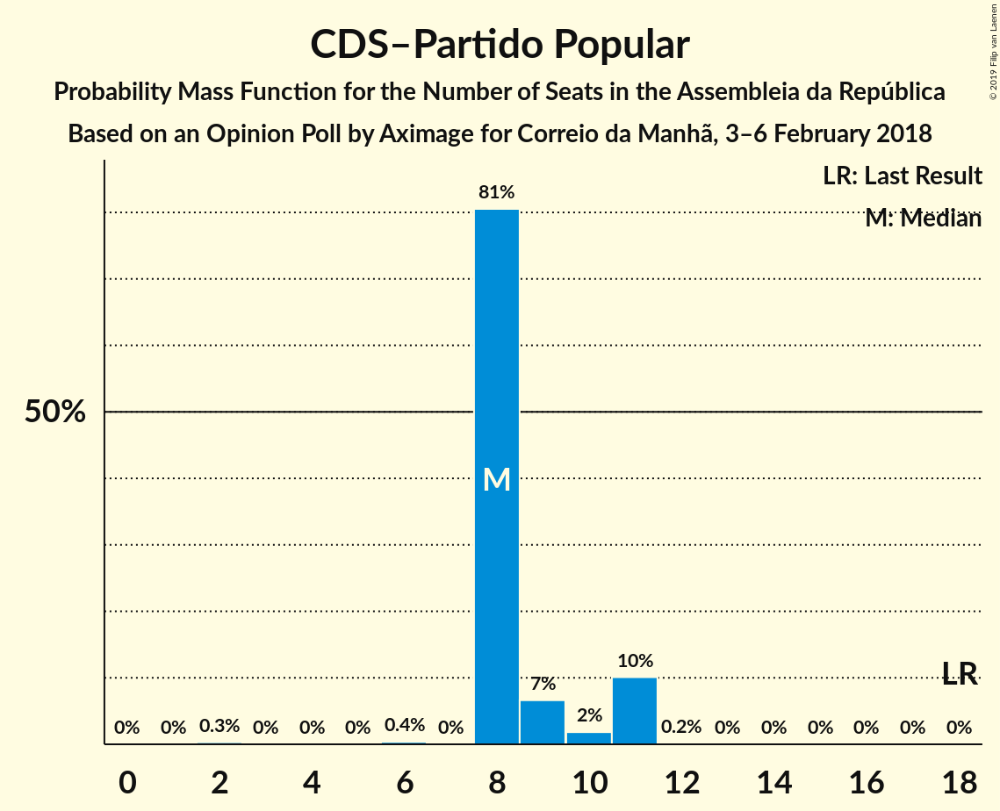

| Number of Seats | Probability | Accumulated | Special Marks |
|:---------------:|:-----------:|:-----------:|:-------------:|
| 2 | 0.3% | 100% |  |
| 3 | 0% | 99.7% |  |
| 4 | 0% | 99.7% |  |
| 5 | 0% | 99.7% |  |
| 6 | 0.4% | 99.7% |  |
| 7 | 0% | 99.3% |  |
| 8 | 81% | 99.3% | Median |
| 9 | 7% | 19% |  |
| 10 | 2% | 12% |  |
| 11 | 10% | 10% |  |
| 12 | 0.2% | 0.2% |  |
| 13 | 0% | 0% |  |
| 14 | 0% | 0% |  |
| 15 | 0% | 0% |  |
| 16 | 0% | 0% |  |
| 17 | 0% | 0% |  |
| 18 | 0% | 0% | Last Result |

## Coalitions

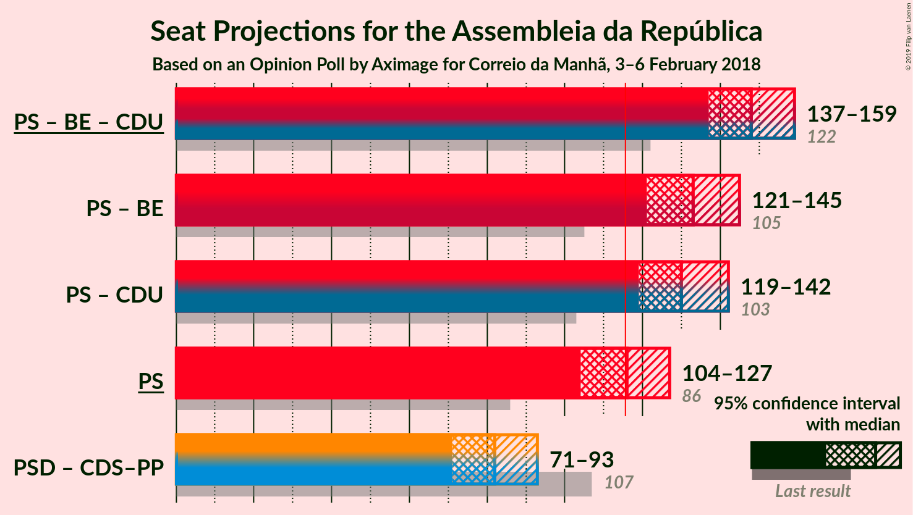

### Confidence Intervals

| Coalition | Last Result | Median | Majority? | 80% Confidence Interval | 90% Confidence Interval | 95% Confidence Interval | 99% Confidence Interval |
|:---------:|:-----------:|:------:|:---------:|:-----------------------:|:-----------------------:|:-----------------------:|:-----------------------:|
| Partido Socialista – Bloco de Esquerda – Coligação Democrática Unitária | 122 | 141 | 100% | 141–143 | 140–143 | 134–143 | 132–143 |
| Partido Socialista – Bloco de Esquerda | 105 | 124 | 100% | 124–133 | 123–133 | 120–134 | 118–134 |
| Partido Socialista – Coligação Democrática Unitária | 103 | 122 | 95% | 119–122 | 119–123 | 111–123 | 111–124 |
| Partido Socialista | 86 | 105 | 0.5% | 104–109 | 102–109 | 97–110 | 97–110 |
| Partido Social Democrata – CDS–Partido Popular | 107 | 89 | 0% | 87–89 | 87–90 | 87–96 | 87–98 |

### Partido Socialista – Bloco de Esquerda – Coligação Democrática Unitária

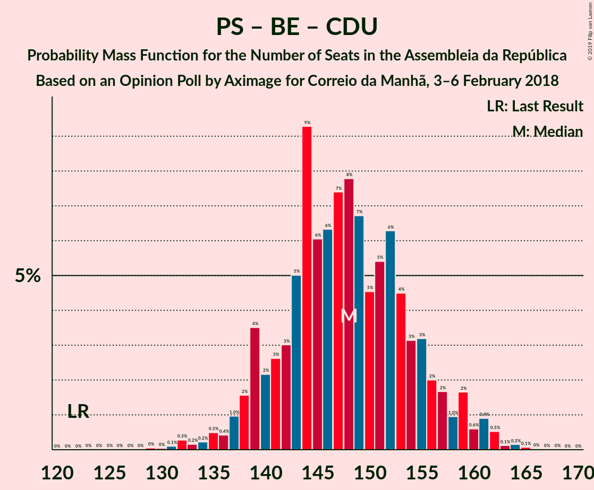

| Number of Seats | Probability | Accumulated | Special Marks |
|:---------------:|:-----------:|:-----------:|:-------------:|
| 122 | 0% | 100% | Last Result |
| 123 | 0% | 100% |  |
| 124 | 0% | 100% |  |
| 125 | 0% | 100% |  |
| 126 | 0% | 100% |  |
| 127 | 0% | 100% |  |
| 128 | 0% | 100% |  |
| 129 | 0% | 100% |  |
| 130 | 0% | 100% |  |
| 131 | 0% | 100% |  |
| 132 | 2% | 100% |  |
| 133 | 0% | 98% |  |
| 134 | 3% | 98% |  |
| 135 | 0.4% | 96% |  |
| 136 | 0% | 95% |  |
| 137 | 0% | 95% |  |
| 138 | 0% | 95% |  |
| 139 | 0.2% | 95% |  |
| 140 | 4% | 95% |  |
| 141 | 59% | 91% | Median |
| 142 | 22% | 33% |  |
| 143 | 10% | 11% |  |
| 144 | 0% | 0.5% |  |
| 145 | 0% | 0.5% |  |
| 146 | 0% | 0.5% |  |
| 147 | 0% | 0.5% |  |
| 148 | 0% | 0.5% |  |
| 149 | 0% | 0.5% |  |
| 150 | 0% | 0.5% |  |
| 151 | 0% | 0.5% |  |
| 152 | 0% | 0.5% |  |
| 153 | 0% | 0.5% |  |
| 154 | 0% | 0.4% |  |
| 155 | 0.1% | 0.4% |  |
| 156 | 0.3% | 0.4% |  |
| 157 | 0.1% | 0.1% |  |
| 158 | 0% | 0% |  |

### Partido Socialista – Bloco de Esquerda

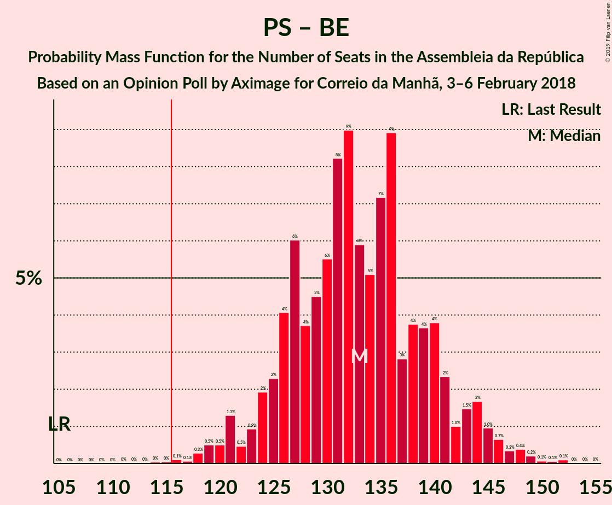

| Number of Seats | Probability | Accumulated | Special Marks |
|:---------------:|:-----------:|:-----------:|:-------------:|
| 105 | 0% | 100% | Last Result |
| 106 | 0% | 100% |  |
| 107 | 0% | 100% |  |
| 108 | 0% | 100% |  |
| 109 | 0% | 100% |  |
| 110 | 0% | 100% |  |
| 111 | 0% | 100% |  |
| 112 | 0% | 100% |  |
| 113 | 0% | 100% |  |
| 114 | 0% | 100% |  |
| 115 | 0% | 100% |  |
| 116 | 0% | 100% | Majority |
| 117 | 0.2% | 100% |  |
| 118 | 2% | 99.8% |  |
| 119 | 0% | 98% |  |
| 120 | 3% | 98% |  |
| 121 | 0% | 95% |  |
| 122 | 0% | 95% |  |
| 123 | 4% | 95% |  |
| 124 | 59% | 91% | Median |
| 125 | 22% | 33% |  |
| 126 | 0% | 11% |  |
| 127 | 0.1% | 11% |  |
| 128 | 0.1% | 11% |  |
| 129 | 0% | 11% |  |
| 130 | 0% | 11% |  |
| 131 | 0% | 11% |  |
| 132 | 0% | 11% |  |
| 133 | 7% | 11% |  |
| 134 | 3% | 3% |  |
| 135 | 0% | 0.5% |  |
| 136 | 0% | 0.5% |  |
| 137 | 0% | 0.5% |  |
| 138 | 0% | 0.5% |  |
| 139 | 0% | 0.5% |  |
| 140 | 0% | 0.5% |  |
| 141 | 0.3% | 0.5% |  |
| 142 | 0% | 0.1% |  |
| 143 | 0% | 0.1% |  |
| 144 | 0% | 0.1% |  |
| 145 | 0% | 0.1% |  |
| 146 | 0% | 0.1% |  |
| 147 | 0% | 0.1% |  |
| 148 | 0% | 0.1% |  |
| 149 | 0% | 0.1% |  |
| 150 | 0% | 0.1% |  |
| 151 | 0% | 0.1% |  |
| 152 | 0% | 0% |  |

### Partido Socialista – Coligação Democrática Unitária

| Number of Seats | Probability | Accumulated | Special Marks |
|:---------------:|:-----------:|:-----------:|:-------------:|
| 103 | 0% | 100% | Last Result |
| 104 | 0% | 100% |  |
| 105 | 0% | 100% |  |
| 106 | 0% | 100% |  |
| 107 | 0% | 100% |  |
| 108 | 0% | 100% |  |
| 109 | 0.1% | 100% |  |
| 110 | 0.1% | 99.9% |  |
| 111 | 3% | 99.9% |  |
| 112 | 1.1% | 96% |  |
| 113 | 0.1% | 95% |  |
| 114 | 0% | 95% |  |
| 115 | 0% | 95% |  |
| 116 | 0% | 95% | Majority |
| 117 | 0% | 95% |  |
| 118 | 0% | 95% |  |
| 119 | 10% | 95% |  |
| 120 | 2% | 85% |  |
| 121 | 6% | 83% |  |
| 122 | 69% | 77% | Median |
| 123 | 7% | 8% |  |
| 124 | 0.1% | 0.6% |  |
| 125 | 0% | 0.5% |  |
| 126 | 0% | 0.5% |  |
| 127 | 0% | 0.5% |  |
| 128 | 0% | 0.5% |  |
| 129 | 0% | 0.4% |  |
| 130 | 0% | 0.4% |  |
| 131 | 0% | 0.4% |  |
| 132 | 0.1% | 0.4% |  |
| 133 | 0.3% | 0.3% |  |
| 134 | 0% | 0.1% |  |
| 135 | 0% | 0.1% |  |
| 136 | 0% | 0.1% |  |
| 137 | 0% | 0.1% |  |
| 138 | 0% | 0.1% |  |
| 139 | 0% | 0.1% |  |
| 140 | 0% | 0.1% |  |
| 141 | 0% | 0% |  |

### Partido Socialista

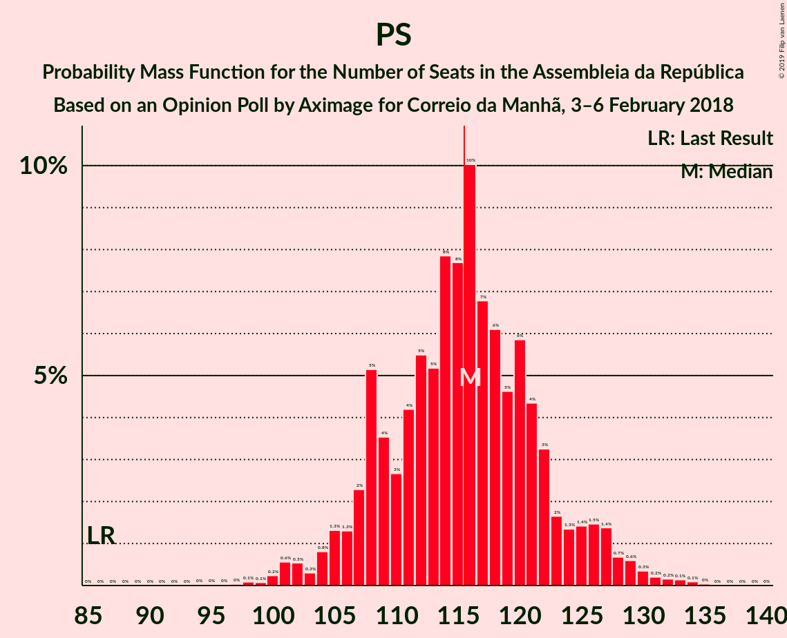

| Number of Seats | Probability | Accumulated | Special Marks |
|:---------------:|:-----------:|:-----------:|:-------------:|
| 86 | 0% | 100% | Last Result |
| 87 | 0% | 100% |  |
| 88 | 0% | 100% |  |
| 89 | 0% | 100% |  |
| 90 | 0% | 100% |  |
| 91 | 0% | 100% |  |
| 92 | 0% | 100% |  |
| 93 | 0% | 100% |  |
| 94 | 0% | 100% |  |
| 95 | 0% | 100% |  |
| 96 | 0% | 100% |  |
| 97 | 4% | 100% |  |
| 98 | 0.9% | 96% |  |
| 99 | 0% | 95% |  |
| 100 | 0% | 95% |  |
| 101 | 0.1% | 95% |  |
| 102 | 0.6% | 95% |  |
| 103 | 2% | 95% |  |
| 104 | 6% | 93% |  |
| 105 | 69% | 87% | Median |
| 106 | 7% | 18% |  |
| 107 | 0% | 11% |  |
| 108 | 0% | 11% |  |
| 109 | 7% | 11% |  |
| 110 | 3% | 3% |  |
| 111 | 0% | 0.5% |  |
| 112 | 0% | 0.5% |  |
| 113 | 0% | 0.5% |  |
| 114 | 0% | 0.5% |  |
| 115 | 0% | 0.5% |  |
| 116 | 0% | 0.5% | Majority |
| 117 | 0% | 0.5% |  |
| 118 | 0.3% | 0.5% |  |
| 119 | 0% | 0.2% |  |
| 120 | 0% | 0.2% |  |
| 121 | 0% | 0.1% |  |
| 122 | 0% | 0.1% |  |
| 123 | 0% | 0.1% |  |
| 124 | 0% | 0.1% |  |
| 125 | 0% | 0.1% |  |
| 126 | 0% | 0.1% |  |
| 127 | 0% | 0.1% |  |
| 128 | 0% | 0.1% |  |
| 129 | 0% | 0.1% |  |
| 130 | 0% | 0.1% |  |
| 131 | 0% | 0% |  |

### Partido Social Democrata – CDS–Partido Popular

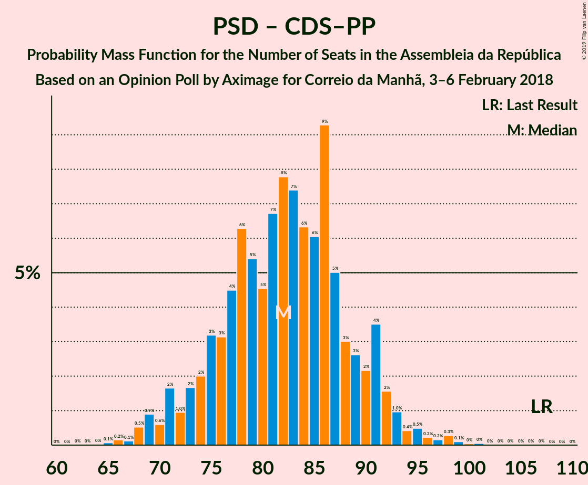

| Number of Seats | Probability | Accumulated | Special Marks |
|:---------------:|:-----------:|:-----------:|:-------------:|
| 73 | 0.1% | 100% |  |
| 74 | 0.3% | 99.9% |  |
| 75 | 0.1% | 99.6% |  |
| 76 | 0% | 99.6% |  |
| 77 | 0% | 99.6% |  |
| 78 | 0% | 99.5% |  |
| 79 | 0% | 99.5% |  |
| 80 | 0% | 99.5% |  |
| 81 | 0% | 99.5% |  |
| 82 | 0% | 99.5% |  |
| 83 | 0% | 99.5% |  |
| 84 | 0% | 99.5% |  |
| 85 | 0% | 99.5% |  |
| 86 | 0% | 99.5% |  |
| 87 | 10% | 99.5% |  |
| 88 | 22% | 89% |  |
| 89 | 59% | 67% | Median |
| 90 | 4% | 9% |  |
| 91 | 0.2% | 5% |  |
| 92 | 0% | 5% |  |
| 93 | 0% | 5% |  |
| 94 | 0% | 5% |  |
| 95 | 0.4% | 5% |  |
| 96 | 3% | 4% |  |
| 97 | 0% | 2% |  |
| 98 | 2% | 2% |  |
| 99 | 0% | 0% |  |
| 100 | 0% | 0% |  |
| 101 | 0% | 0% |  |
| 102 | 0% | 0% |  |
| 103 | 0% | 0% |  |
| 104 | 0% | 0% |  |
| 105 | 0% | 0% |  |
| 106 | 0% | 0% |  |
| 107 | 0% | 0% | Last Result |

## Technical Information

### Opinion Poll

+ **Polling firm:** Aximage
+ **Commissioner(s):** Correio da Manhã
+ **Fieldwork period:** 3–6 February 2018

### Calculations

+ **Sample size:** 603
+ **Simulations done:** 1,024
+ **Error estimate:** 2.04%

