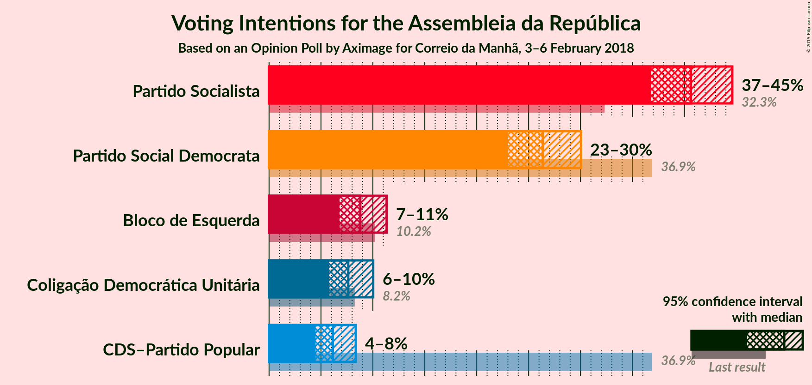
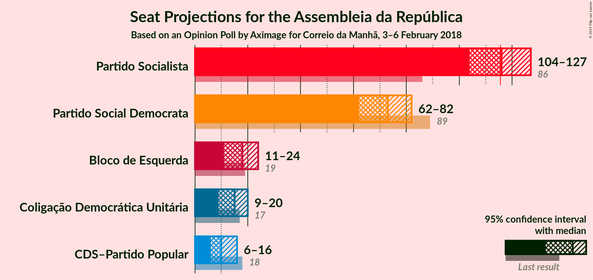
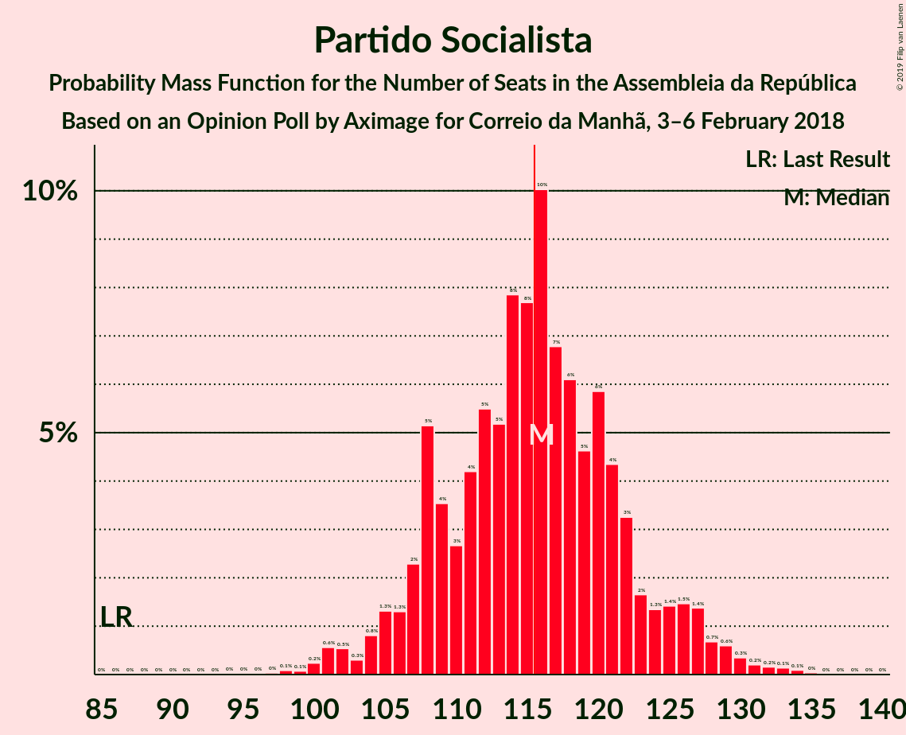
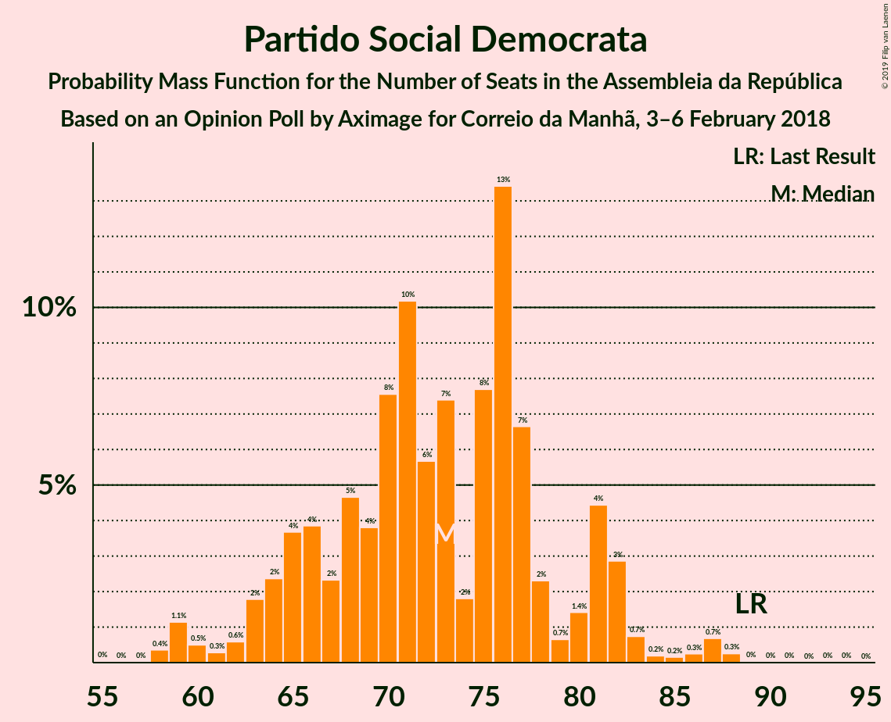
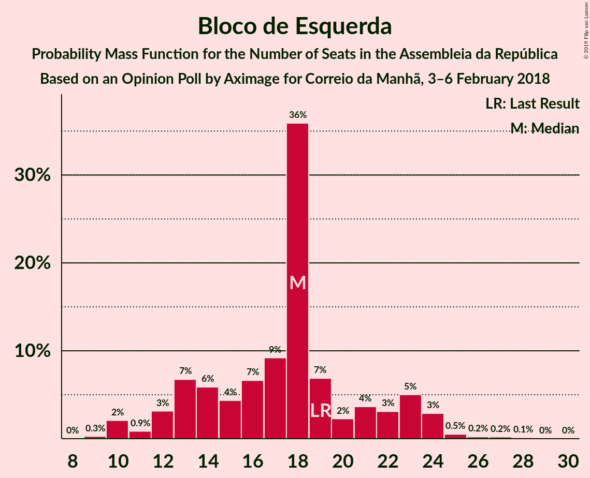
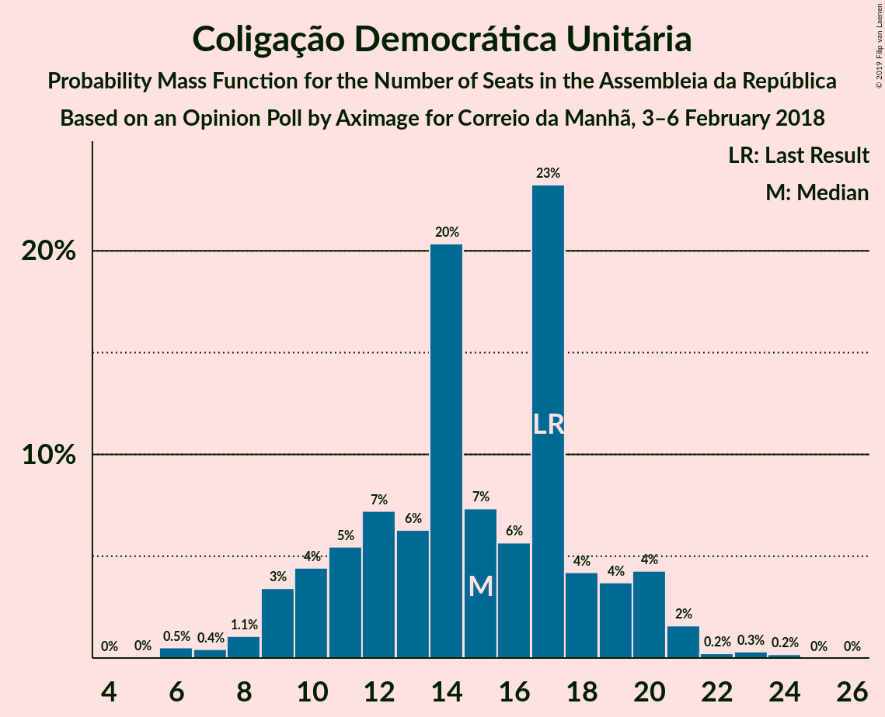

# Opinion Poll by Aximage for Correio da Manhã, 3–6 February 2018

<a href="#voting-intentions">Voting Intentions</a> | <a href="#seats">Seats</a> | <a href="#coalitions">Coalitions</a> | <a href="#technical-information">Technical Information</a>

## Voting Intentions

### Confidence Intervals

| Party | Last Result | Poll Result | 80% Confidence Interval | 90% Confidence Interval | 95% Confidence Interval | 99% Confidence Interval |
|:-----:|:-----------:|:-----------:|:-----------------------:|:-----------------------:|:-----------------------:|:-----------------------:|
| Partido Socialista | 32.3% | 40.6% | 38.1–43.2% |37.4–44.0% |36.8–44.6% |35.6–45.9% |
| Partido Social Democrata | 36.9% | 26.4% | 24.2–28.8% |23.5–29.4% |23.0–30.0% |22.0–31.2% |
| Bloco de Esquerda | 10.2% | 8.8% | 7.5–10.4% |7.1–10.9% |6.8–11.3% |6.2–12.2% |
| Coligação Democrática Unitária | 8.2% | 7.6% | 6.4–9.2% |6.1–9.6% |5.8–10.0% |5.2–10.8% |
| CDS–Partido Popular | 36.9% | 6.1% | 5.0–7.6% |4.7–8.0% |4.5–8.4% |4.0–9.1% |

*Note:* The poll result column reflects the actual value used in the calculations. Published results may vary slightly, and in addition be rounded to fewer digits.

## Seats

### Confidence Intervals

| Party | Last Result | Median | 80% Confidence Interval | 90% Confidence Interval | 95% Confidence Interval | 99% Confidence Interval |
|:-----:|:-----------:|:------:|:-----------------------:|:-----------------------:|:-----------------------:|:-----------------------:|
| <a href="#partido-socialista">Partido Socialista</a> | 86 | 116 | 108–122 |106–126 |104–127 |100–131 |
| <a href="#partido-social-democrata">Partido Social Democrata</a> | 89 | 73 | 65–80 |64–82 |62–82 |59–87 |
| <a href="#bloco-de-esquerda">Bloco de Esquerda</a> | 19 | 18 | 13–22 |12–23 |11–24 |10–26 |
| <a href="#coligação-democrática-unitária">Coligação Democrática Unitária</a> | 17 | 15 | 11–19 |9–20 |9–20 |6–23 |
| <a href="#cds–partido-popular">CDS–Partido Popular</a> | 18 | 10 | 6–13 |6–14 |6–16 |5–19 |

### Partido Socialista

*For a full overview of the results for this party, see the [Partido Socialista](party-partidosocialista.html) page.*

| Number of Seats | Probability | Accumulated | Special Marks |
|:---------------:|:-----------:|:-----------:|:-------------:|
| 86 | 0% | 100% | Last Result |
| 87 | 0% | 100% |  |
| 88 | 0% | 100% |  |
| 89 | 0% | 100% |  |
| 90 | 0% | 100% |  |
| 91 | 0% | 100% |  |
| 92 | 0% | 100% |  |
| 93 | 0% | 100% |  |
| 94 | 0% | 100% |  |
| 95 | 0% | 100% |  |
| 96 | 0% | 100% |  |
| 97 | 0% | 99.9% |  |
| 98 | 0.1% | 99.9% |  |
| 99 | 0.1% | 99.8% |  |
| 100 | 0.2% | 99.7% |  |
| 101 | 0.6% | 99.5% |  |
| 102 | 0.5% | 98.9% |  |
| 103 | 0.3% | 98% |  |
| 104 | 0.8% | 98% |  |
| 105 | 1.3% | 97% |  |
| 106 | 1.3% | 96% |  |
| 107 | 2% | 95% |  |
| 108 | 5% | 92% |  |
| 109 | 4% | 87% |  |
| 110 | 3% | 84% |  |
| 111 | 4% | 81% |  |
| 112 | 5% | 77% |  |
| 113 | 5% | 71% |  |
| 114 | 8% | 66% |  |
| 115 | 8% | 58% |  |
| 116 | 10% | 51% | Median, Majority |
| 117 | 7% | 41% |  |
| 118 | 6% | 34% |  |
| 119 | 5% | 28% |  |
| 120 | 6% | 23% |  |
| 121 | 4% | 17% |  |
| 122 | 3% | 13% |  |
| 123 | 2% | 10% |  |
| 124 | 1.3% | 8% |  |
| 125 | 1.4% | 7% |  |
| 126 | 1.5% | 5% |  |
| 127 | 1.4% | 4% |  |
| 128 | 0.7% | 2% |  |
| 129 | 0.6% | 2% |  |
| 130 | 0.3% | 1.0% |  |
| 131 | 0.2% | 0.7% |  |
| 132 | 0.2% | 0.5% |  |
| 133 | 0.1% | 0.3% |  |
| 134 | 0.1% | 0.2% |  |
| 135 | 0% | 0.1% |  |
| 136 | 0% | 0% |  |

### Partido Social Democrata

*For a full overview of the results for this party, see the [Partido Social Democrata](party-partidosocialdemocrata.html) page.*

| Number of Seats | Probability | Accumulated | Special Marks |
|:---------------:|:-----------:|:-----------:|:-------------:|
| 55 | 0% | 100% |  |
| 56 | 0% | 99.9% |  |
| 57 | 0% | 99.9% |  |
| 58 | 0.4% | 99.9% |  |
| 59 | 1.1% | 99.5% |  |
| 60 | 0.5% | 98% |  |
| 61 | 0.3% | 98% |  |
| 62 | 0.6% | 98% |  |
| 63 | 2% | 97% |  |
| 64 | 2% | 95% |  |
| 65 | 4% | 93% |  |
| 66 | 4% | 89% |  |
| 67 | 2% | 85% |  |
| 68 | 5% | 83% |  |
| 69 | 4% | 78% |  |
| 70 | 8% | 75% |  |
| 71 | 10% | 67% |  |
| 72 | 6% | 57% |  |
| 73 | 7% | 51% | Median |
| 74 | 2% | 44% |  |
| 75 | 8% | 42% |  |
| 76 | 13% | 34% |  |
| 77 | 7% | 21% |  |
| 78 | 2% | 14% |  |
| 79 | 0.7% | 12% |  |
| 80 | 1.4% | 11% |  |
| 81 | 4% | 10% |  |
| 82 | 3% | 5% |  |
| 83 | 0.7% | 2% |  |
| 84 | 0.2% | 2% |  |
| 85 | 0.2% | 1.5% |  |
| 86 | 0.3% | 1.3% |  |
| 87 | 0.7% | 1.1% |  |
| 88 | 0.3% | 0.4% |  |
| 89 | 0% | 0.1% | Last Result |
| 90 | 0% | 0.1% |  |
| 91 | 0% | 0.1% |  |
| 92 | 0% | 0.1% |  |
| 93 | 0% | 0.1% |  |
| 94 | 0% | 0% |  |

### Bloco de Esquerda

*For a full overview of the results for this party, see the [Bloco de Esquerda](party-blocodeesquerda.html) page.*

| Number of Seats | Probability | Accumulated | Special Marks |
|:---------------:|:-----------:|:-----------:|:-------------:|
| 9 | 0.3% | 100% |  |
| 10 | 2% | 99.7% |  |
| 11 | 0.9% | 98% |  |
| 12 | 3% | 97% |  |
| 13 | 7% | 94% |  |
| 14 | 6% | 87% |  |
| 15 | 4% | 81% |  |
| 16 | 7% | 77% |  |
| 17 | 9% | 70% |  |
| 18 | 36% | 61% | Median |
| 19 | 7% | 25% | Last Result |
| 20 | 2% | 18% |  |
| 21 | 4% | 16% |  |
| 22 | 3% | 12% |  |
| 23 | 5% | 9% |  |
| 24 | 3% | 4% |  |
| 25 | 0.5% | 1.1% |  |
| 26 | 0.2% | 0.6% |  |
| 27 | 0.2% | 0.3% |  |
| 28 | 0.1% | 0.1% |  |
| 29 | 0% | 0% |  |

### Coligação Democrática Unitária

*For a full overview of the results for this party, see the [Coligação Democrática Unitária](party-coligaçãodemocráticaunitária.html) page.*

| Number of Seats | Probability | Accumulated | Special Marks |
|:---------------:|:-----------:|:-----------:|:-------------:|
| 6 | 0.5% | 100% |  |
| 7 | 0.4% | 99.5% |  |
| 8 | 1.1% | 99.0% |  |
| 9 | 3% | 98% |  |
| 10 | 4% | 95% |  |
| 11 | 5% | 90% |  |
| 12 | 7% | 85% |  |
| 13 | 6% | 77% |  |
| 14 | 20% | 71% |  |
| 15 | 7% | 51% | Median |
| 16 | 6% | 43% |  |
| 17 | 23% | 38% | Last Result |
| 18 | 4% | 15% |  |
| 19 | 4% | 10% |  |
| 20 | 4% | 7% |  |
| 21 | 2% | 2% |  |
| 22 | 0.2% | 0.7% |  |
| 23 | 0.3% | 0.5% |  |
| 24 | 0.2% | 0.2% |  |
| 25 | 0% | 0% |  |

### CDS–Partido Popular

*For a full overview of the results for this party, see the [CDS–Partido Popular](party-cds–partidopopular.html) page.*

| Number of Seats | Probability | Accumulated | Special Marks |
|:---------------:|:-----------:|:-----------:|:-------------:|
| 3 | 0.1% | 100% |  |
| 4 | 0.3% | 99.9% |  |
| 5 | 0.3% | 99.6% |  |
| 6 | 12% | 99.3% |  |
| 7 | 10% | 87% |  |
| 8 | 11% | 77% |  |
| 9 | 13% | 66% |  |
| 10 | 25% | 52% | Median |
| 11 | 7% | 27% |  |
| 12 | 7% | 20% |  |
| 13 | 6% | 13% |  |
| 14 | 2% | 7% |  |
| 15 | 1.4% | 5% |  |
| 16 | 1.2% | 4% |  |
| 17 | 0.6% | 2% |  |
| 18 | 0.9% | 2% | Last Result |
| 19 | 0.7% | 0.8% |  |
| 20 | 0.1% | 0.2% |  |
| 21 | 0% | 0.1% |  |
| 22 | 0% | 0% |  |

## Coalitions

### Confidence Intervals

| Coalition | Last Result | Median | Majority? | 80% Confidence Interval | 90% Confidence Interval | 95% Confidence Interval | 99% Confidence Interval |
|:---------:|:-----------:|:------:|:---------:|:-----------------------:|:-----------------------:|:-----------------------:|:-----------------------:|
| Partido Socialista – Bloco de Esquerda – Coligação Democrática Unitária | 122 | 148 | 100% | 140–155 | 139–158 | 137–159 | 132–162 |
| Partido Socialista – Bloco de Esquerda | 105 | 133 | 99.9% | 126–140 | 124–143 | 121–145 | 118–148 |
| Partido Socialista – Coligação Democrática Unitária | 103 | 130 | 99.4% | 123–138 | 121–140 | 119–142 | 115–145 |
| Partido Socialista | 86 | 116 | 51% | 108–122 | 106–126 | 104–127 | 100–131 |
| Partido Social Democrata – CDS–Partido Popular | 107 | 82 | 0% | 75–90 | 72–91 | 71–93 | 68–98 |

### Partido Socialista – Bloco de Esquerda – Coligação Democrática Unitária

| Number of Seats | Probability | Accumulated | Special Marks |
|:---------------:|:-----------:|:-----------:|:-------------:|
| 122 | 0% | 100% | Last Result |
| 123 | 0% | 100% |  |
| 124 | 0% | 100% |  |
| 125 | 0% | 100% |  |
| 126 | 0% | 100% |  |
| 127 | 0% | 100% |  |
| 128 | 0% | 100% |  |
| 129 | 0% | 99.9% |  |
| 130 | 0% | 99.9% |  |
| 131 | 0.1% | 99.9% |  |
| 132 | 0.3% | 99.8% |  |
| 133 | 0.2% | 99.5% |  |
| 134 | 0.2% | 99.3% |  |
| 135 | 0.5% | 99.1% |  |
| 136 | 0.4% | 98.6% |  |
| 137 | 1.0% | 98% |  |
| 138 | 2% | 97% |  |
| 139 | 4% | 96% |  |
| 140 | 2% | 92% |  |
| 141 | 3% | 90% |  |
| 142 | 3% | 87% |  |
| 143 | 5% | 84% |  |
| 144 | 9% | 79% |  |
| 145 | 6% | 70% |  |
| 146 | 6% | 64% |  |
| 147 | 7% | 58% |  |
| 148 | 8% | 50% |  |
| 149 | 7% | 42% | Median |
| 150 | 5% | 36% |  |
| 151 | 5% | 31% |  |
| 152 | 6% | 26% |  |
| 153 | 4% | 20% |  |
| 154 | 3% | 15% |  |
| 155 | 3% | 12% |  |
| 156 | 2% | 9% |  |
| 157 | 2% | 7% |  |
| 158 | 1.0% | 5% |  |
| 159 | 2% | 4% |  |
| 160 | 0.6% | 2% |  |
| 161 | 0.9% | 2% |  |
| 162 | 0.5% | 0.9% |  |
| 163 | 0.1% | 0.4% |  |
| 164 | 0.2% | 0.3% |  |
| 165 | 0.1% | 0.1% |  |
| 166 | 0% | 0% |  |

### Partido Socialista – Bloco de Esquerda

| Number of Seats | Probability | Accumulated | Special Marks |
|:---------------:|:-----------:|:-----------:|:-------------:|
| 105 | 0% | 100% | Last Result |
| 106 | 0% | 100% |  |
| 107 | 0% | 100% |  |
| 108 | 0% | 100% |  |
| 109 | 0% | 100% |  |
| 110 | 0% | 100% |  |
| 111 | 0% | 100% |  |
| 112 | 0% | 100% |  |
| 113 | 0% | 100% |  |
| 114 | 0% | 99.9% |  |
| 115 | 0% | 99.9% |  |
| 116 | 0.1% | 99.9% | Majority |
| 117 | 0.1% | 99.8% |  |
| 118 | 0.3% | 99.7% |  |
| 119 | 0.5% | 99.4% |  |
| 120 | 0.5% | 98.9% |  |
| 121 | 1.3% | 98% |  |
| 122 | 0.5% | 97% |  |
| 123 | 0.9% | 97% |  |
| 124 | 2% | 96% |  |
| 125 | 2% | 94% |  |
| 126 | 4% | 91% |  |
| 127 | 6% | 87% |  |
| 128 | 4% | 81% |  |
| 129 | 5% | 78% |  |
| 130 | 6% | 73% |  |
| 131 | 8% | 68% |  |
| 132 | 9% | 59% |  |
| 133 | 6% | 50% |  |
| 134 | 5% | 45% | Median |
| 135 | 7% | 39% |  |
| 136 | 9% | 32% |  |
| 137 | 3% | 23% |  |
| 138 | 4% | 21% |  |
| 139 | 4% | 17% |  |
| 140 | 4% | 13% |  |
| 141 | 2% | 9% |  |
| 142 | 1.0% | 7% |  |
| 143 | 1.5% | 6% |  |
| 144 | 2% | 5% |  |
| 145 | 1.0% | 3% |  |
| 146 | 0.7% | 2% |  |
| 147 | 0.3% | 1.2% |  |
| 148 | 0.4% | 0.9% |  |
| 149 | 0.2% | 0.5% |  |
| 150 | 0.1% | 0.3% |  |
| 151 | 0.1% | 0.2% |  |
| 152 | 0.1% | 0.2% |  |
| 153 | 0% | 0.1% |  |
| 154 | 0% | 0% |  |

### Partido Socialista – Coligação Democrática Unitária

| Number of Seats | Probability | Accumulated | Special Marks |
|:---------------:|:-----------:|:-----------:|:-------------:|
| 103 | 0% | 100% | Last Result |
| 104 | 0% | 100% |  |
| 105 | 0% | 100% |  |
| 106 | 0% | 100% |  |
| 107 | 0% | 100% |  |
| 108 | 0% | 100% |  |
| 109 | 0% | 100% |  |
| 110 | 0% | 100% |  |
| 111 | 0.1% | 99.9% |  |
| 112 | 0.1% | 99.9% |  |
| 113 | 0.1% | 99.8% |  |
| 114 | 0.1% | 99.7% |  |
| 115 | 0.2% | 99.6% |  |
| 116 | 0.3% | 99.4% | Majority |
| 117 | 0.3% | 99.1% |  |
| 118 | 0.8% | 98.8% |  |
| 119 | 1.2% | 98% |  |
| 120 | 0.9% | 97% |  |
| 121 | 3% | 96% |  |
| 122 | 2% | 93% |  |
| 123 | 3% | 91% |  |
| 124 | 3% | 88% |  |
| 125 | 5% | 85% |  |
| 126 | 8% | 80% |  |
| 127 | 4% | 73% |  |
| 128 | 7% | 68% |  |
| 129 | 6% | 62% |  |
| 130 | 6% | 56% |  |
| 131 | 9% | 50% | Median |
| 132 | 8% | 41% |  |
| 133 | 6% | 33% |  |
| 134 | 6% | 27% |  |
| 135 | 4% | 21% |  |
| 136 | 3% | 17% |  |
| 137 | 2% | 14% |  |
| 138 | 3% | 12% |  |
| 139 | 3% | 9% |  |
| 140 | 2% | 6% |  |
| 141 | 2% | 4% |  |
| 142 | 0.6% | 3% |  |
| 143 | 0.7% | 2% |  |
| 144 | 0.6% | 1.4% |  |
| 145 | 0.3% | 0.8% |  |
| 146 | 0.3% | 0.5% |  |
| 147 | 0.1% | 0.2% |  |
| 148 | 0% | 0.1% |  |
| 149 | 0% | 0.1% |  |
| 150 | 0% | 0% |  |

### Partido Socialista

| Number of Seats | Probability | Accumulated | Special Marks |
|:---------------:|:-----------:|:-----------:|:-------------:|
| 86 | 0% | 100% | Last Result |
| 87 | 0% | 100% |  |
| 88 | 0% | 100% |  |
| 89 | 0% | 100% |  |
| 90 | 0% | 100% |  |
| 91 | 0% | 100% |  |
| 92 | 0% | 100% |  |
| 93 | 0% | 100% |  |
| 94 | 0% | 100% |  |
| 95 | 0% | 100% |  |
| 96 | 0% | 100% |  |
| 97 | 0% | 99.9% |  |
| 98 | 0.1% | 99.9% |  |
| 99 | 0.1% | 99.8% |  |
| 100 | 0.2% | 99.7% |  |
| 101 | 0.6% | 99.5% |  |
| 102 | 0.5% | 98.9% |  |
| 103 | 0.3% | 98% |  |
| 104 | 0.8% | 98% |  |
| 105 | 1.3% | 97% |  |
| 106 | 1.3% | 96% |  |
| 107 | 2% | 95% |  |
| 108 | 5% | 92% |  |
| 109 | 4% | 87% |  |
| 110 | 3% | 84% |  |
| 111 | 4% | 81% |  |
| 112 | 5% | 77% |  |
| 113 | 5% | 71% |  |
| 114 | 8% | 66% |  |
| 115 | 8% | 58% |  |
| 116 | 10% | 51% | Median, Majority |
| 117 | 7% | 41% |  |
| 118 | 6% | 34% |  |
| 119 | 5% | 28% |  |
| 120 | 6% | 23% |  |
| 121 | 4% | 17% |  |
| 122 | 3% | 13% |  |
| 123 | 2% | 10% |  |
| 124 | 1.3% | 8% |  |
| 125 | 1.4% | 7% |  |
| 126 | 1.5% | 5% |  |
| 127 | 1.4% | 4% |  |
| 128 | 0.7% | 2% |  |
| 129 | 0.6% | 2% |  |
| 130 | 0.3% | 1.0% |  |
| 131 | 0.2% | 0.7% |  |
| 132 | 0.2% | 0.5% |  |
| 133 | 0.1% | 0.3% |  |
| 134 | 0.1% | 0.2% |  |
| 135 | 0% | 0.1% |  |
| 136 | 0% | 0% |  |

### Partido Social Democrata – CDS–Partido Popular

| Number of Seats | Probability | Accumulated | Special Marks |
|:---------------:|:-----------:|:-----------:|:-------------:|
| 65 | 0.1% | 100% |  |
| 66 | 0.2% | 99.9% |  |
| 67 | 0.1% | 99.7% |  |
| 68 | 0.5% | 99.6% |  |
| 69 | 0.9% | 99.1% |  |
| 70 | 0.6% | 98% |  |
| 71 | 2% | 98% |  |
| 72 | 1.0% | 96% |  |
| 73 | 2% | 95% |  |
| 74 | 2% | 93% |  |
| 75 | 3% | 91% |  |
| 76 | 3% | 88% |  |
| 77 | 4% | 85% |  |
| 78 | 6% | 80% |  |
| 79 | 5% | 74% |  |
| 80 | 5% | 69% |  |
| 81 | 7% | 64% |  |
| 82 | 8% | 58% |  |
| 83 | 7% | 50% | Median |
| 84 | 6% | 42% |  |
| 85 | 6% | 36% |  |
| 86 | 9% | 30% |  |
| 87 | 5% | 21% |  |
| 88 | 3% | 16% |  |
| 89 | 3% | 13% |  |
| 90 | 2% | 10% |  |
| 91 | 4% | 8% |  |
| 92 | 2% | 4% |  |
| 93 | 1.0% | 3% |  |
| 94 | 0.4% | 2% |  |
| 95 | 0.5% | 1.4% |  |
| 96 | 0.2% | 0.9% |  |
| 97 | 0.2% | 0.7% |  |
| 98 | 0.3% | 0.5% |  |
| 99 | 0.1% | 0.2% |  |
| 100 | 0% | 0.1% |  |
| 101 | 0% | 0.1% |  |
| 102 | 0% | 0.1% |  |
| 103 | 0% | 0% |  |
| 104 | 0% | 0% |  |
| 105 | 0% | 0% |  |
| 106 | 0% | 0% |  |
| 107 | 0% | 0% | Last Result |

## Technical Information

### Opinion Poll

+ **Polling firm:** Aximage
+ **Commissioner(s):** Correio da Manhã
+ **Fieldwork period:** 3–6 February 2018

### Calculations

+ **Sample size:** 603
+ **Simulations done:** 131,072
+ **Error estimate:** 0.98%

