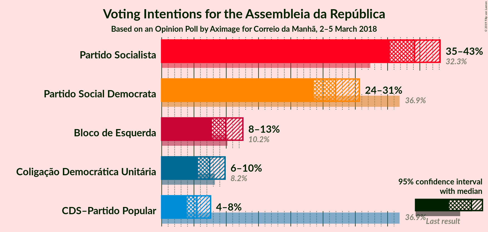
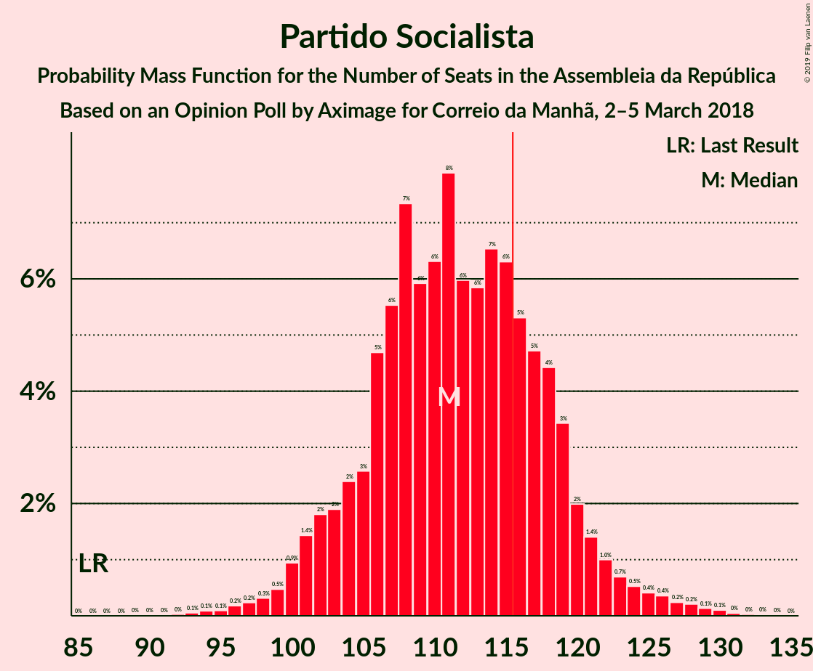

# Opinion Poll by Aximage for Correio da Manhã, 2–5 March 2018

<a href="#voting-intentions">Voting Intentions</a> | <a href="#seats">Seats</a> | <a href="#coalitions">Coalitions</a> | <a href="#technical-information">Technical Information</a>

## Voting Intentions

### Confidence Intervals

| Party | Last Result | Poll Result | 80% Confidence Interval | 90% Confidence Interval | 95% Confidence Interval | 99% Confidence Interval |
|:-----:|:-----------:|:-----------:|:-----------------------:|:-----------------------:|:-----------------------:|:-----------------------:|
| Partido Socialista | 32.3% | 39.2% | 36.7–41.8% |36.0–42.5% |35.4–43.1% |34.2–44.4% |
| Partido Social Democrata | 36.9% | 26.9% | 24.7–29.4% |24.1–30.0% |23.5–30.6% |22.5–31.8% |
| Bloco de Esquerda | 10.2% | 9.9% | 8.5–11.6% |8.1–12.1% |7.8–12.6% |7.1–13.4% |
| Coligação Democrática Unitária | 8.2% | 7.4% | 6.2–9.0% |5.9–9.4% |5.6–9.8% |5.1–10.6% |
| CDS–Partido Popular | 36.9% | 5.5% | 4.4–6.8% |4.1–7.2% |3.9–7.6% |3.5–8.3% |

*Note:* The poll result column reflects the actual value used in the calculations. Published results may vary slightly, and in addition be rounded to fewer digits.

## Seats

### Confidence Intervals

| Party | Last Result | Median | 80% Confidence Interval | 90% Confidence Interval | 95% Confidence Interval | 99% Confidence Interval |
|:-----:|:-----------:|:------:|:-----------------------:|:-----------------------:|:-----------------------:|:-----------------------:|
| <a href="#partido-socialista">Partido Socialista</a> | 86 | 108 | 106–109 |105–110 |105–110 |105–117 |
| <a href="#partido-social-democrata">Partido Social Democrata</a> | 89 | 81 | 79–81 |79–81 |78–81 |74–82 |
| <a href="#bloco-de-esquerda">Bloco de Esquerda</a> | 19 | 18 | 18–19 |18–20 |18–21 |13–22 |
| <a href="#coligação-democrática-unitária">Coligação Democrática Unitária</a> | 17 | 17 | 15–17 |15–17 |14–17 |14–20 |
| <a href="#cds–partido-popular">CDS–Partido Popular</a> | 18 | 6 | 6–10 |6–10 |3–10 |3–13 |

### Partido Socialista

*For a full overview of the results for this party, see the [Partido Socialista](party-partidosocialista.html) page.*

| Number of Seats | Probability | Accumulated | Special Marks |
|:---------------:|:-----------:|:-----------:|:-------------:|
| 86 | 0% | 100% | Last Result |
| 87 | 0% | 100% |  |
| 88 | 0% | 100% |  |
| 89 | 0% | 100% |  |
| 90 | 0% | 100% |  |
| 91 | 0% | 100% |  |
| 92 | 0% | 100% |  |
| 93 | 0% | 100% |  |
| 94 | 0% | 100% |  |
| 95 | 0% | 100% |  |
| 96 | 0% | 100% |  |
| 97 | 0% | 100% |  |
| 98 | 0% | 100% |  |
| 99 | 0% | 100% |  |
| 100 | 0% | 100% |  |
| 101 | 0% | 100% |  |
| 102 | 0% | 100% |  |
| 103 | 0.3% | 99.9% |  |
| 104 | 0% | 99.6% |  |
| 105 | 7% | 99.6% |  |
| 106 | 6% | 93% |  |
| 107 | 12% | 87% |  |
| 108 | 49% | 74% | Median |
| 109 | 20% | 26% |  |
| 110 | 4% | 6% |  |
| 111 | 0.5% | 2% |  |
| 112 | 0% | 1.5% |  |
| 113 | 0% | 1.5% |  |
| 114 | 0% | 1.5% |  |
| 115 | 0.6% | 1.5% |  |
| 116 | 0.3% | 0.9% | Majority |
| 117 | 0.1% | 0.6% |  |
| 118 | 0.1% | 0.5% |  |
| 119 | 0% | 0.4% |  |
| 120 | 0.2% | 0.4% |  |
| 121 | 0.1% | 0.2% |  |
| 122 | 0.1% | 0.1% |  |
| 123 | 0% | 0% |  |

### Partido Social Democrata

*For a full overview of the results for this party, see the [Partido Social Democrata](party-partidosocialdemocrata.html) page.*

| Number of Seats | Probability | Accumulated | Special Marks |
|:---------------:|:-----------:|:-----------:|:-------------:|
| 58 | 0.1% | 100% |  |
| 59 | 0.1% | 99.9% |  |
| 60 | 0.2% | 99.8% |  |
| 61 | 0.1% | 99.6% |  |
| 62 | 0% | 99.6% |  |
| 63 | 0% | 99.6% |  |
| 64 | 0% | 99.6% |  |
| 65 | 0% | 99.6% |  |
| 66 | 0% | 99.6% |  |
| 67 | 0% | 99.6% |  |
| 68 | 0% | 99.6% |  |
| 69 | 0% | 99.6% |  |
| 70 | 0% | 99.6% |  |
| 71 | 0% | 99.6% |  |
| 72 | 0% | 99.6% |  |
| 73 | 0% | 99.6% |  |
| 74 | 0.2% | 99.6% |  |
| 75 | 0.2% | 99.3% |  |
| 76 | 0.5% | 99.1% |  |
| 77 | 0% | 98.5% |  |
| 78 | 2% | 98.5% |  |
| 79 | 23% | 96% |  |
| 80 | 15% | 74% |  |
| 81 | 57% | 59% | Median |
| 82 | 2% | 2% |  |
| 83 | 0% | 0.1% |  |
| 84 | 0% | 0% |  |
| 85 | 0% | 0% |  |
| 86 | 0% | 0% |  |
| 87 | 0% | 0% |  |
| 88 | 0% | 0% |  |
| 89 | 0% | 0% | Last Result |

### Bloco de Esquerda

*For a full overview of the results for this party, see the [Bloco de Esquerda](party-blocodeesquerda.html) page.*

| Number of Seats | Probability | Accumulated | Special Marks |
|:---------------:|:-----------:|:-----------:|:-------------:|
| 12 | 0.2% | 100% |  |
| 13 | 0.7% | 99.8% |  |
| 14 | 0% | 99.1% |  |
| 15 | 0.2% | 99.0% |  |
| 16 | 0.2% | 98.9% |  |
| 17 | 0.5% | 98.7% |  |
| 18 | 80% | 98% | Median |
| 19 | 11% | 18% | Last Result |
| 20 | 4% | 7% |  |
| 21 | 0.3% | 3% |  |
| 22 | 2% | 2% |  |
| 23 | 0% | 0% |  |

### Coligação Democrática Unitária

*For a full overview of the results for this party, see the [Coligação Democrática Unitária](party-coligaçãodemocráticaunitária.html) page.*

| Number of Seats | Probability | Accumulated | Special Marks |
|:---------------:|:-----------:|:-----------:|:-------------:|
| 13 | 0.1% | 100% |  |
| 14 | 4% | 99.8% |  |
| 15 | 17% | 96% |  |
| 16 | 10% | 79% |  |
| 17 | 67% | 69% | Last Result, Median |
| 18 | 0% | 1.5% |  |
| 19 | 0% | 1.5% |  |
| 20 | 1.1% | 1.5% |  |
| 21 | 0.4% | 0.4% |  |
| 22 | 0% | 0% |  |

### CDS–Partido Popular

*For a full overview of the results for this party, see the [CDS–Partido Popular](party-cds–partidopopular.html) page.*

| Number of Seats | Probability | Accumulated | Special Marks |
|:---------------:|:-----------:|:-----------:|:-------------:|
| 2 | 0.3% | 100% |  |
| 3 | 2% | 99.7% |  |
| 4 | 1.3% | 97% |  |
| 5 | 0.3% | 96% |  |
| 6 | 62% | 96% | Median |
| 7 | 0.2% | 34% |  |
| 8 | 8% | 34% |  |
| 9 | 5% | 26% |  |
| 10 | 19% | 21% |  |
| 11 | 0.1% | 2% |  |
| 12 | 0% | 2% |  |
| 13 | 2% | 2% |  |
| 14 | 0.2% | 0.4% |  |
| 15 | 0.2% | 0.3% |  |
| 16 | 0% | 0.1% |  |
| 17 | 0% | 0% |  |
| 18 | 0% | 0% | Last Result |

## Coalitions

### Confidence Intervals

| Coalition | Last Result | Median | Majority? | 80% Confidence Interval | 90% Confidence Interval | 95% Confidence Interval | 99% Confidence Interval |
|:---------:|:-----------:|:------:|:---------:|:-----------------------:|:-----------------------:|:-----------------------:|:-----------------------:|
| Partido Socialista – Bloco de Esquerda – Coligação Democrática Unitária | 122 | 143 | 100% | 140–145 | 139–147 | 138–149 | 136–151 |
| Partido Socialista – Bloco de Esquerda | 105 | 126 | 100% | 124–128 | 123–128 | 123–132 | 122–133 |
| Partido Socialista – Coligação Democrática Unitária | 103 | 125 | 100% | 122–126 | 121–127 | 120–127 | 119–137 |
| Partido Socialista | 86 | 108 | 0.9% | 106–109 | 105–110 | 105–110 | 105–117 |
| Partido Social Democrata – CDS–Partido Popular | 107 | 87 | 0% | 85–90 | 83–91 | 81–92 | 79–94 |

### Partido Socialista – Bloco de Esquerda – Coligação Democrática Unitária

| Number of Seats | Probability | Accumulated | Special Marks |
|:---------------:|:-----------:|:-----------:|:-------------:|
| 122 | 0% | 100% | Last Result |
| 123 | 0% | 100% |  |
| 124 | 0% | 100% |  |
| 125 | 0% | 100% |  |
| 126 | 0% | 100% |  |
| 127 | 0% | 100% |  |
| 128 | 0% | 100% |  |
| 129 | 0% | 100% |  |
| 130 | 0% | 100% |  |
| 131 | 0% | 99.9% |  |
| 132 | 0% | 99.9% |  |
| 133 | 0.2% | 99.9% |  |
| 134 | 0.1% | 99.7% |  |
| 135 | 0% | 99.6% |  |
| 136 | 0.3% | 99.6% |  |
| 137 | 1.4% | 99.3% |  |
| 138 | 1.5% | 98% |  |
| 139 | 6% | 96% |  |
| 140 | 16% | 91% |  |
| 141 | 0% | 74% |  |
| 142 | 0.1% | 74% |  |
| 143 | 54% | 74% | Median |
| 144 | 1.3% | 20% |  |
| 145 | 13% | 19% |  |
| 146 | 0.2% | 5% |  |
| 147 | 1.4% | 5% |  |
| 148 | 0.3% | 4% |  |
| 149 | 3% | 3% |  |
| 150 | 0.3% | 0.8% |  |
| 151 | 0.1% | 0.6% |  |
| 152 | 0% | 0.5% |  |
| 153 | 0% | 0.5% |  |
| 154 | 0% | 0.4% |  |
| 155 | 0% | 0.4% |  |
| 156 | 0% | 0.4% |  |
| 157 | 0% | 0.4% |  |
| 158 | 0% | 0.4% |  |
| 159 | 0.1% | 0.4% |  |
| 160 | 0.1% | 0.3% |  |
| 161 | 0% | 0.2% |  |
| 162 | 0.1% | 0.2% |  |
| 163 | 0% | 0.1% |  |
| 164 | 0.1% | 0.1% |  |
| 165 | 0% | 0% |  |

### Partido Socialista – Bloco de Esquerda

| Number of Seats | Probability | Accumulated | Special Marks |
|:---------------:|:-----------:|:-----------:|:-------------:|
| 105 | 0% | 100% | Last Result |
| 106 | 0% | 100% |  |
| 107 | 0% | 100% |  |
| 108 | 0% | 100% |  |
| 109 | 0% | 100% |  |
| 110 | 0% | 100% |  |
| 111 | 0% | 100% |  |
| 112 | 0% | 100% |  |
| 113 | 0% | 100% |  |
| 114 | 0% | 100% |  |
| 115 | 0% | 100% |  |
| 116 | 0% | 100% | Majority |
| 117 | 0% | 99.9% |  |
| 118 | 0% | 99.9% |  |
| 119 | 0.1% | 99.9% |  |
| 120 | 0.2% | 99.8% |  |
| 121 | 0.1% | 99.6% |  |
| 122 | 0.3% | 99.6% |  |
| 123 | 6% | 99.2% |  |
| 124 | 6% | 93% |  |
| 125 | 12% | 87% |  |
| 126 | 45% | 74% | Median |
| 127 | 10% | 29% |  |
| 128 | 14% | 19% |  |
| 129 | 0.6% | 5% |  |
| 130 | 1.4% | 4% |  |
| 131 | 0.1% | 3% |  |
| 132 | 2% | 3% |  |
| 133 | 0.2% | 0.6% |  |
| 134 | 0% | 0.4% |  |
| 135 | 0% | 0.4% |  |
| 136 | 0% | 0.4% |  |
| 137 | 0% | 0.4% |  |
| 138 | 0.1% | 0.4% |  |
| 139 | 0.1% | 0.3% |  |
| 140 | 0% | 0.2% |  |
| 141 | 0.1% | 0.2% |  |
| 142 | 0% | 0.1% |  |
| 143 | 0.1% | 0.1% |  |
| 144 | 0% | 0% |  |

### Partido Socialista – Coligação Democrática Unitária

| Number of Seats | Probability | Accumulated | Special Marks |
|:---------------:|:-----------:|:-----------:|:-------------:|
| 103 | 0% | 100% | Last Result |
| 104 | 0% | 100% |  |
| 105 | 0% | 100% |  |
| 106 | 0% | 100% |  |
| 107 | 0% | 100% |  |
| 108 | 0% | 100% |  |
| 109 | 0% | 100% |  |
| 110 | 0% | 100% |  |
| 111 | 0% | 100% |  |
| 112 | 0% | 100% |  |
| 113 | 0% | 100% |  |
| 114 | 0% | 100% |  |
| 115 | 0% | 100% |  |
| 116 | 0% | 100% | Majority |
| 117 | 0.3% | 99.9% |  |
| 118 | 0.1% | 99.7% |  |
| 119 | 2% | 99.6% |  |
| 120 | 1.5% | 98% |  |
| 121 | 6% | 96% |  |
| 122 | 16% | 91% |  |
| 123 | 0% | 74% |  |
| 124 | 0.1% | 74% |  |
| 125 | 58% | 74% | Median |
| 126 | 11% | 17% |  |
| 127 | 3% | 5% |  |
| 128 | 0.4% | 2% |  |
| 129 | 0% | 1.5% |  |
| 130 | 0% | 1.5% |  |
| 131 | 0% | 1.5% |  |
| 132 | 0% | 1.5% |  |
| 133 | 0% | 1.5% |  |
| 134 | 0% | 1.5% |  |
| 135 | 0.6% | 1.5% |  |
| 136 | 0.3% | 0.9% |  |
| 137 | 0.1% | 0.6% |  |
| 138 | 0.1% | 0.5% |  |
| 139 | 0% | 0.4% |  |
| 140 | 0% | 0.4% |  |
| 141 | 0.2% | 0.4% |  |
| 142 | 0.1% | 0.2% |  |
| 143 | 0.1% | 0.1% |  |
| 144 | 0% | 0% |  |

### Partido Socialista

| Number of Seats | Probability | Accumulated | Special Marks |
|:---------------:|:-----------:|:-----------:|:-------------:|
| 86 | 0% | 100% | Last Result |
| 87 | 0% | 100% |  |
| 88 | 0% | 100% |  |
| 89 | 0% | 100% |  |
| 90 | 0% | 100% |  |
| 91 | 0% | 100% |  |
| 92 | 0% | 100% |  |
| 93 | 0% | 100% |  |
| 94 | 0% | 100% |  |
| 95 | 0% | 100% |  |
| 96 | 0% | 100% |  |
| 97 | 0% | 100% |  |
| 98 | 0% | 100% |  |
| 99 | 0% | 100% |  |
| 100 | 0% | 100% |  |
| 101 | 0% | 100% |  |
| 102 | 0% | 100% |  |
| 103 | 0.3% | 99.9% |  |
| 104 | 0% | 99.6% |  |
| 105 | 7% | 99.6% |  |
| 106 | 6% | 93% |  |
| 107 | 12% | 87% |  |
| 108 | 49% | 74% | Median |
| 109 | 20% | 26% |  |
| 110 | 4% | 6% |  |
| 111 | 0.5% | 2% |  |
| 112 | 0% | 1.5% |  |
| 113 | 0% | 1.5% |  |
| 114 | 0% | 1.5% |  |
| 115 | 0.6% | 1.5% |  |
| 116 | 0.3% | 0.9% | Majority |
| 117 | 0.1% | 0.6% |  |
| 118 | 0.1% | 0.5% |  |
| 119 | 0% | 0.4% |  |
| 120 | 0.2% | 0.4% |  |
| 121 | 0.1% | 0.2% |  |
| 122 | 0.1% | 0.1% |  |
| 123 | 0% | 0% |  |

### Partido Social Democrata – CDS–Partido Popular

| Number of Seats | Probability | Accumulated | Special Marks |
|:---------------:|:-----------:|:-----------:|:-------------:|
| 66 | 0.1% | 100% |  |
| 67 | 0% | 99.9% |  |
| 68 | 0.1% | 99.9% |  |
| 69 | 0% | 99.8% |  |
| 70 | 0.1% | 99.8% |  |
| 71 | 0.1% | 99.7% |  |
| 72 | 0% | 99.6% |  |
| 73 | 0% | 99.6% |  |
| 74 | 0% | 99.6% |  |
| 75 | 0% | 99.6% |  |
| 76 | 0% | 99.6% |  |
| 77 | 0% | 99.6% |  |
| 78 | 0% | 99.5% |  |
| 79 | 0.1% | 99.5% |  |
| 80 | 0.3% | 99.4% |  |
| 81 | 3% | 99.2% |  |
| 82 | 0.3% | 97% |  |
| 83 | 1.4% | 96% |  |
| 84 | 0.2% | 95% |  |
| 85 | 13% | 95% |  |
| 86 | 1.3% | 81% |  |
| 87 | 54% | 80% | Median |
| 88 | 0.1% | 26% |  |
| 89 | 0% | 26% |  |
| 90 | 16% | 26% |  |
| 91 | 6% | 9% |  |
| 92 | 1.5% | 4% |  |
| 93 | 1.4% | 2% |  |
| 94 | 0.3% | 0.7% |  |
| 95 | 0% | 0.4% |  |
| 96 | 0.1% | 0.4% |  |
| 97 | 0.2% | 0.3% |  |
| 98 | 0% | 0.1% |  |
| 99 | 0% | 0.1% |  |
| 100 | 0% | 0.1% |  |
| 101 | 0% | 0% |  |
| 102 | 0% | 0% |  |
| 103 | 0% | 0% |  |
| 104 | 0% | 0% |  |
| 105 | 0% | 0% |  |
| 106 | 0% | 0% |  |
| 107 | 0% | 0% | Last Result |

## Technical Information

### Opinion Poll

+ **Polling firm:** Aximage
+ **Commissioner(s):** Correio da Manhã
+ **Fieldwork period:** 2–5 March 2018

### Calculations

+ **Sample size:** 605
+ **Simulations done:** 1,024
+ **Error estimate:** 2.38%

