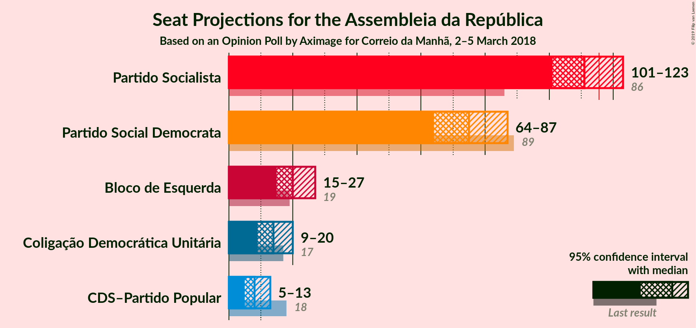
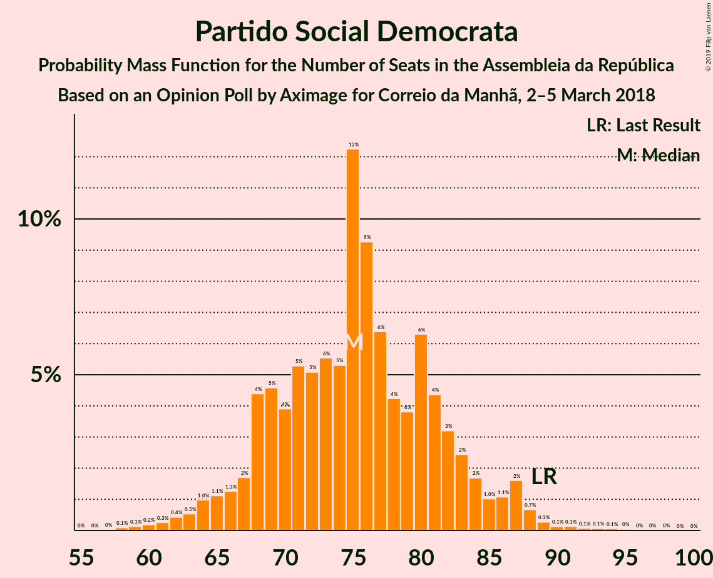
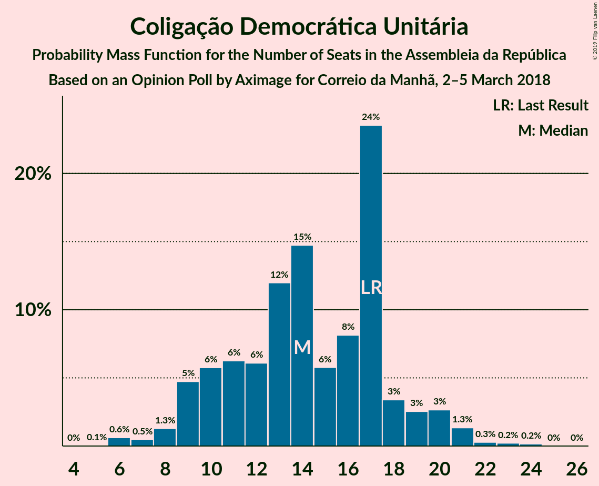

# Opinion Poll by Aximage for Correio da Manhã, 2–5 March 2018

<a href="#voting-intentions">Voting Intentions</a> | <a href="#seats">Seats</a> | <a href="#coalitions">Coalitions</a> | <a href="#technical-information">Technical Information</a>

## Voting Intentions

### Confidence Intervals

| Party | Last Result | Poll Result | 80% Confidence Interval | 90% Confidence Interval | 95% Confidence Interval | 99% Confidence Interval |
|:-----:|:-----------:|:-----------:|:-----------------------:|:-----------------------:|:-----------------------:|:-----------------------:|
| Partido Socialista | 32.3% | 39.2% | 36.7–41.8% |36.0–42.5% |35.4–43.1% |34.2–44.4% |
| Partido Social Democrata | 36.9% | 26.9% | 24.7–29.4% |24.1–30.0% |23.5–30.6% |22.5–31.8% |
| Bloco de Esquerda | 10.2% | 9.9% | 8.5–11.6% |8.1–12.1% |7.8–12.6% |7.1–13.4% |
| Coligação Democrática Unitária | 8.2% | 7.4% | 6.2–9.0% |5.9–9.4% |5.6–9.8% |5.1–10.6% |
| CDS–Partido Popular | 36.9% | 5.5% | 4.4–6.8% |4.1–7.2% |3.9–7.6% |3.5–8.3% |

*Note:* The poll result column reflects the actual value used in the calculations. Published results may vary slightly, and in addition be rounded to fewer digits.

## Seats

### Confidence Intervals

| Party | Last Result | Median | 80% Confidence Interval | 90% Confidence Interval | 95% Confidence Interval | 99% Confidence Interval |
|:-----:|:-----------:|:------:|:-----------------------:|:-----------------------:|:-----------------------:|:-----------------------:|
| <a href="#partido-socialista">Partido Socialista</a> | 86 | 112 | 103–120 |101–122 |100–123 |97–126 |
| <a href="#partido-social-democrata">Partido Social Democrata</a> | 89 | 75 | 68–84 |66–86 |65–87 |62–89 |
| <a href="#bloco-de-esquerda">Bloco de Esquerda</a> | 19 | 21 | 18–25 |17–27 |15–27 |13–28 |
| <a href="#coligação-democrática-unitária">Coligação Democrática Unitária</a> | 17 | 14 | 11–18 |9–20 |9–21 |6–22 |
| <a href="#cds–partido-popular">CDS–Partido Popular</a> | 18 | 7 | 6–10 |6–12 |4–13 |3–17 |

### Partido Socialista

*For a full overview of the results for this party, see the [Partido Socialista](party-partidosocialista.html) page.*

| Number of Seats | Probability | Accumulated | Special Marks |
|:---------------:|:-----------:|:-----------:|:-------------:|
| 86 | 0% | 100% | Last Result |
| 87 | 0% | 100% |  |
| 88 | 0% | 100% |  |
| 89 | 0% | 100% |  |
| 90 | 0% | 100% |  |
| 91 | 0% | 100% |  |
| 92 | 0% | 100% |  |
| 93 | 0% | 100% |  |
| 94 | 0.1% | 99.9% |  |
| 95 | 0.1% | 99.9% |  |
| 96 | 0.2% | 99.8% |  |
| 97 | 0.2% | 99.6% |  |
| 98 | 0.3% | 99.4% |  |
| 99 | 0.9% | 99.1% |  |
| 100 | 2% | 98% |  |
| 101 | 2% | 96% |  |
| 102 | 4% | 94% |  |
| 103 | 3% | 90% |  |
| 104 | 2% | 87% |  |
| 105 | 4% | 85% |  |
| 106 | 6% | 80% |  |
| 107 | 6% | 74% |  |
| 108 | 5% | 68% |  |
| 109 | 4% | 63% |  |
| 110 | 3% | 59% |  |
| 111 | 4% | 56% |  |
| 112 | 2% | 51% | Median |
| 113 | 2% | 49% |  |
| 114 | 7% | 47% |  |
| 115 | 7% | 39% |  |
| 116 | 6% | 33% | Majority |
| 117 | 7% | 27% |  |
| 118 | 6% | 20% |  |
| 119 | 4% | 14% |  |
| 120 | 3% | 10% |  |
| 121 | 2% | 8% |  |
| 122 | 2% | 5% |  |
| 123 | 1.1% | 3% |  |
| 124 | 0.8% | 2% |  |
| 125 | 0.6% | 1.4% |  |
| 126 | 0.3% | 0.8% |  |
| 127 | 0.2% | 0.5% |  |
| 128 | 0.1% | 0.3% |  |
| 129 | 0.1% | 0.2% |  |
| 130 | 0.1% | 0.1% |  |
| 131 | 0% | 0% |  |

### Partido Social Democrata

*For a full overview of the results for this party, see the [Partido Social Democrata](party-partidosocialdemocrata.html) page.*

| Number of Seats | Probability | Accumulated | Special Marks |
|:---------------:|:-----------:|:-----------:|:-------------:|
| 58 | 0% | 100% |  |
| 59 | 0.1% | 99.9% |  |
| 60 | 0.1% | 99.9% |  |
| 61 | 0.2% | 99.8% |  |
| 62 | 0.3% | 99.6% |  |
| 63 | 0.3% | 99.3% |  |
| 64 | 1.2% | 99.0% |  |
| 65 | 1.1% | 98% |  |
| 66 | 2% | 97% |  |
| 67 | 3% | 94% |  |
| 68 | 10% | 91% |  |
| 69 | 6% | 81% |  |
| 70 | 5% | 75% |  |
| 71 | 7% | 70% |  |
| 72 | 6% | 63% |  |
| 73 | 4% | 57% |  |
| 74 | 2% | 53% |  |
| 75 | 4% | 51% | Median |
| 76 | 2% | 47% |  |
| 77 | 3% | 45% |  |
| 78 | 3% | 42% |  |
| 79 | 5% | 39% |  |
| 80 | 6% | 35% |  |
| 81 | 10% | 29% |  |
| 82 | 3% | 19% |  |
| 83 | 3% | 16% |  |
| 84 | 5% | 13% |  |
| 85 | 2% | 8% |  |
| 86 | 2% | 7% |  |
| 87 | 3% | 5% |  |
| 88 | 1.0% | 2% |  |
| 89 | 0.4% | 0.5% | Last Result |
| 90 | 0% | 0.1% |  |
| 91 | 0% | 0.1% |  |
| 92 | 0% | 0.1% |  |
| 93 | 0% | 0.1% |  |
| 94 | 0% | 0.1% |  |
| 95 | 0% | 0% |  |

### Bloco de Esquerda

*For a full overview of the results for this party, see the [Bloco de Esquerda](party-blocodeesquerda.html) page.*

| Number of Seats | Probability | Accumulated | Special Marks |
|:---------------:|:-----------:|:-----------:|:-------------:|
| 10 | 0.1% | 100% |  |
| 11 | 0% | 99.9% |  |
| 12 | 0.3% | 99.8% |  |
| 13 | 0.7% | 99.5% |  |
| 14 | 1.3% | 98.8% |  |
| 15 | 0.9% | 98% |  |
| 16 | 1.4% | 97% |  |
| 17 | 4% | 95% |  |
| 18 | 28% | 91% |  |
| 19 | 10% | 64% | Last Result |
| 20 | 4% | 54% |  |
| 21 | 4% | 50% | Median |
| 22 | 4% | 46% |  |
| 23 | 15% | 41% |  |
| 24 | 16% | 26% |  |
| 25 | 4% | 10% |  |
| 26 | 2% | 7% |  |
| 27 | 3% | 5% |  |
| 28 | 2% | 2% |  |
| 29 | 0.2% | 0.4% |  |
| 30 | 0.1% | 0.2% |  |
| 31 | 0% | 0.1% |  |
| 32 | 0% | 0.1% |  |
| 33 | 0% | 0.1% |  |
| 34 | 0% | 0% |  |

### Coligação Democrática Unitária

*For a full overview of the results for this party, see the [Coligação Democrática Unitária](party-coligaçãodemocráticaunitária.html) page.*

| Number of Seats | Probability | Accumulated | Special Marks |
|:---------------:|:-----------:|:-----------:|:-------------:|
| 5 | 0.1% | 100% |  |
| 6 | 0.4% | 99.9% |  |
| 7 | 0.3% | 99.5% |  |
| 8 | 0.6% | 99.2% |  |
| 9 | 6% | 98.5% |  |
| 10 | 3% | 93% |  |
| 11 | 16% | 90% |  |
| 12 | 5% | 75% |  |
| 13 | 14% | 69% |  |
| 14 | 15% | 56% | Median |
| 15 | 4% | 40% |  |
| 16 | 6% | 36% |  |
| 17 | 18% | 31% | Last Result |
| 18 | 3% | 13% |  |
| 19 | 3% | 10% |  |
| 20 | 3% | 7% |  |
| 21 | 3% | 3% |  |
| 22 | 0.5% | 0.8% |  |
| 23 | 0.1% | 0.3% |  |
| 24 | 0.2% | 0.3% |  |
| 25 | 0% | 0% |  |

### CDS–Partido Popular

*For a full overview of the results for this party, see the [CDS–Partido Popular](party-cds–partidopopular.html) page.*

| Number of Seats | Probability | Accumulated | Special Marks |
|:---------------:|:-----------:|:-----------:|:-------------:|
| 2 | 0.4% | 100% |  |
| 3 | 0.5% | 99.6% |  |
| 4 | 2% | 99.0% |  |
| 5 | 2% | 97% |  |
| 6 | 32% | 96% |  |
| 7 | 15% | 64% | Median |
| 8 | 12% | 50% |  |
| 9 | 11% | 38% |  |
| 10 | 17% | 27% |  |
| 11 | 4% | 10% |  |
| 12 | 2% | 6% |  |
| 13 | 2% | 4% |  |
| 14 | 0.8% | 2% |  |
| 15 | 0.2% | 1.1% |  |
| 16 | 0.2% | 0.8% |  |
| 17 | 0.1% | 0.6% |  |
| 18 | 0.3% | 0.5% | Last Result |
| 19 | 0.2% | 0.2% |  |
| 20 | 0% | 0% |  |

## Coalitions

### Confidence Intervals

| Coalition | Last Result | Median | Majority? | 80% Confidence Interval | 90% Confidence Interval | 95% Confidence Interval | 99% Confidence Interval |
|:---------:|:-----------:|:------:|:---------:|:-----------------------:|:-----------------------:|:-----------------------:|:-----------------------:|
| Partido Socialista – Bloco de Esquerda – Coligação Democrática Unitária | 122 | 147 | 100% | 138–155 | 137–156 | 135–158 | 132–161 |
| Partido Socialista – Bloco de Esquerda | 105 | 134 | 99.9% | 124–141 | 122–142 | 121–143 | 118–145 |
| Partido Socialista – Coligação Democrática Unitária | 103 | 126 | 96% | 118–133 | 116–136 | 114–139 | 111–141 |
| Partido Socialista | 86 | 112 | 33% | 103–120 | 101–122 | 100–123 | 97–126 |
| Partido Social Democrata – CDS–Partido Popular | 107 | 83 | 0% | 75–92 | 74–93 | 72–95 | 69–98 |

### Partido Socialista – Bloco de Esquerda – Coligação Democrática Unitária

| Number of Seats | Probability | Accumulated | Special Marks |
|:---------------:|:-----------:|:-----------:|:-------------:|
| 122 | 0% | 100% | Last Result |
| 123 | 0% | 100% |  |
| 124 | 0% | 100% |  |
| 125 | 0% | 100% |  |
| 126 | 0% | 100% |  |
| 127 | 0% | 100% |  |
| 128 | 0% | 99.9% |  |
| 129 | 0.1% | 99.9% |  |
| 130 | 0.1% | 99.8% |  |
| 131 | 0.3% | 99.8% |  |
| 132 | 0.3% | 99.5% |  |
| 133 | 0.6% | 99.2% |  |
| 134 | 0.8% | 98.7% |  |
| 135 | 1.0% | 98% |  |
| 136 | 2% | 97% |  |
| 137 | 4% | 95% |  |
| 138 | 2% | 91% |  |
| 139 | 4% | 89% |  |
| 140 | 4% | 85% |  |
| 141 | 4% | 81% |  |
| 142 | 5% | 77% |  |
| 143 | 8% | 72% |  |
| 144 | 5% | 64% |  |
| 145 | 5% | 59% |  |
| 146 | 3% | 54% |  |
| 147 | 4% | 51% | Median |
| 148 | 4% | 47% |  |
| 149 | 4% | 43% |  |
| 150 | 5% | 39% |  |
| 151 | 8% | 34% |  |
| 152 | 6% | 26% |  |
| 153 | 5% | 21% |  |
| 154 | 4% | 16% |  |
| 155 | 5% | 12% |  |
| 156 | 2% | 7% |  |
| 157 | 2% | 5% |  |
| 158 | 1.4% | 3% |  |
| 159 | 0.8% | 2% |  |
| 160 | 0.4% | 1.1% |  |
| 161 | 0.2% | 0.6% |  |
| 162 | 0.2% | 0.4% |  |
| 163 | 0.1% | 0.2% |  |
| 164 | 0% | 0.1% |  |
| 165 | 0% | 0% |  |

### Partido Socialista – Bloco de Esquerda

| Number of Seats | Probability | Accumulated | Special Marks |
|:---------------:|:-----------:|:-----------:|:-------------:|
| 105 | 0% | 100% | Last Result |
| 106 | 0% | 100% |  |
| 107 | 0% | 100% |  |
| 108 | 0% | 100% |  |
| 109 | 0% | 100% |  |
| 110 | 0% | 100% |  |
| 111 | 0% | 100% |  |
| 112 | 0% | 100% |  |
| 113 | 0% | 99.9% |  |
| 114 | 0% | 99.9% |  |
| 115 | 0% | 99.9% |  |
| 116 | 0.1% | 99.9% | Majority |
| 117 | 0.1% | 99.8% |  |
| 118 | 0.3% | 99.7% |  |
| 119 | 0.4% | 99.4% |  |
| 120 | 0.9% | 99.0% |  |
| 121 | 1.2% | 98% |  |
| 122 | 2% | 97% |  |
| 123 | 4% | 94% |  |
| 124 | 5% | 90% |  |
| 125 | 8% | 85% |  |
| 126 | 8% | 77% |  |
| 127 | 5% | 70% |  |
| 128 | 4% | 65% |  |
| 129 | 5% | 60% |  |
| 130 | 2% | 56% |  |
| 131 | 0.9% | 54% |  |
| 132 | 1.3% | 53% |  |
| 133 | 2% | 52% | Median |
| 134 | 2% | 50% |  |
| 135 | 3% | 48% |  |
| 136 | 5% | 45% |  |
| 137 | 4% | 40% |  |
| 138 | 9% | 36% |  |
| 139 | 5% | 27% |  |
| 140 | 7% | 22% |  |
| 141 | 7% | 15% |  |
| 142 | 4% | 8% |  |
| 143 | 2% | 3% |  |
| 144 | 1.0% | 2% |  |
| 145 | 0.2% | 0.6% |  |
| 146 | 0.2% | 0.3% |  |
| 147 | 0.1% | 0.2% |  |
| 148 | 0% | 0.1% |  |
| 149 | 0% | 0.1% |  |
| 150 | 0% | 0.1% |  |
| 151 | 0% | 0.1% |  |
| 152 | 0% | 0.1% |  |
| 153 | 0% | 0.1% |  |
| 154 | 0% | 0% |  |

### Partido Socialista – Coligação Democrática Unitária

| Number of Seats | Probability | Accumulated | Special Marks |
|:---------------:|:-----------:|:-----------:|:-------------:|
| 103 | 0% | 100% | Last Result |
| 104 | 0% | 100% |  |
| 105 | 0% | 100% |  |
| 106 | 0% | 100% |  |
| 107 | 0% | 99.9% |  |
| 108 | 0.1% | 99.9% |  |
| 109 | 0.1% | 99.8% |  |
| 110 | 0.1% | 99.7% |  |
| 111 | 0.2% | 99.6% |  |
| 112 | 0.3% | 99.4% |  |
| 113 | 1.1% | 99.1% |  |
| 114 | 2% | 98% |  |
| 115 | 1.0% | 97% |  |
| 116 | 2% | 96% | Majority |
| 117 | 1.4% | 93% |  |
| 118 | 2% | 92% |  |
| 119 | 5% | 90% |  |
| 120 | 6% | 84% |  |
| 121 | 3% | 79% |  |
| 122 | 6% | 75% |  |
| 123 | 6% | 70% |  |
| 124 | 5% | 64% |  |
| 125 | 6% | 59% |  |
| 126 | 6% | 53% | Median |
| 127 | 9% | 47% |  |
| 128 | 6% | 38% |  |
| 129 | 5% | 32% |  |
| 130 | 4% | 26% |  |
| 131 | 5% | 23% |  |
| 132 | 4% | 18% |  |
| 133 | 4% | 14% |  |
| 134 | 2% | 10% |  |
| 135 | 3% | 8% |  |
| 136 | 1.0% | 6% |  |
| 137 | 1.2% | 5% |  |
| 138 | 1.0% | 4% |  |
| 139 | 1.0% | 3% |  |
| 140 | 0.7% | 2% |  |
| 141 | 0.4% | 0.9% |  |
| 142 | 0.2% | 0.5% |  |
| 143 | 0.1% | 0.3% |  |
| 144 | 0.1% | 0.2% |  |
| 145 | 0% | 0.1% |  |
| 146 | 0% | 0% |  |

### Partido Socialista

| Number of Seats | Probability | Accumulated | Special Marks |
|:---------------:|:-----------:|:-----------:|:-------------:|
| 86 | 0% | 100% | Last Result |
| 87 | 0% | 100% |  |
| 88 | 0% | 100% |  |
| 89 | 0% | 100% |  |
| 90 | 0% | 100% |  |
| 91 | 0% | 100% |  |
| 92 | 0% | 100% |  |
| 93 | 0% | 100% |  |
| 94 | 0.1% | 99.9% |  |
| 95 | 0.1% | 99.9% |  |
| 96 | 0.2% | 99.8% |  |
| 97 | 0.2% | 99.6% |  |
| 98 | 0.3% | 99.4% |  |
| 99 | 0.9% | 99.1% |  |
| 100 | 2% | 98% |  |
| 101 | 2% | 96% |  |
| 102 | 4% | 94% |  |
| 103 | 3% | 90% |  |
| 104 | 2% | 87% |  |
| 105 | 4% | 85% |  |
| 106 | 6% | 80% |  |
| 107 | 6% | 74% |  |
| 108 | 5% | 68% |  |
| 109 | 4% | 63% |  |
| 110 | 3% | 59% |  |
| 111 | 4% | 56% |  |
| 112 | 2% | 51% | Median |
| 113 | 2% | 49% |  |
| 114 | 7% | 47% |  |
| 115 | 7% | 39% |  |
| 116 | 6% | 33% | Majority |
| 117 | 7% | 27% |  |
| 118 | 6% | 20% |  |
| 119 | 4% | 14% |  |
| 120 | 3% | 10% |  |
| 121 | 2% | 8% |  |
| 122 | 2% | 5% |  |
| 123 | 1.1% | 3% |  |
| 124 | 0.8% | 2% |  |
| 125 | 0.6% | 1.4% |  |
| 126 | 0.3% | 0.8% |  |
| 127 | 0.2% | 0.5% |  |
| 128 | 0.1% | 0.3% |  |
| 129 | 0.1% | 0.2% |  |
| 130 | 0.1% | 0.1% |  |
| 131 | 0% | 0% |  |

### Partido Social Democrata – CDS–Partido Popular

| Number of Seats | Probability | Accumulated | Special Marks |
|:---------------:|:-----------:|:-----------:|:-------------:|
| 66 | 0% | 100% |  |
| 67 | 0.1% | 99.9% |  |
| 68 | 0.2% | 99.8% |  |
| 69 | 0.2% | 99.6% |  |
| 70 | 0.4% | 99.4% |  |
| 71 | 0.8% | 98.9% |  |
| 72 | 1.4% | 98% |  |
| 73 | 2% | 97% |  |
| 74 | 2% | 95% |  |
| 75 | 5% | 93% |  |
| 76 | 4% | 88% |  |
| 77 | 5% | 84% |  |
| 78 | 6% | 79% |  |
| 79 | 8% | 74% |  |
| 80 | 5% | 66% |  |
| 81 | 4% | 61% |  |
| 82 | 4% | 57% | Median |
| 83 | 4% | 53% |  |
| 84 | 3% | 49% |  |
| 85 | 5% | 46% |  |
| 86 | 5% | 41% |  |
| 87 | 8% | 36% |  |
| 88 | 5% | 28% |  |
| 89 | 4% | 23% |  |
| 90 | 4% | 19% |  |
| 91 | 4% | 15% |  |
| 92 | 2% | 11% |  |
| 93 | 4% | 9% |  |
| 94 | 2% | 5% |  |
| 95 | 1.0% | 3% |  |
| 96 | 0.8% | 2% |  |
| 97 | 0.6% | 1.3% |  |
| 98 | 0.3% | 0.8% |  |
| 99 | 0.3% | 0.5% |  |
| 100 | 0.1% | 0.2% |  |
| 101 | 0.1% | 0.2% |  |
| 102 | 0% | 0.1% |  |
| 103 | 0% | 0.1% |  |
| 104 | 0% | 0% |  |
| 105 | 0% | 0% |  |
| 106 | 0% | 0% |  |
| 107 | 0% | 0% | Last Result |

## Technical Information

### Opinion Poll

+ **Polling firm:** Aximage
+ **Commissioner(s):** Correio da Manhã
+ **Fieldwork period:** 2–5 March 2018

### Calculations

+ **Sample size:** 605
+ **Simulations done:** 131,072
+ **Error estimate:** 2.85%

