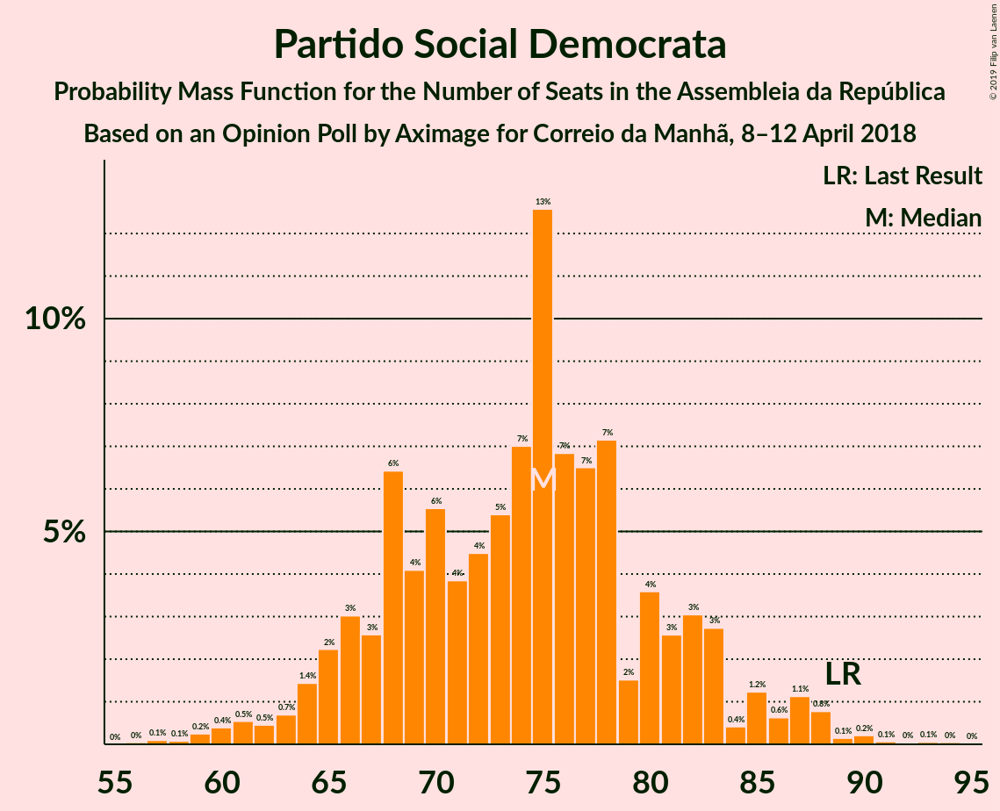

# Opinion Poll by Aximage for Correio da Manhã, 8–12 April 2018

<a href="#voting-intentions">Voting Intentions</a> | <a href="#seats">Seats</a> | <a href="#coalitions">Coalitions</a> | <a href="#technical-information">Technical Information</a>

## Voting Intentions

### Confidence Intervals

| Party | Last Result | Poll Result | 80% Confidence Interval | 90% Confidence Interval | 95% Confidence Interval | 99% Confidence Interval |
|:-----:|:-----------:|:-----------:|:-----------------------:|:-----------------------:|:-----------------------:|:-----------------------:|
| Partido Socialista | 32.3% | 37.9% | 35.5–40.5% |34.8–41.3% |34.1–41.9% |33.0–43.1% |
| Partido Social Democrata | 36.9% | 26.6% | 24.4–29.0% |23.8–29.7% |23.2–30.3% |22.2–31.5% |
| Bloco de Esquerda | 10.2% | 10.0% | 8.6–11.7% |8.2–12.2% |7.8–12.7% |7.2–13.5% |
| Coligação Democrática Unitária | 8.2% | 7.7% | 6.4–9.2% |6.1–9.7% |5.8–10.1% |5.2–10.9% |
| CDS–Partido Popular | 36.9% | 7.0% | 5.8–8.5% |5.5–8.9% |5.2–9.3% |4.7–10.1% |

*Note:* The poll result column reflects the actual value used in the calculations. Published results may vary slightly, and in addition be rounded to fewer digits.

## Seats

### Confidence Intervals

| Party | Last Result | Median | 80% Confidence Interval | 90% Confidence Interval | 95% Confidence Interval | 99% Confidence Interval |
|:-----:|:-----------:|:------:|:-----------------------:|:-----------------------:|:-----------------------:|:-----------------------:|
| <a href="#partido-socialista">Partido Socialista</a> | 86 | 97 | 97–99 |97–102 |97–117 |89–119 |
| <a href="#partido-social-democrata">Partido Social Democrata</a> | 89 | 83 | 76–83 |69–83 |68–83 |60–89 |
| <a href="#bloco-de-esquerda">Bloco de Esquerda</a> | 19 | 24 | 23–24 |23–26 |18–29 |12–34 |
| <a href="#coligação-democrática-unitária">Coligação Democrática Unitária</a> | 17 | 10 | 10–11 |10–13 |10–18 |8–23 |
| <a href="#cds–partido-popular">CDS–Partido Popular</a> | 18 | 16 | 15–16 |11–16 |10–21 |6–23 |

### Partido Socialista

*For a full overview of the results for this party, see the [Partido Socialista](party-partidosocialista.html) page.*

| Number of Seats | Probability | Accumulated | Special Marks |
|:---------------:|:-----------:|:-----------:|:-------------:|
| 86 | 0% | 100% | Last Result |
| 87 | 0% | 100% |  |
| 88 | 0% | 100% |  |
| 89 | 0.6% | 100% |  |
| 90 | 0% | 99.4% |  |
| 91 | 0% | 99.4% |  |
| 92 | 0% | 99.4% |  |
| 93 | 0% | 99.4% |  |
| 94 | 0% | 99.4% |  |
| 95 | 0.2% | 99.4% |  |
| 96 | 0.1% | 99.2% |  |
| 97 | 58% | 99.2% | Median |
| 98 | 31% | 42% |  |
| 99 | 1.3% | 11% |  |
| 100 | 0.7% | 9% |  |
| 101 | 0.7% | 9% |  |
| 102 | 4% | 8% |  |
| 103 | 0.1% | 4% |  |
| 104 | 0.1% | 4% |  |
| 105 | 0% | 4% |  |
| 106 | 0% | 4% |  |
| 107 | 0% | 4% |  |
| 108 | 0% | 4% |  |
| 109 | 0% | 4% |  |
| 110 | 0% | 4% |  |
| 111 | 0% | 4% |  |
| 112 | 0.2% | 4% |  |
| 113 | 0.1% | 3% |  |
| 114 | 0% | 3% |  |
| 115 | 0% | 3% |  |
| 116 | 0% | 3% | Majority |
| 117 | 1.0% | 3% |  |
| 118 | 1.1% | 2% |  |
| 119 | 1.2% | 1.2% |  |
| 120 | 0% | 0% |  |

### Partido Social Democrata

*For a full overview of the results for this party, see the [Partido Social Democrata](party-partidosocialdemocrata.html) page.*

| Number of Seats | Probability | Accumulated | Special Marks |
|:---------------:|:-----------:|:-----------:|:-------------:|
| 59 | 0.2% | 100% |  |
| 60 | 1.1% | 99.8% |  |
| 61 | 0% | 98.7% |  |
| 62 | 0% | 98.7% |  |
| 63 | 0% | 98.7% |  |
| 64 | 0% | 98.7% |  |
| 65 | 0% | 98.6% |  |
| 66 | 0% | 98.6% |  |
| 67 | 0.2% | 98.6% |  |
| 68 | 3% | 98% |  |
| 69 | 2% | 96% |  |
| 70 | 2% | 94% |  |
| 71 | 0% | 92% |  |
| 72 | 0% | 92% |  |
| 73 | 0% | 92% |  |
| 74 | 0% | 92% |  |
| 75 | 2% | 92% |  |
| 76 | 0.6% | 90% |  |
| 77 | 0% | 90% |  |
| 78 | 0% | 90% |  |
| 79 | 0% | 90% |  |
| 80 | 0% | 90% |  |
| 81 | 0.5% | 90% |  |
| 82 | 0% | 89% |  |
| 83 | 88% | 89% | Median |
| 84 | 0% | 0.7% |  |
| 85 | 0% | 0.7% |  |
| 86 | 0% | 0.7% |  |
| 87 | 0% | 0.7% |  |
| 88 | 0% | 0.7% |  |
| 89 | 0.5% | 0.7% | Last Result |
| 90 | 0.1% | 0.2% |  |
| 91 | 0% | 0.1% |  |
| 92 | 0% | 0.1% |  |
| 93 | 0% | 0.1% |  |
| 94 | 0% | 0.1% |  |
| 95 | 0% | 0.1% |  |
| 96 | 0% | 0.1% |  |
| 97 | 0% | 0.1% |  |
| 98 | 0% | 0.1% |  |
| 99 | 0% | 0.1% |  |
| 100 | 0% | 0% |  |

### Bloco de Esquerda

*For a full overview of the results for this party, see the [Bloco de Esquerda](party-blocodeesquerda.html) page.*

| Number of Seats | Probability | Accumulated | Special Marks |
|:---------------:|:-----------:|:-----------:|:-------------:|
| 10 | 0.1% | 100% |  |
| 11 | 0.2% | 99.9% |  |
| 12 | 0.3% | 99.8% |  |
| 13 | 1.3% | 99.5% |  |
| 14 | 0.2% | 98% |  |
| 15 | 0% | 98% |  |
| 16 | 0% | 98% |  |
| 17 | 0.1% | 98% |  |
| 18 | 0.6% | 98% |  |
| 19 | 0.1% | 97% | Last Result |
| 20 | 0.2% | 97% |  |
| 21 | 0% | 97% |  |
| 22 | 0.2% | 97% |  |
| 23 | 31% | 97% |  |
| 24 | 58% | 66% | Median |
| 25 | 0.8% | 8% |  |
| 26 | 2% | 7% |  |
| 27 | 0.9% | 5% |  |
| 28 | 0.4% | 4% |  |
| 29 | 2% | 4% |  |
| 30 | 0.2% | 1.5% |  |
| 31 | 0.6% | 1.3% |  |
| 32 | 0% | 0.7% |  |
| 33 | 0% | 0.7% |  |
| 34 | 0.7% | 0.7% |  |
| 35 | 0% | 0% |  |

### Coligação Democrática Unitária

*For a full overview of the results for this party, see the [Coligação Democrática Unitária](party-coligaçãodemocráticaunitária.html) page.*

| Number of Seats | Probability | Accumulated | Special Marks |
|:---------------:|:-----------:|:-----------:|:-------------:|
| 8 | 0.9% | 100% |  |
| 9 | 1.2% | 99.1% |  |
| 10 | 70% | 98% | Median |
| 11 | 19% | 28% |  |
| 12 | 0.2% | 9% |  |
| 13 | 5% | 9% |  |
| 14 | 0% | 4% |  |
| 15 | 0% | 4% |  |
| 16 | 0% | 4% |  |
| 17 | 0.5% | 4% | Last Result |
| 18 | 3% | 4% |  |
| 19 | 0% | 1.0% |  |
| 20 | 0% | 1.0% |  |
| 21 | 0% | 1.0% |  |
| 22 | 0% | 1.0% |  |
| 23 | 0.6% | 1.0% |  |
| 24 | 0.4% | 0.4% |  |
| 25 | 0% | 0% |  |

### CDS–Partido Popular

*For a full overview of the results for this party, see the [CDS–Partido Popular](party-cds–partidopopular.html) page.*

| Number of Seats | Probability | Accumulated | Special Marks |
|:---------------:|:-----------:|:-----------:|:-------------:|
| 3 | 0.1% | 100% |  |
| 4 | 0.2% | 99.9% |  |
| 5 | 0% | 99.8% |  |
| 6 | 0.5% | 99.8% |  |
| 7 | 0.1% | 99.3% |  |
| 8 | 0% | 99.2% |  |
| 9 | 0.9% | 99.2% |  |
| 10 | 1.1% | 98% |  |
| 11 | 3% | 97% |  |
| 12 | 0% | 95% |  |
| 13 | 0% | 95% |  |
| 14 | 0% | 95% |  |
| 15 | 19% | 95% |  |
| 16 | 71% | 76% | Median |
| 17 | 0% | 4% |  |
| 18 | 0% | 4% | Last Result |
| 19 | 0% | 4% |  |
| 20 | 0.3% | 4% |  |
| 21 | 2% | 4% |  |
| 22 | 0.7% | 2% |  |
| 23 | 0.7% | 0.8% |  |
| 24 | 0.1% | 0.2% |  |
| 25 | 0% | 0% |  |

## Coalitions

### Confidence Intervals

| Coalition | Last Result | Median | Majority? | 80% Confidence Interval | 90% Confidence Interval | 95% Confidence Interval | 99% Confidence Interval |
|:---------:|:-----------:|:------:|:---------:|:-----------------------:|:-----------------------:|:-----------------------:|:-----------------------:|
| Partido Socialista – Bloco de Esquerda – Coligação Democrática Unitária | 122 | 131 | 100% | 131–138 | 131–142 | 131–149 | 130–161 |
| Partido Socialista – Bloco de Esquerda | 105 | 121 | 99.3% | 121–125 | 121–130 | 121–131 | 107–148 |
| Partido Socialista – Coligação Democrática Unitária | 103 | 108 | 7% | 107–115 | 107–120 | 107–126 | 107–132 |
| Partido Socialista | 86 | 97 | 3% | 97–99 | 97–102 | 97–117 | 89–119 |
| Partido Social Democrata – CDS–Partido Popular | 107 | 99 | 0% | 92–99 | 88–99 | 81–99 | 69–100 |

### Partido Socialista – Bloco de Esquerda – Coligação Democrática Unitária

| Number of Seats | Probability | Accumulated | Special Marks |
|:---------------:|:-----------:|:-----------:|:-------------:|
| 122 | 0% | 100% | Last Result |
| 123 | 0% | 100% |  |
| 124 | 0% | 99.9% |  |
| 125 | 0% | 99.9% |  |
| 126 | 0% | 99.9% |  |
| 127 | 0% | 99.9% |  |
| 128 | 0% | 99.9% |  |
| 129 | 0.1% | 99.9% |  |
| 130 | 0.5% | 99.8% |  |
| 131 | 70% | 99.3% | Median |
| 132 | 19% | 30% |  |
| 133 | 0% | 11% |  |
| 134 | 0% | 11% |  |
| 135 | 0% | 11% |  |
| 136 | 0% | 11% |  |
| 137 | 0.1% | 11% |  |
| 138 | 1.2% | 11% |  |
| 139 | 1.3% | 10% |  |
| 140 | 0.9% | 8% |  |
| 141 | 2% | 7% |  |
| 142 | 0.2% | 5% |  |
| 143 | 0.5% | 5% |  |
| 144 | 0% | 4% |  |
| 145 | 0% | 4% |  |
| 146 | 0% | 4% |  |
| 147 | 0% | 4% |  |
| 148 | 0% | 4% |  |
| 149 | 2% | 4% |  |
| 150 | 0.1% | 2% |  |
| 151 | 1.0% | 2% |  |
| 152 | 0% | 1.3% |  |
| 153 | 0% | 1.3% |  |
| 154 | 0% | 1.3% |  |
| 155 | 0% | 1.3% |  |
| 156 | 0% | 1.3% |  |
| 157 | 0% | 1.3% |  |
| 158 | 0% | 1.3% |  |
| 159 | 0% | 1.3% |  |
| 160 | 0.4% | 1.3% |  |
| 161 | 0.9% | 0.9% |  |
| 162 | 0% | 0% |  |

### Partido Socialista – Bloco de Esquerda

| Number of Seats | Probability | Accumulated | Special Marks |
|:---------------:|:-----------:|:-----------:|:-------------:|
| 105 | 0% | 100% | Last Result |
| 106 | 0.1% | 100% |  |
| 107 | 0.5% | 99.9% |  |
| 108 | 0% | 99.4% |  |
| 109 | 0% | 99.4% |  |
| 110 | 0% | 99.4% |  |
| 111 | 0% | 99.4% |  |
| 112 | 0% | 99.4% |  |
| 113 | 0% | 99.4% |  |
| 114 | 0% | 99.4% |  |
| 115 | 0% | 99.3% |  |
| 116 | 0% | 99.3% | Majority |
| 117 | 0.3% | 99.3% |  |
| 118 | 0% | 99.0% |  |
| 119 | 0% | 99.0% |  |
| 120 | 0% | 98.9% |  |
| 121 | 88% | 98.9% | Median |
| 122 | 0% | 11% |  |
| 123 | 0% | 11% |  |
| 124 | 0.1% | 11% |  |
| 125 | 0.7% | 10% |  |
| 126 | 0.5% | 10% |  |
| 127 | 0.7% | 9% |  |
| 128 | 2% | 9% |  |
| 129 | 0.4% | 7% |  |
| 130 | 1.1% | 6% |  |
| 131 | 3% | 5% |  |
| 132 | 0.1% | 2% |  |
| 133 | 0.8% | 2% |  |
| 134 | 0% | 2% |  |
| 135 | 0% | 2% |  |
| 136 | 0% | 2% |  |
| 137 | 0% | 2% |  |
| 138 | 0% | 2% |  |
| 139 | 0.2% | 2% |  |
| 140 | 0.1% | 1.4% |  |
| 141 | 0% | 1.3% |  |
| 142 | 0% | 1.3% |  |
| 143 | 0% | 1.3% |  |
| 144 | 0% | 1.3% |  |
| 145 | 0% | 1.3% |  |
| 146 | 0% | 1.3% |  |
| 147 | 0.4% | 1.3% |  |
| 148 | 0.9% | 0.9% |  |
| 149 | 0% | 0% |  |

### Partido Socialista – Coligação Democrática Unitária

| Number of Seats | Probability | Accumulated | Special Marks |
|:---------------:|:-----------:|:-----------:|:-------------:|
| 103 | 0% | 100% | Last Result |
| 104 | 0.1% | 100% |  |
| 105 | 0% | 99.9% |  |
| 106 | 0% | 99.9% |  |
| 107 | 39% | 99.9% | Median |
| 108 | 50% | 61% |  |
| 109 | 0.1% | 12% |  |
| 110 | 0% | 12% |  |
| 111 | 0% | 12% |  |
| 112 | 0.6% | 12% |  |
| 113 | 0.1% | 11% |  |
| 114 | 0.7% | 11% |  |
| 115 | 3% | 10% |  |
| 116 | 0.5% | 7% | Majority |
| 117 | 0.7% | 7% |  |
| 118 | 0.6% | 6% |  |
| 119 | 0.2% | 5% |  |
| 120 | 1.3% | 5% |  |
| 121 | 0.3% | 4% |  |
| 122 | 0.1% | 4% |  |
| 123 | 0% | 4% |  |
| 124 | 0.2% | 4% |  |
| 125 | 0% | 3% |  |
| 126 | 2% | 3% |  |
| 127 | 0.2% | 2% |  |
| 128 | 0.1% | 1.4% |  |
| 129 | 0% | 1.4% |  |
| 130 | 0% | 1.4% |  |
| 131 | 0.2% | 1.4% |  |
| 132 | 1.1% | 1.2% |  |
| 133 | 0% | 0.1% |  |
| 134 | 0.1% | 0.1% |  |
| 135 | 0% | 0% |  |

### Partido Socialista

| Number of Seats | Probability | Accumulated | Special Marks |
|:---------------:|:-----------:|:-----------:|:-------------:|
| 86 | 0% | 100% | Last Result |
| 87 | 0% | 100% |  |
| 88 | 0% | 100% |  |
| 89 | 0.6% | 100% |  |
| 90 | 0% | 99.4% |  |
| 91 | 0% | 99.4% |  |
| 92 | 0% | 99.4% |  |
| 93 | 0% | 99.4% |  |
| 94 | 0% | 99.4% |  |
| 95 | 0.2% | 99.4% |  |
| 96 | 0.1% | 99.2% |  |
| 97 | 58% | 99.2% | Median |
| 98 | 31% | 42% |  |
| 99 | 1.3% | 11% |  |
| 100 | 0.7% | 9% |  |
| 101 | 0.7% | 9% |  |
| 102 | 4% | 8% |  |
| 103 | 0.1% | 4% |  |
| 104 | 0.1% | 4% |  |
| 105 | 0% | 4% |  |
| 106 | 0% | 4% |  |
| 107 | 0% | 4% |  |
| 108 | 0% | 4% |  |
| 109 | 0% | 4% |  |
| 110 | 0% | 4% |  |
| 111 | 0% | 4% |  |
| 112 | 0.2% | 4% |  |
| 113 | 0.1% | 3% |  |
| 114 | 0% | 3% |  |
| 115 | 0% | 3% |  |
| 116 | 0% | 3% | Majority |
| 117 | 1.0% | 3% |  |
| 118 | 1.1% | 2% |  |
| 119 | 1.2% | 1.2% |  |
| 120 | 0% | 0% |  |

### Partido Social Democrata – CDS–Partido Popular

| Number of Seats | Probability | Accumulated | Special Marks |
|:---------------:|:-----------:|:-----------:|:-------------:|
| 69 | 1.1% | 100% |  |
| 70 | 0.2% | 98.9% |  |
| 71 | 0% | 98.7% |  |
| 72 | 0% | 98.7% |  |
| 73 | 0% | 98.7% |  |
| 74 | 0% | 98.7% |  |
| 75 | 0% | 98.7% |  |
| 76 | 0% | 98.7% |  |
| 77 | 0% | 98.7% |  |
| 78 | 0% | 98.7% |  |
| 79 | 1.0% | 98.7% |  |
| 80 | 0.1% | 98% |  |
| 81 | 2% | 98% |  |
| 82 | 0% | 96% |  |
| 83 | 0% | 96% |  |
| 84 | 0% | 96% |  |
| 85 | 0% | 96% |  |
| 86 | 0% | 96% |  |
| 87 | 0.5% | 96% |  |
| 88 | 0.2% | 95% |  |
| 89 | 2% | 95% |  |
| 90 | 0.9% | 93% |  |
| 91 | 1.3% | 92% |  |
| 92 | 1.2% | 90% |  |
| 93 | 0.1% | 89% |  |
| 94 | 0% | 89% |  |
| 95 | 0% | 89% |  |
| 96 | 0% | 89% |  |
| 97 | 0% | 89% |  |
| 98 | 19% | 89% |  |
| 99 | 70% | 70% | Median |
| 100 | 0.5% | 0.7% |  |
| 101 | 0.1% | 0.2% |  |
| 102 | 0% | 0.1% |  |
| 103 | 0% | 0.1% |  |
| 104 | 0% | 0.1% |  |
| 105 | 0% | 0.1% |  |
| 106 | 0% | 0.1% |  |
| 107 | 0% | 0.1% | Last Result |
| 108 | 0% | 0% |  |

## Technical Information

### Opinion Poll

+ **Polling firm:** Aximage
+ **Commissioner(s):** Correio da Manhã
+ **Fieldwork period:** 8–12 April 2018

### Calculations

+ **Sample size:** 601
+ **Simulations done:** 1,024
+ **Error estimate:** 4.98%

