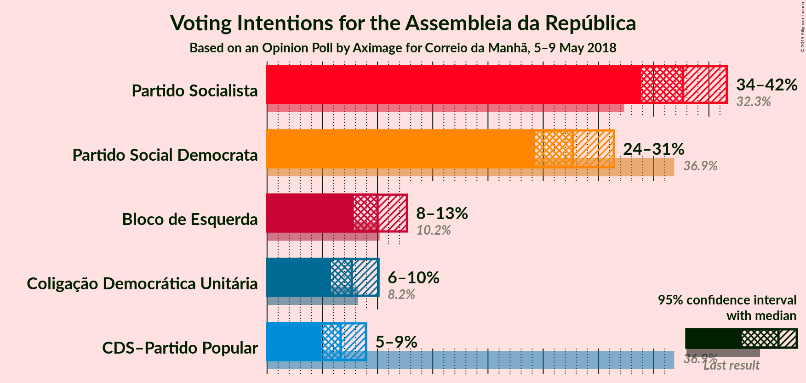
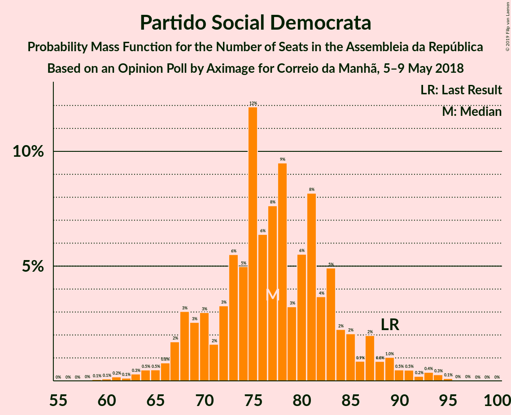
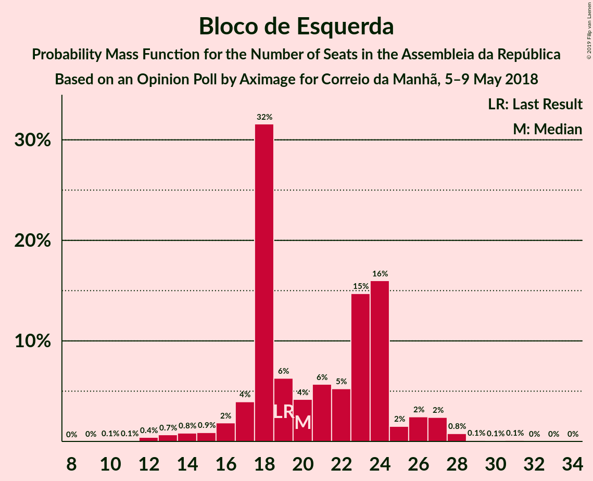
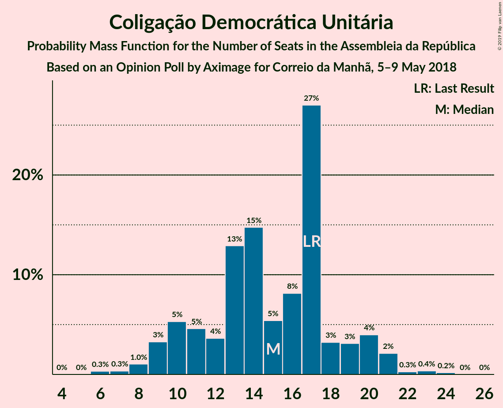

# Opinion Poll by Aximage for Correio da Manhã, 5–9 May 2018

<a href="#voting-intentions">Voting Intentions</a> | <a href="#seats">Seats</a> | <a href="#coalitions">Coalitions</a> | <a href="#technical-information">Technical Information</a>

## Voting Intentions

### Confidence Intervals

| Party | Last Result | Poll Result | 80% Confidence Interval | 90% Confidence Interval | 95% Confidence Interval | 99% Confidence Interval |
|:-----:|:-----------:|:-----------:|:-----------------------:|:-----------------------:|:-----------------------:|:-----------------------:|
| Partido Socialista | 32.3% | 37.7% | 35.2–40.3% |34.5–41.0% |33.9–41.6% |32.7–42.9% |
| Partido Social Democrata | 36.9% | 27.7% | 25.4–30.1% |24.8–30.8% |24.2–31.4% |23.2–32.6% |
| Bloco de Esquerda | 10.2% | 10.0% | 8.6–11.7% |8.2–12.2% |7.8–12.7% |7.2–13.5% |
| Coligação Democrática Unitária | 8.2% | 7.7% | 6.4–9.2% |6.1–9.7% |5.8–10.1% |5.3–10.9% |
| CDS–Partido Popular | 36.9% | 6.7% | 5.5–8.2% |5.2–8.6% |4.9–9.0% |4.4–9.7% |

*Note:* The poll result column reflects the actual value used in the calculations. Published results may vary slightly, and in addition be rounded to fewer digits.

## Seats

### Confidence Intervals

| Party | Last Result | Median | 80% Confidence Interval | 90% Confidence Interval | 95% Confidence Interval | 99% Confidence Interval |
|:-----:|:-----------:|:------:|:-----------------------:|:-----------------------:|:-----------------------:|:-----------------------:|
| <a href="#partido-socialista">Partido Socialista</a> | 86 | 97 | 95–98 |94–98 |93–98 |93–115 |
| <a href="#partido-social-democrata">Partido Social Democrata</a> | 89 | 79 | 79–87 |79–87 |73–93 |66–93 |
| <a href="#bloco-de-esquerda">Bloco de Esquerda</a> | 19 | 21 | 18–23 |17–26 |17–27 |17–27 |
| <a href="#coligação-democrática-unitária">Coligação Democrática Unitária</a> | 17 | 20 | 14–20 |14–20 |13–20 |12–23 |
| <a href="#cds–partido-popular">CDS–Partido Popular</a> | 18 | 11 | 10–15 |10–16 |10–18 |9–20 |

### Partido Socialista

*For a full overview of the results for this party, see the [Partido Socialista](party-partidosocialista.html) page.*

| Number of Seats | Probability | Accumulated | Special Marks |
|:---------------:|:-----------:|:-----------:|:-------------:|
| 86 | 0% | 100% | Last Result |
| 87 | 0% | 100% |  |
| 88 | 0% | 100% |  |
| 89 | 0% | 100% |  |
| 90 | 0% | 100% |  |
| 91 | 0% | 100% |  |
| 92 | 0% | 100% |  |
| 93 | 5% | 100% |  |
| 94 | 4% | 95% |  |
| 95 | 21% | 91% |  |
| 96 | 0.8% | 70% |  |
| 97 | 23% | 69% | Median |
| 98 | 44% | 46% |  |
| 99 | 0.4% | 1.3% |  |
| 100 | 0% | 0.9% |  |
| 101 | 0% | 0.8% |  |
| 102 | 0% | 0.8% |  |
| 103 | 0% | 0.8% |  |
| 104 | 0% | 0.8% |  |
| 105 | 0% | 0.8% |  |
| 106 | 0% | 0.8% |  |
| 107 | 0% | 0.8% |  |
| 108 | 0% | 0.8% |  |
| 109 | 0% | 0.7% |  |
| 110 | 0% | 0.7% |  |
| 111 | 0% | 0.7% |  |
| 112 | 0% | 0.7% |  |
| 113 | 0% | 0.7% |  |
| 114 | 0% | 0.7% |  |
| 115 | 0.3% | 0.7% |  |
| 116 | 0.2% | 0.4% | Majority |
| 117 | 0.1% | 0.2% |  |
| 118 | 0.1% | 0.1% |  |
| 119 | 0% | 0% |  |

### Partido Social Democrata

*For a full overview of the results for this party, see the [Partido Social Democrata](party-partidosocialdemocrata.html) page.*

| Number of Seats | Probability | Accumulated | Special Marks |
|:---------------:|:-----------:|:-----------:|:-------------:|
| 59 | 0.1% | 100% |  |
| 60 | 0% | 99.9% |  |
| 61 | 0% | 99.9% |  |
| 62 | 0% | 99.9% |  |
| 63 | 0% | 99.9% |  |
| 64 | 0% | 99.9% |  |
| 65 | 0.3% | 99.9% |  |
| 66 | 0.3% | 99.6% |  |
| 67 | 0% | 99.3% |  |
| 68 | 0% | 99.3% |  |
| 69 | 0% | 99.3% |  |
| 70 | 0% | 99.2% |  |
| 71 | 0.2% | 99.2% |  |
| 72 | 0% | 99.1% |  |
| 73 | 4% | 99.0% |  |
| 74 | 0% | 96% |  |
| 75 | 0% | 96% |  |
| 76 | 0% | 96% |  |
| 77 | 0% | 95% |  |
| 78 | 0.1% | 95% |  |
| 79 | 47% | 95% | Median |
| 80 | 4% | 48% |  |
| 81 | 0% | 44% |  |
| 82 | 0% | 44% |  |
| 83 | 1.2% | 44% |  |
| 84 | 11% | 43% |  |
| 85 | 4% | 32% |  |
| 86 | 3% | 28% |  |
| 87 | 20% | 24% |  |
| 88 | 0.2% | 4% |  |
| 89 | 0% | 4% | Last Result |
| 90 | 0% | 4% |  |
| 91 | 0% | 4% |  |
| 92 | 0.2% | 4% |  |
| 93 | 4% | 4% |  |
| 94 | 0% | 0.1% |  |
| 95 | 0% | 0% |  |

### Bloco de Esquerda

*For a full overview of the results for this party, see the [Bloco de Esquerda](party-blocodeesquerda.html) page.*

| Number of Seats | Probability | Accumulated | Special Marks |
|:---------------:|:-----------:|:-----------:|:-------------:|
| 11 | 0% | 100% |  |
| 12 | 0% | 99.9% |  |
| 13 | 0% | 99.9% |  |
| 14 | 0% | 99.9% |  |
| 15 | 0% | 99.9% |  |
| 16 | 0.3% | 99.9% |  |
| 17 | 9% | 99.6% |  |
| 18 | 18% | 90% |  |
| 19 | 15% | 72% | Last Result |
| 20 | 2% | 57% |  |
| 21 | 10% | 55% | Median |
| 22 | 16% | 44% |  |
| 23 | 21% | 28% |  |
| 24 | 0.1% | 8% |  |
| 25 | 0.5% | 8% |  |
| 26 | 3% | 7% |  |
| 27 | 4% | 4% |  |
| 28 | 0% | 0.1% |  |
| 29 | 0% | 0.1% |  |
| 30 | 0% | 0.1% |  |
| 31 | 0% | 0.1% |  |
| 32 | 0% | 0.1% |  |
| 33 | 0% | 0% |  |

### Coligação Democrática Unitária

*For a full overview of the results for this party, see the [Coligação Democrática Unitária](party-coligaçãodemocráticaunitária.html) page.*

| Number of Seats | Probability | Accumulated | Special Marks |
|:---------------:|:-----------:|:-----------:|:-------------:|
| 12 | 2% | 100% |  |
| 13 | 2% | 98% |  |
| 14 | 24% | 97% |  |
| 15 | 3% | 73% |  |
| 16 | 0.2% | 70% |  |
| 17 | 2% | 70% | Last Result |
| 18 | 1.3% | 68% |  |
| 19 | 0.4% | 67% |  |
| 20 | 65% | 67% | Median |
| 21 | 1.3% | 2% |  |
| 22 | 0.1% | 0.7% |  |
| 23 | 0.5% | 0.5% |  |
| 24 | 0% | 0% |  |

### CDS–Partido Popular

*For a full overview of the results for this party, see the [CDS–Partido Popular](party-cds–partidopopular.html) page.*

| Number of Seats | Probability | Accumulated | Special Marks |
|:---------------:|:-----------:|:-----------:|:-------------:|
| 6 | 0% | 100% |  |
| 7 | 0.1% | 99.9% |  |
| 8 | 0.3% | 99.8% |  |
| 9 | 0.3% | 99.5% |  |
| 10 | 18% | 99.2% |  |
| 11 | 37% | 81% | Median |
| 12 | 14% | 45% |  |
| 13 | 0.6% | 30% |  |
| 14 | 0.7% | 30% |  |
| 15 | 19% | 29% |  |
| 16 | 6% | 10% |  |
| 17 | 0.1% | 4% |  |
| 18 | 3% | 4% | Last Result |
| 19 | 0% | 0.7% |  |
| 20 | 0.6% | 0.7% |  |
| 21 | 0% | 0.1% |  |
| 22 | 0% | 0% |  |

## Coalitions

### Confidence Intervals

| Coalition | Last Result | Median | Majority? | 80% Confidence Interval | 90% Confidence Interval | 95% Confidence Interval | 99% Confidence Interval |
|:---------:|:-----------:|:------:|:---------:|:-----------------------:|:-----------------------:|:-----------------------:|:-----------------------:|
| Partido Socialista – Bloco de Esquerda – Coligação Democrática Unitária | 122 | 138 | 100% | 128–140 | 127–140 | 125–142 | 125–156 |
| Partido Socialista – Bloco de Esquerda | 105 | 119 | 68% | 114–120 | 113–120 | 110–124 | 110–133 |
| Partido Socialista – Coligação Democrática Unitária | 103 | 117 | 67% | 108–118 | 108–118 | 107–118 | 106–138 |
| Partido Social Democrata – CDS–Partido Popular | 107 | 92 | 0% | 90–102 | 90–103 | 88–105 | 74–105 |
| Partido Socialista | 86 | 97 | 0.4% | 95–98 | 94–98 | 93–98 | 93–115 |

### Partido Socialista – Bloco de Esquerda – Coligação Democrática Unitária

| Number of Seats | Probability | Accumulated | Special Marks |
|:---------------:|:-----------:|:-----------:|:-------------:|
| 122 | 0% | 100% | Last Result |
| 123 | 0% | 100% |  |
| 124 | 0% | 100% |  |
| 125 | 4% | 100% |  |
| 126 | 0.2% | 96% |  |
| 127 | 6% | 96% |  |
| 128 | 14% | 90% |  |
| 129 | 2% | 76% |  |
| 130 | 0% | 74% |  |
| 131 | 0.8% | 74% |  |
| 132 | 1.2% | 73% |  |
| 133 | 2% | 72% |  |
| 134 | 2% | 70% |  |
| 135 | 4% | 68% |  |
| 136 | 11% | 64% |  |
| 137 | 2% | 53% |  |
| 138 | 2% | 51% | Median |
| 139 | 8% | 49% |  |
| 140 | 36% | 41% |  |
| 141 | 0.1% | 4% |  |
| 142 | 3% | 4% |  |
| 143 | 0.7% | 2% |  |
| 144 | 0.2% | 1.0% |  |
| 145 | 0% | 0.8% |  |
| 146 | 0% | 0.8% |  |
| 147 | 0% | 0.8% |  |
| 148 | 0% | 0.8% |  |
| 149 | 0% | 0.8% |  |
| 150 | 0% | 0.8% |  |
| 151 | 0% | 0.8% |  |
| 152 | 0% | 0.8% |  |
| 153 | 0% | 0.8% |  |
| 154 | 0% | 0.7% |  |
| 155 | 0% | 0.7% |  |
| 156 | 0.6% | 0.7% |  |
| 157 | 0% | 0.1% |  |
| 158 | 0% | 0.1% |  |
| 159 | 0% | 0.1% |  |
| 160 | 0% | 0.1% |  |
| 161 | 0.1% | 0.1% |  |
| 162 | 0% | 0% |  |

### Partido Socialista – Bloco de Esquerda

| Number of Seats | Probability | Accumulated | Special Marks |
|:---------------:|:-----------:|:-----------:|:-------------:|
| 105 | 0% | 100% | Last Result |
| 106 | 0% | 100% |  |
| 107 | 0% | 100% |  |
| 108 | 0% | 100% |  |
| 109 | 0% | 99.9% |  |
| 110 | 2% | 99.9% |  |
| 111 | 0.2% | 97% |  |
| 112 | 1.4% | 97% |  |
| 113 | 6% | 96% |  |
| 114 | 16% | 90% |  |
| 115 | 6% | 74% |  |
| 116 | 12% | 68% | Majority |
| 117 | 0% | 56% |  |
| 118 | 3% | 56% | Median |
| 119 | 11% | 53% |  |
| 120 | 38% | 42% |  |
| 121 | 0.1% | 5% |  |
| 122 | 0% | 5% |  |
| 123 | 0.7% | 5% |  |
| 124 | 2% | 4% |  |
| 125 | 1.4% | 2% |  |
| 126 | 0% | 0.8% |  |
| 127 | 0% | 0.8% |  |
| 128 | 0% | 0.8% |  |
| 129 | 0% | 0.8% |  |
| 130 | 0% | 0.8% |  |
| 131 | 0% | 0.8% |  |
| 132 | 0% | 0.8% |  |
| 133 | 0.5% | 0.8% |  |
| 134 | 0.1% | 0.3% |  |
| 135 | 0% | 0.2% |  |
| 136 | 0% | 0.2% |  |
| 137 | 0% | 0.1% |  |
| 138 | 0% | 0.1% |  |
| 139 | 0% | 0.1% |  |
| 140 | 0.1% | 0.1% |  |
| 141 | 0% | 0% |  |

### Partido Socialista – Coligação Democrática Unitária

| Number of Seats | Probability | Accumulated | Special Marks |
|:---------------:|:-----------:|:-----------:|:-------------:|
| 103 | 0% | 100% | Last Result |
| 104 | 0% | 100% |  |
| 105 | 0% | 100% |  |
| 106 | 2% | 100% |  |
| 107 | 2% | 98% |  |
| 108 | 6% | 96% |  |
| 109 | 20% | 90% |  |
| 110 | 0% | 70% |  |
| 111 | 0% | 70% |  |
| 112 | 0% | 70% |  |
| 113 | 0% | 70% |  |
| 114 | 0% | 70% |  |
| 115 | 3% | 70% |  |
| 116 | 0.7% | 67% | Majority |
| 117 | 22% | 66% | Median |
| 118 | 42% | 44% |  |
| 119 | 1.2% | 2% |  |
| 120 | 0% | 0.8% |  |
| 121 | 0% | 0.8% |  |
| 122 | 0% | 0.8% |  |
| 123 | 0% | 0.8% |  |
| 124 | 0% | 0.8% |  |
| 125 | 0% | 0.8% |  |
| 126 | 0% | 0.7% |  |
| 127 | 0% | 0.7% |  |
| 128 | 0% | 0.7% |  |
| 129 | 0% | 0.7% |  |
| 130 | 0% | 0.7% |  |
| 131 | 0% | 0.7% |  |
| 132 | 0% | 0.7% |  |
| 133 | 0% | 0.7% |  |
| 134 | 0% | 0.7% |  |
| 135 | 0% | 0.7% |  |
| 136 | 0% | 0.7% |  |
| 137 | 0% | 0.7% |  |
| 138 | 0.3% | 0.7% |  |
| 139 | 0.4% | 0.4% |  |
| 140 | 0.1% | 0.1% |  |
| 141 | 0% | 0% |  |

### Partido Social Democrata – CDS–Partido Popular

| Number of Seats | Probability | Accumulated | Special Marks |
|:---------------:|:-----------:|:-----------:|:-------------:|
| 69 | 0.1% | 100% |  |
| 70 | 0% | 99.9% |  |
| 71 | 0% | 99.9% |  |
| 72 | 0% | 99.9% |  |
| 73 | 0% | 99.9% |  |
| 74 | 0.6% | 99.9% |  |
| 75 | 0% | 99.3% |  |
| 76 | 0% | 99.3% |  |
| 77 | 0% | 99.3% |  |
| 78 | 0% | 99.2% |  |
| 79 | 0% | 99.2% |  |
| 80 | 0% | 99.2% |  |
| 81 | 0% | 99.2% |  |
| 82 | 0% | 99.2% |  |
| 83 | 0% | 99.2% |  |
| 84 | 0% | 99.2% |  |
| 85 | 0% | 99.2% |  |
| 86 | 0.2% | 99.2% |  |
| 87 | 0.7% | 99.0% |  |
| 88 | 3% | 98% |  |
| 89 | 0.1% | 96% |  |
| 90 | 36% | 96% | Median |
| 91 | 8% | 59% |  |
| 92 | 2% | 51% |  |
| 93 | 2% | 49% |  |
| 94 | 11% | 47% |  |
| 95 | 4% | 36% |  |
| 96 | 2% | 32% |  |
| 97 | 2% | 30% |  |
| 98 | 1.2% | 28% |  |
| 99 | 0.8% | 27% |  |
| 100 | 0% | 26% |  |
| 101 | 2% | 26% |  |
| 102 | 14% | 24% |  |
| 103 | 6% | 10% |  |
| 104 | 0.2% | 4% |  |
| 105 | 4% | 4% |  |
| 106 | 0% | 0% |  |
| 107 | 0% | 0% | Last Result |

### Partido Socialista

| Number of Seats | Probability | Accumulated | Special Marks |
|:---------------:|:-----------:|:-----------:|:-------------:|
| 86 | 0% | 100% | Last Result |
| 87 | 0% | 100% |  |
| 88 | 0% | 100% |  |
| 89 | 0% | 100% |  |
| 90 | 0% | 100% |  |
| 91 | 0% | 100% |  |
| 92 | 0% | 100% |  |
| 93 | 5% | 100% |  |
| 94 | 4% | 95% |  |
| 95 | 21% | 91% |  |
| 96 | 0.8% | 70% |  |
| 97 | 23% | 69% | Median |
| 98 | 44% | 46% |  |
| 99 | 0.4% | 1.3% |  |
| 100 | 0% | 0.9% |  |
| 101 | 0% | 0.8% |  |
| 102 | 0% | 0.8% |  |
| 103 | 0% | 0.8% |  |
| 104 | 0% | 0.8% |  |
| 105 | 0% | 0.8% |  |
| 106 | 0% | 0.8% |  |
| 107 | 0% | 0.8% |  |
| 108 | 0% | 0.8% |  |
| 109 | 0% | 0.7% |  |
| 110 | 0% | 0.7% |  |
| 111 | 0% | 0.7% |  |
| 112 | 0% | 0.7% |  |
| 113 | 0% | 0.7% |  |
| 114 | 0% | 0.7% |  |
| 115 | 0.3% | 0.7% |  |
| 116 | 0.2% | 0.4% | Majority |
| 117 | 0.1% | 0.2% |  |
| 118 | 0.1% | 0.1% |  |
| 119 | 0% | 0% |  |

## Technical Information

### Opinion Poll

+ **Polling firm:** Aximage
+ **Commissioner(s):** Correio da Manhã
+ **Fieldwork period:** 5–9 May 2018

### Calculations

+ **Sample size:** 600
+ **Simulations done:** 1,024
+ **Error estimate:** 2.48%

