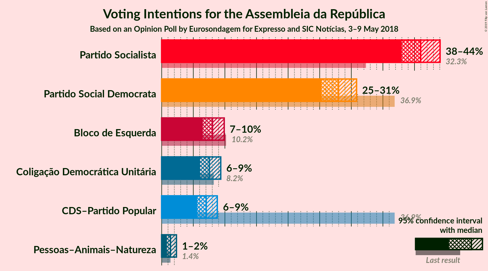
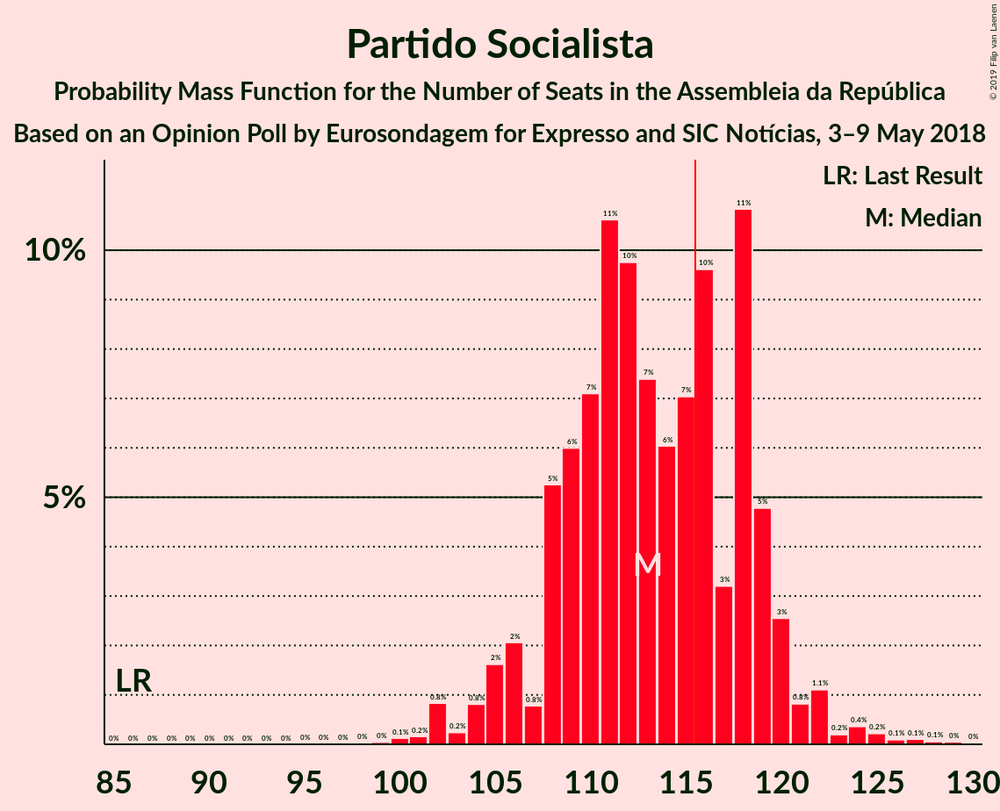

# Opinion Poll by Eurosondagem for Expresso and SIC, 3–9 May 2018

<a href="#voting-intentions">Voting Intentions</a> | <a href="#seats">Seats</a> | <a href="#coalitions">Coalitions</a> | <a href="#technical-information">Technical Information</a>

## Voting Intentions

### Confidence Intervals

| Party | Last Result | Poll Result | 80% Confidence Interval | 90% Confidence Interval | 95% Confidence Interval | 99% Confidence Interval |
|:-----:|:-----------:|:-----------:|:-----------------------:|:-----------------------:|:-----------------------:|:-----------------------:|
| Partido Socialista | 32.3% | 41.0% | 39.0–43.0% |38.5–43.5% |38.0–44.0% |37.0–45.0% |
| Partido Social Democrata | 36.9% | 28.0% | 26.2–29.8% |25.7–30.4% |25.3–30.8% |24.5–31.7% |
| Bloco de Esquerda | 10.2% | 8.0% | 7.0–9.2% |6.8–9.6% |6.5–9.9% |6.1–10.5% |
| Coligação Democrática Unitária | 8.2% | 7.5% | 6.6–8.7% |6.3–9.1% |6.1–9.3% |5.6–9.9% |
| CDS–Partido Popular | 36.9% | 7.0% | 6.1–8.2% |5.8–8.5% |5.6–8.8% |5.2–9.4% |
| Pessoas–Animais–Natureza | 1.4% | 1.4% | 1.0–2.0% |0.9–2.2% |0.8–2.3% |0.7–2.7% |

*Note:* The poll result column reflects the actual value used in the calculations. Published results may vary slightly, and in addition be rounded to fewer digits.

## Seats

### Confidence Intervals

| Party | Last Result | Median | 80% Confidence Interval | 90% Confidence Interval | 95% Confidence Interval | 99% Confidence Interval |
|:-----:|:-----------:|:------:|:-----------------------:|:-----------------------:|:-----------------------:|:-----------------------:|
| <a href="#partido-socialista">Partido Socialista</a> | 86 | 113 | 108–119 |106–120 |105–121 |102–125 |
| <a href="#partido-social-democrata">Partido Social Democrata</a> | 89 | 75 | 71–80 |69–82 |67–84 |65–87 |
| <a href="#bloco-de-esquerda">Bloco de Esquerda</a> | 19 | 15 | 11–18 |10–18 |10–18 |9–21 |
| <a href="#coligação-democrática-unitária">Coligação Democrática Unitária</a> | 17 | 14 | 10–17 |9–18 |9–18 |8–20 |
| <a href="#cds–partido-popular">CDS–Partido Popular</a> | 18 | 10 | 9–15 |8–16 |7–18 |6–19 |
| <a href="#pessoas–animais–natureza">Pessoas–Animais–Natureza</a> | 1 | 1 | 0–2 |0–2 |0–2 |0–2 |

### Partido Socialista

*For a full overview of the results for this party, see the [Partido Socialista](party-partidosocialista.html) page.*

| Number of Seats | Probability | Accumulated | Special Marks |
|:---------------:|:-----------:|:-----------:|:-------------:|
| 86 | 0% | 100% | Last Result |
| 87 | 0% | 100% |  |
| 88 | 0% | 100% |  |
| 89 | 0% | 100% |  |
| 90 | 0% | 100% |  |
| 91 | 0% | 100% |  |
| 92 | 0% | 100% |  |
| 93 | 0% | 100% |  |
| 94 | 0% | 100% |  |
| 95 | 0% | 100% |  |
| 96 | 0% | 100% |  |
| 97 | 0% | 100% |  |
| 98 | 0% | 100% |  |
| 99 | 0% | 99.9% |  |
| 100 | 0.1% | 99.9% |  |
| 101 | 0.2% | 99.8% |  |
| 102 | 0.8% | 99.6% |  |
| 103 | 0.2% | 98.8% |  |
| 104 | 0.8% | 98.5% |  |
| 105 | 2% | 98% |  |
| 106 | 2% | 96% |  |
| 107 | 0.8% | 94% |  |
| 108 | 5% | 93% |  |
| 109 | 6% | 88% |  |
| 110 | 7% | 82% |  |
| 111 | 11% | 75% |  |
| 112 | 10% | 64% |  |
| 113 | 7% | 55% | Median |
| 114 | 6% | 47% |  |
| 115 | 7% | 41% |  |
| 116 | 10% | 34% | Majority |
| 117 | 3% | 24% |  |
| 118 | 11% | 21% |  |
| 119 | 5% | 10% |  |
| 120 | 3% | 6% |  |
| 121 | 0.8% | 3% |  |
| 122 | 1.1% | 2% |  |
| 123 | 0.2% | 1.1% |  |
| 124 | 0.4% | 0.9% |  |
| 125 | 0.2% | 0.6% |  |
| 126 | 0.1% | 0.3% |  |
| 127 | 0.1% | 0.3% |  |
| 128 | 0.1% | 0.1% |  |
| 129 | 0% | 0.1% |  |
| 130 | 0% | 0% |  |

### Partido Social Democrata

*For a full overview of the results for this party, see the [Partido Social Democrata](party-partidosocialdemocrata.html) page.*

| Number of Seats | Probability | Accumulated | Special Marks |
|:---------------:|:-----------:|:-----------:|:-------------:|
| 61 | 0% | 100% |  |
| 62 | 0% | 99.9% |  |
| 63 | 0.1% | 99.9% |  |
| 64 | 0.3% | 99.8% |  |
| 65 | 0.4% | 99.5% |  |
| 66 | 0.8% | 99.1% |  |
| 67 | 2% | 98% |  |
| 68 | 1.0% | 97% |  |
| 69 | 3% | 96% |  |
| 70 | 2% | 93% |  |
| 71 | 5% | 91% |  |
| 72 | 7% | 86% |  |
| 73 | 4% | 79% |  |
| 74 | 14% | 75% |  |
| 75 | 14% | 61% | Median |
| 76 | 9% | 47% |  |
| 77 | 10% | 38% |  |
| 78 | 7% | 28% |  |
| 79 | 9% | 22% |  |
| 80 | 4% | 13% |  |
| 81 | 2% | 9% |  |
| 82 | 2% | 6% |  |
| 83 | 1.4% | 4% |  |
| 84 | 1.1% | 3% |  |
| 85 | 0.5% | 2% |  |
| 86 | 0.3% | 1.2% |  |
| 87 | 0.5% | 0.9% |  |
| 88 | 0.3% | 0.4% |  |
| 89 | 0% | 0.1% | Last Result |
| 90 | 0% | 0.1% |  |
| 91 | 0% | 0% |  |

### Bloco de Esquerda

*For a full overview of the results for this party, see the [Bloco de Esquerda](party-blocodeesquerda.html) page.*

| Number of Seats | Probability | Accumulated | Special Marks |
|:---------------:|:-----------:|:-----------:|:-------------:|
| 8 | 0% | 100% |  |
| 9 | 0.7% | 99.9% |  |
| 10 | 7% | 99.3% |  |
| 11 | 3% | 92% |  |
| 12 | 9% | 89% |  |
| 13 | 13% | 80% |  |
| 14 | 10% | 67% |  |
| 15 | 10% | 57% | Median |
| 16 | 8% | 47% |  |
| 17 | 19% | 38% |  |
| 18 | 18% | 20% |  |
| 19 | 0.7% | 2% | Last Result |
| 20 | 0.4% | 1.4% |  |
| 21 | 0.5% | 1.0% |  |
| 22 | 0.2% | 0.5% |  |
| 23 | 0.2% | 0.3% |  |
| 24 | 0.1% | 0.1% |  |
| 25 | 0% | 0% |  |

### Coligação Democrática Unitária

*For a full overview of the results for this party, see the [Coligação Democrática Unitária](party-coligaçãodemocráticaunitária.html) page.*

| Number of Seats | Probability | Accumulated | Special Marks |
|:---------------:|:-----------:|:-----------:|:-------------:|
| 6 | 0.1% | 100% |  |
| 7 | 0.2% | 99.9% |  |
| 8 | 0.4% | 99.7% |  |
| 9 | 4% | 99.2% |  |
| 10 | 7% | 95% |  |
| 11 | 6% | 88% |  |
| 12 | 7% | 82% |  |
| 13 | 12% | 75% |  |
| 14 | 23% | 64% | Median |
| 15 | 8% | 41% |  |
| 16 | 8% | 33% |  |
| 17 | 19% | 25% | Last Result |
| 18 | 4% | 6% |  |
| 19 | 0.8% | 2% |  |
| 20 | 1.1% | 1.4% |  |
| 21 | 0.2% | 0.3% |  |
| 22 | 0% | 0% |  |

### CDS–Partido Popular

*For a full overview of the results for this party, see the [CDS–Partido Popular](party-cds–partidopopular.html) page.*

| Number of Seats | Probability | Accumulated | Special Marks |
|:---------------:|:-----------:|:-----------:|:-------------:|
| 6 | 1.4% | 100% |  |
| 7 | 2% | 98.6% |  |
| 8 | 6% | 97% |  |
| 9 | 5% | 90% |  |
| 10 | 36% | 85% | Median |
| 11 | 7% | 49% |  |
| 12 | 11% | 42% |  |
| 13 | 12% | 31% |  |
| 14 | 7% | 19% |  |
| 15 | 5% | 12% |  |
| 16 | 2% | 7% |  |
| 17 | 2% | 5% |  |
| 18 | 2% | 3% | Last Result |
| 19 | 1.2% | 1.4% |  |
| 20 | 0.1% | 0.2% |  |
| 21 | 0% | 0.1% |  |
| 22 | 0% | 0% |  |

### Pessoas–Animais–Natureza

*For a full overview of the results for this party, see the [Pessoas–Animais–Natureza](party-pessoas–animais–natureza.html) page.*

| Number of Seats | Probability | Accumulated | Special Marks |
|:---------------:|:-----------:|:-----------:|:-------------:|
| 0 | 36% | 100% |  |
| 1 | 54% | 64% | Last Result, Median |
| 2 | 10% | 10% |  |
| 3 | 0.4% | 0.4% |  |
| 4 | 0% | 0% |  |

## Coalitions

### Confidence Intervals

| Coalition | Last Result | Median | Majority? | 80% Confidence Interval | 90% Confidence Interval | 95% Confidence Interval | 99% Confidence Interval |
|:---------:|:-----------:|:------:|:---------:|:-----------------------:|:-----------------------:|:-----------------------:|:-----------------------:|
| Partido Socialista – Bloco de Esquerda – Coligação Democrática Unitária | 122 | 143 | 100% | 137–147 | 135–149 | 133–151 | 131–153 |
| Partido Socialista – Bloco de Esquerda | 105 | 128 | 99.8% | 123–134 | 121–135 | 120–136 | 117–140 |
| Partido Socialista – Coligação Democrática Unitária | 103 | 127 | 99.5% | 122–133 | 120–135 | 119–136 | 116–138 |
| Partido Socialista | 86 | 113 | 34% | 108–119 | 106–120 | 105–121 | 102–125 |
| Partido Social Democrata – CDS–Partido Popular | 107 | 87 | 0% | 82–93 | 80–94 | 79–95 | 76–99 |

### Partido Socialista – Bloco de Esquerda – Coligação Democrática Unitária

| Number of Seats | Probability | Accumulated | Special Marks |
|:---------------:|:-----------:|:-----------:|:-------------:|
| 122 | 0% | 100% | Last Result |
| 123 | 0% | 100% |  |
| 124 | 0% | 100% |  |
| 125 | 0% | 100% |  |
| 126 | 0% | 100% |  |
| 127 | 0% | 100% |  |
| 128 | 0.1% | 100% |  |
| 129 | 0.1% | 99.9% |  |
| 130 | 0.2% | 99.7% |  |
| 131 | 0.5% | 99.5% |  |
| 132 | 0.7% | 99.0% |  |
| 133 | 0.9% | 98% |  |
| 134 | 1.5% | 97% |  |
| 135 | 3% | 96% |  |
| 136 | 3% | 93% |  |
| 137 | 4% | 90% |  |
| 138 | 6% | 86% |  |
| 139 | 3% | 80% |  |
| 140 | 8% | 78% |  |
| 141 | 8% | 70% |  |
| 142 | 12% | 63% | Median |
| 143 | 9% | 51% |  |
| 144 | 9% | 41% |  |
| 145 | 13% | 32% |  |
| 146 | 3% | 19% |  |
| 147 | 6% | 16% |  |
| 148 | 2% | 10% |  |
| 149 | 3% | 8% |  |
| 150 | 2% | 5% |  |
| 151 | 2% | 3% |  |
| 152 | 0.7% | 2% |  |
| 153 | 0.5% | 1.0% |  |
| 154 | 0.2% | 0.5% |  |
| 155 | 0.1% | 0.2% |  |
| 156 | 0% | 0.1% |  |
| 157 | 0% | 0.1% |  |
| 158 | 0% | 0.1% |  |
| 159 | 0% | 0% |  |

### Partido Socialista – Bloco de Esquerda

| Number of Seats | Probability | Accumulated | Special Marks |
|:---------------:|:-----------:|:-----------:|:-------------:|
| 105 | 0% | 100% | Last Result |
| 106 | 0% | 100% |  |
| 107 | 0% | 100% |  |
| 108 | 0% | 100% |  |
| 109 | 0% | 100% |  |
| 110 | 0% | 100% |  |
| 111 | 0% | 100% |  |
| 112 | 0% | 100% |  |
| 113 | 0% | 100% |  |
| 114 | 0.1% | 99.9% |  |
| 115 | 0.1% | 99.9% |  |
| 116 | 0.2% | 99.8% | Majority |
| 117 | 0.5% | 99.6% |  |
| 118 | 0.8% | 99.2% |  |
| 119 | 0.9% | 98% |  |
| 120 | 1.0% | 98% |  |
| 121 | 2% | 96% |  |
| 122 | 3% | 94% |  |
| 123 | 5% | 91% |  |
| 124 | 6% | 86% |  |
| 125 | 3% | 81% |  |
| 126 | 8% | 77% |  |
| 127 | 9% | 69% |  |
| 128 | 17% | 60% | Median |
| 129 | 4% | 44% |  |
| 130 | 10% | 39% |  |
| 131 | 7% | 30% |  |
| 132 | 4% | 22% |  |
| 133 | 7% | 18% |  |
| 134 | 5% | 11% |  |
| 135 | 2% | 6% |  |
| 136 | 2% | 4% |  |
| 137 | 0.3% | 2% |  |
| 138 | 0.6% | 1.5% |  |
| 139 | 0.3% | 0.9% |  |
| 140 | 0.2% | 0.6% |  |
| 141 | 0.2% | 0.4% |  |
| 142 | 0.1% | 0.2% |  |
| 143 | 0.1% | 0.1% |  |
| 144 | 0% | 0.1% |  |
| 145 | 0% | 0.1% |  |
| 146 | 0% | 0% |  |

### Partido Socialista – Coligação Democrática Unitária

| Number of Seats | Probability | Accumulated | Special Marks |
|:---------------:|:-----------:|:-----------:|:-------------:|
| 103 | 0% | 100% | Last Result |
| 104 | 0% | 100% |  |
| 105 | 0% | 100% |  |
| 106 | 0% | 100% |  |
| 107 | 0% | 100% |  |
| 108 | 0% | 100% |  |
| 109 | 0% | 100% |  |
| 110 | 0% | 100% |  |
| 111 | 0% | 100% |  |
| 112 | 0.1% | 100% |  |
| 113 | 0.2% | 99.9% |  |
| 114 | 0.1% | 99.7% |  |
| 115 | 0.1% | 99.6% |  |
| 116 | 0.4% | 99.5% | Majority |
| 117 | 0.7% | 99.1% |  |
| 118 | 0.7% | 98% |  |
| 119 | 2% | 98% |  |
| 120 | 2% | 96% |  |
| 121 | 3% | 94% |  |
| 122 | 3% | 91% |  |
| 123 | 4% | 87% |  |
| 124 | 8% | 83% |  |
| 125 | 11% | 75% |  |
| 126 | 11% | 64% |  |
| 127 | 6% | 53% | Median |
| 128 | 4% | 47% |  |
| 129 | 7% | 43% |  |
| 130 | 8% | 37% |  |
| 131 | 8% | 28% |  |
| 132 | 9% | 20% |  |
| 133 | 3% | 11% |  |
| 134 | 3% | 8% |  |
| 135 | 2% | 5% |  |
| 136 | 0.5% | 3% |  |
| 137 | 1.0% | 2% |  |
| 138 | 0.8% | 1.2% |  |
| 139 | 0.1% | 0.3% |  |
| 140 | 0.1% | 0.2% |  |
| 141 | 0.1% | 0.1% |  |
| 142 | 0% | 0.1% |  |
| 143 | 0% | 0.1% |  |
| 144 | 0% | 0% |  |

### Partido Socialista

| Number of Seats | Probability | Accumulated | Special Marks |
|:---------------:|:-----------:|:-----------:|:-------------:|
| 86 | 0% | 100% | Last Result |
| 87 | 0% | 100% |  |
| 88 | 0% | 100% |  |
| 89 | 0% | 100% |  |
| 90 | 0% | 100% |  |
| 91 | 0% | 100% |  |
| 92 | 0% | 100% |  |
| 93 | 0% | 100% |  |
| 94 | 0% | 100% |  |
| 95 | 0% | 100% |  |
| 96 | 0% | 100% |  |
| 97 | 0% | 100% |  |
| 98 | 0% | 100% |  |
| 99 | 0% | 99.9% |  |
| 100 | 0.1% | 99.9% |  |
| 101 | 0.2% | 99.8% |  |
| 102 | 0.8% | 99.6% |  |
| 103 | 0.2% | 98.8% |  |
| 104 | 0.8% | 98.5% |  |
| 105 | 2% | 98% |  |
| 106 | 2% | 96% |  |
| 107 | 0.8% | 94% |  |
| 108 | 5% | 93% |  |
| 109 | 6% | 88% |  |
| 110 | 7% | 82% |  |
| 111 | 11% | 75% |  |
| 112 | 10% | 64% |  |
| 113 | 7% | 55% | Median |
| 114 | 6% | 47% |  |
| 115 | 7% | 41% |  |
| 116 | 10% | 34% | Majority |
| 117 | 3% | 24% |  |
| 118 | 11% | 21% |  |
| 119 | 5% | 10% |  |
| 120 | 3% | 6% |  |
| 121 | 0.8% | 3% |  |
| 122 | 1.1% | 2% |  |
| 123 | 0.2% | 1.1% |  |
| 124 | 0.4% | 0.9% |  |
| 125 | 0.2% | 0.6% |  |
| 126 | 0.1% | 0.3% |  |
| 127 | 0.1% | 0.3% |  |
| 128 | 0.1% | 0.1% |  |
| 129 | 0% | 0.1% |  |
| 130 | 0% | 0% |  |

### Partido Social Democrata – CDS–Partido Popular

| Number of Seats | Probability | Accumulated | Special Marks |
|:---------------:|:-----------:|:-----------:|:-------------:|
| 72 | 0% | 100% |  |
| 73 | 0% | 99.9% |  |
| 74 | 0.1% | 99.9% |  |
| 75 | 0.2% | 99.8% |  |
| 76 | 0.6% | 99.6% |  |
| 77 | 0.6% | 99.0% |  |
| 78 | 0.9% | 98% |  |
| 79 | 2% | 98% |  |
| 80 | 3% | 96% |  |
| 81 | 2% | 93% |  |
| 82 | 5% | 90% |  |
| 83 | 4% | 86% |  |
| 84 | 8% | 81% |  |
| 85 | 10% | 73% | Median |
| 86 | 10% | 63% |  |
| 87 | 13% | 53% |  |
| 88 | 10% | 40% |  |
| 89 | 7% | 30% |  |
| 90 | 3% | 23% |  |
| 91 | 4% | 19% |  |
| 92 | 5% | 16% |  |
| 93 | 3% | 11% |  |
| 94 | 3% | 7% |  |
| 95 | 2% | 4% |  |
| 96 | 0.7% | 2% |  |
| 97 | 0.6% | 2% |  |
| 98 | 0.6% | 1.2% |  |
| 99 | 0.3% | 0.5% |  |
| 100 | 0.1% | 0.3% |  |
| 101 | 0.1% | 0.1% |  |
| 102 | 0% | 0.1% |  |
| 103 | 0% | 0% |  |
| 104 | 0% | 0% |  |
| 105 | 0% | 0% |  |
| 106 | 0% | 0% |  |
| 107 | 0% | 0% | Last Result |

## Technical Information

### Opinion Poll

+ **Polling firm:** Eurosondagem
+ **Commissioner(s):** Expresso and SIC
+ **Fieldwork period:** 3–9 May 2018

### Calculations

+ **Sample size:** 1008
+ **Simulations done:** 131,072
+ **Error estimate:** 1.45%

