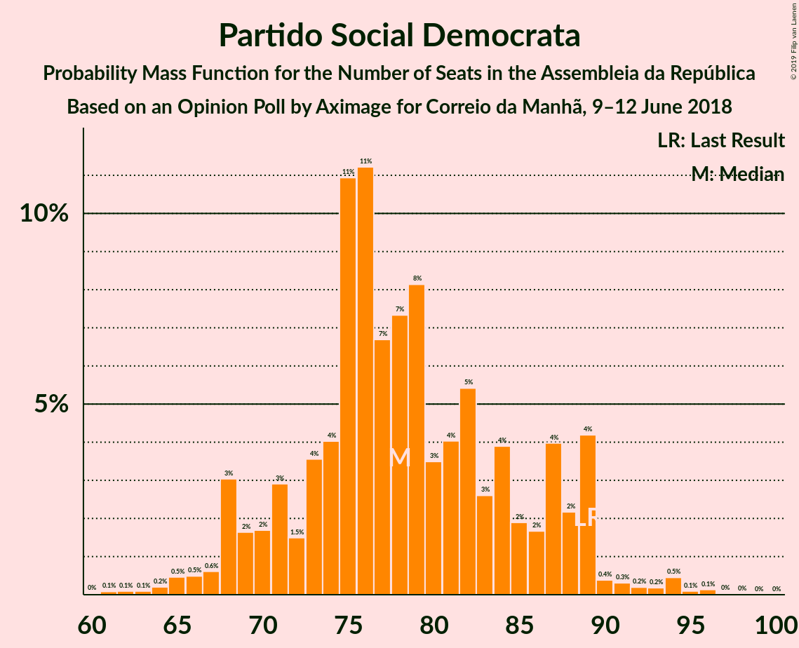
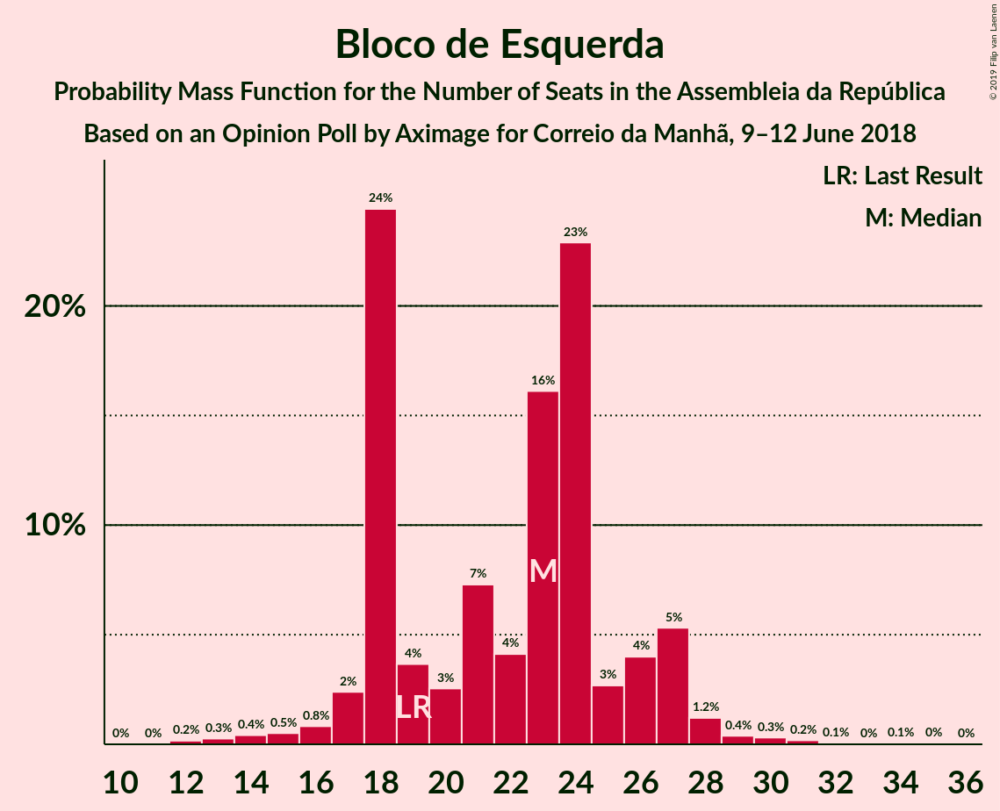
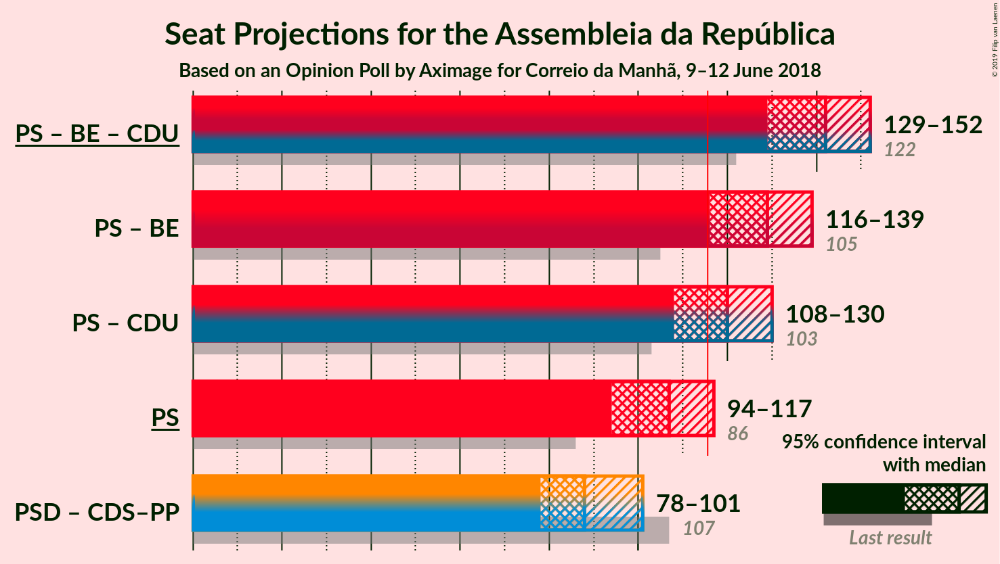

# Opinion Poll by Aximage for Correio da Manhã, 9–12 June 2018

<a href="#voting-intentions">Voting Intentions</a> | <a href="#seats">Seats</a> | <a href="#coalitions">Coalitions</a> | <a href="#technical-information">Technical Information</a>

## Voting Intentions

### Confidence Intervals

| Party | Last Result | Poll Result | 80% Confidence Interval | 90% Confidence Interval | 95% Confidence Interval | 99% Confidence Interval |
|:-----:|:-----------:|:-----------:|:-----------------------:|:-----------------------:|:-----------------------:|:-----------------------:|
| Partido Socialista | 32.3% | 37.0% | 34.6–39.6% |33.9–40.3% |33.3–41.0% |32.1–42.2% |
| Partido Social Democrata | 36.9% | 27.7% | 25.5–30.2% |24.9–30.9% |24.3–31.5% |23.3–32.6% |
| Bloco de Esquerda | 10.2% | 10.3% | 8.9–12.1% |8.5–12.6% |8.1–13.0% |7.5–13.9% |
| Coligação Democrática Unitária | 8.2% | 7.1% | 6.0–8.7% |5.6–9.1% |5.3–9.5% |4.8–10.3% |
| CDS–Partido Popular | 36.9% | 6.3% | 5.2–7.8% |4.9–8.2% |4.6–8.6% |4.1–9.3% |

*Note:* The poll result column reflects the actual value used in the calculations. Published results may vary slightly, and in addition be rounded to fewer digits.

## Seats

### Confidence Intervals

| Party | Last Result | Median | 80% Confidence Interval | 90% Confidence Interval | 95% Confidence Interval | 99% Confidence Interval |
|:-----:|:-----------:|:------:|:-----------------------:|:-----------------------:|:-----------------------:|:-----------------------:|
| <a href="#partido-socialista">Partido Socialista</a> | 86 | 107 | 97–114 |96–115 |94–117 |91–122 |
| <a href="#partido-social-democrata">Partido Social Democrata</a> | 89 | 78 | 71–87 |68–89 |68–89 |64–94 |
| <a href="#bloco-de-esquerda">Bloco de Esquerda</a> | 19 | 23 | 18–26 |18–27 |17–27 |14–30 |
| <a href="#coligação-democrática-unitária">Coligação Democrática Unitária</a> | 17 | 13 | 9–18 |9–19 |7–19 |6–21 |
| <a href="#cds–partido-popular">CDS–Partido Popular</a> | 18 | 10 | 6–13 |6–16 |6–18 |6–20 |

### Partido Socialista

*For a full overview of the results for this party, see the [Partido Socialista](party-partidosocialista.html) page.*

| Number of Seats | Probability | Accumulated | Special Marks |
|:---------------:|:-----------:|:-----------:|:-------------:|
| 85 | 0.1% | 100% |  |
| 86 | 0% | 99.9% | Last Result |
| 87 | 0.1% | 99.9% |  |
| 88 | 0.1% | 99.8% |  |
| 89 | 0.1% | 99.7% |  |
| 90 | 0.1% | 99.7% |  |
| 91 | 0.3% | 99.5% |  |
| 92 | 0.3% | 99.3% |  |
| 93 | 0.7% | 99.0% |  |
| 94 | 1.3% | 98% |  |
| 95 | 2% | 97% |  |
| 96 | 2% | 95% |  |
| 97 | 4% | 94% |  |
| 98 | 3% | 90% |  |
| 99 | 3% | 87% |  |
| 100 | 3% | 84% |  |
| 101 | 2% | 81% |  |
| 102 | 7% | 79% |  |
| 103 | 5% | 72% |  |
| 104 | 3% | 67% |  |
| 105 | 2% | 65% |  |
| 106 | 7% | 63% |  |
| 107 | 11% | 56% | Median |
| 108 | 19% | 45% |  |
| 109 | 5% | 27% |  |
| 110 | 3% | 22% |  |
| 111 | 1.3% | 19% |  |
| 112 | 2% | 17% |  |
| 113 | 3% | 16% |  |
| 114 | 6% | 13% |  |
| 115 | 3% | 7% |  |
| 116 | 0.8% | 3% | Majority |
| 117 | 1.1% | 3% |  |
| 118 | 0.3% | 1.4% |  |
| 119 | 0.2% | 1.1% |  |
| 120 | 0.1% | 0.9% |  |
| 121 | 0.2% | 0.8% |  |
| 122 | 0.4% | 0.7% |  |
| 123 | 0.2% | 0.3% |  |
| 124 | 0% | 0.1% |  |
| 125 | 0% | 0% |  |

### Partido Social Democrata

*For a full overview of the results for this party, see the [Partido Social Democrata](party-partidosocialdemocrata.html) page.*

| Number of Seats | Probability | Accumulated | Special Marks |
|:---------------:|:-----------:|:-----------:|:-------------:|
| 60 | 0% | 100% |  |
| 61 | 0.1% | 99.9% |  |
| 62 | 0.1% | 99.8% |  |
| 63 | 0.1% | 99.7% |  |
| 64 | 0.2% | 99.6% |  |
| 65 | 0.5% | 99.4% |  |
| 66 | 0.5% | 99.0% |  |
| 67 | 0.6% | 98% |  |
| 68 | 3% | 98% |  |
| 69 | 2% | 95% |  |
| 70 | 2% | 93% |  |
| 71 | 3% | 92% |  |
| 72 | 1.5% | 89% |  |
| 73 | 4% | 87% |  |
| 74 | 4% | 84% |  |
| 75 | 11% | 80% |  |
| 76 | 11% | 69% |  |
| 77 | 7% | 57% |  |
| 78 | 7% | 51% | Median |
| 79 | 8% | 43% |  |
| 80 | 3% | 35% |  |
| 81 | 4% | 32% |  |
| 82 | 5% | 28% |  |
| 83 | 3% | 22% |  |
| 84 | 4% | 20% |  |
| 85 | 2% | 16% |  |
| 86 | 2% | 14% |  |
| 87 | 4% | 12% |  |
| 88 | 2% | 8% |  |
| 89 | 4% | 6% | Last Result |
| 90 | 0.4% | 2% |  |
| 91 | 0.3% | 1.4% |  |
| 92 | 0.2% | 1.1% |  |
| 93 | 0.2% | 0.9% |  |
| 94 | 0.5% | 0.8% |  |
| 95 | 0.1% | 0.3% |  |
| 96 | 0.1% | 0.2% |  |
| 97 | 0% | 0.1% |  |
| 98 | 0% | 0% |  |

### Bloco de Esquerda

*For a full overview of the results for this party, see the [Bloco de Esquerda](party-blocodeesquerda.html) page.*

| Number of Seats | Probability | Accumulated | Special Marks |
|:---------------:|:-----------:|:-----------:|:-------------:|
| 12 | 0.2% | 100% |  |
| 13 | 0.3% | 99.8% |  |
| 14 | 0.4% | 99.5% |  |
| 15 | 0.5% | 99.1% |  |
| 16 | 0.8% | 98.6% |  |
| 17 | 2% | 98% |  |
| 18 | 24% | 95% |  |
| 19 | 4% | 71% | Last Result |
| 20 | 3% | 67% |  |
| 21 | 7% | 65% |  |
| 22 | 4% | 57% |  |
| 23 | 16% | 53% | Median |
| 24 | 23% | 37% |  |
| 25 | 3% | 14% |  |
| 26 | 4% | 12% |  |
| 27 | 5% | 8% |  |
| 28 | 1.2% | 2% |  |
| 29 | 0.4% | 1.1% |  |
| 30 | 0.3% | 0.7% |  |
| 31 | 0.2% | 0.4% |  |
| 32 | 0.1% | 0.2% |  |
| 33 | 0% | 0.2% |  |
| 34 | 0.1% | 0.1% |  |
| 35 | 0% | 0.1% |  |
| 36 | 0% | 0% |  |

### Coligação Democrática Unitária

*For a full overview of the results for this party, see the [Coligação Democrática Unitária](party-coligaçãodemocráticaunitária.html) page.*

| Number of Seats | Probability | Accumulated | Special Marks |
|:---------------:|:-----------:|:-----------:|:-------------:|
| 5 | 0.1% | 100% |  |
| 6 | 1.2% | 99.9% |  |
| 7 | 2% | 98.7% |  |
| 8 | 2% | 97% |  |
| 9 | 7% | 95% |  |
| 10 | 3% | 88% |  |
| 11 | 4% | 85% |  |
| 12 | 10% | 81% |  |
| 13 | 29% | 72% | Median |
| 14 | 12% | 43% |  |
| 15 | 4% | 30% |  |
| 16 | 3% | 27% |  |
| 17 | 12% | 23% | Last Result |
| 18 | 6% | 11% |  |
| 19 | 4% | 5% |  |
| 20 | 0.9% | 2% |  |
| 21 | 0.3% | 0.7% |  |
| 22 | 0.1% | 0.4% |  |
| 23 | 0.2% | 0.3% |  |
| 24 | 0% | 0% |  |

### CDS–Partido Popular

*For a full overview of the results for this party, see the [CDS–Partido Popular](party-cds–partidopopular.html) page.*

| Number of Seats | Probability | Accumulated | Special Marks |
|:---------------:|:-----------:|:-----------:|:-------------:|
| 3 | 0% | 100% |  |
| 4 | 0.1% | 99.9% |  |
| 5 | 0.2% | 99.9% |  |
| 6 | 12% | 99.7% |  |
| 7 | 5% | 88% |  |
| 8 | 5% | 83% |  |
| 9 | 9% | 78% |  |
| 10 | 35% | 69% | Median |
| 11 | 6% | 34% |  |
| 12 | 12% | 28% |  |
| 13 | 7% | 16% |  |
| 14 | 3% | 10% |  |
| 15 | 1.3% | 7% |  |
| 16 | 1.4% | 5% |  |
| 17 | 0.7% | 4% |  |
| 18 | 1.4% | 3% | Last Result |
| 19 | 1.1% | 2% |  |
| 20 | 0.6% | 0.8% |  |
| 21 | 0.1% | 0.2% |  |
| 22 | 0% | 0% |  |

## Coalitions

### Confidence Intervals

| Coalition | Last Result | Median | Majority? | 80% Confidence Interval | 90% Confidence Interval | 95% Confidence Interval | 99% Confidence Interval |
|:---------:|:-----------:|:------:|:---------:|:-----------------------:|:-----------------------:|:-----------------------:|:-----------------------:|
| Partido Socialista – Bloco de Esquerda – Coligação Democrática Unitária | 122 | 142 | 100% | 133–149 | 131–151 | 129–152 | 125–156 |
| Partido Socialista – Bloco de Esquerda | 105 | 129 | 98% | 119–135 | 117–138 | 116–139 | 112–143 |
| Partido Socialista – Coligação Democrática Unitária | 103 | 120 | 79% | 111–127 | 109–128 | 108–130 | 102–135 |
| Partido Socialista | 86 | 107 | 3% | 97–114 | 96–115 | 94–117 | 91–122 |
| Partido Social Democrata – CDS–Partido Popular | 107 | 88 | 0% | 81–97 | 79–99 | 78–101 | 74–105 |

### Partido Socialista – Bloco de Esquerda – Coligação Democrática Unitária

| Number of Seats | Probability | Accumulated | Special Marks |
|:---------------:|:-----------:|:-----------:|:-------------:|
| 120 | 0% | 100% |  |
| 121 | 0.1% | 99.9% |  |
| 122 | 0% | 99.9% | Last Result |
| 123 | 0.1% | 99.8% |  |
| 124 | 0.1% | 99.7% |  |
| 125 | 0.1% | 99.6% |  |
| 126 | 0.3% | 99.5% |  |
| 127 | 0.2% | 99.1% |  |
| 128 | 0.6% | 98.9% |  |
| 129 | 2% | 98% |  |
| 130 | 0.9% | 97% |  |
| 131 | 3% | 96% |  |
| 132 | 2% | 93% |  |
| 133 | 2% | 91% |  |
| 134 | 2% | 89% |  |
| 135 | 4% | 87% |  |
| 136 | 3% | 83% |  |
| 137 | 3% | 79% |  |
| 138 | 6% | 76% |  |
| 139 | 7% | 70% |  |
| 140 | 3% | 63% |  |
| 141 | 3% | 60% |  |
| 142 | 9% | 57% |  |
| 143 | 6% | 48% | Median |
| 144 | 11% | 41% |  |
| 145 | 9% | 30% |  |
| 146 | 4% | 21% |  |
| 147 | 3% | 18% |  |
| 148 | 4% | 15% |  |
| 149 | 3% | 11% |  |
| 150 | 2% | 7% |  |
| 151 | 3% | 6% |  |
| 152 | 0.5% | 3% |  |
| 153 | 0.8% | 2% |  |
| 154 | 0.5% | 2% |  |
| 155 | 0.6% | 1.1% |  |
| 156 | 0.1% | 0.5% |  |
| 157 | 0.2% | 0.4% |  |
| 158 | 0.1% | 0.2% |  |
| 159 | 0.1% | 0.1% |  |
| 160 | 0% | 0.1% |  |
| 161 | 0% | 0.1% |  |
| 162 | 0% | 0% |  |

### Partido Socialista – Bloco de Esquerda

| Number of Seats | Probability | Accumulated | Special Marks |
|:---------------:|:-----------:|:-----------:|:-------------:|
| 105 | 0% | 100% | Last Result |
| 106 | 0% | 100% |  |
| 107 | 0% | 100% |  |
| 108 | 0% | 99.9% |  |
| 109 | 0.1% | 99.9% |  |
| 110 | 0.1% | 99.8% |  |
| 111 | 0.2% | 99.7% |  |
| 112 | 0.3% | 99.5% |  |
| 113 | 0.5% | 99.2% |  |
| 114 | 0.2% | 98.7% |  |
| 115 | 0.6% | 98% |  |
| 116 | 2% | 98% | Majority |
| 117 | 1.3% | 96% |  |
| 118 | 3% | 95% |  |
| 119 | 2% | 91% |  |
| 120 | 2% | 90% |  |
| 121 | 4% | 88% |  |
| 122 | 3% | 84% |  |
| 123 | 3% | 80% |  |
| 124 | 7% | 77% |  |
| 125 | 7% | 71% |  |
| 126 | 6% | 64% |  |
| 127 | 4% | 59% |  |
| 128 | 3% | 55% |  |
| 129 | 8% | 52% |  |
| 130 | 4% | 44% | Median |
| 131 | 12% | 39% |  |
| 132 | 9% | 28% |  |
| 133 | 5% | 19% |  |
| 134 | 2% | 14% |  |
| 135 | 3% | 13% |  |
| 136 | 3% | 9% |  |
| 137 | 1.2% | 7% |  |
| 138 | 3% | 6% |  |
| 139 | 0.8% | 3% |  |
| 140 | 0.7% | 2% |  |
| 141 | 0.5% | 1.4% |  |
| 142 | 0.4% | 0.9% |  |
| 143 | 0.1% | 0.6% |  |
| 144 | 0.2% | 0.4% |  |
| 145 | 0.1% | 0.3% |  |
| 146 | 0.1% | 0.2% |  |
| 147 | 0% | 0.1% |  |
| 148 | 0% | 0% |  |

### Partido Socialista – Coligação Democrática Unitária

| Number of Seats | Probability | Accumulated | Special Marks |
|:---------------:|:-----------:|:-----------:|:-------------:|
| 99 | 0.1% | 100% |  |
| 100 | 0.1% | 99.9% |  |
| 101 | 0.2% | 99.8% |  |
| 102 | 0.3% | 99.6% |  |
| 103 | 0.2% | 99.4% | Last Result |
| 104 | 0.1% | 99.2% |  |
| 105 | 0.2% | 99.1% |  |
| 106 | 0.3% | 98.9% |  |
| 107 | 0.9% | 98.7% |  |
| 108 | 1.1% | 98% |  |
| 109 | 3% | 97% |  |
| 110 | 2% | 94% |  |
| 111 | 6% | 91% |  |
| 112 | 3% | 86% |  |
| 113 | 3% | 83% |  |
| 114 | 0.9% | 80% |  |
| 115 | 0.4% | 79% |  |
| 116 | 2% | 79% | Majority |
| 117 | 4% | 77% |  |
| 118 | 4% | 73% |  |
| 119 | 11% | 69% |  |
| 120 | 13% | 58% | Median |
| 121 | 17% | 45% |  |
| 122 | 2% | 29% |  |
| 123 | 3% | 26% |  |
| 124 | 3% | 23% |  |
| 125 | 2% | 20% |  |
| 126 | 3% | 18% |  |
| 127 | 6% | 15% |  |
| 128 | 5% | 10% |  |
| 129 | 2% | 4% |  |
| 130 | 0.5% | 3% |  |
| 131 | 0.4% | 2% |  |
| 132 | 0.3% | 2% |  |
| 133 | 0.3% | 2% |  |
| 134 | 0.7% | 1.4% |  |
| 135 | 0.3% | 0.6% |  |
| 136 | 0.2% | 0.4% |  |
| 137 | 0.1% | 0.1% |  |
| 138 | 0% | 0% |  |

### Partido Socialista

| Number of Seats | Probability | Accumulated | Special Marks |
|:---------------:|:-----------:|:-----------:|:-------------:|
| 85 | 0.1% | 100% |  |
| 86 | 0% | 99.9% | Last Result |
| 87 | 0.1% | 99.9% |  |
| 88 | 0.1% | 99.8% |  |
| 89 | 0.1% | 99.7% |  |
| 90 | 0.1% | 99.7% |  |
| 91 | 0.3% | 99.5% |  |
| 92 | 0.3% | 99.3% |  |
| 93 | 0.7% | 99.0% |  |
| 94 | 1.3% | 98% |  |
| 95 | 2% | 97% |  |
| 96 | 2% | 95% |  |
| 97 | 4% | 94% |  |
| 98 | 3% | 90% |  |
| 99 | 3% | 87% |  |
| 100 | 3% | 84% |  |
| 101 | 2% | 81% |  |
| 102 | 7% | 79% |  |
| 103 | 5% | 72% |  |
| 104 | 3% | 67% |  |
| 105 | 2% | 65% |  |
| 106 | 7% | 63% |  |
| 107 | 11% | 56% | Median |
| 108 | 19% | 45% |  |
| 109 | 5% | 27% |  |
| 110 | 3% | 22% |  |
| 111 | 1.3% | 19% |  |
| 112 | 2% | 17% |  |
| 113 | 3% | 16% |  |
| 114 | 6% | 13% |  |
| 115 | 3% | 7% |  |
| 116 | 0.8% | 3% | Majority |
| 117 | 1.1% | 3% |  |
| 118 | 0.3% | 1.4% |  |
| 119 | 0.2% | 1.1% |  |
| 120 | 0.1% | 0.9% |  |
| 121 | 0.2% | 0.8% |  |
| 122 | 0.4% | 0.7% |  |
| 123 | 0.2% | 0.3% |  |
| 124 | 0% | 0.1% |  |
| 125 | 0% | 0% |  |

### Partido Social Democrata – CDS–Partido Popular

| Number of Seats | Probability | Accumulated | Special Marks |
|:---------------:|:-----------:|:-----------:|:-------------:|
| 69 | 0% | 100% |  |
| 70 | 0% | 99.9% |  |
| 71 | 0.1% | 99.9% |  |
| 72 | 0.1% | 99.9% |  |
| 73 | 0.2% | 99.8% |  |
| 74 | 0.1% | 99.6% |  |
| 75 | 0.6% | 99.5% |  |
| 76 | 0.5% | 98.9% |  |
| 77 | 0.8% | 98% |  |
| 78 | 0.5% | 98% |  |
| 79 | 3% | 97% |  |
| 80 | 2% | 94% |  |
| 81 | 3% | 93% |  |
| 82 | 4% | 89% |  |
| 83 | 3% | 85% |  |
| 84 | 4% | 82% |  |
| 85 | 9% | 79% |  |
| 86 | 11% | 70% |  |
| 87 | 6% | 59% |  |
| 88 | 9% | 52% | Median |
| 89 | 3% | 43% |  |
| 90 | 3% | 40% |  |
| 91 | 7% | 37% |  |
| 92 | 6% | 30% |  |
| 93 | 3% | 24% |  |
| 94 | 3% | 21% |  |
| 95 | 4% | 17% |  |
| 96 | 2% | 13% |  |
| 97 | 2% | 11% |  |
| 98 | 2% | 9% |  |
| 99 | 3% | 7% |  |
| 100 | 0.9% | 4% |  |
| 101 | 2% | 3% |  |
| 102 | 0.6% | 2% |  |
| 103 | 0.2% | 1.1% |  |
| 104 | 0.3% | 0.9% |  |
| 105 | 0.1% | 0.5% |  |
| 106 | 0.1% | 0.4% |  |
| 107 | 0.1% | 0.3% | Last Result |
| 108 | 0% | 0.2% |  |
| 109 | 0.1% | 0.1% |  |
| 110 | 0% | 0.1% |  |
| 111 | 0% | 0% |  |

## Technical Information

### Opinion Poll

+ **Polling firm:** Aximage
+ **Commissioner(s):** Correio da Manhã
+ **Fieldwork period:** 9–12 June 2018

### Calculations

+ **Sample size:** 602
+ **Simulations done:** 131,072
+ **Error estimate:** 1.22%

