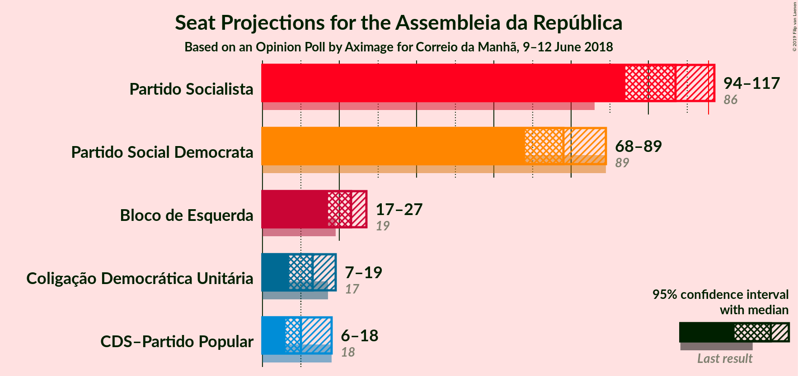
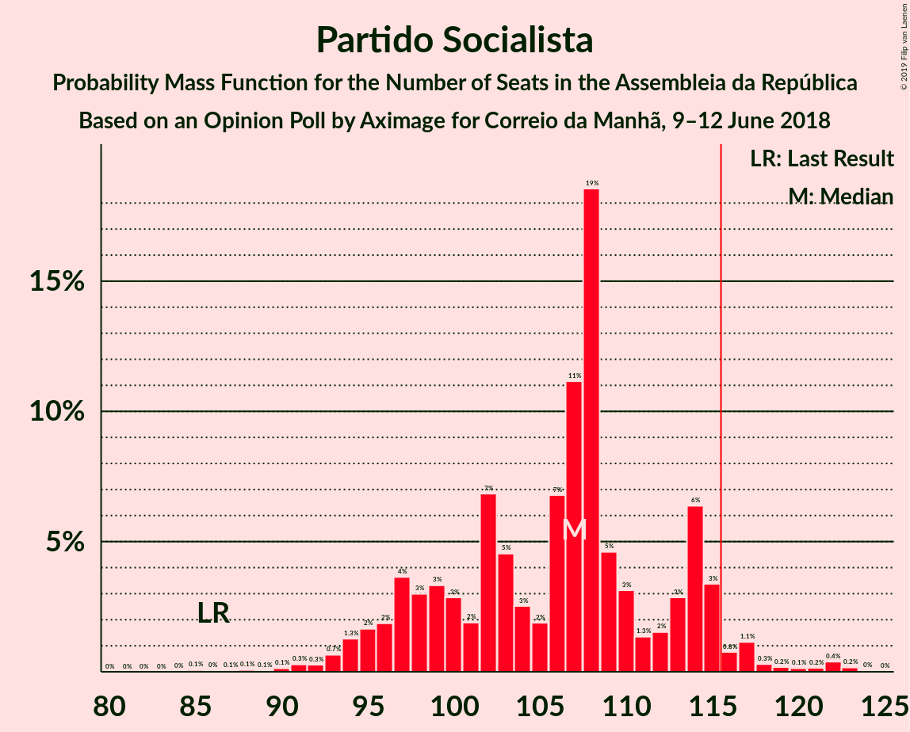
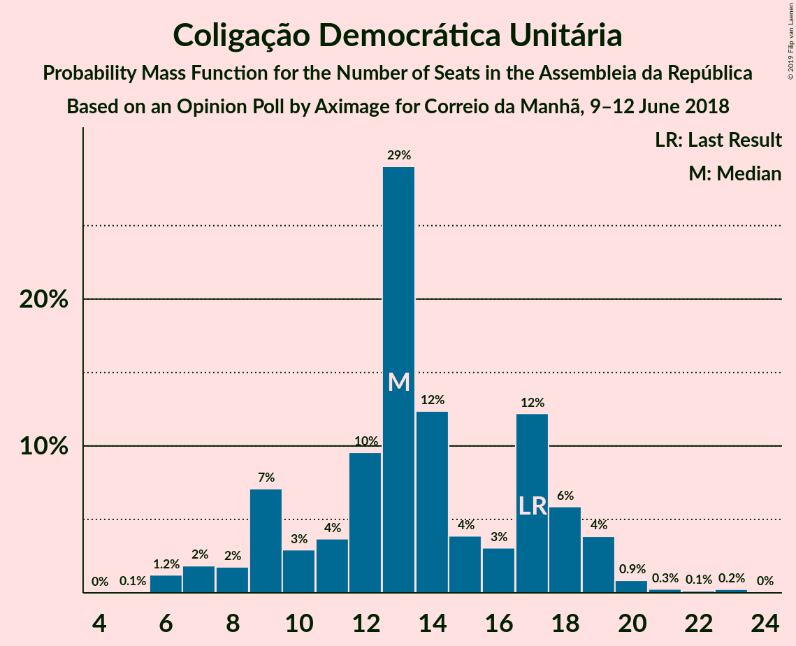

# Opinion Poll by Aximage for Correio da Manhã, 9–12 June 2018

<a href="#voting-intentions">Voting Intentions</a> | <a href="#seats">Seats</a> | <a href="#coalitions">Coalitions</a> | <a href="#technical-information">Technical Information</a>

## Voting Intentions

### Confidence Intervals

| Party | Last Result | Poll Result | 80% Confidence Interval | 90% Confidence Interval | 95% Confidence Interval | 99% Confidence Interval |
|:-----:|:-----------:|:-----------:|:-----------------------:|:-----------------------:|:-----------------------:|:-----------------------:|
| Partido Socialista | 32.3% | 37.0% | 34.6–39.6% |33.9–40.3% |33.3–41.0% |32.1–42.2% |
| Partido Social Democrata | 36.9% | 27.7% | 25.5–30.2% |24.9–30.9% |24.3–31.5% |23.3–32.6% |
| Bloco de Esquerda | 10.2% | 10.3% | 8.9–12.1% |8.5–12.6% |8.1–13.0% |7.5–13.9% |
| Coligação Democrática Unitária | 8.2% | 7.1% | 6.0–8.7% |5.6–9.1% |5.3–9.5% |4.8–10.3% |
| CDS–Partido Popular | 36.9% | 6.3% | 5.2–7.8% |4.9–8.2% |4.6–8.6% |4.1–9.3% |

*Note:* The poll result column reflects the actual value used in the calculations. Published results may vary slightly, and in addition be rounded to fewer digits.

## Seats

### Confidence Intervals

| Party | Last Result | Median | 80% Confidence Interval | 90% Confidence Interval | 95% Confidence Interval | 99% Confidence Interval |
|:-----:|:-----------:|:------:|:-----------------------:|:-----------------------:|:-----------------------:|:-----------------------:|
| <a href="#partido-socialista">Partido Socialista</a> | 86 | 96 | 96–98 |96–108 |96–108 |96–112 |
| <a href="#partido-social-democrata">Partido Social Democrata</a> | 89 | 86 | 81–87 |78–87 |78–87 |63–87 |
| <a href="#bloco-de-esquerda">Bloco de Esquerda</a> | 19 | 23 | 21–25 |20–28 |20–29 |19–29 |
| <a href="#coligação-democrática-unitária">Coligação Democrática Unitária</a> | 17 | 11 | 11–12 |8–12 |8–20 |7–20 |
| <a href="#cds–partido-popular">CDS–Partido Popular</a> | 18 | 14 | 8–14 |7–15 |6–15 |6–21 |

### Partido Socialista

*For a full overview of the results for this party, see the [Partido Socialista](party-partidosocialista.html) page.*

| Number of Seats | Probability | Accumulated | Special Marks |
|:---------------:|:-----------:|:-----------:|:-------------:|
| 86 | 0% | 100% | Last Result |
| 87 | 0% | 100% |  |
| 88 | 0% | 100% |  |
| 89 | 0% | 99.9% |  |
| 90 | 0% | 99.9% |  |
| 91 | 0.1% | 99.9% |  |
| 92 | 0.2% | 99.8% |  |
| 93 | 0% | 99.6% |  |
| 94 | 0% | 99.6% |  |
| 95 | 0% | 99.6% |  |
| 96 | 69% | 99.6% | Median |
| 97 | 18% | 31% |  |
| 98 | 3% | 13% |  |
| 99 | 0% | 10% |  |
| 100 | 0% | 10% |  |
| 101 | 0% | 10% |  |
| 102 | 0.6% | 10% |  |
| 103 | 0% | 9% |  |
| 104 | 0% | 9% |  |
| 105 | 0.1% | 9% |  |
| 106 | 0.1% | 9% |  |
| 107 | 0% | 9% |  |
| 108 | 8% | 9% |  |
| 109 | 0% | 0.7% |  |
| 110 | 0% | 0.7% |  |
| 111 | 0% | 0.7% |  |
| 112 | 0.2% | 0.7% |  |
| 113 | 0% | 0.5% |  |
| 114 | 0% | 0.5% |  |
| 115 | 0% | 0.5% |  |
| 116 | 0.1% | 0.5% | Majority |
| 117 | 0.1% | 0.4% |  |
| 118 | 0.1% | 0.4% |  |
| 119 | 0.3% | 0.3% |  |
| 120 | 0% | 0% |  |

### Partido Social Democrata

*For a full overview of the results for this party, see the [Partido Social Democrata](party-partidosocialdemocrata.html) page.*

| Number of Seats | Probability | Accumulated | Special Marks |
|:---------------:|:-----------:|:-----------:|:-------------:|
| 62 | 0.4% | 100% |  |
| 63 | 0.2% | 99.6% |  |
| 64 | 0.1% | 99.4% |  |
| 65 | 0% | 99.3% |  |
| 66 | 0% | 99.3% |  |
| 67 | 0% | 99.3% |  |
| 68 | 0.5% | 99.3% |  |
| 69 | 0.1% | 98.8% |  |
| 70 | 0% | 98.7% |  |
| 71 | 0% | 98.7% |  |
| 72 | 0% | 98.7% |  |
| 73 | 0% | 98.7% |  |
| 74 | 0% | 98.7% |  |
| 75 | 0% | 98.7% |  |
| 76 | 0% | 98.7% |  |
| 77 | 0% | 98.7% |  |
| 78 | 8% | 98.7% |  |
| 79 | 0.7% | 91% |  |
| 80 | 0% | 90% |  |
| 81 | 1.5% | 90% |  |
| 82 | 1.4% | 89% |  |
| 83 | 0.2% | 87% |  |
| 84 | 0% | 87% |  |
| 85 | 0.3% | 87% |  |
| 86 | 54% | 87% | Median |
| 87 | 32% | 32% |  |
| 88 | 0% | 0.2% |  |
| 89 | 0% | 0.2% | Last Result |
| 90 | 0% | 0.2% |  |
| 91 | 0.1% | 0.2% |  |
| 92 | 0% | 0.1% |  |
| 93 | 0% | 0.1% |  |
| 94 | 0% | 0.1% |  |
| 95 | 0% | 0.1% |  |
| 96 | 0% | 0.1% |  |
| 97 | 0% | 0.1% |  |
| 98 | 0% | 0.1% |  |
| 99 | 0% | 0.1% |  |
| 100 | 0% | 0.1% |  |
| 101 | 0% | 0.1% |  |
| 102 | 0% | 0.1% |  |
| 103 | 0% | 0.1% |  |
| 104 | 0% | 0.1% |  |
| 105 | 0% | 0.1% |  |
| 106 | 0.1% | 0.1% |  |
| 107 | 0% | 0% |  |

### Bloco de Esquerda

*For a full overview of the results for this party, see the [Bloco de Esquerda](party-blocodeesquerda.html) page.*

| Number of Seats | Probability | Accumulated | Special Marks |
|:---------------:|:-----------:|:-----------:|:-------------:|
| 18 | 0.2% | 100% |  |
| 19 | 0.7% | 99.8% | Last Result |
| 20 | 6% | 99.1% |  |
| 21 | 25% | 93% |  |
| 22 | 0% | 68% |  |
| 23 | 20% | 68% | Median |
| 24 | 37% | 47% |  |
| 25 | 1.5% | 11% |  |
| 26 | 0% | 9% |  |
| 27 | 0.1% | 9% |  |
| 28 | 5% | 9% |  |
| 29 | 4% | 4% |  |
| 30 | 0.1% | 0.1% |  |
| 31 | 0% | 0% |  |

### Coligação Democrática Unitária

*For a full overview of the results for this party, see the [Coligação Democrática Unitária](party-coligaçãodemocráticaunitária.html) page.*

| Number of Seats | Probability | Accumulated | Special Marks |
|:---------------:|:-----------:|:-----------:|:-------------:|
| 7 | 0.6% | 100% |  |
| 8 | 8% | 99.4% |  |
| 9 | 0.2% | 92% |  |
| 10 | 0.1% | 91% |  |
| 11 | 55% | 91% | Median |
| 12 | 32% | 37% |  |
| 13 | 0.4% | 4% |  |
| 14 | 0.1% | 4% |  |
| 15 | 0% | 4% |  |
| 16 | 0.6% | 4% |  |
| 17 | 0% | 3% | Last Result |
| 18 | 0% | 3% |  |
| 19 | 0% | 3% |  |
| 20 | 3% | 3% |  |
| 21 | 0% | 0.3% |  |
| 22 | 0.2% | 0.3% |  |
| 23 | 0.1% | 0.1% |  |
| 24 | 0% | 0% |  |

### CDS–Partido Popular

*For a full overview of the results for this party, see the [CDS–Partido Popular](party-cds–partidopopular.html) page.*

| Number of Seats | Probability | Accumulated | Special Marks |
|:---------------:|:-----------:|:-----------:|:-------------:|
| 2 | 0.1% | 100% |  |
| 3 | 0% | 99.9% |  |
| 4 | 0% | 99.9% |  |
| 5 | 0% | 99.9% |  |
| 6 | 3% | 99.9% |  |
| 7 | 4% | 97% |  |
| 8 | 5% | 93% |  |
| 9 | 0% | 88% |  |
| 10 | 0.1% | 88% |  |
| 11 | 0.2% | 88% |  |
| 12 | 18% | 88% |  |
| 13 | 18% | 70% |  |
| 14 | 45% | 52% | Median |
| 15 | 7% | 8% |  |
| 16 | 0% | 0.8% |  |
| 17 | 0% | 0.8% |  |
| 18 | 0% | 0.8% | Last Result |
| 19 | 0% | 0.8% |  |
| 20 | 0.1% | 0.8% |  |
| 21 | 0.7% | 0.7% |  |
| 22 | 0% | 0% |  |

## Coalitions

### Confidence Intervals

| Coalition | Last Result | Median | Majority? | 80% Confidence Interval | 90% Confidence Interval | 95% Confidence Interval | 99% Confidence Interval |
|:---------:|:-----------:|:------:|:---------:|:-----------------------:|:-----------------------:|:-----------------------:|:-----------------------:|
| Partido Socialista – Bloco de Esquerda – Coligação Democrática Unitária | 122 | 130 | 100% | 129–143 | 128–144 | 128–145 | 128–158 |
| Partido Socialista – Bloco de Esquerda | 105 | 119 | 99.6% | 117–123 | 116–136 | 116–137 | 116–144 |
| Partido Socialista – Coligação Democrática Unitária | 103 | 108 | 12% | 107–116 | 107–116 | 107–118 | 107–129 |
| Partido Socialista | 86 | 96 | 0.5% | 96–98 | 96–108 | 96–108 | 96–112 |
| Partido Social Democrata – CDS–Partido Popular | 107 | 100 | 0% | 87–101 | 86–102 | 85–102 | 72–102 |

### Partido Socialista – Bloco de Esquerda – Coligação Democrática Unitária

| Number of Seats | Probability | Accumulated | Special Marks |
|:---------------:|:-----------:|:-----------:|:-------------:|
| 118 | 0.1% | 100% |  |
| 119 | 0% | 99.9% |  |
| 120 | 0% | 99.9% |  |
| 121 | 0% | 99.9% |  |
| 122 | 0% | 99.9% | Last Result |
| 123 | 0.1% | 99.9% |  |
| 124 | 0.1% | 99.8% |  |
| 125 | 0% | 99.7% |  |
| 126 | 0% | 99.7% |  |
| 127 | 0% | 99.7% |  |
| 128 | 7% | 99.7% |  |
| 129 | 25% | 93% |  |
| 130 | 19% | 67% | Median |
| 131 | 18% | 48% |  |
| 132 | 17% | 30% |  |
| 133 | 0.2% | 13% |  |
| 134 | 0% | 13% |  |
| 135 | 0% | 13% |  |
| 136 | 0% | 13% |  |
| 137 | 0% | 13% |  |
| 138 | 0% | 13% |  |
| 139 | 0% | 13% |  |
| 140 | 0% | 13% |  |
| 141 | 0.8% | 13% |  |
| 142 | 1.4% | 12% |  |
| 143 | 2% | 11% |  |
| 144 | 4% | 9% |  |
| 145 | 4% | 5% |  |
| 146 | 0% | 0.8% |  |
| 147 | 0% | 0.8% |  |
| 148 | 0% | 0.8% |  |
| 149 | 0.1% | 0.8% |  |
| 150 | 0% | 0.7% |  |
| 151 | 0% | 0.7% |  |
| 152 | 0% | 0.7% |  |
| 153 | 0% | 0.7% |  |
| 154 | 0% | 0.7% |  |
| 155 | 0.1% | 0.7% |  |
| 156 | 0.1% | 0.6% |  |
| 157 | 0% | 0.5% |  |
| 158 | 0% | 0.5% |  |
| 159 | 0.1% | 0.5% |  |
| 160 | 0.4% | 0.4% |  |
| 161 | 0% | 0% |  |

### Partido Socialista – Bloco de Esquerda

| Number of Seats | Probability | Accumulated | Special Marks |
|:---------------:|:-----------:|:-----------:|:-------------:|
| 105 | 0% | 100% | Last Result |
| 106 | 0.1% | 100% |  |
| 107 | 0% | 99.9% |  |
| 108 | 0% | 99.9% |  |
| 109 | 0% | 99.9% |  |
| 110 | 0.1% | 99.9% |  |
| 111 | 0% | 99.8% |  |
| 112 | 0% | 99.8% |  |
| 113 | 0% | 99.8% |  |
| 114 | 0.1% | 99.8% |  |
| 115 | 0.1% | 99.7% |  |
| 116 | 7% | 99.6% | Majority |
| 117 | 25% | 93% |  |
| 118 | 0% | 67% |  |
| 119 | 19% | 67% | Median |
| 120 | 18% | 48% |  |
| 121 | 18% | 30% |  |
| 122 | 2% | 13% |  |
| 123 | 2% | 11% |  |
| 124 | 0% | 10% |  |
| 125 | 0.6% | 10% |  |
| 126 | 0% | 9% |  |
| 127 | 0% | 9% |  |
| 128 | 0% | 9% |  |
| 129 | 0% | 9% |  |
| 130 | 0% | 9% |  |
| 131 | 0% | 9% |  |
| 132 | 0% | 9% |  |
| 133 | 0.1% | 9% |  |
| 134 | 0.1% | 9% |  |
| 135 | 0% | 9% |  |
| 136 | 4% | 9% |  |
| 137 | 4% | 4% |  |
| 138 | 0% | 0.7% |  |
| 139 | 0.1% | 0.7% |  |
| 140 | 0% | 0.5% |  |
| 141 | 0% | 0.5% |  |
| 142 | 0% | 0.5% |  |
| 143 | 0% | 0.5% |  |
| 144 | 0% | 0.5% |  |
| 145 | 0% | 0.5% |  |
| 146 | 0.2% | 0.5% |  |
| 147 | 0.3% | 0.3% |  |
| 148 | 0% | 0% |  |

### Partido Socialista – Coligação Democrática Unitária

| Number of Seats | Probability | Accumulated | Special Marks |
|:---------------:|:-----------:|:-----------:|:-------------:|
| 100 | 0.2% | 100% |  |
| 101 | 0.1% | 99.8% |  |
| 102 | 0% | 99.7% |  |
| 103 | 0% | 99.7% | Last Result |
| 104 | 0% | 99.7% |  |
| 105 | 0% | 99.7% |  |
| 106 | 0% | 99.7% |  |
| 107 | 37% | 99.7% | Median |
| 108 | 49% | 63% |  |
| 109 | 0.9% | 14% |  |
| 110 | 0% | 13% |  |
| 111 | 0.1% | 13% |  |
| 112 | 0% | 13% |  |
| 113 | 0% | 13% |  |
| 114 | 0% | 13% |  |
| 115 | 0.6% | 13% |  |
| 116 | 8% | 12% | Majority |
| 117 | 0% | 5% |  |
| 118 | 4% | 5% |  |
| 119 | 0% | 0.8% |  |
| 120 | 0% | 0.8% |  |
| 121 | 0% | 0.8% |  |
| 122 | 0.1% | 0.8% |  |
| 123 | 0% | 0.7% |  |
| 124 | 0% | 0.7% |  |
| 125 | 0% | 0.7% |  |
| 126 | 0% | 0.7% |  |
| 127 | 0.1% | 0.7% |  |
| 128 | 0.1% | 0.6% |  |
| 129 | 0.1% | 0.5% |  |
| 130 | 0.1% | 0.4% |  |
| 131 | 0% | 0.4% |  |
| 132 | 0.4% | 0.4% |  |
| 133 | 0% | 0% |  |

### Partido Socialista

| Number of Seats | Probability | Accumulated | Special Marks |
|:---------------:|:-----------:|:-----------:|:-------------:|
| 86 | 0% | 100% | Last Result |
| 87 | 0% | 100% |  |
| 88 | 0% | 100% |  |
| 89 | 0% | 99.9% |  |
| 90 | 0% | 99.9% |  |
| 91 | 0.1% | 99.9% |  |
| 92 | 0.2% | 99.8% |  |
| 93 | 0% | 99.6% |  |
| 94 | 0% | 99.6% |  |
| 95 | 0% | 99.6% |  |
| 96 | 69% | 99.6% | Median |
| 97 | 18% | 31% |  |
| 98 | 3% | 13% |  |
| 99 | 0% | 10% |  |
| 100 | 0% | 10% |  |
| 101 | 0% | 10% |  |
| 102 | 0.6% | 10% |  |
| 103 | 0% | 9% |  |
| 104 | 0% | 9% |  |
| 105 | 0.1% | 9% |  |
| 106 | 0.1% | 9% |  |
| 107 | 0% | 9% |  |
| 108 | 8% | 9% |  |
| 109 | 0% | 0.7% |  |
| 110 | 0% | 0.7% |  |
| 111 | 0% | 0.7% |  |
| 112 | 0.2% | 0.7% |  |
| 113 | 0% | 0.5% |  |
| 114 | 0% | 0.5% |  |
| 115 | 0% | 0.5% |  |
| 116 | 0.1% | 0.5% | Majority |
| 117 | 0.1% | 0.4% |  |
| 118 | 0.1% | 0.4% |  |
| 119 | 0.3% | 0.3% |  |
| 120 | 0% | 0% |  |

### Partido Social Democrata – CDS–Partido Popular

| Number of Seats | Probability | Accumulated | Special Marks |
|:---------------:|:-----------:|:-----------:|:-------------:|
| 70 | 0.4% | 100% |  |
| 71 | 0.1% | 99.6% |  |
| 72 | 0% | 99.5% |  |
| 73 | 0% | 99.5% |  |
| 74 | 0.1% | 99.5% |  |
| 75 | 0.1% | 99.4% |  |
| 76 | 0% | 99.3% |  |
| 77 | 0% | 99.3% |  |
| 78 | 0% | 99.3% |  |
| 79 | 0% | 99.3% |  |
| 80 | 0% | 99.3% |  |
| 81 | 0.1% | 99.3% |  |
| 82 | 0% | 99.2% |  |
| 83 | 0% | 99.2% |  |
| 84 | 0% | 99.2% |  |
| 85 | 4% | 99.2% |  |
| 86 | 4% | 95% |  |
| 87 | 2% | 91% |  |
| 88 | 1.4% | 89% |  |
| 89 | 0.8% | 88% |  |
| 90 | 0% | 87% |  |
| 91 | 0% | 87% |  |
| 92 | 0% | 87% |  |
| 93 | 0% | 87% |  |
| 94 | 0% | 87% |  |
| 95 | 0% | 87% |  |
| 96 | 0% | 87% |  |
| 97 | 0.2% | 87% |  |
| 98 | 17% | 87% |  |
| 99 | 18% | 70% |  |
| 100 | 19% | 52% | Median |
| 101 | 25% | 33% |  |
| 102 | 7% | 7% |  |
| 103 | 0% | 0.3% |  |
| 104 | 0% | 0.3% |  |
| 105 | 0% | 0.3% |  |
| 106 | 0.1% | 0.3% |  |
| 107 | 0.1% | 0.2% | Last Result |
| 108 | 0% | 0.1% |  |
| 109 | 0% | 0.1% |  |
| 110 | 0% | 0.1% |  |
| 111 | 0% | 0.1% |  |
| 112 | 0.1% | 0.1% |  |
| 113 | 0% | 0% |  |

## Technical Information

### Opinion Poll

+ **Polling firm:** Aximage
+ **Commissioner(s):** Correio da Manhã
+ **Fieldwork period:** 9–12 June 2018

### Calculations

+ **Sample size:** 602
+ **Simulations done:** 1,024
+ **Error estimate:** 2.93%

