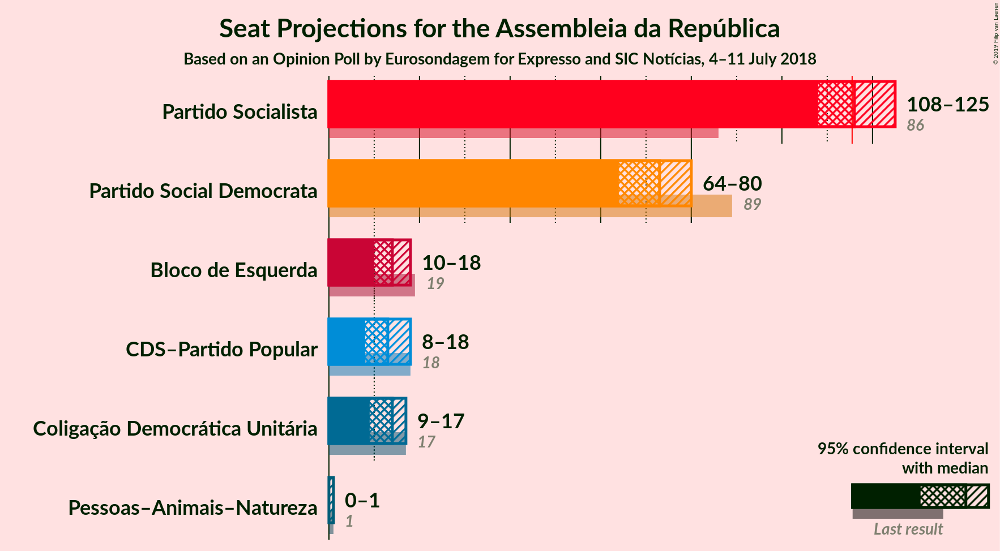
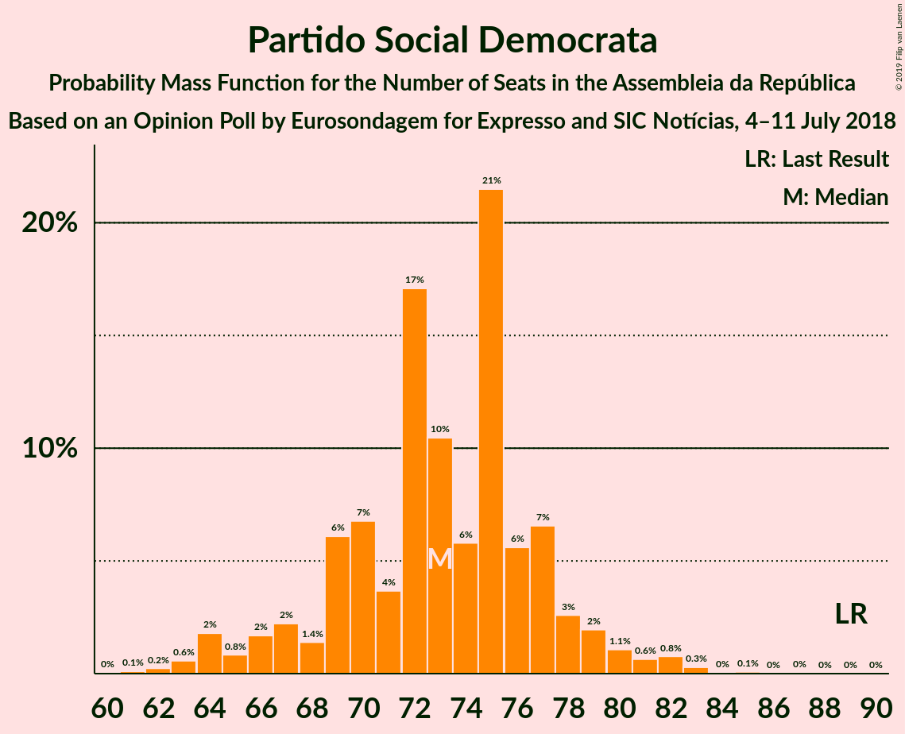
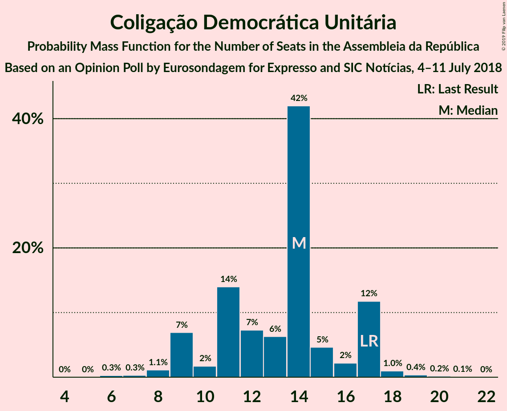
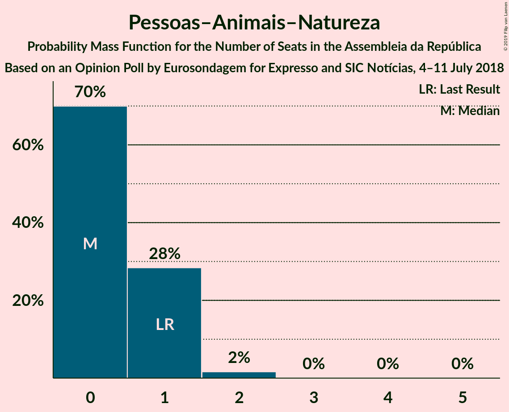

# Opinion Poll by Eurosondagem for Expresso and SIC, 4–11 July 2018

<a href="#voting-intentions">Voting Intentions</a> | <a href="#seats">Seats</a> | <a href="#coalitions">Coalitions</a> | <a href="#technical-information">Technical Information</a>

## Voting Intentions

### Confidence Intervals

| Party | Last Result | Poll Result | 80% Confidence Interval | 90% Confidence Interval | 95% Confidence Interval | 99% Confidence Interval |
|:-----:|:-----------:|:-----------:|:-----------------------:|:-----------------------:|:-----------------------:|:-----------------------:|
| Partido Socialista | 32.3% | 42.0% | 40.1–44.0% |39.5–44.6% |39.0–45.1% |38.1–46.1% |
| Partido Social Democrata | 36.9% | 27.3% | 25.5–29.2% |25.1–29.7% |24.6–30.1% |23.8–31.0% |
| Bloco de Esquerda | 10.2% | 7.9% | 6.9–9.1% |6.6–9.4% |6.4–9.8% |6.0–10.3% |
| CDS–Partido Popular | 36.9% | 7.5% | 6.6–8.7% |6.3–9.0% |6.1–9.3% |5.6–9.9% |
| Coligação Democrática Unitária | 8.2% | 7.3% | 6.4–8.5% |6.1–8.8% |5.9–9.1% |5.4–9.7% |
| Pessoas–Animais–Natureza | 1.4% | 1.1% | 0.8–1.6% |0.7–1.8% |0.6–2.0% |0.5–2.2% |

*Note:* The poll result column reflects the actual value used in the calculations. Published results may vary slightly, and in addition be rounded to fewer digits.

## Seats

### Confidence Intervals

| Party | Last Result | Median | 80% Confidence Interval | 90% Confidence Interval | 95% Confidence Interval | 99% Confidence Interval |
|:-----:|:-----------:|:------:|:-----------------------:|:-----------------------:|:-----------------------:|:-----------------------:|
| <a href="#partido-socialista">Partido Socialista</a> | 86 | 115 | 114–120 |114–120 |114–120 |114–120 |
| <a href="#partido-social-democrata">Partido Social Democrata</a> | 89 | 69 | 68–77 |68–77 |68–81 |68–81 |
| <a href="#bloco-de-esquerda">Bloco de Esquerda</a> | 19 | 13 | 13–18 |8–18 |8–18 |8–18 |
| <a href="#cds–partido-popular">CDS–Partido Popular</a> | 18 | 19 | 9–19 |9–19 |9–19 |9–19 |
| <a href="#coligação-democrática-unitária">Coligação Democrática Unitária</a> | 17 | 13 | 6–13 |6–14 |6–17 |6–17 |
| <a href="#pessoas–animais–natureza">Pessoas–Animais–Natureza</a> | 1 | 1 | 0–1 |0–1 |0–1 |0–1 |

### Partido Socialista

*For a full overview of the results for this party, see the [Partido Socialista](party-partidosocialista.html) page.*

| Number of Seats | Probability | Accumulated | Special Marks |
|:---------------:|:-----------:|:-----------:|:-------------:|
| 86 | 0% | 100% | Last Result |
| 87 | 0% | 100% |  |
| 88 | 0% | 100% |  |
| 89 | 0% | 100% |  |
| 90 | 0% | 100% |  |
| 91 | 0% | 100% |  |
| 92 | 0% | 100% |  |
| 93 | 0% | 100% |  |
| 94 | 0% | 100% |  |
| 95 | 0% | 100% |  |
| 96 | 0% | 100% |  |
| 97 | 0% | 100% |  |
| 98 | 0% | 100% |  |
| 99 | 0% | 100% |  |
| 100 | 0% | 100% |  |
| 101 | 0% | 100% |  |
| 102 | 0% | 100% |  |
| 103 | 0% | 100% |  |
| 104 | 0% | 100% |  |
| 105 | 0% | 100% |  |
| 106 | 0% | 100% |  |
| 107 | 0% | 100% |  |
| 108 | 0% | 100% |  |
| 109 | 0% | 100% |  |
| 110 | 0% | 100% |  |
| 111 | 0% | 100% |  |
| 112 | 0% | 100% |  |
| 113 | 0.1% | 100% |  |
| 114 | 10% | 99.9% |  |
| 115 | 61% | 90% | Median |
| 116 | 18% | 29% | Majority |
| 117 | 0.1% | 11% |  |
| 118 | 0% | 11% |  |
| 119 | 0% | 11% |  |
| 120 | 10% | 11% |  |
| 121 | 0% | 0.4% |  |
| 122 | 0.1% | 0.4% |  |
| 123 | 0% | 0.2% |  |
| 124 | 0% | 0.2% |  |
| 125 | 0% | 0.2% |  |
| 126 | 0% | 0.2% |  |
| 127 | 0% | 0.2% |  |
| 128 | 0% | 0.2% |  |
| 129 | 0.2% | 0.2% |  |
| 130 | 0% | 0% |  |

### Partido Social Democrata

*For a full overview of the results for this party, see the [Partido Social Democrata](party-partidosocialdemocrata.html) page.*

| Number of Seats | Probability | Accumulated | Special Marks |
|:---------------:|:-----------:|:-----------:|:-------------:|
| 62 | 0.2% | 100% |  |
| 63 | 0% | 99.8% |  |
| 64 | 0% | 99.8% |  |
| 65 | 0% | 99.8% |  |
| 66 | 0% | 99.8% |  |
| 67 | 0.1% | 99.7% |  |
| 68 | 15% | 99.6% |  |
| 69 | 67% | 84% | Median |
| 70 | 0% | 17% |  |
| 71 | 0% | 17% |  |
| 72 | 0% | 17% |  |
| 73 | 2% | 17% |  |
| 74 | 0.9% | 14% |  |
| 75 | 0% | 13% |  |
| 76 | 0% | 13% |  |
| 77 | 10% | 13% |  |
| 78 | 0% | 3% |  |
| 79 | 0% | 3% |  |
| 80 | 0.1% | 3% |  |
| 81 | 3% | 3% |  |
| 82 | 0% | 0% |  |
| 83 | 0% | 0% |  |
| 84 | 0% | 0% |  |
| 85 | 0% | 0% |  |
| 86 | 0% | 0% |  |
| 87 | 0% | 0% |  |
| 88 | 0% | 0% |  |
| 89 | 0% | 0% | Last Result |

### Bloco de Esquerda

*For a full overview of the results for this party, see the [Bloco de Esquerda](party-blocodeesquerda.html) page.*

| Number of Seats | Probability | Accumulated | Special Marks |
|:---------------:|:-----------:|:-----------:|:-------------:|
| 7 | 0.2% | 100% |  |
| 8 | 6% | 99.8% |  |
| 9 | 0% | 94% |  |
| 10 | 0% | 94% |  |
| 11 | 0% | 94% |  |
| 12 | 0% | 94% |  |
| 13 | 75% | 94% | Median |
| 14 | 7% | 18% |  |
| 15 | 0.1% | 11% |  |
| 16 | 0% | 11% |  |
| 17 | 0.1% | 11% |  |
| 18 | 11% | 11% |  |
| 19 | 0% | 0% | Last Result |

### CDS–Partido Popular

*For a full overview of the results for this party, see the [CDS–Partido Popular](party-cds–partidopopular.html) page.*

| Number of Seats | Probability | Accumulated | Special Marks |
|:---------------:|:-----------:|:-----------:|:-------------:|
| 9 | 10% | 100% |  |
| 10 | 3% | 90% |  |
| 11 | 0% | 86% |  |
| 12 | 0% | 86% |  |
| 13 | 0% | 86% |  |
| 14 | 0% | 86% |  |
| 15 | 0% | 86% |  |
| 16 | 0% | 86% |  |
| 17 | 0% | 86% |  |
| 18 | 0.2% | 86% | Last Result |
| 19 | 86% | 86% | Median |
| 20 | 0% | 0% |  |

### Coligação Democrática Unitária

*For a full overview of the results for this party, see the [Coligação Democrática Unitária](party-coligaçãodemocráticaunitária.html) page.*

| Number of Seats | Probability | Accumulated | Special Marks |
|:---------------:|:-----------:|:-----------:|:-------------:|
| 5 | 0.1% | 100% |  |
| 6 | 10% | 99.9% |  |
| 7 | 0% | 90% |  |
| 8 | 0% | 90% |  |
| 9 | 0.2% | 90% |  |
| 10 | 0% | 89% |  |
| 11 | 0% | 89% |  |
| 12 | 0% | 89% |  |
| 13 | 83% | 89% | Median |
| 14 | 3% | 6% |  |
| 15 | 0% | 3% |  |
| 16 | 0% | 3% |  |
| 17 | 3% | 3% | Last Result |
| 18 | 0% | 0% |  |

### Pessoas–Animais–Natureza

*For a full overview of the results for this party, see the [Pessoas–Animais–Natureza](party-pessoas–animais–natureza.html) page.*

| Number of Seats | Probability | Accumulated | Special Marks |
|:---------------:|:-----------:|:-----------:|:-------------:|
| 0 | 17% | 100% |  |
| 1 | 83% | 83% | Last Result, Median |
| 2 | 0.2% | 0.2% |  |
| 3 | 0% | 0% |  |

## Coalitions

### Confidence Intervals

| Coalition | Last Result | Median | Majority? | 80% Confidence Interval | 90% Confidence Interval | 95% Confidence Interval | 99% Confidence Interval |
|:---------:|:-----------:|:------:|:---------:|:-----------------------:|:-----------------------:|:-----------------------:|:-----------------------:|
| Partido Socialista – Bloco de Esquerda – Coligação Democrática Unitária | 122 | 141 | 100% | 141–144 | 139–144 | 138–144 | 137–144 |
| Partido Socialista – Bloco de Esquerda | 105 | 128 | 100% | 128–138 | 124–138 | 122–138 | 122–138 |
| Partido Socialista – Coligação Democrática Unitária | 103 | 128 | 100% | 126–129 | 126–130 | 126–131 | 126–131 |
| Partido Socialista | 86 | 115 | 29% | 114–120 | 114–120 | 114–120 | 114–120 |
| Partido Social Democrata – CDS–Partido Popular | 107 | 88 | 0% | 86–88 | 86–91 | 86–92 | 86–93 |

### Partido Socialista – Bloco de Esquerda – Coligação Democrática Unitária

| Number of Seats | Probability | Accumulated | Special Marks |
|:---------------:|:-----------:|:-----------:|:-------------:|
| 122 | 0% | 100% | Last Result |
| 123 | 0% | 100% |  |
| 124 | 0% | 100% |  |
| 125 | 0% | 100% |  |
| 126 | 0% | 100% |  |
| 127 | 0% | 100% |  |
| 128 | 0% | 100% |  |
| 129 | 0% | 100% |  |
| 130 | 0% | 100% |  |
| 131 | 0% | 100% |  |
| 132 | 0% | 100% |  |
| 133 | 0% | 100% |  |
| 134 | 0% | 100% |  |
| 135 | 0% | 100% |  |
| 136 | 0% | 100% |  |
| 137 | 0.9% | 100% |  |
| 138 | 2% | 99.1% |  |
| 139 | 3% | 97% |  |
| 140 | 0.1% | 94% |  |
| 141 | 67% | 94% | Median |
| 142 | 15% | 26% |  |
| 143 | 0% | 11% |  |
| 144 | 10% | 11% |  |
| 145 | 0.1% | 0.4% |  |
| 146 | 0% | 0.3% |  |
| 147 | 0% | 0.2% |  |
| 148 | 0% | 0.2% |  |
| 149 | 0% | 0.2% |  |
| 150 | 0% | 0.2% |  |
| 151 | 0% | 0.2% |  |
| 152 | 0% | 0.2% |  |
| 153 | 0% | 0.2% |  |
| 154 | 0% | 0.2% |  |
| 155 | 0% | 0.2% |  |
| 156 | 0.2% | 0.2% |  |
| 157 | 0% | 0% |  |

### Partido Socialista – Bloco de Esquerda

| Number of Seats | Probability | Accumulated | Special Marks |
|:---------------:|:-----------:|:-----------:|:-------------:|
| 105 | 0% | 100% | Last Result |
| 106 | 0% | 100% |  |
| 107 | 0% | 100% |  |
| 108 | 0% | 100% |  |
| 109 | 0% | 100% |  |
| 110 | 0% | 100% |  |
| 111 | 0% | 100% |  |
| 112 | 0% | 100% |  |
| 113 | 0% | 100% |  |
| 114 | 0% | 100% |  |
| 115 | 0% | 100% |  |
| 116 | 0% | 100% | Majority |
| 117 | 0% | 100% |  |
| 118 | 0% | 100% |  |
| 119 | 0% | 100% |  |
| 120 | 0% | 100% |  |
| 121 | 0% | 100% |  |
| 122 | 3% | 100% |  |
| 123 | 1.0% | 97% |  |
| 124 | 2% | 96% |  |
| 125 | 0% | 94% |  |
| 126 | 0% | 94% |  |
| 127 | 0% | 94% |  |
| 128 | 67% | 94% | Median |
| 129 | 15% | 26% |  |
| 130 | 0% | 11% |  |
| 131 | 0% | 11% |  |
| 132 | 0% | 11% |  |
| 133 | 0% | 11% |  |
| 134 | 0% | 11% |  |
| 135 | 0% | 11% |  |
| 136 | 0% | 11% |  |
| 137 | 0% | 11% |  |
| 138 | 10% | 11% |  |
| 139 | 0% | 0.4% |  |
| 140 | 0.1% | 0.4% |  |
| 141 | 0% | 0.2% |  |
| 142 | 0% | 0.2% |  |
| 143 | 0% | 0.2% |  |
| 144 | 0% | 0.2% |  |
| 145 | 0% | 0.2% |  |
| 146 | 0% | 0.2% |  |
| 147 | 0.2% | 0.2% |  |
| 148 | 0% | 0% |  |

### Partido Socialista – Coligação Democrática Unitária

| Number of Seats | Probability | Accumulated | Special Marks |
|:---------------:|:-----------:|:-----------:|:-------------:|
| 103 | 0% | 100% | Last Result |
| 104 | 0% | 100% |  |
| 105 | 0% | 100% |  |
| 106 | 0% | 100% |  |
| 107 | 0% | 100% |  |
| 108 | 0% | 100% |  |
| 109 | 0% | 100% |  |
| 110 | 0% | 100% |  |
| 111 | 0% | 100% |  |
| 112 | 0% | 100% |  |
| 113 | 0% | 100% |  |
| 114 | 0% | 100% |  |
| 115 | 0% | 100% |  |
| 116 | 0% | 100% | Majority |
| 117 | 0% | 100% |  |
| 118 | 0% | 100% |  |
| 119 | 0% | 100% |  |
| 120 | 0% | 100% |  |
| 121 | 0% | 100% |  |
| 122 | 0% | 100% |  |
| 123 | 0% | 100% |  |
| 124 | 0% | 100% |  |
| 125 | 0% | 100% |  |
| 126 | 10% | 100% |  |
| 127 | 8% | 90% |  |
| 128 | 60% | 82% | Median |
| 129 | 16% | 22% |  |
| 130 | 3% | 6% |  |
| 131 | 3% | 3% |  |
| 132 | 0.1% | 0.3% |  |
| 133 | 0% | 0.2% |  |
| 134 | 0% | 0.2% |  |
| 135 | 0% | 0.2% |  |
| 136 | 0% | 0.2% |  |
| 137 | 0% | 0.2% |  |
| 138 | 0.2% | 0.2% |  |
| 139 | 0.1% | 0.1% |  |
| 140 | 0% | 0% |  |

### Partido Socialista

| Number of Seats | Probability | Accumulated | Special Marks |
|:---------------:|:-----------:|:-----------:|:-------------:|
| 86 | 0% | 100% | Last Result |
| 87 | 0% | 100% |  |
| 88 | 0% | 100% |  |
| 89 | 0% | 100% |  |
| 90 | 0% | 100% |  |
| 91 | 0% | 100% |  |
| 92 | 0% | 100% |  |
| 93 | 0% | 100% |  |
| 94 | 0% | 100% |  |
| 95 | 0% | 100% |  |
| 96 | 0% | 100% |  |
| 97 | 0% | 100% |  |
| 98 | 0% | 100% |  |
| 99 | 0% | 100% |  |
| 100 | 0% | 100% |  |
| 101 | 0% | 100% |  |
| 102 | 0% | 100% |  |
| 103 | 0% | 100% |  |
| 104 | 0% | 100% |  |
| 105 | 0% | 100% |  |
| 106 | 0% | 100% |  |
| 107 | 0% | 100% |  |
| 108 | 0% | 100% |  |
| 109 | 0% | 100% |  |
| 110 | 0% | 100% |  |
| 111 | 0% | 100% |  |
| 112 | 0% | 100% |  |
| 113 | 0.1% | 100% |  |
| 114 | 10% | 99.9% |  |
| 115 | 61% | 90% | Median |
| 116 | 18% | 29% | Majority |
| 117 | 0.1% | 11% |  |
| 118 | 0% | 11% |  |
| 119 | 0% | 11% |  |
| 120 | 10% | 11% |  |
| 121 | 0% | 0.4% |  |
| 122 | 0.1% | 0.4% |  |
| 123 | 0% | 0.2% |  |
| 124 | 0% | 0.2% |  |
| 125 | 0% | 0.2% |  |
| 126 | 0% | 0.2% |  |
| 127 | 0% | 0.2% |  |
| 128 | 0% | 0.2% |  |
| 129 | 0.2% | 0.2% |  |
| 130 | 0% | 0% |  |

### Partido Social Democrata – CDS–Partido Popular

| Number of Seats | Probability | Accumulated | Special Marks |
|:---------------:|:-----------:|:-----------:|:-------------:|
| 72 | 0.2% | 100% |  |
| 73 | 0% | 99.8% |  |
| 74 | 0% | 99.8% |  |
| 75 | 0% | 99.8% |  |
| 76 | 0% | 99.8% |  |
| 77 | 0% | 99.8% |  |
| 78 | 0% | 99.8% |  |
| 79 | 0% | 99.8% |  |
| 80 | 0% | 99.8% |  |
| 81 | 0% | 99.8% |  |
| 82 | 0% | 99.8% |  |
| 83 | 0% | 99.8% |  |
| 84 | 0% | 99.8% |  |
| 85 | 0.1% | 99.7% |  |
| 86 | 10% | 99.6% |  |
| 87 | 15% | 89% |  |
| 88 | 67% | 74% | Median |
| 89 | 0% | 6% |  |
| 90 | 0.1% | 6% |  |
| 91 | 3% | 6% |  |
| 92 | 2% | 3% |  |
| 93 | 0.9% | 0.9% |  |
| 94 | 0% | 0% |  |
| 95 | 0% | 0% |  |
| 96 | 0% | 0% |  |
| 97 | 0% | 0% |  |
| 98 | 0% | 0% |  |
| 99 | 0% | 0% |  |
| 100 | 0% | 0% |  |
| 101 | 0% | 0% |  |
| 102 | 0% | 0% |  |
| 103 | 0% | 0% |  |
| 104 | 0% | 0% |  |
| 105 | 0% | 0% |  |
| 106 | 0% | 0% |  |
| 107 | 0% | 0% | Last Result |

## Technical Information

### Opinion Poll

+ **Polling firm:** Eurosondagem
+ **Commissioner(s):** Expresso and SIC
+ **Fieldwork period:** 4–11 July 2018

### Calculations

+ **Sample size:** 1011
+ **Simulations done:** 1,024
+ **Error estimate:** 2.39%

