# Opinion Poll by Aximage for Correio da Manhã, 13–16 July 2018

<a href="#voting-intentions">Voting Intentions</a> | <a href="#seats">Seats</a> | <a href="#coalitions">Coalitions</a> | <a href="#technical-information">Technical Information</a>

## Voting Intentions

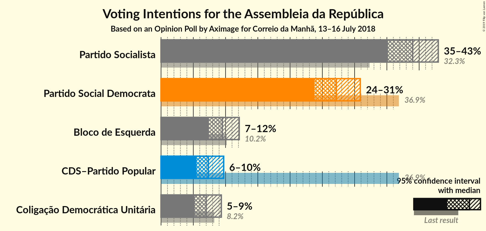

### Confidence Intervals

| Party | Last Result | Poll Result | 80% Confidence Interval | 90% Confidence Interval | 95% Confidence Interval | 99% Confidence Interval |
|:-----:|:-----------:|:-----------:|:-----------------------:|:-----------------------:|:-----------------------:|:-----------------------:|
| Partido Socialista | 32.3% | 39.0% | 36.5–41.6% |35.8–42.3% |35.2–43.0% |34.0–44.2% |
| Partido Social Democrata | 36.9% | 27.2% | 24.9–29.6% |24.3–30.3% |23.8–30.9% |22.7–32.1% |
| Bloco de Esquerda | 10.2% | 9.5% | 8.1–11.2% |7.7–11.7% |7.4–12.1% |6.8–13.0% |
| CDS–Partido Popular | 36.9% | 7.3% | 6.1–8.9% |5.8–9.3% |5.5–9.7% |5.0–10.5% |
| Coligação Democrática Unitária | 8.2% | 7.0% | 5.8–8.5% |5.5–8.9% |5.2–9.3% |4.7–10.1% |

*Note:* The poll result column reflects the actual value used in the calculations. Published results may vary slightly, and in addition be rounded to fewer digits.

## Seats

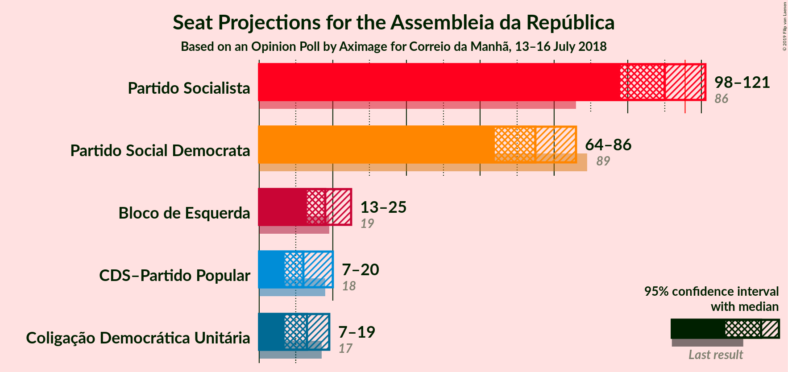

### Confidence Intervals

| Party | Last Result | Median | 80% Confidence Interval | 90% Confidence Interval | 95% Confidence Interval | 99% Confidence Interval |
|:-----:|:-----------:|:------:|:-----------------------:|:-----------------------:|:-----------------------:|:-----------------------:|
| <a href="#partido-socialista">Partido Socialista</a> | 86 | 110 | 103–117 |100–119 |99–120 |94–126 |
| <a href="#partido-social-democrata">Partido Social Democrata</a> | 89 | 75 | 68–82 |66–84 |64–86 |60–90 |
| <a href="#bloco-de-esquerda">Bloco de Esquerda</a> | 19 | 18 | 16–24 |14–24 |13–25 |11–27 |
| <a href="#cds–partido-popular">CDS–Partido Popular</a> | 18 | 13 | 9–18 |8–19 |7–20 |6–22 |
| <a href="#coligação-democrática-unitária">Coligação Democrática Unitária</a> | 17 | 13 | 9–17 |8–17 |7–19 |6–21 |

### Partido Socialista

*For a full overview of the results for this party, see the [Partido Socialista](party-partidosocialista.html) page.*

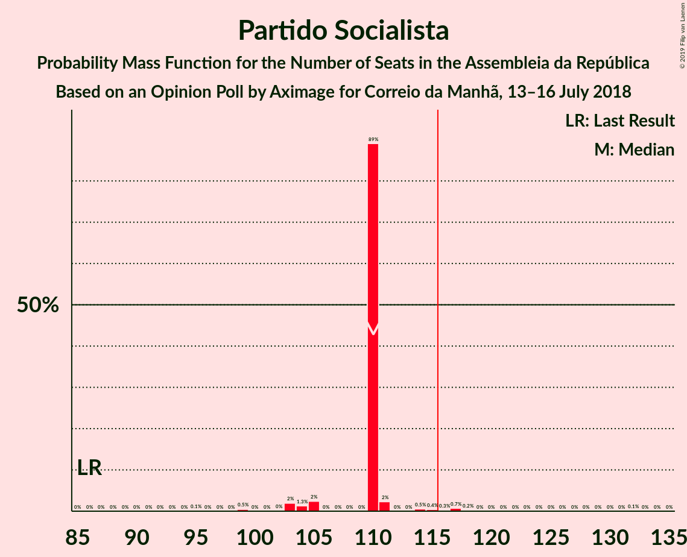

| Number of Seats | Probability | Accumulated | Special Marks |
|:---------------:|:-----------:|:-----------:|:-------------:|
| 86 | 0% | 100% | Last Result |
| 87 | 0% | 100% |  |
| 88 | 0% | 100% |  |
| 89 | 0% | 100% |  |
| 90 | 0% | 99.9% |  |
| 91 | 0% | 99.9% |  |
| 92 | 0.1% | 99.9% |  |
| 93 | 0.2% | 99.8% |  |
| 94 | 0.2% | 99.6% |  |
| 95 | 0.5% | 99.4% |  |
| 96 | 0.3% | 98.9% |  |
| 97 | 0.5% | 98.5% |  |
| 98 | 0.5% | 98% |  |
| 99 | 1.3% | 98% |  |
| 100 | 2% | 96% |  |
| 101 | 2% | 94% |  |
| 102 | 2% | 92% |  |
| 103 | 3% | 90% |  |
| 104 | 3% | 88% |  |
| 105 | 3% | 84% |  |
| 106 | 3% | 82% |  |
| 107 | 7% | 79% |  |
| 108 | 10% | 72% |  |
| 109 | 7% | 62% |  |
| 110 | 10% | 55% | Median |
| 111 | 6% | 44% |  |
| 112 | 3% | 38% |  |
| 113 | 6% | 35% |  |
| 114 | 8% | 29% |  |
| 115 | 4% | 22% |  |
| 116 | 5% | 18% | Majority |
| 117 | 5% | 13% |  |
| 118 | 2% | 8% |  |
| 119 | 2% | 5% |  |
| 120 | 0.8% | 3% |  |
| 121 | 0.4% | 2% |  |
| 122 | 0.4% | 2% |  |
| 123 | 0.3% | 1.2% |  |
| 124 | 0.4% | 1.0% |  |
| 125 | 0.1% | 0.6% |  |
| 126 | 0.1% | 0.5% |  |
| 127 | 0.1% | 0.4% |  |
| 128 | 0.1% | 0.3% |  |
| 129 | 0.1% | 0.2% |  |
| 130 | 0% | 0.1% |  |
| 131 | 0% | 0.1% |  |
| 132 | 0% | 0% |  |

### Partido Social Democrata

*For a full overview of the results for this party, see the [Partido Social Democrata](party-partidosocialdemocrata.html) page.*

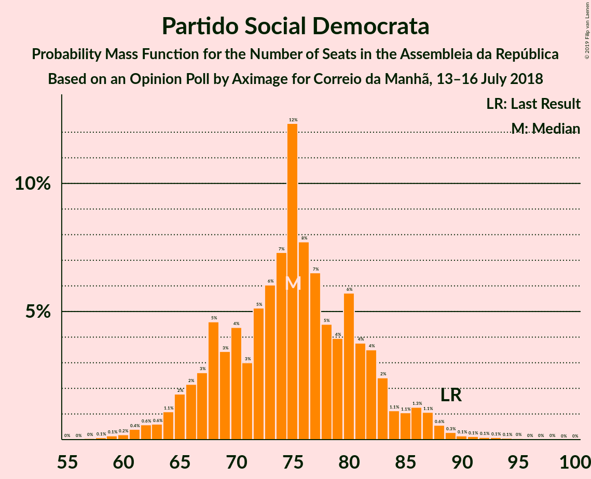

| Number of Seats | Probability | Accumulated | Special Marks |
|:---------------:|:-----------:|:-----------:|:-------------:|
| 57 | 0% | 100% |  |
| 58 | 0.1% | 99.9% |  |
| 59 | 0.1% | 99.9% |  |
| 60 | 0.2% | 99.7% |  |
| 61 | 0.3% | 99.5% |  |
| 62 | 0.6% | 99.2% |  |
| 63 | 0.5% | 98.5% |  |
| 64 | 0.8% | 98% |  |
| 65 | 2% | 97% |  |
| 66 | 2% | 95% |  |
| 67 | 2% | 93% |  |
| 68 | 4% | 91% |  |
| 69 | 3% | 87% |  |
| 70 | 6% | 83% |  |
| 71 | 2% | 77% |  |
| 72 | 4% | 75% |  |
| 73 | 7% | 71% |  |
| 74 | 7% | 63% |  |
| 75 | 14% | 57% | Median |
| 76 | 6% | 43% |  |
| 77 | 7% | 36% |  |
| 78 | 4% | 29% |  |
| 79 | 6% | 25% |  |
| 80 | 6% | 19% |  |
| 81 | 3% | 14% |  |
| 82 | 3% | 11% |  |
| 83 | 2% | 8% |  |
| 84 | 1.2% | 6% |  |
| 85 | 0.9% | 4% |  |
| 86 | 1.0% | 3% |  |
| 87 | 1.0% | 2% |  |
| 88 | 0.6% | 1.4% |  |
| 89 | 0.4% | 0.9% | Last Result |
| 90 | 0.1% | 0.5% |  |
| 91 | 0.1% | 0.4% |  |
| 92 | 0.1% | 0.3% |  |
| 93 | 0.1% | 0.2% |  |
| 94 | 0.1% | 0.1% |  |
| 95 | 0% | 0.1% |  |
| 96 | 0% | 0% |  |

### Bloco de Esquerda

*For a full overview of the results for this party, see the [Bloco de Esquerda](party-blocodeesquerda.html) page.*

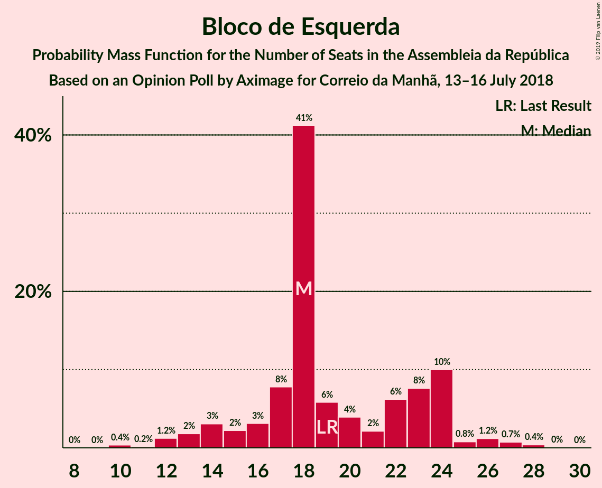

| Number of Seats | Probability | Accumulated | Special Marks |
|:---------------:|:-----------:|:-----------:|:-------------:|
| 10 | 0.4% | 100% |  |
| 11 | 0.2% | 99.6% |  |
| 12 | 1.2% | 99.4% |  |
| 13 | 2% | 98% |  |
| 14 | 3% | 96% |  |
| 15 | 2% | 93% |  |
| 16 | 3% | 91% |  |
| 17 | 8% | 88% |  |
| 18 | 41% | 80% | Median |
| 19 | 6% | 39% | Last Result |
| 20 | 4% | 33% |  |
| 21 | 2% | 29% |  |
| 22 | 6% | 27% |  |
| 23 | 8% | 21% |  |
| 24 | 10% | 13% |  |
| 25 | 0.8% | 3% |  |
| 26 | 1.2% | 2% |  |
| 27 | 0.7% | 1.2% |  |
| 28 | 0.4% | 0.5% |  |
| 29 | 0% | 0.1% |  |
| 30 | 0% | 0% |  |

### CDS–Partido Popular

*For a full overview of the results for this party, see the [CDS–Partido Popular](party-cds–partidopopular.html) page.*

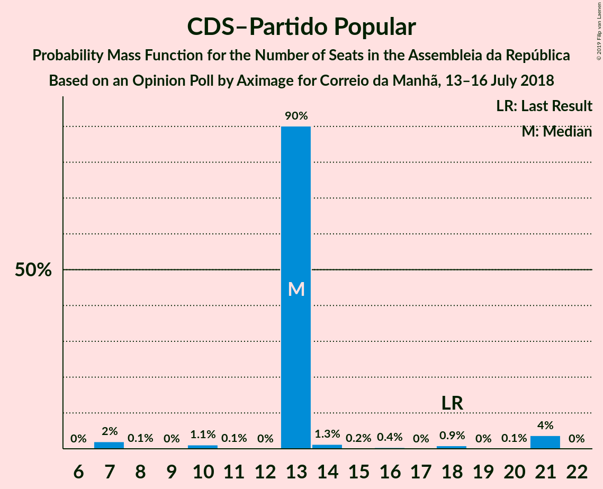

| Number of Seats | Probability | Accumulated | Special Marks |
|:---------------:|:-----------:|:-----------:|:-------------:|
| 6 | 2% | 100% |  |
| 7 | 2% | 98% |  |
| 8 | 3% | 97% |  |
| 9 | 4% | 94% |  |
| 10 | 18% | 89% |  |
| 11 | 12% | 72% |  |
| 12 | 9% | 60% |  |
| 13 | 14% | 50% | Median |
| 14 | 8% | 37% |  |
| 15 | 5% | 28% |  |
| 16 | 5% | 23% |  |
| 17 | 4% | 17% |  |
| 18 | 4% | 14% | Last Result |
| 19 | 6% | 10% |  |
| 20 | 2% | 4% |  |
| 21 | 1.4% | 2% |  |
| 22 | 0.3% | 0.8% |  |
| 23 | 0.2% | 0.4% |  |
| 24 | 0.1% | 0.2% |  |
| 25 | 0.1% | 0.1% |  |
| 26 | 0% | 0% |  |

### Coligação Democrática Unitária

*For a full overview of the results for this party, see the [Coligação Democrática Unitária](party-coligaçãodemocráticaunitária.html) page.*

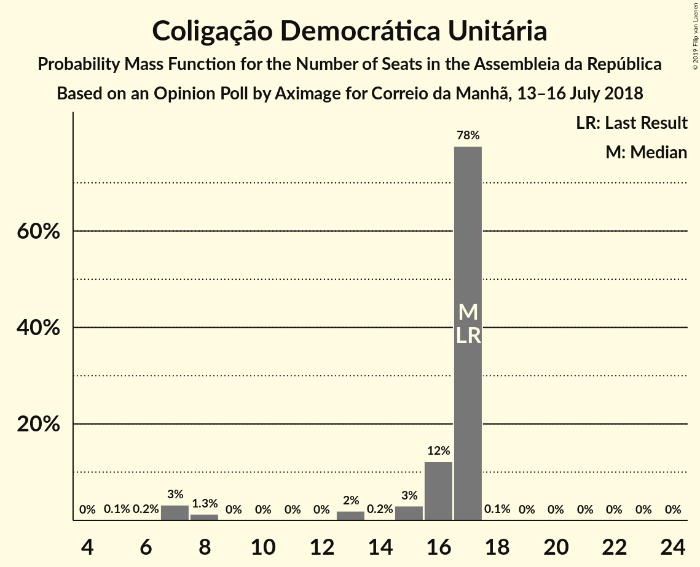

| Number of Seats | Probability | Accumulated | Special Marks |
|:---------------:|:-----------:|:-----------:|:-------------:|
| 5 | 0.3% | 100% |  |
| 6 | 2% | 99.7% |  |
| 7 | 2% | 98% |  |
| 8 | 3% | 96% |  |
| 9 | 9% | 93% |  |
| 10 | 13% | 84% |  |
| 11 | 9% | 71% |  |
| 12 | 6% | 62% |  |
| 13 | 7% | 56% | Median |
| 14 | 17% | 49% |  |
| 15 | 6% | 32% |  |
| 16 | 9% | 26% |  |
| 17 | 12% | 17% | Last Result |
| 18 | 2% | 5% |  |
| 19 | 1.4% | 3% |  |
| 20 | 0.9% | 1.4% |  |
| 21 | 0.4% | 0.5% |  |
| 22 | 0.1% | 0.1% |  |
| 23 | 0% | 0.1% |  |
| 24 | 0% | 0% |  |

## Coalitions

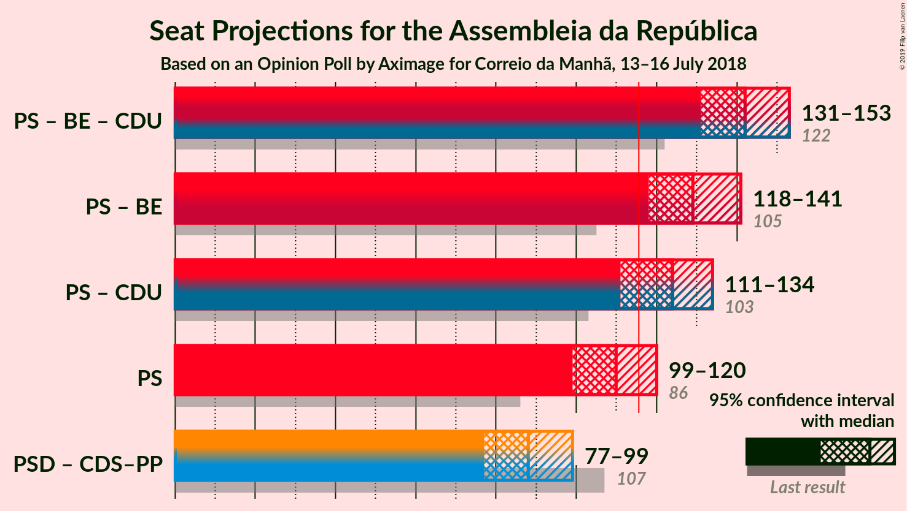

### Confidence Intervals

| Coalition | Last Result | Median | Majority? | 80% Confidence Interval | 90% Confidence Interval | 95% Confidence Interval | 99% Confidence Interval |
|:---------:|:-----------:|:------:|:---------:|:-----------------------:|:-----------------------:|:-----------------------:|:-----------------------:|
| Partido Socialista – Bloco de Esquerda – Coligação Democrática Unitária | 122 | 142 | 100% | 135–150 | 132–151 | 131–153 | 126–157 |
| Partido Socialista – Bloco de Esquerda | 105 | 129 | 98.8% | 122–137 | 120–139 | 118–141 | 113–145 |
| Partido Socialista – Coligação Democrática Unitária | 103 | 124 | 90% | 116–130 | 113–132 | 111–134 | 106–138 |
| Partido Socialista | 86 | 110 | 18% | 103–117 | 100–119 | 99–120 | 94–126 |
| Partido Social Democrata – CDS–Partido Popular | 107 | 88 | 0% | 80–95 | 79–98 | 77–99 | 73–104 |

### Partido Socialista – Bloco de Esquerda – Coligação Democrática Unitária

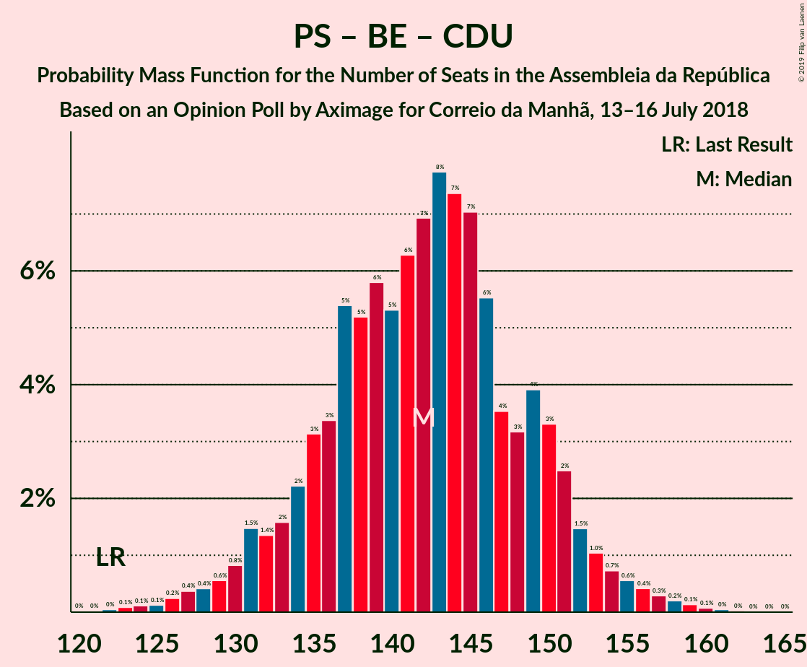

| Number of Seats | Probability | Accumulated | Special Marks |
|:---------------:|:-----------:|:-----------:|:-------------:|
| 121 | 0% | 100% |  |
| 122 | 0.1% | 99.9% | Last Result |
| 123 | 0.1% | 99.9% |  |
| 124 | 0.1% | 99.8% |  |
| 125 | 0.1% | 99.7% |  |
| 126 | 0.3% | 99.6% |  |
| 127 | 0.2% | 99.2% |  |
| 128 | 0.3% | 99.1% |  |
| 129 | 0.6% | 98.8% |  |
| 130 | 0.6% | 98% |  |
| 131 | 2% | 98% |  |
| 132 | 1.0% | 96% |  |
| 133 | 1.1% | 95% |  |
| 134 | 2% | 94% |  |
| 135 | 4% | 91% |  |
| 136 | 3% | 87% |  |
| 137 | 4% | 84% |  |
| 138 | 7% | 80% |  |
| 139 | 6% | 73% |  |
| 140 | 5% | 67% |  |
| 141 | 4% | 62% | Median |
| 142 | 8% | 58% |  |
| 143 | 11% | 50% |  |
| 144 | 6% | 39% |  |
| 145 | 5% | 33% |  |
| 146 | 5% | 28% |  |
| 147 | 4% | 22% |  |
| 148 | 3% | 18% |  |
| 149 | 4% | 15% |  |
| 150 | 2% | 11% |  |
| 151 | 4% | 8% |  |
| 152 | 2% | 5% |  |
| 153 | 0.6% | 3% |  |
| 154 | 0.4% | 2% |  |
| 155 | 0.8% | 2% |  |
| 156 | 0.7% | 1.3% |  |
| 157 | 0.2% | 0.6% |  |
| 158 | 0.1% | 0.4% |  |
| 159 | 0.1% | 0.3% |  |
| 160 | 0.1% | 0.2% |  |
| 161 | 0.1% | 0.1% |  |
| 162 | 0% | 0% |  |

### Partido Socialista – Bloco de Esquerda

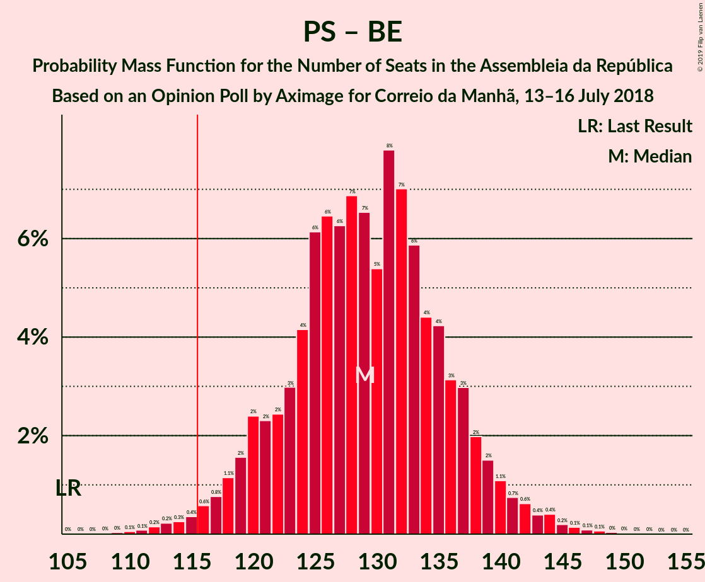

| Number of Seats | Probability | Accumulated | Special Marks |
|:---------------:|:-----------:|:-----------:|:-------------:|
| 105 | 0% | 100% | Last Result |
| 106 | 0% | 100% |  |
| 107 | 0% | 100% |  |
| 108 | 0% | 100% |  |
| 109 | 0% | 100% |  |
| 110 | 0.1% | 99.9% |  |
| 111 | 0.1% | 99.9% |  |
| 112 | 0.2% | 99.8% |  |
| 113 | 0.3% | 99.6% |  |
| 114 | 0.2% | 99.4% |  |
| 115 | 0.4% | 99.2% |  |
| 116 | 0.3% | 98.8% | Majority |
| 117 | 0.9% | 98% |  |
| 118 | 1.1% | 98% |  |
| 119 | 1.2% | 96% |  |
| 120 | 3% | 95% |  |
| 121 | 2% | 92% |  |
| 122 | 3% | 91% |  |
| 123 | 3% | 88% |  |
| 124 | 3% | 85% |  |
| 125 | 6% | 82% |  |
| 126 | 8% | 77% |  |
| 127 | 7% | 68% |  |
| 128 | 7% | 61% | Median |
| 129 | 6% | 54% |  |
| 130 | 5% | 48% |  |
| 131 | 9% | 43% |  |
| 132 | 8% | 34% |  |
| 133 | 5% | 27% |  |
| 134 | 4% | 21% |  |
| 135 | 5% | 18% |  |
| 136 | 2% | 13% |  |
| 137 | 3% | 11% |  |
| 138 | 3% | 8% |  |
| 139 | 1.2% | 5% |  |
| 140 | 2% | 4% |  |
| 141 | 0.8% | 3% |  |
| 142 | 0.6% | 2% |  |
| 143 | 0.5% | 1.2% |  |
| 144 | 0.2% | 0.7% |  |
| 145 | 0.1% | 0.6% |  |
| 146 | 0.2% | 0.5% |  |
| 147 | 0.1% | 0.3% |  |
| 148 | 0.1% | 0.2% |  |
| 149 | 0% | 0.1% |  |
| 150 | 0% | 0.1% |  |
| 151 | 0% | 0% |  |

### Partido Socialista – Coligação Democrática Unitária

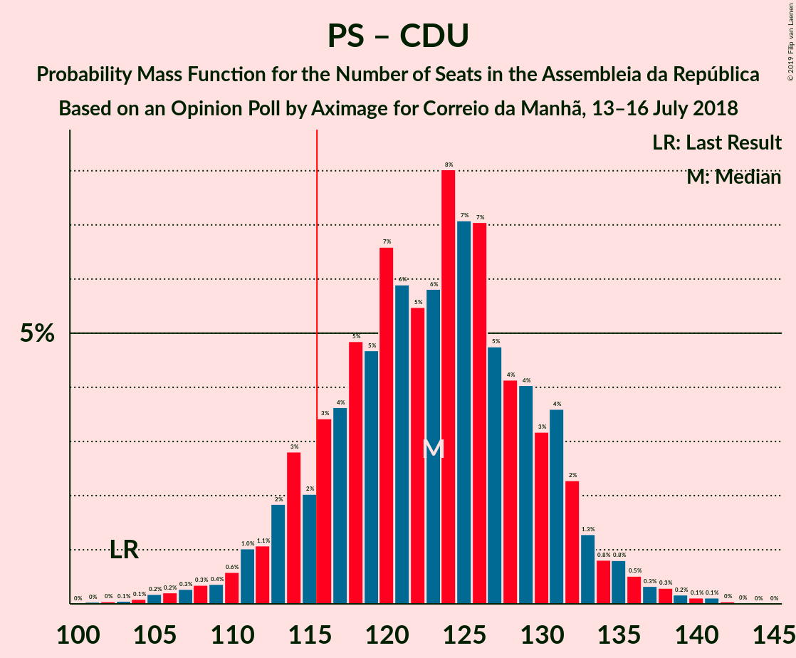

| Number of Seats | Probability | Accumulated | Special Marks |
|:---------------:|:-----------:|:-----------:|:-------------:|
| 101 | 0% | 100% |  |
| 102 | 0% | 99.9% |  |
| 103 | 0% | 99.9% | Last Result |
| 104 | 0.1% | 99.8% |  |
| 105 | 0.2% | 99.8% |  |
| 106 | 0.2% | 99.5% |  |
| 107 | 0.3% | 99.3% |  |
| 108 | 0.3% | 99.0% |  |
| 109 | 0.3% | 98.7% |  |
| 110 | 0.5% | 98% |  |
| 111 | 1.0% | 98% |  |
| 112 | 0.9% | 97% |  |
| 113 | 1.4% | 96% |  |
| 114 | 3% | 95% |  |
| 115 | 2% | 92% |  |
| 116 | 3% | 90% | Majority |
| 117 | 3% | 87% |  |
| 118 | 4% | 84% |  |
| 119 | 4% | 80% |  |
| 120 | 10% | 76% |  |
| 121 | 6% | 65% |  |
| 122 | 5% | 59% |  |
| 123 | 3% | 54% | Median |
| 124 | 10% | 51% |  |
| 125 | 8% | 41% |  |
| 126 | 8% | 34% |  |
| 127 | 5% | 26% |  |
| 128 | 4% | 21% |  |
| 129 | 4% | 17% |  |
| 130 | 3% | 13% |  |
| 131 | 3% | 10% |  |
| 132 | 3% | 7% |  |
| 133 | 2% | 4% |  |
| 134 | 0.7% | 3% |  |
| 135 | 0.6% | 2% |  |
| 136 | 0.3% | 1.5% |  |
| 137 | 0.3% | 1.1% |  |
| 138 | 0.5% | 0.8% |  |
| 139 | 0.1% | 0.4% |  |
| 140 | 0.1% | 0.2% |  |
| 141 | 0.1% | 0.2% |  |
| 142 | 0.1% | 0.1% |  |
| 143 | 0% | 0% |  |

### Partido Socialista

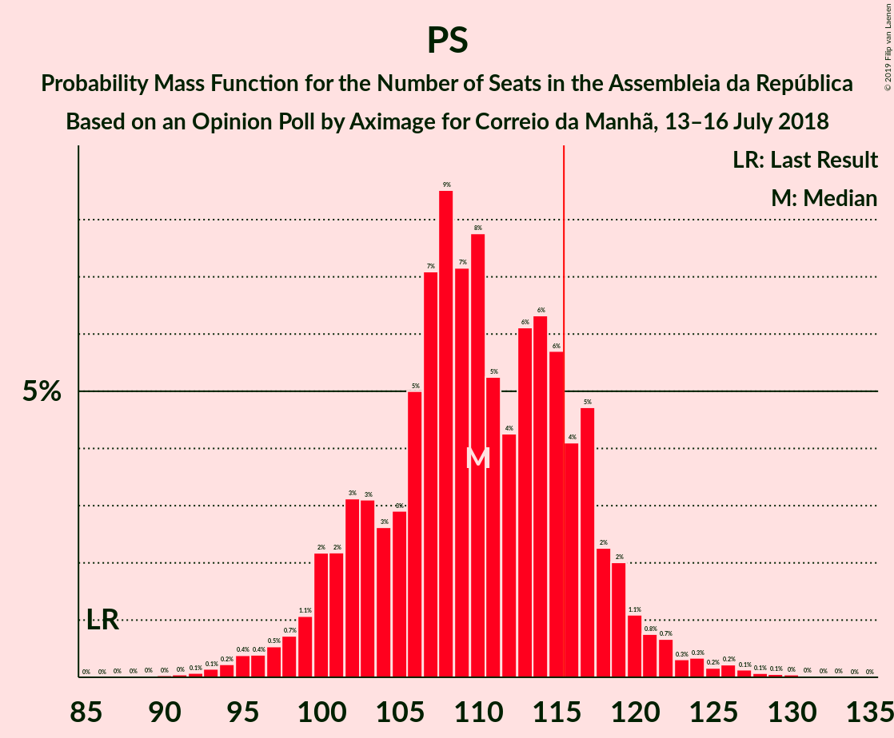

| Number of Seats | Probability | Accumulated | Special Marks |
|:---------------:|:-----------:|:-----------:|:-------------:|
| 86 | 0% | 100% | Last Result |
| 87 | 0% | 100% |  |
| 88 | 0% | 100% |  |
| 89 | 0% | 100% |  |
| 90 | 0% | 99.9% |  |
| 91 | 0% | 99.9% |  |
| 92 | 0.1% | 99.9% |  |
| 93 | 0.2% | 99.8% |  |
| 94 | 0.2% | 99.6% |  |
| 95 | 0.5% | 99.4% |  |
| 96 | 0.3% | 98.9% |  |
| 97 | 0.5% | 98.5% |  |
| 98 | 0.5% | 98% |  |
| 99 | 1.3% | 98% |  |
| 100 | 2% | 96% |  |
| 101 | 2% | 94% |  |
| 102 | 2% | 92% |  |
| 103 | 3% | 90% |  |
| 104 | 3% | 88% |  |
| 105 | 3% | 84% |  |
| 106 | 3% | 82% |  |
| 107 | 7% | 79% |  |
| 108 | 10% | 72% |  |
| 109 | 7% | 62% |  |
| 110 | 10% | 55% | Median |
| 111 | 6% | 44% |  |
| 112 | 3% | 38% |  |
| 113 | 6% | 35% |  |
| 114 | 8% | 29% |  |
| 115 | 4% | 22% |  |
| 116 | 5% | 18% | Majority |
| 117 | 5% | 13% |  |
| 118 | 2% | 8% |  |
| 119 | 2% | 5% |  |
| 120 | 0.8% | 3% |  |
| 121 | 0.4% | 2% |  |
| 122 | 0.4% | 2% |  |
| 123 | 0.3% | 1.2% |  |
| 124 | 0.4% | 1.0% |  |
| 125 | 0.1% | 0.6% |  |
| 126 | 0.1% | 0.5% |  |
| 127 | 0.1% | 0.4% |  |
| 128 | 0.1% | 0.3% |  |
| 129 | 0.1% | 0.2% |  |
| 130 | 0% | 0.1% |  |
| 131 | 0% | 0.1% |  |
| 132 | 0% | 0% |  |

### Partido Social Democrata – CDS–Partido Popular

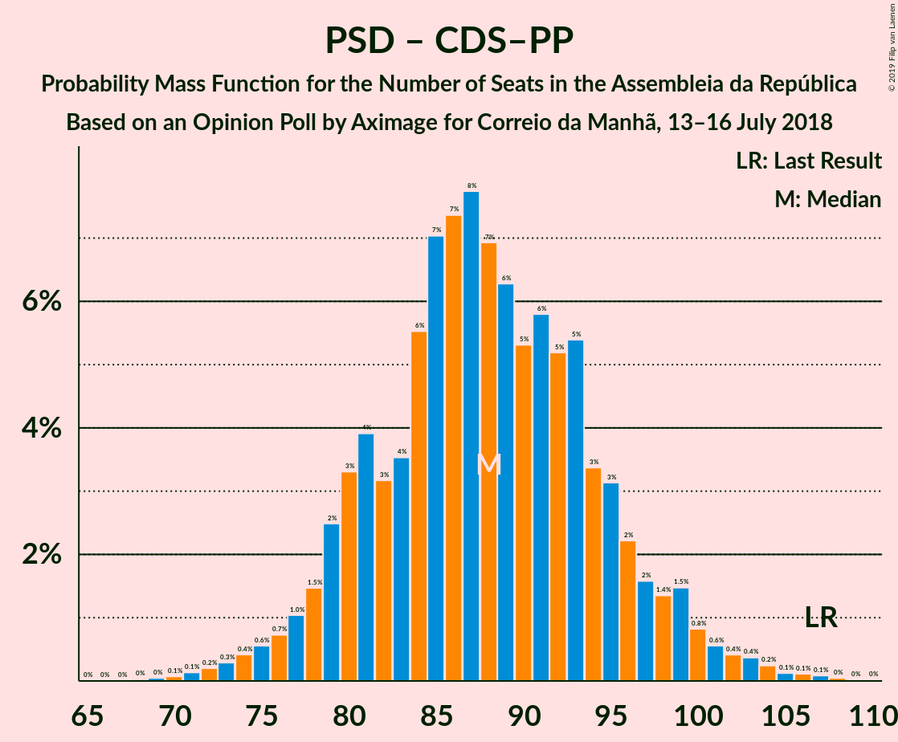

| Number of Seats | Probability | Accumulated | Special Marks |
|:---------------:|:-----------:|:-----------:|:-------------:|
| 69 | 0.1% | 100% |  |
| 70 | 0.1% | 99.9% |  |
| 71 | 0.1% | 99.8% |  |
| 72 | 0.1% | 99.7% |  |
| 73 | 0.2% | 99.6% |  |
| 74 | 0.7% | 99.4% |  |
| 75 | 0.8% | 98.7% |  |
| 76 | 0.4% | 98% |  |
| 77 | 0.6% | 98% |  |
| 78 | 2% | 97% |  |
| 79 | 4% | 95% |  |
| 80 | 2% | 92% |  |
| 81 | 4% | 89% |  |
| 82 | 3% | 85% |  |
| 83 | 4% | 82% |  |
| 84 | 5% | 78% |  |
| 85 | 5% | 72% |  |
| 86 | 6% | 67% |  |
| 87 | 11% | 61% |  |
| 88 | 8% | 50% | Median |
| 89 | 4% | 42% |  |
| 90 | 5% | 38% |  |
| 91 | 6% | 33% |  |
| 92 | 7% | 27% |  |
| 93 | 4% | 20% |  |
| 94 | 3% | 16% |  |
| 95 | 4% | 13% |  |
| 96 | 2% | 9% |  |
| 97 | 1.1% | 6% |  |
| 98 | 1.0% | 5% |  |
| 99 | 2% | 4% |  |
| 100 | 0.6% | 2% |  |
| 101 | 0.6% | 2% |  |
| 102 | 0.3% | 1.2% |  |
| 103 | 0.2% | 0.9% |  |
| 104 | 0.3% | 0.8% |  |
| 105 | 0.1% | 0.4% |  |
| 106 | 0.1% | 0.3% |  |
| 107 | 0.1% | 0.2% | Last Result |
| 108 | 0.1% | 0.1% |  |
| 109 | 0% | 0.1% |  |
| 110 | 0% | 0% |  |

## Technical Information

### Opinion Poll

+ **Polling firm:** Aximage
+ **Commissioner(s):** Correio da Manhã
+ **Fieldwork period:** 13–16 July 2018

### Calculations

+ **Sample size:** 600
+ **Simulations done:** 131,072
+ **Error estimate:** 1.83%

