# Opinion Poll by Aximage for Correio da Manhã, 1–2 September 2018

<a href="#voting-intentions">Voting Intentions</a> | <a href="#seats">Seats</a> | <a href="#coalitions">Coalitions</a> | <a href="#technical-information">Technical Information</a>

## Voting Intentions

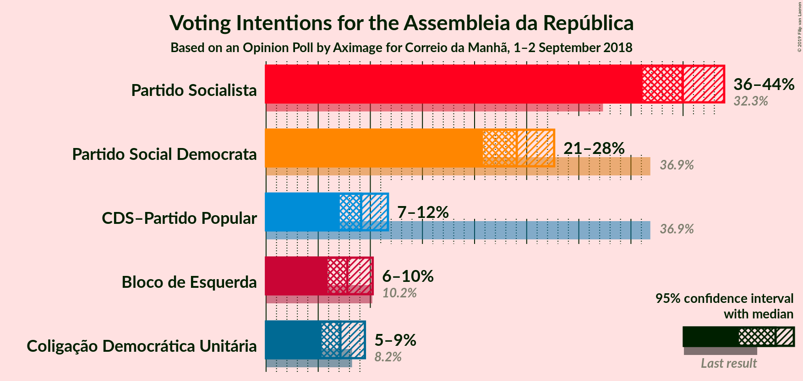

### Confidence Intervals

| Party | Last Result | Poll Result | 80% Confidence Interval | 90% Confidence Interval | 95% Confidence Interval | 99% Confidence Interval |
|:-----:|:-----------:|:-----------:|:-----------------------:|:-----------------------:|:-----------------------:|:-----------------------:|
| Partido Socialista | 32.3% | 40.0% | 37.4–42.6% |36.7–43.3% |36.1–43.9% |34.9–45.2% |
| Partido Social Democrata | 36.9% | 24.0% | 21.9–26.4% |21.3–27.1% |20.8–27.6% |19.8–28.8% |
| CDS–Partido Popular | 36.9% | 9.1% | 7.8–10.8% |7.4–11.3% |7.1–11.7% |6.5–12.5% |
| Bloco de Esquerda | 10.2% | 7.8% | 6.6–9.4% |6.2–9.8% |5.9–10.2% |5.4–11.0% |
| Coligação Democrática Unitária | 8.2% | 7.1% | 5.9–8.7% |5.6–9.1% |5.3–9.5% |4.8–10.3% |

*Note:* The poll result column reflects the actual value used in the calculations. Published results may vary slightly, and in addition be rounded to fewer digits.

## Seats

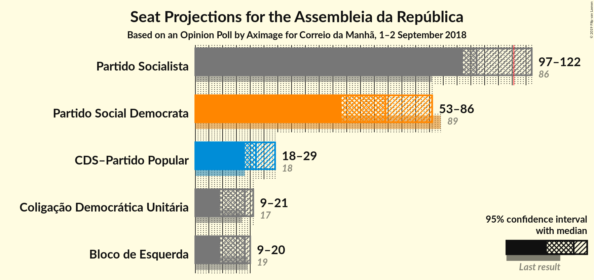

### Confidence Intervals

| Party | Last Result | Median | 80% Confidence Interval | 90% Confidence Interval | 95% Confidence Interval | 99% Confidence Interval |
|:-----:|:-----------:|:------:|:-----------------------:|:-----------------------:|:-----------------------:|:-----------------------:|
| <a href="#partido-socialista">Partido Socialista</a> | 86 | 116 | 110–125 |107–126 |106–126 |102–132 |
| <a href="#partido-social-democrata">Partido Social Democrata</a> | 89 | 66 | 58–72 |58–74 |58–74 |54–80 |
| <a href="#cds–partido-popular">CDS–Partido Popular</a> | 18 | 19 | 15–23 |13–23 |11–25 |10–29 |
| <a href="#bloco-de-esquerda">Bloco de Esquerda</a> | 19 | 14 | 13–19 |13–20 |12–20 |8–21 |
| <a href="#coligação-democrática-unitária">Coligação Democrática Unitária</a> | 17 | 14 | 12–18 |11–19 |9–19 |7–20 |

### Partido Socialista

*For a full overview of the results for this party, see the [Partido Socialista](party-partidosocialista.html) page.*

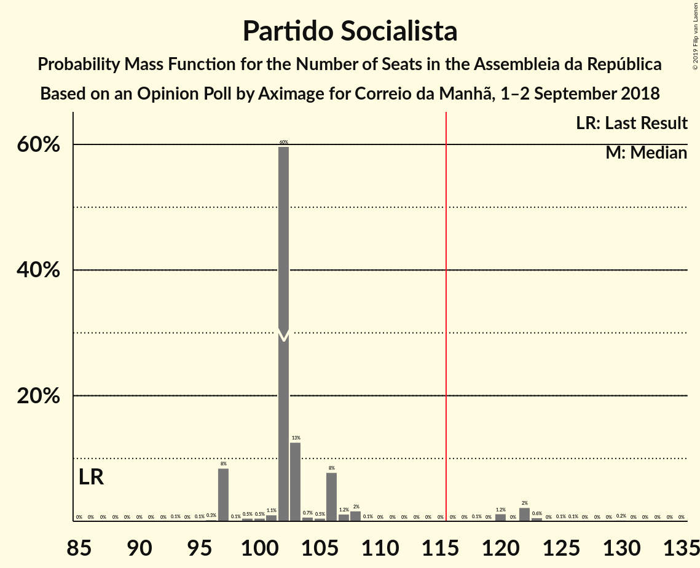

| Number of Seats | Probability | Accumulated | Special Marks |
|:---------------:|:-----------:|:-----------:|:-------------:|
| 86 | 0% | 100% | Last Result |
| 87 | 0% | 100% |  |
| 88 | 0% | 100% |  |
| 89 | 0% | 100% |  |
| 90 | 0% | 100% |  |
| 91 | 0% | 100% |  |
| 92 | 0% | 100% |  |
| 93 | 0% | 100% |  |
| 94 | 0% | 100% |  |
| 95 | 0% | 100% |  |
| 96 | 0% | 100% |  |
| 97 | 0.1% | 100% |  |
| 98 | 0% | 99.9% |  |
| 99 | 0% | 99.8% |  |
| 100 | 0.2% | 99.8% |  |
| 101 | 0% | 99.6% |  |
| 102 | 0.7% | 99.6% |  |
| 103 | 0.1% | 98.9% |  |
| 104 | 0% | 98.8% |  |
| 105 | 0.6% | 98.8% |  |
| 106 | 2% | 98% |  |
| 107 | 3% | 97% |  |
| 108 | 0.3% | 93% |  |
| 109 | 0.5% | 93% |  |
| 110 | 7% | 93% |  |
| 111 | 1.3% | 86% |  |
| 112 | 17% | 85% |  |
| 113 | 13% | 68% |  |
| 114 | 0.8% | 55% |  |
| 115 | 2% | 54% |  |
| 116 | 3% | 52% | Median, Majority |
| 117 | 30% | 49% |  |
| 118 | 3% | 20% |  |
| 119 | 2% | 17% |  |
| 120 | 1.3% | 15% |  |
| 121 | 0.4% | 14% |  |
| 122 | 0.3% | 14% |  |
| 123 | 0% | 13% |  |
| 124 | 0.5% | 13% |  |
| 125 | 6% | 13% |  |
| 126 | 6% | 7% |  |
| 127 | 0% | 0.7% |  |
| 128 | 0% | 0.7% |  |
| 129 | 0% | 0.6% |  |
| 130 | 0% | 0.6% |  |
| 131 | 0% | 0.6% |  |
| 132 | 0% | 0.5% |  |
| 133 | 0.2% | 0.5% |  |
| 134 | 0.2% | 0.3% |  |
| 135 | 0% | 0.1% |  |
| 136 | 0% | 0% |  |

### Partido Social Democrata

*For a full overview of the results for this party, see the [Partido Social Democrata](party-partidosocialdemocrata.html) page.*

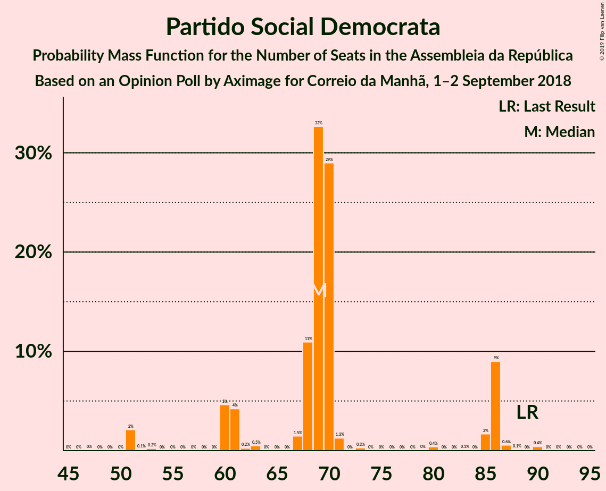

| Number of Seats | Probability | Accumulated | Special Marks |
|:---------------:|:-----------:|:-----------:|:-------------:|
| 51 | 0% | 100% |  |
| 52 | 0.1% | 99.9% |  |
| 53 | 0.1% | 99.9% |  |
| 54 | 1.2% | 99.8% |  |
| 55 | 0.1% | 98.5% |  |
| 56 | 0% | 98% |  |
| 57 | 0.1% | 98% |  |
| 58 | 8% | 98% |  |
| 59 | 7% | 90% |  |
| 60 | 0.8% | 82% |  |
| 61 | 0.1% | 82% |  |
| 62 | 0.1% | 82% |  |
| 63 | 1.2% | 82% |  |
| 64 | 16% | 80% |  |
| 65 | 3% | 64% |  |
| 66 | 12% | 61% | Median |
| 67 | 0.2% | 49% |  |
| 68 | 21% | 49% |  |
| 69 | 9% | 27% |  |
| 70 | 5% | 19% |  |
| 71 | 4% | 14% |  |
| 72 | 3% | 10% |  |
| 73 | 2% | 8% |  |
| 74 | 3% | 5% |  |
| 75 | 0.9% | 2% |  |
| 76 | 0.3% | 1.1% |  |
| 77 | 0.3% | 0.8% |  |
| 78 | 0% | 0.5% |  |
| 79 | 0% | 0.5% |  |
| 80 | 0% | 0.5% |  |
| 81 | 0.1% | 0.5% |  |
| 82 | 0.2% | 0.4% |  |
| 83 | 0% | 0.2% |  |
| 84 | 0% | 0.2% |  |
| 85 | 0% | 0.2% |  |
| 86 | 0.1% | 0.1% |  |
| 87 | 0% | 0% |  |
| 88 | 0% | 0% |  |
| 89 | 0% | 0% | Last Result |

### CDS–Partido Popular

*For a full overview of the results for this party, see the [CDS–Partido Popular](party-cds–partidopopular.html) page.*

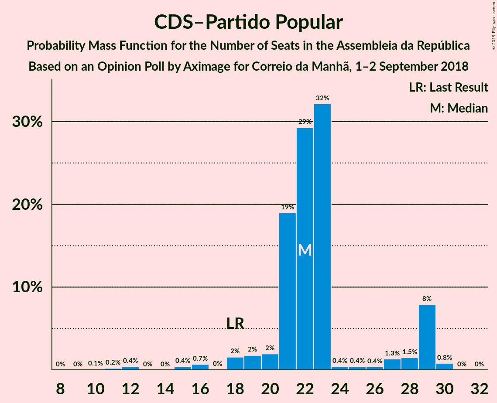

| Number of Seats | Probability | Accumulated | Special Marks |
|:---------------:|:-----------:|:-----------:|:-------------:|
| 9 | 0.1% | 100% |  |
| 10 | 0.8% | 99.9% |  |
| 11 | 2% | 99.1% |  |
| 12 | 1.4% | 97% |  |
| 13 | 2% | 96% |  |
| 14 | 3% | 94% |  |
| 15 | 8% | 90% |  |
| 16 | 0.8% | 82% |  |
| 17 | 13% | 82% |  |
| 18 | 16% | 68% | Last Result |
| 19 | 19% | 52% | Median |
| 20 | 7% | 33% |  |
| 21 | 6% | 27% |  |
| 22 | 2% | 21% |  |
| 23 | 16% | 19% |  |
| 24 | 0.2% | 4% |  |
| 25 | 1.3% | 3% |  |
| 26 | 0.6% | 2% |  |
| 27 | 0.6% | 2% |  |
| 28 | 0.3% | 0.9% |  |
| 29 | 0.2% | 0.6% |  |
| 30 | 0.4% | 0.4% |  |
| 31 | 0% | 0% |  |

### Bloco de Esquerda

*For a full overview of the results for this party, see the [Bloco de Esquerda](party-blocodeesquerda.html) page.*

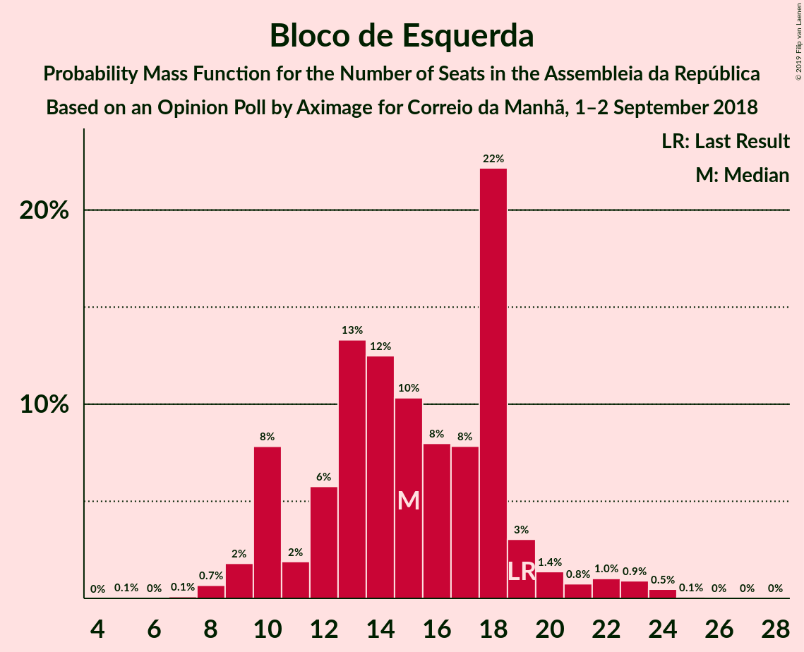

| Number of Seats | Probability | Accumulated | Special Marks |
|:---------------:|:-----------:|:-----------:|:-------------:|
| 5 | 0.1% | 100% |  |
| 6 | 0.1% | 99.9% |  |
| 7 | 0.3% | 99.9% |  |
| 8 | 0.3% | 99.5% |  |
| 9 | 0.2% | 99.3% |  |
| 10 | 0% | 99.1% |  |
| 11 | 0% | 99.1% |  |
| 12 | 2% | 99.0% |  |
| 13 | 25% | 97% |  |
| 14 | 39% | 72% | Median |
| 15 | 10% | 33% |  |
| 16 | 0% | 23% |  |
| 17 | 0% | 23% |  |
| 18 | 5% | 23% |  |
| 19 | 11% | 17% | Last Result |
| 20 | 4% | 6% |  |
| 21 | 2% | 2% |  |
| 22 | 0.1% | 0.3% |  |
| 23 | 0% | 0.2% |  |
| 24 | 0% | 0.1% |  |
| 25 | 0% | 0.1% |  |
| 26 | 0.1% | 0.1% |  |
| 27 | 0.1% | 0.1% |  |
| 28 | 0% | 0% |  |

### Coligação Democrática Unitária

*For a full overview of the results for this party, see the [Coligação Democrática Unitária](party-coligaçãodemocráticaunitária.html) page.*

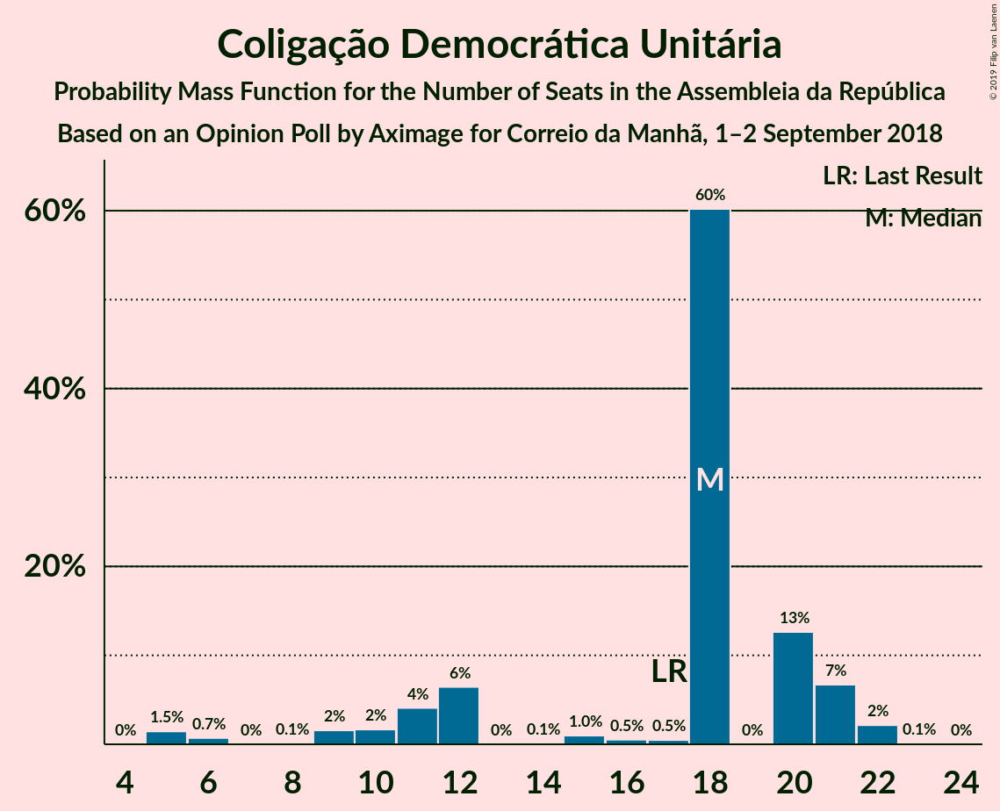

| Number of Seats | Probability | Accumulated | Special Marks |
|:---------------:|:-----------:|:-----------:|:-------------:|
| 5 | 0.2% | 100% |  |
| 6 | 0.1% | 99.8% |  |
| 7 | 0.5% | 99.7% |  |
| 8 | 1.2% | 99.2% |  |
| 9 | 1.1% | 98% |  |
| 10 | 0.4% | 97% |  |
| 11 | 5% | 97% |  |
| 12 | 9% | 92% |  |
| 13 | 7% | 83% |  |
| 14 | 36% | 76% | Median |
| 15 | 0.2% | 40% |  |
| 16 | 1.4% | 40% |  |
| 17 | 28% | 39% | Last Result |
| 18 | 4% | 10% |  |
| 19 | 5% | 7% |  |
| 20 | 1.4% | 2% |  |
| 21 | 0.1% | 0.2% |  |
| 22 | 0% | 0.1% |  |
| 23 | 0% | 0.1% |  |
| 24 | 0% | 0% |  |

## Coalitions

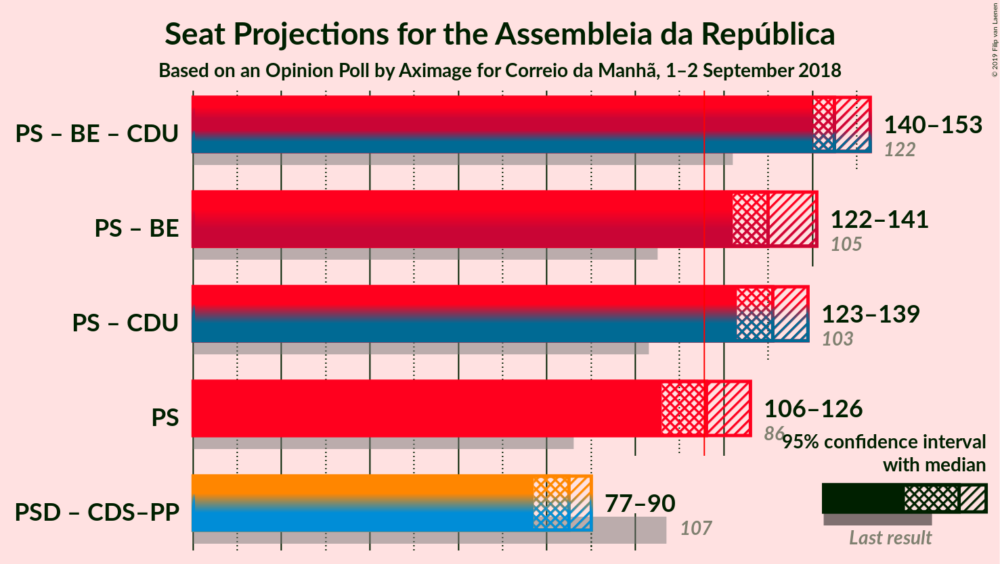

### Confidence Intervals

| Coalition | Last Result | Median | Majority? | 80% Confidence Interval | 90% Confidence Interval | 95% Confidence Interval | 99% Confidence Interval |
|:---------:|:-----------:|:------:|:---------:|:-----------------------:|:-----------------------:|:-----------------------:|:-----------------------:|
| Partido Socialista – Bloco de Esquerda – Coligação Democrática Unitária | 122 | 145 | 100% | 142–152 | 141–153 | 140–153 | 128–155 |
| Partido Socialista – Bloco de Esquerda | 105 | 130 | 99.6% | 123–140 | 123–140 | 122–141 | 117–147 |
| Partido Socialista – Coligação Democrática Unitária | 103 | 131 | 99.1% | 126–137 | 124–138 | 123–139 | 115–141 |
| Partido Socialista | 86 | 116 | 52% | 110–125 | 107–126 | 106–126 | 102–132 |
| Partido Social Democrata – CDS–Partido Popular | 107 | 85 | 0% | 78–88 | 77–89 | 77–90 | 75–102 |

### Partido Socialista – Bloco de Esquerda – Coligação Democrática Unitária

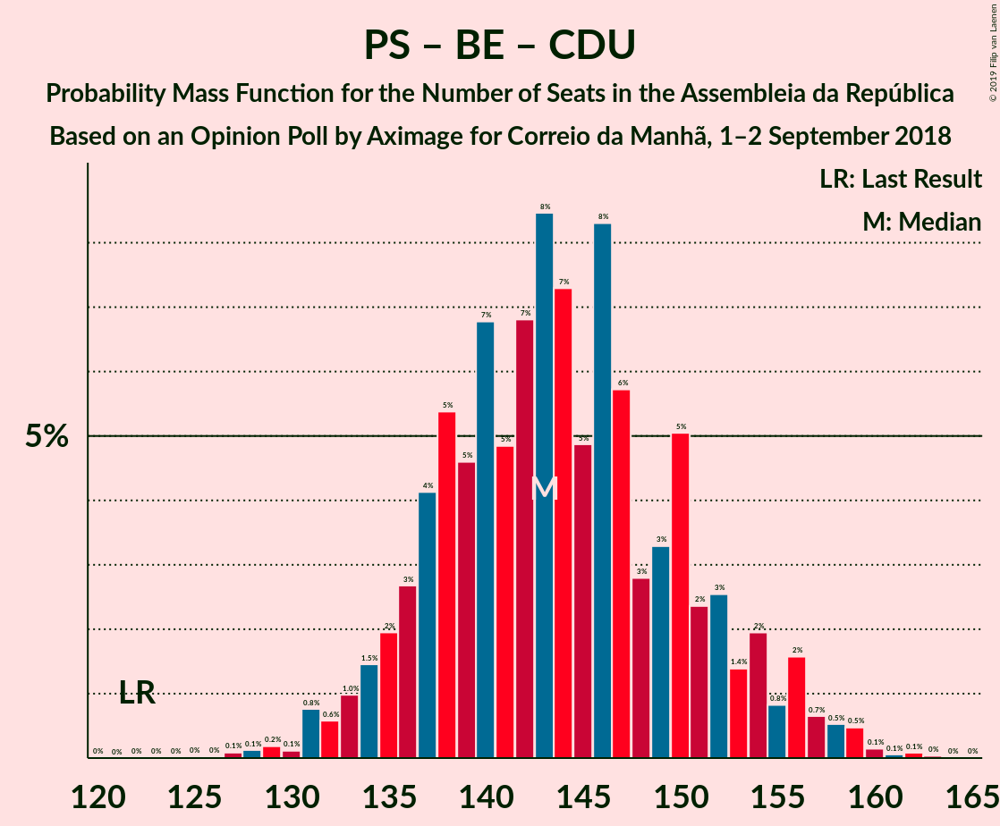

| Number of Seats | Probability | Accumulated | Special Marks |
|:---------------:|:-----------:|:-----------:|:-------------:|
| 122 | 0% | 100% | Last Result |
| 123 | 0.1% | 100% |  |
| 124 | 0% | 99.9% |  |
| 125 | 0.2% | 99.9% |  |
| 126 | 0% | 99.7% |  |
| 127 | 0.1% | 99.6% |  |
| 128 | 0% | 99.5% |  |
| 129 | 0% | 99.5% |  |
| 130 | 0.5% | 99.5% |  |
| 131 | 0% | 99.0% |  |
| 132 | 0.1% | 99.0% |  |
| 133 | 0.1% | 98.9% |  |
| 134 | 0.1% | 98.7% |  |
| 135 | 0% | 98.6% |  |
| 136 | 0% | 98.6% |  |
| 137 | 0.3% | 98.6% |  |
| 138 | 0.7% | 98% |  |
| 139 | 0% | 98% |  |
| 140 | 1.0% | 98% |  |
| 141 | 4% | 97% |  |
| 142 | 8% | 93% |  |
| 143 | 16% | 85% |  |
| 144 | 15% | 69% | Median |
| 145 | 23% | 54% |  |
| 146 | 11% | 31% |  |
| 147 | 0.8% | 20% |  |
| 148 | 1.0% | 19% |  |
| 149 | 2% | 18% |  |
| 150 | 1.1% | 17% |  |
| 151 | 3% | 16% |  |
| 152 | 6% | 13% |  |
| 153 | 6% | 7% |  |
| 154 | 0.1% | 0.8% |  |
| 155 | 0.2% | 0.7% |  |
| 156 | 0.3% | 0.5% |  |
| 157 | 0% | 0.2% |  |
| 158 | 0% | 0.2% |  |
| 159 | 0.1% | 0.2% |  |
| 160 | 0% | 0.1% |  |
| 161 | 0% | 0.1% |  |
| 162 | 0% | 0.1% |  |
| 163 | 0% | 0% |  |

### Partido Socialista – Bloco de Esquerda

| Number of Seats | Probability | Accumulated | Special Marks |
|:---------------:|:-----------:|:-----------:|:-------------:|
| 105 | 0% | 100% | Last Result |
| 106 | 0% | 100% |  |
| 107 | 0% | 100% |  |
| 108 | 0% | 100% |  |
| 109 | 0% | 100% |  |
| 110 | 0% | 100% |  |
| 111 | 0.1% | 100% |  |
| 112 | 0% | 99.9% |  |
| 113 | 0% | 99.9% |  |
| 114 | 0% | 99.9% |  |
| 115 | 0.3% | 99.8% |  |
| 116 | 0% | 99.6% | Majority |
| 117 | 0.3% | 99.6% |  |
| 118 | 0.1% | 99.2% |  |
| 119 | 0.1% | 99.1% |  |
| 120 | 0.7% | 99.0% |  |
| 121 | 0.6% | 98% |  |
| 122 | 0.4% | 98% |  |
| 123 | 8% | 97% |  |
| 124 | 2% | 89% |  |
| 125 | 3% | 87% |  |
| 126 | 16% | 84% |  |
| 127 | 3% | 68% |  |
| 128 | 2% | 65% |  |
| 129 | 3% | 63% |  |
| 130 | 11% | 60% | Median |
| 131 | 18% | 49% |  |
| 132 | 11% | 31% |  |
| 133 | 0.7% | 20% |  |
| 134 | 0.1% | 19% |  |
| 135 | 0.1% | 19% |  |
| 136 | 0.3% | 19% |  |
| 137 | 0.7% | 19% |  |
| 138 | 0.9% | 18% |  |
| 139 | 1.3% | 17% |  |
| 140 | 11% | 16% |  |
| 141 | 3% | 5% |  |
| 142 | 0.2% | 2% |  |
| 143 | 0.5% | 1.4% |  |
| 144 | 0.2% | 0.9% |  |
| 145 | 0.2% | 0.7% |  |
| 146 | 0% | 0.6% |  |
| 147 | 0% | 0.5% |  |
| 148 | 0.2% | 0.5% |  |
| 149 | 0.2% | 0.3% |  |
| 150 | 0.1% | 0.1% |  |
| 151 | 0% | 0% |  |

### Partido Socialista – Coligação Democrática Unitária

| Number of Seats | Probability | Accumulated | Special Marks |
|:---------------:|:-----------:|:-----------:|:-------------:|
| 103 | 0% | 100% | Last Result |
| 104 | 0% | 100% |  |
| 105 | 0% | 100% |  |
| 106 | 0% | 100% |  |
| 107 | 0% | 100% |  |
| 108 | 0% | 100% |  |
| 109 | 0.1% | 100% |  |
| 110 | 0.2% | 99.9% |  |
| 111 | 0% | 99.7% |  |
| 112 | 0% | 99.7% |  |
| 113 | 0% | 99.6% |  |
| 114 | 0% | 99.6% |  |
| 115 | 0.5% | 99.6% |  |
| 116 | 0% | 99.1% | Majority |
| 117 | 0% | 99.0% |  |
| 118 | 0.1% | 99.0% |  |
| 119 | 0.2% | 99.0% |  |
| 120 | 0.7% | 98.8% |  |
| 121 | 0% | 98% |  |
| 122 | 0.4% | 98% |  |
| 123 | 1.1% | 98% |  |
| 124 | 3% | 97% |  |
| 125 | 2% | 93% |  |
| 126 | 2% | 91% |  |
| 127 | 8% | 89% |  |
| 128 | 4% | 81% |  |
| 129 | 20% | 77% |  |
| 130 | 6% | 57% | Median |
| 131 | 30% | 51% |  |
| 132 | 3% | 21% |  |
| 133 | 4% | 18% |  |
| 134 | 0.9% | 15% |  |
| 135 | 0.5% | 14% |  |
| 136 | 0.1% | 13% |  |
| 137 | 6% | 13% |  |
| 138 | 3% | 7% |  |
| 139 | 3% | 4% |  |
| 140 | 0.3% | 0.8% |  |
| 141 | 0.3% | 0.5% |  |
| 142 | 0% | 0.2% |  |
| 143 | 0.1% | 0.2% |  |
| 144 | 0% | 0.1% |  |
| 145 | 0.1% | 0.1% |  |
| 146 | 0% | 0% |  |

### Partido Socialista

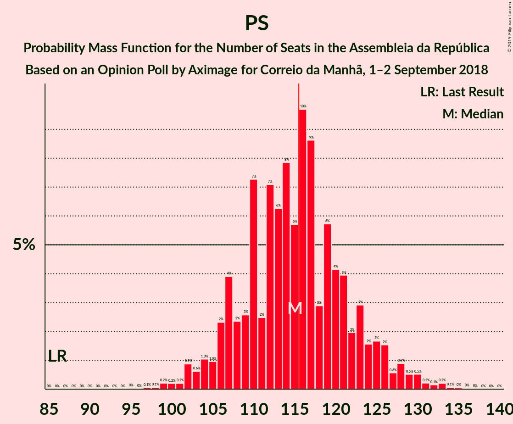

| Number of Seats | Probability | Accumulated | Special Marks |
|:---------------:|:-----------:|:-----------:|:-------------:|
| 86 | 0% | 100% | Last Result |
| 87 | 0% | 100% |  |
| 88 | 0% | 100% |  |
| 89 | 0% | 100% |  |
| 90 | 0% | 100% |  |
| 91 | 0% | 100% |  |
| 92 | 0% | 100% |  |
| 93 | 0% | 100% |  |
| 94 | 0% | 100% |  |
| 95 | 0% | 100% |  |
| 96 | 0% | 100% |  |
| 97 | 0.1% | 100% |  |
| 98 | 0% | 99.9% |  |
| 99 | 0% | 99.8% |  |
| 100 | 0.2% | 99.8% |  |
| 101 | 0% | 99.6% |  |
| 102 | 0.7% | 99.6% |  |
| 103 | 0.1% | 98.9% |  |
| 104 | 0% | 98.8% |  |
| 105 | 0.6% | 98.8% |  |
| 106 | 2% | 98% |  |
| 107 | 3% | 97% |  |
| 108 | 0.3% | 93% |  |
| 109 | 0.5% | 93% |  |
| 110 | 7% | 93% |  |
| 111 | 1.3% | 86% |  |
| 112 | 17% | 85% |  |
| 113 | 13% | 68% |  |
| 114 | 0.8% | 55% |  |
| 115 | 2% | 54% |  |
| 116 | 3% | 52% | Median, Majority |
| 117 | 30% | 49% |  |
| 118 | 3% | 20% |  |
| 119 | 2% | 17% |  |
| 120 | 1.3% | 15% |  |
| 121 | 0.4% | 14% |  |
| 122 | 0.3% | 14% |  |
| 123 | 0% | 13% |  |
| 124 | 0.5% | 13% |  |
| 125 | 6% | 13% |  |
| 126 | 6% | 7% |  |
| 127 | 0% | 0.7% |  |
| 128 | 0% | 0.7% |  |
| 129 | 0% | 0.6% |  |
| 130 | 0% | 0.6% |  |
| 131 | 0% | 0.6% |  |
| 132 | 0% | 0.5% |  |
| 133 | 0.2% | 0.5% |  |
| 134 | 0.2% | 0.3% |  |
| 135 | 0% | 0.1% |  |
| 136 | 0% | 0% |  |

### Partido Social Democrata – CDS–Partido Popular

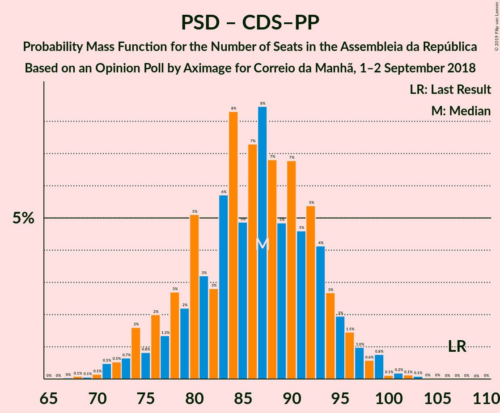

| Number of Seats | Probability | Accumulated | Special Marks |
|:---------------:|:-----------:|:-----------:|:-------------:|
| 68 | 0% | 100% |  |
| 69 | 0% | 99.9% |  |
| 70 | 0% | 99.9% |  |
| 71 | 0.1% | 99.9% |  |
| 72 | 0% | 99.8% |  |
| 73 | 0% | 99.8% |  |
| 74 | 0.3% | 99.8% |  |
| 75 | 0.2% | 99.5% |  |
| 76 | 0.1% | 99.3% |  |
| 77 | 6% | 99.2% |  |
| 78 | 7% | 93% |  |
| 79 | 2% | 86% |  |
| 80 | 1.1% | 84% |  |
| 81 | 2% | 83% |  |
| 82 | 1.0% | 82% |  |
| 83 | 0.8% | 81% |  |
| 84 | 11% | 80% |  |
| 85 | 23% | 69% | Median |
| 86 | 15% | 46% |  |
| 87 | 16% | 31% |  |
| 88 | 8% | 15% |  |
| 89 | 4% | 7% |  |
| 90 | 1.0% | 3% |  |
| 91 | 0% | 2% |  |
| 92 | 0.7% | 2% |  |
| 93 | 0.3% | 2% |  |
| 94 | 0% | 1.4% |  |
| 95 | 0% | 1.4% |  |
| 96 | 0.1% | 1.4% |  |
| 97 | 0.1% | 1.3% |  |
| 98 | 0.1% | 1.1% |  |
| 99 | 0% | 1.0% |  |
| 100 | 0.5% | 1.0% |  |
| 101 | 0% | 0.5% |  |
| 102 | 0% | 0.5% |  |
| 103 | 0.1% | 0.5% |  |
| 104 | 0% | 0.4% |  |
| 105 | 0.2% | 0.3% |  |
| 106 | 0% | 0.1% |  |
| 107 | 0.1% | 0.1% | Last Result |
| 108 | 0% | 0% |  |

## Technical Information

### Opinion Poll

+ **Polling firm:** Aximage
+ **Commissioner(s):** Correio da Manhã
+ **Fieldwork period:** 1–2 September 2018

### Calculations

+ **Sample size:** 603
+ **Simulations done:** 8,192
+ **Error estimate:** 2.93%

