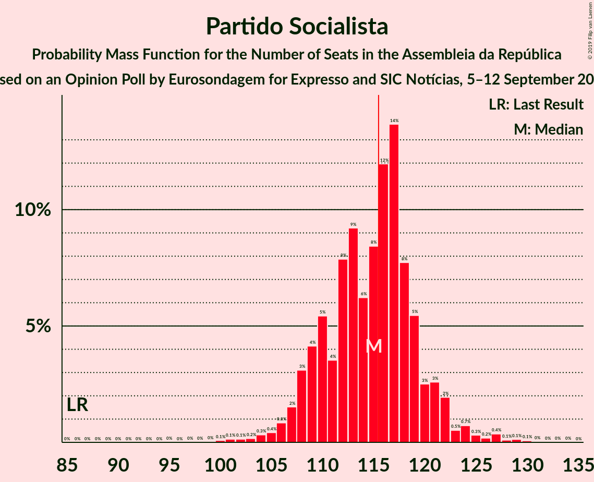

# Opinion Poll by Eurosondagem for Expresso and SIC, 5–12 September 2018

<a href="#voting-intentions">Voting Intentions</a> | <a href="#seats">Seats</a> | <a href="#coalitions">Coalitions</a> | <a href="#technical-information">Technical Information</a>

## Voting Intentions

### Confidence Intervals

| Party | Last Result | Poll Result | 80% Confidence Interval | 90% Confidence Interval | 95% Confidence Interval | 99% Confidence Interval |
|:-----:|:-----------:|:-----------:|:-----------------------:|:-----------------------:|:-----------------------:|:-----------------------:|
| Partido Socialista | 32.3% | 41.4% | 39.4–43.4% |38.8–44.0% |38.4–44.4% |37.4–45.4% |
| Partido Social Democrata | 36.9% | 27.5% | 25.7–29.3% |25.2–29.9% |24.8–30.3% |24.0–31.2% |
| Bloco de Esquerda | 10.2% | 8.0% | 7.0–9.2% |6.8–9.6% |6.5–9.9% |6.1–10.5% |
| CDS–Partido Popular | 36.9% | 7.7% | 6.8–8.9% |6.5–9.3% |6.2–9.6% |5.8–10.2% |
| Coligação Democrática Unitária | 8.2% | 6.9% | 6.0–8.1% |5.7–8.4% |5.5–8.7% |5.1–9.3% |
| Pessoas–Animais–Natureza | 1.4% | 1.1% | 0.8–1.6% |0.7–1.8% |0.6–2.0% |0.5–2.3% |

*Note:* The poll result column reflects the actual value used in the calculations. Published results may vary slightly, and in addition be rounded to fewer digits.

## Seats

### Confidence Intervals

| Party | Last Result | Median | 80% Confidence Interval | 90% Confidence Interval | 95% Confidence Interval | 99% Confidence Interval |
|:-----:|:-----------:|:------:|:-----------------------:|:-----------------------:|:-----------------------:|:-----------------------:|
| <a href="#partido-socialista">Partido Socialista</a> | 86 | 110 | 102–115 |102–119 |101–125 |101–127 |
| <a href="#partido-social-democrata">Partido Social Democrata</a> | 89 | 75 | 75–80 |74–80 |74–80 |60–80 |
| <a href="#bloco-de-esquerda">Bloco de Esquerda</a> | 19 | 12 | 10–18 |10–20 |10–20 |9–20 |
| <a href="#cds–partido-popular">CDS–Partido Popular</a> | 18 | 18 | 10–19 |10–19 |7–19 |6–19 |
| <a href="#coligação-democrática-unitária">Coligação Democrática Unitária</a> | 17 | 14 | 9–17 |8–17 |8–17 |7–17 |
| <a href="#pessoas–animais–natureza">Pessoas–Animais–Natureza</a> | 1 | 1 | 0–1 |0–1 |0–1 |0–1 |

### Partido Socialista

*For a full overview of the results for this party, see the [Partido Socialista](party-partidosocialista.html) page.*

| Number of Seats | Probability | Accumulated | Special Marks |
|:---------------:|:-----------:|:-----------:|:-------------:|
| 86 | 0% | 100% | Last Result |
| 87 | 0% | 100% |  |
| 88 | 0% | 100% |  |
| 89 | 0% | 100% |  |
| 90 | 0% | 100% |  |
| 91 | 0% | 100% |  |
| 92 | 0% | 100% |  |
| 93 | 0% | 100% |  |
| 94 | 0% | 100% |  |
| 95 | 0% | 100% |  |
| 96 | 0% | 100% |  |
| 97 | 0% | 100% |  |
| 98 | 0% | 100% |  |
| 99 | 0% | 100% |  |
| 100 | 0% | 100% |  |
| 101 | 2% | 100% |  |
| 102 | 12% | 97% |  |
| 103 | 0% | 85% |  |
| 104 | 0% | 85% |  |
| 105 | 0% | 85% |  |
| 106 | 0% | 85% |  |
| 107 | 6% | 85% |  |
| 108 | 2% | 79% |  |
| 109 | 0% | 78% |  |
| 110 | 62% | 78% | Median |
| 111 | 1.1% | 15% |  |
| 112 | 0% | 14% |  |
| 113 | 0.5% | 14% |  |
| 114 | 0% | 14% |  |
| 115 | 8% | 14% |  |
| 116 | 0.1% | 6% | Majority |
| 117 | 0% | 6% |  |
| 118 | 0.6% | 6% |  |
| 119 | 2% | 5% |  |
| 120 | 0.7% | 4% |  |
| 121 | 0.3% | 3% |  |
| 122 | 0% | 3% |  |
| 123 | 0% | 3% |  |
| 124 | 0% | 3% |  |
| 125 | 0.1% | 3% |  |
| 126 | 2% | 2% |  |
| 127 | 0.3% | 0.5% |  |
| 128 | 0.1% | 0.2% |  |
| 129 | 0% | 0.1% |  |
| 130 | 0% | 0.1% |  |
| 131 | 0% | 0.1% |  |
| 132 | 0% | 0.1% |  |
| 133 | 0% | 0.1% |  |
| 134 | 0.1% | 0.1% |  |
| 135 | 0% | 0% |  |

### Partido Social Democrata

*For a full overview of the results for this party, see the [Partido Social Democrata](party-partidosocialdemocrata.html) page.*

| Number of Seats | Probability | Accumulated | Special Marks |
|:---------------:|:-----------:|:-----------:|:-------------:|
| 60 | 0.7% | 100% |  |
| 61 | 0.1% | 99.3% |  |
| 62 | 0.5% | 99.2% |  |
| 63 | 0% | 98.7% |  |
| 64 | 0.1% | 98.7% |  |
| 65 | 0% | 98.7% |  |
| 66 | 0% | 98.6% |  |
| 67 | 0% | 98.6% |  |
| 68 | 0% | 98.6% |  |
| 69 | 0.2% | 98.6% |  |
| 70 | 0% | 98% |  |
| 71 | 0.3% | 98% |  |
| 72 | 0% | 98% |  |
| 73 | 0% | 98% |  |
| 74 | 4% | 98% |  |
| 75 | 59% | 94% | Median |
| 76 | 2% | 36% |  |
| 77 | 6% | 34% |  |
| 78 | 0% | 28% |  |
| 79 | 11% | 28% |  |
| 80 | 17% | 17% |  |
| 81 | 0% | 0.1% |  |
| 82 | 0% | 0.1% |  |
| 83 | 0% | 0.1% |  |
| 84 | 0% | 0.1% |  |
| 85 | 0% | 0.1% |  |
| 86 | 0.1% | 0.1% |  |
| 87 | 0% | 0% |  |
| 88 | 0% | 0% |  |
| 89 | 0% | 0% | Last Result |

### Bloco de Esquerda

*For a full overview of the results for this party, see the [Bloco de Esquerda](party-blocodeesquerda.html) page.*

| Number of Seats | Probability | Accumulated | Special Marks |
|:---------------:|:-----------:|:-----------:|:-------------:|
| 9 | 2% | 100% |  |
| 10 | 11% | 98% |  |
| 11 | 0.6% | 87% |  |
| 12 | 51% | 86% | Median |
| 13 | 2% | 36% |  |
| 14 | 3% | 34% |  |
| 15 | 0.1% | 31% |  |
| 16 | 14% | 31% |  |
| 17 | 3% | 17% |  |
| 18 | 6% | 14% |  |
| 19 | 1.2% | 8% | Last Result |
| 20 | 6% | 6% |  |
| 21 | 0% | 0.4% |  |
| 22 | 0.2% | 0.4% |  |
| 23 | 0.1% | 0.2% |  |
| 24 | 0% | 0.1% |  |
| 25 | 0% | 0% |  |

### CDS–Partido Popular

*For a full overview of the results for this party, see the [CDS–Partido Popular](party-cds–partidopopular.html) page.*

| Number of Seats | Probability | Accumulated | Special Marks |
|:---------------:|:-----------:|:-----------:|:-------------:|
| 6 | 2% | 100% |  |
| 7 | 2% | 98% |  |
| 8 | 0.5% | 96% |  |
| 9 | 0% | 96% |  |
| 10 | 8% | 96% |  |
| 11 | 0% | 88% |  |
| 12 | 6% | 88% |  |
| 13 | 2% | 82% |  |
| 14 | 11% | 80% |  |
| 15 | 0% | 69% |  |
| 16 | 15% | 69% |  |
| 17 | 0.3% | 54% |  |
| 18 | 18% | 53% | Last Result, Median |
| 19 | 35% | 35% |  |
| 20 | 0% | 0.1% |  |
| 21 | 0% | 0.1% |  |
| 22 | 0.1% | 0.1% |  |
| 23 | 0% | 0% |  |

### Coligação Democrática Unitária

*For a full overview of the results for this party, see the [Coligação Democrática Unitária](party-coligaçãodemocráticaunitária.html) page.*

| Number of Seats | Probability | Accumulated | Special Marks |
|:---------------:|:-----------:|:-----------:|:-------------:|
| 5 | 0.1% | 100% |  |
| 6 | 0.4% | 99.9% |  |
| 7 | 0% | 99.5% |  |
| 8 | 6% | 99.5% |  |
| 9 | 4% | 93% |  |
| 10 | 0% | 89% |  |
| 11 | 0.2% | 89% |  |
| 12 | 0.1% | 89% |  |
| 13 | 35% | 89% |  |
| 14 | 18% | 54% | Median |
| 15 | 0% | 36% |  |
| 16 | 15% | 36% |  |
| 17 | 21% | 21% | Last Result |
| 18 | 0% | 0.3% |  |
| 19 | 0% | 0.3% |  |
| 20 | 0.3% | 0.3% |  |
| 21 | 0% | 0% |  |

### Pessoas–Animais–Natureza

*For a full overview of the results for this party, see the [Pessoas–Animais–Natureza](party-pessoas–animais–natureza.html) page.*

| Number of Seats | Probability | Accumulated | Special Marks |
|:---------------:|:-----------:|:-----------:|:-------------:|
| 0 | 39% | 100% |  |
| 1 | 61% | 61% | Last Result, Median |
| 2 | 0.1% | 0.2% |  |
| 3 | 0.1% | 0.1% |  |
| 4 | 0% | 0% |  |

## Coalitions

### Confidence Intervals

| Coalition | Last Result | Median | Majority? | 80% Confidence Interval | 90% Confidence Interval | 95% Confidence Interval | 99% Confidence Interval |
|:---------:|:-----------:|:------:|:---------:|:-----------------------:|:-----------------------:|:-----------------------:|:-----------------------:|
| Partido Socialista – Bloco de Esquerda – Coligação Democrática Unitária | 122 | 136 | 100% | 134–144 | 134–148 | 134–149 | 134–151 |
| Partido Socialista – Bloco de Esquerda | 105 | 122 | 100% | 118–131 | 118–133 | 118–140 | 118–140 |
| Partido Socialista – Coligação Democrática Unitária | 103 | 123 | 99.6% | 118–127 | 118–132 | 117–135 | 117–139 |
| Partido Socialista | 86 | 110 | 6% | 102–115 | 102–119 | 101–125 | 101–127 |
| Partido Social Democrata – CDS–Partido Popular | 107 | 93 | 0% | 85–96 | 82–96 | 81–96 | 78–96 |

### Partido Socialista – Bloco de Esquerda – Coligação Democrática Unitária

| Number of Seats | Probability | Accumulated | Special Marks |
|:---------------:|:-----------:|:-----------:|:-------------:|
| 122 | 0% | 100% | Last Result |
| 123 | 0% | 100% |  |
| 124 | 0% | 100% |  |
| 125 | 0% | 100% |  |
| 126 | 0% | 100% |  |
| 127 | 0% | 100% |  |
| 128 | 0% | 100% |  |
| 129 | 0% | 100% |  |
| 130 | 0% | 100% |  |
| 131 | 0% | 100% |  |
| 132 | 0% | 100% |  |
| 133 | 0.1% | 100% |  |
| 134 | 15% | 99.9% |  |
| 135 | 33% | 85% |  |
| 136 | 20% | 52% | Median |
| 137 | 12% | 32% |  |
| 138 | 0.6% | 20% |  |
| 139 | 0% | 19% |  |
| 140 | 0% | 19% |  |
| 141 | 6% | 19% |  |
| 142 | 0.2% | 13% |  |
| 143 | 0.1% | 13% |  |
| 144 | 7% | 13% |  |
| 145 | 0% | 6% |  |
| 146 | 0.1% | 6% |  |
| 147 | 0.5% | 6% |  |
| 148 | 2% | 5% |  |
| 149 | 2% | 4% |  |
| 150 | 0% | 1.3% |  |
| 151 | 1.0% | 1.3% |  |
| 152 | 0% | 0.3% |  |
| 153 | 0% | 0.3% |  |
| 154 | 0% | 0.3% |  |
| 155 | 0% | 0.3% |  |
| 156 | 0.1% | 0.3% |  |
| 157 | 0% | 0.2% |  |
| 158 | 0.2% | 0.2% |  |
| 159 | 0.1% | 0.1% |  |
| 160 | 0% | 0% |  |

### Partido Socialista – Bloco de Esquerda

| Number of Seats | Probability | Accumulated | Special Marks |
|:---------------:|:-----------:|:-----------:|:-------------:|
| 105 | 0% | 100% | Last Result |
| 106 | 0% | 100% |  |
| 107 | 0% | 100% |  |
| 108 | 0% | 100% |  |
| 109 | 0% | 100% |  |
| 110 | 0% | 100% |  |
| 111 | 0% | 100% |  |
| 112 | 0% | 100% |  |
| 113 | 0% | 100% |  |
| 114 | 0% | 100% |  |
| 115 | 0% | 100% |  |
| 116 | 0% | 100% | Majority |
| 117 | 0% | 100% |  |
| 118 | 15% | 100% |  |
| 119 | 0% | 85% |  |
| 120 | 10% | 85% |  |
| 121 | 0.5% | 75% |  |
| 122 | 51% | 74% | Median |
| 123 | 1.4% | 23% |  |
| 124 | 0% | 22% |  |
| 125 | 0% | 22% |  |
| 126 | 0% | 22% |  |
| 127 | 8% | 22% |  |
| 128 | 1.3% | 14% |  |
| 129 | 0.3% | 13% |  |
| 130 | 0.7% | 12% |  |
| 131 | 2% | 12% |  |
| 132 | 0% | 10% |  |
| 133 | 6% | 10% |  |
| 134 | 1.0% | 4% |  |
| 135 | 0% | 3% |  |
| 136 | 0% | 3% |  |
| 137 | 0% | 3% |  |
| 138 | 0% | 3% |  |
| 139 | 0% | 3% |  |
| 140 | 2% | 3% |  |
| 141 | 0% | 0.4% |  |
| 142 | 0% | 0.4% |  |
| 143 | 0.1% | 0.3% |  |
| 144 | 0% | 0.2% |  |
| 145 | 0.2% | 0.2% |  |
| 146 | 0.1% | 0.1% |  |
| 147 | 0% | 0% |  |

### Partido Socialista – Coligação Democrática Unitária

| Number of Seats | Probability | Accumulated | Special Marks |
|:---------------:|:-----------:|:-----------:|:-------------:|
| 103 | 0% | 100% | Last Result |
| 104 | 0% | 100% |  |
| 105 | 0% | 100% |  |
| 106 | 0% | 100% |  |
| 107 | 0% | 100% |  |
| 108 | 0% | 100% |  |
| 109 | 0% | 100% |  |
| 110 | 0% | 100% |  |
| 111 | 0% | 100% |  |
| 112 | 0% | 100% |  |
| 113 | 0% | 100% |  |
| 114 | 0.3% | 100% |  |
| 115 | 0% | 99.7% |  |
| 116 | 0% | 99.6% | Majority |
| 117 | 2% | 99.6% |  |
| 118 | 12% | 97% |  |
| 119 | 0.1% | 85% |  |
| 120 | 0% | 85% |  |
| 121 | 0.1% | 85% |  |
| 122 | 0% | 85% |  |
| 123 | 41% | 85% |  |
| 124 | 23% | 44% | Median |
| 125 | 2% | 21% |  |
| 126 | 0% | 19% |  |
| 127 | 11% | 19% |  |
| 128 | 2% | 8% |  |
| 129 | 0% | 6% |  |
| 130 | 0.6% | 6% |  |
| 131 | 0.1% | 5% |  |
| 132 | 2% | 5% |  |
| 133 | 0% | 4% |  |
| 134 | 0% | 4% |  |
| 135 | 2% | 4% |  |
| 136 | 0.2% | 2% |  |
| 137 | 0.7% | 2% |  |
| 138 | 0.2% | 0.9% |  |
| 139 | 0.3% | 0.6% |  |
| 140 | 0.2% | 0.3% |  |
| 141 | 0.1% | 0.2% |  |
| 142 | 0% | 0.1% |  |
| 143 | 0% | 0.1% |  |
| 144 | 0% | 0.1% |  |
| 145 | 0% | 0.1% |  |
| 146 | 0% | 0.1% |  |
| 147 | 0.1% | 0.1% |  |
| 148 | 0% | 0% |  |

### Partido Socialista

| Number of Seats | Probability | Accumulated | Special Marks |
|:---------------:|:-----------:|:-----------:|:-------------:|
| 86 | 0% | 100% | Last Result |
| 87 | 0% | 100% |  |
| 88 | 0% | 100% |  |
| 89 | 0% | 100% |  |
| 90 | 0% | 100% |  |
| 91 | 0% | 100% |  |
| 92 | 0% | 100% |  |
| 93 | 0% | 100% |  |
| 94 | 0% | 100% |  |
| 95 | 0% | 100% |  |
| 96 | 0% | 100% |  |
| 97 | 0% | 100% |  |
| 98 | 0% | 100% |  |
| 99 | 0% | 100% |  |
| 100 | 0% | 100% |  |
| 101 | 2% | 100% |  |
| 102 | 12% | 97% |  |
| 103 | 0% | 85% |  |
| 104 | 0% | 85% |  |
| 105 | 0% | 85% |  |
| 106 | 0% | 85% |  |
| 107 | 6% | 85% |  |
| 108 | 2% | 79% |  |
| 109 | 0% | 78% |  |
| 110 | 62% | 78% | Median |
| 111 | 1.1% | 15% |  |
| 112 | 0% | 14% |  |
| 113 | 0.5% | 14% |  |
| 114 | 0% | 14% |  |
| 115 | 8% | 14% |  |
| 116 | 0.1% | 6% | Majority |
| 117 | 0% | 6% |  |
| 118 | 0.6% | 6% |  |
| 119 | 2% | 5% |  |
| 120 | 0.7% | 4% |  |
| 121 | 0.3% | 3% |  |
| 122 | 0% | 3% |  |
| 123 | 0% | 3% |  |
| 124 | 0% | 3% |  |
| 125 | 0.1% | 3% |  |
| 126 | 2% | 2% |  |
| 127 | 0.3% | 0.5% |  |
| 128 | 0.1% | 0.2% |  |
| 129 | 0% | 0.1% |  |
| 130 | 0% | 0.1% |  |
| 131 | 0% | 0.1% |  |
| 132 | 0% | 0.1% |  |
| 133 | 0% | 0.1% |  |
| 134 | 0.1% | 0.1% |  |
| 135 | 0% | 0% |  |

### Partido Social Democrata – CDS–Partido Popular

| Number of Seats | Probability | Accumulated | Special Marks |
|:---------------:|:-----------:|:-----------:|:-------------:|
| 71 | 0.1% | 100% |  |
| 72 | 0.2% | 99.9% |  |
| 73 | 0% | 99.8% |  |
| 74 | 0.1% | 99.8% |  |
| 75 | 0% | 99.7% |  |
| 76 | 0% | 99.7% |  |
| 77 | 0% | 99.7% |  |
| 78 | 1.0% | 99.7% |  |
| 79 | 0% | 98.7% |  |
| 80 | 0% | 98.7% |  |
| 81 | 2% | 98.7% |  |
| 82 | 2% | 96% |  |
| 83 | 0.5% | 95% |  |
| 84 | 0.1% | 94% |  |
| 85 | 7% | 94% |  |
| 86 | 0% | 87% |  |
| 87 | 0% | 87% |  |
| 88 | 0.2% | 87% |  |
| 89 | 6% | 87% |  |
| 90 | 0% | 81% |  |
| 91 | 0% | 81% |  |
| 92 | 0.5% | 81% |  |
| 93 | 31% | 80% | Median |
| 94 | 34% | 49% |  |
| 95 | 0% | 15% |  |
| 96 | 15% | 15% |  |
| 97 | 0% | 0.1% |  |
| 98 | 0% | 0% |  |
| 99 | 0% | 0% |  |
| 100 | 0% | 0% |  |
| 101 | 0% | 0% |  |
| 102 | 0% | 0% |  |
| 103 | 0% | 0% |  |
| 104 | 0% | 0% |  |
| 105 | 0% | 0% |  |
| 106 | 0% | 0% |  |
| 107 | 0% | 0% | Last Result |

## Technical Information

### Opinion Poll

+ **Polling firm:** Eurosondagem
+ **Commissioner(s):** Expresso and SIC
+ **Fieldwork period:** 5–12 September 2018

### Calculations

+ **Sample size:** 1008
+ **Simulations done:** 1,024
+ **Error estimate:** 2.97%

