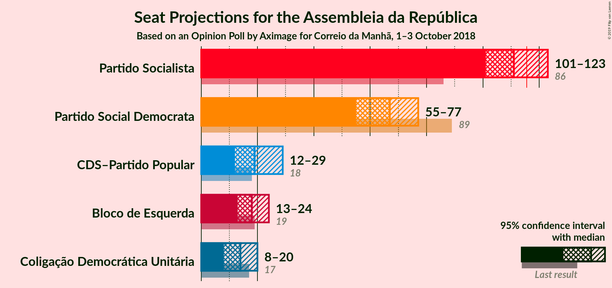
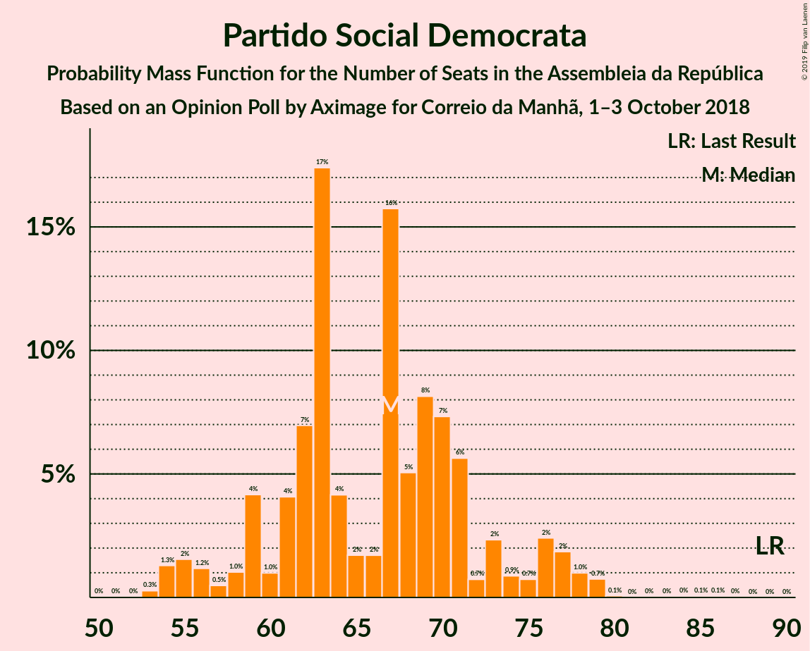
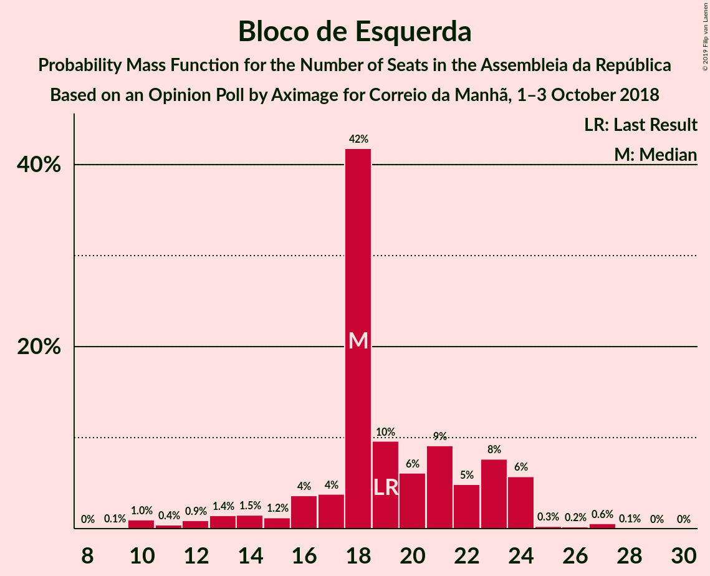

# Opinion Poll by Aximage for Correio da Manhã, 1–3 October 2018

<a href="#voting-intentions">Voting Intentions</a> | <a href="#seats">Seats</a> | <a href="#coalitions">Coalitions</a> | <a href="#technical-information">Technical Information</a>

## Voting Intentions

### Confidence Intervals

| Party | Last Result | Poll Result | 80% Confidence Interval | 90% Confidence Interval | 95% Confidence Interval | 99% Confidence Interval |
|:-----:|:-----------:|:-----------:|:-----------------------:|:-----------------------:|:-----------------------:|:-----------------------:|
| Partido Socialista | 32.3% | 38.9% | 36.4–41.5% |35.7–42.3% |35.1–42.9% |33.9–44.2% |
| Partido Social Democrata | 36.9% | 24.0% | 21.8–26.3% |21.2–27.0% |20.7–27.5% |19.7–28.7% |
| Bloco de Esquerda | 10.2% | 9.2% | 7.8–10.8% |7.4–11.3% |7.1–11.7% |6.5–12.6% |
| CDS–Partido Popular | 36.9% | 9.2% | 7.8–10.8% |7.4–11.3% |7.1–11.7% |6.5–12.6% |
| Coligação Democrática Unitária | 8.2% | 7.3% | 6.1–8.9% |5.8–9.3% |5.5–9.7% |5.0–10.5% |

*Note:* The poll result column reflects the actual value used in the calculations. Published results may vary slightly, and in addition be rounded to fewer digits.

## Seats

### Confidence Intervals

| Party | Last Result | Median | 80% Confidence Interval | 90% Confidence Interval | 95% Confidence Interval | 99% Confidence Interval |
|:-----:|:-----------:|:------:|:-----------------------:|:-----------------------:|:-----------------------:|:-----------------------:|
| <a href="#partido-socialista">Partido Socialista</a> | 86 | 116 | 113–118 |113–119 |113–120 |113–120 |
| <a href="#partido-social-democrata">Partido Social Democrata</a> | 89 | 67 | 64–68 |64–68 |54–68 |52–68 |
| <a href="#bloco-de-esquerda">Bloco de Esquerda</a> | 19 | 24 | 16–24 |16–24 |16–24 |11–24 |
| <a href="#cds–partido-popular">CDS–Partido Popular</a> | 18 | 12 | 11–16 |11–18 |11–23 |11–29 |
| <a href="#coligação-democrática-unitária">Coligação Democrática Unitária</a> | 17 | 13 | 13–18 |13–18 |13–18 |5–19 |

### Partido Socialista

*For a full overview of the results for this party, see the [Partido Socialista](party-partidosocialista.html) page.*

| Number of Seats | Probability | Accumulated | Special Marks |
|:---------------:|:-----------:|:-----------:|:-------------:|
| 86 | 0% | 100% | Last Result |
| 87 | 0% | 100% |  |
| 88 | 0% | 100% |  |
| 89 | 0% | 100% |  |
| 90 | 0% | 100% |  |
| 91 | 0% | 100% |  |
| 92 | 0% | 100% |  |
| 93 | 0% | 100% |  |
| 94 | 0% | 100% |  |
| 95 | 0% | 100% |  |
| 96 | 0% | 100% |  |
| 97 | 0% | 100% |  |
| 98 | 0% | 100% |  |
| 99 | 0% | 100% |  |
| 100 | 0% | 100% |  |
| 101 | 0% | 100% |  |
| 102 | 0% | 100% |  |
| 103 | 0% | 100% |  |
| 104 | 0% | 100% |  |
| 105 | 0% | 100% |  |
| 106 | 0% | 100% |  |
| 107 | 0% | 100% |  |
| 108 | 0% | 100% |  |
| 109 | 0% | 100% |  |
| 110 | 0% | 100% |  |
| 111 | 0% | 100% |  |
| 112 | 0% | 100% |  |
| 113 | 10% | 100% |  |
| 114 | 8% | 90% |  |
| 115 | 31% | 82% |  |
| 116 | 29% | 50% | Median, Majority |
| 117 | 8% | 21% |  |
| 118 | 8% | 13% |  |
| 119 | 2% | 5% |  |
| 120 | 3% | 3% |  |
| 121 | 0% | 0.1% |  |
| 122 | 0% | 0% |  |

### Partido Social Democrata

*For a full overview of the results for this party, see the [Partido Social Democrata](party-partidosocialdemocrata.html) page.*

| Number of Seats | Probability | Accumulated | Special Marks |
|:---------------:|:-----------:|:-----------:|:-------------:|
| 51 | 0.1% | 100% |  |
| 52 | 0.4% | 99.9% |  |
| 53 | 0% | 99.5% |  |
| 54 | 3% | 99.5% |  |
| 55 | 0.1% | 97% |  |
| 56 | 0.2% | 96% |  |
| 57 | 1.0% | 96% |  |
| 58 | 0% | 95% |  |
| 59 | 0% | 95% |  |
| 60 | 0% | 95% |  |
| 61 | 0% | 95% |  |
| 62 | 0% | 95% |  |
| 63 | 0% | 95% |  |
| 64 | 18% | 95% |  |
| 65 | 0.3% | 77% |  |
| 66 | 4% | 77% |  |
| 67 | 45% | 73% | Median |
| 68 | 28% | 29% |  |
| 69 | 0.1% | 0.2% |  |
| 70 | 0% | 0% |  |
| 71 | 0% | 0% |  |
| 72 | 0% | 0% |  |
| 73 | 0% | 0% |  |
| 74 | 0% | 0% |  |
| 75 | 0% | 0% |  |
| 76 | 0% | 0% |  |
| 77 | 0% | 0% |  |
| 78 | 0% | 0% |  |
| 79 | 0% | 0% |  |
| 80 | 0% | 0% |  |
| 81 | 0% | 0% |  |
| 82 | 0% | 0% |  |
| 83 | 0% | 0% |  |
| 84 | 0% | 0% |  |
| 85 | 0% | 0% |  |
| 86 | 0% | 0% |  |
| 87 | 0% | 0% |  |
| 88 | 0% | 0% |  |
| 89 | 0% | 0% | Last Result |

### Bloco de Esquerda

*For a full overview of the results for this party, see the [Bloco de Esquerda](party-blocodeesquerda.html) page.*

| Number of Seats | Probability | Accumulated | Special Marks |
|:---------------:|:-----------:|:-----------:|:-------------:|
| 10 | 0% | 100% |  |
| 11 | 0.9% | 99.9% |  |
| 12 | 0.2% | 99.0% |  |
| 13 | 0% | 98.8% |  |
| 14 | 0% | 98.8% |  |
| 15 | 0% | 98.8% |  |
| 16 | 9% | 98.8% |  |
| 17 | 34% | 90% |  |
| 18 | 1.0% | 56% |  |
| 19 | 2% | 55% | Last Result |
| 20 | 0% | 53% |  |
| 21 | 1.2% | 53% |  |
| 22 | 0.1% | 52% |  |
| 23 | 0% | 51% |  |
| 24 | 51% | 51% | Median |
| 25 | 0% | 0.1% |  |
| 26 | 0% | 0.1% |  |
| 27 | 0.1% | 0.1% |  |
| 28 | 0% | 0.1% |  |
| 29 | 0% | 0% |  |

### CDS–Partido Popular

*For a full overview of the results for this party, see the [CDS–Partido Popular](party-cds–partidopopular.html) page.*

| Number of Seats | Probability | Accumulated | Special Marks |
|:---------------:|:-----------:|:-----------:|:-------------:|
| 11 | 42% | 100% |  |
| 12 | 34% | 58% | Median |
| 13 | 0% | 24% |  |
| 14 | 0% | 24% |  |
| 15 | 8% | 24% |  |
| 16 | 10% | 16% |  |
| 17 | 0% | 6% |  |
| 18 | 2% | 6% | Last Result |
| 19 | 0% | 4% |  |
| 20 | 0.5% | 4% |  |
| 21 | 0.2% | 4% |  |
| 22 | 0.8% | 3% |  |
| 23 | 0.1% | 3% |  |
| 24 | 0% | 2% |  |
| 25 | 0% | 2% |  |
| 26 | 0% | 2% |  |
| 27 | 0% | 2% |  |
| 28 | 0% | 2% |  |
| 29 | 2% | 2% |  |
| 30 | 0% | 0% |  |

### Coligação Democrática Unitária

*For a full overview of the results for this party, see the [Coligação Democrática Unitária](party-coligaçãodemocráticaunitária.html) page.*

| Number of Seats | Probability | Accumulated | Special Marks |
|:---------------:|:-----------:|:-----------:|:-------------:|
| 5 | 1.0% | 100% |  |
| 6 | 0% | 99.0% |  |
| 7 | 0% | 99.0% |  |
| 8 | 1.3% | 99.0% |  |
| 9 | 0% | 98% |  |
| 10 | 0% | 98% |  |
| 11 | 0% | 98% |  |
| 12 | 0% | 98% |  |
| 13 | 52% | 98% | Median |
| 14 | 0% | 45% |  |
| 15 | 0% | 45% |  |
| 16 | 0% | 45% |  |
| 17 | 34% | 45% | Last Result |
| 18 | 9% | 11% |  |
| 19 | 2% | 2% |  |
| 20 | 0.1% | 0.1% |  |
| 21 | 0% | 0% |  |

## Coalitions

### Confidence Intervals

| Coalition | Last Result | Median | Majority? | 80% Confidence Interval | 90% Confidence Interval | 95% Confidence Interval | 99% Confidence Interval |
|:---------:|:-----------:|:------:|:---------:|:-----------------------:|:-----------------------:|:-----------------------:|:-----------------------:|
| Partido Socialista – Bloco de Esquerda – Coligação Democrática Unitária | 122 | 151 | 100% | 150–152 | 150–153 | 147–153 | 140–158 |
| Partido Socialista – Bloco de Esquerda | 105 | 137 | 100% | 133–139 | 133–139 | 133–139 | 131–140 |
| Partido Socialista – Coligação Democrática Unitária | 103 | 128 | 100% | 126–136 | 126–136 | 126–137 | 122–139 |
| Partido Socialista | 86 | 116 | 50% | 113–118 | 113–119 | 113–120 | 113–120 |
| Partido Social Democrata – CDS–Partido Popular | 107 | 79 | 0% | 78–80 | 77–80 | 77–83 | 72–90 |

### Partido Socialista – Bloco de Esquerda – Coligação Democrática Unitária

| Number of Seats | Probability | Accumulated | Special Marks |
|:---------------:|:-----------:|:-----------:|:-------------:|
| 122 | 0% | 100% | Last Result |
| 123 | 0% | 100% |  |
| 124 | 0% | 100% |  |
| 125 | 0% | 100% |  |
| 126 | 0% | 100% |  |
| 127 | 0% | 100% |  |
| 128 | 0% | 100% |  |
| 129 | 0% | 100% |  |
| 130 | 0% | 100% |  |
| 131 | 0% | 100% |  |
| 132 | 0% | 100% |  |
| 133 | 0% | 100% |  |
| 134 | 0% | 100% |  |
| 135 | 0% | 100% |  |
| 136 | 0% | 100% |  |
| 137 | 0% | 100% |  |
| 138 | 0% | 100% |  |
| 139 | 0.1% | 100% |  |
| 140 | 0.9% | 99.9% |  |
| 141 | 0% | 99.0% |  |
| 142 | 0% | 99.0% |  |
| 143 | 0% | 99.0% |  |
| 144 | 0.9% | 99.0% |  |
| 145 | 0.3% | 98% |  |
| 146 | 0.1% | 98% |  |
| 147 | 1.3% | 98% |  |
| 148 | 0% | 97% |  |
| 149 | 0% | 97% |  |
| 150 | 38% | 97% |  |
| 151 | 14% | 59% |  |
| 152 | 38% | 44% |  |
| 153 | 4% | 6% | Median |
| 154 | 0.2% | 2% |  |
| 155 | 0% | 2% |  |
| 156 | 0% | 2% |  |
| 157 | 0.1% | 2% |  |
| 158 | 2% | 2% |  |
| 159 | 0% | 0% |  |

### Partido Socialista – Bloco de Esquerda

| Number of Seats | Probability | Accumulated | Special Marks |
|:---------------:|:-----------:|:-----------:|:-------------:|
| 105 | 0% | 100% | Last Result |
| 106 | 0% | 100% |  |
| 107 | 0% | 100% |  |
| 108 | 0% | 100% |  |
| 109 | 0% | 100% |  |
| 110 | 0% | 100% |  |
| 111 | 0% | 100% |  |
| 112 | 0% | 100% |  |
| 113 | 0% | 100% |  |
| 114 | 0% | 100% |  |
| 115 | 0% | 100% |  |
| 116 | 0% | 100% | Majority |
| 117 | 0% | 100% |  |
| 118 | 0% | 100% |  |
| 119 | 0% | 100% |  |
| 120 | 0% | 100% |  |
| 121 | 0% | 100% |  |
| 122 | 0% | 100% |  |
| 123 | 0% | 100% |  |
| 124 | 0% | 100% |  |
| 125 | 0% | 100% |  |
| 126 | 0% | 100% |  |
| 127 | 0% | 100% |  |
| 128 | 0% | 100% |  |
| 129 | 0% | 100% |  |
| 130 | 0% | 100% |  |
| 131 | 1.0% | 100% |  |
| 132 | 0.2% | 99.0% |  |
| 133 | 28% | 98.8% |  |
| 134 | 13% | 71% |  |
| 135 | 3% | 58% |  |
| 136 | 0% | 55% |  |
| 137 | 10% | 55% |  |
| 138 | 8% | 45% |  |
| 139 | 35% | 37% |  |
| 140 | 2% | 2% | Median |
| 141 | 0.3% | 0.3% |  |
| 142 | 0% | 0% |  |

### Partido Socialista – Coligação Democrática Unitária

| Number of Seats | Probability | Accumulated | Special Marks |
|:---------------:|:-----------:|:-----------:|:-------------:|
| 103 | 0% | 100% | Last Result |
| 104 | 0% | 100% |  |
| 105 | 0% | 100% |  |
| 106 | 0% | 100% |  |
| 107 | 0% | 100% |  |
| 108 | 0% | 100% |  |
| 109 | 0% | 100% |  |
| 110 | 0% | 100% |  |
| 111 | 0% | 100% |  |
| 112 | 0% | 100% |  |
| 113 | 0% | 100% |  |
| 114 | 0% | 100% |  |
| 115 | 0% | 100% |  |
| 116 | 0% | 100% | Majority |
| 117 | 0% | 100% |  |
| 118 | 0% | 100% |  |
| 119 | 0% | 100% |  |
| 120 | 0% | 100% |  |
| 121 | 0.1% | 100% |  |
| 122 | 0.9% | 99.9% |  |
| 123 | 0% | 99.0% |  |
| 124 | 0.1% | 99.0% |  |
| 125 | 0.1% | 98.9% |  |
| 126 | 11% | 98.9% |  |
| 127 | 8% | 87% |  |
| 128 | 31% | 79% |  |
| 129 | 2% | 48% | Median |
| 130 | 0.4% | 47% |  |
| 131 | 0% | 46% |  |
| 132 | 0% | 46% |  |
| 133 | 29% | 46% |  |
| 134 | 6% | 18% |  |
| 135 | 0% | 11% |  |
| 136 | 7% | 11% |  |
| 137 | 2% | 4% |  |
| 138 | 0.1% | 2% |  |
| 139 | 2% | 2% |  |
| 140 | 0% | 0% |  |

### Partido Socialista

| Number of Seats | Probability | Accumulated | Special Marks |
|:---------------:|:-----------:|:-----------:|:-------------:|
| 86 | 0% | 100% | Last Result |
| 87 | 0% | 100% |  |
| 88 | 0% | 100% |  |
| 89 | 0% | 100% |  |
| 90 | 0% | 100% |  |
| 91 | 0% | 100% |  |
| 92 | 0% | 100% |  |
| 93 | 0% | 100% |  |
| 94 | 0% | 100% |  |
| 95 | 0% | 100% |  |
| 96 | 0% | 100% |  |
| 97 | 0% | 100% |  |
| 98 | 0% | 100% |  |
| 99 | 0% | 100% |  |
| 100 | 0% | 100% |  |
| 101 | 0% | 100% |  |
| 102 | 0% | 100% |  |
| 103 | 0% | 100% |  |
| 104 | 0% | 100% |  |
| 105 | 0% | 100% |  |
| 106 | 0% | 100% |  |
| 107 | 0% | 100% |  |
| 108 | 0% | 100% |  |
| 109 | 0% | 100% |  |
| 110 | 0% | 100% |  |
| 111 | 0% | 100% |  |
| 112 | 0% | 100% |  |
| 113 | 10% | 100% |  |
| 114 | 8% | 90% |  |
| 115 | 31% | 82% |  |
| 116 | 29% | 50% | Median, Majority |
| 117 | 8% | 21% |  |
| 118 | 8% | 13% |  |
| 119 | 2% | 5% |  |
| 120 | 3% | 3% |  |
| 121 | 0% | 0.1% |  |
| 122 | 0% | 0% |  |

### Partido Social Democrata – CDS–Partido Popular

| Number of Seats | Probability | Accumulated | Special Marks |
|:---------------:|:-----------:|:-----------:|:-------------:|
| 72 | 2% | 100% |  |
| 73 | 0% | 98% |  |
| 74 | 0% | 98% |  |
| 75 | 0% | 98% |  |
| 76 | 0.2% | 98% |  |
| 77 | 4% | 98% |  |
| 78 | 38% | 94% |  |
| 79 | 14% | 56% | Median |
| 80 | 38% | 41% |  |
| 81 | 0% | 3% |  |
| 82 | 0% | 3% |  |
| 83 | 1.3% | 3% |  |
| 84 | 0.1% | 2% |  |
| 85 | 0.3% | 2% |  |
| 86 | 0.9% | 2% |  |
| 87 | 0% | 1.0% |  |
| 88 | 0% | 1.0% |  |
| 89 | 0% | 1.0% |  |
| 90 | 0.9% | 1.0% |  |
| 91 | 0.1% | 0.1% |  |
| 92 | 0% | 0% |  |
| 93 | 0% | 0% |  |
| 94 | 0% | 0% |  |
| 95 | 0% | 0% |  |
| 96 | 0% | 0% |  |
| 97 | 0% | 0% |  |
| 98 | 0% | 0% |  |
| 99 | 0% | 0% |  |
| 100 | 0% | 0% |  |
| 101 | 0% | 0% |  |
| 102 | 0% | 0% |  |
| 103 | 0% | 0% |  |
| 104 | 0% | 0% |  |
| 105 | 0% | 0% |  |
| 106 | 0% | 0% |  |
| 107 | 0% | 0% | Last Result |

## Technical Information

### Opinion Poll

+ **Polling firm:** Aximage
+ **Commissioner(s):** Correio da Manhã
+ **Fieldwork period:** 1–3 October 2018

### Calculations

+ **Sample size:** 601
+ **Simulations done:** 1,024
+ **Error estimate:** 4.08%

