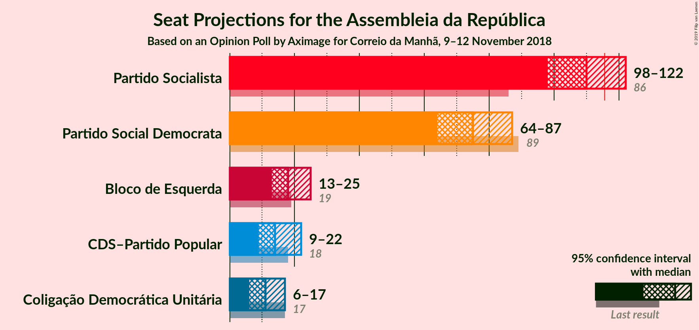
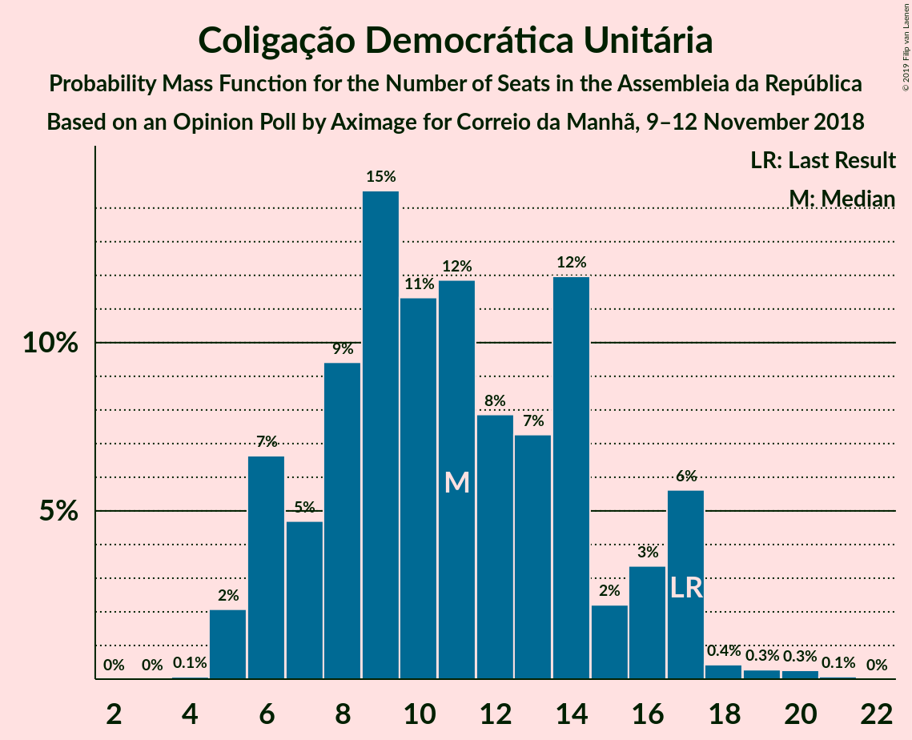

# Opinion Poll by Aximage for Correio da Manhã, 9–12 November 2018

<a href="#voting-intentions">Voting Intentions</a> | <a href="#seats">Seats</a> | <a href="#coalitions">Coalitions</a> | <a href="#technical-information">Technical Information</a>

## Voting Intentions

### Confidence Intervals

| Party | Last Result | Poll Result | 80% Confidence Interval | 90% Confidence Interval | 95% Confidence Interval | 99% Confidence Interval |
|:-----:|:-----------:|:-----------:|:-----------------------:|:-----------------------:|:-----------------------:|:-----------------------:|
| Partido Socialista | 32.3% | 37.8% | 35.3–40.4% |34.6–41.1% |34.0–41.8% |32.8–43.0% |
| Partido Social Democrata | 36.9% | 26.4% | 24.2–28.8% |23.5–29.4% |23.0–30.0% |22.0–31.2% |
| Bloco de Esquerda | 10.2% | 9.1% | 7.8–10.8% |7.4–11.3% |7.1–11.7% |6.5–12.5% |
| CDS–Partido Popular | 36.9% | 7.6% | 6.4–9.2% |6.1–9.6% |5.8–10.0% |5.2–10.8% |
| Coligação Democrática Unitária | 8.2% | 6.1% | 5.0–7.6% |4.7–8.0% |4.5–8.4% |4.0–9.1% |

*Note:* The poll result column reflects the actual value used in the calculations. Published results may vary slightly, and in addition be rounded to fewer digits.

## Seats

### Confidence Intervals

| Party | Last Result | Median | 80% Confidence Interval | 90% Confidence Interval | 95% Confidence Interval | 99% Confidence Interval |
|:-----:|:-----------:|:------:|:-----------------------:|:-----------------------:|:-----------------------:|:-----------------------:|
| <a href="#partido-socialista">Partido Socialista</a> | 86 | 107 | 105–112 |105–113 |93–113 |93–113 |
| <a href="#partido-social-democrata">Partido Social Democrata</a> | 89 | 82 | 77–83 |76–83 |76–90 |76–90 |
| <a href="#bloco-de-esquerda">Bloco de Esquerda</a> | 19 | 18 | 15–20 |14–21 |14–21 |13–22 |
| <a href="#cds–partido-popular">CDS–Partido Popular</a> | 18 | 16 | 9–17 |9–17 |9–17 |9–17 |
| <a href="#coligação-democrática-unitária">Coligação Democrática Unitária</a> | 17 | 10 | 9–13 |9–13 |9–14 |9–14 |

### Partido Socialista

*For a full overview of the results for this party, see the [Partido Socialista](party-partidosocialista.html) page.*

| Number of Seats | Probability | Accumulated | Special Marks |
|:---------------:|:-----------:|:-----------:|:-------------:|
| 86 | 0% | 100% | Last Result |
| 87 | 0% | 100% |  |
| 88 | 0% | 100% |  |
| 89 | 0% | 100% |  |
| 90 | 0% | 100% |  |
| 91 | 0% | 100% |  |
| 92 | 0.1% | 100% |  |
| 93 | 3% | 99.8% |  |
| 94 | 0.1% | 97% |  |
| 95 | 0% | 96% |  |
| 96 | 0% | 96% |  |
| 97 | 0% | 96% |  |
| 98 | 0% | 96% |  |
| 99 | 0% | 96% |  |
| 100 | 0.3% | 96% |  |
| 101 | 0% | 96% |  |
| 102 | 0% | 96% |  |
| 103 | 0% | 96% |  |
| 104 | 0.2% | 96% |  |
| 105 | 11% | 96% |  |
| 106 | 30% | 85% |  |
| 107 | 7% | 55% | Median |
| 108 | 1.0% | 48% |  |
| 109 | 0.1% | 47% |  |
| 110 | 17% | 47% |  |
| 111 | 11% | 30% |  |
| 112 | 10% | 19% |  |
| 113 | 10% | 10% |  |
| 114 | 0% | 0.1% |  |
| 115 | 0% | 0.1% |  |
| 116 | 0% | 0.1% | Majority |
| 117 | 0% | 0.1% |  |
| 118 | 0% | 0.1% |  |
| 119 | 0% | 0.1% |  |
| 120 | 0% | 0.1% |  |
| 121 | 0% | 0% |  |

### Partido Social Democrata

*For a full overview of the results for this party, see the [Partido Social Democrata](party-partidosocialdemocrata.html) page.*

| Number of Seats | Probability | Accumulated | Special Marks |
|:---------------:|:-----------:|:-----------:|:-------------:|
| 69 | 0% | 100% |  |
| 70 | 0% | 99.9% |  |
| 71 | 0% | 99.9% |  |
| 72 | 0% | 99.9% |  |
| 73 | 0% | 99.9% |  |
| 74 | 0% | 99.9% |  |
| 75 | 0.1% | 99.9% |  |
| 76 | 7% | 99.9% |  |
| 77 | 40% | 93% |  |
| 78 | 0% | 53% |  |
| 79 | 0% | 53% |  |
| 80 | 0% | 53% |  |
| 81 | 0% | 53% |  |
| 82 | 5% | 53% | Median |
| 83 | 44% | 48% |  |
| 84 | 0% | 4% |  |
| 85 | 0.1% | 4% |  |
| 86 | 0% | 4% |  |
| 87 | 0% | 4% |  |
| 88 | 0% | 4% |  |
| 89 | 0% | 4% | Last Result |
| 90 | 3% | 4% |  |
| 91 | 0.3% | 0.4% |  |
| 92 | 0% | 0.2% |  |
| 93 | 0.1% | 0.2% |  |
| 94 | 0% | 0.1% |  |
| 95 | 0% | 0% |  |

### Bloco de Esquerda

*For a full overview of the results for this party, see the [Bloco de Esquerda](party-blocodeesquerda.html) page.*

| Number of Seats | Probability | Accumulated | Special Marks |
|:---------------:|:-----------:|:-----------:|:-------------:|
| 12 | 0.1% | 100% |  |
| 13 | 1.0% | 99.9% |  |
| 14 | 7% | 99.0% |  |
| 15 | 30% | 92% |  |
| 16 | 7% | 62% |  |
| 17 | 4% | 55% |  |
| 18 | 10% | 51% | Median |
| 19 | 9% | 41% | Last Result |
| 20 | 25% | 32% |  |
| 21 | 6% | 6% |  |
| 22 | 0.2% | 0.7% |  |
| 23 | 0% | 0.4% |  |
| 24 | 0.2% | 0.4% |  |
| 25 | 0.1% | 0.2% |  |
| 26 | 0% | 0.1% |  |
| 27 | 0.1% | 0.1% |  |
| 28 | 0% | 0% |  |

### CDS–Partido Popular

*For a full overview of the results for this party, see the [CDS–Partido Popular](party-cds–partidopopular.html) page.*

| Number of Seats | Probability | Accumulated | Special Marks |
|:---------------:|:-----------:|:-----------:|:-------------:|
| 7 | 0.3% | 100% |  |
| 8 | 0% | 99.7% |  |
| 9 | 30% | 99.7% |  |
| 10 | 17% | 70% |  |
| 11 | 0% | 53% |  |
| 12 | 0% | 53% |  |
| 13 | 0.2% | 53% |  |
| 14 | 0.1% | 53% |  |
| 15 | 0.8% | 52% |  |
| 16 | 3% | 52% | Median |
| 17 | 49% | 49% |  |
| 18 | 0% | 0% | Last Result |

### Coligação Democrática Unitária

*For a full overview of the results for this party, see the [Coligação Democrática Unitária](party-coligaçãodemocráticaunitária.html) page.*

| Number of Seats | Probability | Accumulated | Special Marks |
|:---------------:|:-----------:|:-----------:|:-------------:|
| 4 | 0.1% | 100% |  |
| 5 | 0% | 99.9% |  |
| 6 | 0% | 99.9% |  |
| 7 | 0% | 99.8% |  |
| 8 | 0% | 99.8% |  |
| 9 | 48% | 99.8% |  |
| 10 | 4% | 52% | Median |
| 11 | 0.9% | 48% |  |
| 12 | 0% | 47% |  |
| 13 | 43% | 47% |  |
| 14 | 4% | 4% |  |
| 15 | 0.4% | 0.4% |  |
| 16 | 0% | 0% |  |
| 17 | 0% | 0% | Last Result |

## Coalitions

### Confidence Intervals

| Coalition | Last Result | Median | Majority? | 80% Confidence Interval | 90% Confidence Interval | 95% Confidence Interval | 99% Confidence Interval |
|:---------:|:-----------:|:------:|:---------:|:-----------------------:|:-----------------------:|:-----------------------:|:-----------------------:|
| Partido Socialista – Bloco de Esquerda – Coligação Democrática Unitária | 122 | 131 | 100% | 130–144 | 130–144 | 124–145 | 124–145 |
| Partido Socialista – Bloco de Esquerda | 105 | 122 | 96% | 121–131 | 121–131 | 114–131 | 114–131 |
| Partido Socialista – Coligação Democrática Unitária | 103 | 116 | 55% | 114–126 | 114–126 | 103–127 | 103–127 |
| Partido Socialista | 86 | 107 | 0.1% | 105–112 | 105–113 | 93–113 | 93–113 |
| Partido Social Democrata – CDS–Partido Popular | 107 | 99 | 0% | 86–100 | 86–100 | 85–106 | 85–106 |

### Partido Socialista – Bloco de Esquerda – Coligação Democrática Unitária

| Number of Seats | Probability | Accumulated | Special Marks |
|:---------------:|:-----------:|:-----------:|:-------------:|
| 122 | 0% | 100% | Last Result |
| 123 | 0% | 100% |  |
| 124 | 3% | 99.9% |  |
| 125 | 0.5% | 97% |  |
| 126 | 0% | 96% |  |
| 127 | 0% | 96% |  |
| 128 | 0% | 96% |  |
| 129 | 0% | 96% |  |
| 130 | 44% | 96% |  |
| 131 | 5% | 53% |  |
| 132 | 0% | 47% |  |
| 133 | 0% | 47% |  |
| 134 | 0% | 47% |  |
| 135 | 0% | 47% | Median |
| 136 | 0% | 47% |  |
| 137 | 0% | 47% |  |
| 138 | 0.1% | 47% |  |
| 139 | 0% | 47% |  |
| 140 | 0.1% | 47% |  |
| 141 | 0.1% | 47% |  |
| 142 | 0% | 47% |  |
| 143 | 14% | 47% |  |
| 144 | 28% | 33% |  |
| 145 | 4% | 4% |  |
| 146 | 0% | 0.1% |  |
| 147 | 0% | 0.1% |  |
| 148 | 0% | 0.1% |  |
| 149 | 0% | 0.1% |  |
| 150 | 0% | 0.1% |  |
| 151 | 0% | 0.1% |  |
| 152 | 0% | 0.1% |  |
| 153 | 0% | 0.1% |  |
| 154 | 0% | 0% |  |

### Partido Socialista – Bloco de Esquerda

| Number of Seats | Probability | Accumulated | Special Marks |
|:---------------:|:-----------:|:-----------:|:-------------:|
| 105 | 0% | 100% | Last Result |
| 106 | 0% | 100% |  |
| 107 | 0% | 100% |  |
| 108 | 0% | 100% |  |
| 109 | 0% | 100% |  |
| 110 | 0% | 100% |  |
| 111 | 0% | 100% |  |
| 112 | 0% | 99.9% |  |
| 113 | 0.4% | 99.9% |  |
| 114 | 3% | 99.6% |  |
| 115 | 0% | 96% |  |
| 116 | 0% | 96% | Majority |
| 117 | 0% | 96% |  |
| 118 | 0% | 96% |  |
| 119 | 0% | 96% |  |
| 120 | 0% | 96% |  |
| 121 | 45% | 96% |  |
| 122 | 4% | 52% |  |
| 123 | 0% | 47% |  |
| 124 | 0.1% | 47% |  |
| 125 | 0.1% | 47% | Median |
| 126 | 0% | 47% |  |
| 127 | 0.1% | 47% |  |
| 128 | 0% | 47% |  |
| 129 | 0% | 47% |  |
| 130 | 15% | 47% |  |
| 131 | 32% | 32% |  |
| 132 | 0% | 0.1% |  |
| 133 | 0% | 0.1% |  |
| 134 | 0% | 0.1% |  |
| 135 | 0% | 0.1% |  |
| 136 | 0% | 0.1% |  |
| 137 | 0.1% | 0.1% |  |
| 138 | 0% | 0.1% |  |
| 139 | 0% | 0.1% |  |
| 140 | 0% | 0.1% |  |
| 141 | 0% | 0.1% |  |
| 142 | 0% | 0.1% |  |
| 143 | 0% | 0.1% |  |
| 144 | 0% | 0.1% |  |
| 145 | 0% | 0.1% |  |
| 146 | 0% | 0.1% |  |
| 147 | 0% | 0.1% |  |
| 148 | 0% | 0.1% |  |
| 149 | 0% | 0% |  |

### Partido Socialista – Coligação Democrática Unitária

| Number of Seats | Probability | Accumulated | Special Marks |
|:---------------:|:-----------:|:-----------:|:-------------:|
| 101 | 0% | 100% |  |
| 102 | 0.1% | 99.9% |  |
| 103 | 2% | 99.8% | Last Result |
| 104 | 0.8% | 97% |  |
| 105 | 0.2% | 97% |  |
| 106 | 0% | 96% |  |
| 107 | 0% | 96% |  |
| 108 | 0% | 96% |  |
| 109 | 0% | 96% |  |
| 110 | 0% | 96% |  |
| 111 | 0% | 96% |  |
| 112 | 0% | 96% |  |
| 113 | 0.3% | 96% |  |
| 114 | 11% | 96% |  |
| 115 | 30% | 85% |  |
| 116 | 7% | 55% | Majority |
| 117 | 0.1% | 48% | Median |
| 118 | 1.0% | 48% |  |
| 119 | 0.1% | 47% |  |
| 120 | 0% | 47% |  |
| 121 | 0% | 47% |  |
| 122 | 0.1% | 47% |  |
| 123 | 17% | 47% |  |
| 124 | 11% | 30% |  |
| 125 | 9% | 19% |  |
| 126 | 6% | 10% |  |
| 127 | 4% | 4% |  |
| 128 | 0% | 0% |  |

### Partido Socialista

| Number of Seats | Probability | Accumulated | Special Marks |
|:---------------:|:-----------:|:-----------:|:-------------:|
| 86 | 0% | 100% | Last Result |
| 87 | 0% | 100% |  |
| 88 | 0% | 100% |  |
| 89 | 0% | 100% |  |
| 90 | 0% | 100% |  |
| 91 | 0% | 100% |  |
| 92 | 0.1% | 100% |  |
| 93 | 3% | 99.8% |  |
| 94 | 0.1% | 97% |  |
| 95 | 0% | 96% |  |
| 96 | 0% | 96% |  |
| 97 | 0% | 96% |  |
| 98 | 0% | 96% |  |
| 99 | 0% | 96% |  |
| 100 | 0.3% | 96% |  |
| 101 | 0% | 96% |  |
| 102 | 0% | 96% |  |
| 103 | 0% | 96% |  |
| 104 | 0.2% | 96% |  |
| 105 | 11% | 96% |  |
| 106 | 30% | 85% |  |
| 107 | 7% | 55% | Median |
| 108 | 1.0% | 48% |  |
| 109 | 0.1% | 47% |  |
| 110 | 17% | 47% |  |
| 111 | 11% | 30% |  |
| 112 | 10% | 19% |  |
| 113 | 10% | 10% |  |
| 114 | 0% | 0.1% |  |
| 115 | 0% | 0.1% |  |
| 116 | 0% | 0.1% | Majority |
| 117 | 0% | 0.1% |  |
| 118 | 0% | 0.1% |  |
| 119 | 0% | 0.1% |  |
| 120 | 0% | 0.1% |  |
| 121 | 0% | 0% |  |

### Partido Social Democrata – CDS–Partido Popular

| Number of Seats | Probability | Accumulated | Special Marks |
|:---------------:|:-----------:|:-----------:|:-------------:|
| 77 | 0% | 100% |  |
| 78 | 0% | 99.9% |  |
| 79 | 0% | 99.9% |  |
| 80 | 0% | 99.9% |  |
| 81 | 0% | 99.9% |  |
| 82 | 0% | 99.9% |  |
| 83 | 0% | 99.9% |  |
| 84 | 0% | 99.9% |  |
| 85 | 4% | 99.9% |  |
| 86 | 28% | 96% |  |
| 87 | 14% | 67% |  |
| 88 | 0% | 53% |  |
| 89 | 0.1% | 53% |  |
| 90 | 0.1% | 53% |  |
| 91 | 0% | 53% |  |
| 92 | 0.1% | 53% |  |
| 93 | 0% | 53% |  |
| 94 | 0% | 53% |  |
| 95 | 0% | 53% |  |
| 96 | 0% | 53% |  |
| 97 | 0% | 53% |  |
| 98 | 0% | 53% | Median |
| 99 | 5% | 53% |  |
| 100 | 44% | 47% |  |
| 101 | 0% | 4% |  |
| 102 | 0% | 4% |  |
| 103 | 0% | 4% |  |
| 104 | 0% | 4% |  |
| 105 | 0.5% | 4% |  |
| 106 | 3% | 3% |  |
| 107 | 0% | 0.1% | Last Result |
| 108 | 0% | 0% |  |

## Technical Information

### Opinion Poll

+ **Polling firm:** Aximage
+ **Commissioner(s):** Correio da Manhã
+ **Fieldwork period:** 9–12 November 2018

### Calculations

+ **Sample size:** 603
+ **Simulations done:** 1,024
+ **Error estimate:** 3.73%

