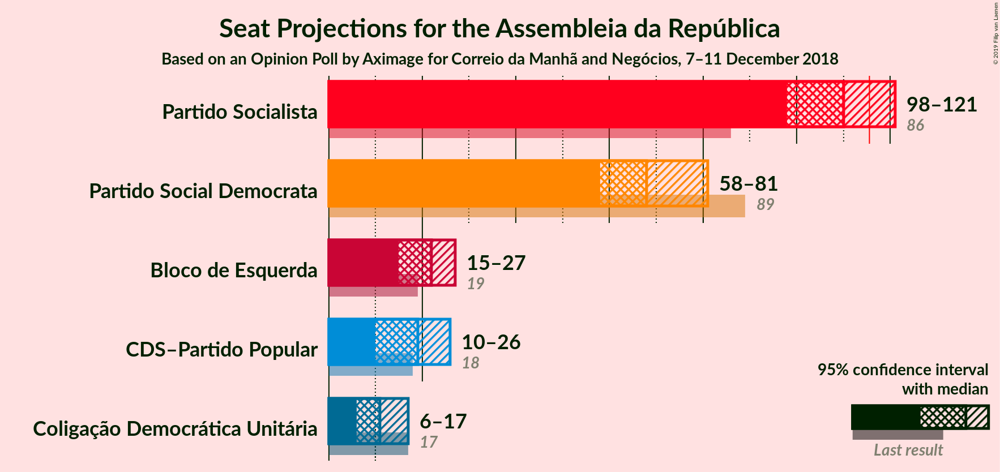
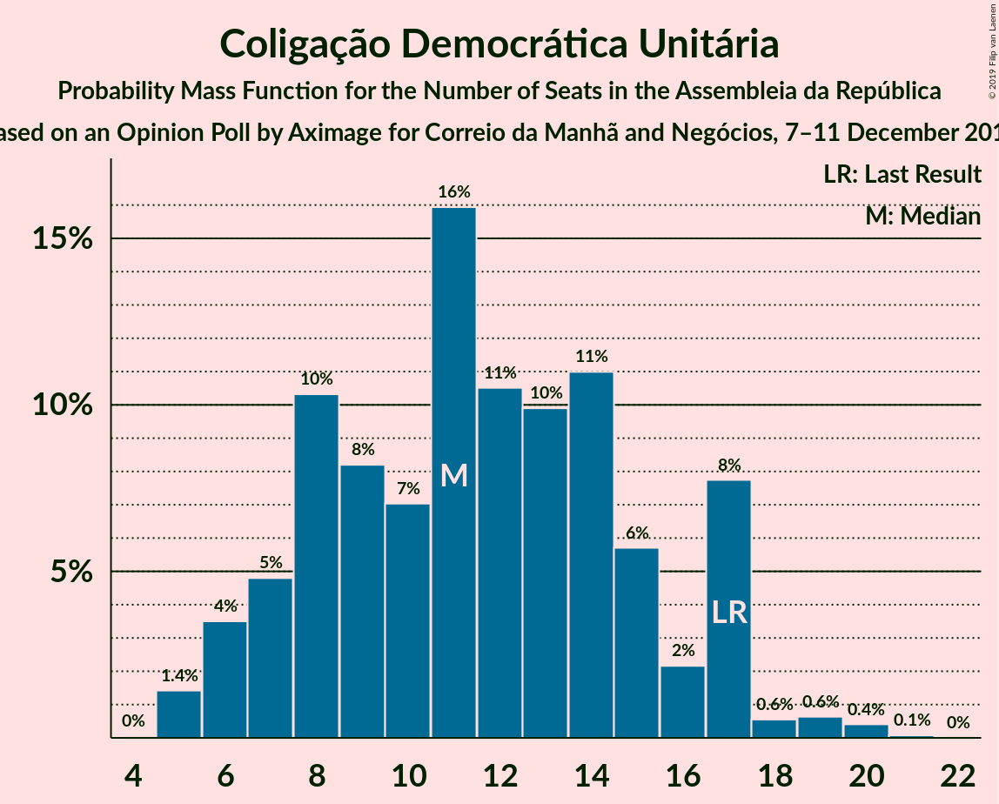

# Opinion Poll by Aximage for Correio da Manhã, 7–11 December 2018

<a href="#voting-intentions">Voting Intentions</a> | <a href="#seats">Seats</a> | <a href="#coalitions">Coalitions</a> | <a href="#technical-information">Technical Information</a>

## Voting Intentions

### Confidence Intervals

| Party | Last Result | Poll Result | 80% Confidence Interval | 90% Confidence Interval | 95% Confidence Interval | 99% Confidence Interval |
|:-----:|:-----------:|:-----------:|:-----------------------:|:-----------------------:|:-----------------------:|:-----------------------:|
| Partido Socialista | 32.3% | 37.0% | 34.6–39.6% |33.9–40.3% |33.3–41.0% |32.1–42.2% |
| Partido Social Democrata | 36.9% | 24.8% | 22.6–27.1% |22.0–27.8% |21.5–28.4% |20.5–29.5% |
| Bloco de Esquerda | 10.2% | 10.0% | 8.6–11.7% |8.2–12.2% |7.8–12.6% |7.2–13.5% |
| CDS–Partido Popular | 36.9% | 8.6% | 7.3–10.3% |7.0–10.7% |6.6–11.2% |6.1–12.0% |
| Coligação Democrática Unitária | 8.2% | 6.3% | 5.2–7.8% |4.9–8.2% |4.6–8.6% |4.1–9.3% |

*Note:* The poll result column reflects the actual value used in the calculations. Published results may vary slightly, and in addition be rounded to fewer digits.

## Seats

### Confidence Intervals

| Party | Last Result | Median | 80% Confidence Interval | 90% Confidence Interval | 95% Confidence Interval | 99% Confidence Interval |
|:-----:|:-----------:|:------:|:-----------------------:|:-----------------------:|:-----------------------:|:-----------------------:|
| <a href="#partido-socialista">Partido Socialista</a> | 86 | 109 | 105–111 |105–111 |105–111 |102–113 |
| <a href="#partido-social-democrata">Partido Social Democrata</a> | 89 | 70 | 68–75 |68–75 |67–75 |67–75 |
| <a href="#bloco-de-esquerda">Bloco de Esquerda</a> | 19 | 27 | 26–29 |26–30 |25–30 |24–35 |
| <a href="#cds–partido-popular">CDS–Partido Popular</a> | 18 | 16 | 12–19 |11–19 |10–19 |10–20 |
| <a href="#coligação-democrática-unitária">Coligação Democrática Unitária</a> | 17 | 7 | 5–11 |5–12 |5–13 |4–14 |

### Partido Socialista

*For a full overview of the results for this party, see the [Partido Socialista](party-partidosocialista.html) page.*

| Number of Seats | Probability | Accumulated | Special Marks |
|:---------------:|:-----------:|:-----------:|:-------------:|
| 86 | 0% | 100% | Last Result |
| 87 | 0% | 100% |  |
| 88 | 0% | 100% |  |
| 89 | 0% | 100% |  |
| 90 | 0% | 100% |  |
| 91 | 0% | 100% |  |
| 92 | 0% | 100% |  |
| 93 | 0% | 100% |  |
| 94 | 0% | 100% |  |
| 95 | 0% | 100% |  |
| 96 | 0% | 100% |  |
| 97 | 0% | 100% |  |
| 98 | 0% | 100% |  |
| 99 | 0% | 100% |  |
| 100 | 0% | 100% |  |
| 101 | 0.1% | 100% |  |
| 102 | 1.1% | 99.8% |  |
| 103 | 0% | 98.7% |  |
| 104 | 0.3% | 98.7% |  |
| 105 | 11% | 98% |  |
| 106 | 4% | 87% |  |
| 107 | 10% | 83% |  |
| 108 | 23% | 74% |  |
| 109 | 11% | 50% | Median |
| 110 | 8% | 39% |  |
| 111 | 28% | 31% |  |
| 112 | 1.2% | 2% |  |
| 113 | 0.9% | 1.2% |  |
| 114 | 0% | 0.4% |  |
| 115 | 0% | 0.4% |  |
| 116 | 0.3% | 0.3% | Majority |
| 117 | 0% | 0% |  |

### Partido Social Democrata

*For a full overview of the results for this party, see the [Partido Social Democrata](party-partidosocialdemocrata.html) page.*

| Number of Seats | Probability | Accumulated | Special Marks |
|:---------------:|:-----------:|:-----------:|:-------------:|
| 63 | 0% | 100% |  |
| 64 | 0.4% | 99.9% |  |
| 65 | 0% | 99.6% |  |
| 66 | 0% | 99.6% |  |
| 67 | 3% | 99.5% |  |
| 68 | 13% | 97% |  |
| 69 | 1.3% | 84% |  |
| 70 | 35% | 83% | Median |
| 71 | 10% | 48% |  |
| 72 | 9% | 38% |  |
| 73 | 13% | 29% |  |
| 74 | 1.3% | 17% |  |
| 75 | 15% | 15% |  |
| 76 | 0% | 0% |  |
| 77 | 0% | 0% |  |
| 78 | 0% | 0% |  |
| 79 | 0% | 0% |  |
| 80 | 0% | 0% |  |
| 81 | 0% | 0% |  |
| 82 | 0% | 0% |  |
| 83 | 0% | 0% |  |
| 84 | 0% | 0% |  |
| 85 | 0% | 0% |  |
| 86 | 0% | 0% |  |
| 87 | 0% | 0% |  |
| 88 | 0% | 0% |  |
| 89 | 0% | 0% | Last Result |

### Bloco de Esquerda

*For a full overview of the results for this party, see the [Bloco de Esquerda](party-blocodeesquerda.html) page.*

| Number of Seats | Probability | Accumulated | Special Marks |
|:---------------:|:-----------:|:-----------:|:-------------:|
| 10 | 0.2% | 100% |  |
| 11 | 0% | 99.8% |  |
| 12 | 0.1% | 99.8% |  |
| 13 | 0% | 99.7% |  |
| 14 | 0% | 99.6% |  |
| 15 | 0% | 99.6% |  |
| 16 | 0% | 99.6% |  |
| 17 | 0% | 99.6% |  |
| 18 | 0% | 99.6% |  |
| 19 | 0% | 99.6% | Last Result |
| 20 | 0% | 99.6% |  |
| 21 | 0% | 99.6% |  |
| 22 | 0% | 99.6% |  |
| 23 | 0% | 99.6% |  |
| 24 | 2% | 99.6% |  |
| 25 | 1.2% | 98% |  |
| 26 | 34% | 97% |  |
| 27 | 36% | 63% | Median |
| 28 | 9% | 27% |  |
| 29 | 12% | 18% |  |
| 30 | 4% | 6% |  |
| 31 | 0.2% | 2% |  |
| 32 | 0.2% | 2% |  |
| 33 | 0.3% | 2% |  |
| 34 | 0% | 1.3% |  |
| 35 | 1.1% | 1.3% |  |
| 36 | 0.1% | 0.2% |  |
| 37 | 0% | 0.1% |  |
| 38 | 0% | 0.1% |  |
| 39 | 0% | 0% |  |

### CDS–Partido Popular

*For a full overview of the results for this party, see the [CDS–Partido Popular](party-cds–partidopopular.html) page.*

| Number of Seats | Probability | Accumulated | Special Marks |
|:---------------:|:-----------:|:-----------:|:-------------:|
| 8 | 0% | 100% |  |
| 9 | 0.1% | 99.9% |  |
| 10 | 3% | 99.8% |  |
| 11 | 5% | 97% |  |
| 12 | 17% | 92% |  |
| 13 | 16% | 75% |  |
| 14 | 4% | 59% |  |
| 15 | 0.4% | 55% |  |
| 16 | 8% | 55% | Median |
| 17 | 7% | 46% |  |
| 18 | 24% | 39% | Last Result |
| 19 | 13% | 15% |  |
| 20 | 2% | 2% |  |
| 21 | 0.3% | 0.3% |  |
| 22 | 0% | 0% |  |

### Coligação Democrática Unitária

*For a full overview of the results for this party, see the [Coligação Democrática Unitária](party-coligaçãodemocráticaunitária.html) page.*

| Number of Seats | Probability | Accumulated | Special Marks |
|:---------------:|:-----------:|:-----------:|:-------------:|
| 4 | 1.0% | 100% |  |
| 5 | 22% | 99.0% |  |
| 6 | 2% | 77% |  |
| 7 | 30% | 75% | Median |
| 8 | 20% | 45% |  |
| 9 | 2% | 25% |  |
| 10 | 1.0% | 23% |  |
| 11 | 17% | 22% |  |
| 12 | 0.1% | 5% |  |
| 13 | 3% | 5% |  |
| 14 | 2% | 2% |  |
| 15 | 0% | 0.5% |  |
| 16 | 0% | 0.5% |  |
| 17 | 0.1% | 0.5% | Last Result |
| 18 | 0% | 0.4% |  |
| 19 | 0.2% | 0.4% |  |
| 20 | 0% | 0.2% |  |
| 21 | 0.1% | 0.2% |  |
| 22 | 0% | 0.1% |  |
| 23 | 0% | 0% |  |

## Coalitions

### Confidence Intervals

| Coalition | Last Result | Median | Majority? | 80% Confidence Interval | 90% Confidence Interval | 95% Confidence Interval | 99% Confidence Interval |
|:---------:|:-----------:|:------:|:---------:|:-----------------------:|:-----------------------:|:-----------------------:|:-----------------------:|
| Partido Socialista – Bloco de Esquerda – Coligação Democrática Unitária | 122 | 142 | 100% | 141–146 | 140–149 | 139–150 | 137–151 |
| Partido Socialista – Bloco de Esquerda | 105 | 135 | 100% | 134–138 | 134–138 | 133–138 | 132–138 |
| Partido Socialista – Coligação Democrática Unitária | 103 | 116 | 57% | 114–119 | 114–120 | 113–122 | 111–122 |
| Partido Socialista | 86 | 109 | 0.3% | 105–111 | 105–111 | 105–111 | 102–113 |
| Partido Social Democrata – CDS–Partido Popular | 107 | 88 | 0% | 84–89 | 81–90 | 80–91 | 79–93 |

### Partido Socialista – Bloco de Esquerda – Coligação Democrática Unitária

| Number of Seats | Probability | Accumulated | Special Marks |
|:---------------:|:-----------:|:-----------:|:-------------:|
| 122 | 0% | 100% | Last Result |
| 123 | 0% | 100% |  |
| 124 | 0% | 100% |  |
| 125 | 0% | 100% |  |
| 126 | 0% | 100% |  |
| 127 | 0% | 100% |  |
| 128 | 0% | 100% |  |
| 129 | 0% | 100% |  |
| 130 | 0% | 100% |  |
| 131 | 0% | 100% |  |
| 132 | 0% | 100% |  |
| 133 | 0% | 100% |  |
| 134 | 0% | 100% |  |
| 135 | 0% | 100% |  |
| 136 | 0.1% | 100% |  |
| 137 | 0.7% | 99.9% |  |
| 138 | 2% | 99.1% |  |
| 139 | 0.4% | 98% |  |
| 140 | 7% | 97% |  |
| 141 | 10% | 91% |  |
| 142 | 33% | 80% |  |
| 143 | 2% | 47% | Median |
| 144 | 1.2% | 45% |  |
| 145 | 18% | 44% |  |
| 146 | 18% | 26% |  |
| 147 | 2% | 8% |  |
| 148 | 0.1% | 7% |  |
| 149 | 2% | 7% |  |
| 150 | 3% | 5% |  |
| 151 | 2% | 2% |  |
| 152 | 0% | 0.1% |  |
| 153 | 0% | 0.1% |  |
| 154 | 0% | 0.1% |  |
| 155 | 0% | 0.1% |  |
| 156 | 0% | 0.1% |  |
| 157 | 0% | 0% |  |

### Partido Socialista – Bloco de Esquerda

| Number of Seats | Probability | Accumulated | Special Marks |
|:---------------:|:-----------:|:-----------:|:-------------:|
| 105 | 0% | 100% | Last Result |
| 106 | 0% | 100% |  |
| 107 | 0% | 100% |  |
| 108 | 0% | 100% |  |
| 109 | 0% | 100% |  |
| 110 | 0% | 100% |  |
| 111 | 0% | 100% |  |
| 112 | 0% | 100% |  |
| 113 | 0% | 100% |  |
| 114 | 0% | 100% |  |
| 115 | 0% | 100% |  |
| 116 | 0% | 100% | Majority |
| 117 | 0% | 100% |  |
| 118 | 0% | 100% |  |
| 119 | 0.2% | 100% |  |
| 120 | 0.2% | 99.8% |  |
| 121 | 0% | 99.7% |  |
| 122 | 0% | 99.6% |  |
| 123 | 0% | 99.6% |  |
| 124 | 0% | 99.6% |  |
| 125 | 0% | 99.6% |  |
| 126 | 0% | 99.6% |  |
| 127 | 0% | 99.6% |  |
| 128 | 0% | 99.6% |  |
| 129 | 0% | 99.6% |  |
| 130 | 0% | 99.6% |  |
| 131 | 0% | 99.6% |  |
| 132 | 0.8% | 99.6% |  |
| 133 | 2% | 98.8% |  |
| 134 | 14% | 97% |  |
| 135 | 36% | 83% |  |
| 136 | 5% | 47% | Median |
| 137 | 30% | 42% |  |
| 138 | 11% | 12% |  |
| 139 | 0.1% | 0.4% |  |
| 140 | 0.3% | 0.3% |  |
| 141 | 0% | 0% |  |

### Partido Socialista – Coligação Democrática Unitária

| Number of Seats | Probability | Accumulated | Special Marks |
|:---------------:|:-----------:|:-----------:|:-------------:|
| 103 | 0% | 100% | Last Result |
| 104 | 0% | 100% |  |
| 105 | 0% | 100% |  |
| 106 | 0% | 100% |  |
| 107 | 0% | 100% |  |
| 108 | 0% | 100% |  |
| 109 | 0% | 100% |  |
| 110 | 0% | 100% |  |
| 111 | 0.8% | 100% |  |
| 112 | 1.5% | 99.2% |  |
| 113 | 0.4% | 98% |  |
| 114 | 13% | 97% |  |
| 115 | 28% | 85% |  |
| 116 | 22% | 57% | Median, Majority |
| 117 | 5% | 35% |  |
| 118 | 6% | 31% |  |
| 119 | 16% | 24% |  |
| 120 | 3% | 8% |  |
| 121 | 2% | 5% |  |
| 122 | 3% | 3% |  |
| 123 | 0% | 0.4% |  |
| 124 | 0% | 0.4% |  |
| 125 | 0% | 0.4% |  |
| 126 | 0% | 0.4% |  |
| 127 | 0.1% | 0.4% |  |
| 128 | 0.2% | 0.3% |  |
| 129 | 0.1% | 0.1% |  |
| 130 | 0.1% | 0.1% |  |
| 131 | 0% | 0% |  |

### Partido Socialista

| Number of Seats | Probability | Accumulated | Special Marks |
|:---------------:|:-----------:|:-----------:|:-------------:|
| 86 | 0% | 100% | Last Result |
| 87 | 0% | 100% |  |
| 88 | 0% | 100% |  |
| 89 | 0% | 100% |  |
| 90 | 0% | 100% |  |
| 91 | 0% | 100% |  |
| 92 | 0% | 100% |  |
| 93 | 0% | 100% |  |
| 94 | 0% | 100% |  |
| 95 | 0% | 100% |  |
| 96 | 0% | 100% |  |
| 97 | 0% | 100% |  |
| 98 | 0% | 100% |  |
| 99 | 0% | 100% |  |
| 100 | 0% | 100% |  |
| 101 | 0.1% | 100% |  |
| 102 | 1.1% | 99.8% |  |
| 103 | 0% | 98.7% |  |
| 104 | 0.3% | 98.7% |  |
| 105 | 11% | 98% |  |
| 106 | 4% | 87% |  |
| 107 | 10% | 83% |  |
| 108 | 23% | 74% |  |
| 109 | 11% | 50% | Median |
| 110 | 8% | 39% |  |
| 111 | 28% | 31% |  |
| 112 | 1.2% | 2% |  |
| 113 | 0.9% | 1.2% |  |
| 114 | 0% | 0.4% |  |
| 115 | 0% | 0.4% |  |
| 116 | 0.3% | 0.3% | Majority |
| 117 | 0% | 0% |  |

### Partido Social Democrata – CDS–Partido Popular

| Number of Seats | Probability | Accumulated | Special Marks |
|:---------------:|:-----------:|:-----------:|:-------------:|
| 74 | 0% | 100% |  |
| 75 | 0% | 99.9% |  |
| 76 | 0% | 99.9% |  |
| 77 | 0% | 99.9% |  |
| 78 | 0% | 99.9% |  |
| 79 | 2% | 99.9% |  |
| 80 | 3% | 98% |  |
| 81 | 2% | 95% |  |
| 82 | 0.1% | 93% |  |
| 83 | 2% | 93% |  |
| 84 | 18% | 92% |  |
| 85 | 18% | 74% |  |
| 86 | 1.2% | 56% | Median |
| 87 | 2% | 55% |  |
| 88 | 33% | 53% |  |
| 89 | 10% | 20% |  |
| 90 | 7% | 9% |  |
| 91 | 0.4% | 3% |  |
| 92 | 2% | 2% |  |
| 93 | 0.7% | 0.9% |  |
| 94 | 0.1% | 0.1% |  |
| 95 | 0% | 0% |  |
| 96 | 0% | 0% |  |
| 97 | 0% | 0% |  |
| 98 | 0% | 0% |  |
| 99 | 0% | 0% |  |
| 100 | 0% | 0% |  |
| 101 | 0% | 0% |  |
| 102 | 0% | 0% |  |
| 103 | 0% | 0% |  |
| 104 | 0% | 0% |  |
| 105 | 0% | 0% |  |
| 106 | 0% | 0% |  |
| 107 | 0% | 0% | Last Result |

## Technical Information

### Opinion Poll

+ **Polling firm:** Aximage
+ **Commissioner(s):** Correio da Manhã
+ **Fieldwork period:** 7–11 December 2018

### Calculations

+ **Sample size:** 602
+ **Simulations done:** 1,024
+ **Error estimate:** 1.49%

