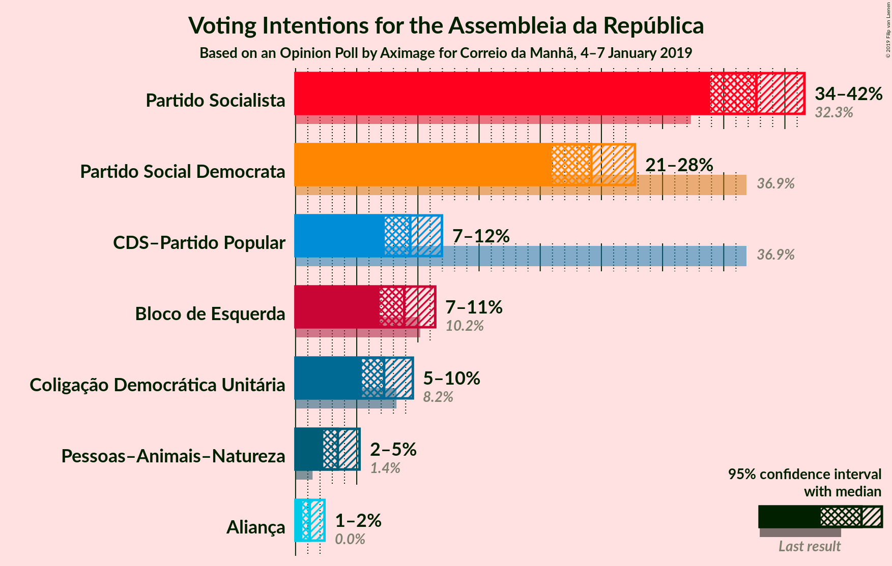
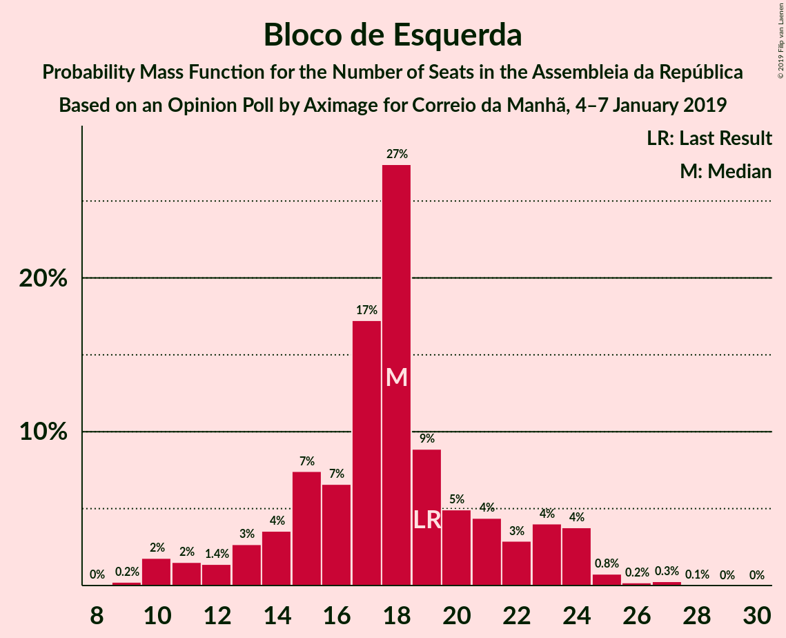
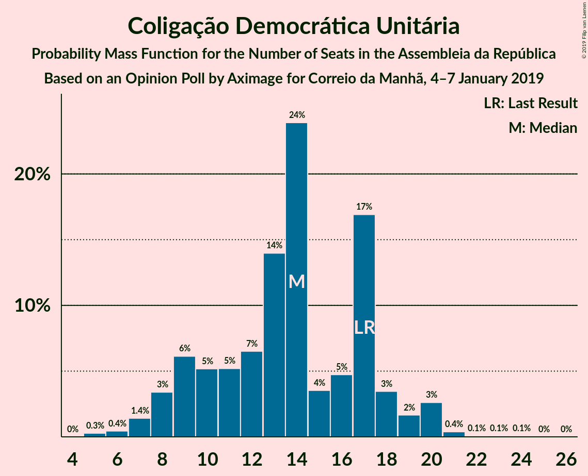

# Opinion Poll by Aximage for Correio da Manhã, 4–7 January 2019

<a href="#voting-intentions">Voting Intentions</a> | <a href="#seats">Seats</a> | <a href="#coalitions">Coalitions</a> | <a href="#technical-information">Technical Information</a>

## Voting Intentions

### Confidence Intervals

| Party | Last Result | Poll Result | 80% Confidence Interval | 90% Confidence Interval | 95% Confidence Interval | 99% Confidence Interval |
|:-----:|:-----------:|:-----------:|:-----------------------:|:-----------------------:|:-----------------------:|:-----------------------:|
| Partido Socialista | 32.3% | 37.7% | 35.2–40.2% |34.5–41.0% |33.9–41.6% |32.7–42.8% |
| Partido Social Democrata | 36.9% | 24.2% | 22.1–26.5% |21.4–27.2% |20.9–27.7% |20.0–28.9% |
| CDS–Partido Popular | 36.9% | 9.4% | 8.0–11.1% |7.6–11.5% |7.3–12.0% |6.7–12.8% |
| Bloco de Esquerda | 10.2% | 8.9% | 7.6–10.5% |7.2–11.0% |6.9–11.4% |6.3–12.3% |
| Coligação Democrática Unitária | 8.2% | 7.2% | 6.1–8.8% |5.7–9.2% |5.4–9.6% |4.9–10.4% |
| Pessoas–Animais–Natureza | 1.4% | 3.5% | 2.7–4.6% |2.5–4.9% |2.3–5.2% |2.0–5.8% |

*Note:* The poll result column reflects the actual value used in the calculations. Published results may vary slightly, and in addition be rounded to fewer digits.

## Seats

### Confidence Intervals

| Party | Last Result | Median | 80% Confidence Interval | 90% Confidence Interval | 95% Confidence Interval | 99% Confidence Interval |
|:-----:|:-----------:|:------:|:-----------------------:|:-----------------------:|:-----------------------:|:-----------------------:|
| <a href="#partido-socialista">Partido Socialista</a> | 86 | 99 | 92–109 |91–109 |91–109 |91–116 |
| <a href="#partido-social-democrata">Partido Social Democrata</a> | 89 | 73 | 73–77 |72–77 |62–79 |52–80 |
| <a href="#cds–partido-popular">CDS–Partido Popular</a> | 18 | 24 | 12–24 |12–24 |12–25 |12–29 |
| <a href="#bloco-de-esquerda">Bloco de Esquerda</a> | 19 | 14 | 14–19 |14–19 |14–19 |14–28 |
| <a href="#coligação-democrática-unitária">Coligação Democrática Unitária</a> | 17 | 14 | 14–19 |13–19 |13–23 |8–23 |
| <a href="#pessoas–animais–natureza">Pessoas–Animais–Natureza</a> | 1 | 6 | 2–6 |2–6 |2–6 |1–6 |

### Partido Socialista

*For a full overview of the results for this party, see the [Partido Socialista](party-partidosocialista.html) page.*

| Number of Seats | Probability | Accumulated | Special Marks |
|:---------------:|:-----------:|:-----------:|:-------------:|
| 86 | 0% | 100% | Last Result |
| 87 | 0% | 100% |  |
| 88 | 0% | 100% |  |
| 89 | 0.2% | 100% |  |
| 90 | 0.1% | 99.8% |  |
| 91 | 9% | 99.8% |  |
| 92 | 2% | 90% |  |
| 93 | 0.3% | 88% |  |
| 94 | 0% | 88% |  |
| 95 | 0% | 88% |  |
| 96 | 0% | 88% |  |
| 97 | 0.6% | 88% |  |
| 98 | 3% | 87% |  |
| 99 | 51% | 84% | Median |
| 100 | 0.4% | 32% |  |
| 101 | 2% | 32% |  |
| 102 | 0.4% | 30% |  |
| 103 | 0.1% | 29% |  |
| 104 | 0% | 29% |  |
| 105 | 0% | 29% |  |
| 106 | 0.1% | 29% |  |
| 107 | 0.1% | 29% |  |
| 108 | 9% | 29% |  |
| 109 | 19% | 20% |  |
| 110 | 0% | 0.9% |  |
| 111 | 0% | 0.9% |  |
| 112 | 0% | 0.8% |  |
| 113 | 0% | 0.8% |  |
| 114 | 0% | 0.8% |  |
| 115 | 0.1% | 0.8% |  |
| 116 | 0.6% | 0.7% | Majority |
| 117 | 0% | 0.1% |  |
| 118 | 0% | 0.1% |  |
| 119 | 0% | 0.1% |  |
| 120 | 0% | 0.1% |  |
| 121 | 0% | 0.1% |  |
| 122 | 0% | 0.1% |  |
| 123 | 0.1% | 0.1% |  |
| 124 | 0% | 0% |  |

### Partido Social Democrata

*For a full overview of the results for this party, see the [Partido Social Democrata](party-partidosocialdemocrata.html) page.*

| Number of Seats | Probability | Accumulated | Special Marks |
|:---------------:|:-----------:|:-----------:|:-------------:|
| 49 | 0.1% | 100% |  |
| 50 | 0% | 99.9% |  |
| 51 | 0% | 99.9% |  |
| 52 | 0.6% | 99.9% |  |
| 53 | 0.1% | 99.3% |  |
| 54 | 0.1% | 99.2% |  |
| 55 | 0% | 99.1% |  |
| 56 | 0.1% | 99.1% |  |
| 57 | 0% | 99.0% |  |
| 58 | 0% | 99.0% |  |
| 59 | 0% | 99.0% |  |
| 60 | 0% | 99.0% |  |
| 61 | 0% | 99.0% |  |
| 62 | 2% | 99.0% |  |
| 63 | 0.9% | 97% |  |
| 64 | 0% | 96% |  |
| 65 | 0.8% | 96% |  |
| 66 | 0% | 95% |  |
| 67 | 0% | 95% |  |
| 68 | 0% | 95% |  |
| 69 | 0% | 95% |  |
| 70 | 0% | 95% |  |
| 71 | 0% | 95% |  |
| 72 | 0.6% | 95% |  |
| 73 | 49% | 95% | Median |
| 74 | 7% | 46% |  |
| 75 | 27% | 39% |  |
| 76 | 0.4% | 13% |  |
| 77 | 9% | 12% |  |
| 78 | 0% | 3% |  |
| 79 | 2% | 3% |  |
| 80 | 0.3% | 0.6% |  |
| 81 | 0% | 0.2% |  |
| 82 | 0% | 0.2% |  |
| 83 | 0% | 0.2% |  |
| 84 | 0% | 0.2% |  |
| 85 | 0% | 0.2% |  |
| 86 | 0% | 0.2% |  |
| 87 | 0% | 0.2% |  |
| 88 | 0% | 0.2% |  |
| 89 | 0% | 0.2% | Last Result |
| 90 | 0% | 0.2% |  |
| 91 | 0.2% | 0.2% |  |
| 92 | 0% | 0% |  |

### CDS–Partido Popular

*For a full overview of the results for this party, see the [CDS–Partido Popular](party-cds–partidopopular.html) page.*

| Number of Seats | Probability | Accumulated | Special Marks |
|:---------------:|:-----------:|:-----------:|:-------------:|
| 8 | 0.1% | 100% |  |
| 9 | 0% | 99.9% |  |
| 10 | 0.4% | 99.9% |  |
| 11 | 0% | 99.5% |  |
| 12 | 18% | 99.5% |  |
| 13 | 9% | 81% |  |
| 14 | 0.7% | 73% |  |
| 15 | 0% | 72% |  |
| 16 | 0.6% | 72% |  |
| 17 | 0.3% | 71% |  |
| 18 | 2% | 71% | Last Result |
| 19 | 0.2% | 69% |  |
| 20 | 9% | 69% |  |
| 21 | 1.2% | 59% |  |
| 22 | 2% | 58% |  |
| 23 | 0% | 56% |  |
| 24 | 52% | 56% | Median |
| 25 | 3% | 4% |  |
| 26 | 0.2% | 1.2% |  |
| 27 | 0% | 1.0% |  |
| 28 | 0.1% | 1.0% |  |
| 29 | 0.8% | 0.9% |  |
| 30 | 0.1% | 0.1% |  |
| 31 | 0% | 0% |  |

### Bloco de Esquerda

*For a full overview of the results for this party, see the [Bloco de Esquerda](party-blocodeesquerda.html) page.*

| Number of Seats | Probability | Accumulated | Special Marks |
|:---------------:|:-----------:|:-----------:|:-------------:|
| 9 | 0.1% | 100% |  |
| 10 | 0.1% | 99.9% |  |
| 11 | 0% | 99.8% |  |
| 12 | 0% | 99.8% |  |
| 13 | 0% | 99.8% |  |
| 14 | 55% | 99.8% | Median |
| 15 | 0.1% | 45% |  |
| 16 | 2% | 45% |  |
| 17 | 0.4% | 43% |  |
| 18 | 29% | 42% |  |
| 19 | 12% | 14% | Last Result |
| 20 | 0% | 2% |  |
| 21 | 0% | 2% |  |
| 22 | 0% | 2% |  |
| 23 | 0% | 2% |  |
| 24 | 0.8% | 2% |  |
| 25 | 0% | 1.2% |  |
| 26 | 0% | 1.2% |  |
| 27 | 0% | 1.2% |  |
| 28 | 1.2% | 1.2% |  |
| 29 | 0% | 0% |  |

### Coligação Democrática Unitária

*For a full overview of the results for this party, see the [Coligação Democrática Unitária](party-coligaçãodemocráticaunitária.html) page.*

| Number of Seats | Probability | Accumulated | Special Marks |
|:---------------:|:-----------:|:-----------:|:-------------:|
| 5 | 0.5% | 100% |  |
| 6 | 0% | 99.5% |  |
| 7 | 0% | 99.5% |  |
| 8 | 0.1% | 99.5% |  |
| 9 | 0.2% | 99.4% |  |
| 10 | 0% | 99.3% |  |
| 11 | 0.1% | 99.2% |  |
| 12 | 0.7% | 99.1% |  |
| 13 | 8% | 98% |  |
| 14 | 74% | 90% | Median |
| 15 | 0.4% | 16% |  |
| 16 | 0% | 16% |  |
| 17 | 0.9% | 16% | Last Result |
| 18 | 3% | 15% |  |
| 19 | 9% | 12% |  |
| 20 | 0% | 3% |  |
| 21 | 0% | 3% |  |
| 22 | 0% | 3% |  |
| 23 | 3% | 3% |  |
| 24 | 0% | 0% |  |

### Pessoas–Animais–Natureza

*For a full overview of the results for this party, see the [Pessoas–Animais–Natureza](party-pessoas–animais–natureza.html) page.*

| Number of Seats | Probability | Accumulated | Special Marks |
|:---------------:|:-----------:|:-----------:|:-------------:|
| 1 | 0.9% | 100% | Last Result |
| 2 | 28% | 99.1% |  |
| 3 | 0% | 71% |  |
| 4 | 13% | 71% |  |
| 5 | 0% | 58% |  |
| 6 | 57% | 58% | Median |
| 7 | 0.1% | 0.2% |  |
| 8 | 0% | 0% |  |

## Coalitions

### Confidence Intervals

| Coalition | Last Result | Median | Majority? | 80% Confidence Interval | 90% Confidence Interval | 95% Confidence Interval | 99% Confidence Interval |
|:---------:|:-----------:|:------:|:---------:|:-----------------------:|:-----------------------:|:-----------------------:|:-----------------------:|
| Partido Socialista – Bloco de Esquerda – Coligação Democrática Unitária | 122 | 127 | 100% | 126–141 | 126–141 | 126–141 | 126–147 |
| Partido Socialista – Bloco de Esquerda | 105 | 113 | 34% | 111–127 | 110–127 | 110–127 | 110–130 |
| Partido Socialista – Coligação Democrática Unitária | 103 | 113 | 32% | 110–123 | 110–123 | 110–124 | 107–133 |
| Partido Socialista | 86 | 99 | 0.7% | 92–109 | 91–109 | 91–109 | 91–116 |
| Partido Social Democrata – CDS–Partido Popular | 107 | 97 | 0% | 87–98 | 87–98 | 84–98 | 81–98 |

### Partido Socialista – Bloco de Esquerda – Coligação Democrática Unitária

| Number of Seats | Probability | Accumulated | Special Marks |
|:---------------:|:-----------:|:-----------:|:-------------:|
| 116 | 0.2% | 100% | Majority |
| 117 | 0% | 99.8% |  |
| 118 | 0% | 99.8% |  |
| 119 | 0% | 99.8% |  |
| 120 | 0% | 99.8% |  |
| 121 | 0% | 99.8% |  |
| 122 | 0% | 99.8% | Last Result |
| 123 | 0% | 99.8% |  |
| 124 | 0% | 99.8% |  |
| 125 | 0% | 99.8% |  |
| 126 | 10% | 99.7% |  |
| 127 | 45% | 90% | Median |
| 128 | 0% | 45% |  |
| 129 | 12% | 45% |  |
| 130 | 0% | 34% |  |
| 131 | 0.3% | 34% |  |
| 132 | 0.2% | 33% |  |
| 133 | 0.2% | 33% |  |
| 134 | 0% | 33% |  |
| 135 | 0% | 33% |  |
| 136 | 0% | 33% |  |
| 137 | 0.6% | 33% |  |
| 138 | 0% | 32% |  |
| 139 | 0.9% | 32% |  |
| 140 | 12% | 31% |  |
| 141 | 18% | 19% |  |
| 142 | 0.4% | 1.4% |  |
| 143 | 0% | 1.0% |  |
| 144 | 0% | 1.0% |  |
| 145 | 0% | 1.0% |  |
| 146 | 0.1% | 1.0% |  |
| 147 | 0.7% | 0.8% |  |
| 148 | 0% | 0.2% |  |
| 149 | 0% | 0.2% |  |
| 150 | 0% | 0.1% |  |
| 151 | 0% | 0.1% |  |
| 152 | 0.1% | 0.1% |  |
| 153 | 0% | 0.1% |  |
| 154 | 0% | 0.1% |  |
| 155 | 0% | 0.1% |  |
| 156 | 0% | 0.1% |  |
| 157 | 0% | 0.1% |  |
| 158 | 0% | 0.1% |  |
| 159 | 0% | 0.1% |  |
| 160 | 0% | 0.1% |  |
| 161 | 0% | 0% |  |

### Partido Socialista – Bloco de Esquerda

| Number of Seats | Probability | Accumulated | Special Marks |
|:---------------:|:-----------:|:-----------:|:-------------:|
| 105 | 0% | 100% | Last Result |
| 106 | 0% | 100% |  |
| 107 | 0.2% | 100% |  |
| 108 | 0.1% | 99.8% |  |
| 109 | 0% | 99.8% |  |
| 110 | 9% | 99.7% |  |
| 111 | 3% | 91% |  |
| 112 | 3% | 88% |  |
| 113 | 51% | 85% | Median |
| 114 | 0% | 34% |  |
| 115 | 0.2% | 34% |  |
| 116 | 0.2% | 34% | Majority |
| 117 | 3% | 33% |  |
| 118 | 0% | 31% |  |
| 119 | 0% | 31% |  |
| 120 | 0% | 31% |  |
| 121 | 0% | 31% |  |
| 122 | 0% | 31% |  |
| 123 | 0% | 31% |  |
| 124 | 0% | 31% |  |
| 125 | 0.6% | 31% |  |
| 126 | 10% | 30% |  |
| 127 | 19% | 20% |  |
| 128 | 0% | 1.0% |  |
| 129 | 0.2% | 0.9% |  |
| 130 | 0.6% | 0.8% |  |
| 131 | 0% | 0.1% |  |
| 132 | 0% | 0.1% |  |
| 133 | 0% | 0.1% |  |
| 134 | 0% | 0.1% |  |
| 135 | 0% | 0.1% |  |
| 136 | 0% | 0.1% |  |
| 137 | 0% | 0.1% |  |
| 138 | 0% | 0.1% |  |
| 139 | 0% | 0.1% |  |
| 140 | 0% | 0.1% |  |
| 141 | 0% | 0.1% |  |
| 142 | 0% | 0.1% |  |
| 143 | 0% | 0.1% |  |
| 144 | 0% | 0.1% |  |
| 145 | 0% | 0.1% |  |
| 146 | 0% | 0.1% |  |
| 147 | 0.1% | 0.1% |  |
| 148 | 0% | 0% |  |

### Partido Socialista – Coligação Democrática Unitária

| Number of Seats | Probability | Accumulated | Special Marks |
|:---------------:|:-----------:|:-----------:|:-------------:|
| 98 | 0.2% | 100% |  |
| 99 | 0% | 99.8% |  |
| 100 | 0% | 99.8% |  |
| 101 | 0% | 99.8% |  |
| 102 | 0.1% | 99.7% |  |
| 103 | 0% | 99.6% | Last Result |
| 104 | 0% | 99.6% |  |
| 105 | 0% | 99.6% |  |
| 106 | 0% | 99.6% |  |
| 107 | 0.3% | 99.6% |  |
| 108 | 0.1% | 99.3% |  |
| 109 | 0.6% | 99.1% |  |
| 110 | 12% | 98.6% |  |
| 111 | 1.0% | 87% |  |
| 112 | 10% | 86% |  |
| 113 | 45% | 76% | Median |
| 114 | 0% | 32% |  |
| 115 | 0% | 32% |  |
| 116 | 0% | 32% | Majority |
| 117 | 0% | 32% |  |
| 118 | 0% | 32% |  |
| 119 | 0% | 32% |  |
| 120 | 0% | 32% |  |
| 121 | 0.2% | 32% |  |
| 122 | 9% | 32% |  |
| 123 | 19% | 22% |  |
| 124 | 3% | 4% |  |
| 125 | 0.1% | 1.0% |  |
| 126 | 0% | 0.9% |  |
| 127 | 0% | 0.9% |  |
| 128 | 0% | 0.9% |  |
| 129 | 0% | 0.9% |  |
| 130 | 0% | 0.9% |  |
| 131 | 0% | 0.9% |  |
| 132 | 0.1% | 0.8% |  |
| 133 | 0.6% | 0.7% |  |
| 134 | 0% | 0.1% |  |
| 135 | 0% | 0.1% |  |
| 136 | 0% | 0.1% |  |
| 137 | 0% | 0% |  |

### Partido Socialista

| Number of Seats | Probability | Accumulated | Special Marks |
|:---------------:|:-----------:|:-----------:|:-------------:|
| 86 | 0% | 100% | Last Result |
| 87 | 0% | 100% |  |
| 88 | 0% | 100% |  |
| 89 | 0.2% | 100% |  |
| 90 | 0.1% | 99.8% |  |
| 91 | 9% | 99.8% |  |
| 92 | 2% | 90% |  |
| 93 | 0.3% | 88% |  |
| 94 | 0% | 88% |  |
| 95 | 0% | 88% |  |
| 96 | 0% | 88% |  |
| 97 | 0.6% | 88% |  |
| 98 | 3% | 87% |  |
| 99 | 51% | 84% | Median |
| 100 | 0.4% | 32% |  |
| 101 | 2% | 32% |  |
| 102 | 0.4% | 30% |  |
| 103 | 0.1% | 29% |  |
| 104 | 0% | 29% |  |
| 105 | 0% | 29% |  |
| 106 | 0.1% | 29% |  |
| 107 | 0.1% | 29% |  |
| 108 | 9% | 29% |  |
| 109 | 19% | 20% |  |
| 110 | 0% | 0.9% |  |
| 111 | 0% | 0.9% |  |
| 112 | 0% | 0.8% |  |
| 113 | 0% | 0.8% |  |
| 114 | 0% | 0.8% |  |
| 115 | 0.1% | 0.8% |  |
| 116 | 0.6% | 0.7% | Majority |
| 117 | 0% | 0.1% |  |
| 118 | 0% | 0.1% |  |
| 119 | 0% | 0.1% |  |
| 120 | 0% | 0.1% |  |
| 121 | 0% | 0.1% |  |
| 122 | 0% | 0.1% |  |
| 123 | 0.1% | 0.1% |  |
| 124 | 0% | 0% |  |

### Partido Social Democrata – CDS–Partido Popular

| Number of Seats | Probability | Accumulated | Special Marks |
|:---------------:|:-----------:|:-----------:|:-------------:|
| 64 | 0% | 100% |  |
| 65 | 0% | 99.9% |  |
| 66 | 0% | 99.9% |  |
| 67 | 0% | 99.9% |  |
| 68 | 0% | 99.9% |  |
| 69 | 0% | 99.9% |  |
| 70 | 0% | 99.9% |  |
| 71 | 0% | 99.9% |  |
| 72 | 0% | 99.9% |  |
| 73 | 0% | 99.9% |  |
| 74 | 0% | 99.9% |  |
| 75 | 0% | 99.9% |  |
| 76 | 0.1% | 99.9% |  |
| 77 | 0% | 99.9% |  |
| 78 | 0% | 99.9% |  |
| 79 | 0% | 99.9% |  |
| 80 | 0% | 99.8% |  |
| 81 | 0.6% | 99.8% |  |
| 82 | 0.1% | 99.2% |  |
| 83 | 0% | 99.0% |  |
| 84 | 3% | 99.0% |  |
| 85 | 0% | 96% |  |
| 86 | 0.4% | 96% |  |
| 87 | 19% | 96% |  |
| 88 | 9% | 77% |  |
| 89 | 1.1% | 69% |  |
| 90 | 0.3% | 67% |  |
| 91 | 0.1% | 67% |  |
| 92 | 0.1% | 67% |  |
| 93 | 0.3% | 67% |  |
| 94 | 0% | 66% |  |
| 95 | 0% | 66% |  |
| 96 | 0% | 66% |  |
| 97 | 56% | 66% | Median |
| 98 | 10% | 10% |  |
| 99 | 0% | 0.3% |  |
| 100 | 0% | 0.2% |  |
| 101 | 0% | 0.2% |  |
| 102 | 0% | 0.2% |  |
| 103 | 0% | 0.2% |  |
| 104 | 0% | 0.2% |  |
| 105 | 0% | 0.2% |  |
| 106 | 0% | 0.2% |  |
| 107 | 0% | 0.2% | Last Result |
| 108 | 0% | 0.2% |  |
| 109 | 0% | 0.2% |  |
| 110 | 0.2% | 0.2% |  |
| 111 | 0% | 0% |  |

## Technical Information

### Opinion Poll

+ **Polling firm:** Aximage
+ **Commissioner(s):** Correio da Manhã
+ **Fieldwork period:** 4–7 January 2019

### Calculations

+ **Sample size:** 608
+ **Simulations done:** 1,024
+ **Error estimate:** 3.81%

