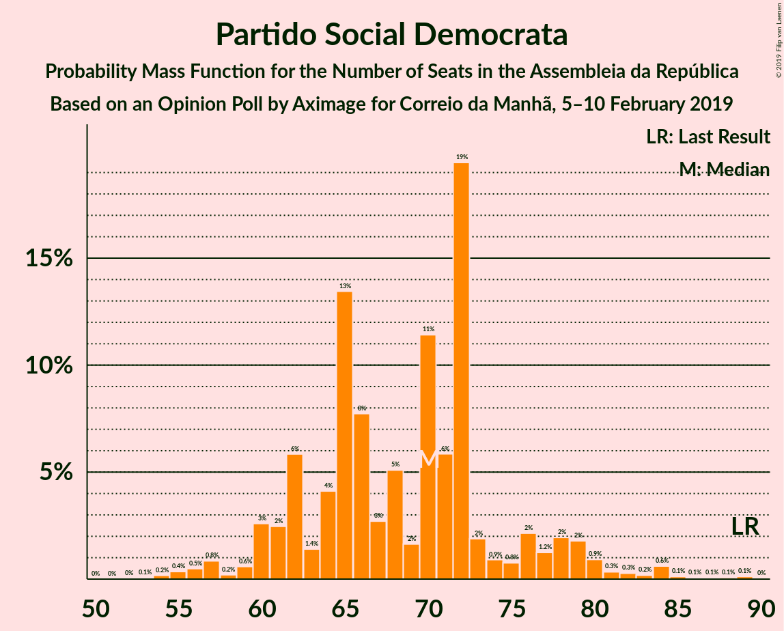

# Opinion Poll by Aximage for Correio da Manhã, 5–10 February 2019

<a href="#voting-intentions">Voting Intentions</a> | <a href="#seats">Seats</a> | <a href="#coalitions">Coalitions</a> | <a href="#technical-information">Technical Information</a>

## Voting Intentions

### Confidence Intervals

| Party | Last Result | Poll Result | 80% Confidence Interval | 90% Confidence Interval | 95% Confidence Interval | 99% Confidence Interval |
|:-----:|:-----------:|:-----------:|:-----------------------:|:-----------------------:|:-----------------------:|:-----------------------:|
| Partido Socialista | 32.3% | 36.4% | 33.9–38.9% |33.2–39.7% |32.6–40.3% |31.5–41.5% |
| Partido Social Democrata | 36.9% | 24.4% | 22.3–26.8% |21.7–27.4% |21.2–28.0% |20.1–29.2% |
| CDS–Partido Popular | 36.9% | 9.3% | 7.9–11.0% |7.6–11.5% |7.2–11.9% |6.6–12.8% |
| Bloco de Esquerda | 10.2% | 9.0% | 7.6–10.6% |7.3–11.1% |6.9–11.5% |6.3–12.4% |
| Coligação Democrática Unitária | 8.2% | 6.3% | 5.2–7.8% |4.9–8.2% |4.6–8.6% |4.1–9.3% |
| Pessoas–Animais–Natureza | 1.4% | 2.5% | 1.8–3.5% |1.7–3.8% |1.5–4.1% |1.2–4.6% |
| Aliança | 0.0% | 1.7% | 1.2–2.5% |1.0–2.8% |0.9–3.0% |0.7–3.5% |

*Note:* The poll result column reflects the actual value used in the calculations. Published results may vary slightly, and in addition be rounded to fewer digits.

## Seats

### Confidence Intervals

| Party | Last Result | Median | 80% Confidence Interval | 90% Confidence Interval | 95% Confidence Interval | 99% Confidence Interval |
|:-----:|:-----------:|:------:|:-----------------------:|:-----------------------:|:-----------------------:|:-----------------------:|
| <a href="#partido-socialista">Partido Socialista</a> | 86 | 108 | 99–114 |96–116 |95–117 |91–121 |
| <a href="#partido-social-democrata">Partido Social Democrata</a> | 89 | 70 | 62–75 |60–78 |59–80 |55–84 |
| <a href="#cds–partido-popular">CDS–Partido Popular</a> | 18 | 20 | 17–25 |13–28 |13–29 |11–30 |
| <a href="#bloco-de-esquerda">Bloco de Esquerda</a> | 19 | 18 | 14–23 |13–24 |12–25 |10–27 |
| <a href="#coligação-democrática-unitária">Coligação Democrática Unitária</a> | 17 | 12 | 8–17 |7–17 |6–18 |5–19 |
| <a href="#pessoas–animais–natureza">Pessoas–Animais–Natureza</a> | 1 | 3 | 2–4 |1–4 |1–6 |1–6 |
| <a href="#aliança">Aliança</a> | 0 | 0 | 0–2 |0–2 |0–2 |0–3 |

### Partido Socialista

*For a full overview of the results for this party, see the [Partido Socialista](party-partidosocialista.html) page.*

| Number of Seats | Probability | Accumulated | Special Marks |
|:---------------:|:-----------:|:-----------:|:-------------:|
| 86 | 0% | 100% | Last Result |
| 87 | 0% | 100% |  |
| 88 | 0% | 100% |  |
| 89 | 0.1% | 99.9% |  |
| 90 | 0.3% | 99.8% |  |
| 91 | 0.3% | 99.6% |  |
| 92 | 0.4% | 99.2% |  |
| 93 | 1.0% | 98.9% |  |
| 94 | 0.2% | 98% |  |
| 95 | 1.1% | 98% |  |
| 96 | 2% | 97% |  |
| 97 | 2% | 95% |  |
| 98 | 2% | 93% |  |
| 99 | 3% | 91% |  |
| 100 | 2% | 87% |  |
| 101 | 2% | 86% |  |
| 102 | 1.2% | 83% |  |
| 103 | 1.1% | 82% |  |
| 104 | 5% | 81% |  |
| 105 | 8% | 76% |  |
| 106 | 5% | 67% |  |
| 107 | 9% | 63% |  |
| 108 | 4% | 53% | Median |
| 109 | 8% | 49% |  |
| 110 | 6% | 41% |  |
| 111 | 12% | 35% |  |
| 112 | 6% | 23% |  |
| 113 | 3% | 17% |  |
| 114 | 4% | 14% |  |
| 115 | 4% | 10% |  |
| 116 | 3% | 6% | Majority |
| 117 | 1.1% | 3% |  |
| 118 | 0.4% | 2% |  |
| 119 | 0.1% | 1.2% |  |
| 120 | 0.1% | 1.1% |  |
| 121 | 0.5% | 0.9% |  |
| 122 | 0.1% | 0.5% |  |
| 123 | 0.1% | 0.4% |  |
| 124 | 0.2% | 0.3% |  |
| 125 | 0% | 0.1% |  |
| 126 | 0% | 0.1% |  |
| 127 | 0% | 0.1% |  |
| 128 | 0% | 0% |  |

### Partido Social Democrata

*For a full overview of the results for this party, see the [Partido Social Democrata](party-partidosocialdemocrata.html) page.*

| Number of Seats | Probability | Accumulated | Special Marks |
|:---------------:|:-----------:|:-----------:|:-------------:|
| 53 | 0.1% | 100% |  |
| 54 | 0.2% | 99.9% |  |
| 55 | 0.4% | 99.7% |  |
| 56 | 0.5% | 99.4% |  |
| 57 | 0.8% | 98.9% |  |
| 58 | 0.2% | 98% |  |
| 59 | 0.6% | 98% |  |
| 60 | 3% | 97% |  |
| 61 | 2% | 95% |  |
| 62 | 6% | 92% |  |
| 63 | 1.4% | 86% |  |
| 64 | 4% | 85% |  |
| 65 | 13% | 81% |  |
| 66 | 8% | 67% |  |
| 67 | 3% | 60% |  |
| 68 | 5% | 57% |  |
| 69 | 2% | 52% |  |
| 70 | 11% | 50% | Median |
| 71 | 6% | 39% |  |
| 72 | 19% | 33% |  |
| 73 | 2% | 13% |  |
| 74 | 0.9% | 12% |  |
| 75 | 0.8% | 11% |  |
| 76 | 2% | 10% |  |
| 77 | 1.2% | 8% |  |
| 78 | 2% | 7% |  |
| 79 | 2% | 5% |  |
| 80 | 0.9% | 3% |  |
| 81 | 0.3% | 2% |  |
| 82 | 0.3% | 2% |  |
| 83 | 0.2% | 1.3% |  |
| 84 | 0.6% | 1.1% |  |
| 85 | 0.1% | 0.5% |  |
| 86 | 0.1% | 0.3% |  |
| 87 | 0.1% | 0.3% |  |
| 88 | 0.1% | 0.2% |  |
| 89 | 0.1% | 0.2% | Last Result |
| 90 | 0% | 0% |  |

### CDS–Partido Popular

*For a full overview of the results for this party, see the [CDS–Partido Popular](party-cds–partidopopular.html) page.*

| Number of Seats | Probability | Accumulated | Special Marks |
|:---------------:|:-----------:|:-----------:|:-------------:|
| 9 | 0.1% | 100% |  |
| 10 | 0.2% | 99.9% |  |
| 11 | 0.9% | 99.7% |  |
| 12 | 1.0% | 98.8% |  |
| 13 | 3% | 98% |  |
| 14 | 0.7% | 94% |  |
| 15 | 0.4% | 94% |  |
| 16 | 1.2% | 93% |  |
| 17 | 6% | 92% |  |
| 18 | 15% | 86% | Last Result |
| 19 | 18% | 71% |  |
| 20 | 19% | 53% | Median |
| 21 | 10% | 35% |  |
| 22 | 3% | 25% |  |
| 23 | 3% | 22% |  |
| 24 | 9% | 19% |  |
| 25 | 3% | 11% |  |
| 26 | 1.4% | 8% |  |
| 27 | 1.2% | 7% |  |
| 28 | 2% | 5% |  |
| 29 | 3% | 4% |  |
| 30 | 0.4% | 0.7% |  |
| 31 | 0.2% | 0.3% |  |
| 32 | 0.1% | 0.1% |  |
| 33 | 0% | 0.1% |  |
| 34 | 0% | 0% |  |

### Bloco de Esquerda

*For a full overview of the results for this party, see the [Bloco de Esquerda](party-blocodeesquerda.html) page.*

| Number of Seats | Probability | Accumulated | Special Marks |
|:---------------:|:-----------:|:-----------:|:-------------:|
| 9 | 0.1% | 100% |  |
| 10 | 0.4% | 99.9% |  |
| 11 | 0.9% | 99.5% |  |
| 12 | 2% | 98.6% |  |
| 13 | 2% | 97% |  |
| 14 | 8% | 95% |  |
| 15 | 7% | 87% |  |
| 16 | 8% | 80% |  |
| 17 | 14% | 72% |  |
| 18 | 29% | 59% | Median |
| 19 | 8% | 29% | Last Result |
| 20 | 4% | 22% |  |
| 21 | 2% | 17% |  |
| 22 | 2% | 15% |  |
| 23 | 5% | 13% |  |
| 24 | 5% | 8% |  |
| 25 | 1.3% | 3% |  |
| 26 | 1.2% | 2% |  |
| 27 | 0.6% | 0.8% |  |
| 28 | 0.2% | 0.2% |  |
| 29 | 0% | 0% |  |

### Coligação Democrática Unitária

*For a full overview of the results for this party, see the [Coligação Democrática Unitária](party-coligaçãodemocráticaunitária.html) page.*

| Number of Seats | Probability | Accumulated | Special Marks |
|:---------------:|:-----------:|:-----------:|:-------------:|
| 5 | 1.3% | 100% |  |
| 6 | 2% | 98.7% |  |
| 7 | 4% | 97% |  |
| 8 | 6% | 93% |  |
| 9 | 13% | 87% |  |
| 10 | 5% | 74% |  |
| 11 | 5% | 69% |  |
| 12 | 22% | 63% | Median |
| 13 | 6% | 41% |  |
| 14 | 18% | 35% |  |
| 15 | 5% | 17% |  |
| 16 | 0.7% | 12% |  |
| 17 | 8% | 11% | Last Result |
| 18 | 2% | 3% |  |
| 19 | 0.5% | 0.9% |  |
| 20 | 0.2% | 0.4% |  |
| 21 | 0.2% | 0.2% |  |
| 22 | 0% | 0% |  |

### Pessoas–Animais–Natureza

*For a full overview of the results for this party, see the [Pessoas–Animais–Natureza](party-pessoas–animais–natureza.html) page.*

| Number of Seats | Probability | Accumulated | Special Marks |
|:---------------:|:-----------:|:-----------:|:-------------:|
| 0 | 0.3% | 100% |  |
| 1 | 7% | 99.7% | Last Result |
| 2 | 39% | 93% |  |
| 3 | 31% | 53% | Median |
| 4 | 17% | 22% |  |
| 5 | 0.7% | 5% |  |
| 6 | 4% | 4% |  |
| 7 | 0% | 0.1% |  |
| 8 | 0% | 0.1% |  |
| 9 | 0% | 0% |  |

### Aliança

*For a full overview of the results for this party, see the [Aliança](party-aliança.html) page.*

| Number of Seats | Probability | Accumulated | Special Marks |
|:---------------:|:-----------:|:-----------:|:-------------:|
| 0 | 52% | 100% | Last Result, Median |
| 1 | 3% | 48% |  |
| 2 | 44% | 45% |  |
| 3 | 0.4% | 0.8% |  |
| 4 | 0.3% | 0.4% |  |
| 5 | 0.1% | 0.1% |  |
| 6 | 0% | 0% |  |

## Coalitions

### Confidence Intervals

| Coalition | Last Result | Median | Majority? | 80% Confidence Interval | 90% Confidence Interval | 95% Confidence Interval | 99% Confidence Interval |
|:---------:|:-----------:|:------:|:---------:|:-----------------------:|:-----------------------:|:-----------------------:|:-----------------------:|
| Partido Socialista – Bloco de Esquerda – Coligação Democrática Unitária | 122 | 137 | 100% | 130–144 | 128–146 | 125–148 | 120–152 |
| Partido Socialista – Bloco de Esquerda | 105 | 125 | 95% | 119–132 | 116–133 | 114–136 | 109–141 |
| Partido Socialista – Coligação Democrática Unitária | 103 | 120 | 80% | 110–126 | 107–127 | 106–129 | 101–133 |
| Partido Socialista | 86 | 108 | 6% | 99–114 | 96–116 | 95–117 | 91–121 |
| Partido Social Democrata – CDS–Partido Popular | 107 | 89 | 0% | 82–96 | 81–99 | 78–102 | 75–106 |

### Partido Socialista – Bloco de Esquerda – Coligação Democrática Unitária

| Number of Seats | Probability | Accumulated | Special Marks |
|:---------------:|:-----------:|:-----------:|:-------------:|
| 117 | 0.1% | 100% |  |
| 118 | 0.1% | 99.8% |  |
| 119 | 0.2% | 99.8% |  |
| 120 | 0.1% | 99.6% |  |
| 121 | 0.2% | 99.5% |  |
| 122 | 0.2% | 99.3% | Last Result |
| 123 | 0.6% | 99.1% |  |
| 124 | 0.9% | 98.5% |  |
| 125 | 0.7% | 98% |  |
| 126 | 0.6% | 97% |  |
| 127 | 1.0% | 96% |  |
| 128 | 2% | 95% |  |
| 129 | 2% | 93% |  |
| 130 | 2% | 91% |  |
| 131 | 1.5% | 89% |  |
| 132 | 2% | 88% |  |
| 133 | 11% | 86% |  |
| 134 | 10% | 74% |  |
| 135 | 2% | 65% |  |
| 136 | 4% | 62% |  |
| 137 | 9% | 58% |  |
| 138 | 7% | 49% | Median |
| 139 | 6% | 42% |  |
| 140 | 3% | 36% |  |
| 141 | 3% | 33% |  |
| 142 | 2% | 31% |  |
| 143 | 9% | 28% |  |
| 144 | 13% | 19% |  |
| 145 | 0.8% | 6% |  |
| 146 | 0.6% | 5% |  |
| 147 | 1.2% | 4% |  |
| 148 | 1.5% | 3% |  |
| 149 | 0.5% | 2% |  |
| 150 | 0.1% | 1.2% |  |
| 151 | 0.3% | 1.1% |  |
| 152 | 0.4% | 0.8% |  |
| 153 | 0.2% | 0.4% |  |
| 154 | 0% | 0.2% |  |
| 155 | 0.1% | 0.1% |  |
| 156 | 0% | 0.1% |  |
| 157 | 0% | 0.1% |  |
| 158 | 0% | 0% |  |

### Partido Socialista – Bloco de Esquerda

| Number of Seats | Probability | Accumulated | Special Marks |
|:---------------:|:-----------:|:-----------:|:-------------:|
| 105 | 0% | 100% | Last Result |
| 106 | 0% | 100% |  |
| 107 | 0% | 99.9% |  |
| 108 | 0.2% | 99.9% |  |
| 109 | 0.2% | 99.7% |  |
| 110 | 0.2% | 99.5% |  |
| 111 | 0.1% | 99.3% |  |
| 112 | 0.5% | 99.2% |  |
| 113 | 0.5% | 98.7% |  |
| 114 | 1.4% | 98% |  |
| 115 | 2% | 97% |  |
| 116 | 1.3% | 95% | Majority |
| 117 | 0.9% | 94% |  |
| 118 | 3% | 93% |  |
| 119 | 3% | 90% |  |
| 120 | 2% | 87% |  |
| 121 | 8% | 86% |  |
| 122 | 9% | 78% |  |
| 123 | 4% | 69% |  |
| 124 | 7% | 65% |  |
| 125 | 11% | 57% |  |
| 126 | 3% | 47% | Median |
| 127 | 5% | 43% |  |
| 128 | 6% | 39% |  |
| 129 | 6% | 33% |  |
| 130 | 11% | 27% |  |
| 131 | 3% | 16% |  |
| 132 | 5% | 13% |  |
| 133 | 3% | 8% |  |
| 134 | 0.9% | 5% |  |
| 135 | 1.4% | 4% |  |
| 136 | 1.1% | 3% |  |
| 137 | 0.3% | 2% |  |
| 138 | 0.2% | 1.3% |  |
| 139 | 0.2% | 1.1% |  |
| 140 | 0.1% | 0.9% |  |
| 141 | 0.3% | 0.8% |  |
| 142 | 0.2% | 0.5% |  |
| 143 | 0.2% | 0.3% |  |
| 144 | 0% | 0.1% |  |
| 145 | 0% | 0.1% |  |
| 146 | 0% | 0.1% |  |
| 147 | 0% | 0% |  |

### Partido Socialista – Coligação Democrática Unitária

| Number of Seats | Probability | Accumulated | Special Marks |
|:---------------:|:-----------:|:-----------:|:-------------:|
| 99 | 0.2% | 100% |  |
| 100 | 0.2% | 99.8% |  |
| 101 | 0.3% | 99.5% |  |
| 102 | 0.3% | 99.2% |  |
| 103 | 0.4% | 99.0% | Last Result |
| 104 | 0.4% | 98.6% |  |
| 105 | 0.3% | 98% |  |
| 106 | 1.0% | 98% |  |
| 107 | 2% | 97% |  |
| 108 | 0.8% | 95% |  |
| 109 | 1.2% | 94% |  |
| 110 | 4% | 93% |  |
| 111 | 3% | 89% |  |
| 112 | 0.9% | 86% |  |
| 113 | 1.0% | 85% |  |
| 114 | 1.0% | 84% |  |
| 115 | 3% | 83% |  |
| 116 | 6% | 80% | Majority |
| 117 | 9% | 74% |  |
| 118 | 8% | 65% |  |
| 119 | 5% | 57% |  |
| 120 | 3% | 52% | Median |
| 121 | 6% | 48% |  |
| 122 | 2% | 42% |  |
| 123 | 7% | 40% |  |
| 124 | 8% | 33% |  |
| 125 | 8% | 25% |  |
| 126 | 10% | 17% |  |
| 127 | 2% | 7% |  |
| 128 | 2% | 4% |  |
| 129 | 0.8% | 3% |  |
| 130 | 0.4% | 2% |  |
| 131 | 0.3% | 1.4% |  |
| 132 | 0.6% | 1.1% |  |
| 133 | 0.3% | 0.5% |  |
| 134 | 0.1% | 0.2% |  |
| 135 | 0.1% | 0.2% |  |
| 136 | 0% | 0.1% |  |
| 137 | 0% | 0.1% |  |
| 138 | 0% | 0% |  |

### Partido Socialista

| Number of Seats | Probability | Accumulated | Special Marks |
|:---------------:|:-----------:|:-----------:|:-------------:|
| 86 | 0% | 100% | Last Result |
| 87 | 0% | 100% |  |
| 88 | 0% | 100% |  |
| 89 | 0.1% | 99.9% |  |
| 90 | 0.3% | 99.8% |  |
| 91 | 0.3% | 99.6% |  |
| 92 | 0.4% | 99.2% |  |
| 93 | 1.0% | 98.9% |  |
| 94 | 0.2% | 98% |  |
| 95 | 1.1% | 98% |  |
| 96 | 2% | 97% |  |
| 97 | 2% | 95% |  |
| 98 | 2% | 93% |  |
| 99 | 3% | 91% |  |
| 100 | 2% | 87% |  |
| 101 | 2% | 86% |  |
| 102 | 1.2% | 83% |  |
| 103 | 1.1% | 82% |  |
| 104 | 5% | 81% |  |
| 105 | 8% | 76% |  |
| 106 | 5% | 67% |  |
| 107 | 9% | 63% |  |
| 108 | 4% | 53% | Median |
| 109 | 8% | 49% |  |
| 110 | 6% | 41% |  |
| 111 | 12% | 35% |  |
| 112 | 6% | 23% |  |
| 113 | 3% | 17% |  |
| 114 | 4% | 14% |  |
| 115 | 4% | 10% |  |
| 116 | 3% | 6% | Majority |
| 117 | 1.1% | 3% |  |
| 118 | 0.4% | 2% |  |
| 119 | 0.1% | 1.2% |  |
| 120 | 0.1% | 1.1% |  |
| 121 | 0.5% | 0.9% |  |
| 122 | 0.1% | 0.5% |  |
| 123 | 0.1% | 0.4% |  |
| 124 | 0.2% | 0.3% |  |
| 125 | 0% | 0.1% |  |
| 126 | 0% | 0.1% |  |
| 127 | 0% | 0.1% |  |
| 128 | 0% | 0% |  |

### Partido Social Democrata – CDS–Partido Popular

| Number of Seats | Probability | Accumulated | Special Marks |
|:---------------:|:-----------:|:-----------:|:-------------:|
| 70 | 0% | 100% |  |
| 71 | 0% | 99.9% |  |
| 72 | 0.1% | 99.9% |  |
| 73 | 0.1% | 99.8% |  |
| 74 | 0.1% | 99.8% |  |
| 75 | 0.1% | 99.6% |  |
| 76 | 0.7% | 99.5% |  |
| 77 | 0.8% | 98.8% |  |
| 78 | 1.0% | 98% |  |
| 79 | 0.6% | 97% |  |
| 80 | 0.8% | 96% |  |
| 81 | 5% | 95% |  |
| 82 | 6% | 90% |  |
| 83 | 8% | 84% |  |
| 84 | 3% | 76% |  |
| 85 | 5% | 73% |  |
| 86 | 2% | 68% |  |
| 87 | 3% | 66% |  |
| 88 | 8% | 63% |  |
| 89 | 11% | 54% |  |
| 90 | 2% | 43% | Median |
| 91 | 7% | 41% |  |
| 92 | 9% | 34% |  |
| 93 | 9% | 25% |  |
| 94 | 3% | 16% |  |
| 95 | 2% | 13% |  |
| 96 | 2% | 11% |  |
| 97 | 3% | 10% |  |
| 98 | 1.2% | 7% |  |
| 99 | 2% | 6% |  |
| 100 | 0.5% | 3% |  |
| 101 | 0.3% | 3% |  |
| 102 | 0.7% | 3% |  |
| 103 | 0.4% | 2% |  |
| 104 | 0.9% | 1.5% |  |
| 105 | 0% | 0.6% |  |
| 106 | 0.1% | 0.6% |  |
| 107 | 0.2% | 0.5% | Last Result |
| 108 | 0.1% | 0.3% |  |
| 109 | 0% | 0.2% |  |
| 110 | 0% | 0.1% |  |
| 111 | 0.1% | 0.1% |  |
| 112 | 0% | 0% |  |

## Technical Information

### Opinion Poll

+ **Polling firm:** Aximage
+ **Commissioner(s):** Correio da Manhã
+ **Fieldwork period:** 5–10 February 2019

### Calculations

+ **Sample size:** 602
+ **Simulations done:** 131,072
+ **Error estimate:** 1.84%

