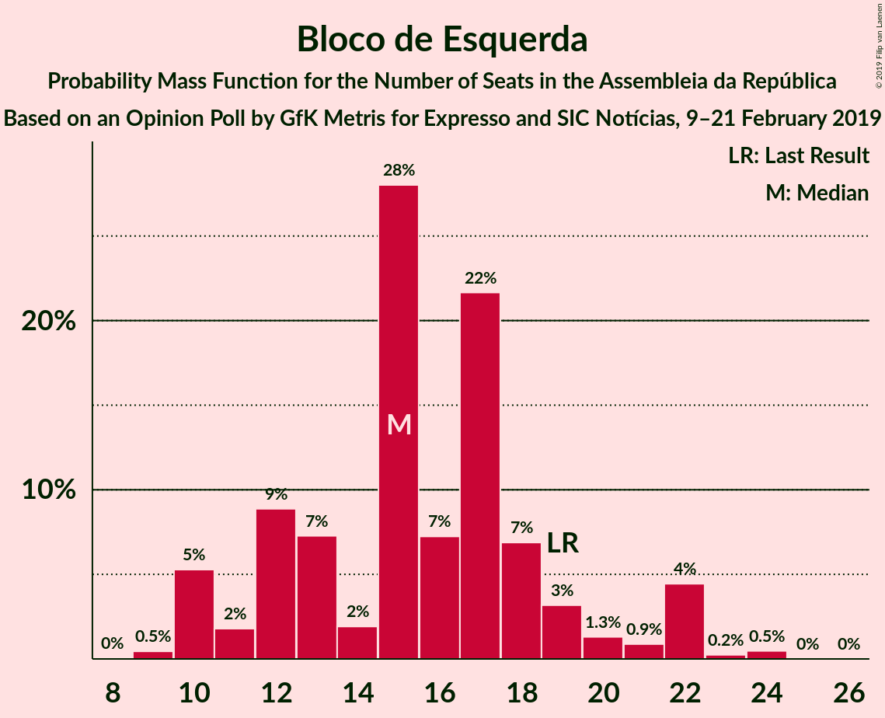
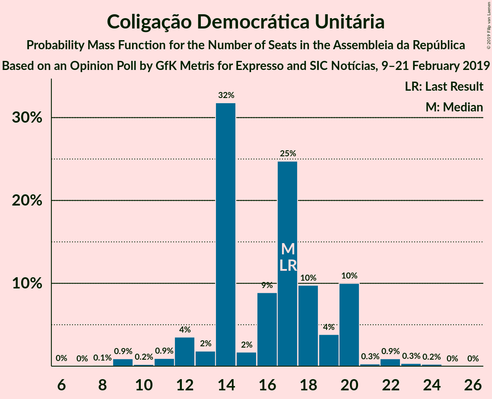
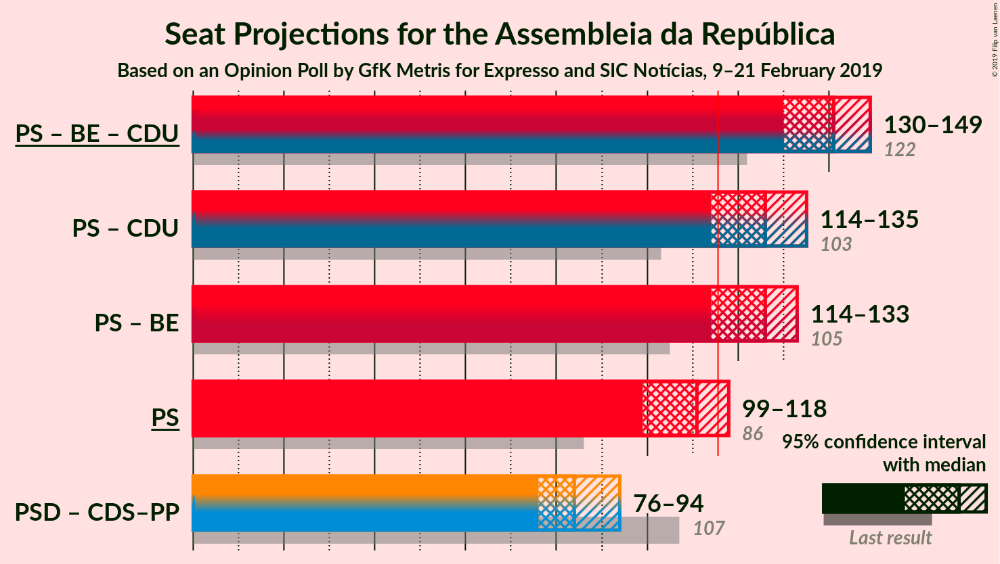

# Opinion Poll by GfK Metris for Expresso and SIC Notícias, 9–21 February 2019

<a href="#voting-intentions">Voting Intentions</a> | <a href="#seats">Seats</a> | <a href="#coalitions">Coalitions</a> | <a href="#technical-information">Technical Information</a>

## Voting Intentions

### Confidence Intervals

| Party | Last Result | Poll Result | 80% Confidence Interval | 90% Confidence Interval | 95% Confidence Interval | 99% Confidence Interval |
|:-----:|:-----------:|:-----------:|:-----------------------:|:-----------------------:|:-----------------------:|:-----------------------:|
| Partido Socialista | 32.3% | 37.0% | 34.8–39.2% |34.2–39.8% |33.7–40.4% |32.7–41.4% |
| Partido Social Democrata | 36.9% | 25.0% | 23.1–27.0% |22.5–27.6% |22.1–28.1% |21.2–29.1% |
| Bloco de Esquerda | 10.2% | 8.0% | 6.9–9.4% |6.6–9.7% |6.3–10.1% |5.8–10.8% |
| CDS–Partido Popular | 36.9% | 8.0% | 6.9–9.4% |6.6–9.7% |6.3–10.1% |5.8–10.8% |
| Coligação Democrática Unitária | 8.2% | 8.0% | 6.9–9.4% |6.6–9.7% |6.3–10.1% |5.8–10.8% |
| Pessoas–Animais–Natureza | 1.4% | 3.0% | 2.3–3.9% |2.2–4.2% |2.0–4.4% |1.8–4.9% |
| Aliança | 0.0% | 2.0% | 1.5–2.8% |1.3–3.0% |1.2–3.2% |1.0–3.7% |

*Note:* The poll result column reflects the actual value used in the calculations. Published results may vary slightly, and in addition be rounded to fewer digits.

## Seats

### Confidence Intervals

| Party | Last Result | Median | 80% Confidence Interval | 90% Confidence Interval | 95% Confidence Interval | 99% Confidence Interval |
|:-----:|:-----------:|:------:|:-----------------------:|:-----------------------:|:-----------------------:|:-----------------------:|
| <a href="#partido-socialista">Partido Socialista</a> | 86 | 107 | 100–114 |99–115 |97–116 |94–120 |
| <a href="#partido-social-democrata">Partido Social Democrata</a> | 89 | 71 | 64–77 |62–79 |61–80 |58–83 |
| <a href="#bloco-de-esquerda">Bloco de Esquerda</a> | 19 | 17 | 10–19 |10–21 |10–22 |10–23 |
| <a href="#cds–partido-popular">CDS–Partido Popular</a> | 18 | 16 | 13–20 |12–20 |10–23 |8–25 |
| <a href="#coligação-democrática-unitária">Coligação Democrática Unitária</a> | 17 | 16 | 14–19 |13–20 |11–20 |9–22 |
| <a href="#pessoas–animais–natureza">Pessoas–Animais–Natureza</a> | 1 | 3 | 2–5 |2–6 |2–6 |1–6 |
| <a href="#aliança">Aliança</a> | 0 | 1 | 0–2 |0–2 |0–2 |0–3 |

### Partido Socialista

*For a full overview of the results for this party, see the [Partido Socialista](party-partidosocialista.html) page.*

| Number of Seats | Probability | Accumulated | Special Marks |
|:---------------:|:-----------:|:-----------:|:-------------:|
| 86 | 0% | 100% | Last Result |
| 87 | 0% | 100% |  |
| 88 | 0% | 100% |  |
| 89 | 0% | 100% |  |
| 90 | 0.1% | 99.9% |  |
| 91 | 0.1% | 99.9% |  |
| 92 | 0.1% | 99.8% |  |
| 93 | 0.2% | 99.7% |  |
| 94 | 0.3% | 99.5% |  |
| 95 | 0.3% | 99.2% |  |
| 96 | 0.8% | 99.0% |  |
| 97 | 1.1% | 98% |  |
| 98 | 1.3% | 97% |  |
| 99 | 2% | 96% |  |
| 100 | 4% | 94% |  |
| 101 | 4% | 90% |  |
| 102 | 4% | 86% |  |
| 103 | 5% | 82% |  |
| 104 | 4% | 77% |  |
| 105 | 8% | 73% |  |
| 106 | 8% | 65% |  |
| 107 | 7% | 57% | Median |
| 108 | 8% | 50% |  |
| 109 | 10% | 42% |  |
| 110 | 5% | 32% |  |
| 111 | 6% | 27% |  |
| 112 | 6% | 20% |  |
| 113 | 2% | 15% |  |
| 114 | 5% | 13% |  |
| 115 | 4% | 8% |  |
| 116 | 2% | 4% | Majority |
| 117 | 1.1% | 2% |  |
| 118 | 0.5% | 1.4% |  |
| 119 | 0.3% | 0.9% |  |
| 120 | 0.2% | 0.7% |  |
| 121 | 0.2% | 0.4% |  |
| 122 | 0.1% | 0.3% |  |
| 123 | 0.1% | 0.2% |  |
| 124 | 0.1% | 0.1% |  |
| 125 | 0% | 0.1% |  |
| 126 | 0% | 0% |  |

### Partido Social Democrata

*For a full overview of the results for this party, see the [Partido Social Democrata](party-partidosocialdemocrata.html) page.*

| Number of Seats | Probability | Accumulated | Special Marks |
|:---------------:|:-----------:|:-----------:|:-------------:|
| 56 | 0.1% | 100% |  |
| 57 | 0.2% | 99.8% |  |
| 58 | 0.2% | 99.7% |  |
| 59 | 0.5% | 99.5% |  |
| 60 | 1.0% | 99.0% |  |
| 61 | 2% | 98% |  |
| 62 | 3% | 96% |  |
| 63 | 3% | 94% |  |
| 64 | 3% | 91% |  |
| 65 | 6% | 88% |  |
| 66 | 7% | 82% |  |
| 67 | 7% | 75% |  |
| 68 | 3% | 68% |  |
| 69 | 7% | 65% |  |
| 70 | 5% | 58% |  |
| 71 | 9% | 54% | Median |
| 72 | 7% | 45% |  |
| 73 | 6% | 38% |  |
| 74 | 6% | 32% |  |
| 75 | 9% | 25% |  |
| 76 | 5% | 16% |  |
| 77 | 3% | 11% |  |
| 78 | 3% | 8% |  |
| 79 | 2% | 5% |  |
| 80 | 1.3% | 3% |  |
| 81 | 0.5% | 2% |  |
| 82 | 0.5% | 1.4% |  |
| 83 | 0.4% | 0.8% |  |
| 84 | 0.2% | 0.4% |  |
| 85 | 0.1% | 0.2% |  |
| 86 | 0% | 0.1% |  |
| 87 | 0% | 0.1% |  |
| 88 | 0% | 0.1% |  |
| 89 | 0% | 0% | Last Result |

### Bloco de Esquerda

*For a full overview of the results for this party, see the [Bloco de Esquerda](party-blocodeesquerda.html) page.*

| Number of Seats | Probability | Accumulated | Special Marks |
|:---------------:|:-----------:|:-----------:|:-------------:|
| 8 | 0.1% | 100% |  |
| 9 | 0.4% | 99.9% |  |
| 10 | 12% | 99.5% |  |
| 11 | 6% | 88% |  |
| 12 | 4% | 82% |  |
| 13 | 4% | 78% |  |
| 14 | 3% | 74% |  |
| 15 | 3% | 71% |  |
| 16 | 5% | 68% |  |
| 17 | 41% | 62% | Median |
| 18 | 10% | 21% |  |
| 19 | 3% | 11% | Last Result |
| 20 | 2% | 8% |  |
| 21 | 3% | 6% |  |
| 22 | 1.5% | 3% |  |
| 23 | 1.3% | 1.5% |  |
| 24 | 0.1% | 0.1% |  |
| 25 | 0% | 0% |  |

### CDS–Partido Popular

*For a full overview of the results for this party, see the [CDS–Partido Popular](party-cds–partidopopular.html) page.*

| Number of Seats | Probability | Accumulated | Special Marks |
|:---------------:|:-----------:|:-----------:|:-------------:|
| 7 | 0% | 100% |  |
| 8 | 0.9% | 99.9% |  |
| 9 | 0.5% | 99.0% |  |
| 10 | 1.2% | 98.5% |  |
| 11 | 2% | 97% |  |
| 12 | 3% | 95% |  |
| 13 | 14% | 92% |  |
| 14 | 13% | 78% |  |
| 15 | 10% | 65% |  |
| 16 | 8% | 55% | Median |
| 17 | 16% | 47% |  |
| 18 | 14% | 31% | Last Result |
| 19 | 4% | 17% |  |
| 20 | 8% | 13% |  |
| 21 | 0.9% | 5% |  |
| 22 | 0.8% | 4% |  |
| 23 | 0.8% | 3% |  |
| 24 | 1.0% | 2% |  |
| 25 | 1.1% | 1.3% |  |
| 26 | 0% | 0.2% |  |
| 27 | 0% | 0.2% |  |
| 28 | 0.1% | 0.2% |  |
| 29 | 0% | 0% |  |

### Coligação Democrática Unitária

*For a full overview of the results for this party, see the [Coligação Democrática Unitária](party-coligaçãodemocráticaunitária.html) page.*

| Number of Seats | Probability | Accumulated | Special Marks |
|:---------------:|:-----------:|:-----------:|:-------------:|
| 7 | 0% | 100% |  |
| 8 | 0.1% | 99.9% |  |
| 9 | 0.7% | 99.9% |  |
| 10 | 0.7% | 99.2% |  |
| 11 | 2% | 98.6% |  |
| 12 | 1.2% | 97% |  |
| 13 | 5% | 96% |  |
| 14 | 26% | 91% |  |
| 15 | 6% | 65% |  |
| 16 | 11% | 60% | Median |
| 17 | 25% | 49% | Last Result |
| 18 | 11% | 23% |  |
| 19 | 4% | 12% |  |
| 20 | 5% | 8% |  |
| 21 | 2% | 2% |  |
| 22 | 0.2% | 0.7% |  |
| 23 | 0.2% | 0.5% |  |
| 24 | 0.2% | 0.3% |  |
| 25 | 0% | 0% |  |

### Pessoas–Animais–Natureza

*For a full overview of the results for this party, see the [Pessoas–Animais–Natureza](party-pessoas–animais–natureza.html) page.*

| Number of Seats | Probability | Accumulated | Special Marks |
|:---------------:|:-----------:|:-----------:|:-------------:|
| 1 | 1.3% | 100% | Last Result |
| 2 | 22% | 98.7% |  |
| 3 | 36% | 77% | Median |
| 4 | 27% | 41% |  |
| 5 | 3% | 13% |  |
| 6 | 10% | 10% |  |
| 7 | 0.2% | 0.3% |  |
| 8 | 0.1% | 0.1% |  |
| 9 | 0% | 0% |  |

### Aliança

*For a full overview of the results for this party, see the [Aliança](party-aliança.html) page.*

| Number of Seats | Probability | Accumulated | Special Marks |
|:---------------:|:-----------:|:-----------:|:-------------:|
| 0 | 47% | 100% | Last Result |
| 1 | 8% | 53% | Median |
| 2 | 44% | 45% |  |
| 3 | 0.6% | 1.0% |  |
| 4 | 0.3% | 0.4% |  |
| 5 | 0% | 0.1% |  |
| 6 | 0% | 0% |  |

## Coalitions

### Confidence Intervals

| Coalition | Last Result | Median | Majority? | 80% Confidence Interval | 90% Confidence Interval | 95% Confidence Interval | 99% Confidence Interval |
|:---------:|:-----------:|:------:|:---------:|:-----------------------:|:-----------------------:|:-----------------------:|:-----------------------:|
| Partido Socialista – Bloco de Esquerda – Coligação Democrática Unitária | 122 | 139 | 100% | 133–145 | 131–147 | 129–149 | 126–152 |
| Partido Socialista – Bloco de Esquerda | 105 | 123 | 91% | 116–131 | 114–132 | 113–133 | 109–136 |
| Partido Socialista – Coligação Democrática Unitária | 103 | 123 | 94% | 117–129 | 115–131 | 113–133 | 110–136 |
| Partido Socialista | 86 | 107 | 4% | 100–114 | 99–115 | 97–116 | 94–120 |
| Partido Social Democrata – CDS–Partido Popular | 107 | 87 | 0% | 80–93 | 78–95 | 77–96 | 73–99 |

### Partido Socialista – Bloco de Esquerda – Coligação Democrática Unitária

| Number of Seats | Probability | Accumulated | Special Marks |
|:---------------:|:-----------:|:-----------:|:-------------:|
| 121 | 0% | 100% |  |
| 122 | 0% | 99.9% | Last Result |
| 123 | 0.1% | 99.9% |  |
| 124 | 0.1% | 99.8% |  |
| 125 | 0.1% | 99.7% |  |
| 126 | 0.2% | 99.6% |  |
| 127 | 0.4% | 99.4% |  |
| 128 | 1.0% | 98.9% |  |
| 129 | 0.9% | 98% |  |
| 130 | 1.3% | 97% |  |
| 131 | 2% | 96% |  |
| 132 | 3% | 94% |  |
| 133 | 4% | 91% |  |
| 134 | 5% | 87% |  |
| 135 | 6% | 82% |  |
| 136 | 8% | 76% |  |
| 137 | 6% | 68% |  |
| 138 | 9% | 61% |  |
| 139 | 8% | 52% |  |
| 140 | 6% | 44% | Median |
| 141 | 6% | 39% |  |
| 142 | 8% | 33% |  |
| 143 | 6% | 25% |  |
| 144 | 4% | 20% |  |
| 145 | 5% | 15% |  |
| 146 | 4% | 10% |  |
| 147 | 2% | 6% |  |
| 148 | 1.1% | 4% |  |
| 149 | 1.1% | 3% |  |
| 150 | 0.7% | 2% |  |
| 151 | 0.4% | 1.1% |  |
| 152 | 0.3% | 0.7% |  |
| 153 | 0.1% | 0.4% |  |
| 154 | 0.1% | 0.2% |  |
| 155 | 0.1% | 0.2% |  |
| 156 | 0% | 0.1% |  |
| 157 | 0% | 0% |  |

### Partido Socialista – Bloco de Esquerda

| Number of Seats | Probability | Accumulated | Special Marks |
|:---------------:|:-----------:|:-----------:|:-------------:|
| 104 | 0% | 100% |  |
| 105 | 0% | 99.9% | Last Result |
| 106 | 0.1% | 99.9% |  |
| 107 | 0.1% | 99.9% |  |
| 108 | 0.2% | 99.8% |  |
| 109 | 0.1% | 99.6% |  |
| 110 | 0.4% | 99.5% |  |
| 111 | 0.8% | 99.1% |  |
| 112 | 0.5% | 98% |  |
| 113 | 1.0% | 98% |  |
| 114 | 2% | 97% |  |
| 115 | 3% | 94% |  |
| 116 | 4% | 91% | Majority |
| 117 | 4% | 87% |  |
| 118 | 5% | 83% |  |
| 119 | 5% | 78% |  |
| 120 | 6% | 73% |  |
| 121 | 5% | 67% |  |
| 122 | 7% | 62% |  |
| 123 | 8% | 55% |  |
| 124 | 8% | 47% | Median |
| 125 | 7% | 39% |  |
| 126 | 7% | 32% |  |
| 127 | 4% | 25% |  |
| 128 | 5% | 21% |  |
| 129 | 5% | 16% |  |
| 130 | 2% | 12% |  |
| 131 | 4% | 10% |  |
| 132 | 2% | 6% |  |
| 133 | 2% | 4% |  |
| 134 | 0.8% | 2% |  |
| 135 | 0.5% | 1.1% |  |
| 136 | 0.2% | 0.7% |  |
| 137 | 0.2% | 0.5% |  |
| 138 | 0.1% | 0.3% |  |
| 139 | 0.1% | 0.2% |  |
| 140 | 0% | 0.1% |  |
| 141 | 0% | 0.1% |  |
| 142 | 0% | 0% |  |

### Partido Socialista – Coligação Democrática Unitária

| Number of Seats | Probability | Accumulated | Special Marks |
|:---------------:|:-----------:|:-----------:|:-------------:|
| 103 | 0% | 100% | Last Result |
| 104 | 0% | 100% |  |
| 105 | 0% | 100% |  |
| 106 | 0% | 99.9% |  |
| 107 | 0% | 99.9% |  |
| 108 | 0.1% | 99.8% |  |
| 109 | 0.1% | 99.7% |  |
| 110 | 0.3% | 99.6% |  |
| 111 | 0.4% | 99.3% |  |
| 112 | 0.6% | 98.9% |  |
| 113 | 2% | 98% |  |
| 114 | 1.1% | 97% |  |
| 115 | 1.5% | 96% |  |
| 116 | 2% | 94% | Majority |
| 117 | 5% | 92% |  |
| 118 | 5% | 87% |  |
| 119 | 5% | 82% |  |
| 120 | 5% | 77% |  |
| 121 | 8% | 72% |  |
| 122 | 7% | 64% |  |
| 123 | 9% | 57% | Median |
| 124 | 7% | 48% |  |
| 125 | 8% | 42% |  |
| 126 | 5% | 33% |  |
| 127 | 6% | 28% |  |
| 128 | 6% | 21% |  |
| 129 | 6% | 16% |  |
| 130 | 3% | 10% |  |
| 131 | 3% | 7% |  |
| 132 | 2% | 4% |  |
| 133 | 0.7% | 3% |  |
| 134 | 0.7% | 2% |  |
| 135 | 0.5% | 1.3% |  |
| 136 | 0.3% | 0.8% |  |
| 137 | 0.2% | 0.5% |  |
| 138 | 0.1% | 0.3% |  |
| 139 | 0.1% | 0.2% |  |
| 140 | 0.1% | 0.1% |  |
| 141 | 0% | 0% |  |

### Partido Socialista

| Number of Seats | Probability | Accumulated | Special Marks |
|:---------------:|:-----------:|:-----------:|:-------------:|
| 86 | 0% | 100% | Last Result |
| 87 | 0% | 100% |  |
| 88 | 0% | 100% |  |
| 89 | 0% | 100% |  |
| 90 | 0.1% | 99.9% |  |
| 91 | 0.1% | 99.9% |  |
| 92 | 0.1% | 99.8% |  |
| 93 | 0.2% | 99.7% |  |
| 94 | 0.3% | 99.5% |  |
| 95 | 0.3% | 99.2% |  |
| 96 | 0.8% | 99.0% |  |
| 97 | 1.1% | 98% |  |
| 98 | 1.3% | 97% |  |
| 99 | 2% | 96% |  |
| 100 | 4% | 94% |  |
| 101 | 4% | 90% |  |
| 102 | 4% | 86% |  |
| 103 | 5% | 82% |  |
| 104 | 4% | 77% |  |
| 105 | 8% | 73% |  |
| 106 | 8% | 65% |  |
| 107 | 7% | 57% | Median |
| 108 | 8% | 50% |  |
| 109 | 10% | 42% |  |
| 110 | 5% | 32% |  |
| 111 | 6% | 27% |  |
| 112 | 6% | 20% |  |
| 113 | 2% | 15% |  |
| 114 | 5% | 13% |  |
| 115 | 4% | 8% |  |
| 116 | 2% | 4% | Majority |
| 117 | 1.1% | 2% |  |
| 118 | 0.5% | 1.4% |  |
| 119 | 0.3% | 0.9% |  |
| 120 | 0.2% | 0.7% |  |
| 121 | 0.2% | 0.4% |  |
| 122 | 0.1% | 0.3% |  |
| 123 | 0.1% | 0.2% |  |
| 124 | 0.1% | 0.1% |  |
| 125 | 0% | 0.1% |  |
| 126 | 0% | 0% |  |

### Partido Social Democrata – CDS–Partido Popular

| Number of Seats | Probability | Accumulated | Special Marks |
|:---------------:|:-----------:|:-----------:|:-------------:|
| 69 | 0% | 100% |  |
| 70 | 0.1% | 99.9% |  |
| 71 | 0.1% | 99.9% |  |
| 72 | 0.1% | 99.8% |  |
| 73 | 0.2% | 99.7% |  |
| 74 | 0.3% | 99.5% |  |
| 75 | 0.4% | 99.2% |  |
| 76 | 0.7% | 98.8% |  |
| 77 | 2% | 98% |  |
| 78 | 2% | 96% |  |
| 79 | 2% | 94% |  |
| 80 | 4% | 92% |  |
| 81 | 3% | 89% |  |
| 82 | 8% | 85% |  |
| 83 | 6% | 78% |  |
| 84 | 6% | 71% |  |
| 85 | 5% | 65% |  |
| 86 | 8% | 60% |  |
| 87 | 5% | 52% | Median |
| 88 | 10% | 47% |  |
| 89 | 9% | 37% |  |
| 90 | 8% | 28% |  |
| 91 | 4% | 20% |  |
| 92 | 4% | 16% |  |
| 93 | 4% | 12% |  |
| 94 | 2% | 8% |  |
| 95 | 2% | 6% |  |
| 96 | 1.2% | 4% |  |
| 97 | 0.9% | 2% |  |
| 98 | 0.6% | 1.5% |  |
| 99 | 0.4% | 0.9% |  |
| 100 | 0.1% | 0.4% |  |
| 101 | 0.1% | 0.3% |  |
| 102 | 0.1% | 0.2% |  |
| 103 | 0% | 0.1% |  |
| 104 | 0% | 0.1% |  |
| 105 | 0% | 0% |  |
| 106 | 0% | 0% |  |
| 107 | 0% | 0% | Last Result |

## Technical Information

### Opinion Poll

+ **Polling firm:** GfK Metris
+ **Commissioner(s):** Expresso and SIC Notícias
+ **Fieldwork period:** 9–21 February 2019

### Calculations

+ **Sample size:** 801
+ **Simulations done:** 1,048,576
+ **Error estimate:** 3.06%

