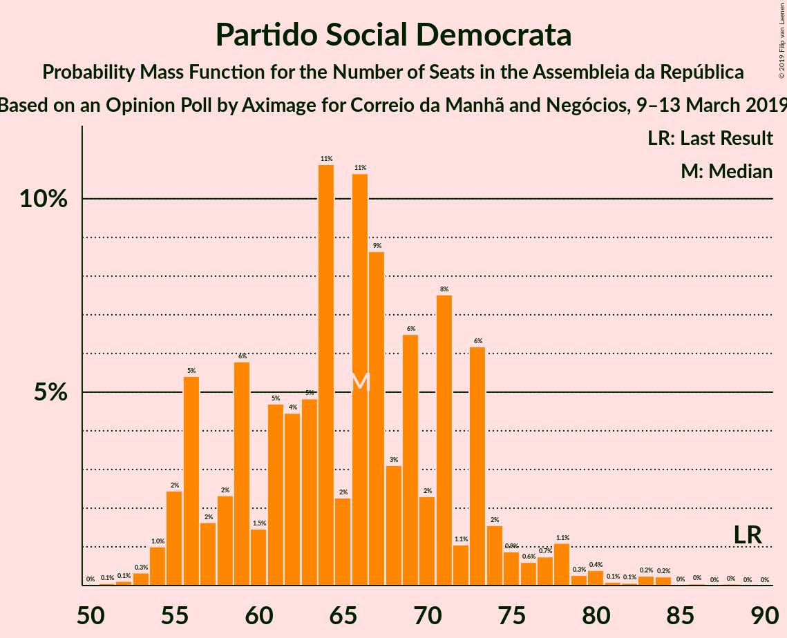
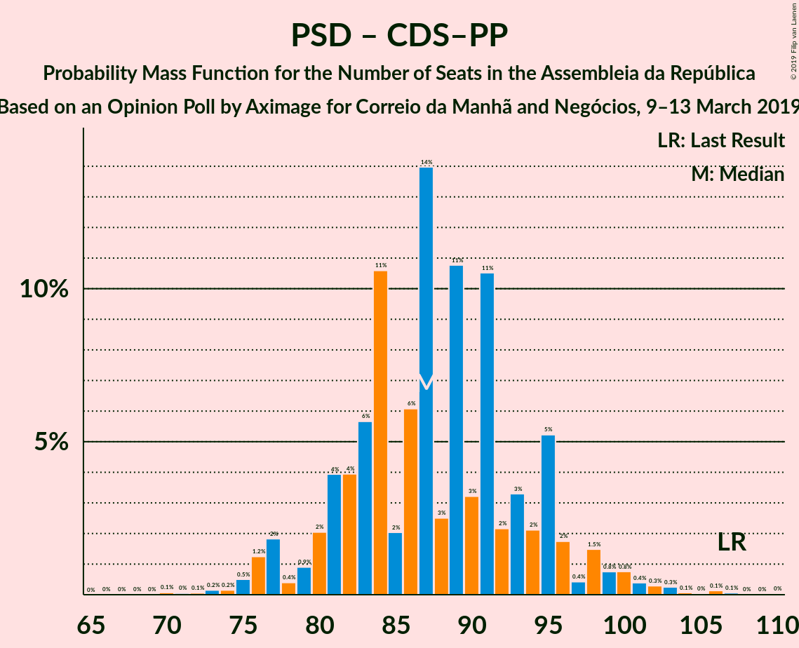

# Opinion Poll by Aximage for Correio da Manhã and Negócios, 9–13 March 2019

<a href="#voting-intentions">Voting Intentions</a> | <a href="#seats">Seats</a> | <a href="#coalitions">Coalitions</a> | <a href="#technical-information">Technical Information</a>

## Voting Intentions

### Confidence Intervals

| Party | Last Result | Poll Result | 80% Confidence Interval | 90% Confidence Interval | 95% Confidence Interval | 99% Confidence Interval |
|:-----:|:-----------:|:-----------:|:-----------------------:|:-----------------------:|:-----------------------:|:-----------------------:|
| Partido Socialista | 32.3% | 36.3% | 33.9–38.9% |33.2–39.6% |32.6–40.3% |31.4–41.5% |
| Partido Social Democrata | 36.9% | 23.8% | 21.7–26.2% |21.1–26.8% |20.6–27.4% |19.6–28.6% |
| CDS–Partido Popular | 36.9% | 9.7% | 8.3–11.4% |7.9–11.9% |7.5–12.3% |6.9–13.2% |
| Bloco de Esquerda | 10.2% | 9.2% | 7.8–10.9% |7.4–11.3% |7.1–11.8% |6.5–12.6% |
| Coligação Democrática Unitária | 8.2% | 6.8% | 5.7–8.3% |5.3–8.8% |5.1–9.1% |4.6–9.9% |
| Pessoas–Animais–Natureza | 1.4% | 2.2% | 1.6–3.1% |1.4–3.4% |1.3–3.7% |1.0–4.2% |
| Aliança | 0.0% | 1.8% | 1.3–2.8% |1.1–3.0% |1.0–3.3% |0.8–3.8% |

*Note:* The poll result column reflects the actual value used in the calculations. Published results may vary slightly, and in addition be rounded to fewer digits.

## Seats

### Confidence Intervals

| Party | Last Result | Median | 80% Confidence Interval | 90% Confidence Interval | 95% Confidence Interval | 99% Confidence Interval |
|:-----:|:-----------:|:------:|:-----------------------:|:-----------------------:|:-----------------------:|:-----------------------:|
| <a href="#partido-socialista">Partido Socialista</a> | 86 | 105 | 99–113 |97–115 |95–117 |92–122 |
| <a href="#partido-social-democrata">Partido Social Democrata</a> | 89 | 66 | 57–73 |56–74 |55–78 |53–83 |
| <a href="#cds–partido-popular">CDS–Partido Popular</a> | 18 | 20 | 18–28 |18–28 |14–29 |11–30 |
| <a href="#bloco-de-esquerda">Bloco de Esquerda</a> | 19 | 19 | 16–23 |15–24 |14–25 |10–27 |
| <a href="#coligação-democrática-unitária">Coligação Democrática Unitária</a> | 17 | 14 | 10–17 |8–17 |7–20 |7–21 |
| <a href="#pessoas–animais–natureza">Pessoas–Animais–Natureza</a> | 1 | 2 | 1–4 |1–4 |1–4 |0–6 |
| <a href="#aliança">Aliança</a> | 0 | 2 | 0–2 |0–2 |0–2 |0–4 |

### Partido Socialista

*For a full overview of the results for this party, see the [Partido Socialista](party-partidosocialista.html) page.*

| Number of Seats | Probability | Accumulated | Special Marks |
|:---------------:|:-----------:|:-----------:|:-------------:|
| 86 | 0% | 100% | Last Result |
| 87 | 0% | 100% |  |
| 88 | 0.1% | 99.9% |  |
| 89 | 0.1% | 99.9% |  |
| 90 | 0.1% | 99.8% |  |
| 91 | 0.2% | 99.7% |  |
| 92 | 0.1% | 99.6% |  |
| 93 | 0.6% | 99.4% |  |
| 94 | 0.8% | 98.9% |  |
| 95 | 0.8% | 98% |  |
| 96 | 2% | 97% |  |
| 97 | 1.5% | 95% |  |
| 98 | 3% | 94% |  |
| 99 | 3% | 90% |  |
| 100 | 2% | 87% |  |
| 101 | 2% | 85% |  |
| 102 | 11% | 83% |  |
| 103 | 7% | 72% |  |
| 104 | 8% | 65% |  |
| 105 | 9% | 57% | Median |
| 106 | 2% | 48% |  |
| 107 | 5% | 46% |  |
| 108 | 12% | 42% |  |
| 109 | 7% | 30% |  |
| 110 | 3% | 23% |  |
| 111 | 3% | 20% |  |
| 112 | 4% | 17% |  |
| 113 | 4% | 12% |  |
| 114 | 2% | 9% |  |
| 115 | 2% | 7% |  |
| 116 | 1.4% | 5% | Majority |
| 117 | 1.3% | 3% |  |
| 118 | 0.7% | 2% |  |
| 119 | 0.5% | 1.5% |  |
| 120 | 0.1% | 1.0% |  |
| 121 | 0.3% | 0.8% |  |
| 122 | 0.3% | 0.5% |  |
| 123 | 0.1% | 0.2% |  |
| 124 | 0.1% | 0.1% |  |
| 125 | 0% | 0.1% |  |
| 126 | 0% | 0.1% |  |
| 127 | 0% | 0.1% |  |
| 128 | 0% | 0% |  |

### Partido Social Democrata

*For a full overview of the results for this party, see the [Partido Social Democrata](party-partidosocialdemocrata.html) page.*

| Number of Seats | Probability | Accumulated | Special Marks |
|:---------------:|:-----------:|:-----------:|:-------------:|
| 51 | 0.1% | 100% |  |
| 52 | 0.1% | 99.9% |  |
| 53 | 0.3% | 99.8% |  |
| 54 | 1.0% | 99.5% |  |
| 55 | 2% | 98% |  |
| 56 | 5% | 96% |  |
| 57 | 2% | 91% |  |
| 58 | 2% | 89% |  |
| 59 | 6% | 87% |  |
| 60 | 1.5% | 81% |  |
| 61 | 5% | 79% |  |
| 62 | 4% | 75% |  |
| 63 | 5% | 70% |  |
| 64 | 11% | 65% |  |
| 65 | 2% | 55% |  |
| 66 | 11% | 52% | Median |
| 67 | 9% | 42% |  |
| 68 | 3% | 33% |  |
| 69 | 6% | 30% |  |
| 70 | 2% | 23% |  |
| 71 | 8% | 21% |  |
| 72 | 1.1% | 14% |  |
| 73 | 6% | 12% |  |
| 74 | 2% | 6% |  |
| 75 | 0.9% | 5% |  |
| 76 | 0.6% | 4% |  |
| 77 | 0.7% | 3% |  |
| 78 | 1.1% | 3% |  |
| 79 | 0.3% | 1.4% |  |
| 80 | 0.4% | 1.2% |  |
| 81 | 0.1% | 0.8% |  |
| 82 | 0.1% | 0.7% |  |
| 83 | 0.2% | 0.6% |  |
| 84 | 0.2% | 0.4% |  |
| 85 | 0% | 0.1% |  |
| 86 | 0% | 0.1% |  |
| 87 | 0% | 0.1% |  |
| 88 | 0% | 0.1% |  |
| 89 | 0% | 0% | Last Result |

### CDS–Partido Popular

*For a full overview of the results for this party, see the [CDS–Partido Popular](party-cds–partidopopular.html) page.*

| Number of Seats | Probability | Accumulated | Special Marks |
|:---------------:|:-----------:|:-----------:|:-------------:|
| 10 | 0.3% | 100% |  |
| 11 | 0.3% | 99.7% |  |
| 12 | 0.4% | 99.3% |  |
| 13 | 1.1% | 98.9% |  |
| 14 | 0.6% | 98% |  |
| 15 | 0.4% | 97% |  |
| 16 | 0.6% | 97% |  |
| 17 | 1.1% | 96% |  |
| 18 | 8% | 95% | Last Result |
| 19 | 12% | 87% |  |
| 20 | 26% | 75% | Median |
| 21 | 8% | 49% |  |
| 22 | 5% | 42% |  |
| 23 | 1.1% | 36% |  |
| 24 | 2% | 35% |  |
| 25 | 5% | 34% |  |
| 26 | 3% | 28% |  |
| 27 | 3% | 25% |  |
| 28 | 18% | 23% |  |
| 29 | 3% | 5% |  |
| 30 | 0.6% | 1.1% |  |
| 31 | 0.2% | 0.5% |  |
| 32 | 0.1% | 0.3% |  |
| 33 | 0.1% | 0.2% |  |
| 34 | 0% | 0.1% |  |
| 35 | 0% | 0.1% |  |
| 36 | 0% | 0% |  |

### Bloco de Esquerda

*For a full overview of the results for this party, see the [Bloco de Esquerda](party-blocodeesquerda.html) page.*

| Number of Seats | Probability | Accumulated | Special Marks |
|:---------------:|:-----------:|:-----------:|:-------------:|
| 9 | 0.1% | 100% |  |
| 10 | 0.6% | 99.9% |  |
| 11 | 0.2% | 99.4% |  |
| 12 | 0.3% | 99.2% |  |
| 13 | 0.6% | 98.8% |  |
| 14 | 2% | 98% |  |
| 15 | 5% | 96% |  |
| 16 | 2% | 91% |  |
| 17 | 8% | 89% |  |
| 18 | 30% | 80% |  |
| 19 | 7% | 51% | Last Result, Median |
| 20 | 13% | 44% |  |
| 21 | 9% | 31% |  |
| 22 | 4% | 22% |  |
| 23 | 11% | 18% |  |
| 24 | 3% | 7% |  |
| 25 | 3% | 4% |  |
| 26 | 0.9% | 2% |  |
| 27 | 0.7% | 0.9% |  |
| 28 | 0.2% | 0.2% |  |
| 29 | 0% | 0.1% |  |
| 30 | 0% | 0% |  |

### Coligação Democrática Unitária

*For a full overview of the results for this party, see the [Coligação Democrática Unitária](party-coligaçãodemocráticaunitária.html) page.*

| Number of Seats | Probability | Accumulated | Special Marks |
|:---------------:|:-----------:|:-----------:|:-------------:|
| 5 | 0.3% | 100% |  |
| 6 | 0.1% | 99.7% |  |
| 7 | 3% | 99.6% |  |
| 8 | 2% | 97% |  |
| 9 | 3% | 95% |  |
| 10 | 5% | 92% |  |
| 11 | 15% | 87% |  |
| 12 | 11% | 72% |  |
| 13 | 4% | 60% |  |
| 14 | 15% | 56% | Median |
| 15 | 18% | 41% |  |
| 16 | 4% | 23% |  |
| 17 | 14% | 19% | Last Result |
| 18 | 2% | 5% |  |
| 19 | 0.7% | 3% |  |
| 20 | 1.4% | 3% |  |
| 21 | 0.9% | 1.1% |  |
| 22 | 0% | 0.2% |  |
| 23 | 0% | 0.1% |  |
| 24 | 0.1% | 0.1% |  |
| 25 | 0% | 0% |  |

### Pessoas–Animais–Natureza

*For a full overview of the results for this party, see the [Pessoas–Animais–Natureza](party-pessoas–animais–natureza.html) page.*

| Number of Seats | Probability | Accumulated | Special Marks |
|:---------------:|:-----------:|:-----------:|:-------------:|
| 0 | 2% | 100% |  |
| 1 | 29% | 98% | Last Result |
| 2 | 40% | 69% | Median |
| 3 | 17% | 29% |  |
| 4 | 10% | 12% |  |
| 5 | 0.3% | 1.4% |  |
| 6 | 1.1% | 1.1% |  |
| 7 | 0% | 0% |  |

### Aliança

*For a full overview of the results for this party, see the [Aliança](party-aliança.html) page.*

| Number of Seats | Probability | Accumulated | Special Marks |
|:---------------:|:-----------:|:-----------:|:-------------:|
| 0 | 20% | 100% | Last Result |
| 1 | 6% | 80% |  |
| 2 | 73% | 74% | Median |
| 3 | 0.1% | 0.8% |  |
| 4 | 0.3% | 0.8% |  |
| 5 | 0.2% | 0.4% |  |
| 6 | 0.2% | 0.2% |  |
| 7 | 0% | 0% |  |

## Coalitions

### Confidence Intervals

| Coalition | Last Result | Median | Majority? | 80% Confidence Interval | 90% Confidence Interval | 95% Confidence Interval | 99% Confidence Interval |
|:---------:|:-----------:|:------:|:---------:|:-----------------------:|:-----------------------:|:-----------------------:|:-----------------------:|
| Partido Socialista – Bloco de Esquerda – Coligação Democrática Unitária | 122 | 139 | 100% | 132–145 | 129–148 | 128–150 | 124–153 |
| Partido Socialista – Bloco de Esquerda | 105 | 125 | 95% | 118–133 | 115–135 | 114–138 | 110–140 |
| Partido Socialista – Coligação Democrática Unitária | 103 | 119 | 81% | 114–125 | 111–128 | 108–131 | 104–135 |
| Partido Socialista | 86 | 105 | 5% | 99–113 | 97–115 | 95–117 | 92–122 |
| Partido Social Democrata – CDS–Partido Popular | 107 | 87 | 0% | 81–95 | 79–96 | 77–99 | 74–103 |

### Partido Socialista – Bloco de Esquerda – Coligação Democrática Unitária

| Number of Seats | Probability | Accumulated | Special Marks |
|:---------------:|:-----------:|:-----------:|:-------------:|
| 118 | 0% | 100% |  |
| 119 | 0% | 99.9% |  |
| 120 | 0% | 99.9% |  |
| 121 | 0.1% | 99.9% |  |
| 122 | 0.1% | 99.8% | Last Result |
| 123 | 0.1% | 99.7% |  |
| 124 | 0.4% | 99.6% |  |
| 125 | 0.5% | 99.3% |  |
| 126 | 0.2% | 98.7% |  |
| 127 | 0.7% | 98.5% |  |
| 128 | 1.0% | 98% |  |
| 129 | 2% | 97% |  |
| 130 | 1.3% | 94% |  |
| 131 | 0.8% | 93% |  |
| 132 | 5% | 92% |  |
| 133 | 5% | 87% |  |
| 134 | 4% | 82% |  |
| 135 | 8% | 78% |  |
| 136 | 0.8% | 69% |  |
| 137 | 5% | 69% |  |
| 138 | 12% | 63% | Median |
| 139 | 12% | 51% |  |
| 140 | 5% | 39% |  |
| 141 | 2% | 34% |  |
| 142 | 6% | 32% |  |
| 143 | 3% | 26% |  |
| 144 | 8% | 23% |  |
| 145 | 7% | 15% |  |
| 146 | 1.2% | 8% |  |
| 147 | 0.7% | 7% |  |
| 148 | 1.4% | 6% |  |
| 149 | 1.0% | 5% |  |
| 150 | 2% | 4% |  |
| 151 | 0.4% | 2% |  |
| 152 | 0.6% | 2% |  |
| 153 | 0.6% | 1.0% |  |
| 154 | 0.2% | 0.4% |  |
| 155 | 0.1% | 0.2% |  |
| 156 | 0% | 0.1% |  |
| 157 | 0% | 0.1% |  |
| 158 | 0% | 0.1% |  |
| 159 | 0% | 0% |  |

### Partido Socialista – Bloco de Esquerda

| Number of Seats | Probability | Accumulated | Special Marks |
|:---------------:|:-----------:|:-----------:|:-------------:|
| 105 | 0% | 100% | Last Result |
| 106 | 0% | 100% |  |
| 107 | 0.1% | 99.9% |  |
| 108 | 0.1% | 99.9% |  |
| 109 | 0.1% | 99.8% |  |
| 110 | 0.3% | 99.7% |  |
| 111 | 0.3% | 99.4% |  |
| 112 | 0.5% | 99.1% |  |
| 113 | 0.3% | 98.6% |  |
| 114 | 2% | 98% |  |
| 115 | 2% | 97% |  |
| 116 | 2% | 95% | Majority |
| 117 | 2% | 93% |  |
| 118 | 2% | 91% |  |
| 119 | 2% | 89% |  |
| 120 | 8% | 87% |  |
| 121 | 8% | 79% |  |
| 122 | 8% | 71% |  |
| 123 | 6% | 64% |  |
| 124 | 7% | 58% | Median |
| 125 | 3% | 51% |  |
| 126 | 2% | 48% |  |
| 127 | 6% | 47% |  |
| 128 | 16% | 41% |  |
| 129 | 6% | 26% |  |
| 130 | 2% | 20% |  |
| 131 | 3% | 18% |  |
| 132 | 4% | 15% |  |
| 133 | 4% | 11% |  |
| 134 | 1.2% | 7% |  |
| 135 | 0.9% | 6% |  |
| 136 | 2% | 5% |  |
| 137 | 0.7% | 3% |  |
| 138 | 0.7% | 3% |  |
| 139 | 1.2% | 2% |  |
| 140 | 0.3% | 0.7% |  |
| 141 | 0.1% | 0.4% |  |
| 142 | 0.1% | 0.3% |  |
| 143 | 0% | 0.1% |  |
| 144 | 0% | 0.1% |  |
| 145 | 0% | 0.1% |  |
| 146 | 0% | 0% |  |

### Partido Socialista – Coligação Democrática Unitária

| Number of Seats | Probability | Accumulated | Special Marks |
|:---------------:|:-----------:|:-----------:|:-------------:|
| 100 | 0% | 100% |  |
| 101 | 0.1% | 99.9% |  |
| 102 | 0.1% | 99.8% |  |
| 103 | 0.1% | 99.7% | Last Result |
| 104 | 0.3% | 99.6% |  |
| 105 | 0.2% | 99.3% |  |
| 106 | 0.7% | 99.1% |  |
| 107 | 0.8% | 98% |  |
| 108 | 0.5% | 98% |  |
| 109 | 0.8% | 97% |  |
| 110 | 1.2% | 96% |  |
| 111 | 2% | 95% |  |
| 112 | 1.2% | 94% |  |
| 113 | 2% | 92% |  |
| 114 | 4% | 91% |  |
| 115 | 5% | 86% |  |
| 116 | 9% | 81% | Majority |
| 117 | 8% | 72% |  |
| 118 | 5% | 65% |  |
| 119 | 16% | 59% | Median |
| 120 | 5% | 44% |  |
| 121 | 7% | 39% |  |
| 122 | 5% | 31% |  |
| 123 | 6% | 27% |  |
| 124 | 7% | 21% |  |
| 125 | 5% | 14% |  |
| 126 | 0.9% | 9% |  |
| 127 | 1.2% | 8% |  |
| 128 | 2% | 7% |  |
| 129 | 0.4% | 5% |  |
| 130 | 1.0% | 4% |  |
| 131 | 0.9% | 3% |  |
| 132 | 0.3% | 2% |  |
| 133 | 0.4% | 2% |  |
| 134 | 0.6% | 2% |  |
| 135 | 0.6% | 1.0% |  |
| 136 | 0.2% | 0.4% |  |
| 137 | 0.1% | 0.2% |  |
| 138 | 0.1% | 0.2% |  |
| 139 | 0% | 0.1% |  |
| 140 | 0% | 0% |  |

### Partido Socialista

| Number of Seats | Probability | Accumulated | Special Marks |
|:---------------:|:-----------:|:-----------:|:-------------:|
| 86 | 0% | 100% | Last Result |
| 87 | 0% | 100% |  |
| 88 | 0.1% | 99.9% |  |
| 89 | 0.1% | 99.9% |  |
| 90 | 0.1% | 99.8% |  |
| 91 | 0.2% | 99.7% |  |
| 92 | 0.1% | 99.6% |  |
| 93 | 0.6% | 99.4% |  |
| 94 | 0.8% | 98.9% |  |
| 95 | 0.8% | 98% |  |
| 96 | 2% | 97% |  |
| 97 | 1.5% | 95% |  |
| 98 | 3% | 94% |  |
| 99 | 3% | 90% |  |
| 100 | 2% | 87% |  |
| 101 | 2% | 85% |  |
| 102 | 11% | 83% |  |
| 103 | 7% | 72% |  |
| 104 | 8% | 65% |  |
| 105 | 9% | 57% | Median |
| 106 | 2% | 48% |  |
| 107 | 5% | 46% |  |
| 108 | 12% | 42% |  |
| 109 | 7% | 30% |  |
| 110 | 3% | 23% |  |
| 111 | 3% | 20% |  |
| 112 | 4% | 17% |  |
| 113 | 4% | 12% |  |
| 114 | 2% | 9% |  |
| 115 | 2% | 7% |  |
| 116 | 1.4% | 5% | Majority |
| 117 | 1.3% | 3% |  |
| 118 | 0.7% | 2% |  |
| 119 | 0.5% | 1.5% |  |
| 120 | 0.1% | 1.0% |  |
| 121 | 0.3% | 0.8% |  |
| 122 | 0.3% | 0.5% |  |
| 123 | 0.1% | 0.2% |  |
| 124 | 0.1% | 0.1% |  |
| 125 | 0% | 0.1% |  |
| 126 | 0% | 0.1% |  |
| 127 | 0% | 0.1% |  |
| 128 | 0% | 0% |  |

### Partido Social Democrata – CDS–Partido Popular

| Number of Seats | Probability | Accumulated | Special Marks |
|:---------------:|:-----------:|:-----------:|:-------------:|
| 70 | 0.1% | 100% |  |
| 71 | 0% | 99.9% |  |
| 72 | 0.1% | 99.8% |  |
| 73 | 0.2% | 99.8% |  |
| 74 | 0.2% | 99.6% |  |
| 75 | 0.5% | 99.5% |  |
| 76 | 1.2% | 99.0% |  |
| 77 | 2% | 98% |  |
| 78 | 0.4% | 96% |  |
| 79 | 0.9% | 96% |  |
| 80 | 2% | 95% |  |
| 81 | 4% | 93% |  |
| 82 | 4% | 89% |  |
| 83 | 6% | 85% |  |
| 84 | 11% | 79% |  |
| 85 | 2% | 68% |  |
| 86 | 6% | 66% | Median |
| 87 | 14% | 60% |  |
| 88 | 3% | 46% |  |
| 89 | 11% | 44% |  |
| 90 | 3% | 33% |  |
| 91 | 11% | 30% |  |
| 92 | 2% | 19% |  |
| 93 | 3% | 17% |  |
| 94 | 2% | 14% |  |
| 95 | 5% | 12% |  |
| 96 | 2% | 6% |  |
| 97 | 0.4% | 5% |  |
| 98 | 1.5% | 4% |  |
| 99 | 0.8% | 3% |  |
| 100 | 0.8% | 2% |  |
| 101 | 0.4% | 1.3% |  |
| 102 | 0.3% | 0.9% |  |
| 103 | 0.3% | 0.6% |  |
| 104 | 0.1% | 0.4% |  |
| 105 | 0% | 0.3% |  |
| 106 | 0.1% | 0.3% |  |
| 107 | 0.1% | 0.1% | Last Result |
| 108 | 0% | 0.1% |  |
| 109 | 0% | 0% |  |

## Technical Information

### Opinion Poll

+ **Polling firm:** Aximage
+ **Commissioner(s):** Correio da Manhã and Negócios
+ **Fieldwork period:** 9–13 March 2019

### Calculations

+ **Sample size:** 600
+ **Simulations done:** 131,072
+ **Error estimate:** 1.46%

