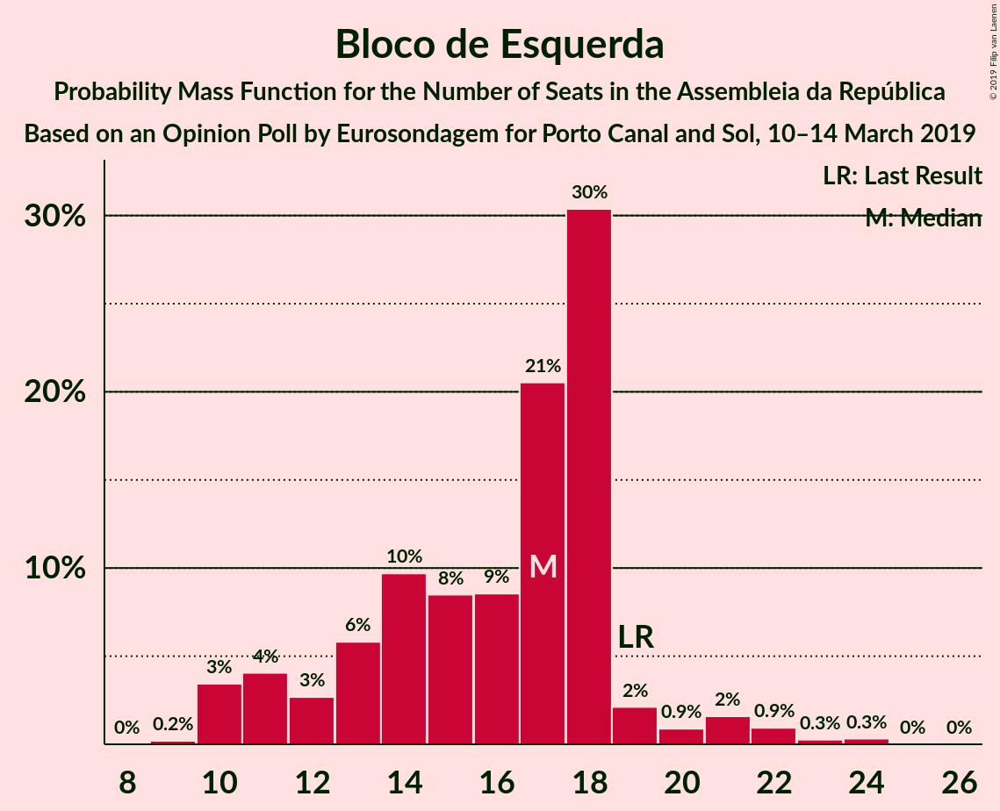
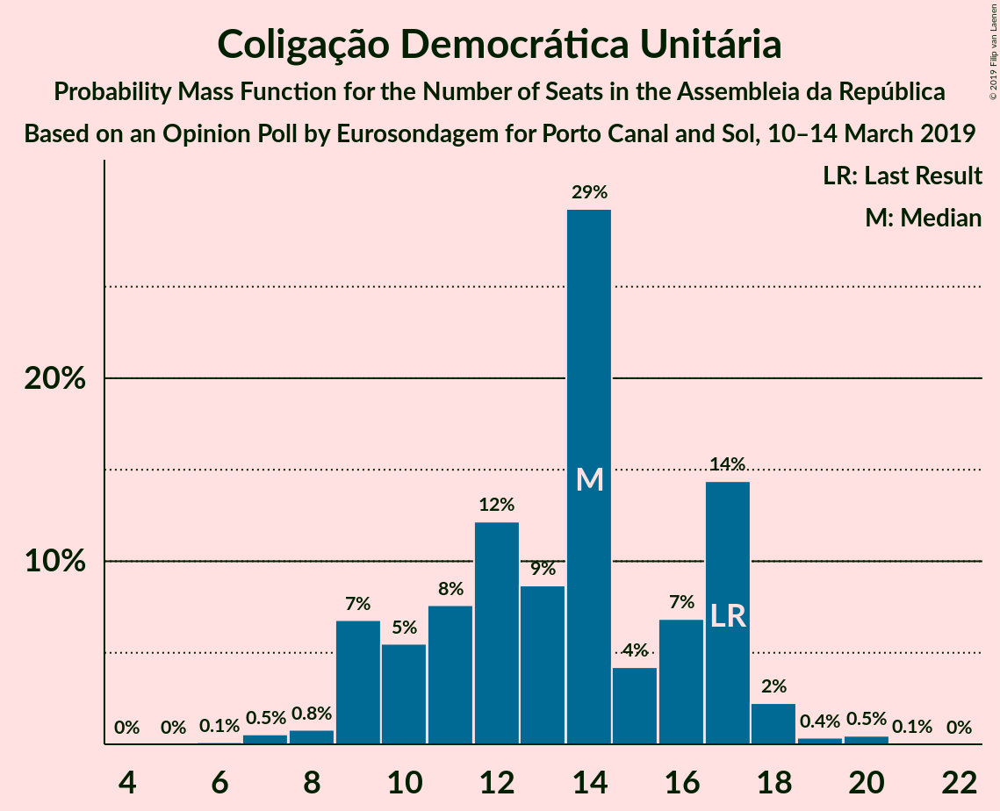

# Opinion Poll by Eurosondagem for Porto Canal and Sol, 10–14 March 2019

<a href="#voting-intentions">Voting Intentions</a> | <a href="#seats">Seats</a> | <a href="#coalitions">Coalitions</a> | <a href="#technical-information">Technical Information</a>

## Voting Intentions

### Confidence Intervals

| Party | Last Result | Poll Result | 80% Confidence Interval | 90% Confidence Interval | 95% Confidence Interval | 99% Confidence Interval |
|:-----:|:-----------:|:-----------:|:-----------------------:|:-----------------------:|:-----------------------:|:-----------------------:|
| Partido Socialista | 32.3% | 37.3% | 35.3–39.2% |34.8–39.8% |34.3–40.3% |33.4–41.2% |
| Partido Social Democrata | 36.9% | 25.2% | 23.5–27.0% |23.0–27.5% |22.6–28.0% |21.8–28.8% |
| CDS–Partido Popular | 36.9% | 8.5% | 7.5–9.8% |7.2–10.1% |7.0–10.4% |6.5–11.0% |
| Bloco de Esquerda | 10.2% | 8.1% | 7.1–9.3% |6.8–9.7% |6.6–10.0% |6.2–10.6% |
| Coligação Democrática Unitária | 8.2% | 7.1% | 6.1–8.2% |5.9–8.5% |5.6–8.8% |5.2–9.4% |
| Aliança | 0.0% | 3.3% | 2.7–4.2% |2.5–4.4% |2.4–4.6% |2.1–5.1% |
| Pessoas–Animais–Natureza | 1.4% | 2.4% | 1.8–3.1% |1.7–3.3% |1.6–3.5% |1.4–3.9% |

*Note:* The poll result column reflects the actual value used in the calculations. Published results may vary slightly, and in addition be rounded to fewer digits.

## Seats

### Confidence Intervals

| Party | Last Result | Median | 80% Confidence Interval | 90% Confidence Interval | 95% Confidence Interval | 99% Confidence Interval |
|:-----:|:-----------:|:------:|:-----------------------:|:-----------------------:|:-----------------------:|:-----------------------:|
| <a href="#partido-socialista">Partido Socialista</a> | 86 | 107 | 102–113 |100–114 |99–116 |96–119 |
| <a href="#partido-social-democrata">Partido Social Democrata</a> | 89 | 71 | 65–76 |63–78 |63–79 |60–82 |
| <a href="#cds–partido-popular">CDS–Partido Popular</a> | 18 | 18 | 13–20 |13–21 |12–22 |10–25 |
| <a href="#bloco-de-esquerda">Bloco de Esquerda</a> | 19 | 17 | 12–18 |11–19 |10–21 |10–23 |
| <a href="#coligação-democrática-unitária">Coligação Democrática Unitária</a> | 17 | 14 | 10–17 |9–17 |9–18 |7–20 |
| <a href="#aliança">Aliança</a> | 0 | 2 | 2–5 |2–6 |2–6 |2–6 |
| <a href="#pessoas–animais–natureza">Pessoas–Animais–Natureza</a> | 1 | 2 | 1–3 |1–4 |1–4 |1–4 |

### Partido Socialista

*For a full overview of the results for this party, see the [Partido Socialista](party-partidosocialista.html) page.*

| Number of Seats | Probability | Accumulated | Special Marks |
|:---------------:|:-----------:|:-----------:|:-------------:|
| 86 | 0% | 100% | Last Result |
| 87 | 0% | 100% |  |
| 88 | 0% | 100% |  |
| 89 | 0% | 100% |  |
| 90 | 0% | 100% |  |
| 91 | 0% | 100% |  |
| 92 | 0% | 100% |  |
| 93 | 0% | 99.9% |  |
| 94 | 0.1% | 99.9% |  |
| 95 | 0.2% | 99.8% |  |
| 96 | 0.3% | 99.6% |  |
| 97 | 1.1% | 99.4% |  |
| 98 | 0.6% | 98% |  |
| 99 | 1.3% | 98% |  |
| 100 | 2% | 96% |  |
| 101 | 2% | 94% |  |
| 102 | 5% | 92% |  |
| 103 | 2% | 87% |  |
| 104 | 11% | 85% |  |
| 105 | 12% | 74% |  |
| 106 | 6% | 62% |  |
| 107 | 10% | 56% | Median |
| 108 | 8% | 46% |  |
| 109 | 7% | 38% |  |
| 110 | 7% | 31% |  |
| 111 | 5% | 24% |  |
| 112 | 8% | 19% |  |
| 113 | 6% | 12% |  |
| 114 | 1.1% | 6% |  |
| 115 | 2% | 5% |  |
| 116 | 1.2% | 3% | Majority |
| 117 | 0.2% | 1.3% |  |
| 118 | 0.6% | 1.1% |  |
| 119 | 0.2% | 0.6% |  |
| 120 | 0.2% | 0.4% |  |
| 121 | 0.1% | 0.2% |  |
| 122 | 0% | 0.1% |  |
| 123 | 0% | 0.1% |  |
| 124 | 0% | 0% |  |

### Partido Social Democrata

*For a full overview of the results for this party, see the [Partido Social Democrata](party-partidosocialdemocrata.html) page.*

| Number of Seats | Probability | Accumulated | Special Marks |
|:---------------:|:-----------:|:-----------:|:-------------:|
| 56 | 0% | 100% |  |
| 57 | 0.1% | 99.9% |  |
| 58 | 0.1% | 99.9% |  |
| 59 | 0.1% | 99.8% |  |
| 60 | 0.3% | 99.7% |  |
| 61 | 0.8% | 99.4% |  |
| 62 | 0.7% | 98.5% |  |
| 63 | 3% | 98% |  |
| 64 | 4% | 95% |  |
| 65 | 7% | 91% |  |
| 66 | 6% | 84% |  |
| 67 | 6% | 77% |  |
| 68 | 2% | 71% |  |
| 69 | 8% | 69% |  |
| 70 | 7% | 61% |  |
| 71 | 15% | 54% | Median |
| 72 | 10% | 40% |  |
| 73 | 2% | 29% |  |
| 74 | 8% | 27% |  |
| 75 | 8% | 19% |  |
| 76 | 4% | 11% |  |
| 77 | 1.3% | 7% |  |
| 78 | 2% | 6% |  |
| 79 | 2% | 4% |  |
| 80 | 0.5% | 1.2% |  |
| 81 | 0.2% | 0.7% |  |
| 82 | 0.2% | 0.5% |  |
| 83 | 0.2% | 0.4% |  |
| 84 | 0.1% | 0.2% |  |
| 85 | 0.1% | 0.1% |  |
| 86 | 0% | 0% |  |
| 87 | 0% | 0% |  |
| 88 | 0% | 0% |  |
| 89 | 0% | 0% | Last Result |

### CDS–Partido Popular

*For a full overview of the results for this party, see the [CDS–Partido Popular](party-cds–partidopopular.html) page.*

| Number of Seats | Probability | Accumulated | Special Marks |
|:---------------:|:-----------:|:-----------:|:-------------:|
| 9 | 0.1% | 100% |  |
| 10 | 0.8% | 99.9% |  |
| 11 | 1.2% | 99.0% |  |
| 12 | 2% | 98% |  |
| 13 | 8% | 96% |  |
| 14 | 14% | 89% |  |
| 15 | 4% | 75% |  |
| 16 | 8% | 71% |  |
| 17 | 5% | 63% |  |
| 18 | 11% | 58% | Last Result, Median |
| 19 | 20% | 47% |  |
| 20 | 19% | 28% |  |
| 21 | 4% | 8% |  |
| 22 | 3% | 5% |  |
| 23 | 0.8% | 2% |  |
| 24 | 0.8% | 2% |  |
| 25 | 0.6% | 0.8% |  |
| 26 | 0% | 0.2% |  |
| 27 | 0% | 0.1% |  |
| 28 | 0.1% | 0.1% |  |
| 29 | 0% | 0% |  |

### Bloco de Esquerda

*For a full overview of the results for this party, see the [Bloco de Esquerda](party-blocodeesquerda.html) page.*

| Number of Seats | Probability | Accumulated | Special Marks |
|:---------------:|:-----------:|:-----------:|:-------------:|
| 9 | 0.2% | 100% |  |
| 10 | 3% | 99.8% |  |
| 11 | 4% | 96% |  |
| 12 | 3% | 92% |  |
| 13 | 6% | 90% |  |
| 14 | 10% | 84% |  |
| 15 | 8% | 74% |  |
| 16 | 9% | 66% |  |
| 17 | 21% | 57% | Median |
| 18 | 30% | 37% |  |
| 19 | 2% | 6% | Last Result |
| 20 | 0.9% | 4% |  |
| 21 | 2% | 3% |  |
| 22 | 0.9% | 2% |  |
| 23 | 0.3% | 0.6% |  |
| 24 | 0.3% | 0.3% |  |
| 25 | 0% | 0% |  |

### Coligação Democrática Unitária

*For a full overview of the results for this party, see the [Coligação Democrática Unitária](party-coligaçãodemocráticaunitária.html) page.*

| Number of Seats | Probability | Accumulated | Special Marks |
|:---------------:|:-----------:|:-----------:|:-------------:|
| 6 | 0.1% | 100% |  |
| 7 | 0.5% | 99.9% |  |
| 8 | 0.8% | 99.3% |  |
| 9 | 7% | 98.5% |  |
| 10 | 5% | 92% |  |
| 11 | 8% | 86% |  |
| 12 | 12% | 79% |  |
| 13 | 9% | 66% |  |
| 14 | 29% | 58% | Median |
| 15 | 4% | 29% |  |
| 16 | 7% | 24% |  |
| 17 | 14% | 18% | Last Result |
| 18 | 2% | 3% |  |
| 19 | 0.4% | 0.9% |  |
| 20 | 0.5% | 0.5% |  |
| 21 | 0.1% | 0.1% |  |
| 22 | 0% | 0% |  |

### Aliança

*For a full overview of the results for this party, see the [Aliança](party-aliança.html) page.*

| Number of Seats | Probability | Accumulated | Special Marks |
|:---------------:|:-----------:|:-----------:|:-------------:|
| 0 | 0.3% | 100% | Last Result |
| 1 | 0.1% | 99.7% |  |
| 2 | 55% | 99.6% | Median |
| 3 | 9% | 44% |  |
| 4 | 22% | 35% |  |
| 5 | 5% | 12% |  |
| 6 | 7% | 7% |  |
| 7 | 0.2% | 0.2% |  |
| 8 | 0% | 0% |  |

### Pessoas–Animais–Natureza

*For a full overview of the results for this party, see the [Pessoas–Animais–Natureza](party-pessoas–animais–natureza.html) page.*

| Number of Seats | Probability | Accumulated | Special Marks |
|:---------------:|:-----------:|:-----------:|:-------------:|
| 0 | 0.4% | 100% |  |
| 1 | 13% | 99.6% | Last Result |
| 2 | 55% | 87% | Median |
| 3 | 26% | 32% |  |
| 4 | 6% | 7% |  |
| 5 | 0.1% | 0.4% |  |
| 6 | 0.3% | 0.3% |  |
| 7 | 0% | 0% |  |

## Coalitions

### Confidence Intervals

| Coalition | Last Result | Median | Majority? | 80% Confidence Interval | 90% Confidence Interval | 95% Confidence Interval | 99% Confidence Interval |
|:---------:|:-----------:|:------:|:---------:|:-----------------------:|:-----------------------:|:-----------------------:|:-----------------------:|
| Partido Socialista – Bloco de Esquerda – Coligação Democrática Unitária | 122 | 137 | 100% | 131–143 | 130–144 | 128–146 | 125–149 |
| Partido Socialista – Bloco de Esquerda | 105 | 123 | 96% | 117–130 | 116–131 | 115–132 | 112–135 |
| Partido Socialista – Coligação Democrática Unitária | 103 | 121 | 91% | 116–126 | 114–128 | 112–129 | 108–132 |
| Partido Socialista | 86 | 107 | 3% | 102–113 | 100–114 | 99–116 | 96–119 |
| Partido Social Democrata – CDS–Partido Popular | 107 | 88 | 0% | 82–94 | 80–95 | 79–97 | 77–100 |

### Partido Socialista – Bloco de Esquerda – Coligação Democrática Unitária

| Number of Seats | Probability | Accumulated | Special Marks |
|:---------------:|:-----------:|:-----------:|:-------------:|
| 121 | 0% | 100% |  |
| 122 | 0% | 99.9% | Last Result |
| 123 | 0.1% | 99.9% |  |
| 124 | 0.2% | 99.8% |  |
| 125 | 0.2% | 99.6% |  |
| 126 | 0.6% | 99.5% |  |
| 127 | 0.8% | 98.9% |  |
| 128 | 1.0% | 98% |  |
| 129 | 1.3% | 97% |  |
| 130 | 2% | 96% |  |
| 131 | 6% | 93% |  |
| 132 | 2% | 87% |  |
| 133 | 7% | 85% |  |
| 134 | 13% | 78% |  |
| 135 | 4% | 66% |  |
| 136 | 10% | 61% |  |
| 137 | 6% | 51% |  |
| 138 | 5% | 45% | Median |
| 139 | 13% | 40% |  |
| 140 | 5% | 27% |  |
| 141 | 7% | 22% |  |
| 142 | 2% | 15% |  |
| 143 | 6% | 13% |  |
| 144 | 2% | 7% |  |
| 145 | 2% | 5% |  |
| 146 | 0.9% | 3% |  |
| 147 | 1.2% | 2% |  |
| 148 | 0.4% | 0.9% |  |
| 149 | 0.3% | 0.5% |  |
| 150 | 0.1% | 0.3% |  |
| 151 | 0.1% | 0.2% |  |
| 152 | 0% | 0.1% |  |
| 153 | 0% | 0% |  |

### Partido Socialista – Bloco de Esquerda

| Number of Seats | Probability | Accumulated | Special Marks |
|:---------------:|:-----------:|:-----------:|:-------------:|
| 105 | 0% | 100% | Last Result |
| 106 | 0% | 100% |  |
| 107 | 0% | 100% |  |
| 108 | 0% | 100% |  |
| 109 | 0% | 100% |  |
| 110 | 0.1% | 99.9% |  |
| 111 | 0.2% | 99.9% |  |
| 112 | 0.5% | 99.6% |  |
| 113 | 0.3% | 99.2% |  |
| 114 | 0.8% | 98.9% |  |
| 115 | 2% | 98% |  |
| 116 | 1.0% | 96% | Majority |
| 117 | 5% | 95% |  |
| 118 | 2% | 90% |  |
| 119 | 7% | 87% |  |
| 120 | 8% | 80% |  |
| 121 | 7% | 72% |  |
| 122 | 12% | 66% |  |
| 123 | 4% | 53% |  |
| 124 | 6% | 49% | Median |
| 125 | 14% | 43% |  |
| 126 | 5% | 28% |  |
| 127 | 6% | 24% |  |
| 128 | 2% | 18% |  |
| 129 | 3% | 15% |  |
| 130 | 5% | 12% |  |
| 131 | 3% | 7% |  |
| 132 | 0.9% | 3% |  |
| 133 | 1.4% | 2% |  |
| 134 | 0.3% | 1.0% |  |
| 135 | 0.4% | 0.8% |  |
| 136 | 0.1% | 0.4% |  |
| 137 | 0.1% | 0.3% |  |
| 138 | 0.1% | 0.2% |  |
| 139 | 0% | 0.1% |  |
| 140 | 0% | 0% |  |

### Partido Socialista – Coligação Democrática Unitária

| Number of Seats | Probability | Accumulated | Special Marks |
|:---------------:|:-----------:|:-----------:|:-------------:|
| 103 | 0% | 100% | Last Result |
| 104 | 0% | 100% |  |
| 105 | 0% | 99.9% |  |
| 106 | 0.1% | 99.9% |  |
| 107 | 0.1% | 99.8% |  |
| 108 | 0.3% | 99.7% |  |
| 109 | 0.7% | 99.4% |  |
| 110 | 0.4% | 98.8% |  |
| 111 | 0.6% | 98% |  |
| 112 | 0.8% | 98% |  |
| 113 | 2% | 97% |  |
| 114 | 1.5% | 95% |  |
| 115 | 3% | 94% |  |
| 116 | 4% | 91% | Majority |
| 117 | 9% | 86% |  |
| 118 | 8% | 78% |  |
| 119 | 9% | 70% |  |
| 120 | 5% | 61% |  |
| 121 | 14% | 56% | Median |
| 122 | 11% | 42% |  |
| 123 | 5% | 31% |  |
| 124 | 7% | 26% |  |
| 125 | 6% | 20% |  |
| 126 | 5% | 14% |  |
| 127 | 2% | 9% |  |
| 128 | 2% | 7% |  |
| 129 | 2% | 5% |  |
| 130 | 1.1% | 2% |  |
| 131 | 0.2% | 1.4% |  |
| 132 | 0.7% | 1.1% |  |
| 133 | 0.2% | 0.5% |  |
| 134 | 0.1% | 0.2% |  |
| 135 | 0.1% | 0.2% |  |
| 136 | 0% | 0.1% |  |
| 137 | 0% | 0% |  |

### Partido Socialista

| Number of Seats | Probability | Accumulated | Special Marks |
|:---------------:|:-----------:|:-----------:|:-------------:|
| 86 | 0% | 100% | Last Result |
| 87 | 0% | 100% |  |
| 88 | 0% | 100% |  |
| 89 | 0% | 100% |  |
| 90 | 0% | 100% |  |
| 91 | 0% | 100% |  |
| 92 | 0% | 100% |  |
| 93 | 0% | 99.9% |  |
| 94 | 0.1% | 99.9% |  |
| 95 | 0.2% | 99.8% |  |
| 96 | 0.3% | 99.6% |  |
| 97 | 1.1% | 99.4% |  |
| 98 | 0.6% | 98% |  |
| 99 | 1.3% | 98% |  |
| 100 | 2% | 96% |  |
| 101 | 2% | 94% |  |
| 102 | 5% | 92% |  |
| 103 | 2% | 87% |  |
| 104 | 11% | 85% |  |
| 105 | 12% | 74% |  |
| 106 | 6% | 62% |  |
| 107 | 10% | 56% | Median |
| 108 | 8% | 46% |  |
| 109 | 7% | 38% |  |
| 110 | 7% | 31% |  |
| 111 | 5% | 24% |  |
| 112 | 8% | 19% |  |
| 113 | 6% | 12% |  |
| 114 | 1.1% | 6% |  |
| 115 | 2% | 5% |  |
| 116 | 1.2% | 3% | Majority |
| 117 | 0.2% | 1.3% |  |
| 118 | 0.6% | 1.1% |  |
| 119 | 0.2% | 0.6% |  |
| 120 | 0.2% | 0.4% |  |
| 121 | 0.1% | 0.2% |  |
| 122 | 0% | 0.1% |  |
| 123 | 0% | 0.1% |  |
| 124 | 0% | 0% |  |

### Partido Social Democrata – CDS–Partido Popular

| Number of Seats | Probability | Accumulated | Special Marks |
|:---------------:|:-----------:|:-----------:|:-------------:|
| 73 | 0% | 100% |  |
| 74 | 0% | 99.9% |  |
| 75 | 0.1% | 99.9% |  |
| 76 | 0.2% | 99.7% |  |
| 77 | 0.3% | 99.6% |  |
| 78 | 2% | 99.3% |  |
| 79 | 0.9% | 98% |  |
| 80 | 2% | 97% |  |
| 81 | 4% | 95% |  |
| 82 | 3% | 91% |  |
| 83 | 6% | 89% |  |
| 84 | 6% | 83% |  |
| 85 | 11% | 77% |  |
| 86 | 8% | 66% |  |
| 87 | 3% | 58% |  |
| 88 | 10% | 55% |  |
| 89 | 5% | 45% | Median |
| 90 | 9% | 40% |  |
| 91 | 11% | 31% |  |
| 92 | 5% | 20% |  |
| 93 | 5% | 15% |  |
| 94 | 4% | 10% |  |
| 95 | 3% | 7% |  |
| 96 | 0.9% | 3% |  |
| 97 | 0.9% | 3% |  |
| 98 | 0.6% | 2% |  |
| 99 | 0.5% | 1.1% |  |
| 100 | 0.3% | 0.5% |  |
| 101 | 0.1% | 0.2% |  |
| 102 | 0.1% | 0.1% |  |
| 103 | 0% | 0.1% |  |
| 104 | 0% | 0% |  |
| 105 | 0% | 0% |  |
| 106 | 0% | 0% |  |
| 107 | 0% | 0% | Last Result |

## Technical Information

### Opinion Poll

+ **Polling firm:** Eurosondagem
+ **Commissioner(s):** Porto Canal and Sol
+ **Fieldwork period:** 10–14 March 2019

### Calculations

+ **Sample size:** 1020
+ **Simulations done:** 131,072
+ **Error estimate:** 1.17%

