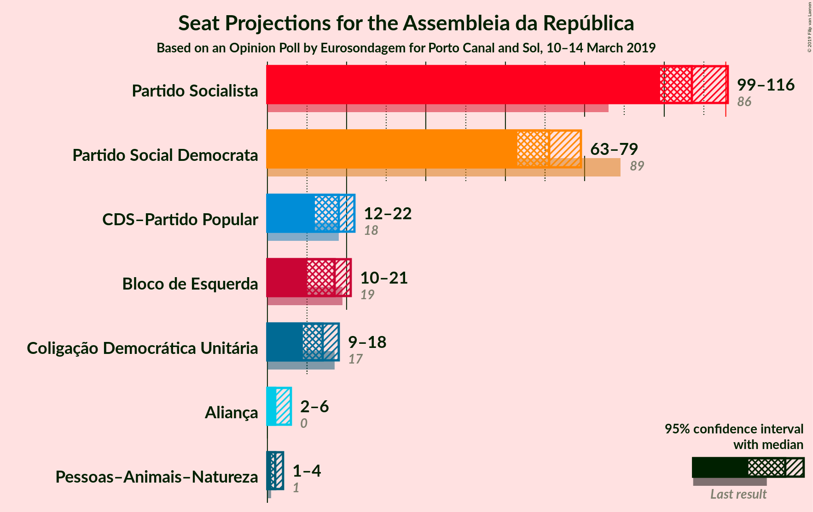

# Opinion Poll by Eurosondagem for Porto Canal and Sol, 10–14 March 2019

<a href="#voting-intentions">Voting Intentions</a> | <a href="#seats">Seats</a> | <a href="#coalitions">Coalitions</a> | <a href="#technical-information">Technical Information</a>

## Voting Intentions

### Confidence Intervals

| Party | Last Result | Poll Result | 80% Confidence Interval | 90% Confidence Interval | 95% Confidence Interval | 99% Confidence Interval |
|:-----:|:-----------:|:-----------:|:-----------------------:|:-----------------------:|:-----------------------:|:-----------------------:|
| Partido Socialista | 32.3% | 37.3% | 35.3–39.2% |34.8–39.8% |34.3–40.3% |33.4–41.2% |
| Partido Social Democrata | 36.9% | 25.2% | 23.5–27.0% |23.0–27.5% |22.6–28.0% |21.8–28.8% |
| CDS–Partido Popular | 36.9% | 8.5% | 7.5–9.8% |7.2–10.1% |7.0–10.4% |6.5–11.0% |
| Bloco de Esquerda | 10.2% | 8.1% | 7.1–9.3% |6.8–9.7% |6.6–10.0% |6.2–10.6% |
| Coligação Democrática Unitária | 8.2% | 7.1% | 6.1–8.2% |5.9–8.5% |5.6–8.8% |5.2–9.4% |
| Aliança | 0.0% | 3.3% | 2.7–4.2% |2.5–4.4% |2.4–4.6% |2.1–5.1% |
| Pessoas–Animais–Natureza | 1.4% | 2.4% | 1.8–3.1% |1.7–3.3% |1.6–3.5% |1.4–3.9% |

*Note:* The poll result column reflects the actual value used in the calculations. Published results may vary slightly, and in addition be rounded to fewer digits.

## Seats

### Confidence Intervals

| Party | Last Result | Median | 80% Confidence Interval | 90% Confidence Interval | 95% Confidence Interval | 99% Confidence Interval |
|:-----:|:-----------:|:------:|:-----------------------:|:-----------------------:|:-----------------------:|:-----------------------:|
| <a href="#partido-socialista">Partido Socialista</a> | 86 | 107 | 100–114 |91–114 |91–114 |91–116 |
| <a href="#partido-social-democrata">Partido Social Democrata</a> | 89 | 75 | 72–79 |72–79 |66–79 |61–81 |
| <a href="#cds–partido-popular">CDS–Partido Popular</a> | 18 | 13 | 12–19 |10–20 |10–25 |10–26 |
| <a href="#bloco-de-esquerda">Bloco de Esquerda</a> | 19 | 17 | 13–18 |12–23 |10–23 |8–23 |
| <a href="#coligação-democrática-unitária">Coligação Democrática Unitária</a> | 17 | 10 | 6–17 |6–17 |6–17 |6–17 |
| <a href="#aliança">Aliança</a> | 0 | 3 | 2–5 |2–5 |2–6 |2–6 |
| <a href="#pessoas–animais–natureza">Pessoas–Animais–Natureza</a> | 1 | 2 | 1–3 |1–4 |1–4 |0–4 |

### Partido Socialista

*For a full overview of the results for this party, see the [Partido Socialista](party-partidosocialista.html) page.*

| Number of Seats | Probability | Accumulated | Special Marks |
|:---------------:|:-----------:|:-----------:|:-------------:|
| 86 | 0% | 100% | Last Result |
| 87 | 0% | 100% |  |
| 88 | 0% | 100% |  |
| 89 | 0% | 100% |  |
| 90 | 0% | 100% |  |
| 91 | 7% | 100% |  |
| 92 | 0% | 93% |  |
| 93 | 0.2% | 93% |  |
| 94 | 2% | 93% |  |
| 95 | 0.4% | 91% |  |
| 96 | 0% | 90% |  |
| 97 | 0% | 90% |  |
| 98 | 0% | 90% |  |
| 99 | 0.1% | 90% |  |
| 100 | 1.2% | 90% |  |
| 101 | 0.1% | 89% |  |
| 102 | 2% | 89% |  |
| 103 | 0.3% | 87% |  |
| 104 | 0% | 87% |  |
| 105 | 0.1% | 87% |  |
| 106 | 6% | 87% |  |
| 107 | 45% | 81% | Median |
| 108 | 5% | 36% |  |
| 109 | 0.6% | 30% |  |
| 110 | 0.7% | 30% |  |
| 111 | 4% | 29% |  |
| 112 | 0% | 25% |  |
| 113 | 0.2% | 25% |  |
| 114 | 23% | 25% |  |
| 115 | 0% | 2% |  |
| 116 | 2% | 2% | Majority |
| 117 | 0% | 0.1% |  |
| 118 | 0% | 0.1% |  |
| 119 | 0% | 0.1% |  |
| 120 | 0% | 0.1% |  |
| 121 | 0% | 0.1% |  |
| 122 | 0% | 0.1% |  |
| 123 | 0% | 0.1% |  |
| 124 | 0% | 0.1% |  |
| 125 | 0% | 0.1% |  |
| 126 | 0% | 0.1% |  |
| 127 | 0% | 0.1% |  |
| 128 | 0.1% | 0.1% |  |
| 129 | 0% | 0% |  |

### Partido Social Democrata

*For a full overview of the results for this party, see the [Partido Social Democrata](party-partidosocialdemocrata.html) page.*

| Number of Seats | Probability | Accumulated | Special Marks |
|:---------------:|:-----------:|:-----------:|:-------------:|
| 61 | 2% | 100% |  |
| 62 | 0% | 98% |  |
| 63 | 0% | 98% |  |
| 64 | 0.1% | 98% |  |
| 65 | 0.2% | 98% |  |
| 66 | 2% | 98% |  |
| 67 | 0.6% | 96% |  |
| 68 | 0% | 96% |  |
| 69 | 0% | 96% |  |
| 70 | 0% | 96% |  |
| 71 | 0% | 96% |  |
| 72 | 41% | 96% |  |
| 73 | 0.7% | 55% |  |
| 74 | 0.5% | 55% |  |
| 75 | 5% | 54% | Median |
| 76 | 0% | 49% |  |
| 77 | 30% | 49% |  |
| 78 | 6% | 19% |  |
| 79 | 12% | 14% |  |
| 80 | 0% | 2% |  |
| 81 | 2% | 2% |  |
| 82 | 0% | 0% |  |
| 83 | 0% | 0% |  |
| 84 | 0% | 0% |  |
| 85 | 0% | 0% |  |
| 86 | 0% | 0% |  |
| 87 | 0% | 0% |  |
| 88 | 0% | 0% |  |
| 89 | 0% | 0% | Last Result |

### CDS–Partido Popular

*For a full overview of the results for this party, see the [CDS–Partido Popular](party-cds–partidopopular.html) page.*

| Number of Seats | Probability | Accumulated | Special Marks |
|:---------------:|:-----------:|:-----------:|:-------------:|
| 10 | 5% | 100% |  |
| 11 | 3% | 95% |  |
| 12 | 30% | 92% |  |
| 13 | 19% | 62% | Median |
| 14 | 5% | 44% |  |
| 15 | 0% | 38% |  |
| 16 | 0.1% | 38% |  |
| 17 | 0.7% | 38% |  |
| 18 | 7% | 37% | Last Result |
| 19 | 25% | 30% |  |
| 20 | 1.0% | 6% |  |
| 21 | 0.6% | 5% |  |
| 22 | 0.2% | 4% |  |
| 23 | 0% | 4% |  |
| 24 | 0.4% | 4% |  |
| 25 | 1.3% | 3% |  |
| 26 | 2% | 2% |  |
| 27 | 0% | 0% |  |

### Bloco de Esquerda

*For a full overview of the results for this party, see the [Bloco de Esquerda](party-blocodeesquerda.html) page.*

| Number of Seats | Probability | Accumulated | Special Marks |
|:---------------:|:-----------:|:-----------:|:-------------:|
| 7 | 0.1% | 100% |  |
| 8 | 0.8% | 99.9% |  |
| 9 | 0% | 99.1% |  |
| 10 | 2% | 99.1% |  |
| 11 | 0.2% | 97% |  |
| 12 | 5% | 97% |  |
| 13 | 23% | 92% |  |
| 14 | 0.5% | 69% |  |
| 15 | 0% | 68% |  |
| 16 | 0.6% | 68% |  |
| 17 | 36% | 68% | Median |
| 18 | 24% | 32% |  |
| 19 | 0.1% | 7% | Last Result |
| 20 | 0.2% | 7% |  |
| 21 | 0% | 7% |  |
| 22 | 0% | 7% |  |
| 23 | 7% | 7% |  |
| 24 | 0% | 0.1% |  |
| 25 | 0% | 0.1% |  |
| 26 | 0% | 0.1% |  |
| 27 | 0% | 0% |  |

### Coligação Democrática Unitária

*For a full overview of the results for this party, see the [Coligação Democrática Unitária](party-coligaçãodemocráticaunitária.html) page.*

| Number of Seats | Probability | Accumulated | Special Marks |
|:---------------:|:-----------:|:-----------:|:-------------:|
| 6 | 23% | 100% |  |
| 7 | 2% | 77% |  |
| 8 | 0% | 75% |  |
| 9 | 8% | 75% |  |
| 10 | 30% | 67% | Median |
| 11 | 3% | 38% |  |
| 12 | 0.9% | 35% |  |
| 13 | 0.6% | 34% |  |
| 14 | 8% | 33% |  |
| 15 | 7% | 25% |  |
| 16 | 2% | 18% |  |
| 17 | 16% | 17% | Last Result |
| 18 | 0% | 0.5% |  |
| 19 | 0% | 0.5% |  |
| 20 | 0.5% | 0.5% |  |
| 21 | 0% | 0% |  |

### Aliança

*For a full overview of the results for this party, see the [Aliança](party-aliança.html) page.*

| Number of Seats | Probability | Accumulated | Special Marks |
|:---------------:|:-----------:|:-----------:|:-------------:|
| 0 | 0.2% | 100% | Last Result |
| 1 | 0% | 99.8% |  |
| 2 | 34% | 99.8% |  |
| 3 | 25% | 66% | Median |
| 4 | 0% | 41% |  |
| 5 | 37% | 41% |  |
| 6 | 5% | 5% |  |
| 7 | 0% | 0% |  |

### Pessoas–Animais–Natureza

*For a full overview of the results for this party, see the [Pessoas–Animais–Natureza](party-pessoas–animais–natureza.html) page.*

| Number of Seats | Probability | Accumulated | Special Marks |
|:---------------:|:-----------:|:-----------:|:-------------:|
| 0 | 0.7% | 100% |  |
| 1 | 20% | 99.3% | Last Result |
| 2 | 43% | 79% | Median |
| 3 | 27% | 37% |  |
| 4 | 10% | 10% |  |
| 5 | 0% | 0% |  |

## Coalitions

### Confidence Intervals

| Coalition | Last Result | Median | Majority? | 80% Confidence Interval | 90% Confidence Interval | 95% Confidence Interval | 99% Confidence Interval |
|:---------:|:-----------:|:------:|:---------:|:-----------------------:|:-----------------------:|:-----------------------:|:-----------------------:|
| Partido Socialista – Bloco de Esquerda – Coligação Democrática Unitária | 122 | 134 | 100% | 129–142 | 128–142 | 123–142 | 123–143 |
| Partido Socialista – Bloco de Esquerda | 105 | 125 | 88% | 114–127 | 114–129 | 112–129 | 112–133 |
| Partido Socialista – Coligação Democrática Unitária | 103 | 120 | 89% | 110–124 | 106–124 | 106–124 | 105–125 |
| Partido Socialista | 86 | 107 | 2% | 100–114 | 91–114 | 91–114 | 91–116 |
| Partido Social Democrata – CDS–Partido Popular | 107 | 89 | 0% | 85–97 | 85–97 | 80–101 | 78–101 |

### Partido Socialista – Bloco de Esquerda – Coligação Democrática Unitária

| Number of Seats | Probability | Accumulated | Special Marks |
|:---------------:|:-----------:|:-----------:|:-------------:|
| 120 | 0% | 100% |  |
| 121 | 0% | 99.9% |  |
| 122 | 0% | 99.9% | Last Result |
| 123 | 2% | 99.9% |  |
| 124 | 0% | 97% |  |
| 125 | 0% | 97% |  |
| 126 | 0% | 97% |  |
| 127 | 0.9% | 97% |  |
| 128 | 3% | 96% |  |
| 129 | 7% | 94% |  |
| 130 | 0.2% | 87% |  |
| 131 | 0% | 86% |  |
| 132 | 6% | 86% |  |
| 133 | 23% | 81% |  |
| 134 | 34% | 58% | Median |
| 135 | 0% | 24% |  |
| 136 | 0.5% | 24% |  |
| 137 | 0.1% | 24% |  |
| 138 | 3% | 24% |  |
| 139 | 0.6% | 21% |  |
| 140 | 2% | 20% |  |
| 141 | 0.8% | 19% |  |
| 142 | 16% | 18% |  |
| 143 | 1.4% | 2% |  |
| 144 | 0% | 0.3% |  |
| 145 | 0.3% | 0.3% |  |
| 146 | 0% | 0.1% |  |
| 147 | 0% | 0.1% |  |
| 148 | 0% | 0% |  |

### Partido Socialista – Bloco de Esquerda

| Number of Seats | Probability | Accumulated | Special Marks |
|:---------------:|:-----------:|:-----------:|:-------------:|
| 105 | 0% | 100% | Last Result |
| 106 | 0% | 100% |  |
| 107 | 0% | 100% |  |
| 108 | 0% | 100% |  |
| 109 | 0% | 100% |  |
| 110 | 0% | 100% |  |
| 111 | 0% | 100% |  |
| 112 | 4% | 99.9% |  |
| 113 | 0.4% | 96% |  |
| 114 | 7% | 96% |  |
| 115 | 0.9% | 89% |  |
| 116 | 0.7% | 88% | Majority |
| 117 | 0.2% | 87% |  |
| 118 | 7% | 87% |  |
| 119 | 0% | 80% |  |
| 120 | 0% | 80% |  |
| 121 | 0% | 80% |  |
| 122 | 0% | 80% |  |
| 123 | 0% | 80% |  |
| 124 | 28% | 80% | Median |
| 125 | 21% | 52% |  |
| 126 | 0.6% | 31% |  |
| 127 | 24% | 30% |  |
| 128 | 0.1% | 6% |  |
| 129 | 4% | 6% |  |
| 130 | 0.2% | 2% |  |
| 131 | 0.2% | 2% |  |
| 132 | 0% | 2% |  |
| 133 | 2% | 2% |  |
| 134 | 0% | 0.1% |  |
| 135 | 0% | 0.1% |  |
| 136 | 0% | 0.1% |  |
| 137 | 0% | 0.1% |  |
| 138 | 0% | 0.1% |  |
| 139 | 0.1% | 0.1% |  |
| 140 | 0% | 0% |  |

### Partido Socialista – Coligação Democrática Unitária

| Number of Seats | Probability | Accumulated | Special Marks |
|:---------------:|:-----------:|:-----------:|:-------------:|
| 103 | 0% | 100% | Last Result |
| 104 | 0% | 99.9% |  |
| 105 | 2% | 99.9% |  |
| 106 | 7% | 98% |  |
| 107 | 0.2% | 91% |  |
| 108 | 0% | 90% |  |
| 109 | 0% | 90% |  |
| 110 | 1.3% | 90% |  |
| 111 | 0% | 89% |  |
| 112 | 0% | 89% |  |
| 113 | 0% | 89% |  |
| 114 | 0% | 89% |  |
| 115 | 0% | 89% |  |
| 116 | 0% | 89% | Majority |
| 117 | 34% | 89% | Median |
| 118 | 1.4% | 55% |  |
| 119 | 1.2% | 54% |  |
| 120 | 31% | 53% |  |
| 121 | 0% | 22% |  |
| 122 | 0.5% | 22% |  |
| 123 | 3% | 21% |  |
| 124 | 16% | 18% |  |
| 125 | 2% | 2% |  |
| 126 | 0% | 0.1% |  |
| 127 | 0% | 0.1% |  |
| 128 | 0% | 0.1% |  |
| 129 | 0% | 0.1% |  |
| 130 | 0% | 0.1% |  |
| 131 | 0% | 0.1% |  |
| 132 | 0% | 0.1% |  |
| 133 | 0% | 0.1% |  |
| 134 | 0.1% | 0.1% |  |
| 135 | 0% | 0% |  |

### Partido Socialista

| Number of Seats | Probability | Accumulated | Special Marks |
|:---------------:|:-----------:|:-----------:|:-------------:|
| 86 | 0% | 100% | Last Result |
| 87 | 0% | 100% |  |
| 88 | 0% | 100% |  |
| 89 | 0% | 100% |  |
| 90 | 0% | 100% |  |
| 91 | 7% | 100% |  |
| 92 | 0% | 93% |  |
| 93 | 0.2% | 93% |  |
| 94 | 2% | 93% |  |
| 95 | 0.4% | 91% |  |
| 96 | 0% | 90% |  |
| 97 | 0% | 90% |  |
| 98 | 0% | 90% |  |
| 99 | 0.1% | 90% |  |
| 100 | 1.2% | 90% |  |
| 101 | 0.1% | 89% |  |
| 102 | 2% | 89% |  |
| 103 | 0.3% | 87% |  |
| 104 | 0% | 87% |  |
| 105 | 0.1% | 87% |  |
| 106 | 6% | 87% |  |
| 107 | 45% | 81% | Median |
| 108 | 5% | 36% |  |
| 109 | 0.6% | 30% |  |
| 110 | 0.7% | 30% |  |
| 111 | 4% | 29% |  |
| 112 | 0% | 25% |  |
| 113 | 0.2% | 25% |  |
| 114 | 23% | 25% |  |
| 115 | 0% | 2% |  |
| 116 | 2% | 2% | Majority |
| 117 | 0% | 0.1% |  |
| 118 | 0% | 0.1% |  |
| 119 | 0% | 0.1% |  |
| 120 | 0% | 0.1% |  |
| 121 | 0% | 0.1% |  |
| 122 | 0% | 0.1% |  |
| 123 | 0% | 0.1% |  |
| 124 | 0% | 0.1% |  |
| 125 | 0% | 0.1% |  |
| 126 | 0% | 0.1% |  |
| 127 | 0% | 0.1% |  |
| 128 | 0.1% | 0.1% |  |
| 129 | 0% | 0% |  |

### Partido Social Democrata – CDS–Partido Popular

| Number of Seats | Probability | Accumulated | Special Marks |
|:---------------:|:-----------:|:-----------:|:-------------:|
| 76 | 0.2% | 100% |  |
| 77 | 0% | 99.8% |  |
| 78 | 1.4% | 99.8% |  |
| 79 | 0% | 98% |  |
| 80 | 2% | 98% |  |
| 81 | 0% | 97% |  |
| 82 | 0.1% | 97% |  |
| 83 | 0% | 97% |  |
| 84 | 0% | 97% |  |
| 85 | 16% | 97% |  |
| 86 | 3% | 80% |  |
| 87 | 0.2% | 77% |  |
| 88 | 0.6% | 77% | Median |
| 89 | 34% | 76% |  |
| 90 | 0% | 43% |  |
| 91 | 24% | 43% |  |
| 92 | 5% | 19% |  |
| 93 | 0% | 14% |  |
| 94 | 2% | 14% |  |
| 95 | 0% | 12% |  |
| 96 | 0.2% | 12% |  |
| 97 | 9% | 12% |  |
| 98 | 0% | 3% |  |
| 99 | 0% | 3% |  |
| 100 | 0% | 3% |  |
| 101 | 2% | 3% |  |
| 102 | 0% | 0.1% |  |
| 103 | 0% | 0% |  |
| 104 | 0% | 0% |  |
| 105 | 0% | 0% |  |
| 106 | 0% | 0% |  |
| 107 | 0% | 0% | Last Result |

## Technical Information

### Opinion Poll

+ **Polling firm:** Eurosondagem
+ **Commissioner(s):** Porto Canal and Sol
+ **Fieldwork period:** 10–14 March 2019

### Calculations

+ **Sample size:** 1020
+ **Simulations done:** 1,024
+ **Error estimate:** 4.69%

