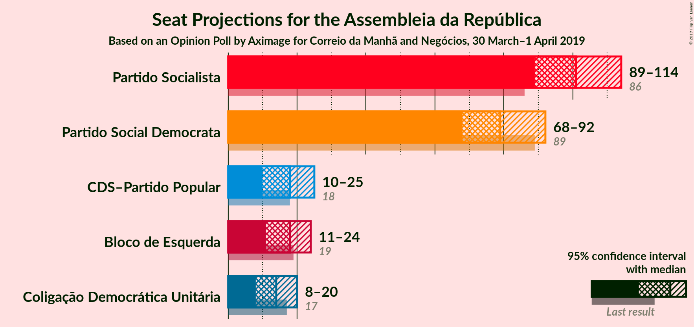
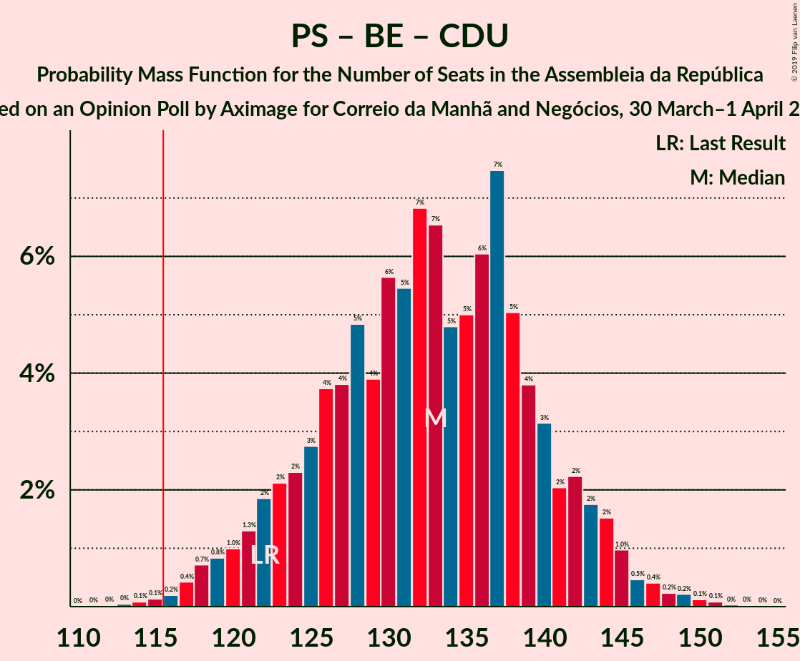

# Opinion Poll by Aximage for Correio da Manhã and Negócios, 30 March–1 April 2019

<a href="#voting-intentions">Voting Intentions</a> | <a href="#seats">Seats</a> | <a href="#coalitions">Coalitions</a> | <a href="#technical-information">Technical Information</a>

## Voting Intentions

### Confidence Intervals

| Party | Last Result | Poll Result | 80% Confidence Interval | 90% Confidence Interval | 95% Confidence Interval | 99% Confidence Interval |
|:-----:|:-----------:|:-----------:|:-----------------------:|:-----------------------:|:-----------------------:|:-----------------------:|
| Partido Socialista | 32.3% | 34.6% | 32.1–37.1% |31.4–37.8% |30.8–38.5% |29.7–39.7% |
| Partido Social Democrata | 36.9% | 27.2% | 25.0–29.7% |24.4–30.3% |23.8–30.9% |22.8–32.1% |
| Bloco de Esquerda | 10.2% | 8.5% | 7.2–10.1% |6.8–10.6% |6.5–11.0% |5.9–11.8% |
| CDS–Partido Popular | 36.9% | 8.5% | 7.2–10.1% |6.8–10.6% |6.5–11.0% |5.9–11.8% |
| Coligação Democrática Unitária | 8.2% | 7.0% | 5.8–8.5% |5.5–8.9% |5.2–9.3% |4.7–10.1% |

*Note:* The poll result column reflects the actual value used in the calculations. Published results may vary slightly, and in addition be rounded to fewer digits.

## Seats

### Confidence Intervals

| Party | Last Result | Median | 80% Confidence Interval | 90% Confidence Interval | 95% Confidence Interval | 99% Confidence Interval |
|:-----:|:-----------:|:------:|:-----------------------:|:-----------------------:|:-----------------------:|:-----------------------:|
| <a href="#partido-socialista">Partido Socialista</a> | 86 | 101 | 93–109 |90–112 |88–114 |85–117 |
| <a href="#partido-social-democrata">Partido Social Democrata</a> | 89 | 80 | 72–88 |69–90 |67–92 |65–95 |
| <a href="#bloco-de-esquerda">Bloco de Esquerda</a> | 19 | 18 | 14–22 |12–24 |11–24 |10–27 |
| <a href="#cds–partido-popular">CDS–Partido Popular</a> | 18 | 18 | 13–23 |11–24 |10–25 |10–28 |
| <a href="#coligação-democrática-unitária">Coligação Democrática Unitária</a> | 17 | 14 | 10–17 |9–19 |8–20 |6–21 |

### Partido Socialista

*For a full overview of the results for this party, see the [Partido Socialista](party-partidosocialista.html) page.*

| Number of Seats | Probability | Accumulated | Special Marks |
|:---------------:|:-----------:|:-----------:|:-------------:|
| 82 | 0% | 100% |  |
| 83 | 0.1% | 99.9% |  |
| 84 | 0.2% | 99.8% |  |
| 85 | 0.2% | 99.6% |  |
| 86 | 0.8% | 99.4% | Last Result |
| 87 | 0.4% | 98.6% |  |
| 88 | 0.8% | 98% |  |
| 89 | 1.2% | 97% |  |
| 90 | 1.5% | 96% |  |
| 91 | 2% | 95% |  |
| 92 | 2% | 93% |  |
| 93 | 3% | 90% |  |
| 94 | 3% | 88% |  |
| 95 | 5% | 84% |  |
| 96 | 3% | 79% |  |
| 97 | 5% | 76% |  |
| 98 | 7% | 71% |  |
| 99 | 4% | 64% |  |
| 100 | 8% | 60% |  |
| 101 | 5% | 53% | Median |
| 102 | 7% | 47% |  |
| 103 | 5% | 40% |  |
| 104 | 4% | 35% |  |
| 105 | 6% | 31% |  |
| 106 | 5% | 25% |  |
| 107 | 5% | 20% |  |
| 108 | 3% | 15% |  |
| 109 | 3% | 12% |  |
| 110 | 2% | 10% |  |
| 111 | 2% | 7% |  |
| 112 | 2% | 6% |  |
| 113 | 1.0% | 4% |  |
| 114 | 1.0% | 3% |  |
| 115 | 0.8% | 2% |  |
| 116 | 0.6% | 1.1% | Majority |
| 117 | 0.2% | 0.5% |  |
| 118 | 0.1% | 0.3% |  |
| 119 | 0.1% | 0.2% |  |
| 120 | 0% | 0.1% |  |
| 121 | 0% | 0.1% |  |
| 122 | 0% | 0% |  |

### Partido Social Democrata

*For a full overview of the results for this party, see the [Partido Social Democrata](party-partidosocialdemocrata.html) page.*

| Number of Seats | Probability | Accumulated | Special Marks |
|:---------------:|:-----------:|:-----------:|:-------------:|
| 60 | 0% | 100% |  |
| 61 | 0% | 99.9% |  |
| 62 | 0.1% | 99.9% |  |
| 63 | 0.1% | 99.8% |  |
| 64 | 0.2% | 99.7% |  |
| 65 | 0.5% | 99.5% |  |
| 66 | 0.8% | 99.0% |  |
| 67 | 1.1% | 98% |  |
| 68 | 1.1% | 97% |  |
| 69 | 1.3% | 96% |  |
| 70 | 2% | 95% |  |
| 71 | 2% | 93% |  |
| 72 | 2% | 91% |  |
| 73 | 7% | 88% |  |
| 74 | 4% | 81% |  |
| 75 | 6% | 77% |  |
| 76 | 4% | 71% |  |
| 77 | 5% | 67% |  |
| 78 | 6% | 62% |  |
| 79 | 5% | 56% |  |
| 80 | 6% | 51% | Median |
| 81 | 7% | 45% |  |
| 82 | 7% | 38% |  |
| 83 | 4% | 31% |  |
| 84 | 3% | 26% |  |
| 85 | 4% | 23% |  |
| 86 | 4% | 19% |  |
| 87 | 3% | 15% |  |
| 88 | 3% | 12% |  |
| 89 | 3% | 9% | Last Result |
| 90 | 2% | 6% |  |
| 91 | 1.3% | 4% |  |
| 92 | 1.0% | 3% |  |
| 93 | 0.7% | 2% |  |
| 94 | 0.6% | 1.3% |  |
| 95 | 0.3% | 0.6% |  |
| 96 | 0.1% | 0.3% |  |
| 97 | 0.1% | 0.2% |  |
| 98 | 0.1% | 0.1% |  |
| 99 | 0% | 0.1% |  |
| 100 | 0% | 0% |  |

### Bloco de Esquerda

*For a full overview of the results for this party, see the [Bloco de Esquerda](party-blocodeesquerda.html) page.*

| Number of Seats | Probability | Accumulated | Special Marks |
|:---------------:|:-----------:|:-----------:|:-------------:|
| 8 | 0% | 100% |  |
| 9 | 0.3% | 99.9% |  |
| 10 | 2% | 99.7% |  |
| 11 | 0.9% | 98% |  |
| 12 | 4% | 97% |  |
| 13 | 3% | 93% |  |
| 14 | 7% | 90% |  |
| 15 | 6% | 84% |  |
| 16 | 7% | 78% |  |
| 17 | 8% | 71% |  |
| 18 | 42% | 63% | Median |
| 19 | 4% | 21% | Last Result |
| 20 | 2% | 17% |  |
| 21 | 2% | 15% |  |
| 22 | 3% | 12% |  |
| 23 | 4% | 10% |  |
| 24 | 4% | 5% |  |
| 25 | 0.4% | 1.3% |  |
| 26 | 0.3% | 0.8% |  |
| 27 | 0.5% | 0.5% |  |
| 28 | 0% | 0.1% |  |
| 29 | 0% | 0% |  |

### CDS–Partido Popular

*For a full overview of the results for this party, see the [CDS–Partido Popular](party-cds–partidopopular.html) page.*

| Number of Seats | Probability | Accumulated | Special Marks |
|:---------------:|:-----------:|:-----------:|:-------------:|
| 7 | 0.1% | 100% |  |
| 8 | 0.1% | 99.9% |  |
| 9 | 0.3% | 99.8% |  |
| 10 | 3% | 99.6% |  |
| 11 | 2% | 97% |  |
| 12 | 3% | 95% |  |
| 13 | 5% | 92% |  |
| 14 | 4% | 86% |  |
| 15 | 7% | 82% |  |
| 16 | 10% | 75% |  |
| 17 | 8% | 65% |  |
| 18 | 11% | 57% | Last Result, Median |
| 19 | 9% | 46% |  |
| 20 | 11% | 37% |  |
| 21 | 12% | 26% |  |
| 22 | 4% | 14% |  |
| 23 | 4% | 10% |  |
| 24 | 3% | 6% |  |
| 25 | 1.0% | 3% |  |
| 26 | 0.8% | 2% |  |
| 27 | 0.8% | 1.3% |  |
| 28 | 0.3% | 0.6% |  |
| 29 | 0.1% | 0.3% |  |
| 30 | 0.1% | 0.2% |  |
| 31 | 0% | 0% |  |

### Coligação Democrática Unitária

*For a full overview of the results for this party, see the [Coligação Democrática Unitária](party-coligaçãodemocráticaunitária.html) page.*

| Number of Seats | Probability | Accumulated | Special Marks |
|:---------------:|:-----------:|:-----------:|:-------------:|
| 5 | 0.1% | 100% |  |
| 6 | 1.1% | 99.9% |  |
| 7 | 1.0% | 98.8% |  |
| 8 | 2% | 98% |  |
| 9 | 6% | 96% |  |
| 10 | 10% | 90% |  |
| 11 | 7% | 80% |  |
| 12 | 8% | 74% |  |
| 13 | 12% | 66% |  |
| 14 | 9% | 54% | Median |
| 15 | 4% | 45% |  |
| 16 | 13% | 41% |  |
| 17 | 21% | 28% | Last Result |
| 18 | 2% | 8% |  |
| 19 | 2% | 6% |  |
| 20 | 2% | 4% |  |
| 21 | 1.0% | 2% |  |
| 22 | 0.2% | 0.5% |  |
| 23 | 0.2% | 0.3% |  |
| 24 | 0.1% | 0.1% |  |
| 25 | 0% | 0% |  |

## Coalitions

### Confidence Intervals

| Coalition | Last Result | Median | Majority? | 80% Confidence Interval | 90% Confidence Interval | 95% Confidence Interval | 99% Confidence Interval |
|:---------:|:-----------:|:------:|:---------:|:-----------------------:|:-----------------------:|:-----------------------:|:-----------------------:|
| Partido Socialista – Bloco de Esquerda – Coligação Democrática Unitária | 122 | 133 | 99.7% | 124–141 | 121–143 | 119–145 | 116–149 |
| Partido Socialista – Bloco de Esquerda | 105 | 119 | 68% | 110–127 | 108–130 | 106–132 | 102–135 |
| Partido Socialista – Coligação Democrática Unitária | 103 | 115 | 48% | 106–123 | 103–125 | 101–127 | 99–131 |
| Partido Socialista | 86 | 101 | 1.1% | 93–109 | 90–112 | 88–114 | 85–117 |
| Partido Social Democrata – CDS–Partido Popular | 107 | 97 | 0.1% | 89–106 | 87–109 | 85–111 | 81–114 |

### Partido Socialista – Bloco de Esquerda – Coligação Democrática Unitária

| Number of Seats | Probability | Accumulated | Special Marks |
|:---------------:|:-----------:|:-----------:|:-------------:|
| 113 | 0% | 100% |  |
| 114 | 0.1% | 99.9% |  |
| 115 | 0.1% | 99.9% |  |
| 116 | 0.3% | 99.7% | Majority |
| 117 | 0.4% | 99.5% |  |
| 118 | 0.8% | 99.1% |  |
| 119 | 1.1% | 98% |  |
| 120 | 1.0% | 97% |  |
| 121 | 1.5% | 96% |  |
| 122 | 2% | 95% | Last Result |
| 123 | 2% | 93% |  |
| 124 | 3% | 91% |  |
| 125 | 3% | 88% |  |
| 126 | 4% | 85% |  |
| 127 | 4% | 81% |  |
| 128 | 4% | 77% |  |
| 129 | 5% | 73% |  |
| 130 | 5% | 68% |  |
| 131 | 5% | 63% |  |
| 132 | 7% | 58% |  |
| 133 | 8% | 51% | Median |
| 134 | 4% | 43% |  |
| 135 | 5% | 39% |  |
| 136 | 7% | 35% |  |
| 137 | 6% | 28% |  |
| 138 | 5% | 22% |  |
| 139 | 4% | 18% |  |
| 140 | 2% | 13% |  |
| 141 | 2% | 11% |  |
| 142 | 2% | 9% |  |
| 143 | 2% | 6% |  |
| 144 | 1.5% | 4% |  |
| 145 | 1.2% | 3% |  |
| 146 | 0.5% | 2% |  |
| 147 | 0.4% | 1.2% |  |
| 148 | 0.2% | 0.8% |  |
| 149 | 0.3% | 0.6% |  |
| 150 | 0.1% | 0.3% |  |
| 151 | 0.1% | 0.2% |  |
| 152 | 0% | 0.1% |  |
| 153 | 0% | 0.1% |  |
| 154 | 0% | 0% |  |

### Partido Socialista – Bloco de Esquerda

| Number of Seats | Probability | Accumulated | Special Marks |
|:---------------:|:-----------:|:-----------:|:-------------:|
| 99 | 0% | 100% |  |
| 100 | 0.1% | 99.9% |  |
| 101 | 0.2% | 99.8% |  |
| 102 | 0.2% | 99.6% |  |
| 103 | 0.4% | 99.4% |  |
| 104 | 0.5% | 99.0% |  |
| 105 | 0.6% | 98.5% | Last Result |
| 106 | 1.0% | 98% |  |
| 107 | 0.9% | 97% |  |
| 108 | 2% | 96% |  |
| 109 | 2% | 94% |  |
| 110 | 3% | 92% |  |
| 111 | 3% | 90% |  |
| 112 | 4% | 86% |  |
| 113 | 5% | 82% |  |
| 114 | 5% | 78% |  |
| 115 | 5% | 73% |  |
| 116 | 7% | 68% | Majority |
| 117 | 5% | 61% |  |
| 118 | 5% | 56% |  |
| 119 | 6% | 50% | Median |
| 120 | 8% | 44% |  |
| 121 | 4% | 37% |  |
| 122 | 4% | 33% |  |
| 123 | 7% | 29% |  |
| 124 | 4% | 22% |  |
| 125 | 4% | 18% |  |
| 126 | 3% | 14% |  |
| 127 | 2% | 11% |  |
| 128 | 2% | 9% |  |
| 129 | 2% | 7% |  |
| 130 | 1.2% | 5% |  |
| 131 | 0.9% | 4% |  |
| 132 | 1.3% | 3% |  |
| 133 | 0.8% | 2% |  |
| 134 | 0.3% | 0.9% |  |
| 135 | 0.2% | 0.6% |  |
| 136 | 0.1% | 0.3% |  |
| 137 | 0.1% | 0.2% |  |
| 138 | 0% | 0.1% |  |
| 139 | 0% | 0.1% |  |
| 140 | 0% | 0% |  |

### Partido Socialista – Coligação Democrática Unitária

| Number of Seats | Probability | Accumulated | Special Marks |
|:---------------:|:-----------:|:-----------:|:-------------:|
| 96 | 0% | 100% |  |
| 97 | 0.1% | 99.9% |  |
| 98 | 0.2% | 99.8% |  |
| 99 | 0.7% | 99.7% |  |
| 100 | 0.8% | 99.0% |  |
| 101 | 1.3% | 98% |  |
| 102 | 0.9% | 97% |  |
| 103 | 1.4% | 96% | Last Result |
| 104 | 2% | 95% |  |
| 105 | 2% | 93% |  |
| 106 | 2% | 90% |  |
| 107 | 3% | 88% |  |
| 108 | 4% | 85% |  |
| 109 | 3% | 82% |  |
| 110 | 4% | 79% |  |
| 111 | 5% | 75% |  |
| 112 | 5% | 71% |  |
| 113 | 4% | 65% |  |
| 114 | 6% | 61% |  |
| 115 | 6% | 55% | Median |
| 116 | 6% | 48% | Majority |
| 117 | 4% | 43% |  |
| 118 | 6% | 38% |  |
| 119 | 8% | 32% |  |
| 120 | 4% | 24% |  |
| 121 | 5% | 20% |  |
| 122 | 3% | 16% |  |
| 123 | 3% | 12% |  |
| 124 | 3% | 10% |  |
| 125 | 2% | 7% |  |
| 126 | 1.4% | 5% |  |
| 127 | 1.4% | 3% |  |
| 128 | 0.5% | 2% |  |
| 129 | 0.6% | 2% |  |
| 130 | 0.4% | 1.0% |  |
| 131 | 0.3% | 0.6% |  |
| 132 | 0.1% | 0.4% |  |
| 133 | 0.1% | 0.2% |  |
| 134 | 0% | 0.1% |  |
| 135 | 0% | 0.1% |  |
| 136 | 0% | 0% |  |

### Partido Socialista

| Number of Seats | Probability | Accumulated | Special Marks |
|:---------------:|:-----------:|:-----------:|:-------------:|
| 82 | 0% | 100% |  |
| 83 | 0.1% | 99.9% |  |
| 84 | 0.2% | 99.8% |  |
| 85 | 0.2% | 99.6% |  |
| 86 | 0.8% | 99.4% | Last Result |
| 87 | 0.4% | 98.6% |  |
| 88 | 0.8% | 98% |  |
| 89 | 1.2% | 97% |  |
| 90 | 1.5% | 96% |  |
| 91 | 2% | 95% |  |
| 92 | 2% | 93% |  |
| 93 | 3% | 90% |  |
| 94 | 3% | 88% |  |
| 95 | 5% | 84% |  |
| 96 | 3% | 79% |  |
| 97 | 5% | 76% |  |
| 98 | 7% | 71% |  |
| 99 | 4% | 64% |  |
| 100 | 8% | 60% |  |
| 101 | 5% | 53% | Median |
| 102 | 7% | 47% |  |
| 103 | 5% | 40% |  |
| 104 | 4% | 35% |  |
| 105 | 6% | 31% |  |
| 106 | 5% | 25% |  |
| 107 | 5% | 20% |  |
| 108 | 3% | 15% |  |
| 109 | 3% | 12% |  |
| 110 | 2% | 10% |  |
| 111 | 2% | 7% |  |
| 112 | 2% | 6% |  |
| 113 | 1.0% | 4% |  |
| 114 | 1.0% | 3% |  |
| 115 | 0.8% | 2% |  |
| 116 | 0.6% | 1.1% | Majority |
| 117 | 0.2% | 0.5% |  |
| 118 | 0.1% | 0.3% |  |
| 119 | 0.1% | 0.2% |  |
| 120 | 0% | 0.1% |  |
| 121 | 0% | 0.1% |  |
| 122 | 0% | 0% |  |

### Partido Social Democrata – CDS–Partido Popular

| Number of Seats | Probability | Accumulated | Special Marks |
|:---------------:|:-----------:|:-----------:|:-------------:|
| 77 | 0% | 100% |  |
| 78 | 0% | 99.9% |  |
| 79 | 0.1% | 99.9% |  |
| 80 | 0.1% | 99.8% |  |
| 81 | 0.3% | 99.7% |  |
| 82 | 0.2% | 99.4% |  |
| 83 | 0.4% | 99.2% |  |
| 84 | 0.5% | 98.8% |  |
| 85 | 1.2% | 98% |  |
| 86 | 1.5% | 97% |  |
| 87 | 2% | 96% |  |
| 88 | 2% | 94% |  |
| 89 | 2% | 91% |  |
| 90 | 2% | 89% |  |
| 91 | 4% | 87% |  |
| 92 | 5% | 82% |  |
| 93 | 6% | 78% |  |
| 94 | 7% | 72% |  |
| 95 | 5% | 65% |  |
| 96 | 4% | 61% |  |
| 97 | 8% | 57% |  |
| 98 | 7% | 49% | Median |
| 99 | 5% | 42% |  |
| 100 | 5% | 37% |  |
| 101 | 5% | 32% |  |
| 102 | 4% | 27% |  |
| 103 | 4% | 23% |  |
| 104 | 4% | 19% |  |
| 105 | 3% | 15% |  |
| 106 | 3% | 12% |  |
| 107 | 2% | 9% | Last Result |
| 108 | 2% | 7% |  |
| 109 | 1.5% | 5% |  |
| 110 | 1.0% | 4% |  |
| 111 | 1.1% | 3% |  |
| 112 | 0.8% | 2% |  |
| 113 | 0.4% | 0.9% |  |
| 114 | 0.3% | 0.5% |  |
| 115 | 0.1% | 0.3% |  |
| 116 | 0.1% | 0.1% | Majority |
| 117 | 0% | 0.1% |  |
| 118 | 0% | 0% |  |

## Technical Information

### Opinion Poll

+ **Polling firm:** Aximage
+ **Commissioner(s):** Correio da Manhã and Negócios
+ **Fieldwork period:** 30 March–1 April 2019

### Calculations

+ **Sample size:** 602
+ **Simulations done:** 262,144
+ **Error estimate:** 0.70%

