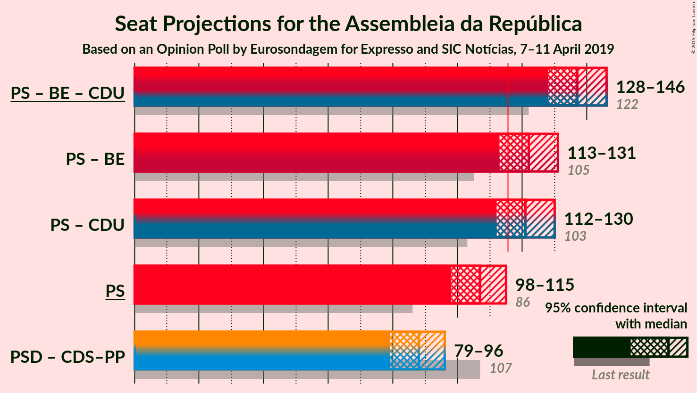
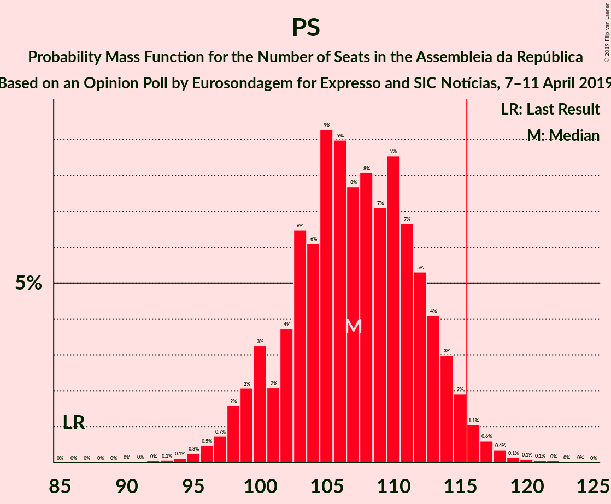

# Opinion Poll by Eurosondagem for Expresso and SIC Notícias, 7–11 April 2019

<a href="#voting-intentions">Voting Intentions</a> | <a href="#seats">Seats</a> | <a href="#coalitions">Coalitions</a> | <a href="#technical-information">Technical Information</a>

## Voting Intentions

### Confidence Intervals

| Party | Last Result | Poll Result | 80% Confidence Interval | 90% Confidence Interval | 95% Confidence Interval | 99% Confidence Interval |
|:-----:|:-----------:|:-----------:|:-----------------------:|:-----------------------:|:-----------------------:|:-----------------------:|
| Partido Socialista | 32.3% | 36.9% | 35.0–38.9% |34.4–39.4% |34.0–39.9% |33.1–40.9% |
| Partido Social Democrata | 36.9% | 25.0% | 23.3–26.8% |22.9–27.3% |22.5–27.8% |21.7–28.7% |
| CDS–Partido Popular | 36.9% | 8.4% | 7.4–9.7% |7.1–10.0% |6.9–10.3% |6.4–10.9% |
| Bloco de Esquerda | 10.2% | 7.8% | 6.8–8.9% |6.5–9.3% |6.3–9.6% |5.8–10.2% |
| Coligação Democrática Unitária | 8.2% | 7.3% | 6.3–8.4% |6.1–8.7% |5.8–9.0% |5.4–9.6% |
| Aliança | 0.0% | 3.5% | 2.9–4.4% |2.7–4.6% |2.6–4.9% |2.3–5.3% |
| Pessoas–Animais–Natureza | 1.4% | 2.5% | 1.9–3.2% |1.8–3.4% |1.7–3.6% |1.4–4.0% |

*Note:* The poll result column reflects the actual value used in the calculations. Published results may vary slightly, and in addition be rounded to fewer digits.

## Seats

### Confidence Intervals

| Party | Last Result | Median | 80% Confidence Interval | 90% Confidence Interval | 95% Confidence Interval | 99% Confidence Interval |
|:-----:|:-----------:|:------:|:-----------------------:|:-----------------------:|:-----------------------:|:-----------------------:|
| <a href="#partido-socialista">Partido Socialista</a> | 86 | 107 | 102–112 |99–113 |98–116 |97–117 |
| <a href="#partido-social-democrata">Partido Social Democrata</a> | 89 | 70 | 62–76 |62–77 |62–77 |61–80 |
| <a href="#cds–partido-popular">CDS–Partido Popular</a> | 18 | 19 | 15–19 |14–20 |11–21 |9–24 |
| <a href="#bloco-de-esquerda">Bloco de Esquerda</a> | 19 | 16 | 14–18 |12–18 |10–18 |10–19 |
| <a href="#coligação-democrática-unitária">Coligação Democrática Unitária</a> | 17 | 12 | 9–17 |9–17 |9–19 |8–21 |
| <a href="#aliança">Aliança</a> | 0 | 2 | 2–4 |2–6 |2–6 |2–6 |
| <a href="#pessoas–animais–natureza">Pessoas–Animais–Natureza</a> | 1 | 2 | 2–3 |1–4 |1–4 |1–6 |

### Partido Socialista

*For a full overview of the results for this party, see the [Partido Socialista](party-partidosocialista.html) page.*

| Number of Seats | Probability | Accumulated | Special Marks |
|:---------------:|:-----------:|:-----------:|:-------------:|
| 86 | 0% | 100% | Last Result |
| 87 | 0% | 100% |  |
| 88 | 0% | 100% |  |
| 89 | 0% | 100% |  |
| 90 | 0% | 100% |  |
| 91 | 0.1% | 100% |  |
| 92 | 0% | 99.9% |  |
| 93 | 0% | 99.9% |  |
| 94 | 0.1% | 99.9% |  |
| 95 | 0% | 99.8% |  |
| 96 | 0.3% | 99.8% |  |
| 97 | 0.3% | 99.5% |  |
| 98 | 4% | 99.2% |  |
| 99 | 2% | 95% |  |
| 100 | 0.7% | 93% |  |
| 101 | 2% | 92% |  |
| 102 | 6% | 91% |  |
| 103 | 0.8% | 85% |  |
| 104 | 0.6% | 84% |  |
| 105 | 1.0% | 84% |  |
| 106 | 30% | 83% |  |
| 107 | 22% | 53% | Median |
| 108 | 2% | 30% |  |
| 109 | 2% | 29% |  |
| 110 | 0.1% | 27% |  |
| 111 | 0.3% | 27% |  |
| 112 | 21% | 27% |  |
| 113 | 0.2% | 5% |  |
| 114 | 0.7% | 5% |  |
| 115 | 0.3% | 4% |  |
| 116 | 3% | 4% | Majority |
| 117 | 0.3% | 0.5% |  |
| 118 | 0.1% | 0.2% |  |
| 119 | 0.1% | 0.2% |  |
| 120 | 0% | 0.1% |  |
| 121 | 0% | 0.1% |  |
| 122 | 0.1% | 0.1% |  |
| 123 | 0% | 0% |  |

### Partido Social Democrata

*For a full overview of the results for this party, see the [Partido Social Democrata](party-partidosocialdemocrata.html) page.*

| Number of Seats | Probability | Accumulated | Special Marks |
|:---------------:|:-----------:|:-----------:|:-------------:|
| 56 | 0.2% | 100% |  |
| 57 | 0% | 99.8% |  |
| 58 | 0.1% | 99.8% |  |
| 59 | 0.1% | 99.7% |  |
| 60 | 0.1% | 99.6% |  |
| 61 | 1.0% | 99.5% |  |
| 62 | 20% | 98.5% |  |
| 63 | 3% | 78% |  |
| 64 | 2% | 75% |  |
| 65 | 0.1% | 73% |  |
| 66 | 0.3% | 73% |  |
| 67 | 3% | 73% |  |
| 68 | 0.5% | 70% |  |
| 69 | 2% | 70% |  |
| 70 | 23% | 68% | Median |
| 71 | 0.4% | 46% |  |
| 72 | 2% | 45% |  |
| 73 | 4% | 43% |  |
| 74 | 4% | 39% |  |
| 75 | 1.2% | 35% |  |
| 76 | 27% | 34% |  |
| 77 | 5% | 7% |  |
| 78 | 0.9% | 2% |  |
| 79 | 0.6% | 1.3% |  |
| 80 | 0.4% | 0.8% |  |
| 81 | 0% | 0.4% |  |
| 82 | 0.2% | 0.4% |  |
| 83 | 0.1% | 0.2% |  |
| 84 | 0% | 0.1% |  |
| 85 | 0% | 0.1% |  |
| 86 | 0% | 0% |  |
| 87 | 0% | 0% |  |
| 88 | 0% | 0% |  |
| 89 | 0% | 0% | Last Result |

### CDS–Partido Popular

*For a full overview of the results for this party, see the [CDS–Partido Popular](party-cds–partidopopular.html) page.*

| Number of Seats | Probability | Accumulated | Special Marks |
|:---------------:|:-----------:|:-----------:|:-------------:|
| 9 | 0.7% | 100% |  |
| 10 | 0.9% | 99.3% |  |
| 11 | 1.0% | 98% |  |
| 12 | 0.5% | 97% |  |
| 13 | 0.4% | 97% |  |
| 14 | 5% | 97% |  |
| 15 | 1.5% | 91% |  |
| 16 | 8% | 90% |  |
| 17 | 3% | 82% |  |
| 18 | 22% | 79% | Last Result |
| 19 | 48% | 57% | Median |
| 20 | 6% | 9% |  |
| 21 | 0.6% | 3% |  |
| 22 | 0.2% | 2% |  |
| 23 | 1.2% | 2% |  |
| 24 | 0.2% | 0.6% |  |
| 25 | 0.2% | 0.5% |  |
| 26 | 0% | 0.3% |  |
| 27 | 0% | 0.3% |  |
| 28 | 0.2% | 0.3% |  |
| 29 | 0% | 0% |  |

### Bloco de Esquerda

*For a full overview of the results for this party, see the [Bloco de Esquerda](party-blocodeesquerda.html) page.*

| Number of Seats | Probability | Accumulated | Special Marks |
|:---------------:|:-----------:|:-----------:|:-------------:|
| 9 | 0.4% | 100% |  |
| 10 | 4% | 99.6% |  |
| 11 | 0.4% | 96% |  |
| 12 | 1.1% | 95% |  |
| 13 | 3% | 94% |  |
| 14 | 2% | 91% |  |
| 15 | 29% | 89% |  |
| 16 | 25% | 59% | Median |
| 17 | 8% | 35% |  |
| 18 | 26% | 27% |  |
| 19 | 0.2% | 0.7% | Last Result |
| 20 | 0.1% | 0.5% |  |
| 21 | 0.1% | 0.4% |  |
| 22 | 0% | 0.3% |  |
| 23 | 0% | 0.3% |  |
| 24 | 0.3% | 0.3% |  |
| 25 | 0% | 0% |  |

### Coligação Democrática Unitária

*For a full overview of the results for this party, see the [Coligação Democrática Unitária](party-coligaçãodemocráticaunitária.html) page.*

| Number of Seats | Probability | Accumulated | Special Marks |
|:---------------:|:-----------:|:-----------:|:-------------:|
| 7 | 0.3% | 100% |  |
| 8 | 1.0% | 99.7% |  |
| 9 | 16% | 98.7% |  |
| 10 | 12% | 83% |  |
| 11 | 0.9% | 70% |  |
| 12 | 20% | 70% | Median |
| 13 | 2% | 49% |  |
| 14 | 6% | 47% |  |
| 15 | 3% | 41% |  |
| 16 | 7% | 38% |  |
| 17 | 27% | 31% | Last Result |
| 18 | 0.3% | 4% |  |
| 19 | 2% | 4% |  |
| 20 | 0.2% | 1.2% |  |
| 21 | 0.9% | 0.9% |  |
| 22 | 0% | 0% |  |

### Aliança

*For a full overview of the results for this party, see the [Aliança](party-aliança.html) page.*

| Number of Seats | Probability | Accumulated | Special Marks |
|:---------------:|:-----------:|:-----------:|:-------------:|
| 0 | 0% | 100% | Last Result |
| 1 | 0% | 100% |  |
| 2 | 57% | 100% | Median |
| 3 | 22% | 43% |  |
| 4 | 14% | 21% |  |
| 5 | 2% | 7% |  |
| 6 | 5% | 5% |  |
| 7 | 0.2% | 0.2% |  |
| 8 | 0% | 0.1% |  |
| 9 | 0% | 0% |  |

### Pessoas–Animais–Natureza

*For a full overview of the results for this party, see the [Pessoas–Animais–Natureza](party-pessoas–animais–natureza.html) page.*

| Number of Seats | Probability | Accumulated | Special Marks |
|:---------------:|:-----------:|:-----------:|:-------------:|
| 0 | 0.4% | 100% |  |
| 1 | 6% | 99.6% | Last Result |
| 2 | 55% | 94% | Median |
| 3 | 30% | 39% |  |
| 4 | 7% | 9% |  |
| 5 | 0.1% | 1.5% |  |
| 6 | 1.4% | 1.4% |  |
| 7 | 0% | 0% |  |

## Coalitions

### Confidence Intervals

| Coalition | Last Result | Median | Majority? | 80% Confidence Interval | 90% Confidence Interval | 95% Confidence Interval | 99% Confidence Interval |
|:---------:|:-----------:|:------:|:---------:|:-----------------------:|:-----------------------:|:-----------------------:|:-----------------------:|
| Partido Socialista – Bloco de Esquerda – Coligação Democrática Unitária | 122 | 137 | 100% | 130–145 | 129–145 | 129–145 | 125–145 |
| Partido Socialista – Coligação Democrática Unitária | 103 | 119 | 77% | 115–129 | 112–129 | 112–131 | 108–131 |
| Partido Socialista – Bloco de Esquerda | 105 | 122 | 94% | 117–128 | 115–128 | 115–128 | 112–133 |
| Partido Socialista | 86 | 107 | 4% | 102–112 | 99–113 | 98–116 | 97–117 |
| Partido Social Democrata – CDS–Partido Popular | 107 | 89 | 0% | 80–95 | 80–95 | 80–95 | 78–97 |

### Partido Socialista – Bloco de Esquerda – Coligação Democrática Unitária

| Number of Seats | Probability | Accumulated | Special Marks |
|:---------------:|:-----------:|:-----------:|:-------------:|
| 120 | 0% | 100% |  |
| 121 | 0% | 99.9% |  |
| 122 | 0% | 99.9% | Last Result |
| 123 | 0% | 99.9% |  |
| 124 | 0% | 99.9% |  |
| 125 | 0.6% | 99.9% |  |
| 126 | 0.4% | 99.4% |  |
| 127 | 0.1% | 99.0% |  |
| 128 | 0.9% | 98.9% |  |
| 129 | 5% | 98% |  |
| 130 | 16% | 93% |  |
| 131 | 12% | 77% |  |
| 132 | 0.9% | 65% |  |
| 133 | 0.8% | 64% |  |
| 134 | 0% | 63% |  |
| 135 | 2% | 63% | Median |
| 136 | 5% | 61% |  |
| 137 | 23% | 56% |  |
| 138 | 5% | 33% |  |
| 139 | 0.3% | 28% |  |
| 140 | 1.2% | 28% |  |
| 141 | 4% | 27% |  |
| 142 | 0.2% | 23% |  |
| 143 | 0.3% | 22% |  |
| 144 | 0.1% | 22% |  |
| 145 | 22% | 22% |  |
| 146 | 0.1% | 0.4% |  |
| 147 | 0.1% | 0.3% |  |
| 148 | 0.1% | 0.3% |  |
| 149 | 0.1% | 0.2% |  |
| 150 | 0% | 0.1% |  |
| 151 | 0% | 0% |  |

### Partido Socialista – Coligação Democrática Unitária

| Number of Seats | Probability | Accumulated | Special Marks |
|:---------------:|:-----------:|:-----------:|:-------------:|
| 103 | 0% | 100% | Last Result |
| 104 | 0% | 100% |  |
| 105 | 0% | 100% |  |
| 106 | 0% | 100% |  |
| 107 | 0% | 99.9% |  |
| 108 | 0.4% | 99.9% |  |
| 109 | 0.4% | 99.5% |  |
| 110 | 0.2% | 99.1% |  |
| 111 | 0% | 98.9% |  |
| 112 | 4% | 98.9% |  |
| 113 | 1.0% | 95% |  |
| 114 | 0.3% | 94% |  |
| 115 | 16% | 93% |  |
| 116 | 12% | 77% | Majority |
| 117 | 0.1% | 65% |  |
| 118 | 5% | 65% |  |
| 119 | 21% | 60% | Median |
| 120 | 3% | 39% |  |
| 121 | 0.3% | 37% |  |
| 122 | 5% | 37% |  |
| 123 | 2% | 32% |  |
| 124 | 5% | 30% |  |
| 125 | 0.2% | 25% |  |
| 126 | 0.2% | 25% |  |
| 127 | 0.2% | 25% |  |
| 128 | 0.4% | 25% |  |
| 129 | 21% | 25% |  |
| 130 | 0.4% | 4% |  |
| 131 | 3% | 3% |  |
| 132 | 0.1% | 0.2% |  |
| 133 | 0% | 0.1% |  |
| 134 | 0.1% | 0.1% |  |
| 135 | 0% | 0% |  |

### Partido Socialista – Bloco de Esquerda

| Number of Seats | Probability | Accumulated | Special Marks |
|:---------------:|:-----------:|:-----------:|:-------------:|
| 105 | 0% | 100% | Last Result |
| 106 | 0% | 100% |  |
| 107 | 0% | 100% |  |
| 108 | 0% | 100% |  |
| 109 | 0.1% | 100% |  |
| 110 | 0% | 99.9% |  |
| 111 | 0.2% | 99.9% |  |
| 112 | 0.5% | 99.6% |  |
| 113 | 0% | 99.2% |  |
| 114 | 0.3% | 99.1% |  |
| 115 | 5% | 98.8% |  |
| 116 | 3% | 94% | Majority |
| 117 | 1.5% | 91% |  |
| 118 | 0.9% | 89% |  |
| 119 | 0.3% | 88% |  |
| 120 | 8% | 88% |  |
| 121 | 28% | 80% |  |
| 122 | 3% | 52% |  |
| 123 | 1.0% | 49% | Median |
| 124 | 0.7% | 48% |  |
| 125 | 19% | 47% |  |
| 126 | 4% | 28% |  |
| 127 | 0% | 24% |  |
| 128 | 21% | 23% |  |
| 129 | 0.3% | 2% |  |
| 130 | 0% | 2% |  |
| 131 | 0% | 2% |  |
| 132 | 0.4% | 2% |  |
| 133 | 0.9% | 1.4% |  |
| 134 | 0.3% | 0.5% |  |
| 135 | 0% | 0.1% |  |
| 136 | 0% | 0.1% |  |
| 137 | 0% | 0.1% |  |
| 138 | 0% | 0.1% |  |
| 139 | 0% | 0% |  |

### Partido Socialista

| Number of Seats | Probability | Accumulated | Special Marks |
|:---------------:|:-----------:|:-----------:|:-------------:|
| 86 | 0% | 100% | Last Result |
| 87 | 0% | 100% |  |
| 88 | 0% | 100% |  |
| 89 | 0% | 100% |  |
| 90 | 0% | 100% |  |
| 91 | 0.1% | 100% |  |
| 92 | 0% | 99.9% |  |
| 93 | 0% | 99.9% |  |
| 94 | 0.1% | 99.9% |  |
| 95 | 0% | 99.8% |  |
| 96 | 0.3% | 99.8% |  |
| 97 | 0.3% | 99.5% |  |
| 98 | 4% | 99.2% |  |
| 99 | 2% | 95% |  |
| 100 | 0.7% | 93% |  |
| 101 | 2% | 92% |  |
| 102 | 6% | 91% |  |
| 103 | 0.8% | 85% |  |
| 104 | 0.6% | 84% |  |
| 105 | 1.0% | 84% |  |
| 106 | 30% | 83% |  |
| 107 | 22% | 53% | Median |
| 108 | 2% | 30% |  |
| 109 | 2% | 29% |  |
| 110 | 0.1% | 27% |  |
| 111 | 0.3% | 27% |  |
| 112 | 21% | 27% |  |
| 113 | 0.2% | 5% |  |
| 114 | 0.7% | 5% |  |
| 115 | 0.3% | 4% |  |
| 116 | 3% | 4% | Majority |
| 117 | 0.3% | 0.5% |  |
| 118 | 0.1% | 0.2% |  |
| 119 | 0.1% | 0.2% |  |
| 120 | 0% | 0.1% |  |
| 121 | 0% | 0.1% |  |
| 122 | 0.1% | 0.1% |  |
| 123 | 0% | 0% |  |

### Partido Social Democrata – CDS–Partido Popular

| Number of Seats | Probability | Accumulated | Special Marks |
|:---------------:|:-----------:|:-----------:|:-------------:|
| 74 | 0.2% | 100% |  |
| 75 | 0% | 99.8% |  |
| 76 | 0.1% | 99.8% |  |
| 77 | 0.1% | 99.7% |  |
| 78 | 0.3% | 99.6% |  |
| 79 | 1.3% | 99.3% |  |
| 80 | 21% | 98% |  |
| 81 | 0% | 77% |  |
| 82 | 0.4% | 77% |  |
| 83 | 4% | 77% |  |
| 84 | 3% | 73% |  |
| 85 | 0.2% | 70% |  |
| 86 | 2% | 69% |  |
| 87 | 5% | 68% |  |
| 88 | 2% | 63% |  |
| 89 | 19% | 60% | Median |
| 90 | 5% | 41% |  |
| 91 | 0.3% | 36% |  |
| 92 | 0.8% | 35% |  |
| 93 | 5% | 35% |  |
| 94 | 0.9% | 30% |  |
| 95 | 28% | 29% |  |
| 96 | 0.7% | 1.2% |  |
| 97 | 0.2% | 0.5% |  |
| 98 | 0.1% | 0.4% |  |
| 99 | 0% | 0.3% |  |
| 100 | 0% | 0.3% |  |
| 101 | 0.2% | 0.3% |  |
| 102 | 0% | 0.1% |  |
| 103 | 0% | 0.1% |  |
| 104 | 0% | 0% |  |
| 105 | 0% | 0% |  |
| 106 | 0% | 0% |  |
| 107 | 0% | 0% | Last Result |

## Technical Information

### Opinion Poll

+ **Polling firm:** Eurosondagem
+ **Commissioner(s):** Expresso and SIC Notícias
+ **Fieldwork period:** 7–11 April 2019

### Calculations

+ **Sample size:** 1019
+ **Simulations done:** 8,192
+ **Error estimate:** 2.50%

