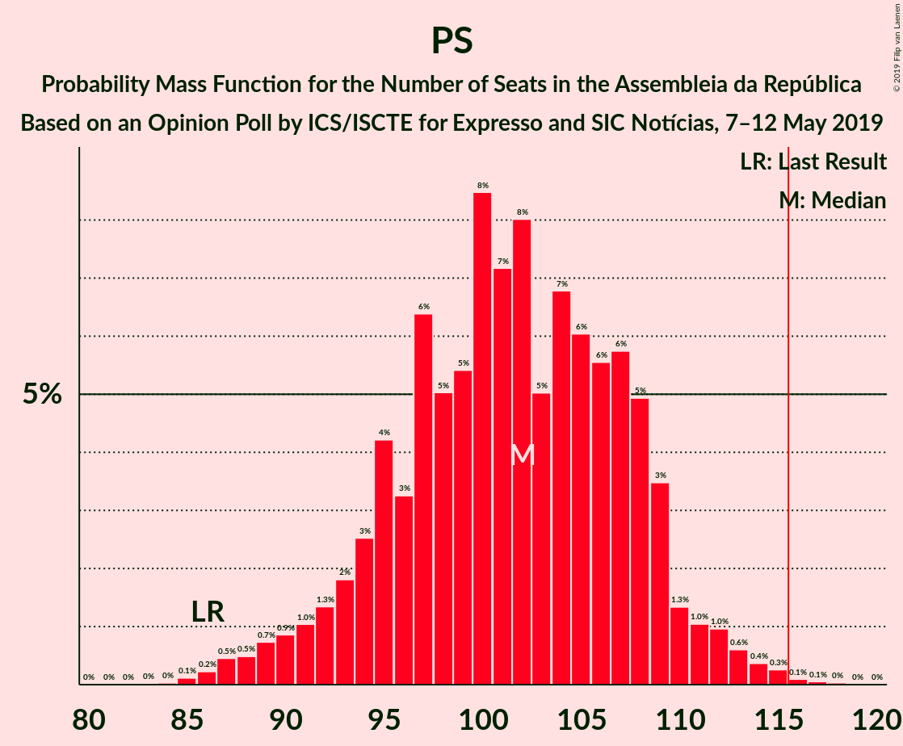
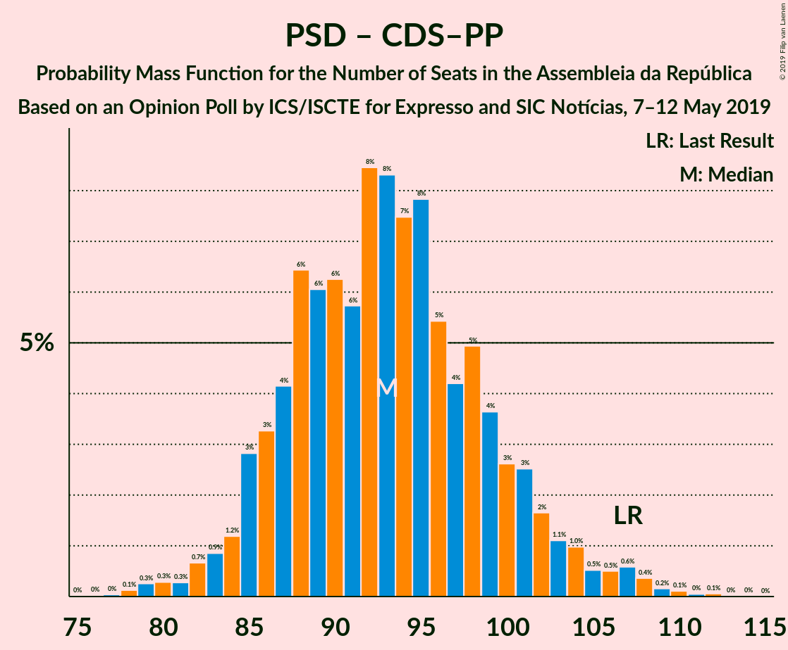

# Opinion Poll by ICS/ISCTE for Expresso and SIC Notícias, 7–12 May 2019

<a href="#voting-intentions">Voting Intentions</a> | <a href="#seats">Seats</a> | <a href="#coalitions">Coalitions</a> | <a href="#technical-information">Technical Information</a>

## Voting Intentions

### Confidence Intervals

| Party | Last Result | Poll Result | 80% Confidence Interval | 90% Confidence Interval | 95% Confidence Interval | 99% Confidence Interval |
|:-----:|:-----------:|:-----------:|:-----------------------:|:-----------------------:|:-----------------------:|:-----------------------:|
| Partido Socialista | 32.3% | 36.0% | 33.9–38.2% |33.3–38.8% |32.7–39.4% |31.7–40.5% |
| Partido Social Democrata | 36.9% | 28.0% | 26.0–30.1% |25.5–30.7% |25.0–31.2% |24.1–32.3% |
| Bloco de Esquerda | 10.2% | 9.0% | 7.8–10.4% |7.5–10.8% |7.2–11.2% |6.6–11.9% |
| CDS–Partido Popular | 36.9% | 8.0% | 6.9–9.3% |6.6–9.7% |6.3–10.1% |5.8–10.7% |
| Coligação Democrática Unitária | 8.2% | 8.0% | 6.9–9.3% |6.6–9.7% |6.3–10.1% |5.8–10.7% |
| Pessoas–Animais–Natureza | 1.4% | 2.0% | 1.5–2.8% |1.3–3.0% |1.2–3.2% |1.0–3.6% |

*Note:* The poll result column reflects the actual value used in the calculations. Published results may vary slightly, and in addition be rounded to fewer digits.

## Seats

### Confidence Intervals

| Party | Last Result | Median | 80% Confidence Interval | 90% Confidence Interval | 95% Confidence Interval | 99% Confidence Interval |
|:-----:|:-----------:|:------:|:-----------------------:|:-----------------------:|:-----------------------:|:-----------------------:|
| <a href="#partido-socialista">Partido Socialista</a> | 86 | 102 | 95–108 |92–109 |90–111 |87–114 |
| <a href="#partido-social-democrata">Partido Social Democrata</a> | 89 | 78 | 72–84 |70–87 |69–89 |65–92 |
| <a href="#bloco-de-esquerda">Bloco de Esquerda</a> | 19 | 18 | 15–22 |13–23 |12–24 |10–25 |
| <a href="#cds–partido-popular">CDS–Partido Popular</a> | 18 | 15 | 11–20 |10–20 |10–21 |8–24 |
| <a href="#coligação-democrática-unitária">Coligação Democrática Unitária</a> | 17 | 17 | 12–19 |10–20 |10–21 |9–22 |
| <a href="#pessoas–animais–natureza">Pessoas–Animais–Natureza</a> | 1 | 2 | 1–3 |1–3 |0–3 |0–4 |

### Partido Socialista

*For a full overview of the results for this party, see the [Partido Socialista](party-partidosocialista.html) page.*

| Number of Seats | Probability | Accumulated | Special Marks |
|:---------------:|:-----------:|:-----------:|:-------------:|
| 84 | 0% | 100% |  |
| 85 | 0.1% | 99.9% |  |
| 86 | 0.2% | 99.8% | Last Result |
| 87 | 0.5% | 99.6% |  |
| 88 | 0.5% | 99.1% |  |
| 89 | 0.7% | 98.7% |  |
| 90 | 0.9% | 98% |  |
| 91 | 1.0% | 97% |  |
| 92 | 1.3% | 96% |  |
| 93 | 2% | 95% |  |
| 94 | 3% | 93% |  |
| 95 | 4% | 90% |  |
| 96 | 3% | 86% |  |
| 97 | 6% | 83% |  |
| 98 | 5% | 76% |  |
| 99 | 5% | 71% |  |
| 100 | 8% | 66% |  |
| 101 | 7% | 58% |  |
| 102 | 8% | 50% | Median |
| 103 | 5% | 42% |  |
| 104 | 7% | 37% |  |
| 105 | 6% | 31% |  |
| 106 | 6% | 25% |  |
| 107 | 6% | 19% |  |
| 108 | 5% | 13% |  |
| 109 | 3% | 8% |  |
| 110 | 1.3% | 5% |  |
| 111 | 1.0% | 3% |  |
| 112 | 1.0% | 2% |  |
| 113 | 0.6% | 1.4% |  |
| 114 | 0.4% | 0.8% |  |
| 115 | 0.3% | 0.5% |  |
| 116 | 0.1% | 0.2% | Majority |
| 117 | 0.1% | 0.1% |  |
| 118 | 0% | 0.1% |  |
| 119 | 0% | 0% |  |

### Partido Social Democrata

*For a full overview of the results for this party, see the [Partido Social Democrata](party-partidosocialdemocrata.html) page.*

| Number of Seats | Probability | Accumulated | Special Marks |
|:---------------:|:-----------:|:-----------:|:-------------:|
| 62 | 0% | 100% |  |
| 63 | 0.1% | 99.9% |  |
| 64 | 0.1% | 99.9% |  |
| 65 | 0.3% | 99.7% |  |
| 66 | 0.4% | 99.4% |  |
| 67 | 0.8% | 99.0% |  |
| 68 | 0.7% | 98% |  |
| 69 | 1.5% | 98% |  |
| 70 | 2% | 96% |  |
| 71 | 2% | 94% |  |
| 72 | 3% | 92% |  |
| 73 | 5% | 88% |  |
| 74 | 7% | 83% |  |
| 75 | 10% | 76% |  |
| 76 | 5% | 65% |  |
| 77 | 7% | 60% |  |
| 78 | 7% | 53% | Median |
| 79 | 8% | 46% |  |
| 80 | 7% | 38% |  |
| 81 | 7% | 31% |  |
| 82 | 5% | 25% |  |
| 83 | 4% | 19% |  |
| 84 | 5% | 15% |  |
| 85 | 2% | 10% |  |
| 86 | 1.4% | 7% |  |
| 87 | 1.5% | 6% |  |
| 88 | 1.4% | 4% |  |
| 89 | 1.1% | 3% | Last Result |
| 90 | 0.8% | 2% |  |
| 91 | 0.6% | 1.2% |  |
| 92 | 0.2% | 0.6% |  |
| 93 | 0.2% | 0.4% |  |
| 94 | 0.1% | 0.2% |  |
| 95 | 0% | 0.1% |  |
| 96 | 0% | 0% |  |

### Bloco de Esquerda

*For a full overview of the results for this party, see the [Bloco de Esquerda](party-blocodeesquerda.html) page.*

| Number of Seats | Probability | Accumulated | Special Marks |
|:---------------:|:-----------:|:-----------:|:-------------:|
| 9 | 0.1% | 100% |  |
| 10 | 1.1% | 99.9% |  |
| 11 | 0.4% | 98.9% |  |
| 12 | 2% | 98% |  |
| 13 | 2% | 97% |  |
| 14 | 4% | 95% |  |
| 15 | 5% | 91% |  |
| 16 | 4% | 86% |  |
| 17 | 15% | 82% |  |
| 18 | 43% | 67% | Median |
| 19 | 7% | 24% | Last Result |
| 20 | 4% | 17% |  |
| 21 | 3% | 14% |  |
| 22 | 3% | 11% |  |
| 23 | 3% | 7% |  |
| 24 | 4% | 4% |  |
| 25 | 0.3% | 0.5% |  |
| 26 | 0.1% | 0.2% |  |
| 27 | 0.1% | 0.1% |  |
| 28 | 0% | 0% |  |

### CDS–Partido Popular

*For a full overview of the results for this party, see the [CDS–Partido Popular](party-cds–partidopopular.html) page.*

| Number of Seats | Probability | Accumulated | Special Marks |
|:---------------:|:-----------:|:-----------:|:-------------:|
| 6 | 0.1% | 100% |  |
| 7 | 0.2% | 99.9% |  |
| 8 | 0.4% | 99.7% |  |
| 9 | 1.2% | 99.3% |  |
| 10 | 7% | 98% |  |
| 11 | 7% | 91% |  |
| 12 | 4% | 84% |  |
| 13 | 20% | 80% |  |
| 14 | 9% | 60% |  |
| 15 | 14% | 51% | Median |
| 16 | 6% | 37% |  |
| 17 | 7% | 31% |  |
| 18 | 7% | 24% | Last Result |
| 19 | 4% | 18% |  |
| 20 | 11% | 14% |  |
| 21 | 2% | 3% |  |
| 22 | 0.5% | 1.5% |  |
| 23 | 0.4% | 1.0% |  |
| 24 | 0.4% | 0.7% |  |
| 25 | 0.2% | 0.2% |  |
| 26 | 0% | 0.1% |  |
| 27 | 0% | 0% |  |

### Coligação Democrática Unitária

*For a full overview of the results for this party, see the [Coligação Democrática Unitária](party-coligaçãodemocráticaunitária.html) page.*

| Number of Seats | Probability | Accumulated | Special Marks |
|:---------------:|:-----------:|:-----------:|:-------------:|
| 7 | 0.1% | 100% |  |
| 8 | 0.1% | 99.9% |  |
| 9 | 2% | 99.8% |  |
| 10 | 3% | 98% |  |
| 11 | 3% | 95% |  |
| 12 | 3% | 92% |  |
| 13 | 4% | 89% |  |
| 14 | 18% | 85% |  |
| 15 | 4% | 67% |  |
| 16 | 10% | 63% |  |
| 17 | 36% | 53% | Last Result, Median |
| 18 | 6% | 17% |  |
| 19 | 3% | 11% |  |
| 20 | 5% | 8% |  |
| 21 | 2% | 3% |  |
| 22 | 0.3% | 0.6% |  |
| 23 | 0.1% | 0.3% |  |
| 24 | 0.2% | 0.2% |  |
| 25 | 0% | 0% |  |

### Pessoas–Animais–Natureza

*For a full overview of the results for this party, see the [Pessoas–Animais–Natureza](party-pessoas–animais–natureza.html) page.*

| Number of Seats | Probability | Accumulated | Special Marks |
|:---------------:|:-----------:|:-----------:|:-------------:|
| 0 | 4% | 100% |  |
| 1 | 36% | 96% | Last Result |
| 2 | 46% | 61% | Median |
| 3 | 12% | 14% |  |
| 4 | 2% | 2% |  |
| 5 | 0.1% | 0.2% |  |
| 6 | 0.1% | 0.1% |  |
| 7 | 0% | 0% |  |

## Coalitions

### Confidence Intervals

| Coalition | Last Result | Median | Majority? | 80% Confidence Interval | 90% Confidence Interval | 95% Confidence Interval | 99% Confidence Interval |
|:---------:|:-----------:|:------:|:---------:|:-----------------------:|:-----------------------:|:-----------------------:|:-----------------------:|
| Partido Socialista – Bloco de Esquerda – Coligação Democrática Unitária | 122 | 135 | 100% | 128–142 | 126–143 | 124–145 | 120–149 |
| Partido Socialista – Bloco de Esquerda | 105 | 119 | 78% | 113–126 | 110–128 | 108–129 | 104–133 |
| Partido Socialista – Coligação Democrática Unitária | 103 | 117 | 63% | 110–124 | 108–126 | 106–127 | 102–131 |
| Partido Socialista | 86 | 102 | 0.2% | 95–108 | 92–109 | 90–111 | 87–114 |
| Partido Social Democrata – CDS–Partido Popular | 107 | 93 | 0% | 87–100 | 85–102 | 83–104 | 80–108 |

### Partido Socialista – Bloco de Esquerda – Coligação Democrática Unitária

| Number of Seats | Probability | Accumulated | Special Marks |
|:---------------:|:-----------:|:-----------:|:-------------:|
| 116 | 0% | 100% | Majority |
| 117 | 0.1% | 99.9% |  |
| 118 | 0.1% | 99.9% |  |
| 119 | 0.1% | 99.7% |  |
| 120 | 0.3% | 99.6% |  |
| 121 | 0.4% | 99.3% |  |
| 122 | 0.7% | 98.9% | Last Result |
| 123 | 0.6% | 98% |  |
| 124 | 0.7% | 98% |  |
| 125 | 1.2% | 97% |  |
| 126 | 2% | 96% |  |
| 127 | 2% | 94% |  |
| 128 | 3% | 92% |  |
| 129 | 3% | 90% |  |
| 130 | 5% | 86% |  |
| 131 | 5% | 82% |  |
| 132 | 6% | 77% |  |
| 133 | 7% | 71% |  |
| 134 | 7% | 64% |  |
| 135 | 8% | 57% |  |
| 136 | 8% | 49% |  |
| 137 | 7% | 41% | Median |
| 138 | 6% | 34% |  |
| 139 | 7% | 28% |  |
| 140 | 6% | 21% |  |
| 141 | 5% | 16% |  |
| 142 | 3% | 11% |  |
| 143 | 3% | 8% |  |
| 144 | 1.1% | 4% |  |
| 145 | 1.2% | 3% |  |
| 146 | 0.6% | 2% |  |
| 147 | 0.5% | 1.3% |  |
| 148 | 0.3% | 0.8% |  |
| 149 | 0.2% | 0.5% |  |
| 150 | 0.1% | 0.3% |  |
| 151 | 0.1% | 0.1% |  |
| 152 | 0% | 0.1% |  |
| 153 | 0% | 0% |  |

### Partido Socialista – Bloco de Esquerda

| Number of Seats | Probability | Accumulated | Special Marks |
|:---------------:|:-----------:|:-----------:|:-------------:|
| 101 | 0% | 100% |  |
| 102 | 0.1% | 99.9% |  |
| 103 | 0.2% | 99.9% |  |
| 104 | 0.3% | 99.7% |  |
| 105 | 0.6% | 99.4% | Last Result |
| 106 | 0.5% | 98.9% |  |
| 107 | 0.6% | 98% |  |
| 108 | 1.1% | 98% |  |
| 109 | 1.1% | 97% |  |
| 110 | 1.2% | 96% |  |
| 111 | 2% | 94% |  |
| 112 | 3% | 93% |  |
| 113 | 3% | 90% |  |
| 114 | 4% | 87% |  |
| 115 | 5% | 83% |  |
| 116 | 5% | 78% | Majority |
| 117 | 6% | 73% |  |
| 118 | 9% | 67% |  |
| 119 | 8% | 58% |  |
| 120 | 8% | 50% | Median |
| 121 | 5% | 42% |  |
| 122 | 9% | 37% |  |
| 123 | 7% | 28% |  |
| 124 | 6% | 21% |  |
| 125 | 4% | 16% |  |
| 126 | 4% | 12% |  |
| 127 | 2% | 8% |  |
| 128 | 1.5% | 5% |  |
| 129 | 1.5% | 4% |  |
| 130 | 0.8% | 2% |  |
| 131 | 0.7% | 2% |  |
| 132 | 0.4% | 0.9% |  |
| 133 | 0.2% | 0.5% |  |
| 134 | 0.1% | 0.3% |  |
| 135 | 0.1% | 0.2% |  |
| 136 | 0% | 0.1% |  |
| 137 | 0% | 0% |  |

### Partido Socialista – Coligação Democrática Unitária

| Number of Seats | Probability | Accumulated | Special Marks |
|:---------------:|:-----------:|:-----------:|:-------------:|
| 99 | 0.1% | 100% |  |
| 100 | 0.1% | 99.9% |  |
| 101 | 0.2% | 99.8% |  |
| 102 | 0.3% | 99.6% |  |
| 103 | 0.3% | 99.3% | Last Result |
| 104 | 0.6% | 99.0% |  |
| 105 | 0.6% | 98% |  |
| 106 | 1.1% | 98% |  |
| 107 | 1.1% | 97% |  |
| 108 | 2% | 95% |  |
| 109 | 2% | 94% |  |
| 110 | 3% | 92% |  |
| 111 | 4% | 89% |  |
| 112 | 4% | 86% |  |
| 113 | 6% | 81% |  |
| 114 | 7% | 76% |  |
| 115 | 6% | 69% |  |
| 116 | 6% | 63% | Majority |
| 117 | 7% | 57% |  |
| 118 | 7% | 50% |  |
| 119 | 8% | 43% | Median |
| 120 | 5% | 36% |  |
| 121 | 7% | 31% |  |
| 122 | 7% | 24% |  |
| 123 | 4% | 17% |  |
| 124 | 4% | 13% |  |
| 125 | 3% | 9% |  |
| 126 | 2% | 6% |  |
| 127 | 1.5% | 4% |  |
| 128 | 0.6% | 2% |  |
| 129 | 0.7% | 2% |  |
| 130 | 0.3% | 0.8% |  |
| 131 | 0.3% | 0.5% |  |
| 132 | 0.1% | 0.2% |  |
| 133 | 0.1% | 0.1% |  |
| 134 | 0% | 0.1% |  |
| 135 | 0% | 0% |  |

### Partido Socialista

| Number of Seats | Probability | Accumulated | Special Marks |
|:---------------:|:-----------:|:-----------:|:-------------:|
| 84 | 0% | 100% |  |
| 85 | 0.1% | 99.9% |  |
| 86 | 0.2% | 99.8% | Last Result |
| 87 | 0.5% | 99.6% |  |
| 88 | 0.5% | 99.1% |  |
| 89 | 0.7% | 98.7% |  |
| 90 | 0.9% | 98% |  |
| 91 | 1.0% | 97% |  |
| 92 | 1.3% | 96% |  |
| 93 | 2% | 95% |  |
| 94 | 3% | 93% |  |
| 95 | 4% | 90% |  |
| 96 | 3% | 86% |  |
| 97 | 6% | 83% |  |
| 98 | 5% | 76% |  |
| 99 | 5% | 71% |  |
| 100 | 8% | 66% |  |
| 101 | 7% | 58% |  |
| 102 | 8% | 50% | Median |
| 103 | 5% | 42% |  |
| 104 | 7% | 37% |  |
| 105 | 6% | 31% |  |
| 106 | 6% | 25% |  |
| 107 | 6% | 19% |  |
| 108 | 5% | 13% |  |
| 109 | 3% | 8% |  |
| 110 | 1.3% | 5% |  |
| 111 | 1.0% | 3% |  |
| 112 | 1.0% | 2% |  |
| 113 | 0.6% | 1.4% |  |
| 114 | 0.4% | 0.8% |  |
| 115 | 0.3% | 0.5% |  |
| 116 | 0.1% | 0.2% | Majority |
| 117 | 0.1% | 0.1% |  |
| 118 | 0% | 0.1% |  |
| 119 | 0% | 0% |  |

### Partido Social Democrata – CDS–Partido Popular

| Number of Seats | Probability | Accumulated | Special Marks |
|:---------------:|:-----------:|:-----------:|:-------------:|
| 77 | 0% | 100% |  |
| 78 | 0.1% | 99.9% |  |
| 79 | 0.3% | 99.8% |  |
| 80 | 0.3% | 99.5% |  |
| 81 | 0.3% | 99.3% |  |
| 82 | 0.7% | 99.0% |  |
| 83 | 0.9% | 98% |  |
| 84 | 1.2% | 97% |  |
| 85 | 3% | 96% |  |
| 86 | 3% | 93% |  |
| 87 | 4% | 90% |  |
| 88 | 6% | 86% |  |
| 89 | 6% | 80% |  |
| 90 | 6% | 74% |  |
| 91 | 6% | 67% |  |
| 92 | 8% | 62% |  |
| 93 | 8% | 53% | Median |
| 94 | 7% | 45% |  |
| 95 | 8% | 37% |  |
| 96 | 5% | 29% |  |
| 97 | 4% | 24% |  |
| 98 | 5% | 20% |  |
| 99 | 4% | 15% |  |
| 100 | 3% | 11% |  |
| 101 | 3% | 9% |  |
| 102 | 2% | 6% |  |
| 103 | 1.1% | 4% |  |
| 104 | 1.0% | 3% |  |
| 105 | 0.5% | 2% |  |
| 106 | 0.5% | 2% |  |
| 107 | 0.6% | 1.4% | Last Result |
| 108 | 0.4% | 0.8% |  |
| 109 | 0.2% | 0.4% |  |
| 110 | 0.1% | 0.2% |  |
| 111 | 0% | 0.1% |  |
| 112 | 0.1% | 0.1% |  |
| 113 | 0% | 0% |  |

## Technical Information

### Opinion Poll

+ **Polling firm:** ICS/ISCTE
+ **Commissioner(s):** Expresso and SIC Notícias
+ **Fieldwork period:** 7–12 May 2019

### Calculations

+ **Sample size:** 803
+ **Simulations done:** 1,048,576
+ **Error estimate:** 1.43%

