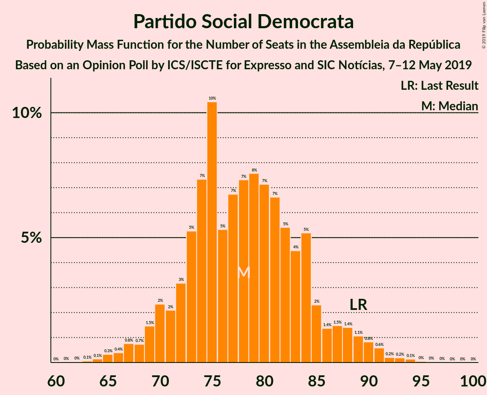
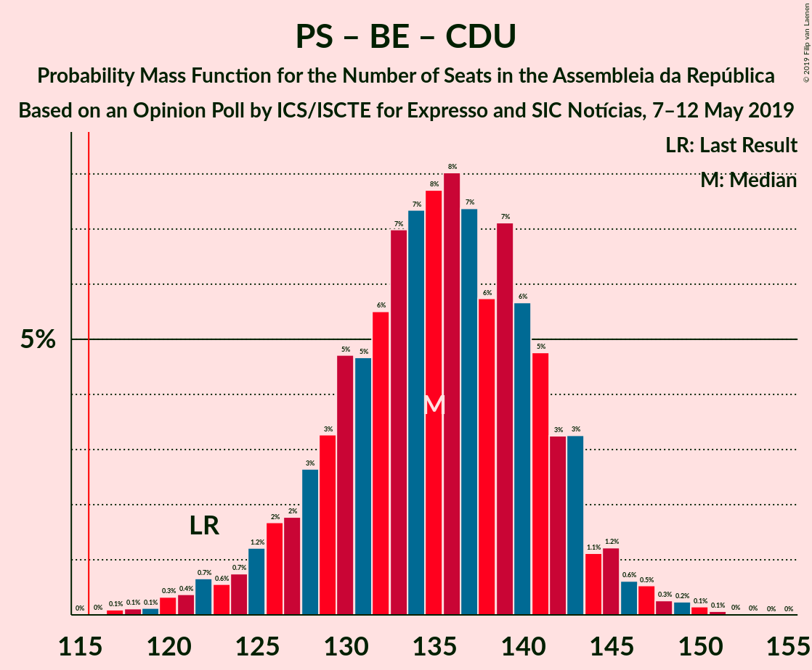

# Opinion Poll by ICS/ISCTE for Expresso and SIC Notícias, 7–12 May 2019

<a href="#voting-intentions">Voting Intentions</a> | <a href="#seats">Seats</a> | <a href="#coalitions">Coalitions</a> | <a href="#technical-information">Technical Information</a>

## Voting Intentions

### Confidence Intervals

| Party | Last Result | Poll Result | 80% Confidence Interval | 90% Confidence Interval | 95% Confidence Interval | 99% Confidence Interval |
|:-----:|:-----------:|:-----------:|:-----------------------:|:-----------------------:|:-----------------------:|:-----------------------:|
| Partido Socialista | 32.3% | 36.0% | 33.9–38.2% |33.3–38.8% |32.7–39.4% |31.7–40.5% |
| Partido Social Democrata | 36.9% | 28.0% | 26.0–30.1% |25.5–30.7% |25.0–31.2% |24.1–32.3% |
| Bloco de Esquerda | 10.2% | 9.0% | 7.8–10.4% |7.5–10.8% |7.2–11.2% |6.6–11.9% |
| CDS–Partido Popular | 36.9% | 8.0% | 6.9–9.3% |6.6–9.7% |6.3–10.1% |5.8–10.7% |
| Coligação Democrática Unitária | 8.2% | 8.0% | 6.9–9.3% |6.6–9.7% |6.3–10.1% |5.8–10.7% |
| Pessoas–Animais–Natureza | 1.4% | 2.0% | 1.5–2.8% |1.3–3.0% |1.2–3.2% |1.0–3.6% |

*Note:* The poll result column reflects the actual value used in the calculations. Published results may vary slightly, and in addition be rounded to fewer digits.

## Seats

### Confidence Intervals

| Party | Last Result | Median | 80% Confidence Interval | 90% Confidence Interval | 95% Confidence Interval | 99% Confidence Interval |
|:-----:|:-----------:|:------:|:-----------------------:|:-----------------------:|:-----------------------:|:-----------------------:|
| <a href="#partido-socialista">Partido Socialista</a> | 86 | 102 | 96–107 |94–109 |92–110 |87–113 |
| <a href="#partido-social-democrata">Partido Social Democrata</a> | 89 | 79 | 72–84 |71–87 |68–88 |66–91 |
| <a href="#bloco-de-esquerda">Bloco de Esquerda</a> | 19 | 18 | 15–21 |14–23 |13–24 |10–25 |
| <a href="#cds–partido-popular">CDS–Partido Popular</a> | 18 | 14 | 11–19 |10–20 |10–20 |9–23 |
| <a href="#coligação-democrática-unitária">Coligação Democrática Unitária</a> | 17 | 16 | 13–18 |11–20 |10–21 |9–22 |
| <a href="#pessoas–animais–natureza">Pessoas–Animais–Natureza</a> | 1 | 2 | 1–3 |1–3 |0–3 |0–4 |

### Partido Socialista

*For a full overview of the results for this party, see the [Partido Socialista](party-partidosocialista.html) page.*

| Number of Seats | Probability | Accumulated | Special Marks |
|:---------------:|:-----------:|:-----------:|:-------------:|
| 84 | 0.1% | 100% |  |
| 85 | 0% | 99.9% |  |
| 86 | 0.3% | 99.9% | Last Result |
| 87 | 0.2% | 99.6% |  |
| 88 | 0.2% | 99.3% |  |
| 89 | 0.3% | 99.1% |  |
| 90 | 0.2% | 98.8% |  |
| 91 | 0.5% | 98.6% |  |
| 92 | 1.2% | 98% |  |
| 93 | 0.8% | 97% |  |
| 94 | 2% | 96% |  |
| 95 | 3% | 95% |  |
| 96 | 3% | 92% |  |
| 97 | 4% | 89% |  |
| 98 | 2% | 85% |  |
| 99 | 6% | 83% |  |
| 100 | 16% | 78% |  |
| 101 | 8% | 62% |  |
| 102 | 13% | 54% | Median |
| 103 | 2% | 40% |  |
| 104 | 6% | 38% |  |
| 105 | 13% | 32% |  |
| 106 | 7% | 19% |  |
| 107 | 3% | 12% |  |
| 108 | 3% | 9% |  |
| 109 | 2% | 6% |  |
| 110 | 2% | 4% |  |
| 111 | 1.1% | 2% |  |
| 112 | 0.5% | 1.3% |  |
| 113 | 0.4% | 0.8% |  |
| 114 | 0.2% | 0.4% |  |
| 115 | 0.2% | 0.3% |  |
| 116 | 0% | 0.1% | Majority |
| 117 | 0% | 0.1% |  |
| 118 | 0% | 0% |  |

### Partido Social Democrata

*For a full overview of the results for this party, see the [Partido Social Democrata](party-partidosocialdemocrata.html) page.*

| Number of Seats | Probability | Accumulated | Special Marks |
|:---------------:|:-----------:|:-----------:|:-------------:|
| 63 | 0% | 100% |  |
| 64 | 0% | 99.9% |  |
| 65 | 0.2% | 99.9% |  |
| 66 | 0.4% | 99.7% |  |
| 67 | 2% | 99.3% |  |
| 68 | 0.4% | 98% |  |
| 69 | 0.6% | 97% |  |
| 70 | 2% | 97% |  |
| 71 | 1.2% | 95% |  |
| 72 | 4% | 94% |  |
| 73 | 3% | 90% |  |
| 74 | 6% | 87% |  |
| 75 | 19% | 81% |  |
| 76 | 3% | 62% |  |
| 77 | 5% | 59% |  |
| 78 | 4% | 54% |  |
| 79 | 13% | 50% | Median |
| 80 | 7% | 38% |  |
| 81 | 10% | 31% |  |
| 82 | 6% | 20% |  |
| 83 | 3% | 15% |  |
| 84 | 2% | 11% |  |
| 85 | 0.5% | 9% |  |
| 86 | 1.0% | 9% |  |
| 87 | 3% | 8% |  |
| 88 | 3% | 4% |  |
| 89 | 0.6% | 2% | Last Result |
| 90 | 0.3% | 0.9% |  |
| 91 | 0.2% | 0.6% |  |
| 92 | 0.1% | 0.4% |  |
| 93 | 0.1% | 0.3% |  |
| 94 | 0.1% | 0.2% |  |
| 95 | 0% | 0% |  |

### Bloco de Esquerda

*For a full overview of the results for this party, see the [Bloco de Esquerda](party-blocodeesquerda.html) page.*

| Number of Seats | Probability | Accumulated | Special Marks |
|:---------------:|:-----------:|:-----------:|:-------------:|
| 10 | 0.5% | 100% |  |
| 11 | 0.2% | 99.4% |  |
| 12 | 1.1% | 99.2% |  |
| 13 | 1.2% | 98% |  |
| 14 | 2% | 97% |  |
| 15 | 5% | 94% |  |
| 16 | 2% | 90% |  |
| 17 | 24% | 87% |  |
| 18 | 45% | 64% | Median |
| 19 | 3% | 18% | Last Result |
| 20 | 6% | 16% |  |
| 21 | 2% | 10% |  |
| 22 | 2% | 8% |  |
| 23 | 2% | 6% |  |
| 24 | 3% | 3% |  |
| 25 | 0.5% | 0.6% |  |
| 26 | 0% | 0.1% |  |
| 27 | 0.1% | 0.1% |  |
| 28 | 0% | 0% |  |

### CDS–Partido Popular

*For a full overview of the results for this party, see the [CDS–Partido Popular](party-cds–partidopopular.html) page.*

| Number of Seats | Probability | Accumulated | Special Marks |
|:---------------:|:-----------:|:-----------:|:-------------:|
| 7 | 0.1% | 100% |  |
| 8 | 0.2% | 99.8% |  |
| 9 | 0.6% | 99.6% |  |
| 10 | 6% | 99.0% |  |
| 11 | 8% | 93% |  |
| 12 | 5% | 85% |  |
| 13 | 28% | 80% |  |
| 14 | 9% | 53% | Median |
| 15 | 12% | 44% |  |
| 16 | 9% | 32% |  |
| 17 | 5% | 23% |  |
| 18 | 5% | 18% | Last Result |
| 19 | 4% | 14% |  |
| 20 | 8% | 10% |  |
| 21 | 0.6% | 2% |  |
| 22 | 0.4% | 1.0% |  |
| 23 | 0.2% | 0.7% |  |
| 24 | 0.3% | 0.5% |  |
| 25 | 0% | 0.2% |  |
| 26 | 0.1% | 0.1% |  |
| 27 | 0% | 0% |  |

### Coligação Democrática Unitária

*For a full overview of the results for this party, see the [Coligação Democrática Unitária](party-coligaçãodemocráticaunitária.html) page.*

| Number of Seats | Probability | Accumulated | Special Marks |
|:---------------:|:-----------:|:-----------:|:-------------:|
| 7 | 0.1% | 100% |  |
| 8 | 0.2% | 99.9% |  |
| 9 | 1.1% | 99.7% |  |
| 10 | 2% | 98.7% |  |
| 11 | 2% | 97% |  |
| 12 | 3% | 95% |  |
| 13 | 3% | 92% |  |
| 14 | 17% | 89% |  |
| 15 | 12% | 72% |  |
| 16 | 15% | 60% | Median |
| 17 | 31% | 45% | Last Result |
| 18 | 4% | 14% |  |
| 19 | 3% | 9% |  |
| 20 | 3% | 6% |  |
| 21 | 3% | 3% |  |
| 22 | 0.1% | 0.6% |  |
| 23 | 0.3% | 0.5% |  |
| 24 | 0.2% | 0.2% |  |
| 25 | 0% | 0% |  |

### Pessoas–Animais–Natureza

*For a full overview of the results for this party, see the [Pessoas–Animais–Natureza](party-pessoas–animais–natureza.html) page.*

| Number of Seats | Probability | Accumulated | Special Marks |
|:---------------:|:-----------:|:-----------:|:-------------:|
| 0 | 3% | 100% |  |
| 1 | 34% | 97% | Last Result |
| 2 | 52% | 63% | Median |
| 3 | 10% | 11% |  |
| 4 | 1.1% | 1.3% |  |
| 5 | 0.1% | 0.2% |  |
| 6 | 0.1% | 0.1% |  |
| 7 | 0% | 0% |  |

## Coalitions

### Confidence Intervals

| Coalition | Last Result | Median | Majority? | 80% Confidence Interval | 90% Confidence Interval | 95% Confidence Interval | 99% Confidence Interval |
|:---------:|:-----------:|:------:|:---------:|:-----------------------:|:-----------------------:|:-----------------------:|:-----------------------:|
| Partido Socialista – Bloco de Esquerda – Coligação Democrática Unitária | 122 | 136 | 100% | 131–140 | 129–142 | 126–143 | 120–145 |
| Partido Socialista – Bloco de Esquerda | 105 | 120 | 87% | 115–124 | 113–126 | 110–127 | 104–130 |
| Partido Socialista – Coligação Democrática Unitária | 103 | 118 | 73% | 112–124 | 109–126 | 107–126 | 103–129 |
| Partido Socialista | 86 | 102 | 0.1% | 96–107 | 94–109 | 92–110 | 87–113 |
| Partido Social Democrata – CDS–Partido Popular | 107 | 93 | 0% | 87–98 | 86–100 | 85–102 | 83–108 |

### Partido Socialista – Bloco de Esquerda – Coligação Democrática Unitária

| Number of Seats | Probability | Accumulated | Special Marks |
|:---------------:|:-----------:|:-----------:|:-------------:|
| 117 | 0.1% | 100% |  |
| 118 | 0.2% | 99.9% |  |
| 119 | 0.1% | 99.7% |  |
| 120 | 0.3% | 99.6% |  |
| 121 | 0.2% | 99.3% |  |
| 122 | 0.1% | 99.1% | Last Result |
| 123 | 0.1% | 99.0% |  |
| 124 | 0.3% | 98.9% |  |
| 125 | 0.6% | 98.6% |  |
| 126 | 1.0% | 98% |  |
| 127 | 0.6% | 97% |  |
| 128 | 0.9% | 96% |  |
| 129 | 3% | 95% |  |
| 130 | 2% | 93% |  |
| 131 | 6% | 91% |  |
| 132 | 2% | 85% |  |
| 133 | 6% | 83% |  |
| 134 | 16% | 77% |  |
| 135 | 9% | 61% |  |
| 136 | 11% | 52% | Median |
| 137 | 7% | 41% |  |
| 138 | 6% | 34% |  |
| 139 | 14% | 28% |  |
| 140 | 6% | 14% |  |
| 141 | 3% | 9% |  |
| 142 | 1.4% | 5% |  |
| 143 | 3% | 4% |  |
| 144 | 0.5% | 1.2% |  |
| 145 | 0.2% | 0.6% |  |
| 146 | 0.1% | 0.5% |  |
| 147 | 0.1% | 0.4% |  |
| 148 | 0.1% | 0.2% |  |
| 149 | 0% | 0.2% |  |
| 150 | 0% | 0.1% |  |
| 151 | 0% | 0.1% |  |
| 152 | 0% | 0% |  |

### Partido Socialista – Bloco de Esquerda

| Number of Seats | Probability | Accumulated | Special Marks |
|:---------------:|:-----------:|:-----------:|:-------------:|
| 101 | 0% | 100% |  |
| 102 | 0.1% | 99.9% |  |
| 103 | 0.1% | 99.8% |  |
| 104 | 0.3% | 99.7% |  |
| 105 | 0.2% | 99.4% | Last Result |
| 106 | 0.3% | 99.3% |  |
| 107 | 0.1% | 99.0% |  |
| 108 | 0.5% | 98.9% |  |
| 109 | 0.4% | 98% |  |
| 110 | 0.5% | 98% |  |
| 111 | 0.5% | 97% |  |
| 112 | 0.8% | 97% |  |
| 113 | 2% | 96% |  |
| 114 | 4% | 94% |  |
| 115 | 4% | 90% |  |
| 116 | 2% | 87% | Majority |
| 117 | 6% | 84% |  |
| 118 | 14% | 79% |  |
| 119 | 10% | 65% |  |
| 120 | 13% | 54% | Median |
| 121 | 4% | 42% |  |
| 122 | 16% | 38% |  |
| 123 | 6% | 22% |  |
| 124 | 7% | 16% |  |
| 125 | 3% | 9% |  |
| 126 | 3% | 7% |  |
| 127 | 2% | 4% |  |
| 128 | 0.5% | 2% |  |
| 129 | 1.0% | 2% |  |
| 130 | 0.2% | 0.7% |  |
| 131 | 0.2% | 0.5% |  |
| 132 | 0.1% | 0.3% |  |
| 133 | 0% | 0.2% |  |
| 134 | 0% | 0.1% |  |
| 135 | 0% | 0.1% |  |
| 136 | 0% | 0.1% |  |
| 137 | 0% | 0% |  |

### Partido Socialista – Coligação Democrática Unitária

| Number of Seats | Probability | Accumulated | Special Marks |
|:---------------:|:-----------:|:-----------:|:-------------:|
| 99 | 0% | 100% |  |
| 100 | 0.1% | 99.9% |  |
| 101 | 0.1% | 99.8% |  |
| 102 | 0.2% | 99.8% |  |
| 103 | 0.3% | 99.5% | Last Result |
| 104 | 0.3% | 99.3% |  |
| 105 | 0.5% | 99.0% |  |
| 106 | 0.7% | 98% |  |
| 107 | 0.4% | 98% |  |
| 108 | 0.9% | 97% |  |
| 109 | 1.5% | 96% |  |
| 110 | 1.2% | 95% |  |
| 111 | 3% | 94% |  |
| 112 | 2% | 91% |  |
| 113 | 8% | 89% |  |
| 114 | 5% | 81% |  |
| 115 | 3% | 76% |  |
| 116 | 11% | 73% | Majority |
| 117 | 6% | 62% |  |
| 118 | 12% | 55% | Median |
| 119 | 11% | 44% |  |
| 120 | 6% | 33% |  |
| 121 | 4% | 27% |  |
| 122 | 10% | 23% |  |
| 123 | 3% | 13% |  |
| 124 | 2% | 10% |  |
| 125 | 3% | 8% |  |
| 126 | 3% | 6% |  |
| 127 | 1.2% | 2% |  |
| 128 | 0.3% | 0.9% |  |
| 129 | 0.3% | 0.7% |  |
| 130 | 0.1% | 0.4% |  |
| 131 | 0.1% | 0.2% |  |
| 132 | 0.1% | 0.1% |  |
| 133 | 0% | 0.1% |  |
| 134 | 0% | 0% |  |

### Partido Socialista

| Number of Seats | Probability | Accumulated | Special Marks |
|:---------------:|:-----------:|:-----------:|:-------------:|
| 84 | 0.1% | 100% |  |
| 85 | 0% | 99.9% |  |
| 86 | 0.3% | 99.9% | Last Result |
| 87 | 0.2% | 99.6% |  |
| 88 | 0.2% | 99.3% |  |
| 89 | 0.3% | 99.1% |  |
| 90 | 0.2% | 98.8% |  |
| 91 | 0.5% | 98.6% |  |
| 92 | 1.2% | 98% |  |
| 93 | 0.8% | 97% |  |
| 94 | 2% | 96% |  |
| 95 | 3% | 95% |  |
| 96 | 3% | 92% |  |
| 97 | 4% | 89% |  |
| 98 | 2% | 85% |  |
| 99 | 6% | 83% |  |
| 100 | 16% | 78% |  |
| 101 | 8% | 62% |  |
| 102 | 13% | 54% | Median |
| 103 | 2% | 40% |  |
| 104 | 6% | 38% |  |
| 105 | 13% | 32% |  |
| 106 | 7% | 19% |  |
| 107 | 3% | 12% |  |
| 108 | 3% | 9% |  |
| 109 | 2% | 6% |  |
| 110 | 2% | 4% |  |
| 111 | 1.1% | 2% |  |
| 112 | 0.5% | 1.3% |  |
| 113 | 0.4% | 0.8% |  |
| 114 | 0.2% | 0.4% |  |
| 115 | 0.2% | 0.3% |  |
| 116 | 0% | 0.1% | Majority |
| 117 | 0% | 0.1% |  |
| 118 | 0% | 0% |  |

### Partido Social Democrata – CDS–Partido Popular

| Number of Seats | Probability | Accumulated | Special Marks |
|:---------------:|:-----------:|:-----------:|:-------------:|
| 77 | 0% | 100% |  |
| 78 | 0.1% | 99.9% |  |
| 79 | 0.1% | 99.9% |  |
| 80 | 0.1% | 99.8% |  |
| 81 | 0.1% | 99.8% |  |
| 82 | 0.1% | 99.7% |  |
| 83 | 0.2% | 99.6% |  |
| 84 | 1.5% | 99.4% |  |
| 85 | 2% | 98% |  |
| 86 | 2% | 96% |  |
| 87 | 4% | 94% |  |
| 88 | 5% | 89% |  |
| 89 | 11% | 84% |  |
| 90 | 6% | 73% |  |
| 91 | 5% | 67% |  |
| 92 | 8% | 62% |  |
| 93 | 8% | 53% | Median |
| 94 | 17% | 45% |  |
| 95 | 8% | 28% |  |
| 96 | 4% | 20% |  |
| 97 | 3% | 16% |  |
| 98 | 4% | 13% |  |
| 99 | 2% | 9% |  |
| 100 | 3% | 7% |  |
| 101 | 1.3% | 4% |  |
| 102 | 0.7% | 3% |  |
| 103 | 0.6% | 2% |  |
| 104 | 0.4% | 1.4% |  |
| 105 | 0.1% | 1.1% |  |
| 106 | 0.1% | 1.0% |  |
| 107 | 0.2% | 0.9% | Last Result |
| 108 | 0.3% | 0.7% |  |
| 109 | 0.1% | 0.4% |  |
| 110 | 0.1% | 0.2% |  |
| 111 | 0% | 0.1% |  |
| 112 | 0% | 0.1% |  |
| 113 | 0% | 0% |  |

## Technical Information

### Opinion Poll

+ **Polling firm:** ICS/ISCTE
+ **Commissioner(s):** Expresso and SIC Notícias
+ **Fieldwork period:** 7–12 May 2019

### Calculations

+ **Sample size:** 803
+ **Simulations done:** 131,072
+ **Error estimate:** 0.78%

