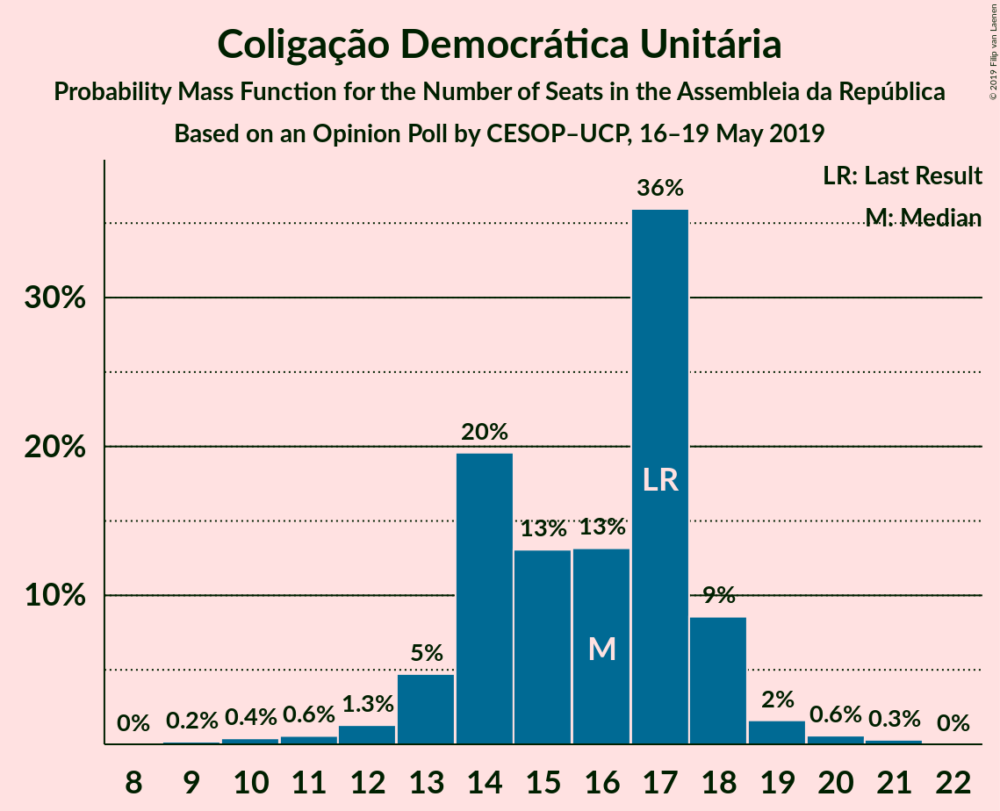

# Opinion Poll by CESOP–UCP, 16–19 May 2019

<a href="#voting-intentions">Voting Intentions</a> | <a href="#seats">Seats</a> | <a href="#coalitions">Coalitions</a> | <a href="#technical-information">Technical Information</a>

## Voting Intentions

### Confidence Intervals

| Party | Last Result | Poll Result | 80% Confidence Interval | 90% Confidence Interval | 95% Confidence Interval | 99% Confidence Interval |
|:-----:|:-----------:|:-----------:|:-----------------------:|:-----------------------:|:-----------------------:|:-----------------------:|
| Partido Socialista | 32.3% | 39.0% | 37.6–40.5% |37.2–40.9% |36.8–41.2% |36.1–41.9% |
| Partido Social Democrata | 36.9% | 28.0% | 26.7–29.4% |26.3–29.8% |26.0–30.1% |25.4–30.7% |
| Bloco de Esquerda | 10.2% | 9.0% | 8.2–9.9% |8.0–10.1% |7.8–10.4% |7.4–10.8% |
| Coligação Democrática Unitária | 8.2% | 8.0% | 7.3–8.9% |7.1–9.1% |6.9–9.3% |6.5–9.8% |
| CDS–Partido Popular | 36.9% | 7.0% | 6.3–7.8% |6.1–8.1% |5.9–8.3% |5.6–8.7% |
| Pessoas–Animais–Natureza | 1.4% | 3.0% | 2.5–3.6% |2.4–3.7% |2.3–3.9% |2.1–4.1% |
| Aliança | 0.0% | 1.0% | 0.8–1.4% |0.7–1.5% |0.6–1.6% |0.5–1.8% |

*Note:* The poll result column reflects the actual value used in the calculations. Published results may vary slightly, and in addition be rounded to fewer digits.

## Seats

### Confidence Intervals

| Party | Last Result | Median | 80% Confidence Interval | 90% Confidence Interval | 95% Confidence Interval | 99% Confidence Interval |
|:-----:|:-----------:|:------:|:-----------------------:|:-----------------------:|:-----------------------:|:-----------------------:|
| <a href="#partido-socialista">Partido Socialista</a> | 86 | 108 | 104–112 |102–113 |101–114 |99–116 |
| <a href="#partido-social-democrata">Partido Social Democrata</a> | 89 | 75 | 73–79 |71–81 |70–82 |68–84 |
| <a href="#bloco-de-esquerda">Bloco de Esquerda</a> | 19 | 17 | 15–18 |14–19 |14–20 |12–22 |
| <a href="#coligação-democrática-unitária">Coligação Democrática Unitária</a> | 17 | 16 | 14–18 |13–18 |13–18 |10–20 |
| <a href="#cds–partido-popular">CDS–Partido Popular</a> | 18 | 10 | 9–13 |8–13 |8–14 |7–16 |
| <a href="#pessoas–animais–natureza">Pessoas–Animais–Natureza</a> | 1 | 3 | 2–4 |2–4 |2–4 |2–6 |
| <a href="#aliança">Aliança</a> | 0 | 0 | 0 |0 |0 |0 |

### Partido Socialista

*For a full overview of the results for this party, see the [Partido Socialista](party-partidosocialista.html) page.*

| Number of Seats | Probability | Accumulated | Special Marks |
|:---------------:|:-----------:|:-----------:|:-------------:|
| 86 | 0% | 100% | Last Result |
| 87 | 0% | 100% |  |
| 88 | 0% | 100% |  |
| 89 | 0% | 100% |  |
| 90 | 0% | 100% |  |
| 91 | 0% | 100% |  |
| 92 | 0% | 100% |  |
| 93 | 0% | 100% |  |
| 94 | 0% | 100% |  |
| 95 | 0% | 100% |  |
| 96 | 0% | 100% |  |
| 97 | 0.1% | 100% |  |
| 98 | 0.2% | 99.9% |  |
| 99 | 0.4% | 99.7% |  |
| 100 | 1.0% | 99.3% |  |
| 101 | 1.3% | 98% |  |
| 102 | 3% | 97% |  |
| 103 | 4% | 94% |  |
| 104 | 6% | 90% |  |
| 105 | 7% | 84% |  |
| 106 | 11% | 77% |  |
| 107 | 11% | 67% |  |
| 108 | 12% | 56% | Median |
| 109 | 17% | 44% |  |
| 110 | 13% | 27% |  |
| 111 | 4% | 15% |  |
| 112 | 3% | 10% |  |
| 113 | 3% | 7% |  |
| 114 | 2% | 4% |  |
| 115 | 2% | 2% |  |
| 116 | 0.4% | 0.6% | Majority |
| 117 | 0.2% | 0.2% |  |
| 118 | 0% | 0.1% |  |
| 119 | 0% | 0% |  |

### Partido Social Democrata

*For a full overview of the results for this party, see the [Partido Social Democrata](party-partidosocialdemocrata.html) page.*

| Number of Seats | Probability | Accumulated | Special Marks |
|:---------------:|:-----------:|:-----------:|:-------------:|
| 66 | 0.1% | 100% |  |
| 67 | 0.3% | 99.9% |  |
| 68 | 0.6% | 99.7% |  |
| 69 | 2% | 99.1% |  |
| 70 | 2% | 98% |  |
| 71 | 1.3% | 96% |  |
| 72 | 3% | 94% |  |
| 73 | 7% | 92% |  |
| 74 | 21% | 85% |  |
| 75 | 22% | 64% | Median |
| 76 | 13% | 42% |  |
| 77 | 10% | 29% |  |
| 78 | 6% | 20% |  |
| 79 | 5% | 14% |  |
| 80 | 3% | 9% |  |
| 81 | 3% | 6% |  |
| 82 | 1.2% | 3% |  |
| 83 | 1.2% | 2% |  |
| 84 | 0.4% | 0.7% |  |
| 85 | 0.2% | 0.3% |  |
| 86 | 0.1% | 0.1% |  |
| 87 | 0% | 0% |  |
| 88 | 0% | 0% |  |
| 89 | 0% | 0% | Last Result |

### Bloco de Esquerda

*For a full overview of the results for this party, see the [Bloco de Esquerda](party-blocodeesquerda.html) page.*

| Number of Seats | Probability | Accumulated | Special Marks |
|:---------------:|:-----------:|:-----------:|:-------------:|
| 10 | 0.1% | 100% |  |
| 11 | 0.2% | 99.9% |  |
| 12 | 0.8% | 99.8% |  |
| 13 | 1.3% | 98.9% |  |
| 14 | 3% | 98% |  |
| 15 | 9% | 95% |  |
| 16 | 10% | 86% |  |
| 17 | 38% | 76% | Median |
| 18 | 31% | 38% |  |
| 19 | 4% | 7% | Last Result |
| 20 | 1.5% | 3% |  |
| 21 | 0.7% | 1.4% |  |
| 22 | 0.3% | 0.7% |  |
| 23 | 0.2% | 0.4% |  |
| 24 | 0.1% | 0.1% |  |
| 25 | 0% | 0% |  |

### Coligação Democrática Unitária

*For a full overview of the results for this party, see the [Coligação Democrática Unitária](party-coligaçãodemocráticaunitária.html) page.*

| Number of Seats | Probability | Accumulated | Special Marks |
|:---------------:|:-----------:|:-----------:|:-------------:|
| 9 | 0.2% | 100% |  |
| 10 | 0.4% | 99.8% |  |
| 11 | 0.6% | 99.4% |  |
| 12 | 1.3% | 98.9% |  |
| 13 | 5% | 98% |  |
| 14 | 20% | 93% |  |
| 15 | 13% | 73% |  |
| 16 | 13% | 60% | Median |
| 17 | 36% | 47% | Last Result |
| 18 | 9% | 11% |  |
| 19 | 2% | 2% |  |
| 20 | 0.6% | 0.9% |  |
| 21 | 0.3% | 0.3% |  |
| 22 | 0% | 0% |  |

### CDS–Partido Popular

*For a full overview of the results for this party, see the [CDS–Partido Popular](party-cds–partidopopular.html) page.*

| Number of Seats | Probability | Accumulated | Special Marks |
|:---------------:|:-----------:|:-----------:|:-------------:|
| 6 | 0.4% | 100% |  |
| 7 | 0.3% | 99.6% |  |
| 8 | 9% | 99.3% |  |
| 9 | 10% | 91% |  |
| 10 | 33% | 81% | Median |
| 11 | 25% | 48% |  |
| 12 | 9% | 23% |  |
| 13 | 11% | 15% |  |
| 14 | 2% | 4% |  |
| 15 | 0.9% | 2% |  |
| 16 | 0.3% | 0.7% |  |
| 17 | 0.1% | 0.4% |  |
| 18 | 0.2% | 0.3% | Last Result |
| 19 | 0.1% | 0.1% |  |
| 20 | 0% | 0% |  |

### Pessoas–Animais–Natureza

*For a full overview of the results for this party, see the [Pessoas–Animais–Natureza](party-pessoas–animais–natureza.html) page.*

| Number of Seats | Probability | Accumulated | Special Marks |
|:---------------:|:-----------:|:-----------:|:-------------:|
| 1 | 0.1% | 100% | Last Result |
| 2 | 15% | 99.9% |  |
| 3 | 48% | 85% | Median |
| 4 | 35% | 37% |  |
| 5 | 0.9% | 2% |  |
| 6 | 1.1% | 1.1% |  |
| 7 | 0% | 0% |  |

### Aliança

*For a full overview of the results for this party, see the [Aliança](party-aliança.html) page.*

| Number of Seats | Probability | Accumulated | Special Marks |
|:---------------:|:-----------:|:-----------:|:-------------:|
| 0 | 100% | 100% | Last Result, Median |

## Coalitions

### Confidence Intervals

| Coalition | Last Result | Median | Majority? | 80% Confidence Interval | 90% Confidence Interval | 95% Confidence Interval | 99% Confidence Interval |
|:---------:|:-----------:|:------:|:---------:|:-----------------------:|:-----------------------:|:-----------------------:|:-----------------------:|
| Partido Socialista – Bloco de Esquerda – Coligação Democrática Unitária | 122 | 141 | 100% | 136–144 | 135–145 | 134–147 | 132–149 |
| Partido Socialista – Bloco de Esquerda | 105 | 125 | 99.7% | 121–128 | 119–130 | 118–131 | 116–133 |
| Partido Socialista – Coligação Democrática Unitária | 103 | 124 | 99.1% | 119–127 | 118–129 | 117–130 | 115–132 |
| Partido Socialista | 86 | 108 | 0.6% | 104–112 | 102–113 | 101–114 | 99–116 |
| Partido Social Democrata – CDS–Partido Popular | 107 | 86 | 0% | 83–90 | 82–92 | 80–93 | 78–95 |

### Partido Socialista – Bloco de Esquerda – Coligação Democrática Unitária

| Number of Seats | Probability | Accumulated | Special Marks |
|:---------------:|:-----------:|:-----------:|:-------------:|
| 122 | 0% | 100% | Last Result |
| 123 | 0% | 100% |  |
| 124 | 0% | 100% |  |
| 125 | 0% | 100% |  |
| 126 | 0% | 100% |  |
| 127 | 0% | 100% |  |
| 128 | 0% | 100% |  |
| 129 | 0% | 100% |  |
| 130 | 0.1% | 99.9% |  |
| 131 | 0.2% | 99.8% |  |
| 132 | 0.4% | 99.7% |  |
| 133 | 0.9% | 99.2% |  |
| 134 | 2% | 98% |  |
| 135 | 2% | 97% |  |
| 136 | 5% | 94% |  |
| 137 | 5% | 89% |  |
| 138 | 7% | 84% |  |
| 139 | 10% | 77% |  |
| 140 | 13% | 67% |  |
| 141 | 14% | 54% | Median |
| 142 | 16% | 40% |  |
| 143 | 9% | 24% |  |
| 144 | 7% | 15% |  |
| 145 | 3% | 8% |  |
| 146 | 2% | 5% |  |
| 147 | 1.0% | 3% |  |
| 148 | 1.1% | 2% |  |
| 149 | 0.5% | 0.7% |  |
| 150 | 0.2% | 0.3% |  |
| 151 | 0% | 0.1% |  |
| 152 | 0% | 0% |  |

### Partido Socialista – Bloco de Esquerda

| Number of Seats | Probability | Accumulated | Special Marks |
|:---------------:|:-----------:|:-----------:|:-------------:|
| 105 | 0% | 100% | Last Result |
| 106 | 0% | 100% |  |
| 107 | 0% | 100% |  |
| 108 | 0% | 100% |  |
| 109 | 0% | 100% |  |
| 110 | 0% | 100% |  |
| 111 | 0% | 100% |  |
| 112 | 0% | 100% |  |
| 113 | 0% | 100% |  |
| 114 | 0.1% | 100% |  |
| 115 | 0.2% | 99.9% |  |
| 116 | 0.4% | 99.7% | Majority |
| 117 | 0.7% | 99.2% |  |
| 118 | 1.3% | 98.5% |  |
| 119 | 3% | 97% |  |
| 120 | 3% | 94% |  |
| 121 | 6% | 91% |  |
| 122 | 7% | 85% |  |
| 123 | 11% | 78% |  |
| 124 | 11% | 67% |  |
| 125 | 14% | 57% | Median |
| 126 | 15% | 43% |  |
| 127 | 12% | 28% |  |
| 128 | 7% | 16% |  |
| 129 | 3% | 8% |  |
| 130 | 2% | 6% |  |
| 131 | 1.5% | 4% |  |
| 132 | 1.2% | 2% |  |
| 133 | 0.5% | 0.8% |  |
| 134 | 0.2% | 0.3% |  |
| 135 | 0.1% | 0.1% |  |
| 136 | 0% | 0% |  |

### Partido Socialista – Coligação Democrática Unitária

| Number of Seats | Probability | Accumulated | Special Marks |
|:---------------:|:-----------:|:-----------:|:-------------:|
| 103 | 0% | 100% | Last Result |
| 104 | 0% | 100% |  |
| 105 | 0% | 100% |  |
| 106 | 0% | 100% |  |
| 107 | 0% | 100% |  |
| 108 | 0% | 100% |  |
| 109 | 0% | 100% |  |
| 110 | 0% | 100% |  |
| 111 | 0% | 100% |  |
| 112 | 0% | 100% |  |
| 113 | 0.1% | 99.9% |  |
| 114 | 0.3% | 99.8% |  |
| 115 | 0.5% | 99.5% |  |
| 116 | 0.9% | 99.1% | Majority |
| 117 | 2% | 98% |  |
| 118 | 3% | 96% |  |
| 119 | 4% | 93% |  |
| 120 | 6% | 89% |  |
| 121 | 7% | 83% |  |
| 122 | 10% | 76% |  |
| 123 | 12% | 66% |  |
| 124 | 17% | 54% | Median |
| 125 | 11% | 37% |  |
| 126 | 10% | 26% |  |
| 127 | 6% | 16% |  |
| 128 | 4% | 10% |  |
| 129 | 3% | 6% |  |
| 130 | 2% | 3% |  |
| 131 | 1.0% | 2% |  |
| 132 | 0.4% | 0.6% |  |
| 133 | 0.2% | 0.2% |  |
| 134 | 0% | 0.1% |  |
| 135 | 0% | 0% |  |

### Partido Socialista

| Number of Seats | Probability | Accumulated | Special Marks |
|:---------------:|:-----------:|:-----------:|:-------------:|
| 86 | 0% | 100% | Last Result |
| 87 | 0% | 100% |  |
| 88 | 0% | 100% |  |
| 89 | 0% | 100% |  |
| 90 | 0% | 100% |  |
| 91 | 0% | 100% |  |
| 92 | 0% | 100% |  |
| 93 | 0% | 100% |  |
| 94 | 0% | 100% |  |
| 95 | 0% | 100% |  |
| 96 | 0% | 100% |  |
| 97 | 0.1% | 100% |  |
| 98 | 0.2% | 99.9% |  |
| 99 | 0.4% | 99.7% |  |
| 100 | 1.0% | 99.3% |  |
| 101 | 1.3% | 98% |  |
| 102 | 3% | 97% |  |
| 103 | 4% | 94% |  |
| 104 | 6% | 90% |  |
| 105 | 7% | 84% |  |
| 106 | 11% | 77% |  |
| 107 | 11% | 67% |  |
| 108 | 12% | 56% | Median |
| 109 | 17% | 44% |  |
| 110 | 13% | 27% |  |
| 111 | 4% | 15% |  |
| 112 | 3% | 10% |  |
| 113 | 3% | 7% |  |
| 114 | 2% | 4% |  |
| 115 | 2% | 2% |  |
| 116 | 0.4% | 0.6% | Majority |
| 117 | 0.2% | 0.2% |  |
| 118 | 0% | 0.1% |  |
| 119 | 0% | 0% |  |

### Partido Social Democrata – CDS–Partido Popular

| Number of Seats | Probability | Accumulated | Special Marks |
|:---------------:|:-----------:|:-----------:|:-------------:|
| 77 | 0.2% | 100% |  |
| 78 | 0.5% | 99.8% |  |
| 79 | 1.0% | 99.2% |  |
| 80 | 2% | 98% |  |
| 81 | 2% | 97% |  |
| 82 | 3% | 95% |  |
| 83 | 7% | 92% |  |
| 84 | 12% | 85% |  |
| 85 | 16% | 73% | Median |
| 86 | 17% | 57% |  |
| 87 | 13% | 41% |  |
| 88 | 8% | 28% |  |
| 89 | 6% | 20% |  |
| 90 | 5% | 14% |  |
| 91 | 4% | 9% |  |
| 92 | 2% | 5% |  |
| 93 | 2% | 3% |  |
| 94 | 0.9% | 1.4% |  |
| 95 | 0.3% | 0.6% |  |
| 96 | 0.1% | 0.3% |  |
| 97 | 0.1% | 0.1% |  |
| 98 | 0% | 0.1% |  |
| 99 | 0% | 0% |  |
| 100 | 0% | 0% |  |
| 101 | 0% | 0% |  |
| 102 | 0% | 0% |  |
| 103 | 0% | 0% |  |
| 104 | 0% | 0% |  |
| 105 | 0% | 0% |  |
| 106 | 0% | 0% |  |
| 107 | 0% | 0% | Last Result |

## Technical Information

### Opinion Poll

+ **Polling firm:** CESOP–UCP
+ **Commissioner(s):** —
+ **Fieldwork period:** 16–19 May 2019

### Calculations

+ **Sample size:** 1882
+ **Simulations done:** 1,048,576
+ **Error estimate:** 0.55%

