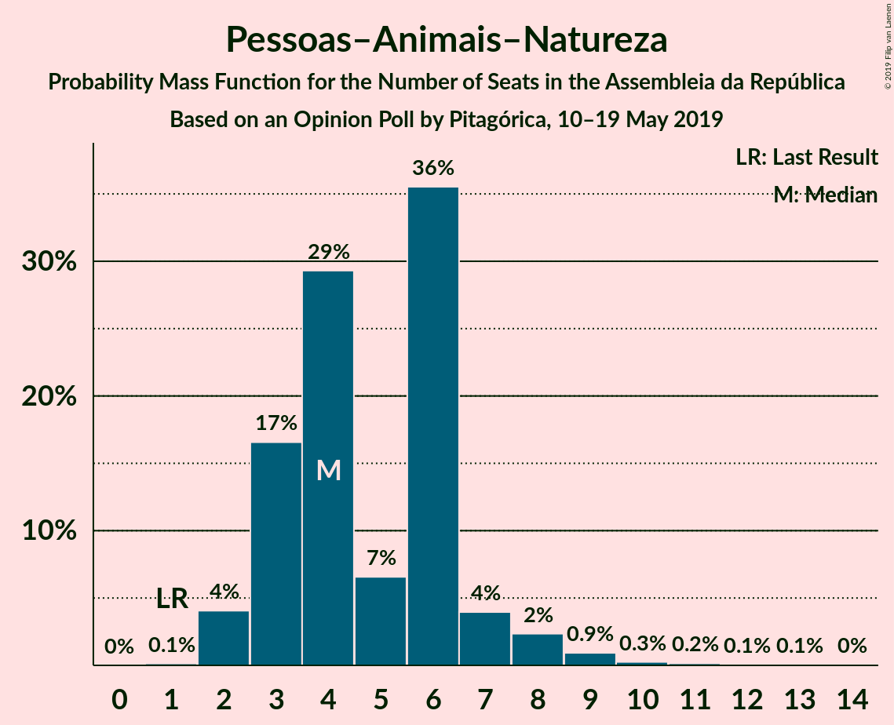
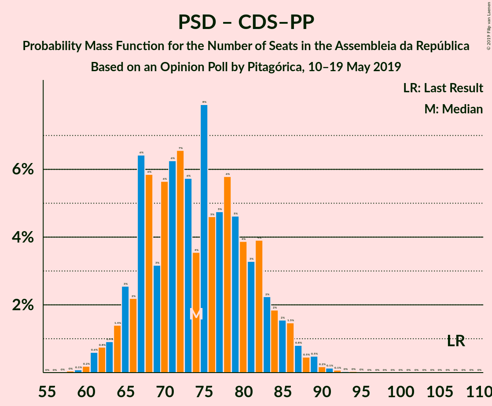

# Opinion Poll by Pitagórica, 10–19 May 2019

<a href="#voting-intentions">Voting Intentions</a> | <a href="#seats">Seats</a> | <a href="#coalitions">Coalitions</a> | <a href="#technical-information">Technical Information</a>

## Voting Intentions

### Confidence Intervals

| Party | Last Result | Poll Result | 80% Confidence Interval | 90% Confidence Interval | 95% Confidence Interval | 99% Confidence Interval |
|:-----:|:-----------:|:-----------:|:-----------------------:|:-----------------------:|:-----------------------:|:-----------------------:|
| Partido Socialista | 32.3% | 40.5% | 38.0–43.1% |37.3–43.8% |36.7–44.5% |35.5–45.7% |
| Partido Social Democrata | 36.9% | 22.5% | 20.4–24.8% |19.8–25.4% |19.3–26.0% |18.4–27.1% |
| Bloco de Esquerda | 10.2% | 8.3% | 7.0–9.9% |6.6–10.3% |6.3–10.7% |5.8–11.6% |
| Coligação Democrática Unitária | 8.2% | 6.4% | 5.3–7.9% |5.0–8.3% |4.8–8.7% |4.3–9.4% |
| CDS–Partido Popular | 36.9% | 6.1% | 5.0–7.6% |4.7–8.0% |4.5–8.3% |4.0–9.1% |
| Pessoas–Animais–Natureza | 1.4% | 3.6% | 2.8–4.8% |2.6–5.2% |2.4–5.5% |2.1–6.1% |
| Aliança | 0.0% | 1.5% | 1.0–2.3% |0.9–2.6% |0.8–2.8% |0.6–3.3% |

*Note:* The poll result column reflects the actual value used in the calculations. Published results may vary slightly, and in addition be rounded to fewer digits.

## Seats

### Confidence Intervals

| Party | Last Result | Median | 80% Confidence Interval | 90% Confidence Interval | 95% Confidence Interval | 99% Confidence Interval |
|:-----:|:-----------:|:------:|:-----------------------:|:-----------------------:|:-----------------------:|:-----------------------:|
| <a href="#partido-socialista">Partido Socialista</a> | 86 | 121 | 113–130 |111–132 |109–134 |105–137 |
| <a href="#partido-social-democrata">Partido Social Democrata</a> | 89 | 63 | 57–71 |55–74 |54–76 |52–79 |
| <a href="#bloco-de-esquerda">Bloco de Esquerda</a> | 19 | 17 | 14–21 |11–23 |10–24 |9–25 |
| <a href="#coligação-democrática-unitária">Coligação Democrática Unitária</a> | 17 | 13 | 8–17 |6–18 |6–19 |5–20 |
| <a href="#cds–partido-popular">CDS–Partido Popular</a> | 18 | 10 | 7–15 |6–17 |6–18 |6–19 |
| <a href="#pessoas–animais–natureza">Pessoas–Animais–Natureza</a> | 1 | 4 | 3–6 |3–7 |2–8 |2–10 |
| <a href="#aliança">Aliança</a> | 0 | 0 | 0–2 |0–2 |0–2 |0–2 |

### Partido Socialista

*For a full overview of the results for this party, see the [Partido Socialista](party-partidosocialista.html) page.*

| Number of Seats | Probability | Accumulated | Special Marks |
|:---------------:|:-----------:|:-----------:|:-------------:|
| 86 | 0% | 100% | Last Result |
| 87 | 0% | 100% |  |
| 88 | 0% | 100% |  |
| 89 | 0% | 100% |  |
| 90 | 0% | 100% |  |
| 91 | 0% | 100% |  |
| 92 | 0% | 100% |  |
| 93 | 0% | 100% |  |
| 94 | 0% | 100% |  |
| 95 | 0% | 100% |  |
| 96 | 0% | 100% |  |
| 97 | 0% | 100% |  |
| 98 | 0% | 100% |  |
| 99 | 0% | 100% |  |
| 100 | 0% | 100% |  |
| 101 | 0% | 100% |  |
| 102 | 0% | 100% |  |
| 103 | 0.1% | 99.9% |  |
| 104 | 0.1% | 99.8% |  |
| 105 | 0.2% | 99.7% |  |
| 106 | 0.3% | 99.5% |  |
| 107 | 0.5% | 99.2% |  |
| 108 | 0.5% | 98.6% |  |
| 109 | 0.8% | 98% |  |
| 110 | 1.0% | 97% |  |
| 111 | 2% | 96% |  |
| 112 | 3% | 95% |  |
| 113 | 3% | 92% |  |
| 114 | 5% | 89% |  |
| 115 | 5% | 84% |  |
| 116 | 5% | 79% | Majority |
| 117 | 5% | 74% |  |
| 118 | 7% | 69% |  |
| 119 | 5% | 62% |  |
| 120 | 5% | 57% |  |
| 121 | 4% | 52% | Median |
| 122 | 5% | 47% |  |
| 123 | 7% | 42% |  |
| 124 | 5% | 35% |  |
| 125 | 4% | 31% |  |
| 126 | 5% | 26% |  |
| 127 | 5% | 22% |  |
| 128 | 3% | 17% |  |
| 129 | 3% | 14% |  |
| 130 | 3% | 11% |  |
| 131 | 2% | 7% |  |
| 132 | 1.5% | 5% |  |
| 133 | 1.2% | 4% |  |
| 134 | 0.9% | 3% |  |
| 135 | 0.6% | 2% |  |
| 136 | 0.4% | 1.1% |  |
| 137 | 0.2% | 0.7% |  |
| 138 | 0.2% | 0.4% |  |
| 139 | 0.1% | 0.3% |  |
| 140 | 0.1% | 0.2% |  |
| 141 | 0% | 0.1% |  |
| 142 | 0% | 0% |  |

### Partido Social Democrata

*For a full overview of the results for this party, see the [Partido Social Democrata](party-partidosocialdemocrata.html) page.*

| Number of Seats | Probability | Accumulated | Special Marks |
|:---------------:|:-----------:|:-----------:|:-------------:|
| 49 | 0% | 100% |  |
| 50 | 0.1% | 99.9% |  |
| 51 | 0.2% | 99.8% |  |
| 52 | 0.6% | 99.6% |  |
| 53 | 1.2% | 99.0% |  |
| 54 | 3% | 98% |  |
| 55 | 2% | 95% |  |
| 56 | 3% | 93% |  |
| 57 | 4% | 90% |  |
| 58 | 5% | 86% |  |
| 59 | 7% | 81% |  |
| 60 | 8% | 74% |  |
| 61 | 6% | 66% |  |
| 62 | 4% | 60% |  |
| 63 | 7% | 55% | Median |
| 64 | 6% | 48% |  |
| 65 | 4% | 42% |  |
| 66 | 4% | 38% |  |
| 67 | 7% | 34% |  |
| 68 | 4% | 27% |  |
| 69 | 4% | 23% |  |
| 70 | 6% | 20% |  |
| 71 | 4% | 14% |  |
| 72 | 2% | 10% |  |
| 73 | 2% | 8% |  |
| 74 | 2% | 6% |  |
| 75 | 1.0% | 4% |  |
| 76 | 1.0% | 3% |  |
| 77 | 0.7% | 2% |  |
| 78 | 0.4% | 0.9% |  |
| 79 | 0.2% | 0.5% |  |
| 80 | 0.2% | 0.3% |  |
| 81 | 0% | 0.1% |  |
| 82 | 0.1% | 0.1% |  |
| 83 | 0% | 0% |  |
| 84 | 0% | 0% |  |
| 85 | 0% | 0% |  |
| 86 | 0% | 0% |  |
| 87 | 0% | 0% |  |
| 88 | 0% | 0% |  |
| 89 | 0% | 0% | Last Result |

### Bloco de Esquerda

*For a full overview of the results for this party, see the [Bloco de Esquerda](party-blocodeesquerda.html) page.*

| Number of Seats | Probability | Accumulated | Special Marks |
|:---------------:|:-----------:|:-----------:|:-------------:|
| 8 | 0% | 100% |  |
| 9 | 0.7% | 99.9% |  |
| 10 | 3% | 99.2% |  |
| 11 | 2% | 96% |  |
| 12 | 2% | 94% |  |
| 13 | 2% | 93% |  |
| 14 | 5% | 91% |  |
| 15 | 8% | 85% |  |
| 16 | 11% | 77% |  |
| 17 | 20% | 66% | Median |
| 18 | 19% | 46% |  |
| 19 | 8% | 27% | Last Result |
| 20 | 8% | 19% |  |
| 21 | 3% | 11% |  |
| 22 | 2% | 8% |  |
| 23 | 3% | 6% |  |
| 24 | 3% | 4% |  |
| 25 | 0.8% | 1.2% |  |
| 26 | 0.1% | 0.4% |  |
| 27 | 0.1% | 0.3% |  |
| 28 | 0.2% | 0.2% |  |
| 29 | 0% | 0% |  |

### Coligação Democrática Unitária

*For a full overview of the results for this party, see the [Coligação Democrática Unitária](party-coligaçãodemocráticaunitária.html) page.*

| Number of Seats | Probability | Accumulated | Special Marks |
|:---------------:|:-----------:|:-----------:|:-------------:|
| 5 | 1.4% | 100% |  |
| 6 | 5% | 98.6% |  |
| 7 | 3% | 94% |  |
| 8 | 7% | 90% |  |
| 9 | 9% | 83% |  |
| 10 | 7% | 74% |  |
| 11 | 4% | 68% |  |
| 12 | 6% | 64% |  |
| 13 | 14% | 58% | Median |
| 14 | 27% | 44% |  |
| 15 | 3% | 17% |  |
| 16 | 3% | 14% |  |
| 17 | 6% | 11% | Last Result |
| 18 | 2% | 5% |  |
| 19 | 2% | 3% |  |
| 20 | 0.8% | 0.9% |  |
| 21 | 0.1% | 0.2% |  |
| 22 | 0% | 0.1% |  |
| 23 | 0% | 0% |  |

### CDS–Partido Popular

*For a full overview of the results for this party, see the [CDS–Partido Popular](party-cds–partidopopular.html) page.*

| Number of Seats | Probability | Accumulated | Special Marks |
|:---------------:|:-----------:|:-----------:|:-------------:|
| 4 | 0.3% | 100% |  |
| 5 | 0.2% | 99.7% |  |
| 6 | 6% | 99.5% |  |
| 7 | 11% | 94% |  |
| 8 | 20% | 83% |  |
| 9 | 7% | 63% |  |
| 10 | 11% | 56% | Median |
| 11 | 14% | 46% |  |
| 12 | 10% | 32% |  |
| 13 | 7% | 22% |  |
| 14 | 4% | 15% |  |
| 15 | 4% | 11% |  |
| 16 | 1.4% | 7% |  |
| 17 | 2% | 5% |  |
| 18 | 2% | 3% | Last Result |
| 19 | 2% | 2% |  |
| 20 | 0.1% | 0.3% |  |
| 21 | 0% | 0.1% |  |
| 22 | 0% | 0.1% |  |
| 23 | 0% | 0.1% |  |
| 24 | 0% | 0% |  |

### Pessoas–Animais–Natureza

*For a full overview of the results for this party, see the [Pessoas–Animais–Natureza](party-pessoas–animais–natureza.html) page.*

| Number of Seats | Probability | Accumulated | Special Marks |
|:---------------:|:-----------:|:-----------:|:-------------:|
| 1 | 0.1% | 100% | Last Result |
| 2 | 4% | 99.9% |  |
| 3 | 17% | 96% |  |
| 4 | 29% | 79% | Median |
| 5 | 7% | 50% |  |
| 6 | 36% | 43% |  |
| 7 | 4% | 8% |  |
| 8 | 2% | 4% |  |
| 9 | 0.9% | 2% |  |
| 10 | 0.3% | 0.6% |  |
| 11 | 0.2% | 0.3% |  |
| 12 | 0.1% | 0.2% |  |
| 13 | 0.1% | 0.1% |  |
| 14 | 0% | 0% |  |

### Aliança

*For a full overview of the results for this party, see the [Aliança](party-aliança.html) page.*

| Number of Seats | Probability | Accumulated | Special Marks |
|:---------------:|:-----------:|:-----------:|:-------------:|
| 0 | 78% | 100% | Last Result, Median |
| 1 | 3% | 22% |  |
| 2 | 18% | 19% |  |
| 3 | 0.2% | 0.4% |  |
| 4 | 0.2% | 0.2% |  |
| 5 | 0% | 0% |  |

## Coalitions

### Confidence Intervals

| Coalition | Last Result | Median | Majority? | 80% Confidence Interval | 90% Confidence Interval | 95% Confidence Interval | 99% Confidence Interval |
|:---------:|:-----------:|:------:|:---------:|:-----------------------:|:-----------------------:|:-----------------------:|:-----------------------:|
| Partido Socialista – Bloco de Esquerda – Coligação Democrática Unitária | 122 | 151 | 100% | 142–158 | 140–160 | 138–162 | 135–164 |
| Partido Socialista – Bloco de Esquerda | 105 | 138 | 100% | 130–147 | 128–149 | 126–151 | 122–154 |
| Partido Socialista – Coligação Democrática Unitária | 103 | 134 | 99.8% | 125–141 | 123–143 | 121–145 | 118–148 |
| Partido Socialista | 86 | 121 | 79% | 113–130 | 111–132 | 109–134 | 105–137 |
| Partido Social Democrata – CDS–Partido Popular | 107 | 74 | 0% | 67–82 | 65–85 | 63–86 | 61–89 |

### Partido Socialista – Bloco de Esquerda – Coligação Democrática Unitária

| Number of Seats | Probability | Accumulated | Special Marks |
|:---------------:|:-----------:|:-----------:|:-------------:|
| 122 | 0% | 100% | Last Result |
| 123 | 0% | 100% |  |
| 124 | 0% | 100% |  |
| 125 | 0% | 100% |  |
| 126 | 0% | 100% |  |
| 127 | 0% | 100% |  |
| 128 | 0% | 100% |  |
| 129 | 0% | 100% |  |
| 130 | 0% | 100% |  |
| 131 | 0% | 99.9% |  |
| 132 | 0.1% | 99.9% |  |
| 133 | 0.1% | 99.9% |  |
| 134 | 0.2% | 99.7% |  |
| 135 | 0.2% | 99.6% |  |
| 136 | 0.3% | 99.3% |  |
| 137 | 0.7% | 99.0% |  |
| 138 | 1.0% | 98% |  |
| 139 | 2% | 97% |  |
| 140 | 1.3% | 96% |  |
| 141 | 3% | 94% |  |
| 142 | 2% | 92% |  |
| 143 | 3% | 90% |  |
| 144 | 5% | 87% |  |
| 145 | 5% | 82% |  |
| 146 | 5% | 77% |  |
| 147 | 4% | 72% |  |
| 148 | 5% | 68% |  |
| 149 | 8% | 63% |  |
| 150 | 4% | 56% |  |
| 151 | 4% | 51% | Median |
| 152 | 5% | 47% |  |
| 153 | 6% | 42% |  |
| 154 | 5% | 35% |  |
| 155 | 6% | 31% |  |
| 156 | 5% | 24% |  |
| 157 | 5% | 19% |  |
| 158 | 4% | 14% |  |
| 159 | 4% | 10% |  |
| 160 | 2% | 6% |  |
| 161 | 2% | 4% |  |
| 162 | 0.9% | 3% |  |
| 163 | 0.8% | 2% |  |
| 164 | 0.4% | 0.8% |  |
| 165 | 0.2% | 0.4% |  |
| 166 | 0.1% | 0.2% |  |
| 167 | 0% | 0.1% |  |
| 168 | 0% | 0% |  |

### Partido Socialista – Bloco de Esquerda

| Number of Seats | Probability | Accumulated | Special Marks |
|:---------------:|:-----------:|:-----------:|:-------------:|
| 105 | 0% | 100% | Last Result |
| 106 | 0% | 100% |  |
| 107 | 0% | 100% |  |
| 108 | 0% | 100% |  |
| 109 | 0% | 100% |  |
| 110 | 0% | 100% |  |
| 111 | 0% | 100% |  |
| 112 | 0% | 100% |  |
| 113 | 0% | 100% |  |
| 114 | 0% | 100% |  |
| 115 | 0% | 100% |  |
| 116 | 0% | 100% | Majority |
| 117 | 0% | 100% |  |
| 118 | 0% | 100% |  |
| 119 | 0% | 99.9% |  |
| 120 | 0.1% | 99.9% |  |
| 121 | 0.2% | 99.8% |  |
| 122 | 0.2% | 99.6% |  |
| 123 | 0.3% | 99.5% |  |
| 124 | 0.4% | 99.2% |  |
| 125 | 0.6% | 98.8% |  |
| 126 | 0.7% | 98% |  |
| 127 | 2% | 97% |  |
| 128 | 2% | 96% |  |
| 129 | 2% | 94% |  |
| 130 | 5% | 92% |  |
| 131 | 4% | 87% |  |
| 132 | 3% | 83% |  |
| 133 | 3% | 80% |  |
| 134 | 7% | 78% |  |
| 135 | 6% | 70% |  |
| 136 | 5% | 64% |  |
| 137 | 5% | 59% |  |
| 138 | 5% | 54% | Median |
| 139 | 4% | 49% |  |
| 140 | 6% | 45% |  |
| 141 | 7% | 39% |  |
| 142 | 6% | 32% |  |
| 143 | 4% | 26% |  |
| 144 | 4% | 22% |  |
| 145 | 5% | 19% |  |
| 146 | 3% | 14% |  |
| 147 | 3% | 11% |  |
| 148 | 3% | 9% |  |
| 149 | 2% | 6% |  |
| 150 | 0.9% | 4% |  |
| 151 | 0.8% | 3% |  |
| 152 | 1.1% | 2% |  |
| 153 | 0.5% | 1.2% |  |
| 154 | 0.3% | 0.7% |  |
| 155 | 0.2% | 0.4% |  |
| 156 | 0.1% | 0.2% |  |
| 157 | 0.1% | 0.2% |  |
| 158 | 0% | 0% |  |

### Partido Socialista – Coligação Democrática Unitária

| Number of Seats | Probability | Accumulated | Special Marks |
|:---------------:|:-----------:|:-----------:|:-------------:|
| 103 | 0% | 100% | Last Result |
| 104 | 0% | 100% |  |
| 105 | 0% | 100% |  |
| 106 | 0% | 100% |  |
| 107 | 0% | 100% |  |
| 108 | 0% | 100% |  |
| 109 | 0% | 100% |  |
| 110 | 0% | 100% |  |
| 111 | 0% | 100% |  |
| 112 | 0% | 100% |  |
| 113 | 0% | 100% |  |
| 114 | 0% | 99.9% |  |
| 115 | 0.1% | 99.9% |  |
| 116 | 0.1% | 99.8% | Majority |
| 117 | 0.1% | 99.7% |  |
| 118 | 0.3% | 99.6% |  |
| 119 | 0.4% | 99.3% |  |
| 120 | 0.9% | 98.8% |  |
| 121 | 0.9% | 98% |  |
| 122 | 1.4% | 97% |  |
| 123 | 2% | 96% |  |
| 124 | 2% | 94% |  |
| 125 | 2% | 92% |  |
| 126 | 4% | 89% |  |
| 127 | 4% | 86% |  |
| 128 | 5% | 81% |  |
| 129 | 5% | 76% |  |
| 130 | 6% | 71% |  |
| 131 | 6% | 66% |  |
| 132 | 5% | 60% |  |
| 133 | 4% | 55% |  |
| 134 | 6% | 51% | Median |
| 135 | 3% | 45% |  |
| 136 | 6% | 42% |  |
| 137 | 6% | 36% |  |
| 138 | 7% | 29% |  |
| 139 | 6% | 22% |  |
| 140 | 4% | 16% |  |
| 141 | 4% | 12% |  |
| 142 | 3% | 8% |  |
| 143 | 2% | 5% |  |
| 144 | 1.0% | 4% |  |
| 145 | 0.8% | 3% |  |
| 146 | 0.7% | 2% |  |
| 147 | 0.5% | 1.1% |  |
| 148 | 0.3% | 0.6% |  |
| 149 | 0.2% | 0.3% |  |
| 150 | 0% | 0.2% |  |
| 151 | 0.1% | 0.1% |  |
| 152 | 0% | 0.1% |  |
| 153 | 0% | 0% |  |

### Partido Socialista

| Number of Seats | Probability | Accumulated | Special Marks |
|:---------------:|:-----------:|:-----------:|:-------------:|
| 86 | 0% | 100% | Last Result |
| 87 | 0% | 100% |  |
| 88 | 0% | 100% |  |
| 89 | 0% | 100% |  |
| 90 | 0% | 100% |  |
| 91 | 0% | 100% |  |
| 92 | 0% | 100% |  |
| 93 | 0% | 100% |  |
| 94 | 0% | 100% |  |
| 95 | 0% | 100% |  |
| 96 | 0% | 100% |  |
| 97 | 0% | 100% |  |
| 98 | 0% | 100% |  |
| 99 | 0% | 100% |  |
| 100 | 0% | 100% |  |
| 101 | 0% | 100% |  |
| 102 | 0% | 100% |  |
| 103 | 0.1% | 99.9% |  |
| 104 | 0.1% | 99.8% |  |
| 105 | 0.2% | 99.7% |  |
| 106 | 0.3% | 99.5% |  |
| 107 | 0.5% | 99.2% |  |
| 108 | 0.5% | 98.6% |  |
| 109 | 0.8% | 98% |  |
| 110 | 1.0% | 97% |  |
| 111 | 2% | 96% |  |
| 112 | 3% | 95% |  |
| 113 | 3% | 92% |  |
| 114 | 5% | 89% |  |
| 115 | 5% | 84% |  |
| 116 | 5% | 79% | Majority |
| 117 | 5% | 74% |  |
| 118 | 7% | 69% |  |
| 119 | 5% | 62% |  |
| 120 | 5% | 57% |  |
| 121 | 4% | 52% | Median |
| 122 | 5% | 47% |  |
| 123 | 7% | 42% |  |
| 124 | 5% | 35% |  |
| 125 | 4% | 31% |  |
| 126 | 5% | 26% |  |
| 127 | 5% | 22% |  |
| 128 | 3% | 17% |  |
| 129 | 3% | 14% |  |
| 130 | 3% | 11% |  |
| 131 | 2% | 7% |  |
| 132 | 1.5% | 5% |  |
| 133 | 1.2% | 4% |  |
| 134 | 0.9% | 3% |  |
| 135 | 0.6% | 2% |  |
| 136 | 0.4% | 1.1% |  |
| 137 | 0.2% | 0.7% |  |
| 138 | 0.2% | 0.4% |  |
| 139 | 0.1% | 0.3% |  |
| 140 | 0.1% | 0.2% |  |
| 141 | 0% | 0.1% |  |
| 142 | 0% | 0% |  |

### Partido Social Democrata – CDS–Partido Popular

| Number of Seats | Probability | Accumulated | Special Marks |
|:---------------:|:-----------:|:-----------:|:-------------:|
| 58 | 0% | 100% |  |
| 59 | 0.1% | 99.9% |  |
| 60 | 0.2% | 99.8% |  |
| 61 | 0.6% | 99.7% |  |
| 62 | 0.8% | 99.1% |  |
| 63 | 0.9% | 98% |  |
| 64 | 1.4% | 97% |  |
| 65 | 3% | 96% |  |
| 66 | 2% | 93% |  |
| 67 | 6% | 91% |  |
| 68 | 6% | 85% |  |
| 69 | 3% | 79% |  |
| 70 | 6% | 76% |  |
| 71 | 6% | 70% |  |
| 72 | 7% | 64% |  |
| 73 | 6% | 57% | Median |
| 74 | 4% | 52% |  |
| 75 | 8% | 48% |  |
| 76 | 5% | 40% |  |
| 77 | 5% | 36% |  |
| 78 | 6% | 31% |  |
| 79 | 5% | 25% |  |
| 80 | 4% | 20% |  |
| 81 | 3% | 17% |  |
| 82 | 4% | 13% |  |
| 83 | 2% | 9% |  |
| 84 | 2% | 7% |  |
| 85 | 2% | 5% |  |
| 86 | 1.5% | 4% |  |
| 87 | 0.8% | 2% |  |
| 88 | 0.5% | 1.4% |  |
| 89 | 0.5% | 1.0% |  |
| 90 | 0.2% | 0.5% |  |
| 91 | 0.1% | 0.3% |  |
| 92 | 0.1% | 0.2% |  |
| 93 | 0% | 0.1% |  |
| 94 | 0% | 0.1% |  |
| 95 | 0% | 0% |  |
| 96 | 0% | 0% |  |
| 97 | 0% | 0% |  |
| 98 | 0% | 0% |  |
| 99 | 0% | 0% |  |
| 100 | 0% | 0% |  |
| 101 | 0% | 0% |  |
| 102 | 0% | 0% |  |
| 103 | 0% | 0% |  |
| 104 | 0% | 0% |  |
| 105 | 0% | 0% |  |
| 106 | 0% | 0% |  |
| 107 | 0% | 0% | Last Result |

## Technical Information

### Opinion Poll

+ **Polling firm:** Pitagórica
+ **Commissioner(s):** —
+ **Fieldwork period:** 10–19 May 2019

### Calculations

+ **Sample size:** 605
+ **Simulations done:** 1,048,576
+ **Error estimate:** 0.87%

