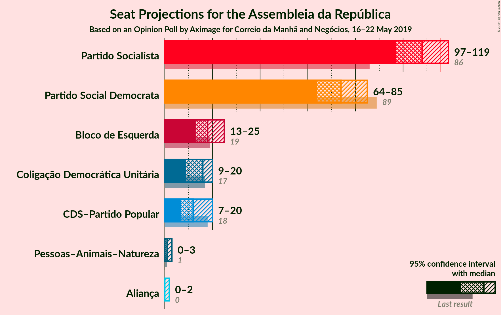
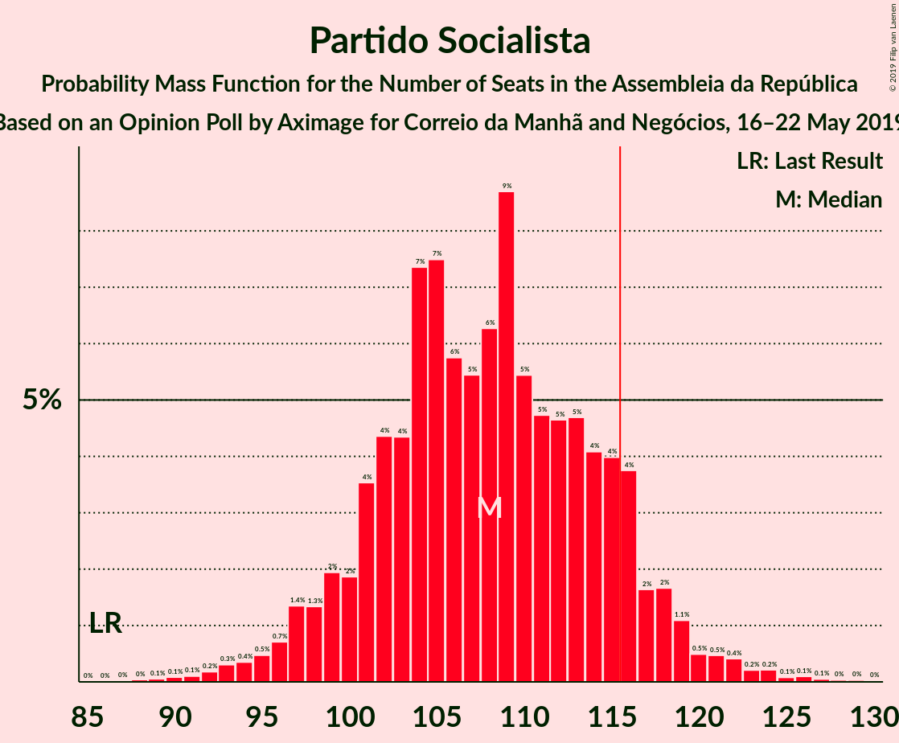
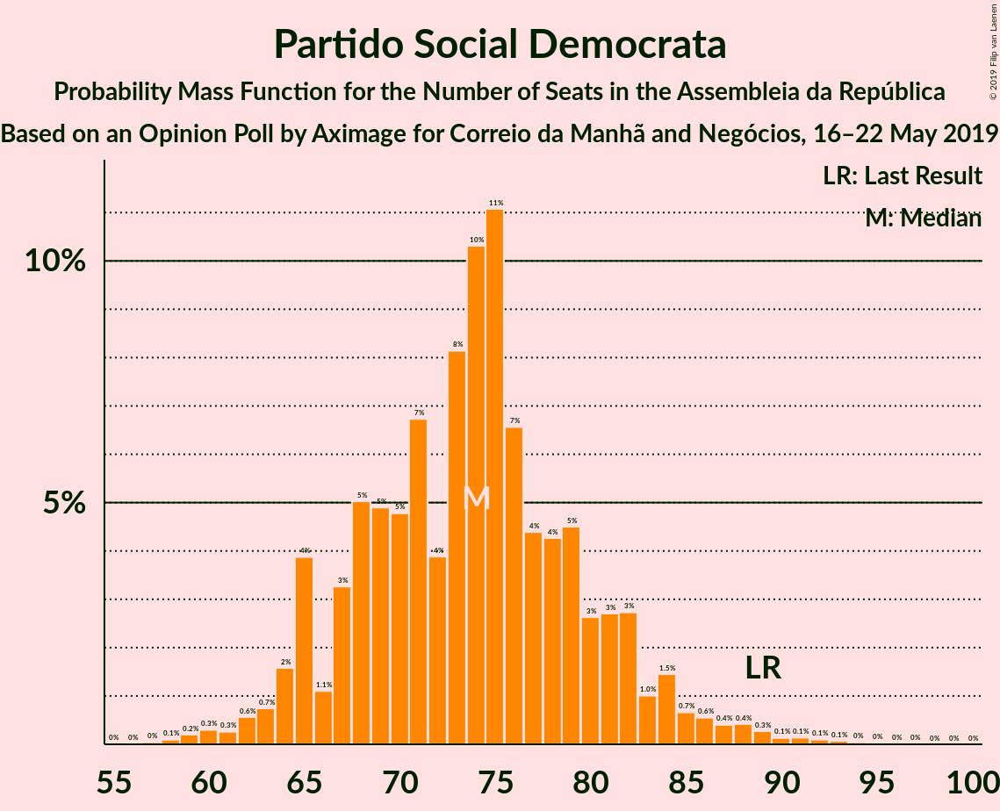
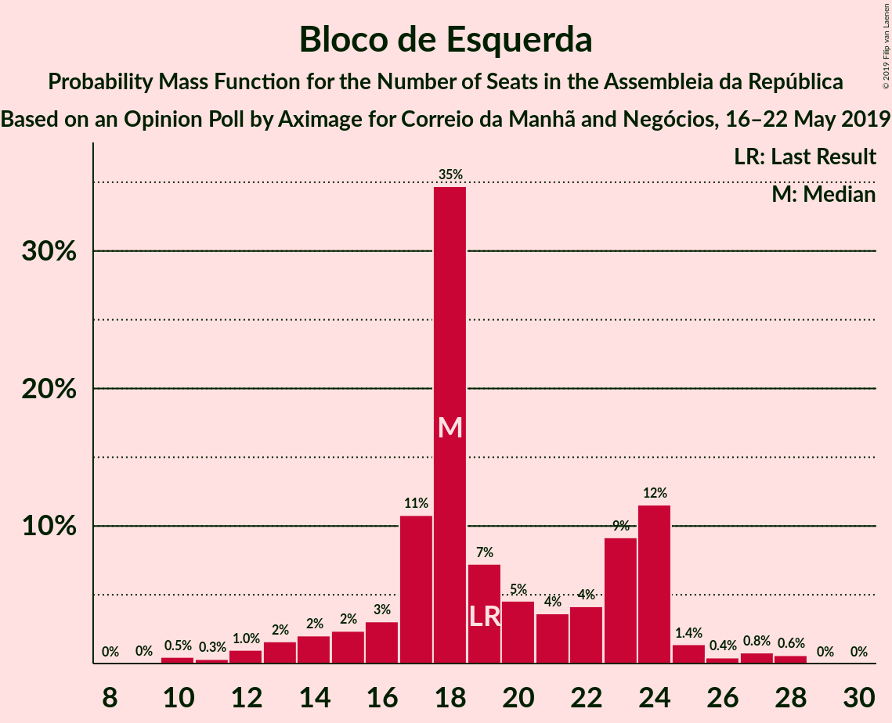

# Opinion Poll by Aximage for Correio da Manhã and Negócios, 16–22 May 2019

<a href="#voting-intentions">Voting Intentions</a> | <a href="#seats">Seats</a> | <a href="#coalitions">Coalitions</a> | <a href="#technical-information">Technical Information</a>

## Voting Intentions

### Confidence Intervals

| Party | Last Result | Poll Result | 80% Confidence Interval | 90% Confidence Interval | 95% Confidence Interval | 99% Confidence Interval |
|:-----:|:-----------:|:-----------:|:-----------------------:|:-----------------------:|:-----------------------:|:-----------------------:|
| Partido Socialista | 32.3% | 36.5% | 34.1–39.0% |33.4–39.7% |32.8–40.4% |31.7–41.6% |
| Partido Social Democrata | 36.9% | 25.7% | 23.6–28.1% |23.0–28.7% |22.4–29.3% |21.4–30.5% |
| Bloco de Esquerda | 10.2% | 9.2% | 7.8–10.8% |7.5–11.3% |7.1–11.7% |6.5–12.5% |
| Coligação Democrática Unitária | 8.2% | 7.2% | 6.1–8.7% |5.7–9.2% |5.4–9.6% |4.9–10.3% |
| CDS–Partido Popular | 36.9% | 6.9% | 5.8–8.4% |5.4–8.8% |5.2–9.2% |4.7–10.0% |
| Pessoas–Animais–Natureza | 1.4% | 1.4% | 1.0–2.3% |0.9–2.5% |0.8–2.7% |0.6–3.2% |
| Aliança | 0.0% | 1.3% | 0.9–2.1% |0.7–2.3% |0.7–2.5% |0.5–3.0% |

*Note:* The poll result column reflects the actual value used in the calculations. Published results may vary slightly, and in addition be rounded to fewer digits.

## Seats

### Confidence Intervals

| Party | Last Result | Median | 80% Confidence Interval | 90% Confidence Interval | 95% Confidence Interval | 99% Confidence Interval |
|:-----:|:-----------:|:------:|:-----------------------:|:-----------------------:|:-----------------------:|:-----------------------:|
| <a href="#partido-socialista">Partido Socialista</a> | 86 | 109 | 101–117 |99–119 |96–122 |92–125 |
| <a href="#partido-social-democrata">Partido Social Democrata</a> | 89 | 74 | 65–82 |64–84 |62–86 |59–90 |
| <a href="#bloco-de-esquerda">Bloco de Esquerda</a> | 19 | 18 | 15–24 |13–24 |12–25 |10–28 |
| <a href="#coligação-democrática-unitária">Coligação Democrática Unitária</a> | 17 | 14 | 9–20 |9–21 |8–21 |6–22 |
| <a href="#cds–partido-popular">CDS–Partido Popular</a> | 18 | 12 | 9–18 |8–20 |7–20 |6–22 |
| <a href="#pessoas–animais–natureza">Pessoas–Animais–Natureza</a> | 1 | 1 | 0–2 |0–3 |0–3 |0–4 |
| <a href="#aliança">Aliança</a> | 0 | 0 | 0–2 |0–2 |0–2 |0–2 |

### Partido Socialista

*For a full overview of the results for this party, see the [Partido Socialista](party-partidosocialista.html) page.*

| Number of Seats | Probability | Accumulated | Special Marks |
|:---------------:|:-----------:|:-----------:|:-------------:|
| 86 | 0% | 100% | Last Result |
| 87 | 0% | 100% |  |
| 88 | 0.1% | 100% |  |
| 89 | 0.1% | 99.9% |  |
| 90 | 0.1% | 99.8% |  |
| 91 | 0.1% | 99.7% |  |
| 92 | 0.2% | 99.7% |  |
| 93 | 0.1% | 99.5% |  |
| 94 | 0.5% | 99.4% |  |
| 95 | 0.5% | 98.9% |  |
| 96 | 0.9% | 98% |  |
| 97 | 1.4% | 97% |  |
| 98 | 1.0% | 96% |  |
| 99 | 2% | 95% |  |
| 100 | 2% | 93% |  |
| 101 | 4% | 91% |  |
| 102 | 3% | 87% |  |
| 103 | 4% | 84% |  |
| 104 | 7% | 80% |  |
| 105 | 6% | 73% |  |
| 106 | 4% | 67% |  |
| 107 | 3% | 63% |  |
| 108 | 5% | 60% |  |
| 109 | 7% | 56% | Median |
| 110 | 7% | 48% |  |
| 111 | 7% | 42% |  |
| 112 | 5% | 35% |  |
| 113 | 6% | 30% |  |
| 114 | 4% | 24% |  |
| 115 | 6% | 21% |  |
| 116 | 4% | 15% | Majority |
| 117 | 1.3% | 11% |  |
| 118 | 4% | 10% |  |
| 119 | 2% | 6% |  |
| 120 | 0.5% | 4% |  |
| 121 | 0.5% | 3% |  |
| 122 | 1.3% | 3% |  |
| 123 | 0.5% | 2% |  |
| 124 | 0.7% | 1.2% |  |
| 125 | 0.1% | 0.5% |  |
| 126 | 0.1% | 0.4% |  |
| 127 | 0.2% | 0.3% |  |
| 128 | 0% | 0.1% |  |
| 129 | 0% | 0.1% |  |
| 130 | 0% | 0% |  |

### Partido Social Democrata

*For a full overview of the results for this party, see the [Partido Social Democrata](party-partidosocialdemocrata.html) page.*

| Number of Seats | Probability | Accumulated | Special Marks |
|:---------------:|:-----------:|:-----------:|:-------------:|
| 56 | 0% | 100% |  |
| 57 | 0.1% | 99.9% |  |
| 58 | 0.2% | 99.9% |  |
| 59 | 0.2% | 99.7% |  |
| 60 | 0.5% | 99.5% |  |
| 61 | 0.3% | 98.9% |  |
| 62 | 2% | 98.6% |  |
| 63 | 1.4% | 97% |  |
| 64 | 2% | 96% |  |
| 65 | 5% | 94% |  |
| 66 | 3% | 89% |  |
| 67 | 4% | 86% |  |
| 68 | 5% | 82% |  |
| 69 | 2% | 77% |  |
| 70 | 5% | 75% |  |
| 71 | 6% | 69% |  |
| 72 | 6% | 64% |  |
| 73 | 6% | 57% |  |
| 74 | 9% | 52% | Median |
| 75 | 6% | 43% |  |
| 76 | 4% | 37% |  |
| 77 | 4% | 32% |  |
| 78 | 8% | 28% |  |
| 79 | 2% | 21% |  |
| 80 | 2% | 19% |  |
| 81 | 4% | 17% |  |
| 82 | 6% | 13% |  |
| 83 | 0.9% | 7% |  |
| 84 | 1.4% | 6% |  |
| 85 | 1.4% | 5% |  |
| 86 | 1.5% | 3% |  |
| 87 | 0.5% | 2% |  |
| 88 | 0.3% | 1.3% |  |
| 89 | 0.4% | 1.0% | Last Result |
| 90 | 0.1% | 0.6% |  |
| 91 | 0.3% | 0.5% |  |
| 92 | 0.1% | 0.2% |  |
| 93 | 0% | 0.1% |  |
| 94 | 0% | 0.1% |  |
| 95 | 0% | 0.1% |  |
| 96 | 0% | 0% |  |

### Bloco de Esquerda

*For a full overview of the results for this party, see the [Bloco de Esquerda](party-blocodeesquerda.html) page.*

| Number of Seats | Probability | Accumulated | Special Marks |
|:---------------:|:-----------:|:-----------:|:-------------:|
| 9 | 0.1% | 100% |  |
| 10 | 0.8% | 99.9% |  |
| 11 | 0.3% | 99.1% |  |
| 12 | 2% | 98.8% |  |
| 13 | 3% | 97% |  |
| 14 | 2% | 94% |  |
| 15 | 4% | 92% |  |
| 16 | 3% | 89% |  |
| 17 | 12% | 85% |  |
| 18 | 33% | 73% | Median |
| 19 | 7% | 40% | Last Result |
| 20 | 5% | 32% |  |
| 21 | 5% | 28% |  |
| 22 | 3% | 23% |  |
| 23 | 4% | 20% |  |
| 24 | 13% | 16% |  |
| 25 | 1.4% | 3% |  |
| 26 | 0.4% | 2% |  |
| 27 | 0.7% | 1.2% |  |
| 28 | 0.5% | 0.6% |  |
| 29 | 0% | 0.1% |  |
| 30 | 0% | 0.1% |  |
| 31 | 0% | 0% |  |

### Coligação Democrática Unitária

*For a full overview of the results for this party, see the [Coligação Democrática Unitária](party-coligaçãodemocráticaunitária.html) page.*

| Number of Seats | Probability | Accumulated | Special Marks |
|:---------------:|:-----------:|:-----------:|:-------------:|
| 5 | 0.1% | 100% |  |
| 6 | 0.7% | 99.9% |  |
| 7 | 0.9% | 99.3% |  |
| 8 | 3% | 98% |  |
| 9 | 11% | 96% |  |
| 10 | 8% | 85% |  |
| 11 | 5% | 77% |  |
| 12 | 3% | 71% |  |
| 13 | 4% | 69% |  |
| 14 | 24% | 64% | Median |
| 15 | 8% | 40% |  |
| 16 | 7% | 32% |  |
| 17 | 9% | 25% | Last Result |
| 18 | 3% | 16% |  |
| 19 | 2% | 14% |  |
| 20 | 6% | 11% |  |
| 21 | 5% | 5% |  |
| 22 | 0.3% | 0.6% |  |
| 23 | 0.2% | 0.3% |  |
| 24 | 0.1% | 0.1% |  |
| 25 | 0% | 0% |  |

### CDS–Partido Popular

*For a full overview of the results for this party, see the [CDS–Partido Popular](party-cds–partidopopular.html) page.*

| Number of Seats | Probability | Accumulated | Special Marks |
|:---------------:|:-----------:|:-----------:|:-------------:|
| 6 | 1.4% | 100% |  |
| 7 | 2% | 98.6% |  |
| 8 | 6% | 97% |  |
| 9 | 5% | 91% |  |
| 10 | 19% | 86% |  |
| 11 | 9% | 67% |  |
| 12 | 11% | 58% | Median |
| 13 | 10% | 47% |  |
| 14 | 9% | 37% |  |
| 15 | 5% | 29% |  |
| 16 | 3% | 24% |  |
| 17 | 5% | 20% |  |
| 18 | 7% | 15% | Last Result |
| 19 | 2% | 8% |  |
| 20 | 4% | 6% |  |
| 21 | 0.9% | 2% |  |
| 22 | 0.7% | 1.2% |  |
| 23 | 0.2% | 0.5% |  |
| 24 | 0.2% | 0.3% |  |
| 25 | 0.1% | 0.1% |  |
| 26 | 0% | 0% |  |

### Pessoas–Animais–Natureza

*For a full overview of the results for this party, see the [Pessoas–Animais–Natureza](party-pessoas–animais–natureza.html) page.*

| Number of Seats | Probability | Accumulated | Special Marks |
|:---------------:|:-----------:|:-----------:|:-------------:|
| 0 | 23% | 100% |  |
| 1 | 41% | 77% | Last Result, Median |
| 2 | 27% | 35% |  |
| 3 | 7% | 8% |  |
| 4 | 1.5% | 2% |  |
| 5 | 0% | 0.1% |  |
| 6 | 0.1% | 0.1% |  |
| 7 | 0% | 0% |  |

### Aliança

*For a full overview of the results for this party, see the [Aliança](party-aliança.html) page.*

| Number of Seats | Probability | Accumulated | Special Marks |
|:---------------:|:-----------:|:-----------:|:-------------:|
| 0 | 85% | 100% | Last Result, Median |
| 1 | 2% | 15% |  |
| 2 | 13% | 13% |  |
| 3 | 0.1% | 0.1% |  |
| 4 | 0% | 0% |  |

## Coalitions

### Confidence Intervals

| Coalition | Last Result | Median | Majority? | 80% Confidence Interval | 90% Confidence Interval | 95% Confidence Interval | 99% Confidence Interval |
|:---------:|:-----------:|:------:|:---------:|:-----------------------:|:-----------------------:|:-----------------------:|:-----------------------:|
| Partido Socialista – Bloco de Esquerda – Coligação Democrática Unitária | 122 | 142 | 100% | 134–150 | 130–153 | 128–154 | 125–158 |
| Partido Socialista – Bloco de Esquerda | 105 | 128 | 97% | 120–135 | 117–138 | 115–140 | 112–144 |
| Partido Socialista – Coligação Democrática Unitária | 103 | 124 | 83% | 113–131 | 111–134 | 109–136 | 105–138 |
| Partido Socialista | 86 | 109 | 15% | 101–117 | 99–119 | 96–122 | 92–125 |
| Partido Social Democrata – CDS–Partido Popular | 107 | 86 | 0% | 79–96 | 76–99 | 74–101 | 71–104 |

### Partido Socialista – Bloco de Esquerda – Coligação Democrática Unitária

| Number of Seats | Probability | Accumulated | Special Marks |
|:---------------:|:-----------:|:-----------:|:-------------:|
| 118 | 0% | 100% |  |
| 119 | 0% | 99.9% |  |
| 120 | 0.1% | 99.9% |  |
| 121 | 0% | 99.8% |  |
| 122 | 0% | 99.8% | Last Result |
| 123 | 0.1% | 99.7% |  |
| 124 | 0.1% | 99.6% |  |
| 125 | 0.3% | 99.5% |  |
| 126 | 0.5% | 99.3% |  |
| 127 | 1.0% | 98.7% |  |
| 128 | 0.4% | 98% |  |
| 129 | 0.9% | 97% |  |
| 130 | 2% | 96% |  |
| 131 | 1.5% | 94% |  |
| 132 | 1.4% | 93% |  |
| 133 | 1.4% | 91% |  |
| 134 | 5% | 90% |  |
| 135 | 3% | 85% |  |
| 136 | 4% | 82% |  |
| 137 | 5% | 78% |  |
| 138 | 3% | 74% |  |
| 139 | 4% | 71% |  |
| 140 | 6% | 67% |  |
| 141 | 7% | 61% | Median |
| 142 | 8% | 55% |  |
| 143 | 4% | 46% |  |
| 144 | 6% | 42% |  |
| 145 | 6% | 37% |  |
| 146 | 2% | 30% |  |
| 147 | 5% | 28% |  |
| 148 | 7% | 23% |  |
| 149 | 5% | 15% |  |
| 150 | 3% | 11% |  |
| 151 | 0.8% | 8% |  |
| 152 | 2% | 7% |  |
| 153 | 1.4% | 5% |  |
| 154 | 1.4% | 4% |  |
| 155 | 1.1% | 2% |  |
| 156 | 0.3% | 1.4% |  |
| 157 | 0.4% | 1.1% |  |
| 158 | 0.4% | 0.7% |  |
| 159 | 0.1% | 0.3% |  |
| 160 | 0.1% | 0.2% |  |
| 161 | 0.1% | 0.1% |  |
| 162 | 0% | 0% |  |

### Partido Socialista – Bloco de Esquerda

| Number of Seats | Probability | Accumulated | Special Marks |
|:---------------:|:-----------:|:-----------:|:-------------:|
| 105 | 0% | 100% | Last Result |
| 106 | 0% | 100% |  |
| 107 | 0.1% | 99.9% |  |
| 108 | 0.1% | 99.9% |  |
| 109 | 0% | 99.8% |  |
| 110 | 0.1% | 99.8% |  |
| 111 | 0.1% | 99.7% |  |
| 112 | 0.2% | 99.5% |  |
| 113 | 0.2% | 99.3% |  |
| 114 | 0.5% | 99.1% |  |
| 115 | 1.3% | 98.6% |  |
| 116 | 0.7% | 97% | Majority |
| 117 | 2% | 97% |  |
| 118 | 1.3% | 95% |  |
| 119 | 3% | 94% |  |
| 120 | 4% | 91% |  |
| 121 | 4% | 87% |  |
| 122 | 2% | 83% |  |
| 123 | 5% | 81% |  |
| 124 | 5% | 76% |  |
| 125 | 5% | 71% |  |
| 126 | 5% | 65% |  |
| 127 | 5% | 61% | Median |
| 128 | 11% | 55% |  |
| 129 | 6% | 44% |  |
| 130 | 4% | 38% |  |
| 131 | 4% | 34% |  |
| 132 | 7% | 30% |  |
| 133 | 4% | 23% |  |
| 134 | 5% | 19% |  |
| 135 | 4% | 14% |  |
| 136 | 3% | 10% |  |
| 137 | 2% | 7% |  |
| 138 | 0.9% | 5% |  |
| 139 | 2% | 5% |  |
| 140 | 0.9% | 3% |  |
| 141 | 0.4% | 2% |  |
| 142 | 0.6% | 2% |  |
| 143 | 0.3% | 1.2% |  |
| 144 | 0.4% | 0.9% |  |
| 145 | 0.2% | 0.5% |  |
| 146 | 0.1% | 0.3% |  |
| 147 | 0% | 0.2% |  |
| 148 | 0.1% | 0.1% |  |
| 149 | 0% | 0% |  |

### Partido Socialista – Coligação Democrática Unitária

| Number of Seats | Probability | Accumulated | Special Marks |
|:---------------:|:-----------:|:-----------:|:-------------:|
| 100 | 0% | 100% |  |
| 101 | 0% | 99.9% |  |
| 102 | 0.1% | 99.9% |  |
| 103 | 0.1% | 99.8% | Last Result |
| 104 | 0.1% | 99.7% |  |
| 105 | 0.2% | 99.6% |  |
| 106 | 0.3% | 99.4% |  |
| 107 | 0.3% | 99.2% |  |
| 108 | 0.8% | 98.9% |  |
| 109 | 1.3% | 98% |  |
| 110 | 1.0% | 97% |  |
| 111 | 2% | 96% |  |
| 112 | 0.7% | 94% |  |
| 113 | 4% | 93% |  |
| 114 | 3% | 90% |  |
| 115 | 4% | 87% |  |
| 116 | 3% | 83% | Majority |
| 117 | 3% | 80% |  |
| 118 | 5% | 76% |  |
| 119 | 3% | 72% |  |
| 120 | 3% | 69% |  |
| 121 | 6% | 66% |  |
| 122 | 5% | 60% |  |
| 123 | 4% | 55% | Median |
| 124 | 8% | 52% |  |
| 125 | 5% | 43% |  |
| 126 | 3% | 39% |  |
| 127 | 8% | 35% |  |
| 128 | 5% | 28% |  |
| 129 | 3% | 23% |  |
| 130 | 4% | 20% |  |
| 131 | 6% | 16% |  |
| 132 | 4% | 10% |  |
| 133 | 1.1% | 6% |  |
| 134 | 1.1% | 5% |  |
| 135 | 0.6% | 4% |  |
| 136 | 1.3% | 3% |  |
| 137 | 1.1% | 2% |  |
| 138 | 0.5% | 1.0% |  |
| 139 | 0.1% | 0.5% |  |
| 140 | 0.1% | 0.4% |  |
| 141 | 0.2% | 0.3% |  |
| 142 | 0.1% | 0.1% |  |
| 143 | 0% | 0% |  |

### Partido Socialista

| Number of Seats | Probability | Accumulated | Special Marks |
|:---------------:|:-----------:|:-----------:|:-------------:|
| 86 | 0% | 100% | Last Result |
| 87 | 0% | 100% |  |
| 88 | 0.1% | 100% |  |
| 89 | 0.1% | 99.9% |  |
| 90 | 0.1% | 99.8% |  |
| 91 | 0.1% | 99.7% |  |
| 92 | 0.2% | 99.7% |  |
| 93 | 0.1% | 99.5% |  |
| 94 | 0.5% | 99.4% |  |
| 95 | 0.5% | 98.9% |  |
| 96 | 0.9% | 98% |  |
| 97 | 1.4% | 97% |  |
| 98 | 1.0% | 96% |  |
| 99 | 2% | 95% |  |
| 100 | 2% | 93% |  |
| 101 | 4% | 91% |  |
| 102 | 3% | 87% |  |
| 103 | 4% | 84% |  |
| 104 | 7% | 80% |  |
| 105 | 6% | 73% |  |
| 106 | 4% | 67% |  |
| 107 | 3% | 63% |  |
| 108 | 5% | 60% |  |
| 109 | 7% | 56% | Median |
| 110 | 7% | 48% |  |
| 111 | 7% | 42% |  |
| 112 | 5% | 35% |  |
| 113 | 6% | 30% |  |
| 114 | 4% | 24% |  |
| 115 | 6% | 21% |  |
| 116 | 4% | 15% | Majority |
| 117 | 1.3% | 11% |  |
| 118 | 4% | 10% |  |
| 119 | 2% | 6% |  |
| 120 | 0.5% | 4% |  |
| 121 | 0.5% | 3% |  |
| 122 | 1.3% | 3% |  |
| 123 | 0.5% | 2% |  |
| 124 | 0.7% | 1.2% |  |
| 125 | 0.1% | 0.5% |  |
| 126 | 0.1% | 0.4% |  |
| 127 | 0.2% | 0.3% |  |
| 128 | 0% | 0.1% |  |
| 129 | 0% | 0.1% |  |
| 130 | 0% | 0% |  |

### Partido Social Democrata – CDS–Partido Popular

| Number of Seats | Probability | Accumulated | Special Marks |
|:---------------:|:-----------:|:-----------:|:-------------:|
| 68 | 0.1% | 100% |  |
| 69 | 0.1% | 99.9% |  |
| 70 | 0.1% | 99.8% |  |
| 71 | 0.2% | 99.6% |  |
| 72 | 0.7% | 99.5% |  |
| 73 | 0.4% | 98.8% |  |
| 74 | 1.2% | 98% |  |
| 75 | 0.9% | 97% |  |
| 76 | 2% | 96% |  |
| 77 | 1.4% | 94% |  |
| 78 | 2% | 93% |  |
| 79 | 4% | 91% |  |
| 80 | 7% | 87% |  |
| 81 | 6% | 80% |  |
| 82 | 5% | 74% |  |
| 83 | 4% | 69% |  |
| 84 | 6% | 65% |  |
| 85 | 5% | 59% |  |
| 86 | 8% | 54% | Median |
| 87 | 5% | 46% |  |
| 88 | 5% | 41% |  |
| 89 | 4% | 36% |  |
| 90 | 4% | 32% |  |
| 91 | 4% | 28% |  |
| 92 | 3% | 24% |  |
| 93 | 4% | 21% |  |
| 94 | 2% | 17% |  |
| 95 | 5% | 15% |  |
| 96 | 2% | 10% |  |
| 97 | 2% | 9% |  |
| 98 | 2% | 7% |  |
| 99 | 2% | 5% |  |
| 100 | 0.4% | 3% |  |
| 101 | 0.7% | 3% |  |
| 102 | 0.9% | 2% |  |
| 103 | 0.5% | 1.2% |  |
| 104 | 0.4% | 0.7% |  |
| 105 | 0.1% | 0.4% |  |
| 106 | 0.1% | 0.3% |  |
| 107 | 0% | 0.2% | Last Result |
| 108 | 0.1% | 0.2% |  |
| 109 | 0.1% | 0.1% |  |
| 110 | 0% | 0% |  |

## Technical Information

### Opinion Poll

+ **Polling firm:** Aximage
+ **Commissioner(s):** Correio da Manhã and Negócios
+ **Fieldwork period:** 16–22 May 2019

### Calculations

+ **Sample size:** 622
+ **Simulations done:** 262,144
+ **Error estimate:** 1.48%

