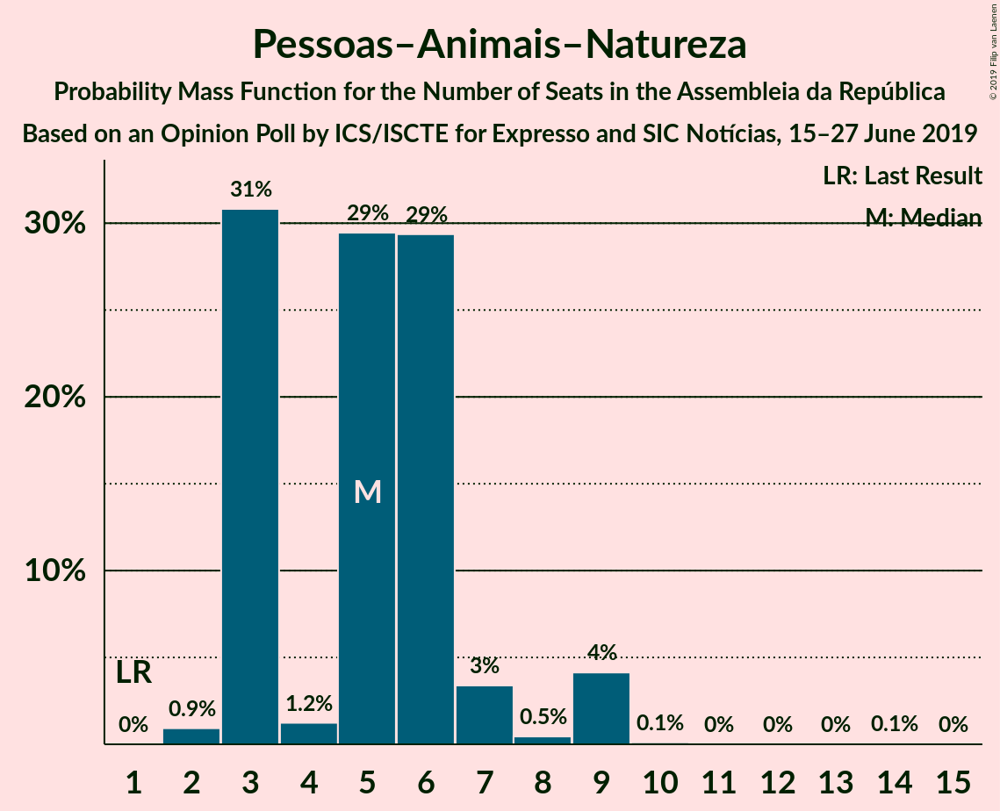
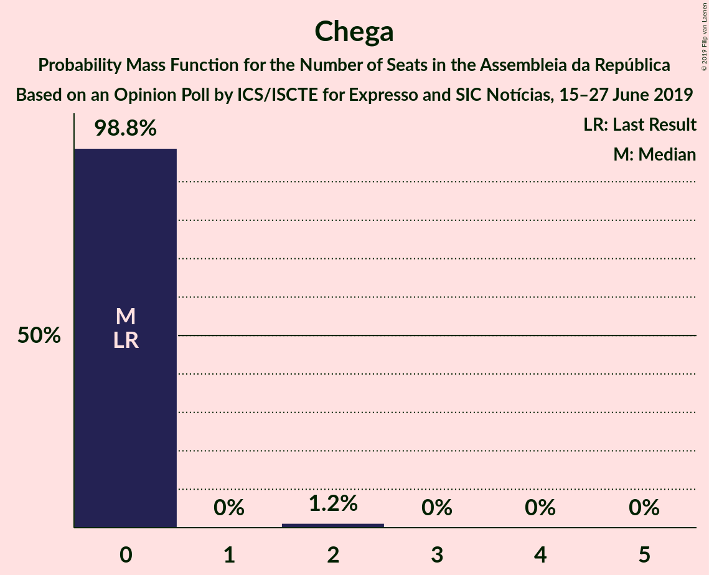

# Opinion Poll by ICS/ISCTE for Expresso and SIC Notícias, 15–27 June 2019

<a href="#voting-intentions">Voting Intentions</a> | <a href="#seats">Seats</a> | <a href="#coalitions">Coalitions</a> | <a href="#technical-information">Technical Information</a>

## Voting Intentions

### Confidence Intervals

| Party | Last Result | Poll Result | 80% Confidence Interval | 90% Confidence Interval | 95% Confidence Interval | 99% Confidence Interval |
|:-----:|:-----------:|:-----------:|:-----------------------:|:-----------------------:|:-----------------------:|:-----------------------:|
| Partido Socialista | 32.3% | 37.7% | 35.5–39.9% |34.9–40.6% |34.4–41.1% |33.4–42.2% |
| Partido Social Democrata | 36.9% | 22.8% | 21.0–24.8% |20.5–25.4% |20.1–25.9% |19.2–26.9% |
| Bloco de Esquerda | 10.2% | 10.9% | 9.6–12.4% |9.2–12.8% |8.9–13.2% |8.3–14.0% |
| Coligação Democrática Unitária | 8.2% | 8.0% | 6.9–9.4% |6.6–9.7% |6.3–10.1% |5.8–10.8% |
| CDS–Partido Popular | 36.9% | 5.0% | 4.1–6.1% |3.9–6.4% |3.7–6.7% |3.3–7.3% |
| Pessoas–Animais–Natureza | 1.4% | 4.0% | 3.2–5.0% |3.0–5.3% |2.8–5.6% |2.5–6.1% |
| Chega | 0.0% | 1.0% | 0.7–1.6% |0.6–1.8% |0.5–2.0% |0.4–2.3% |
| LIVRE | 0.7% | 0.2% | 0.1–0.7% |0.1–0.8% |0.1–0.9% |0.0–1.2% |
| Iniciativa Liberal | 0.0% | 0.2% | 0.1–0.7% |0.1–0.8% |0.1–0.9% |0.0–1.2% |
| Aliança | 0.0% | 0.2% | 0.1–0.7% |0.1–0.8% |0.1–0.9% |0.0–1.2% |

*Note:* The poll result column reflects the actual value used in the calculations. Published results may vary slightly, and in addition be rounded to fewer digits.

## Seats

### Confidence Intervals

| Party | Last Result | Median | 80% Confidence Interval | 90% Confidence Interval | 95% Confidence Interval | 99% Confidence Interval |
|:-----:|:-----------:|:------:|:-----------------------:|:-----------------------:|:-----------------------:|:-----------------------:|
| <a href="#partido-socialista">Partido Socialista</a> | 86 | 110 | 104–117 |100–117 |98–117 |94–118 |
| <a href="#partido-social-democrata">Partido Social Democrata</a> | 89 | 60 | 60–77 |60–77 |60–77 |53–79 |
| <a href="#bloco-de-esquerda">Bloco de Esquerda</a> | 19 | 24 | 18–30 |18–30 |18–30 |18–38 |
| <a href="#coligação-democrática-unitária">Coligação Democrática Unitária</a> | 17 | 17 | 13–20 |13–20 |10–20 |10–24 |
| <a href="#cds–partido-popular">CDS–Partido Popular</a> | 18 | 10 | 6–16 |6–16 |6–17 |2–20 |
| <a href="#pessoas–animais–natureza">Pessoas–Animais–Natureza</a> | 1 | 4 | 2–6 |2–6 |1–9 |1–13 |
| <a href="#chega">Chega</a> | 0 | 0 | 0–2 |0–2 |0–2 |0–4 |
| <a href="#livre">LIVRE</a> | 0 | 0 | 0 |0 |0 |0–1 |
| <a href="#iniciativa-liberal">Iniciativa Liberal</a> | 0 | 0 | 0–1 |0–1 |0–1 |0–1 |
| <a href="#aliança">Aliança</a> | 0 | 0 | 0 |0 |0 |0 |

### Partido Socialista

*For a full overview of the results for this party, see the [Partido Socialista](party-partidosocialista.html) page.*

| Number of Seats | Probability | Accumulated | Special Marks |
|:---------------:|:-----------:|:-----------:|:-------------:|
| 86 | 0% | 100% | Last Result |
| 87 | 0% | 100% |  |
| 88 | 0% | 100% |  |
| 89 | 0% | 100% |  |
| 90 | 0% | 100% |  |
| 91 | 0% | 100% |  |
| 92 | 0.4% | 100% |  |
| 93 | 0% | 99.6% |  |
| 94 | 2% | 99.6% |  |
| 95 | 0% | 98% |  |
| 96 | 0.1% | 98% |  |
| 97 | 0% | 98% |  |
| 98 | 2% | 98% |  |
| 99 | 0.6% | 96% |  |
| 100 | 1.2% | 96% |  |
| 101 | 0% | 95% |  |
| 102 | 0.1% | 95% |  |
| 103 | 0% | 94% |  |
| 104 | 23% | 94% |  |
| 105 | 19% | 71% |  |
| 106 | 0.5% | 52% |  |
| 107 | 0.1% | 51% |  |
| 108 | 0.1% | 51% |  |
| 109 | 0.2% | 51% |  |
| 110 | 8% | 51% | Median |
| 111 | 0.1% | 43% |  |
| 112 | 5% | 43% |  |
| 113 | 0% | 38% |  |
| 114 | 0.6% | 38% |  |
| 115 | 0.8% | 38% |  |
| 116 | 0.1% | 37% | Majority |
| 117 | 36% | 37% |  |
| 118 | 1.0% | 1.0% |  |
| 119 | 0% | 0% |  |

### Partido Social Democrata

*For a full overview of the results for this party, see the [Partido Social Democrata](party-partidosocialdemocrata.html) page.*

| Number of Seats | Probability | Accumulated | Special Marks |
|:---------------:|:-----------:|:-----------:|:-------------:|
| 52 | 0.1% | 100% |  |
| 53 | 0.8% | 99.9% |  |
| 54 | 0% | 99.1% |  |
| 55 | 0% | 99.1% |  |
| 56 | 0.1% | 99.1% |  |
| 57 | 0.1% | 99.0% |  |
| 58 | 0% | 99.0% |  |
| 59 | 0.3% | 98.9% |  |
| 60 | 69% | 98.7% | Median |
| 61 | 0.9% | 29% |  |
| 62 | 0.1% | 29% |  |
| 63 | 0% | 28% |  |
| 64 | 1.3% | 28% |  |
| 65 | 0.8% | 27% |  |
| 66 | 0.1% | 26% |  |
| 67 | 0% | 26% |  |
| 68 | 0.1% | 26% |  |
| 69 | 0.3% | 26% |  |
| 70 | 0% | 26% |  |
| 71 | 3% | 26% |  |
| 72 | 0% | 23% |  |
| 73 | 0% | 23% |  |
| 74 | 0% | 23% |  |
| 75 | 0.4% | 23% |  |
| 76 | 0% | 23% |  |
| 77 | 22% | 23% |  |
| 78 | 0% | 0.6% |  |
| 79 | 0.2% | 0.6% |  |
| 80 | 0% | 0.4% |  |
| 81 | 0% | 0.4% |  |
| 82 | 0.2% | 0.4% |  |
| 83 | 0.2% | 0.2% |  |
| 84 | 0% | 0% |  |
| 85 | 0% | 0% |  |
| 86 | 0% | 0% |  |
| 87 | 0% | 0% |  |
| 88 | 0% | 0% |  |
| 89 | 0% | 0% | Last Result |

### Bloco de Esquerda

*For a full overview of the results for this party, see the [Bloco de Esquerda](party-blocodeesquerda.html) page.*

| Number of Seats | Probability | Accumulated | Special Marks |
|:---------------:|:-----------:|:-----------:|:-------------:|
| 14 | 0.4% | 100% |  |
| 15 | 0% | 99.6% |  |
| 16 | 0% | 99.6% |  |
| 17 | 0.1% | 99.6% |  |
| 18 | 37% | 99.5% |  |
| 19 | 4% | 63% | Last Result |
| 20 | 0% | 59% |  |
| 21 | 0.1% | 59% |  |
| 22 | 0.5% | 59% |  |
| 23 | 4% | 59% |  |
| 24 | 20% | 55% | Median |
| 25 | 8% | 35% |  |
| 26 | 0.1% | 28% |  |
| 27 | 2% | 27% |  |
| 28 | 1.0% | 25% |  |
| 29 | 0% | 24% |  |
| 30 | 23% | 24% |  |
| 31 | 0% | 1.1% |  |
| 32 | 0% | 1.1% |  |
| 33 | 0% | 1.1% |  |
| 34 | 0.1% | 1.1% |  |
| 35 | 0% | 1.0% |  |
| 36 | 0% | 1.0% |  |
| 37 | 0% | 1.0% |  |
| 38 | 0.8% | 1.0% |  |
| 39 | 0% | 0.3% |  |
| 40 | 0% | 0.3% |  |
| 41 | 0.3% | 0.3% |  |
| 42 | 0% | 0% |  |

### Coligação Democrática Unitária

*For a full overview of the results for this party, see the [Coligação Democrática Unitária](party-coligaçãodemocráticaunitária.html) page.*

| Number of Seats | Probability | Accumulated | Special Marks |
|:---------------:|:-----------:|:-----------:|:-------------:|
| 8 | 0.2% | 100% |  |
| 9 | 0.3% | 99.8% |  |
| 10 | 3% | 99.5% |  |
| 11 | 0% | 97% |  |
| 12 | 0% | 97% |  |
| 13 | 19% | 97% |  |
| 14 | 0.1% | 77% |  |
| 15 | 0% | 77% |  |
| 16 | 0.2% | 77% |  |
| 17 | 42% | 77% | Last Result, Median |
| 18 | 0% | 34% |  |
| 19 | 10% | 34% |  |
| 20 | 23% | 25% |  |
| 21 | 0.1% | 1.4% |  |
| 22 | 0% | 1.4% |  |
| 23 | 0.8% | 1.4% |  |
| 24 | 0.4% | 0.5% |  |
| 25 | 0% | 0.1% |  |
| 26 | 0% | 0.1% |  |
| 27 | 0% | 0.1% |  |
| 28 | 0.1% | 0.1% |  |
| 29 | 0% | 0% |  |

### CDS–Partido Popular

*For a full overview of the results for this party, see the [CDS–Partido Popular](party-cds–partidopopular.html) page.*

| Number of Seats | Probability | Accumulated | Special Marks |
|:---------------:|:-----------:|:-----------:|:-------------:|
| 2 | 1.0% | 100% |  |
| 3 | 0.1% | 99.0% |  |
| 4 | 0.2% | 98.9% |  |
| 5 | 0% | 98.8% |  |
| 6 | 22% | 98.7% |  |
| 7 | 2% | 77% |  |
| 8 | 9% | 75% |  |
| 9 | 0% | 65% |  |
| 10 | 24% | 65% | Median |
| 11 | 0.8% | 41% |  |
| 12 | 0% | 40% |  |
| 13 | 0.1% | 40% |  |
| 14 | 0% | 40% |  |
| 15 | 0% | 40% |  |
| 16 | 36% | 40% |  |
| 17 | 4% | 4% |  |
| 18 | 0% | 0.8% | Last Result |
| 19 | 0% | 0.8% |  |
| 20 | 0.8% | 0.8% |  |
| 21 | 0% | 0% |  |

### Pessoas–Animais–Natureza

*For a full overview of the results for this party, see the [Pessoas–Animais–Natureza](party-pessoas–animais–natureza.html) page.*

| Number of Seats | Probability | Accumulated | Special Marks |
|:---------------:|:-----------:|:-----------:|:-------------:|
| 1 | 3% | 100% | Last Result |
| 2 | 37% | 97% |  |
| 3 | 1.1% | 60% |  |
| 4 | 22% | 59% | Median |
| 5 | 0% | 37% |  |
| 6 | 34% | 37% |  |
| 7 | 0% | 3% |  |
| 8 | 0.3% | 3% |  |
| 9 | 1.2% | 3% |  |
| 10 | 0.1% | 1.4% |  |
| 11 | 0% | 1.4% |  |
| 12 | 0% | 1.4% |  |
| 13 | 1.3% | 1.4% |  |
| 14 | 0% | 0.1% |  |
| 15 | 0% | 0.1% |  |
| 16 | 0.1% | 0.1% |  |
| 17 | 0% | 0% |  |

### Chega

*For a full overview of the results for this party, see the [Chega](party-chega.html) page.*

| Number of Seats | Probability | Accumulated | Special Marks |
|:---------------:|:-----------:|:-----------:|:-------------:|
| 0 | 87% | 100% | Last Result, Median |
| 1 | 0% | 13% |  |
| 2 | 11% | 13% |  |
| 3 | 0% | 1.4% |  |
| 4 | 1.4% | 1.4% |  |
| 5 | 0% | 0% |  |

### LIVRE

*For a full overview of the results for this party, see the [LIVRE](party-livre.html) page.*

| Number of Seats | Probability | Accumulated | Special Marks |
|:---------------:|:-----------:|:-----------:|:-------------:|
| 0 | 98% | 100% | Last Result, Median |
| 1 | 1.5% | 2% |  |
| 2 | 0.1% | 0.1% |  |
| 3 | 0% | 0% |  |

### Iniciativa Liberal

*For a full overview of the results for this party, see the [Iniciativa Liberal](party-iniciativaliberal.html) page.*

| Number of Seats | Probability | Accumulated | Special Marks |
|:---------------:|:-----------:|:-----------:|:-------------:|
| 0 | 80% | 100% | Last Result, Median |
| 1 | 20% | 20% |  |
| 2 | 0.2% | 0.2% |  |
| 3 | 0% | 0% |  |

### Aliança

*For a full overview of the results for this party, see the [Aliança](party-aliança.html) page.*

| Number of Seats | Probability | Accumulated | Special Marks |
|:---------------:|:-----------:|:-----------:|:-------------:|
| 0 | 100% | 100% | Last Result, Median |

## Coalitions

### Confidence Intervals

| Coalition | Last Result | Median | Majority? | 80% Confidence Interval | 90% Confidence Interval | 95% Confidence Interval | 99% Confidence Interval |
|:---------:|:-----------:|:------:|:---------:|:-----------------------:|:-----------------------:|:-----------------------:|:-----------------------:|
| Partido Socialista – Bloco de Esquerda – Coligação Democrática Unitária | 122 | 152 | 100% | 142–154 | 141–154 | 140–154 | 130–169 |
| Partido Socialista – Bloco de Esquerda | 105 | 134 | 99.2% | 129–135 | 128–135 | 123–135 | 113–146 |
| Partido Socialista – Coligação Democrática Unitária | 103 | 124 | 96% | 118–134 | 117–134 | 115–134 | 111–141 |
| Partido Socialista | 86 | 110 | 37% | 104–117 | 100–117 | 98–117 | 94–118 |
| Partido Social Democrata – CDS–Partido Popular | 107 | 76 | 0% | 70–83 | 68–83 | 68–83 | 55–95 |

### Partido Socialista – Bloco de Esquerda – Coligação Democrática Unitária

| Number of Seats | Probability | Accumulated | Special Marks |
|:---------------:|:-----------:|:-----------:|:-------------:|
| 122 | 0% | 100% | Last Result |
| 123 | 0% | 100% |  |
| 124 | 0% | 100% |  |
| 125 | 0% | 100% |  |
| 126 | 0% | 100% |  |
| 127 | 0% | 100% |  |
| 128 | 0% | 100% |  |
| 129 | 0% | 100% |  |
| 130 | 0.8% | 100% |  |
| 131 | 0% | 99.2% |  |
| 132 | 0% | 99.2% |  |
| 133 | 0.1% | 99.2% |  |
| 134 | 0.3% | 99.1% |  |
| 135 | 0% | 98.8% |  |
| 136 | 0% | 98.8% |  |
| 137 | 0% | 98.8% |  |
| 138 | 0% | 98.8% |  |
| 139 | 0% | 98.8% |  |
| 140 | 2% | 98.8% |  |
| 141 | 2% | 97% |  |
| 142 | 21% | 94% |  |
| 143 | 0.6% | 74% |  |
| 144 | 0.2% | 73% |  |
| 145 | 0% | 73% |  |
| 146 | 0% | 73% |  |
| 147 | 0% | 73% |  |
| 148 | 0% | 73% |  |
| 149 | 0.1% | 73% |  |
| 150 | 0.9% | 73% |  |
| 151 | 0.8% | 72% | Median |
| 152 | 39% | 71% |  |
| 153 | 0% | 32% |  |
| 154 | 31% | 32% |  |
| 155 | 0% | 1.1% |  |
| 156 | 0% | 1.1% |  |
| 157 | 0% | 1.1% |  |
| 158 | 0% | 1.1% |  |
| 159 | 0% | 1.1% |  |
| 160 | 0.3% | 1.1% |  |
| 161 | 0% | 0.9% |  |
| 162 | 0% | 0.8% |  |
| 163 | 0% | 0.8% |  |
| 164 | 0% | 0.8% |  |
| 165 | 0% | 0.8% |  |
| 166 | 0% | 0.8% |  |
| 167 | 0% | 0.8% |  |
| 168 | 0% | 0.8% |  |
| 169 | 0.8% | 0.8% |  |
| 170 | 0% | 0% |  |

### Partido Socialista – Bloco de Esquerda

| Number of Seats | Probability | Accumulated | Special Marks |
|:---------------:|:-----------:|:-----------:|:-------------:|
| 105 | 0% | 100% | Last Result |
| 106 | 0% | 100% |  |
| 107 | 0% | 100% |  |
| 108 | 0% | 100% |  |
| 109 | 0% | 100% |  |
| 110 | 0% | 100% |  |
| 111 | 0.4% | 100% |  |
| 112 | 0% | 99.6% |  |
| 113 | 0.4% | 99.6% |  |
| 114 | 0% | 99.2% |  |
| 115 | 0% | 99.2% |  |
| 116 | 0% | 99.2% | Majority |
| 117 | 0% | 99.2% |  |
| 118 | 0% | 99.2% |  |
| 119 | 0% | 99.2% |  |
| 120 | 0.1% | 99.2% |  |
| 121 | 0.8% | 99.1% |  |
| 122 | 0% | 98% |  |
| 123 | 1.2% | 98% |  |
| 124 | 0.1% | 97% |  |
| 125 | 2% | 97% |  |
| 126 | 0% | 95% |  |
| 127 | 0% | 95% |  |
| 128 | 0.4% | 95% |  |
| 129 | 19% | 95% |  |
| 130 | 0% | 75% |  |
| 131 | 2% | 75% |  |
| 132 | 0.8% | 73% |  |
| 133 | 1.5% | 72% |  |
| 134 | 23% | 71% | Median |
| 135 | 46% | 48% |  |
| 136 | 0.2% | 1.4% |  |
| 137 | 0% | 1.2% |  |
| 138 | 0% | 1.2% |  |
| 139 | 0% | 1.2% |  |
| 140 | 0.2% | 1.2% |  |
| 141 | 0.1% | 0.9% |  |
| 142 | 0% | 0.8% |  |
| 143 | 0% | 0.8% |  |
| 144 | 0% | 0.8% |  |
| 145 | 0% | 0.8% |  |
| 146 | 0.8% | 0.8% |  |
| 147 | 0% | 0% |  |

### Partido Socialista – Coligação Democrática Unitária

| Number of Seats | Probability | Accumulated | Special Marks |
|:---------------:|:-----------:|:-----------:|:-------------:|
| 103 | 0% | 100% | Last Result |
| 104 | 0% | 100% |  |
| 105 | 0% | 100% |  |
| 106 | 0% | 100% |  |
| 107 | 0% | 100% |  |
| 108 | 0% | 100% |  |
| 109 | 0% | 100% |  |
| 110 | 0% | 100% |  |
| 111 | 0.5% | 100% |  |
| 112 | 0% | 99.5% |  |
| 113 | 2% | 99.4% |  |
| 114 | 0% | 98% |  |
| 115 | 2% | 98% |  |
| 116 | 0.4% | 96% | Majority |
| 117 | 1.2% | 96% |  |
| 118 | 19% | 95% |  |
| 119 | 0.3% | 75% |  |
| 120 | 0% | 75% |  |
| 121 | 0.1% | 75% |  |
| 122 | 2% | 75% |  |
| 123 | 0% | 72% |  |
| 124 | 24% | 72% |  |
| 125 | 0.1% | 49% |  |
| 126 | 0.2% | 49% |  |
| 127 | 0% | 48% | Median |
| 128 | 0.1% | 48% |  |
| 129 | 10% | 48% |  |
| 130 | 0.3% | 38% |  |
| 131 | 0% | 38% |  |
| 132 | 0.9% | 38% |  |
| 133 | 0% | 37% |  |
| 134 | 36% | 37% |  |
| 135 | 0% | 0.9% |  |
| 136 | 0% | 0.9% |  |
| 137 | 0.1% | 0.9% |  |
| 138 | 0% | 0.8% |  |
| 139 | 0% | 0.8% |  |
| 140 | 0% | 0.8% |  |
| 141 | 0.8% | 0.8% |  |
| 142 | 0% | 0% |  |

### Partido Socialista

| Number of Seats | Probability | Accumulated | Special Marks |
|:---------------:|:-----------:|:-----------:|:-------------:|
| 86 | 0% | 100% | Last Result |
| 87 | 0% | 100% |  |
| 88 | 0% | 100% |  |
| 89 | 0% | 100% |  |
| 90 | 0% | 100% |  |
| 91 | 0% | 100% |  |
| 92 | 0.4% | 100% |  |
| 93 | 0% | 99.6% |  |
| 94 | 2% | 99.6% |  |
| 95 | 0% | 98% |  |
| 96 | 0.1% | 98% |  |
| 97 | 0% | 98% |  |
| 98 | 2% | 98% |  |
| 99 | 0.6% | 96% |  |
| 100 | 1.2% | 96% |  |
| 101 | 0% | 95% |  |
| 102 | 0.1% | 95% |  |
| 103 | 0% | 94% |  |
| 104 | 23% | 94% |  |
| 105 | 19% | 71% |  |
| 106 | 0.5% | 52% |  |
| 107 | 0.1% | 51% |  |
| 108 | 0.1% | 51% |  |
| 109 | 0.2% | 51% |  |
| 110 | 8% | 51% | Median |
| 111 | 0.1% | 43% |  |
| 112 | 5% | 43% |  |
| 113 | 0% | 38% |  |
| 114 | 0.6% | 38% |  |
| 115 | 0.8% | 38% |  |
| 116 | 0.1% | 37% | Majority |
| 117 | 36% | 37% |  |
| 118 | 1.0% | 1.0% |  |
| 119 | 0% | 0% |  |

### Partido Social Democrata – CDS–Partido Popular

| Number of Seats | Probability | Accumulated | Special Marks |
|:---------------:|:-----------:|:-----------:|:-------------:|
| 55 | 0.8% | 100% |  |
| 56 | 0% | 99.2% |  |
| 57 | 0% | 99.2% |  |
| 58 | 0% | 99.2% |  |
| 59 | 0% | 99.2% |  |
| 60 | 0.1% | 99.2% |  |
| 61 | 0% | 99.1% |  |
| 62 | 0% | 99.1% |  |
| 63 | 0% | 99.1% |  |
| 64 | 0.1% | 99.1% |  |
| 65 | 0.1% | 99.1% |  |
| 66 | 0.2% | 99.0% |  |
| 67 | 0% | 98.7% |  |
| 68 | 8% | 98.7% |  |
| 69 | 0% | 91% |  |
| 70 | 23% | 91% | Median |
| 71 | 0.1% | 68% |  |
| 72 | 1.4% | 68% |  |
| 73 | 0.1% | 66% |  |
| 74 | 0.1% | 66% |  |
| 75 | 0% | 66% |  |
| 76 | 37% | 66% |  |
| 77 | 3% | 29% |  |
| 78 | 2% | 27% |  |
| 79 | 0.1% | 24% |  |
| 80 | 0% | 24% |  |
| 81 | 1.2% | 24% |  |
| 82 | 0% | 23% |  |
| 83 | 22% | 23% |  |
| 84 | 0.2% | 1.4% |  |
| 85 | 0.1% | 1.2% |  |
| 86 | 0.1% | 1.1% |  |
| 87 | 0% | 1.0% |  |
| 88 | 0% | 1.0% |  |
| 89 | 0.2% | 1.0% |  |
| 90 | 0% | 0.8% |  |
| 91 | 0% | 0.8% |  |
| 92 | 0% | 0.8% |  |
| 93 | 0% | 0.8% |  |
| 94 | 0% | 0.8% |  |
| 95 | 0.4% | 0.8% |  |
| 96 | 0% | 0.4% |  |
| 97 | 0.4% | 0.4% |  |
| 98 | 0% | 0% |  |
| 99 | 0% | 0% |  |
| 100 | 0% | 0% |  |
| 101 | 0% | 0% |  |
| 102 | 0% | 0% |  |
| 103 | 0% | 0% |  |
| 104 | 0% | 0% |  |
| 105 | 0% | 0% |  |
| 106 | 0% | 0% |  |
| 107 | 0% | 0% | Last Result |

## Technical Information

### Opinion Poll

+ **Polling firm:** ICS/ISCTE
+ **Commissioner(s):** Expresso and SIC Notícias
+ **Fieldwork period:** 15–27 June 2019

### Calculations

+ **Sample size:** 801
+ **Simulations done:** 1,024
+ **Error estimate:** 5.88%

