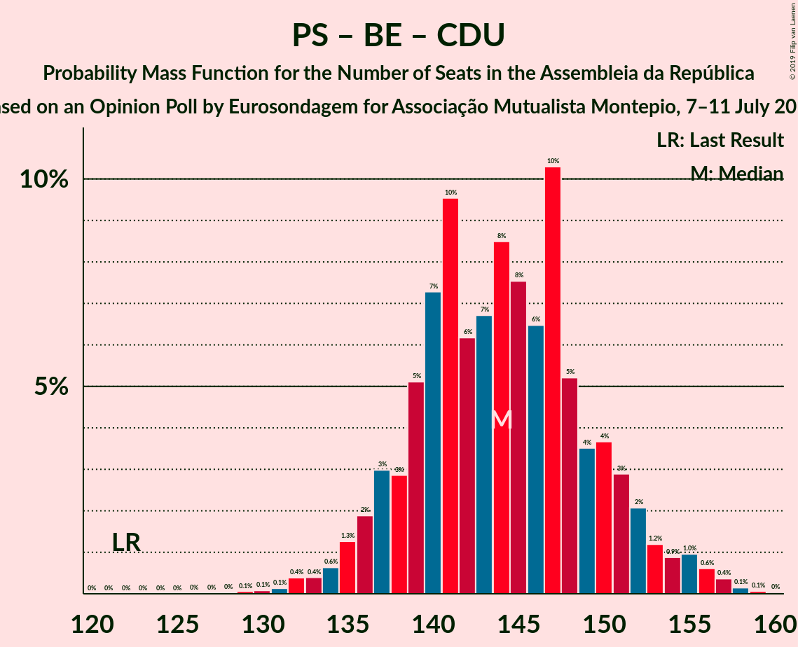
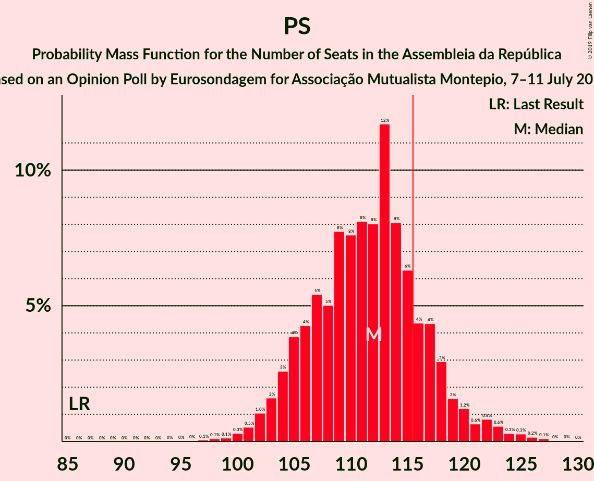

# Opinion Poll by Eurosondagem for Associação Mutualista Montepio, 7–11 July 2019

<a href="#voting-intentions">Voting Intentions</a> | <a href="#seats">Seats</a> | <a href="#coalitions">Coalitions</a> | <a href="#technical-information">Technical Information</a>

## Voting Intentions

### Confidence Intervals

| Party | Last Result | Poll Result | 80% Confidence Interval | 90% Confidence Interval | 95% Confidence Interval | 99% Confidence Interval |
|:-----:|:-----------:|:-----------:|:-----------------------:|:-----------------------:|:-----------------------:|:-----------------------:|
| Partido Socialista | 32.3% | 37.3% | 35.4–39.3% |34.8–39.8% |34.4–40.3% |33.4–41.3% |
| Partido Social Democrata | 36.9% | 23.6% | 22.0–25.4% |21.5–25.9% |21.1–26.4% |20.3–27.2% |
| Bloco de Esquerda | 10.2% | 9.0% | 7.9–10.3% |7.6–10.6% |7.4–10.9% |6.9–11.6% |
| Coligação Democrática Unitária | 8.2% | 6.8% | 5.9–8.0% |5.6–8.3% |5.4–8.6% |5.0–9.1% |
| CDS–Partido Popular | 36.9% | 6.4% | 5.5–7.5% |5.3–7.8% |5.1–8.1% |4.7–8.7% |
| Pessoas–Animais–Natureza | 1.4% | 4.3% | 3.5–5.2% |3.3–5.5% |3.2–5.7% |2.9–6.2% |
| Aliança | 0.0% | 1.5% | 1.1–2.1% |1.0–2.3% |0.9–2.4% |0.7–2.8% |

*Note:* The poll result column reflects the actual value used in the calculations. Published results may vary slightly, and in addition be rounded to fewer digits.

## Seats

### Confidence Intervals

| Party | Last Result | Median | 80% Confidence Interval | 90% Confidence Interval | 95% Confidence Interval | 99% Confidence Interval |
|:-----:|:-----------:|:------:|:-----------------------:|:-----------------------:|:-----------------------:|:-----------------------:|
| <a href="#partido-socialista">Partido Socialista</a> | 86 | 112 | 106–117 |104–119 |103–121 |100–125 |
| <a href="#partido-social-democrata">Partido Social Democrata</a> | 89 | 68 | 63–74 |61–76 |60–77 |56–79 |
| <a href="#bloco-de-esquerda">Bloco de Esquerda</a> | 19 | 18 | 17–23 |16–24 |15–24 |13–25 |
| <a href="#coligação-democrática-unitária">Coligação Democrática Unitária</a> | 17 | 14 | 9–15 |8–17 |8–19 |7–19 |
| <a href="#cds–partido-popular">CDS–Partido Popular</a> | 18 | 11 | 8–15 |8–16 |7–18 |6–19 |
| <a href="#pessoas–animais–natureza">Pessoas–Animais–Natureza</a> | 1 | 6 | 4–7 |4–8 |4–9 |3–9 |
| <a href="#aliança">Aliança</a> | 0 | 0 | 0–2 |0–2 |0–2 |0–2 |

### Partido Socialista

*For a full overview of the results for this party, see the [Partido Socialista](party-partidosocialista.html) page.*

| Number of Seats | Probability | Accumulated | Special Marks |
|:---------------:|:-----------:|:-----------:|:-------------:|
| 86 | 0% | 100% | Last Result |
| 87 | 0% | 100% |  |
| 88 | 0% | 100% |  |
| 89 | 0% | 100% |  |
| 90 | 0% | 100% |  |
| 91 | 0% | 100% |  |
| 92 | 0% | 100% |  |
| 93 | 0% | 100% |  |
| 94 | 0% | 100% |  |
| 95 | 0% | 100% |  |
| 96 | 0% | 100% |  |
| 97 | 0.1% | 100% |  |
| 98 | 0.1% | 99.9% |  |
| 99 | 0.1% | 99.8% |  |
| 100 | 0.4% | 99.7% |  |
| 101 | 0.6% | 99.3% |  |
| 102 | 0.8% | 98.8% |  |
| 103 | 2% | 98% |  |
| 104 | 4% | 96% |  |
| 105 | 3% | 93% |  |
| 106 | 5% | 90% |  |
| 107 | 5% | 85% |  |
| 108 | 5% | 81% |  |
| 109 | 6% | 76% |  |
| 110 | 8% | 70% |  |
| 111 | 8% | 61% |  |
| 112 | 7% | 53% | Median |
| 113 | 9% | 46% |  |
| 114 | 14% | 37% |  |
| 115 | 5% | 23% |  |
| 116 | 4% | 18% | Majority |
| 117 | 5% | 14% |  |
| 118 | 3% | 9% |  |
| 119 | 2% | 6% |  |
| 120 | 1.3% | 4% |  |
| 121 | 0.5% | 3% |  |
| 122 | 0.7% | 2% |  |
| 123 | 0.6% | 1.4% |  |
| 124 | 0.3% | 0.8% |  |
| 125 | 0.2% | 0.5% |  |
| 126 | 0.2% | 0.3% |  |
| 127 | 0.1% | 0.1% |  |
| 128 | 0% | 0.1% |  |
| 129 | 0% | 0% |  |

### Partido Social Democrata

*For a full overview of the results for this party, see the [Partido Social Democrata](party-partidosocialdemocrata.html) page.*

| Number of Seats | Probability | Accumulated | Special Marks |
|:---------------:|:-----------:|:-----------:|:-------------:|
| 55 | 0.1% | 100% |  |
| 56 | 0.5% | 99.9% |  |
| 57 | 0.2% | 99.4% |  |
| 58 | 0.5% | 99.2% |  |
| 59 | 0.7% | 98.7% |  |
| 60 | 2% | 98% |  |
| 61 | 2% | 96% |  |
| 62 | 2% | 94% |  |
| 63 | 6% | 91% |  |
| 64 | 5% | 86% |  |
| 65 | 3% | 81% |  |
| 66 | 10% | 78% |  |
| 67 | 13% | 68% |  |
| 68 | 5% | 55% | Median |
| 69 | 6% | 49% |  |
| 70 | 4% | 43% |  |
| 71 | 7% | 39% |  |
| 72 | 5% | 33% |  |
| 73 | 12% | 27% |  |
| 74 | 8% | 15% |  |
| 75 | 2% | 7% |  |
| 76 | 1.3% | 5% |  |
| 77 | 2% | 4% |  |
| 78 | 1.1% | 2% |  |
| 79 | 0.3% | 0.8% |  |
| 80 | 0.2% | 0.5% |  |
| 81 | 0.1% | 0.2% |  |
| 82 | 0.1% | 0.2% |  |
| 83 | 0% | 0.1% |  |
| 84 | 0% | 0% |  |
| 85 | 0% | 0% |  |
| 86 | 0% | 0% |  |
| 87 | 0% | 0% |  |
| 88 | 0% | 0% |  |
| 89 | 0% | 0% | Last Result |

### Bloco de Esquerda

*For a full overview of the results for this party, see the [Bloco de Esquerda](party-blocodeesquerda.html) page.*

| Number of Seats | Probability | Accumulated | Special Marks |
|:---------------:|:-----------:|:-----------:|:-------------:|
| 10 | 0.1% | 100% |  |
| 11 | 0.1% | 99.9% |  |
| 12 | 0.1% | 99.7% |  |
| 13 | 0.4% | 99.6% |  |
| 14 | 0.7% | 99.3% |  |
| 15 | 3% | 98.6% |  |
| 16 | 4% | 95% |  |
| 17 | 16% | 91% |  |
| 18 | 28% | 75% | Median |
| 19 | 8% | 48% | Last Result |
| 20 | 19% | 40% |  |
| 21 | 8% | 21% |  |
| 22 | 2% | 13% |  |
| 23 | 5% | 11% |  |
| 24 | 5% | 6% |  |
| 25 | 0.6% | 1.0% |  |
| 26 | 0.2% | 0.4% |  |
| 27 | 0.1% | 0.2% |  |
| 28 | 0.1% | 0.1% |  |
| 29 | 0% | 0% |  |

### Coligação Democrática Unitária

*For a full overview of the results for this party, see the [Coligação Democrática Unitária](party-coligaçãodemocráticaunitária.html) page.*

| Number of Seats | Probability | Accumulated | Special Marks |
|:---------------:|:-----------:|:-----------:|:-------------:|
| 6 | 0.4% | 100% |  |
| 7 | 0.3% | 99.6% |  |
| 8 | 5% | 99.3% |  |
| 9 | 8% | 94% |  |
| 10 | 4% | 87% |  |
| 11 | 1.1% | 83% |  |
| 12 | 2% | 82% |  |
| 13 | 5% | 80% |  |
| 14 | 57% | 75% | Median |
| 15 | 10% | 18% |  |
| 16 | 2% | 8% |  |
| 17 | 1.4% | 6% | Last Result |
| 18 | 2% | 5% |  |
| 19 | 2% | 3% |  |
| 20 | 0.4% | 0.4% |  |
| 21 | 0% | 0% |  |

### CDS–Partido Popular

*For a full overview of the results for this party, see the [CDS–Partido Popular](party-cds–partidopopular.html) page.*

| Number of Seats | Probability | Accumulated | Special Marks |
|:---------------:|:-----------:|:-----------:|:-------------:|
| 6 | 0.7% | 100% |  |
| 7 | 3% | 99.3% |  |
| 8 | 12% | 96% |  |
| 9 | 9% | 84% |  |
| 10 | 21% | 75% |  |
| 11 | 13% | 54% | Median |
| 12 | 17% | 41% |  |
| 13 | 10% | 24% |  |
| 14 | 2% | 14% |  |
| 15 | 6% | 12% |  |
| 16 | 2% | 6% |  |
| 17 | 1.4% | 5% |  |
| 18 | 2% | 3% | Last Result |
| 19 | 1.1% | 1.4% |  |
| 20 | 0.3% | 0.3% |  |
| 21 | 0% | 0% |  |

### Pessoas–Animais–Natureza

*For a full overview of the results for this party, see the [Pessoas–Animais–Natureza](party-pessoas–animais–natureza.html) page.*

| Number of Seats | Probability | Accumulated | Special Marks |
|:---------------:|:-----------:|:-----------:|:-------------:|
| 1 | 0% | 100% | Last Result |
| 2 | 0.1% | 100% |  |
| 3 | 2% | 99.9% |  |
| 4 | 15% | 98% |  |
| 5 | 7% | 83% |  |
| 6 | 61% | 76% | Median |
| 7 | 6% | 15% |  |
| 8 | 5% | 9% |  |
| 9 | 3% | 3% |  |
| 10 | 0.1% | 0.5% |  |
| 11 | 0.1% | 0.4% |  |
| 12 | 0.1% | 0.3% |  |
| 13 | 0.1% | 0.2% |  |
| 14 | 0% | 0% |  |

### Aliança

*For a full overview of the results for this party, see the [Aliança](party-aliança.html) page.*

| Number of Seats | Probability | Accumulated | Special Marks |
|:---------------:|:-----------:|:-----------:|:-------------:|
| 0 | 85% | 100% | Last Result, Median |
| 1 | 3% | 15% |  |
| 2 | 12% | 12% |  |
| 3 | 0% | 0% |  |

## Coalitions

### Confidence Intervals

| Coalition | Last Result | Median | Majority? | 80% Confidence Interval | 90% Confidence Interval | 95% Confidence Interval | 99% Confidence Interval |
|:---------:|:-----------:|:------:|:---------:|:-----------------------:|:-----------------------:|:-----------------------:|:-----------------------:|
| Partido Socialista – Bloco de Esquerda – Coligação Democrática Unitária | 122 | 144 | 100% | 138–151 | 136–152 | 135–154 | 132–156 |
| Partido Socialista – Bloco de Esquerda | 105 | 131 | 99.9% | 125–137 | 123–138 | 122–140 | 119–144 |
| Partido Socialista – Coligação Democrática Unitária | 103 | 125 | 98% | 119–131 | 117–133 | 116–135 | 113–138 |
| Partido Socialista | 86 | 112 | 18% | 106–117 | 104–119 | 103–121 | 100–125 |
| Partido Social Democrata – CDS–Partido Popular | 107 | 80 | 0% | 73–85 | 72–88 | 70–89 | 68–91 |

### Partido Socialista – Bloco de Esquerda – Coligação Democrática Unitária

| Number of Seats | Probability | Accumulated | Special Marks |
|:---------------:|:-----------:|:-----------:|:-------------:|
| 122 | 0% | 100% | Last Result |
| 123 | 0% | 100% |  |
| 124 | 0% | 100% |  |
| 125 | 0% | 100% |  |
| 126 | 0% | 100% |  |
| 127 | 0% | 100% |  |
| 128 | 0% | 100% |  |
| 129 | 0.1% | 99.9% |  |
| 130 | 0.1% | 99.9% |  |
| 131 | 0.1% | 99.8% |  |
| 132 | 0.4% | 99.7% |  |
| 133 | 0.6% | 99.3% |  |
| 134 | 1.0% | 98.7% |  |
| 135 | 1.3% | 98% |  |
| 136 | 2% | 96% |  |
| 137 | 3% | 94% |  |
| 138 | 3% | 92% |  |
| 139 | 4% | 89% |  |
| 140 | 7% | 85% |  |
| 141 | 14% | 78% |  |
| 142 | 5% | 64% |  |
| 143 | 7% | 59% |  |
| 144 | 7% | 52% | Median |
| 145 | 7% | 45% |  |
| 146 | 8% | 38% |  |
| 147 | 7% | 30% |  |
| 148 | 5% | 23% |  |
| 149 | 2% | 18% |  |
| 150 | 5% | 16% |  |
| 151 | 5% | 11% |  |
| 152 | 1.4% | 6% |  |
| 153 | 1.0% | 4% |  |
| 154 | 1.0% | 3% |  |
| 155 | 1.3% | 2% |  |
| 156 | 0.7% | 1.0% |  |
| 157 | 0.1% | 0.4% |  |
| 158 | 0.2% | 0.3% |  |
| 159 | 0% | 0.1% |  |
| 160 | 0% | 0% |  |

### Partido Socialista – Bloco de Esquerda

| Number of Seats | Probability | Accumulated | Special Marks |
|:---------------:|:-----------:|:-----------:|:-------------:|
| 105 | 0% | 100% | Last Result |
| 106 | 0% | 100% |  |
| 107 | 0% | 100% |  |
| 108 | 0% | 100% |  |
| 109 | 0% | 100% |  |
| 110 | 0% | 100% |  |
| 111 | 0% | 100% |  |
| 112 | 0% | 100% |  |
| 113 | 0% | 100% |  |
| 114 | 0% | 100% |  |
| 115 | 0.1% | 100% |  |
| 116 | 0% | 99.9% | Majority |
| 117 | 0.1% | 99.9% |  |
| 118 | 0.3% | 99.8% |  |
| 119 | 0.3% | 99.6% |  |
| 120 | 0.8% | 99.3% |  |
| 121 | 1.0% | 98% |  |
| 122 | 1.2% | 98% |  |
| 123 | 3% | 96% |  |
| 124 | 2% | 93% |  |
| 125 | 2% | 91% |  |
| 126 | 8% | 89% |  |
| 127 | 10% | 81% |  |
| 128 | 4% | 71% |  |
| 129 | 10% | 67% |  |
| 130 | 6% | 57% | Median |
| 131 | 8% | 51% |  |
| 132 | 9% | 43% |  |
| 133 | 8% | 34% |  |
| 134 | 6% | 26% |  |
| 135 | 2% | 19% |  |
| 136 | 6% | 18% |  |
| 137 | 6% | 11% |  |
| 138 | 1.1% | 6% |  |
| 139 | 0.9% | 5% |  |
| 140 | 1.4% | 4% |  |
| 141 | 0.6% | 2% |  |
| 142 | 1.1% | 2% |  |
| 143 | 0.2% | 0.7% |  |
| 144 | 0.2% | 0.5% |  |
| 145 | 0.1% | 0.3% |  |
| 146 | 0.1% | 0.1% |  |
| 147 | 0% | 0.1% |  |
| 148 | 0% | 0% |  |

### Partido Socialista – Coligação Democrática Unitária

| Number of Seats | Probability | Accumulated | Special Marks |
|:---------------:|:-----------:|:-----------:|:-------------:|
| 103 | 0% | 100% | Last Result |
| 104 | 0% | 100% |  |
| 105 | 0% | 100% |  |
| 106 | 0% | 100% |  |
| 107 | 0% | 100% |  |
| 108 | 0% | 100% |  |
| 109 | 0% | 100% |  |
| 110 | 0% | 99.9% |  |
| 111 | 0.1% | 99.9% |  |
| 112 | 0.2% | 99.8% |  |
| 113 | 0.4% | 99.6% |  |
| 114 | 0.4% | 99.1% |  |
| 115 | 1.0% | 98.7% |  |
| 116 | 2% | 98% | Majority |
| 117 | 1.3% | 96% |  |
| 118 | 2% | 94% |  |
| 119 | 4% | 93% |  |
| 120 | 6% | 88% |  |
| 121 | 6% | 82% |  |
| 122 | 7% | 77% |  |
| 123 | 10% | 70% |  |
| 124 | 8% | 60% |  |
| 125 | 6% | 52% |  |
| 126 | 7% | 46% | Median |
| 127 | 5% | 39% |  |
| 128 | 13% | 34% |  |
| 129 | 4% | 21% |  |
| 130 | 4% | 17% |  |
| 131 | 4% | 13% |  |
| 132 | 2% | 9% |  |
| 133 | 2% | 6% |  |
| 134 | 2% | 4% |  |
| 135 | 0.6% | 3% |  |
| 136 | 1.0% | 2% |  |
| 137 | 0.5% | 1.2% |  |
| 138 | 0.3% | 0.7% |  |
| 139 | 0.3% | 0.4% |  |
| 140 | 0% | 0.1% |  |
| 141 | 0% | 0% |  |

### Partido Socialista

| Number of Seats | Probability | Accumulated | Special Marks |
|:---------------:|:-----------:|:-----------:|:-------------:|
| 86 | 0% | 100% | Last Result |
| 87 | 0% | 100% |  |
| 88 | 0% | 100% |  |
| 89 | 0% | 100% |  |
| 90 | 0% | 100% |  |
| 91 | 0% | 100% |  |
| 92 | 0% | 100% |  |
| 93 | 0% | 100% |  |
| 94 | 0% | 100% |  |
| 95 | 0% | 100% |  |
| 96 | 0% | 100% |  |
| 97 | 0.1% | 100% |  |
| 98 | 0.1% | 99.9% |  |
| 99 | 0.1% | 99.8% |  |
| 100 | 0.4% | 99.7% |  |
| 101 | 0.6% | 99.3% |  |
| 102 | 0.8% | 98.8% |  |
| 103 | 2% | 98% |  |
| 104 | 4% | 96% |  |
| 105 | 3% | 93% |  |
| 106 | 5% | 90% |  |
| 107 | 5% | 85% |  |
| 108 | 5% | 81% |  |
| 109 | 6% | 76% |  |
| 110 | 8% | 70% |  |
| 111 | 8% | 61% |  |
| 112 | 7% | 53% | Median |
| 113 | 9% | 46% |  |
| 114 | 14% | 37% |  |
| 115 | 5% | 23% |  |
| 116 | 4% | 18% | Majority |
| 117 | 5% | 14% |  |
| 118 | 3% | 9% |  |
| 119 | 2% | 6% |  |
| 120 | 1.3% | 4% |  |
| 121 | 0.5% | 3% |  |
| 122 | 0.7% | 2% |  |
| 123 | 0.6% | 1.4% |  |
| 124 | 0.3% | 0.8% |  |
| 125 | 0.2% | 0.5% |  |
| 126 | 0.2% | 0.3% |  |
| 127 | 0.1% | 0.1% |  |
| 128 | 0% | 0.1% |  |
| 129 | 0% | 0% |  |

### Partido Social Democrata – CDS–Partido Popular

| Number of Seats | Probability | Accumulated | Special Marks |
|:---------------:|:-----------:|:-----------:|:-------------:|
| 65 | 0% | 100% |  |
| 66 | 0.1% | 99.9% |  |
| 67 | 0.2% | 99.8% |  |
| 68 | 1.0% | 99.7% |  |
| 69 | 0.9% | 98.7% |  |
| 70 | 0.8% | 98% |  |
| 71 | 1.3% | 97% |  |
| 72 | 2% | 96% |  |
| 73 | 5% | 94% |  |
| 74 | 4% | 89% |  |
| 75 | 3% | 85% |  |
| 76 | 5% | 82% |  |
| 77 | 7% | 77% |  |
| 78 | 5% | 70% |  |
| 79 | 11% | 66% | Median |
| 80 | 9% | 55% |  |
| 81 | 8% | 46% |  |
| 82 | 5% | 38% |  |
| 83 | 14% | 33% |  |
| 84 | 5% | 19% |  |
| 85 | 4% | 13% |  |
| 86 | 2% | 9% |  |
| 87 | 2% | 8% |  |
| 88 | 3% | 6% |  |
| 89 | 1.2% | 3% |  |
| 90 | 0.5% | 2% |  |
| 91 | 0.7% | 1.2% |  |
| 92 | 0.3% | 0.5% |  |
| 93 | 0.1% | 0.2% |  |
| 94 | 0.1% | 0.1% |  |
| 95 | 0% | 0.1% |  |
| 96 | 0% | 0% |  |
| 97 | 0% | 0% |  |
| 98 | 0% | 0% |  |
| 99 | 0% | 0% |  |
| 100 | 0% | 0% |  |
| 101 | 0% | 0% |  |
| 102 | 0% | 0% |  |
| 103 | 0% | 0% |  |
| 104 | 0% | 0% |  |
| 105 | 0% | 0% |  |
| 106 | 0% | 0% |  |
| 107 | 0% | 0% | Last Result |

## Technical Information

### Opinion Poll

+ **Polling firm:** Eurosondagem
+ **Commissioner(s):** Associação Mutualista Montepio
+ **Fieldwork period:** 7–11 July 2019

### Calculations

+ **Sample size:** 1011
+ **Simulations done:** 262,144
+ **Error estimate:** 1.92%

