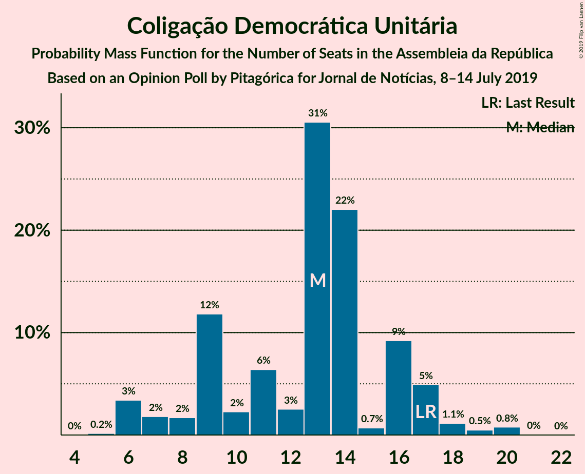
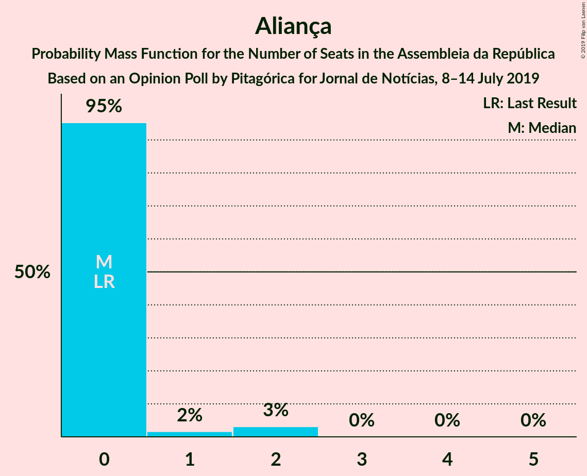
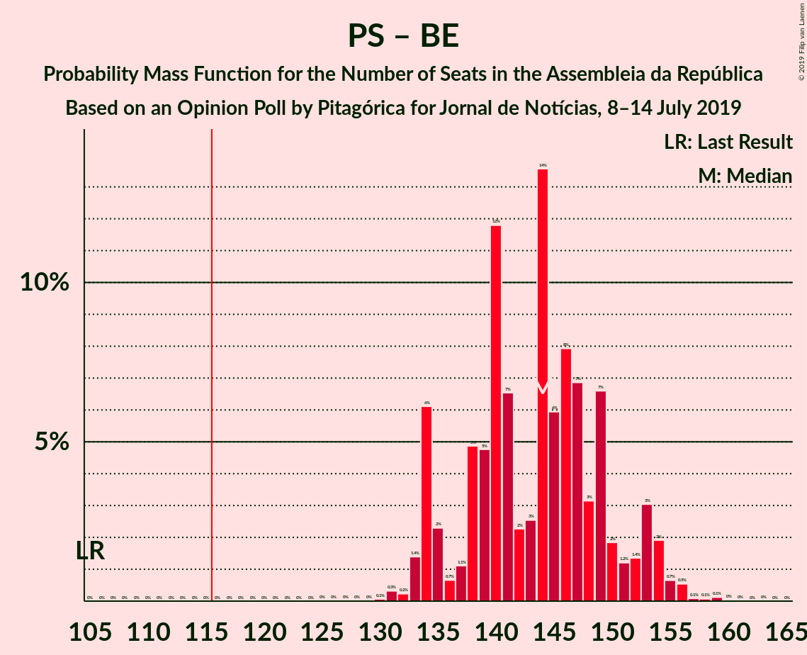
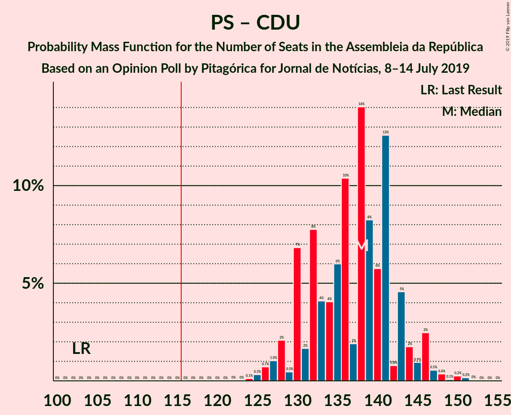
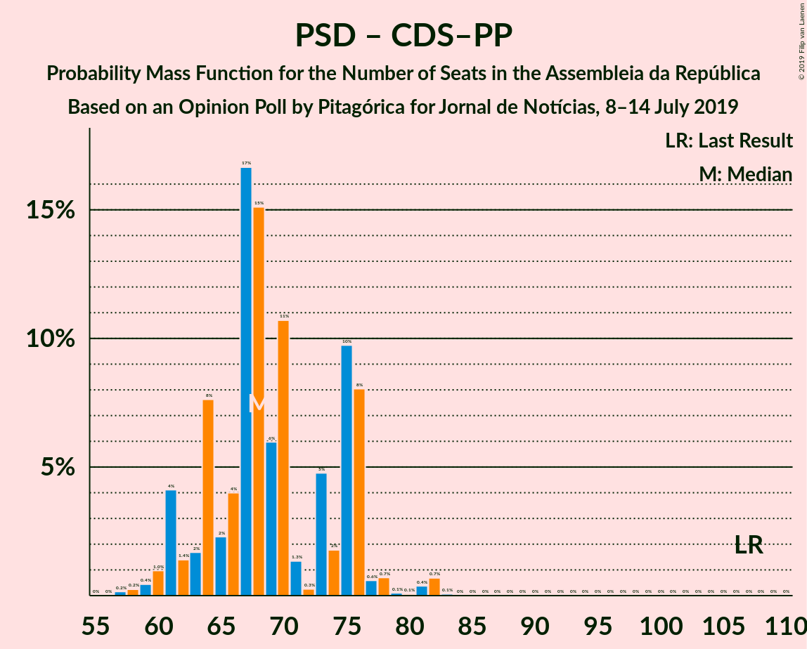

# Opinion Poll by Pitagórica for Jornal de Notícias, 8–14 July 2019

<a href="#voting-intentions">Voting Intentions</a> | <a href="#seats">Seats</a> | <a href="#coalitions">Coalitions</a> | <a href="#technical-information">Technical Information</a>

## Voting Intentions

### Confidence Intervals

| Party | Last Result | Poll Result | 80% Confidence Interval | 90% Confidence Interval | 95% Confidence Interval | 99% Confidence Interval |
|:-----:|:-----------:|:-----------:|:-----------------------:|:-----------------------:|:-----------------------:|:-----------------------:|
| Partido Socialista | 32.3% | 43.2% | 41.0–45.5% |40.4–46.2% |39.9–46.7% |38.8–47.8% |
| Partido Social Democrata | 36.9% | 21.6% | 19.8–23.6% |19.3–24.1% |18.9–24.6% |18.1–25.6% |
| Bloco de Esquerda | 10.2% | 9.2% | 8.0–10.7% |7.7–11.1% |7.4–11.5% |6.9–12.2% |
| Coligação Democrática Unitária | 8.2% | 6.8% | 5.7–8.0% |5.4–8.4% |5.2–8.7% |4.8–9.4% |
| CDS–Partido Popular | 36.9% | 6.0% | 5.0–7.2% |4.8–7.6% |4.6–7.9% |4.1–8.5% |
| Pessoas–Animais–Natureza | 1.4% | 3.6% | 2.9–4.6% |2.7–4.9% |2.5–5.2% |2.2–5.7% |
| Aliança | 0.0% | 1.2% | 0.9–1.9% |0.8–2.1% |0.7–2.3% |0.5–2.7% |

*Note:* The poll result column reflects the actual value used in the calculations. Published results may vary slightly, and in addition be rounded to fewer digits.

## Seats

### Confidence Intervals

| Party | Last Result | Median | 80% Confidence Interval | 90% Confidence Interval | 95% Confidence Interval | 99% Confidence Interval |
|:-----:|:-----------:|:------:|:-----------------------:|:-----------------------:|:-----------------------:|:-----------------------:|
| <a href="#partido-socialista">Partido Socialista</a> | 86 | 126 | 119–133 |117–135 |115–136 |112–139 |
| <a href="#partido-social-democrata">Partido Social Democrata</a> | 89 | 58 | 53–64 |53–67 |51–69 |50–71 |
| <a href="#bloco-de-esquerda">Bloco de Esquerda</a> | 19 | 19 | 16–23 |16–24 |15–24 |11–26 |
| <a href="#coligação-democrática-unitária">Coligação Democrática Unitária</a> | 17 | 13 | 8–16 |7–17 |6–18 |6–19 |
| <a href="#cds–partido-popular">CDS–Partido Popular</a> | 18 | 9 | 7–12 |6–13 |6–15 |6–18 |
| <a href="#pessoas–animais–natureza">Pessoas–Animais–Natureza</a> | 1 | 4 | 3–6 |3–6 |2–6 |2–8 |
| <a href="#aliança">Aliança</a> | 0 | 0 | 0 |0–1 |0–2 |0–2 |

### Partido Socialista

*For a full overview of the results for this party, see the [Partido Socialista](party-partidosocialista.html) page.*

| Number of Seats | Probability | Accumulated | Special Marks |
|:---------------:|:-----------:|:-----------:|:-------------:|
| 86 | 0% | 100% | Last Result |
| 87 | 0% | 100% |  |
| 88 | 0% | 100% |  |
| 89 | 0% | 100% |  |
| 90 | 0% | 100% |  |
| 91 | 0% | 100% |  |
| 92 | 0% | 100% |  |
| 93 | 0% | 100% |  |
| 94 | 0% | 100% |  |
| 95 | 0% | 100% |  |
| 96 | 0% | 100% |  |
| 97 | 0% | 100% |  |
| 98 | 0% | 100% |  |
| 99 | 0% | 100% |  |
| 100 | 0% | 100% |  |
| 101 | 0% | 100% |  |
| 102 | 0% | 100% |  |
| 103 | 0% | 100% |  |
| 104 | 0% | 100% |  |
| 105 | 0% | 100% |  |
| 106 | 0% | 100% |  |
| 107 | 0% | 100% |  |
| 108 | 0% | 100% |  |
| 109 | 0% | 100% |  |
| 110 | 0.1% | 99.9% |  |
| 111 | 0.1% | 99.8% |  |
| 112 | 0.3% | 99.7% |  |
| 113 | 0.4% | 99.4% |  |
| 114 | 0.8% | 99.1% |  |
| 115 | 1.3% | 98% |  |
| 116 | 1.4% | 97% | Majority |
| 117 | 2% | 96% |  |
| 118 | 2% | 93% |  |
| 119 | 3% | 91% |  |
| 120 | 4% | 88% |  |
| 121 | 3% | 84% |  |
| 122 | 5% | 80% |  |
| 123 | 6% | 76% |  |
| 124 | 5% | 70% |  |
| 125 | 9% | 65% |  |
| 126 | 8% | 56% | Median |
| 127 | 6% | 47% |  |
| 128 | 8% | 41% |  |
| 129 | 8% | 33% |  |
| 130 | 6% | 25% |  |
| 131 | 4% | 19% |  |
| 132 | 5% | 15% |  |
| 133 | 3% | 10% |  |
| 134 | 2% | 7% |  |
| 135 | 2% | 5% |  |
| 136 | 1.3% | 3% |  |
| 137 | 1.0% | 2% |  |
| 138 | 0.4% | 1.0% |  |
| 139 | 0.2% | 0.6% |  |
| 140 | 0.2% | 0.4% |  |
| 141 | 0.1% | 0.1% |  |
| 142 | 0.1% | 0.1% |  |
| 143 | 0% | 0% |  |

### Partido Social Democrata

*For a full overview of the results for this party, see the [Partido Social Democrata](party-partidosocialdemocrata.html) page.*

| Number of Seats | Probability | Accumulated | Special Marks |
|:---------------:|:-----------:|:-----------:|:-------------:|
| 47 | 0% | 100% |  |
| 48 | 0.1% | 99.9% |  |
| 49 | 0.2% | 99.8% |  |
| 50 | 0.6% | 99.7% |  |
| 51 | 2% | 99.0% |  |
| 52 | 2% | 97% |  |
| 53 | 6% | 95% |  |
| 54 | 10% | 89% |  |
| 55 | 5% | 79% |  |
| 56 | 5% | 74% |  |
| 57 | 9% | 69% |  |
| 58 | 10% | 60% | Median |
| 59 | 15% | 49% |  |
| 60 | 7% | 34% |  |
| 61 | 5% | 27% |  |
| 62 | 5% | 23% |  |
| 63 | 4% | 18% |  |
| 64 | 4% | 14% |  |
| 65 | 2% | 10% |  |
| 66 | 2% | 8% |  |
| 67 | 2% | 6% |  |
| 68 | 1.0% | 4% |  |
| 69 | 1.2% | 3% |  |
| 70 | 0.7% | 1.5% |  |
| 71 | 0.3% | 0.8% |  |
| 72 | 0.2% | 0.5% |  |
| 73 | 0.2% | 0.3% |  |
| 74 | 0.1% | 0.2% |  |
| 75 | 0.1% | 0.1% |  |
| 76 | 0% | 0% |  |
| 77 | 0% | 0% |  |
| 78 | 0% | 0% |  |
| 79 | 0% | 0% |  |
| 80 | 0% | 0% |  |
| 81 | 0% | 0% |  |
| 82 | 0% | 0% |  |
| 83 | 0% | 0% |  |
| 84 | 0% | 0% |  |
| 85 | 0% | 0% |  |
| 86 | 0% | 0% |  |
| 87 | 0% | 0% |  |
| 88 | 0% | 0% |  |
| 89 | 0% | 0% | Last Result |

### Bloco de Esquerda

*For a full overview of the results for this party, see the [Bloco de Esquerda](party-blocodeesquerda.html) page.*

| Number of Seats | Probability | Accumulated | Special Marks |
|:---------------:|:-----------:|:-----------:|:-------------:|
| 10 | 0.4% | 100% |  |
| 11 | 0.3% | 99.6% |  |
| 12 | 0.2% | 99.4% |  |
| 13 | 0.5% | 99.2% |  |
| 14 | 0.8% | 98.7% |  |
| 15 | 2% | 98% |  |
| 16 | 7% | 96% |  |
| 17 | 18% | 89% |  |
| 18 | 21% | 71% |  |
| 19 | 10% | 50% | Last Result, Median |
| 20 | 18% | 40% |  |
| 21 | 7% | 22% |  |
| 22 | 4% | 15% |  |
| 23 | 4% | 12% |  |
| 24 | 6% | 8% |  |
| 25 | 1.3% | 2% |  |
| 26 | 0.3% | 0.7% |  |
| 27 | 0.2% | 0.4% |  |
| 28 | 0.2% | 0.2% |  |
| 29 | 0% | 0% |  |

### Coligação Democrática Unitária

*For a full overview of the results for this party, see the [Coligação Democrática Unitária](party-coligaçãodemocráticaunitária.html) page.*

| Number of Seats | Probability | Accumulated | Special Marks |
|:---------------:|:-----------:|:-----------:|:-------------:|
| 5 | 0.3% | 100% |  |
| 6 | 4% | 99.7% |  |
| 7 | 3% | 96% |  |
| 8 | 5% | 93% |  |
| 9 | 11% | 87% |  |
| 10 | 4% | 76% |  |
| 11 | 4% | 72% |  |
| 12 | 5% | 68% |  |
| 13 | 22% | 63% | Median |
| 14 | 25% | 41% |  |
| 15 | 4% | 16% |  |
| 16 | 2% | 12% |  |
| 17 | 6% | 10% | Last Result |
| 18 | 2% | 4% |  |
| 19 | 1.2% | 2% |  |
| 20 | 0.3% | 0.4% |  |
| 21 | 0% | 0.1% |  |
| 22 | 0% | 0% |  |

### CDS–Partido Popular

*For a full overview of the results for this party, see the [CDS–Partido Popular](party-cds–partidopopular.html) page.*

| Number of Seats | Probability | Accumulated | Special Marks |
|:---------------:|:-----------:|:-----------:|:-------------:|
| 4 | 0.3% | 100% |  |
| 5 | 0.2% | 99.7% |  |
| 6 | 9% | 99.5% |  |
| 7 | 8% | 90% |  |
| 8 | 28% | 82% |  |
| 9 | 9% | 54% | Median |
| 10 | 19% | 45% |  |
| 11 | 10% | 26% |  |
| 12 | 8% | 16% |  |
| 13 | 3% | 8% |  |
| 14 | 1.4% | 5% |  |
| 15 | 1.3% | 3% |  |
| 16 | 0.7% | 2% |  |
| 17 | 0.5% | 1.2% |  |
| 18 | 0.3% | 0.7% | Last Result |
| 19 | 0.4% | 0.4% |  |
| 20 | 0% | 0% |  |

### Pessoas–Animais–Natureza

*For a full overview of the results for this party, see the [Pessoas–Animais–Natureza](party-pessoas–animais–natureza.html) page.*

| Number of Seats | Probability | Accumulated | Special Marks |
|:---------------:|:-----------:|:-----------:|:-------------:|
| 1 | 0.1% | 100% | Last Result |
| 2 | 4% | 99.9% |  |
| 3 | 16% | 96% |  |
| 4 | 39% | 79% | Median |
| 5 | 6% | 41% |  |
| 6 | 32% | 34% |  |
| 7 | 1.2% | 2% |  |
| 8 | 0.7% | 1.1% |  |
| 9 | 0.3% | 0.3% |  |
| 10 | 0% | 0.1% |  |
| 11 | 0% | 0% |  |

### Aliança

*For a full overview of the results for this party, see the [Aliança](party-aliança.html) page.*

| Number of Seats | Probability | Accumulated | Special Marks |
|:---------------:|:-----------:|:-----------:|:-------------:|
| 0 | 94% | 100% | Last Result, Median |
| 1 | 1.1% | 6% |  |
| 2 | 5% | 5% |  |
| 3 | 0% | 0% |  |

## Coalitions

### Confidence Intervals

| Coalition | Last Result | Median | Majority? | 80% Confidence Interval | 90% Confidence Interval | 95% Confidence Interval | 99% Confidence Interval |
|:---------:|:-----------:|:------:|:---------:|:-----------------------:|:-----------------------:|:-----------------------:|:-----------------------:|
| Partido Socialista – Bloco de Esquerda – Coligação Democrática Unitária | 122 | 158 | 100% | 151–163 | 149–165 | 147–166 | 143–167 |
| Partido Socialista – Bloco de Esquerda | 105 | 145 | 100% | 138–152 | 136–153 | 134–155 | 131–158 |
| Partido Socialista – Coligação Democrática Unitária | 103 | 139 | 100% | 132–144 | 129–146 | 127–147 | 124–149 |
| Partido Socialista | 86 | 126 | 97% | 119–133 | 117–135 | 115–136 | 112–139 |
| Partido Social Democrata – CDS–Partido Popular | 107 | 67 | 0% | 62–74 | 61–77 | 60–78 | 58–82 |

### Partido Socialista – Bloco de Esquerda – Coligação Democrática Unitária

| Number of Seats | Probability | Accumulated | Special Marks |
|:---------------:|:-----------:|:-----------:|:-------------:|
| 122 | 0% | 100% | Last Result |
| 123 | 0% | 100% |  |
| 124 | 0% | 100% |  |
| 125 | 0% | 100% |  |
| 126 | 0% | 100% |  |
| 127 | 0% | 100% |  |
| 128 | 0% | 100% |  |
| 129 | 0% | 100% |  |
| 130 | 0% | 100% |  |
| 131 | 0% | 100% |  |
| 132 | 0% | 100% |  |
| 133 | 0% | 100% |  |
| 134 | 0% | 100% |  |
| 135 | 0% | 100% |  |
| 136 | 0% | 100% |  |
| 137 | 0% | 100% |  |
| 138 | 0% | 100% |  |
| 139 | 0% | 100% |  |
| 140 | 0% | 100% |  |
| 141 | 0.1% | 99.9% |  |
| 142 | 0.1% | 99.8% |  |
| 143 | 0.2% | 99.7% |  |
| 144 | 0.4% | 99.5% |  |
| 145 | 0.5% | 99.1% |  |
| 146 | 0.7% | 98.6% |  |
| 147 | 0.9% | 98% |  |
| 148 | 2% | 97% |  |
| 149 | 2% | 95% |  |
| 150 | 2% | 93% |  |
| 151 | 2% | 91% |  |
| 152 | 4% | 89% |  |
| 153 | 5% | 85% |  |
| 154 | 4% | 81% |  |
| 155 | 7% | 77% |  |
| 156 | 9% | 70% |  |
| 157 | 10% | 61% |  |
| 158 | 7% | 51% | Median |
| 159 | 9% | 44% |  |
| 160 | 9% | 35% |  |
| 161 | 5% | 26% |  |
| 162 | 8% | 21% |  |
| 163 | 3% | 13% |  |
| 164 | 4% | 10% |  |
| 165 | 3% | 6% |  |
| 166 | 2% | 3% |  |
| 167 | 0.6% | 1.0% |  |
| 168 | 0.2% | 0.4% |  |
| 169 | 0.1% | 0.2% |  |
| 170 | 0.1% | 0.1% |  |
| 171 | 0% | 0% |  |

### Partido Socialista – Bloco de Esquerda

| Number of Seats | Probability | Accumulated | Special Marks |
|:---------------:|:-----------:|:-----------:|:-------------:|
| 105 | 0% | 100% | Last Result |
| 106 | 0% | 100% |  |
| 107 | 0% | 100% |  |
| 108 | 0% | 100% |  |
| 109 | 0% | 100% |  |
| 110 | 0% | 100% |  |
| 111 | 0% | 100% |  |
| 112 | 0% | 100% |  |
| 113 | 0% | 100% |  |
| 114 | 0% | 100% |  |
| 115 | 0% | 100% |  |
| 116 | 0% | 100% | Majority |
| 117 | 0% | 100% |  |
| 118 | 0% | 100% |  |
| 119 | 0% | 100% |  |
| 120 | 0% | 100% |  |
| 121 | 0% | 100% |  |
| 122 | 0% | 100% |  |
| 123 | 0% | 100% |  |
| 124 | 0% | 100% |  |
| 125 | 0% | 100% |  |
| 126 | 0% | 100% |  |
| 127 | 0% | 100% |  |
| 128 | 0.1% | 99.9% |  |
| 129 | 0.1% | 99.9% |  |
| 130 | 0.2% | 99.8% |  |
| 131 | 0.3% | 99.6% |  |
| 132 | 0.5% | 99.3% |  |
| 133 | 0.7% | 98.8% |  |
| 134 | 0.8% | 98% |  |
| 135 | 2% | 97% |  |
| 136 | 2% | 95% |  |
| 137 | 2% | 94% |  |
| 138 | 2% | 92% |  |
| 139 | 4% | 90% |  |
| 140 | 4% | 85% |  |
| 141 | 4% | 81% |  |
| 142 | 7% | 77% |  |
| 143 | 9% | 71% |  |
| 144 | 9% | 62% |  |
| 145 | 6% | 53% | Median |
| 146 | 8% | 47% |  |
| 147 | 7% | 39% |  |
| 148 | 6% | 32% |  |
| 149 | 6% | 26% |  |
| 150 | 5% | 20% |  |
| 151 | 3% | 15% |  |
| 152 | 3% | 12% |  |
| 153 | 4% | 9% |  |
| 154 | 2% | 5% |  |
| 155 | 0.8% | 3% |  |
| 156 | 0.7% | 2% |  |
| 157 | 0.5% | 1.1% |  |
| 158 | 0.3% | 0.6% |  |
| 159 | 0.2% | 0.3% |  |
| 160 | 0.1% | 0.1% |  |
| 161 | 0% | 0% |  |

### Partido Socialista – Coligação Democrática Unitária

| Number of Seats | Probability | Accumulated | Special Marks |
|:---------------:|:-----------:|:-----------:|:-------------:|
| 103 | 0% | 100% | Last Result |
| 104 | 0% | 100% |  |
| 105 | 0% | 100% |  |
| 106 | 0% | 100% |  |
| 107 | 0% | 100% |  |
| 108 | 0% | 100% |  |
| 109 | 0% | 100% |  |
| 110 | 0% | 100% |  |
| 111 | 0% | 100% |  |
| 112 | 0% | 100% |  |
| 113 | 0% | 100% |  |
| 114 | 0% | 100% |  |
| 115 | 0% | 100% |  |
| 116 | 0% | 100% | Majority |
| 117 | 0% | 100% |  |
| 118 | 0% | 100% |  |
| 119 | 0% | 100% |  |
| 120 | 0% | 100% |  |
| 121 | 0% | 100% |  |
| 122 | 0.1% | 99.9% |  |
| 123 | 0.2% | 99.9% |  |
| 124 | 0.2% | 99.7% |  |
| 125 | 0.4% | 99.4% |  |
| 126 | 0.8% | 99.0% |  |
| 127 | 0.8% | 98% |  |
| 128 | 0.8% | 97% |  |
| 129 | 2% | 97% |  |
| 130 | 2% | 95% |  |
| 131 | 2% | 93% |  |
| 132 | 3% | 91% |  |
| 133 | 4% | 88% |  |
| 134 | 4% | 84% |  |
| 135 | 5% | 80% |  |
| 136 | 6% | 74% |  |
| 137 | 7% | 68% |  |
| 138 | 6% | 61% |  |
| 139 | 11% | 55% | Median |
| 140 | 8% | 43% |  |
| 141 | 7% | 36% |  |
| 142 | 10% | 29% |  |
| 143 | 5% | 18% |  |
| 144 | 4% | 13% |  |
| 145 | 3% | 9% |  |
| 146 | 2% | 6% |  |
| 147 | 1.4% | 3% |  |
| 148 | 1.0% | 2% |  |
| 149 | 0.6% | 1.0% |  |
| 150 | 0.2% | 0.4% |  |
| 151 | 0.1% | 0.2% |  |
| 152 | 0.1% | 0.1% |  |
| 153 | 0% | 0.1% |  |
| 154 | 0% | 0% |  |

### Partido Socialista

| Number of Seats | Probability | Accumulated | Special Marks |
|:---------------:|:-----------:|:-----------:|:-------------:|
| 86 | 0% | 100% | Last Result |
| 87 | 0% | 100% |  |
| 88 | 0% | 100% |  |
| 89 | 0% | 100% |  |
| 90 | 0% | 100% |  |
| 91 | 0% | 100% |  |
| 92 | 0% | 100% |  |
| 93 | 0% | 100% |  |
| 94 | 0% | 100% |  |
| 95 | 0% | 100% |  |
| 96 | 0% | 100% |  |
| 97 | 0% | 100% |  |
| 98 | 0% | 100% |  |
| 99 | 0% | 100% |  |
| 100 | 0% | 100% |  |
| 101 | 0% | 100% |  |
| 102 | 0% | 100% |  |
| 103 | 0% | 100% |  |
| 104 | 0% | 100% |  |
| 105 | 0% | 100% |  |
| 106 | 0% | 100% |  |
| 107 | 0% | 100% |  |
| 108 | 0% | 100% |  |
| 109 | 0% | 100% |  |
| 110 | 0.1% | 99.9% |  |
| 111 | 0.1% | 99.8% |  |
| 112 | 0.3% | 99.7% |  |
| 113 | 0.4% | 99.4% |  |
| 114 | 0.8% | 99.1% |  |
| 115 | 1.3% | 98% |  |
| 116 | 1.4% | 97% | Majority |
| 117 | 2% | 96% |  |
| 118 | 2% | 93% |  |
| 119 | 3% | 91% |  |
| 120 | 4% | 88% |  |
| 121 | 3% | 84% |  |
| 122 | 5% | 80% |  |
| 123 | 6% | 76% |  |
| 124 | 5% | 70% |  |
| 125 | 9% | 65% |  |
| 126 | 8% | 56% | Median |
| 127 | 6% | 47% |  |
| 128 | 8% | 41% |  |
| 129 | 8% | 33% |  |
| 130 | 6% | 25% |  |
| 131 | 4% | 19% |  |
| 132 | 5% | 15% |  |
| 133 | 3% | 10% |  |
| 134 | 2% | 7% |  |
| 135 | 2% | 5% |  |
| 136 | 1.3% | 3% |  |
| 137 | 1.0% | 2% |  |
| 138 | 0.4% | 1.0% |  |
| 139 | 0.2% | 0.6% |  |
| 140 | 0.2% | 0.4% |  |
| 141 | 0.1% | 0.1% |  |
| 142 | 0.1% | 0.1% |  |
| 143 | 0% | 0% |  |

### Partido Social Democrata – CDS–Partido Popular

| Number of Seats | Probability | Accumulated | Special Marks |
|:---------------:|:-----------:|:-----------:|:-------------:|
| 56 | 0.1% | 100% |  |
| 57 | 0.1% | 99.9% |  |
| 58 | 0.4% | 99.8% |  |
| 59 | 0.6% | 99.4% |  |
| 60 | 2% | 98.8% |  |
| 61 | 4% | 97% |  |
| 62 | 5% | 93% |  |
| 63 | 4% | 88% |  |
| 64 | 8% | 84% |  |
| 65 | 7% | 76% |  |
| 66 | 9% | 69% |  |
| 67 | 12% | 60% | Median |
| 68 | 7% | 48% |  |
| 69 | 9% | 41% |  |
| 70 | 7% | 32% |  |
| 71 | 6% | 26% |  |
| 72 | 3% | 20% |  |
| 73 | 4% | 16% |  |
| 74 | 3% | 12% |  |
| 75 | 2% | 10% |  |
| 76 | 3% | 8% |  |
| 77 | 2% | 5% |  |
| 78 | 1.1% | 3% |  |
| 79 | 0.8% | 2% |  |
| 80 | 0.3% | 1.4% |  |
| 81 | 0.4% | 1.0% |  |
| 82 | 0.2% | 0.6% |  |
| 83 | 0.2% | 0.3% |  |
| 84 | 0.1% | 0.2% |  |
| 85 | 0.1% | 0.1% |  |
| 86 | 0% | 0% |  |
| 87 | 0% | 0% |  |
| 88 | 0% | 0% |  |
| 89 | 0% | 0% |  |
| 90 | 0% | 0% |  |
| 91 | 0% | 0% |  |
| 92 | 0% | 0% |  |
| 93 | 0% | 0% |  |
| 94 | 0% | 0% |  |
| 95 | 0% | 0% |  |
| 96 | 0% | 0% |  |
| 97 | 0% | 0% |  |
| 98 | 0% | 0% |  |
| 99 | 0% | 0% |  |
| 100 | 0% | 0% |  |
| 101 | 0% | 0% |  |
| 102 | 0% | 0% |  |
| 103 | 0% | 0% |  |
| 104 | 0% | 0% |  |
| 105 | 0% | 0% |  |
| 106 | 0% | 0% |  |
| 107 | 0% | 0% | Last Result |

## Technical Information

### Opinion Poll

+ **Polling firm:** Pitagórica
+ **Commissioner(s):** Jornal de Notícias
+ **Fieldwork period:** 8–14 July 2019

### Calculations

+ **Sample size:** 800
+ **Simulations done:** 1,048,576
+ **Error estimate:** 0.67%

