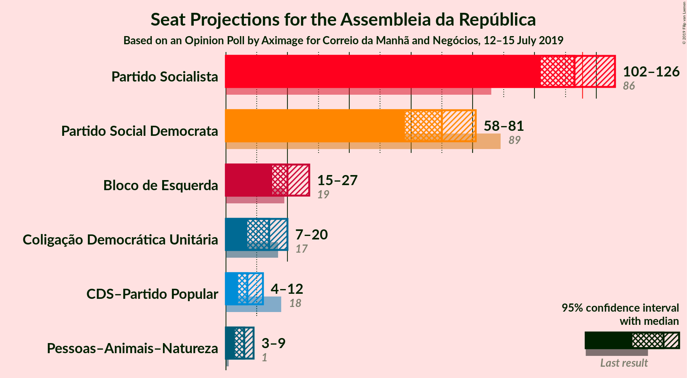
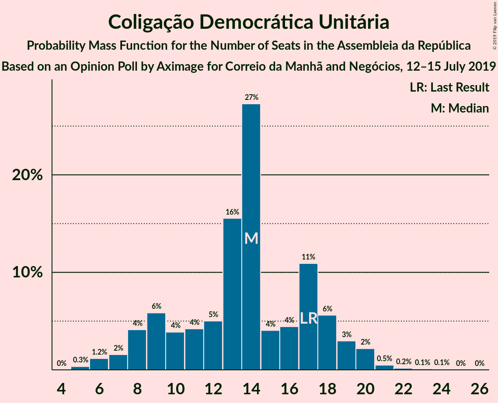

# Opinion Poll by Aximage for Correio da Manhã and Negócios, 12–15 July 2019

<a href="#voting-intentions">Voting Intentions</a> | <a href="#seats">Seats</a> | <a href="#coalitions">Coalitions</a> | <a href="#technical-information">Technical Information</a>

## Voting Intentions

### Confidence Intervals

| Party | Last Result | Poll Result | 80% Confidence Interval | 90% Confidence Interval | 95% Confidence Interval | 99% Confidence Interval |
|:-----:|:-----------:|:-----------:|:-----------------------:|:-----------------------:|:-----------------------:|:-----------------------:|
| Partido Socialista | 32.3% | 37.4% | 34.9–40.0% |34.3–40.8% |33.7–41.4% |32.5–42.6% |
| Partido Social Democrata | 36.9% | 23.6% | 21.5–26.0% |20.9–26.6% |20.4–27.2% |19.4–28.3% |
| Bloco de Esquerda | 10.2% | 9.3% | 8.0–11.0% |7.6–11.5% |7.2–11.9% |6.6–12.8% |
| Coligação Democrática Unitária | 8.2% | 6.8% | 5.7–8.3% |5.3–8.7% |5.1–9.1% |4.6–9.9% |
| CDS–Partido Popular | 36.9% | 4.8% | 3.9–6.1% |3.6–6.5% |3.4–6.9% |3.0–7.5% |
| Pessoas–Animais–Natureza | 1.4% | 4.0% | 3.1–5.2% |2.9–5.6% |2.7–5.9% |2.3–6.5% |

*Note:* The poll result column reflects the actual value used in the calculations. Published results may vary slightly, and in addition be rounded to fewer digits.

## Seats

### Confidence Intervals

| Party | Last Result | Median | 80% Confidence Interval | 90% Confidence Interval | 95% Confidence Interval | 99% Confidence Interval |
|:-----:|:-----------:|:------:|:-----------------------:|:-----------------------:|:-----------------------:|:-----------------------:|
| <a href="#partido-socialista">Partido Socialista</a> | 86 | 112 | 104–123 |103–126 |101–128 |98–130 |
| <a href="#partido-social-democrata">Partido Social Democrata</a> | 89 | 70 | 61–76 |59–79 |59–81 |56–85 |
| <a href="#bloco-de-esquerda">Bloco de Esquerda</a> | 19 | 20 | 17–25 |15–27 |14–28 |11–29 |
| <a href="#coligação-democrática-unitária">Coligação Democrática Unitária</a> | 17 | 14 | 9–18 |7–19 |7–20 |5–21 |
| <a href="#cds–partido-popular">CDS–Partido Popular</a> | 18 | 7 | 5–10 |4–11 |4–12 |2–16 |
| <a href="#pessoas–animais–natureza">Pessoas–Animais–Natureza</a> | 1 | 6 | 4–8 |3–9 |3–9 |2–13 |

### Partido Socialista

*For a full overview of the results for this party, see the [Partido Socialista](party-partidosocialista.html) page.*

| Number of Seats | Probability | Accumulated | Special Marks |
|:---------------:|:-----------:|:-----------:|:-------------:|
| 86 | 0% | 100% | Last Result |
| 87 | 0% | 100% |  |
| 88 | 0% | 100% |  |
| 89 | 0% | 100% |  |
| 90 | 0% | 100% |  |
| 91 | 0% | 100% |  |
| 92 | 0% | 100% |  |
| 93 | 0% | 100% |  |
| 94 | 0% | 100% |  |
| 95 | 0% | 99.9% |  |
| 96 | 0% | 99.9% |  |
| 97 | 0% | 99.9% |  |
| 98 | 0.3% | 99.8% |  |
| 99 | 0.8% | 99.5% |  |
| 100 | 0.5% | 98.7% |  |
| 101 | 1.1% | 98% |  |
| 102 | 0.4% | 97% |  |
| 103 | 4% | 97% |  |
| 104 | 3% | 93% |  |
| 105 | 7% | 90% |  |
| 106 | 7% | 82% |  |
| 107 | 5% | 75% |  |
| 108 | 4% | 70% |  |
| 109 | 2% | 66% |  |
| 110 | 3% | 65% |  |
| 111 | 4% | 62% |  |
| 112 | 13% | 57% | Median |
| 113 | 6% | 44% |  |
| 114 | 2% | 39% |  |
| 115 | 4% | 37% |  |
| 116 | 10% | 33% | Majority |
| 117 | 3% | 23% |  |
| 118 | 2% | 20% |  |
| 119 | 2% | 18% |  |
| 120 | 1.4% | 16% |  |
| 121 | 1.4% | 15% |  |
| 122 | 3% | 14% |  |
| 123 | 2% | 11% |  |
| 124 | 2% | 9% |  |
| 125 | 2% | 7% |  |
| 126 | 0.4% | 5% |  |
| 127 | 2% | 5% |  |
| 128 | 1.0% | 3% |  |
| 129 | 0.9% | 2% |  |
| 130 | 0.6% | 0.9% |  |
| 131 | 0.2% | 0.3% |  |
| 132 | 0% | 0.2% |  |
| 133 | 0.1% | 0.1% |  |
| 134 | 0% | 0% |  |

### Partido Social Democrata

*For a full overview of the results for this party, see the [Partido Social Democrata](party-partidosocialdemocrata.html) page.*

| Number of Seats | Probability | Accumulated | Special Marks |
|:---------------:|:-----------:|:-----------:|:-------------:|
| 53 | 0.1% | 100% |  |
| 54 | 0.1% | 99.9% |  |
| 55 | 0.2% | 99.8% |  |
| 56 | 0.4% | 99.6% |  |
| 57 | 1.1% | 99.2% |  |
| 58 | 0.6% | 98% |  |
| 59 | 5% | 98% |  |
| 60 | 2% | 93% |  |
| 61 | 3% | 91% |  |
| 62 | 3% | 88% |  |
| 63 | 2% | 85% |  |
| 64 | 5% | 83% |  |
| 65 | 2% | 78% |  |
| 66 | 4% | 76% |  |
| 67 | 8% | 72% |  |
| 68 | 7% | 64% |  |
| 69 | 4% | 57% |  |
| 70 | 6% | 53% | Median |
| 71 | 6% | 46% |  |
| 72 | 9% | 41% |  |
| 73 | 3% | 32% |  |
| 74 | 7% | 29% |  |
| 75 | 4% | 22% |  |
| 76 | 8% | 18% |  |
| 77 | 2% | 10% |  |
| 78 | 2% | 8% |  |
| 79 | 2% | 6% |  |
| 80 | 0.8% | 4% |  |
| 81 | 0.6% | 3% |  |
| 82 | 0.7% | 2% |  |
| 83 | 0.6% | 1.4% |  |
| 84 | 0.3% | 0.8% |  |
| 85 | 0.2% | 0.5% |  |
| 86 | 0.1% | 0.3% |  |
| 87 | 0.1% | 0.3% |  |
| 88 | 0.1% | 0.2% |  |
| 89 | 0% | 0.1% | Last Result |
| 90 | 0% | 0% |  |

### Bloco de Esquerda

*For a full overview of the results for this party, see the [Bloco de Esquerda](party-blocodeesquerda.html) page.*

| Number of Seats | Probability | Accumulated | Special Marks |
|:---------------:|:-----------:|:-----------:|:-------------:|
| 10 | 0.2% | 100% |  |
| 11 | 0.3% | 99.7% |  |
| 12 | 0.1% | 99.4% |  |
| 13 | 0.7% | 99.3% |  |
| 14 | 1.5% | 98.7% |  |
| 15 | 2% | 97% |  |
| 16 | 2% | 95% |  |
| 17 | 7% | 93% |  |
| 18 | 17% | 87% |  |
| 19 | 9% | 70% | Last Result |
| 20 | 12% | 60% | Median |
| 21 | 8% | 49% |  |
| 22 | 6% | 41% |  |
| 23 | 5% | 35% |  |
| 24 | 16% | 30% |  |
| 25 | 7% | 14% |  |
| 26 | 2% | 7% |  |
| 27 | 2% | 5% |  |
| 28 | 3% | 3% |  |
| 29 | 0.5% | 0.7% |  |
| 30 | 0% | 0.2% |  |
| 31 | 0% | 0.1% |  |
| 32 | 0% | 0.1% |  |
| 33 | 0% | 0.1% |  |
| 34 | 0% | 0.1% |  |
| 35 | 0% | 0% |  |

### Coligação Democrática Unitária

*For a full overview of the results for this party, see the [Coligação Democrática Unitária](party-coligaçãodemocráticaunitária.html) page.*

| Number of Seats | Probability | Accumulated | Special Marks |
|:---------------:|:-----------:|:-----------:|:-------------:|
| 5 | 0.5% | 100% |  |
| 6 | 2% | 99.4% |  |
| 7 | 3% | 98% |  |
| 8 | 4% | 95% |  |
| 9 | 5% | 91% |  |
| 10 | 5% | 86% |  |
| 11 | 2% | 81% |  |
| 12 | 0.9% | 79% |  |
| 13 | 15% | 78% |  |
| 14 | 24% | 64% | Median |
| 15 | 3% | 40% |  |
| 16 | 2% | 37% |  |
| 17 | 21% | 36% | Last Result |
| 18 | 8% | 14% |  |
| 19 | 4% | 6% |  |
| 20 | 2% | 3% |  |
| 21 | 0.3% | 0.7% |  |
| 22 | 0.3% | 0.4% |  |
| 23 | 0.1% | 0.1% |  |
| 24 | 0.1% | 0.1% |  |
| 25 | 0% | 0% |  |

### CDS–Partido Popular

*For a full overview of the results for this party, see the [CDS–Partido Popular](party-cds–partidopopular.html) page.*

| Number of Seats | Probability | Accumulated | Special Marks |
|:---------------:|:-----------:|:-----------:|:-------------:|
| 2 | 1.2% | 100% |  |
| 3 | 0.9% | 98.8% |  |
| 4 | 7% | 98% |  |
| 5 | 3% | 91% |  |
| 6 | 28% | 88% |  |
| 7 | 17% | 60% | Median |
| 8 | 21% | 43% |  |
| 9 | 8% | 21% |  |
| 10 | 6% | 13% |  |
| 11 | 3% | 6% |  |
| 12 | 1.4% | 3% |  |
| 13 | 0.9% | 2% |  |
| 14 | 0.3% | 0.9% |  |
| 15 | 0.1% | 0.7% |  |
| 16 | 0.2% | 0.6% |  |
| 17 | 0.2% | 0.3% |  |
| 18 | 0.1% | 0.1% | Last Result |
| 19 | 0% | 0.1% |  |
| 20 | 0% | 0% |  |

### Pessoas–Animais–Natureza

*For a full overview of the results for this party, see the [Pessoas–Animais–Natureza](party-pessoas–animais–natureza.html) page.*

| Number of Seats | Probability | Accumulated | Special Marks |
|:---------------:|:-----------:|:-----------:|:-------------:|
| 1 | 0% | 100% | Last Result |
| 2 | 1.1% | 100% |  |
| 3 | 8% | 98.9% |  |
| 4 | 21% | 91% |  |
| 5 | 3% | 69% |  |
| 6 | 51% | 66% | Median |
| 7 | 3% | 15% |  |
| 8 | 6% | 11% |  |
| 9 | 4% | 6% |  |
| 10 | 0.9% | 2% |  |
| 11 | 0.4% | 1.1% |  |
| 12 | 0.1% | 0.7% |  |
| 13 | 0.4% | 0.7% |  |
| 14 | 0.2% | 0.3% |  |
| 15 | 0% | 0.1% |  |
| 16 | 0% | 0% |  |

## Coalitions

### Confidence Intervals

| Coalition | Last Result | Median | Majority? | 80% Confidence Interval | 90% Confidence Interval | 95% Confidence Interval | 99% Confidence Interval |
|:---------:|:-----------:|:------:|:---------:|:-----------------------:|:-----------------------:|:-----------------------:|:-----------------------:|
| Partido Socialista – Bloco de Esquerda – Coligação Democrática Unitária | 122 | 148 | 100% | 140–155 | 138–157 | 136–159 | 132–162 |
| Partido Socialista – Bloco de Esquerda | 105 | 133 | 99.9% | 126–143 | 123–144 | 122–147 | 117–150 |
| Partido Socialista – Coligação Democrática Unitária | 103 | 127 | 96% | 119–136 | 118–137 | 114–138 | 112–142 |
| Partido Socialista | 86 | 112 | 33% | 104–123 | 103–126 | 101–128 | 98–130 |
| Partido Social Democrata – CDS–Partido Popular | 107 | 77 | 0% | 68–84 | 67–86 | 65–88 | 63–92 |

### Partido Socialista – Bloco de Esquerda – Coligação Democrática Unitária

| Number of Seats | Probability | Accumulated | Special Marks |
|:---------------:|:-----------:|:-----------:|:-------------:|
| 122 | 0% | 100% | Last Result |
| 123 | 0% | 100% |  |
| 124 | 0% | 100% |  |
| 125 | 0% | 100% |  |
| 126 | 0% | 100% |  |
| 127 | 0% | 100% |  |
| 128 | 0% | 100% |  |
| 129 | 0% | 99.9% |  |
| 130 | 0.2% | 99.9% |  |
| 131 | 0.2% | 99.7% |  |
| 132 | 0.1% | 99.5% |  |
| 133 | 0.2% | 99.4% |  |
| 134 | 0.6% | 99.1% |  |
| 135 | 0.4% | 98.6% |  |
| 136 | 1.1% | 98% |  |
| 137 | 1.2% | 97% |  |
| 138 | 2% | 96% |  |
| 139 | 1.5% | 94% |  |
| 140 | 5% | 93% |  |
| 141 | 4% | 88% |  |
| 142 | 6% | 84% |  |
| 143 | 4% | 77% |  |
| 144 | 7% | 73% |  |
| 145 | 9% | 66% |  |
| 146 | 4% | 57% | Median |
| 147 | 3% | 53% |  |
| 148 | 6% | 51% |  |
| 149 | 7% | 45% |  |
| 150 | 6% | 37% |  |
| 151 | 2% | 31% |  |
| 152 | 7% | 29% |  |
| 153 | 6% | 22% |  |
| 154 | 2% | 16% |  |
| 155 | 5% | 14% |  |
| 156 | 2% | 9% |  |
| 157 | 3% | 7% |  |
| 158 | 1.5% | 4% |  |
| 159 | 0.6% | 3% |  |
| 160 | 1.3% | 2% |  |
| 161 | 0.6% | 1.1% |  |
| 162 | 0.2% | 0.5% |  |
| 163 | 0.2% | 0.3% |  |
| 164 | 0% | 0.1% |  |
| 165 | 0% | 0.1% |  |
| 166 | 0% | 0% |  |

### Partido Socialista – Bloco de Esquerda

| Number of Seats | Probability | Accumulated | Special Marks |
|:---------------:|:-----------:|:-----------:|:-------------:|
| 105 | 0% | 100% | Last Result |
| 106 | 0% | 100% |  |
| 107 | 0% | 100% |  |
| 108 | 0% | 100% |  |
| 109 | 0% | 100% |  |
| 110 | 0% | 100% |  |
| 111 | 0% | 100% |  |
| 112 | 0% | 100% |  |
| 113 | 0% | 100% |  |
| 114 | 0% | 100% |  |
| 115 | 0% | 99.9% |  |
| 116 | 0.1% | 99.9% | Majority |
| 117 | 0.3% | 99.8% |  |
| 118 | 0.3% | 99.5% |  |
| 119 | 0.4% | 99.1% |  |
| 120 | 0.4% | 98.8% |  |
| 121 | 0.7% | 98% |  |
| 122 | 1.3% | 98% |  |
| 123 | 2% | 96% |  |
| 124 | 1.3% | 94% |  |
| 125 | 2% | 93% |  |
| 126 | 5% | 91% |  |
| 127 | 3% | 86% |  |
| 128 | 6% | 82% |  |
| 129 | 5% | 76% |  |
| 130 | 7% | 71% |  |
| 131 | 6% | 65% |  |
| 132 | 6% | 59% | Median |
| 133 | 6% | 53% |  |
| 134 | 5% | 47% |  |
| 135 | 7% | 42% |  |
| 136 | 7% | 35% |  |
| 137 | 1.5% | 28% |  |
| 138 | 7% | 26% |  |
| 139 | 2% | 19% |  |
| 140 | 3% | 18% |  |
| 141 | 2% | 15% |  |
| 142 | 3% | 13% |  |
| 143 | 4% | 10% |  |
| 144 | 2% | 6% |  |
| 145 | 1.1% | 5% |  |
| 146 | 0.7% | 4% |  |
| 147 | 0.8% | 3% |  |
| 148 | 0.9% | 2% |  |
| 149 | 0.6% | 1.2% |  |
| 150 | 0.2% | 0.7% |  |
| 151 | 0% | 0.4% |  |
| 152 | 0.1% | 0.4% |  |
| 153 | 0.2% | 0.3% |  |
| 154 | 0.1% | 0.2% |  |
| 155 | 0.1% | 0.1% |  |
| 156 | 0% | 0% |  |

### Partido Socialista – Coligação Democrática Unitária

| Number of Seats | Probability | Accumulated | Special Marks |
|:---------------:|:-----------:|:-----------:|:-------------:|
| 103 | 0% | 100% | Last Result |
| 104 | 0% | 100% |  |
| 105 | 0% | 100% |  |
| 106 | 0% | 100% |  |
| 107 | 0% | 100% |  |
| 108 | 0% | 100% |  |
| 109 | 0% | 100% |  |
| 110 | 0% | 99.9% |  |
| 111 | 0.3% | 99.9% |  |
| 112 | 0.6% | 99.6% |  |
| 113 | 1.4% | 99.1% |  |
| 114 | 1.1% | 98% |  |
| 115 | 0.1% | 97% |  |
| 116 | 0.5% | 96% | Majority |
| 117 | 0.3% | 96% |  |
| 118 | 3% | 96% |  |
| 119 | 4% | 93% |  |
| 120 | 10% | 88% |  |
| 121 | 9% | 79% |  |
| 122 | 5% | 70% |  |
| 123 | 2% | 65% |  |
| 124 | 3% | 63% |  |
| 125 | 3% | 59% |  |
| 126 | 6% | 56% | Median |
| 127 | 2% | 51% |  |
| 128 | 3% | 49% |  |
| 129 | 9% | 46% |  |
| 130 | 14% | 37% |  |
| 131 | 3% | 23% |  |
| 132 | 1.1% | 20% |  |
| 133 | 1.3% | 19% |  |
| 134 | 3% | 18% |  |
| 135 | 4% | 15% |  |
| 136 | 3% | 11% |  |
| 137 | 3% | 8% |  |
| 138 | 2% | 4% |  |
| 139 | 0.6% | 2% |  |
| 140 | 0.1% | 2% |  |
| 141 | 0.4% | 2% |  |
| 142 | 0.9% | 1.3% |  |
| 143 | 0.2% | 0.4% |  |
| 144 | 0.1% | 0.2% |  |
| 145 | 0% | 0.1% |  |
| 146 | 0% | 0% |  |

### Partido Socialista

| Number of Seats | Probability | Accumulated | Special Marks |
|:---------------:|:-----------:|:-----------:|:-------------:|
| 86 | 0% | 100% | Last Result |
| 87 | 0% | 100% |  |
| 88 | 0% | 100% |  |
| 89 | 0% | 100% |  |
| 90 | 0% | 100% |  |
| 91 | 0% | 100% |  |
| 92 | 0% | 100% |  |
| 93 | 0% | 100% |  |
| 94 | 0% | 100% |  |
| 95 | 0% | 99.9% |  |
| 96 | 0% | 99.9% |  |
| 97 | 0% | 99.9% |  |
| 98 | 0.3% | 99.8% |  |
| 99 | 0.8% | 99.5% |  |
| 100 | 0.5% | 98.7% |  |
| 101 | 1.1% | 98% |  |
| 102 | 0.4% | 97% |  |
| 103 | 4% | 97% |  |
| 104 | 3% | 93% |  |
| 105 | 7% | 90% |  |
| 106 | 7% | 82% |  |
| 107 | 5% | 75% |  |
| 108 | 4% | 70% |  |
| 109 | 2% | 66% |  |
| 110 | 3% | 65% |  |
| 111 | 4% | 62% |  |
| 112 | 13% | 57% | Median |
| 113 | 6% | 44% |  |
| 114 | 2% | 39% |  |
| 115 | 4% | 37% |  |
| 116 | 10% | 33% | Majority |
| 117 | 3% | 23% |  |
| 118 | 2% | 20% |  |
| 119 | 2% | 18% |  |
| 120 | 1.4% | 16% |  |
| 121 | 1.4% | 15% |  |
| 122 | 3% | 14% |  |
| 123 | 2% | 11% |  |
| 124 | 2% | 9% |  |
| 125 | 2% | 7% |  |
| 126 | 0.4% | 5% |  |
| 127 | 2% | 5% |  |
| 128 | 1.0% | 3% |  |
| 129 | 0.9% | 2% |  |
| 130 | 0.6% | 0.9% |  |
| 131 | 0.2% | 0.3% |  |
| 132 | 0% | 0.2% |  |
| 133 | 0.1% | 0.1% |  |
| 134 | 0% | 0% |  |

### Partido Social Democrata – CDS–Partido Popular

| Number of Seats | Probability | Accumulated | Special Marks |
|:---------------:|:-----------:|:-----------:|:-------------:|
| 59 | 0% | 100% |  |
| 60 | 0.1% | 99.9% |  |
| 61 | 0.1% | 99.9% |  |
| 62 | 0.2% | 99.7% |  |
| 63 | 0.5% | 99.5% |  |
| 64 | 0.3% | 99.1% |  |
| 65 | 1.4% | 98.8% |  |
| 66 | 2% | 97% |  |
| 67 | 3% | 95% |  |
| 68 | 2% | 92% |  |
| 69 | 4% | 90% |  |
| 70 | 2% | 86% |  |
| 71 | 5% | 84% |  |
| 72 | 3% | 79% |  |
| 73 | 4% | 76% |  |
| 74 | 6% | 73% |  |
| 75 | 9% | 67% |  |
| 76 | 8% | 58% |  |
| 77 | 2% | 50% | Median |
| 78 | 3% | 48% |  |
| 79 | 9% | 45% |  |
| 80 | 8% | 36% |  |
| 81 | 3% | 28% |  |
| 82 | 8% | 25% |  |
| 83 | 4% | 17% |  |
| 84 | 5% | 13% |  |
| 85 | 3% | 8% |  |
| 86 | 1.1% | 5% |  |
| 87 | 1.1% | 4% |  |
| 88 | 1.1% | 3% |  |
| 89 | 0.6% | 2% |  |
| 90 | 0.4% | 1.5% |  |
| 91 | 0.4% | 1.1% |  |
| 92 | 0.3% | 0.7% |  |
| 93 | 0.1% | 0.4% |  |
| 94 | 0.2% | 0.3% |  |
| 95 | 0% | 0.1% |  |
| 96 | 0% | 0.1% |  |
| 97 | 0% | 0% |  |
| 98 | 0% | 0% |  |
| 99 | 0% | 0% |  |
| 100 | 0% | 0% |  |
| 101 | 0% | 0% |  |
| 102 | 0% | 0% |  |
| 103 | 0% | 0% |  |
| 104 | 0% | 0% |  |
| 105 | 0% | 0% |  |
| 106 | 0% | 0% |  |
| 107 | 0% | 0% | Last Result |

## Technical Information

### Opinion Poll

+ **Polling firm:** Aximage
+ **Commissioner(s):** Correio da Manhã and Negócios
+ **Fieldwork period:** 12–15 July 2019

### Calculations

+ **Sample size:** 601
+ **Simulations done:** 65,536
+ **Error estimate:** 2.91%

