# Opinion Poll by Multidados for TVI, 18–28 July 2019

<a href="#voting-intentions">Voting Intentions</a> | <a href="#seats">Seats</a> | <a href="#coalitions">Coalitions</a> | <a href="#technical-information">Technical Information</a>

## Voting Intentions

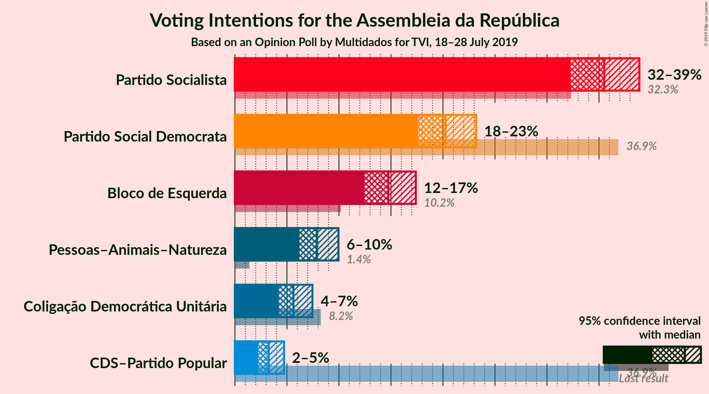

### Confidence Intervals

| Party | Last Result | Poll Result | 80% Confidence Interval | 90% Confidence Interval | 95% Confidence Interval | 99% Confidence Interval |
|:-----:|:-----------:|:-----------:|:-----------------------:|:-----------------------:|:-----------------------:|:-----------------------:|
| Partido Socialista | 32.3% | 35.5% | 33.4–37.7% |32.8–38.3% |32.3–38.9% |31.2–40.0% |
| Partido Social Democrata | 36.9% | 20.2% | 18.5–22.2% |18.0–22.7% |17.6–23.2% |16.8–24.1% |
| Bloco de Esquerda | 10.2% | 14.8% | 13.2–16.5% |12.8–17.0% |12.5–17.4% |11.8–18.2% |
| Pessoas–Animais–Natureza | 1.4% | 7.9% | 6.8–9.2% |6.5–9.6% |6.2–10.0% |5.7–10.6% |
| Coligação Democrática Unitária | 8.2% | 5.6% | 4.7–6.8% |4.5–7.1% |4.2–7.5% |3.8–8.1% |
| CDS–Partido Popular | 36.9% | 3.2% | 2.6–4.2% |2.4–4.5% |2.2–4.7% |1.9–5.2% |

*Note:* The poll result column reflects the actual value used in the calculations. Published results may vary slightly, and in addition be rounded to fewer digits.

## Seats

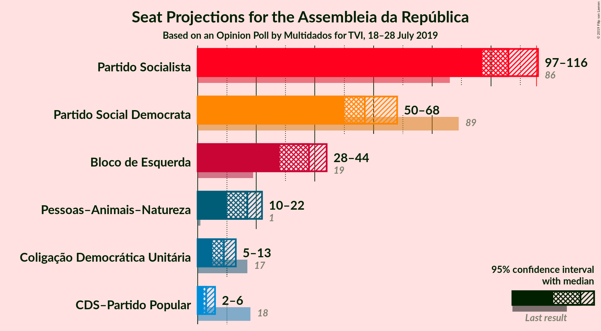

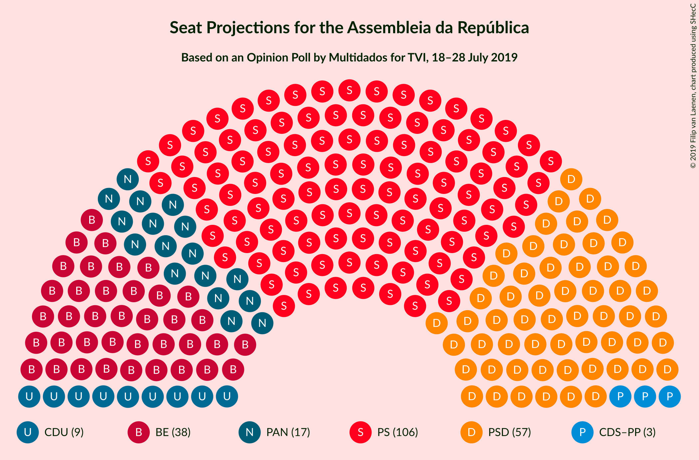

### Confidence Intervals

| Party | Last Result | Median | 80% Confidence Interval | 90% Confidence Interval | 95% Confidence Interval | 99% Confidence Interval |
|:-----:|:-----------:|:------:|:-----------------------:|:-----------------------:|:-----------------------:|:-----------------------:|
| <a href="#partido-socialista">Partido Socialista</a> | 86 | 106 | 99–113 |98–115 |97–116 |94–120 |
| <a href="#partido-social-democrata">Partido Social Democrata</a> | 89 | 57 | 52–64 |51–66 |50–68 |49–70 |
| <a href="#bloco-de-esquerda">Bloco de Esquerda</a> | 19 | 38 | 29–41 |28–42 |28–44 |26–48 |
| <a href="#pessoas–animais–natureza">Pessoas–Animais–Natureza</a> | 1 | 17 | 13–19 |11–20 |10–22 |9–23 |
| <a href="#coligação-democrática-unitária">Coligação Democrática Unitária</a> | 17 | 9 | 7–13 |5–13 |5–13 |4–17 |
| <a href="#cds–partido-popular">CDS–Partido Popular</a> | 18 | 3 | 2–6 |2–6 |2–6 |0–8 |

### Partido Socialista

*For a full overview of the results for this party, see the [Partido Socialista](party-partidosocialista.html) page.*

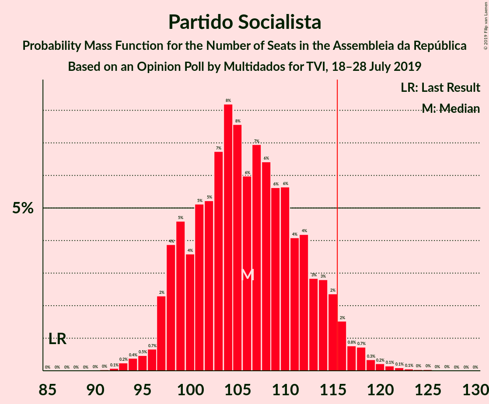

| Number of Seats | Probability | Accumulated | Special Marks |
|:---------------:|:-----------:|:-----------:|:-------------:|
| 86 | 0% | 100% | Last Result |
| 87 | 0% | 100% |  |
| 88 | 0% | 100% |  |
| 89 | 0% | 100% |  |
| 90 | 0% | 100% |  |
| 91 | 0% | 100% |  |
| 92 | 0.1% | 99.9% |  |
| 93 | 0.2% | 99.9% |  |
| 94 | 0.4% | 99.6% |  |
| 95 | 0.5% | 99.2% |  |
| 96 | 0.7% | 98.8% |  |
| 97 | 2% | 98% |  |
| 98 | 4% | 96% |  |
| 99 | 5% | 92% |  |
| 100 | 4% | 87% |  |
| 101 | 5% | 84% |  |
| 102 | 5% | 79% |  |
| 103 | 7% | 73% |  |
| 104 | 8% | 67% |  |
| 105 | 8% | 58% |  |
| 106 | 6% | 51% | Median |
| 107 | 7% | 45% |  |
| 108 | 6% | 38% |  |
| 109 | 6% | 32% |  |
| 110 | 6% | 26% |  |
| 111 | 4% | 20% |  |
| 112 | 4% | 16% |  |
| 113 | 3% | 12% |  |
| 114 | 3% | 9% |  |
| 115 | 2% | 6% |  |
| 116 | 2% | 4% | Majority |
| 117 | 0.8% | 2% |  |
| 118 | 0.7% | 2% |  |
| 119 | 0.3% | 1.0% |  |
| 120 | 0.2% | 0.6% |  |
| 121 | 0.1% | 0.4% |  |
| 122 | 0.1% | 0.3% |  |
| 123 | 0.1% | 0.2% |  |
| 124 | 0% | 0.1% |  |
| 125 | 0% | 0.1% |  |
| 126 | 0% | 0% |  |

### Partido Social Democrata

*For a full overview of the results for this party, see the [Partido Social Democrata](party-partidosocialdemocrata.html) page.*

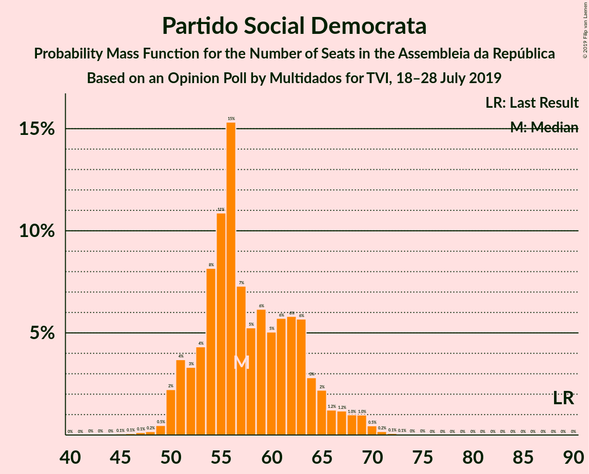

| Number of Seats | Probability | Accumulated | Special Marks |
|:---------------:|:-----------:|:-----------:|:-------------:|
| 44 | 0% | 100% |  |
| 45 | 0.1% | 99.9% |  |
| 46 | 0.1% | 99.9% |  |
| 47 | 0.1% | 99.8% |  |
| 48 | 0.2% | 99.7% |  |
| 49 | 0.5% | 99.5% |  |
| 50 | 2% | 99.0% |  |
| 51 | 4% | 97% |  |
| 52 | 3% | 93% |  |
| 53 | 4% | 90% |  |
| 54 | 8% | 85% |  |
| 55 | 11% | 77% |  |
| 56 | 15% | 66% |  |
| 57 | 7% | 51% | Median |
| 58 | 5% | 44% |  |
| 59 | 6% | 39% |  |
| 60 | 5% | 32% |  |
| 61 | 6% | 27% |  |
| 62 | 6% | 22% |  |
| 63 | 6% | 16% |  |
| 64 | 3% | 10% |  |
| 65 | 2% | 7% |  |
| 66 | 1.2% | 5% |  |
| 67 | 1.2% | 4% |  |
| 68 | 1.0% | 3% |  |
| 69 | 1.0% | 2% |  |
| 70 | 0.5% | 0.8% |  |
| 71 | 0.2% | 0.4% |  |
| 72 | 0.1% | 0.2% |  |
| 73 | 0.1% | 0.1% |  |
| 74 | 0% | 0.1% |  |
| 75 | 0% | 0% |  |
| 76 | 0% | 0% |  |
| 77 | 0% | 0% |  |
| 78 | 0% | 0% |  |
| 79 | 0% | 0% |  |
| 80 | 0% | 0% |  |
| 81 | 0% | 0% |  |
| 82 | 0% | 0% |  |
| 83 | 0% | 0% |  |
| 84 | 0% | 0% |  |
| 85 | 0% | 0% |  |
| 86 | 0% | 0% |  |
| 87 | 0% | 0% |  |
| 88 | 0% | 0% |  |
| 89 | 0% | 0% | Last Result |

### Bloco de Esquerda

*For a full overview of the results for this party, see the [Bloco de Esquerda](party-blocodeesquerda.html) page.*

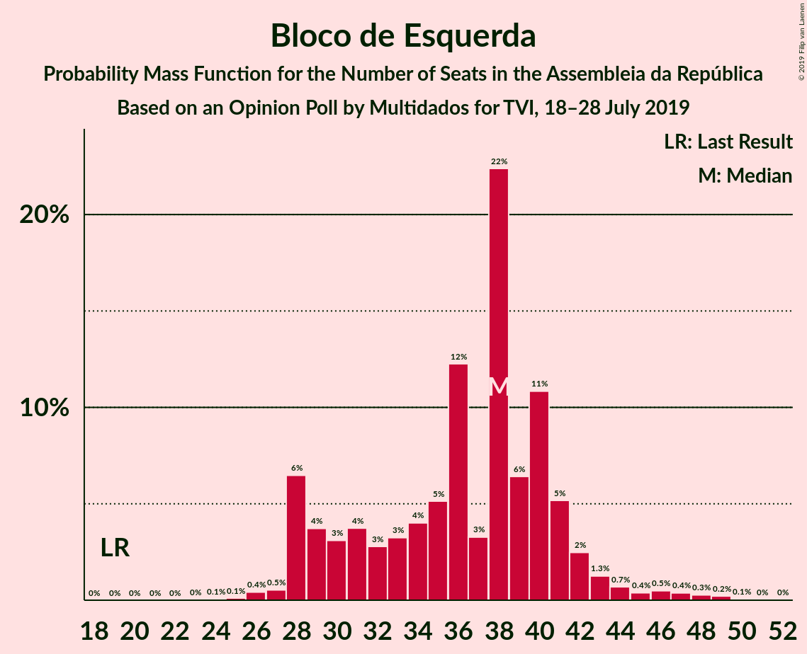

| Number of Seats | Probability | Accumulated | Special Marks |
|:---------------:|:-----------:|:-----------:|:-------------:|
| 19 | 0% | 100% | Last Result |
| 20 | 0% | 100% |  |
| 21 | 0% | 100% |  |
| 22 | 0% | 100% |  |
| 23 | 0% | 100% |  |
| 24 | 0.1% | 100% |  |
| 25 | 0.1% | 99.9% |  |
| 26 | 0.4% | 99.8% |  |
| 27 | 0.5% | 99.4% |  |
| 28 | 6% | 98.9% |  |
| 29 | 4% | 92% |  |
| 30 | 3% | 89% |  |
| 31 | 4% | 86% |  |
| 32 | 3% | 82% |  |
| 33 | 3% | 79% |  |
| 34 | 4% | 76% |  |
| 35 | 5% | 72% |  |
| 36 | 12% | 67% |  |
| 37 | 3% | 54% |  |
| 38 | 22% | 51% | Median |
| 39 | 6% | 29% |  |
| 40 | 11% | 22% |  |
| 41 | 5% | 11% |  |
| 42 | 2% | 6% |  |
| 43 | 1.3% | 4% |  |
| 44 | 0.7% | 3% |  |
| 45 | 0.4% | 2% |  |
| 46 | 0.5% | 1.5% |  |
| 47 | 0.4% | 1.0% |  |
| 48 | 0.3% | 0.6% |  |
| 49 | 0.2% | 0.3% |  |
| 50 | 0.1% | 0.1% |  |
| 51 | 0% | 0.1% |  |
| 52 | 0% | 0% |  |

### Pessoas–Animais–Natureza

*For a full overview of the results for this party, see the [Pessoas–Animais–Natureza](party-pessoas–animais–natureza.html) page.*

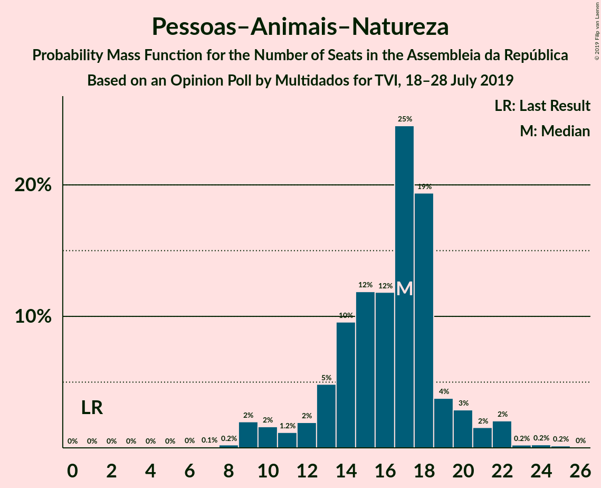

| Number of Seats | Probability | Accumulated | Special Marks |
|:---------------:|:-----------:|:-----------:|:-------------:|
| 1 | 0% | 100% | Last Result |
| 2 | 0% | 100% |  |
| 3 | 0% | 100% |  |
| 4 | 0% | 100% |  |
| 5 | 0% | 100% |  |
| 6 | 0% | 100% |  |
| 7 | 0.1% | 100% |  |
| 8 | 0.2% | 99.9% |  |
| 9 | 2% | 99.6% |  |
| 10 | 2% | 98% |  |
| 11 | 1.2% | 96% |  |
| 12 | 2% | 95% |  |
| 13 | 5% | 93% |  |
| 14 | 10% | 88% |  |
| 15 | 12% | 79% |  |
| 16 | 12% | 67% |  |
| 17 | 25% | 55% | Median |
| 18 | 19% | 30% |  |
| 19 | 4% | 11% |  |
| 20 | 3% | 7% |  |
| 21 | 2% | 4% |  |
| 22 | 2% | 3% |  |
| 23 | 0.2% | 0.7% |  |
| 24 | 0.2% | 0.4% |  |
| 25 | 0.2% | 0.2% |  |
| 26 | 0% | 0% |  |

### Coligação Democrática Unitária

*For a full overview of the results for this party, see the [Coligação Democrática Unitária](party-coligaçãodemocráticaunitária.html) page.*

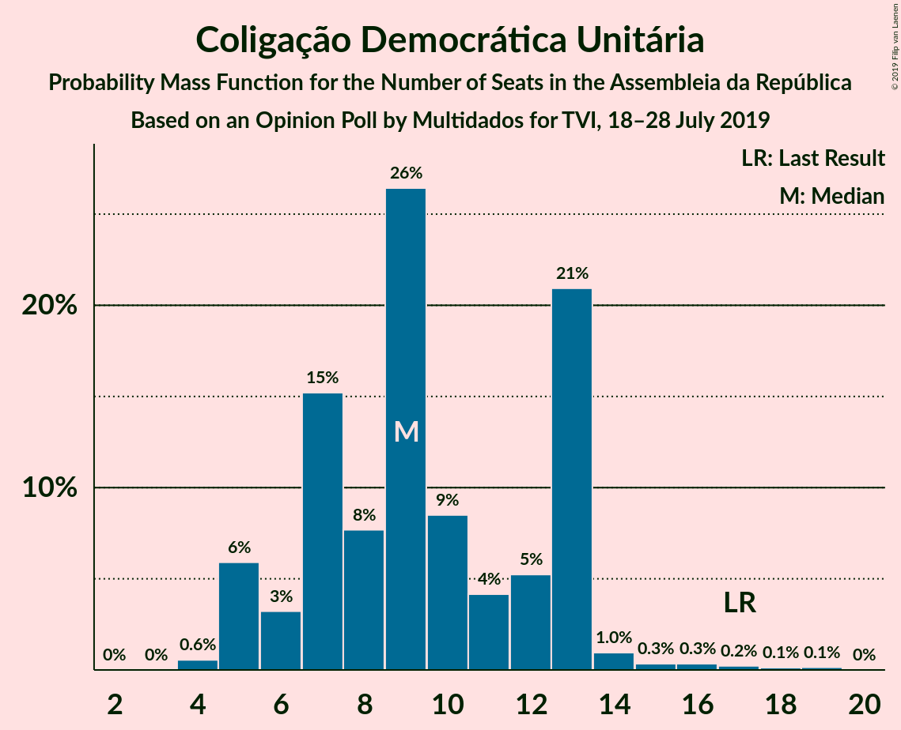

| Number of Seats | Probability | Accumulated | Special Marks |
|:---------------:|:-----------:|:-----------:|:-------------:|
| 4 | 0.6% | 100% |  |
| 5 | 6% | 99.4% |  |
| 6 | 3% | 94% |  |
| 7 | 15% | 90% |  |
| 8 | 8% | 75% |  |
| 9 | 26% | 67% | Median |
| 10 | 9% | 41% |  |
| 11 | 4% | 32% |  |
| 12 | 5% | 28% |  |
| 13 | 21% | 23% |  |
| 14 | 1.0% | 2% |  |
| 15 | 0.3% | 1.2% |  |
| 16 | 0.3% | 0.9% |  |
| 17 | 0.2% | 0.5% | Last Result |
| 18 | 0.1% | 0.3% |  |
| 19 | 0.1% | 0.2% |  |
| 20 | 0% | 0% |  |

### CDS–Partido Popular

*For a full overview of the results for this party, see the [CDS–Partido Popular](party-cds–partidopopular.html) page.*

| Number of Seats | Probability | Accumulated | Special Marks |
|:---------------:|:-----------:|:-----------:|:-------------:|
| 0 | 0.6% | 100% |  |
| 1 | 0.2% | 99.4% |  |
| 2 | 34% | 99.2% |  |
| 3 | 18% | 65% | Median |
| 4 | 30% | 48% |  |
| 5 | 3% | 18% |  |
| 6 | 13% | 15% |  |
| 7 | 1.0% | 2% |  |
| 8 | 1.0% | 1.0% |  |
| 9 | 0% | 0% |  |
| 10 | 0% | 0% |  |
| 11 | 0% | 0% |  |
| 12 | 0% | 0% |  |
| 13 | 0% | 0% |  |
| 14 | 0% | 0% |  |
| 15 | 0% | 0% |  |
| 16 | 0% | 0% |  |
| 17 | 0% | 0% |  |
| 18 | 0% | 0% | Last Result |

## Coalitions

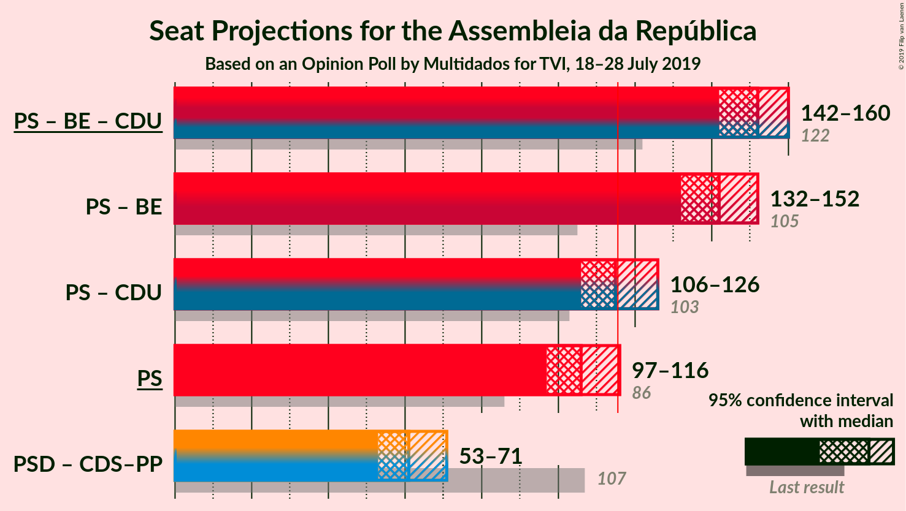

### Confidence Intervals

| Coalition | Last Result | Median | Majority? | 80% Confidence Interval | 90% Confidence Interval | 95% Confidence Interval | 99% Confidence Interval |
|:---------:|:-----------:|:------:|:---------:|:-----------------------:|:-----------------------:|:-----------------------:|:-----------------------:|
| Partido Socialista – Bloco de Esquerda – Coligação Democrática Unitária | 122 | 152 | 100% | 145–157 | 144–159 | 142–160 | 139–163 |
| Partido Socialista – Bloco de Esquerda | 105 | 142 | 100% | 135–148 | 134–150 | 132–152 | 129–155 |
| Partido Socialista – Coligação Democrática Unitária | 103 | 115 | 49% | 109–123 | 107–124 | 106–126 | 103–129 |
| Partido Socialista | 86 | 106 | 4% | 99–113 | 98–115 | 97–116 | 94–120 |
| Partido Social Democrata – CDS–Partido Popular | 107 | 61 | 0% | 56–67 | 54–69 | 53–71 | 52–74 |

### Partido Socialista – Bloco de Esquerda – Coligação Democrática Unitária

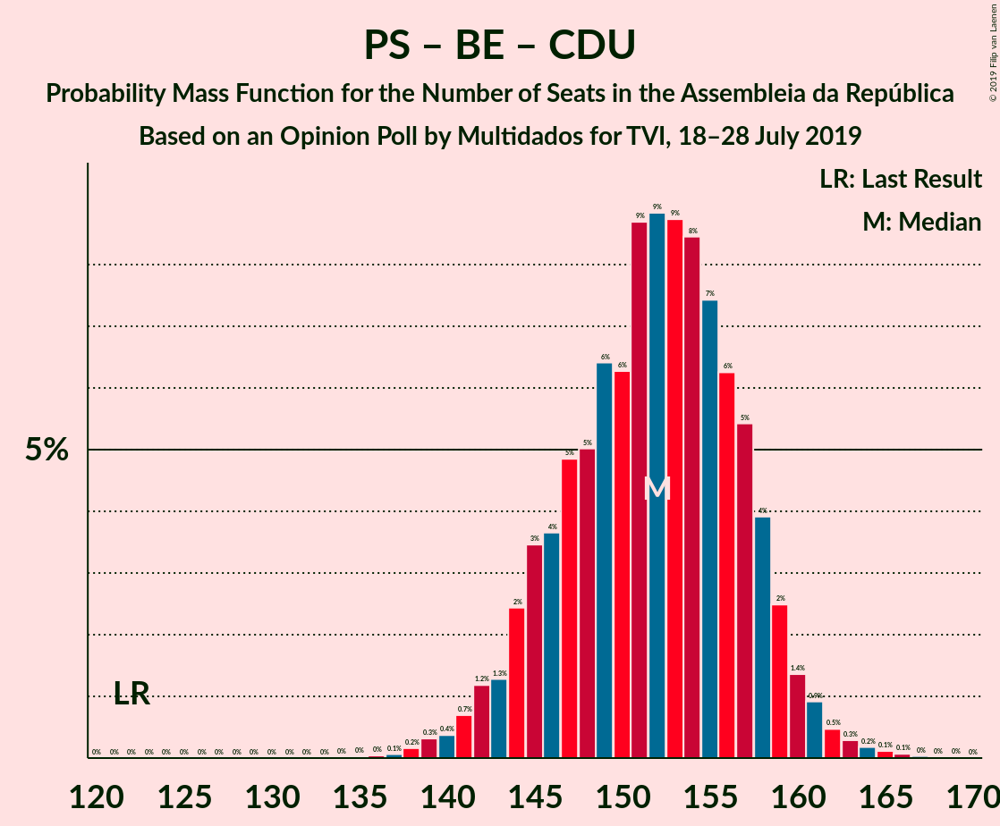

| Number of Seats | Probability | Accumulated | Special Marks |
|:---------------:|:-----------:|:-----------:|:-------------:|
| 122 | 0% | 100% | Last Result |
| 123 | 0% | 100% |  |
| 124 | 0% | 100% |  |
| 125 | 0% | 100% |  |
| 126 | 0% | 100% |  |
| 127 | 0% | 100% |  |
| 128 | 0% | 100% |  |
| 129 | 0% | 100% |  |
| 130 | 0% | 100% |  |
| 131 | 0% | 100% |  |
| 132 | 0% | 100% |  |
| 133 | 0% | 100% |  |
| 134 | 0% | 100% |  |
| 135 | 0% | 100% |  |
| 136 | 0% | 99.9% |  |
| 137 | 0.1% | 99.9% |  |
| 138 | 0.2% | 99.8% |  |
| 139 | 0.3% | 99.7% |  |
| 140 | 0.4% | 99.4% |  |
| 141 | 0.7% | 99.0% |  |
| 142 | 1.2% | 98% |  |
| 143 | 1.3% | 97% |  |
| 144 | 2% | 96% |  |
| 145 | 3% | 93% |  |
| 146 | 4% | 90% |  |
| 147 | 5% | 86% |  |
| 148 | 5% | 81% |  |
| 149 | 6% | 76% |  |
| 150 | 6% | 70% |  |
| 151 | 9% | 64% |  |
| 152 | 9% | 55% |  |
| 153 | 9% | 46% | Median |
| 154 | 8% | 37% |  |
| 155 | 7% | 29% |  |
| 156 | 6% | 22% |  |
| 157 | 5% | 15% |  |
| 158 | 4% | 10% |  |
| 159 | 2% | 6% |  |
| 160 | 1.4% | 3% |  |
| 161 | 0.9% | 2% |  |
| 162 | 0.5% | 1.2% |  |
| 163 | 0.3% | 0.7% |  |
| 164 | 0.2% | 0.4% |  |
| 165 | 0.1% | 0.3% |  |
| 166 | 0.1% | 0.1% |  |
| 167 | 0% | 0.1% |  |
| 168 | 0% | 0% |  |

### Partido Socialista – Bloco de Esquerda

| Number of Seats | Probability | Accumulated | Special Marks |
|:---------------:|:-----------:|:-----------:|:-------------:|
| 105 | 0% | 100% | Last Result |
| 106 | 0% | 100% |  |
| 107 | 0% | 100% |  |
| 108 | 0% | 100% |  |
| 109 | 0% | 100% |  |
| 110 | 0% | 100% |  |
| 111 | 0% | 100% |  |
| 112 | 0% | 100% |  |
| 113 | 0% | 100% |  |
| 114 | 0% | 100% |  |
| 115 | 0% | 100% |  |
| 116 | 0% | 100% | Majority |
| 117 | 0% | 100% |  |
| 118 | 0% | 100% |  |
| 119 | 0% | 100% |  |
| 120 | 0% | 100% |  |
| 121 | 0% | 100% |  |
| 122 | 0% | 100% |  |
| 123 | 0% | 100% |  |
| 124 | 0% | 100% |  |
| 125 | 0% | 100% |  |
| 126 | 0% | 100% |  |
| 127 | 0.1% | 99.9% |  |
| 128 | 0.2% | 99.9% |  |
| 129 | 0.3% | 99.7% |  |
| 130 | 0.4% | 99.4% |  |
| 131 | 0.6% | 99.0% |  |
| 132 | 0.9% | 98% |  |
| 133 | 2% | 97% |  |
| 134 | 2% | 96% |  |
| 135 | 4% | 94% |  |
| 136 | 3% | 90% |  |
| 137 | 4% | 87% |  |
| 138 | 6% | 82% |  |
| 139 | 7% | 77% |  |
| 140 | 6% | 70% |  |
| 141 | 7% | 64% |  |
| 142 | 8% | 57% |  |
| 143 | 7% | 49% |  |
| 144 | 8% | 41% | Median |
| 145 | 7% | 33% |  |
| 146 | 5% | 26% |  |
| 147 | 6% | 21% |  |
| 148 | 5% | 15% |  |
| 149 | 3% | 10% |  |
| 150 | 3% | 7% |  |
| 151 | 2% | 5% |  |
| 152 | 1.0% | 3% |  |
| 153 | 0.5% | 2% |  |
| 154 | 0.5% | 1.0% |  |
| 155 | 0.2% | 0.6% |  |
| 156 | 0.1% | 0.3% |  |
| 157 | 0.1% | 0.2% |  |
| 158 | 0% | 0.1% |  |
| 159 | 0% | 0.1% |  |
| 160 | 0% | 0% |  |

### Partido Socialista – Coligação Democrática Unitária

| Number of Seats | Probability | Accumulated | Special Marks |
|:---------------:|:-----------:|:-----------:|:-------------:|
| 99 | 0% | 100% |  |
| 100 | 0.1% | 99.9% |  |
| 101 | 0.1% | 99.9% |  |
| 102 | 0.1% | 99.7% |  |
| 103 | 0.2% | 99.6% | Last Result |
| 104 | 0.6% | 99.4% |  |
| 105 | 0.7% | 98.7% |  |
| 106 | 2% | 98% |  |
| 107 | 2% | 96% |  |
| 108 | 3% | 94% |  |
| 109 | 4% | 92% |  |
| 110 | 5% | 88% |  |
| 111 | 5% | 82% |  |
| 112 | 6% | 77% |  |
| 113 | 6% | 71% |  |
| 114 | 8% | 64% |  |
| 115 | 7% | 56% | Median |
| 116 | 7% | 49% | Majority |
| 117 | 8% | 42% |  |
| 118 | 6% | 34% |  |
| 119 | 5% | 28% |  |
| 120 | 4% | 23% |  |
| 121 | 5% | 19% |  |
| 122 | 3% | 13% |  |
| 123 | 4% | 10% |  |
| 124 | 2% | 6% |  |
| 125 | 1.5% | 4% |  |
| 126 | 0.9% | 3% |  |
| 127 | 0.7% | 2% |  |
| 128 | 0.5% | 1.2% |  |
| 129 | 0.2% | 0.7% |  |
| 130 | 0.1% | 0.4% |  |
| 131 | 0.1% | 0.3% |  |
| 132 | 0.1% | 0.2% |  |
| 133 | 0.1% | 0.1% |  |
| 134 | 0% | 0.1% |  |
| 135 | 0% | 0% |  |

### Partido Socialista

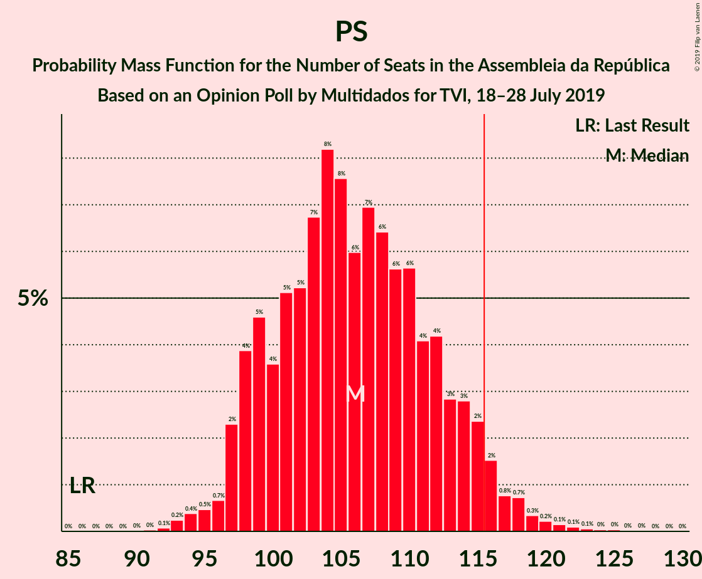

| Number of Seats | Probability | Accumulated | Special Marks |
|:---------------:|:-----------:|:-----------:|:-------------:|
| 86 | 0% | 100% | Last Result |
| 87 | 0% | 100% |  |
| 88 | 0% | 100% |  |
| 89 | 0% | 100% |  |
| 90 | 0% | 100% |  |
| 91 | 0% | 100% |  |
| 92 | 0.1% | 99.9% |  |
| 93 | 0.2% | 99.9% |  |
| 94 | 0.4% | 99.6% |  |
| 95 | 0.5% | 99.2% |  |
| 96 | 0.7% | 98.8% |  |
| 97 | 2% | 98% |  |
| 98 | 4% | 96% |  |
| 99 | 5% | 92% |  |
| 100 | 4% | 87% |  |
| 101 | 5% | 84% |  |
| 102 | 5% | 79% |  |
| 103 | 7% | 73% |  |
| 104 | 8% | 67% |  |
| 105 | 8% | 58% |  |
| 106 | 6% | 51% | Median |
| 107 | 7% | 45% |  |
| 108 | 6% | 38% |  |
| 109 | 6% | 32% |  |
| 110 | 6% | 26% |  |
| 111 | 4% | 20% |  |
| 112 | 4% | 16% |  |
| 113 | 3% | 12% |  |
| 114 | 3% | 9% |  |
| 115 | 2% | 6% |  |
| 116 | 2% | 4% | Majority |
| 117 | 0.8% | 2% |  |
| 118 | 0.7% | 2% |  |
| 119 | 0.3% | 1.0% |  |
| 120 | 0.2% | 0.6% |  |
| 121 | 0.1% | 0.4% |  |
| 122 | 0.1% | 0.3% |  |
| 123 | 0.1% | 0.2% |  |
| 124 | 0% | 0.1% |  |
| 125 | 0% | 0.1% |  |
| 126 | 0% | 0% |  |

### Partido Social Democrata – CDS–Partido Popular

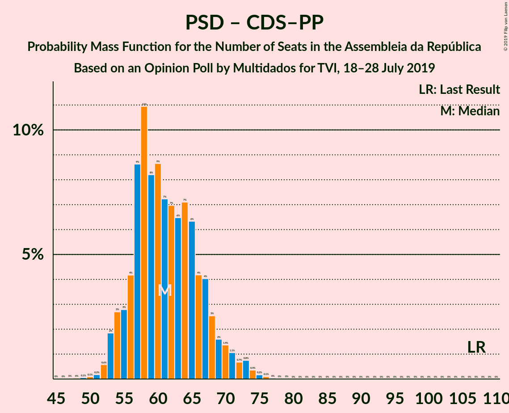

| Number of Seats | Probability | Accumulated | Special Marks |
|:---------------:|:-----------:|:-----------:|:-------------:|
| 47 | 0% | 100% |  |
| 48 | 0% | 99.9% |  |
| 49 | 0.1% | 99.9% |  |
| 50 | 0.1% | 99.8% |  |
| 51 | 0.2% | 99.7% |  |
| 52 | 0.6% | 99.6% |  |
| 53 | 2% | 99.0% |  |
| 54 | 3% | 97% |  |
| 55 | 3% | 94% |  |
| 56 | 4% | 92% |  |
| 57 | 9% | 87% |  |
| 58 | 11% | 79% |  |
| 59 | 8% | 68% |  |
| 60 | 9% | 60% | Median |
| 61 | 7% | 51% |  |
| 62 | 7% | 44% |  |
| 63 | 6% | 37% |  |
| 64 | 7% | 30% |  |
| 65 | 6% | 23% |  |
| 66 | 4% | 17% |  |
| 67 | 4% | 13% |  |
| 68 | 3% | 9% |  |
| 69 | 2% | 6% |  |
| 70 | 1.4% | 5% |  |
| 71 | 1.1% | 3% |  |
| 72 | 0.7% | 2% |  |
| 73 | 0.8% | 1.5% |  |
| 74 | 0.4% | 0.7% |  |
| 75 | 0.2% | 0.4% |  |
| 76 | 0.1% | 0.2% |  |
| 77 | 0% | 0.1% |  |
| 78 | 0% | 0% |  |
| 79 | 0% | 0% |  |
| 80 | 0% | 0% |  |
| 81 | 0% | 0% |  |
| 82 | 0% | 0% |  |
| 83 | 0% | 0% |  |
| 84 | 0% | 0% |  |
| 85 | 0% | 0% |  |
| 86 | 0% | 0% |  |
| 87 | 0% | 0% |  |
| 88 | 0% | 0% |  |
| 89 | 0% | 0% |  |
| 90 | 0% | 0% |  |
| 91 | 0% | 0% |  |
| 92 | 0% | 0% |  |
| 93 | 0% | 0% |  |
| 94 | 0% | 0% |  |
| 95 | 0% | 0% |  |
| 96 | 0% | 0% |  |
| 97 | 0% | 0% |  |
| 98 | 0% | 0% |  |
| 99 | 0% | 0% |  |
| 100 | 0% | 0% |  |
| 101 | 0% | 0% |  |
| 102 | 0% | 0% |  |
| 103 | 0% | 0% |  |
| 104 | 0% | 0% |  |
| 105 | 0% | 0% |  |
| 106 | 0% | 0% |  |
| 107 | 0% | 0% | Last Result |

## Technical Information

### Opinion Poll

+ **Polling firm:** Multidados
+ **Commissioner(s):** TVI
+ **Fieldwork period:** 18–28 July 2019

### Calculations

+ **Sample size:** 800
+ **Simulations done:** 1,048,576
+ **Error estimate:** 0.64%

