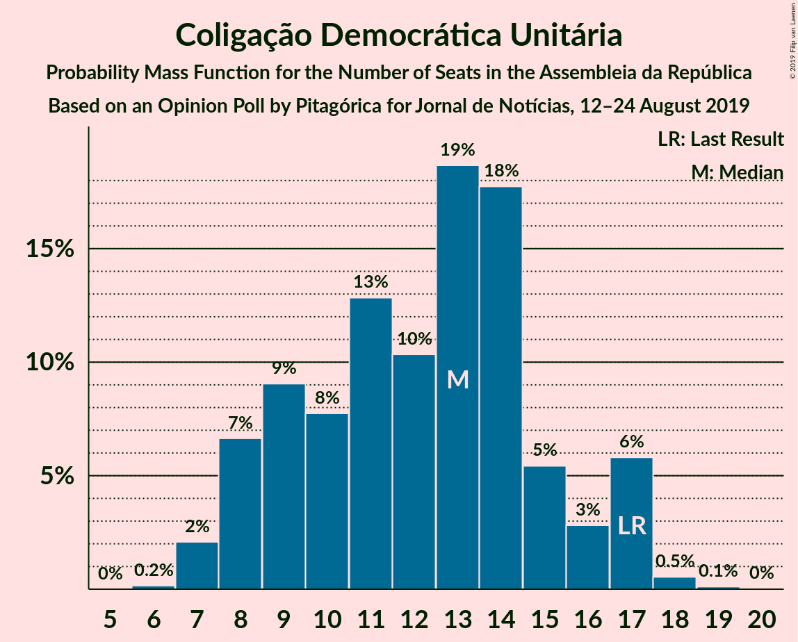
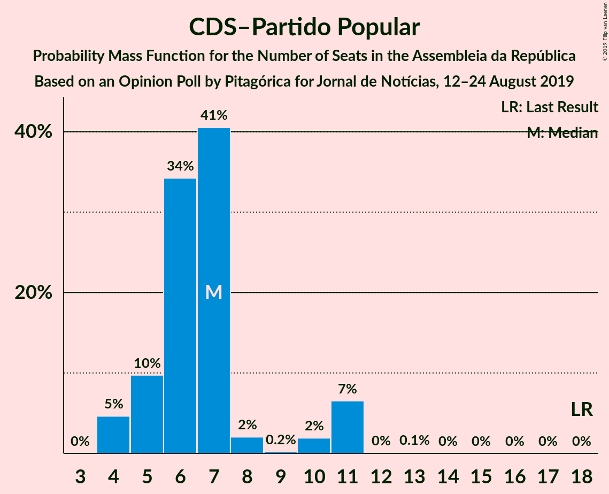
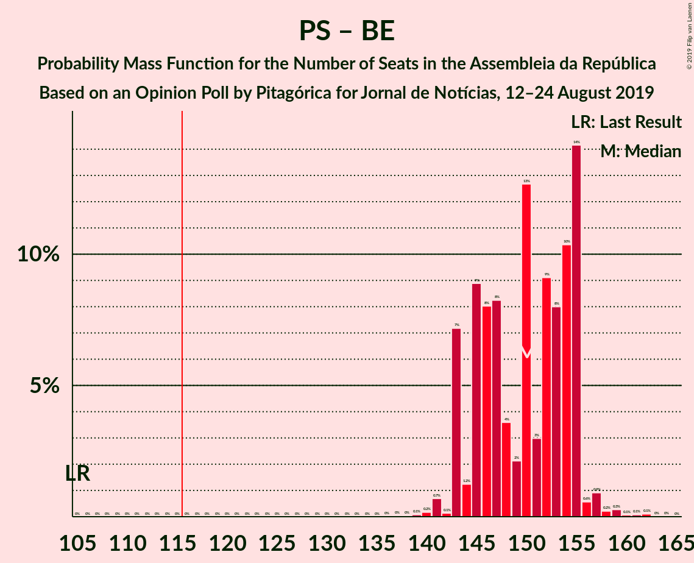
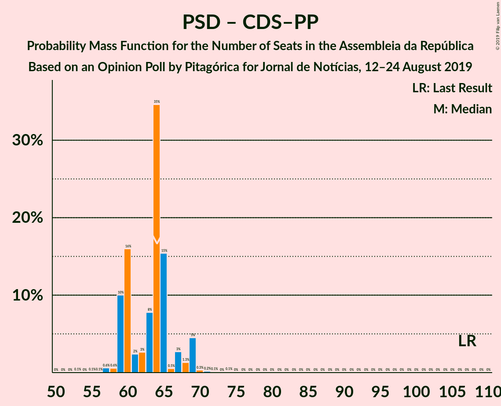

# Opinion Poll by Pitagórica for Jornal de Notícias, 12–24 August 2019

<a href="#voting-intentions">Voting Intentions</a> | <a href="#seats">Seats</a> | <a href="#coalitions">Coalitions</a> | <a href="#technical-information">Technical Information</a>

## Voting Intentions

### Confidence Intervals

| Party | Last Result | Poll Result | 80% Confidence Interval | 90% Confidence Interval | 95% Confidence Interval | 99% Confidence Interval |
|:-----:|:-----------:|:-----------:|:-----------------------:|:-----------------------:|:-----------------------:|:-----------------------:|
| Partido Socialista | 32.3% | 44.3% | 42.6–45.9% |42.2–46.4% |41.8–46.8% |41.0–47.6% |
| Partido Social Democrata | 36.9% | 20.7% | 19.4–22.1% |19.1–22.5% |18.8–22.8% |18.2–23.5% |
| Bloco de Esquerda | 10.2% | 10.2% | 9.2–11.2% |9.0–11.5% |8.7–11.8% |8.3–12.3% |
| Coligação Democrática Unitária | 8.2% | 6.7% | 5.9–7.6% |5.7–7.8% |5.5–8.1% |5.2–8.5% |
| CDS–Partido Popular | 36.9% | 5.0% | 4.3–5.8% |4.1–6.0% |4.0–6.2% |3.7–6.6% |
| Pessoas–Animais–Natureza | 1.4% | 3.3% | 2.8–3.9% |2.6–4.1% |2.5–4.3% |2.3–4.6% |
| Aliança | 0.0% | 1.3% | 1.0–1.8% |0.9–1.9% |0.9–2.0% |0.7–2.3% |

*Note:* The poll result column reflects the actual value used in the calculations. Published results may vary slightly, and in addition be rounded to fewer digits.

## Seats

### Confidence Intervals

| Party | Last Result | Median | 80% Confidence Interval | 90% Confidence Interval | 95% Confidence Interval | 99% Confidence Interval |
|:-----:|:-----------:|:------:|:-----------------------:|:-----------------------:|:-----------------------:|:-----------------------:|
| <a href="#partido-socialista">Partido Socialista</a> | 86 | 129 | 125–134 |124–136 |123–137 |120–139 |
| <a href="#partido-social-democrata">Partido Social Democrata</a> | 89 | 56 | 53–60 |53–61 |52–62 |50–64 |
| <a href="#bloco-de-esquerda">Bloco de Esquerda</a> | 19 | 21 | 18–25 |18–25 |18–25 |17–27 |
| <a href="#coligação-democrática-unitária">Coligação Democrática Unitária</a> | 17 | 13 | 9–14 |8–15 |7–17 |6–17 |
| <a href="#cds–partido-popular">CDS–Partido Popular</a> | 18 | 7 | 6–8 |6–8 |4–10 |4–11 |
| <a href="#pessoas–animais–natureza">Pessoas–Animais–Natureza</a> | 1 | 4 | 3–5 |3–6 |2–6 |2–6 |
| <a href="#aliança">Aliança</a> | 0 | 0 | 0 |0 |0 |0–2 |

### Partido Socialista

*For a full overview of the results for this party, see the [Partido Socialista](party-partidosocialista.html) page.*

| Number of Seats | Probability | Accumulated | Special Marks |
|:---------------:|:-----------:|:-----------:|:-------------:|
| 86 | 0% | 100% | Last Result |
| 87 | 0% | 100% |  |
| 88 | 0% | 100% |  |
| 89 | 0% | 100% |  |
| 90 | 0% | 100% |  |
| 91 | 0% | 100% |  |
| 92 | 0% | 100% |  |
| 93 | 0% | 100% |  |
| 94 | 0% | 100% |  |
| 95 | 0% | 100% |  |
| 96 | 0% | 100% |  |
| 97 | 0% | 100% |  |
| 98 | 0% | 100% |  |
| 99 | 0% | 100% |  |
| 100 | 0% | 100% |  |
| 101 | 0% | 100% |  |
| 102 | 0% | 100% |  |
| 103 | 0% | 100% |  |
| 104 | 0% | 100% |  |
| 105 | 0% | 100% |  |
| 106 | 0% | 100% |  |
| 107 | 0% | 100% |  |
| 108 | 0% | 100% |  |
| 109 | 0% | 100% |  |
| 110 | 0% | 100% |  |
| 111 | 0% | 100% |  |
| 112 | 0% | 100% |  |
| 113 | 0% | 100% |  |
| 114 | 0% | 100% |  |
| 115 | 0% | 100% |  |
| 116 | 0% | 100% | Majority |
| 117 | 0% | 100% |  |
| 118 | 0.1% | 99.9% |  |
| 119 | 0.1% | 99.9% |  |
| 120 | 0.2% | 99.7% |  |
| 121 | 0.7% | 99.5% |  |
| 122 | 0.9% | 98.8% |  |
| 123 | 2% | 98% |  |
| 124 | 4% | 96% |  |
| 125 | 4% | 92% |  |
| 126 | 5% | 88% |  |
| 127 | 7% | 83% |  |
| 128 | 12% | 76% |  |
| 129 | 19% | 64% | Median |
| 130 | 8% | 45% |  |
| 131 | 10% | 37% |  |
| 132 | 7% | 27% |  |
| 133 | 6% | 20% |  |
| 134 | 4% | 13% |  |
| 135 | 4% | 10% |  |
| 136 | 2% | 5% |  |
| 137 | 2% | 3% |  |
| 138 | 0.6% | 2% |  |
| 139 | 0.7% | 1.0% |  |
| 140 | 0.2% | 0.3% |  |
| 141 | 0.1% | 0.1% |  |
| 142 | 0% | 0% |  |

### Partido Social Democrata

*For a full overview of the results for this party, see the [Partido Social Democrata](party-partidosocialdemocrata.html) page.*

| Number of Seats | Probability | Accumulated | Special Marks |
|:---------------:|:-----------:|:-----------:|:-------------:|
| 48 | 0.1% | 100% |  |
| 49 | 0.1% | 99.9% |  |
| 50 | 0.7% | 99.8% |  |
| 51 | 1.0% | 99.1% |  |
| 52 | 3% | 98% |  |
| 53 | 17% | 95% |  |
| 54 | 13% | 79% |  |
| 55 | 13% | 66% |  |
| 56 | 9% | 53% | Median |
| 57 | 9% | 44% |  |
| 58 | 10% | 36% |  |
| 59 | 12% | 25% |  |
| 60 | 8% | 14% |  |
| 61 | 3% | 6% |  |
| 62 | 1.4% | 3% |  |
| 63 | 0.8% | 2% |  |
| 64 | 0.5% | 0.8% |  |
| 65 | 0.1% | 0.3% |  |
| 66 | 0.1% | 0.1% |  |
| 67 | 0.1% | 0.1% |  |
| 68 | 0% | 0% |  |
| 69 | 0% | 0% |  |
| 70 | 0% | 0% |  |
| 71 | 0% | 0% |  |
| 72 | 0% | 0% |  |
| 73 | 0% | 0% |  |
| 74 | 0% | 0% |  |
| 75 | 0% | 0% |  |
| 76 | 0% | 0% |  |
| 77 | 0% | 0% |  |
| 78 | 0% | 0% |  |
| 79 | 0% | 0% |  |
| 80 | 0% | 0% |  |
| 81 | 0% | 0% |  |
| 82 | 0% | 0% |  |
| 83 | 0% | 0% |  |
| 84 | 0% | 0% |  |
| 85 | 0% | 0% |  |
| 86 | 0% | 0% |  |
| 87 | 0% | 0% |  |
| 88 | 0% | 0% |  |
| 89 | 0% | 0% | Last Result |

### Bloco de Esquerda

*For a full overview of the results for this party, see the [Bloco de Esquerda](party-blocodeesquerda.html) page.*

| Number of Seats | Probability | Accumulated | Special Marks |
|:---------------:|:-----------:|:-----------:|:-------------:|
| 16 | 0.1% | 100% |  |
| 17 | 2% | 99.9% |  |
| 18 | 10% | 98% |  |
| 19 | 7% | 88% | Last Result |
| 20 | 23% | 80% |  |
| 21 | 16% | 57% | Median |
| 22 | 9% | 41% |  |
| 23 | 8% | 32% |  |
| 24 | 13% | 24% |  |
| 25 | 10% | 12% |  |
| 26 | 0.6% | 1.3% |  |
| 27 | 0.5% | 0.7% |  |
| 28 | 0.2% | 0.2% |  |
| 29 | 0% | 0% |  |

### Coligação Democrática Unitária

*For a full overview of the results for this party, see the [Coligação Democrática Unitária](party-coligaçãodemocráticaunitária.html) page.*

| Number of Seats | Probability | Accumulated | Special Marks |
|:---------------:|:-----------:|:-----------:|:-------------:|
| 6 | 1.0% | 100% |  |
| 7 | 4% | 99.0% |  |
| 8 | 3% | 95% |  |
| 9 | 13% | 92% |  |
| 10 | 5% | 79% |  |
| 11 | 7% | 74% |  |
| 12 | 7% | 68% |  |
| 13 | 33% | 60% | Median |
| 14 | 21% | 27% |  |
| 15 | 2% | 6% |  |
| 16 | 2% | 4% |  |
| 17 | 2% | 3% | Last Result |
| 18 | 0.4% | 0.4% |  |
| 19 | 0% | 0% |  |

### CDS–Partido Popular

*For a full overview of the results for this party, see the [CDS–Partido Popular](party-cds–partidopopular.html) page.*

| Number of Seats | Probability | Accumulated | Special Marks |
|:---------------:|:-----------:|:-----------:|:-------------:|
| 3 | 0.1% | 100% |  |
| 4 | 3% | 99.9% |  |
| 5 | 1.1% | 97% |  |
| 6 | 41% | 96% |  |
| 7 | 12% | 55% | Median |
| 8 | 38% | 43% |  |
| 9 | 2% | 5% |  |
| 10 | 3% | 3% |  |
| 11 | 0.5% | 0.6% |  |
| 12 | 0.1% | 0.1% |  |
| 13 | 0% | 0% |  |
| 14 | 0% | 0% |  |
| 15 | 0% | 0% |  |
| 16 | 0% | 0% |  |
| 17 | 0% | 0% |  |
| 18 | 0% | 0% | Last Result |

### Pessoas–Animais–Natureza

*For a full overview of the results for this party, see the [Pessoas–Animais–Natureza](party-pessoas–animais–natureza.html) page.*

| Number of Seats | Probability | Accumulated | Special Marks |
|:---------------:|:-----------:|:-----------:|:-------------:|
| 1 | 0% | 100% | Last Result |
| 2 | 5% | 100% |  |
| 3 | 36% | 95% |  |
| 4 | 45% | 60% | Median |
| 5 | 5% | 14% |  |
| 6 | 9% | 9% |  |
| 7 | 0% | 0% |  |

### Aliança

*For a full overview of the results for this party, see the [Aliança](party-aliança.html) page.*

| Number of Seats | Probability | Accumulated | Special Marks |
|:---------------:|:-----------:|:-----------:|:-------------:|
| 0 | 98% | 100% | Last Result, Median |
| 1 | 0.6% | 2% |  |
| 2 | 1.2% | 1.2% |  |
| 3 | 0% | 0% |  |

## Coalitions

### Confidence Intervals

| Coalition | Last Result | Median | Majority? | 80% Confidence Interval | 90% Confidence Interval | 95% Confidence Interval | 99% Confidence Interval |
|:---------:|:-----------:|:------:|:---------:|:-----------------------:|:-----------------------:|:-----------------------:|:-----------------------:|
| Partido Socialista – Bloco de Esquerda – Coligação Democrática Unitária | 122 | 163 | 100% | 160–166 | 158–167 | 157–168 | 155–170 |
| Partido Socialista – Bloco de Esquerda | 105 | 151 | 100% | 146–155 | 145–157 | 144–158 | 142–160 |
| Partido Socialista – Coligação Democrática Unitária | 103 | 142 | 100% | 138–146 | 137–146 | 136–147 | 133–149 |
| Partido Socialista | 86 | 129 | 100% | 125–134 | 124–136 | 123–137 | 120–139 |
| Partido Social Democrata – CDS–Partido Popular | 107 | 63 | 0% | 60–66 | 60–67 | 59–69 | 57–71 |

### Partido Socialista – Bloco de Esquerda – Coligação Democrática Unitária

| Number of Seats | Probability | Accumulated | Special Marks |
|:---------------:|:-----------:|:-----------:|:-------------:|
| 122 | 0% | 100% | Last Result |
| 123 | 0% | 100% |  |
| 124 | 0% | 100% |  |
| 125 | 0% | 100% |  |
| 126 | 0% | 100% |  |
| 127 | 0% | 100% |  |
| 128 | 0% | 100% |  |
| 129 | 0% | 100% |  |
| 130 | 0% | 100% |  |
| 131 | 0% | 100% |  |
| 132 | 0% | 100% |  |
| 133 | 0% | 100% |  |
| 134 | 0% | 100% |  |
| 135 | 0% | 100% |  |
| 136 | 0% | 100% |  |
| 137 | 0% | 100% |  |
| 138 | 0% | 100% |  |
| 139 | 0% | 100% |  |
| 140 | 0% | 100% |  |
| 141 | 0% | 100% |  |
| 142 | 0% | 100% |  |
| 143 | 0% | 100% |  |
| 144 | 0% | 100% |  |
| 145 | 0% | 100% |  |
| 146 | 0% | 100% |  |
| 147 | 0% | 100% |  |
| 148 | 0% | 100% |  |
| 149 | 0% | 100% |  |
| 150 | 0% | 100% |  |
| 151 | 0% | 100% |  |
| 152 | 0% | 100% |  |
| 153 | 0.1% | 99.9% |  |
| 154 | 0.1% | 99.8% |  |
| 155 | 0.3% | 99.7% |  |
| 156 | 0.6% | 99.4% |  |
| 157 | 2% | 98.8% |  |
| 158 | 3% | 97% |  |
| 159 | 4% | 95% |  |
| 160 | 9% | 91% |  |
| 161 | 15% | 82% |  |
| 162 | 8% | 66% |  |
| 163 | 15% | 58% | Median |
| 164 | 8% | 43% |  |
| 165 | 12% | 35% |  |
| 166 | 16% | 23% |  |
| 167 | 4% | 7% |  |
| 168 | 2% | 3% |  |
| 169 | 1.0% | 2% |  |
| 170 | 0.3% | 0.5% |  |
| 171 | 0.2% | 0.2% |  |
| 172 | 0% | 0.1% |  |
| 173 | 0% | 0% |  |

### Partido Socialista – Bloco de Esquerda

| Number of Seats | Probability | Accumulated | Special Marks |
|:---------------:|:-----------:|:-----------:|:-------------:|
| 105 | 0% | 100% | Last Result |
| 106 | 0% | 100% |  |
| 107 | 0% | 100% |  |
| 108 | 0% | 100% |  |
| 109 | 0% | 100% |  |
| 110 | 0% | 100% |  |
| 111 | 0% | 100% |  |
| 112 | 0% | 100% |  |
| 113 | 0% | 100% |  |
| 114 | 0% | 100% |  |
| 115 | 0% | 100% |  |
| 116 | 0% | 100% | Majority |
| 117 | 0% | 100% |  |
| 118 | 0% | 100% |  |
| 119 | 0% | 100% |  |
| 120 | 0% | 100% |  |
| 121 | 0% | 100% |  |
| 122 | 0% | 100% |  |
| 123 | 0% | 100% |  |
| 124 | 0% | 100% |  |
| 125 | 0% | 100% |  |
| 126 | 0% | 100% |  |
| 127 | 0% | 100% |  |
| 128 | 0% | 100% |  |
| 129 | 0% | 100% |  |
| 130 | 0% | 100% |  |
| 131 | 0% | 100% |  |
| 132 | 0% | 100% |  |
| 133 | 0% | 100% |  |
| 134 | 0% | 100% |  |
| 135 | 0% | 100% |  |
| 136 | 0% | 100% |  |
| 137 | 0% | 100% |  |
| 138 | 0% | 100% |  |
| 139 | 0% | 100% |  |
| 140 | 0.1% | 99.9% |  |
| 141 | 0.2% | 99.8% |  |
| 142 | 0.4% | 99.6% |  |
| 143 | 1.0% | 99.3% |  |
| 144 | 2% | 98% |  |
| 145 | 2% | 96% |  |
| 146 | 5% | 95% |  |
| 147 | 7% | 90% |  |
| 148 | 8% | 83% |  |
| 149 | 11% | 76% |  |
| 150 | 11% | 65% | Median |
| 151 | 9% | 54% |  |
| 152 | 13% | 45% |  |
| 153 | 11% | 32% |  |
| 154 | 6% | 22% |  |
| 155 | 7% | 16% |  |
| 156 | 3% | 9% |  |
| 157 | 3% | 6% |  |
| 158 | 2% | 4% |  |
| 159 | 1.1% | 2% |  |
| 160 | 0.3% | 0.6% |  |
| 161 | 0.2% | 0.3% |  |
| 162 | 0.1% | 0.1% |  |
| 163 | 0% | 0% |  |

### Partido Socialista – Coligação Democrática Unitária

| Number of Seats | Probability | Accumulated | Special Marks |
|:---------------:|:-----------:|:-----------:|:-------------:|
| 103 | 0% | 100% | Last Result |
| 104 | 0% | 100% |  |
| 105 | 0% | 100% |  |
| 106 | 0% | 100% |  |
| 107 | 0% | 100% |  |
| 108 | 0% | 100% |  |
| 109 | 0% | 100% |  |
| 110 | 0% | 100% |  |
| 111 | 0% | 100% |  |
| 112 | 0% | 100% |  |
| 113 | 0% | 100% |  |
| 114 | 0% | 100% |  |
| 115 | 0% | 100% |  |
| 116 | 0% | 100% | Majority |
| 117 | 0% | 100% |  |
| 118 | 0% | 100% |  |
| 119 | 0% | 100% |  |
| 120 | 0% | 100% |  |
| 121 | 0% | 100% |  |
| 122 | 0% | 100% |  |
| 123 | 0% | 100% |  |
| 124 | 0% | 100% |  |
| 125 | 0% | 100% |  |
| 126 | 0% | 100% |  |
| 127 | 0% | 100% |  |
| 128 | 0% | 100% |  |
| 129 | 0% | 100% |  |
| 130 | 0% | 100% |  |
| 131 | 0.1% | 99.9% |  |
| 132 | 0.1% | 99.8% |  |
| 133 | 0.4% | 99.7% |  |
| 134 | 0.6% | 99.4% |  |
| 135 | 1.1% | 98.8% |  |
| 136 | 2% | 98% |  |
| 137 | 4% | 95% |  |
| 138 | 5% | 91% |  |
| 139 | 6% | 86% |  |
| 140 | 10% | 79% |  |
| 141 | 14% | 69% |  |
| 142 | 19% | 55% | Median |
| 143 | 12% | 36% |  |
| 144 | 7% | 24% |  |
| 145 | 5% | 17% |  |
| 146 | 7% | 11% |  |
| 147 | 3% | 5% |  |
| 148 | 1.2% | 2% |  |
| 149 | 0.5% | 0.9% |  |
| 150 | 0.2% | 0.3% |  |
| 151 | 0.1% | 0.1% |  |
| 152 | 0% | 0.1% |  |
| 153 | 0% | 0% |  |

### Partido Socialista

| Number of Seats | Probability | Accumulated | Special Marks |
|:---------------:|:-----------:|:-----------:|:-------------:|
| 86 | 0% | 100% | Last Result |
| 87 | 0% | 100% |  |
| 88 | 0% | 100% |  |
| 89 | 0% | 100% |  |
| 90 | 0% | 100% |  |
| 91 | 0% | 100% |  |
| 92 | 0% | 100% |  |
| 93 | 0% | 100% |  |
| 94 | 0% | 100% |  |
| 95 | 0% | 100% |  |
| 96 | 0% | 100% |  |
| 97 | 0% | 100% |  |
| 98 | 0% | 100% |  |
| 99 | 0% | 100% |  |
| 100 | 0% | 100% |  |
| 101 | 0% | 100% |  |
| 102 | 0% | 100% |  |
| 103 | 0% | 100% |  |
| 104 | 0% | 100% |  |
| 105 | 0% | 100% |  |
| 106 | 0% | 100% |  |
| 107 | 0% | 100% |  |
| 108 | 0% | 100% |  |
| 109 | 0% | 100% |  |
| 110 | 0% | 100% |  |
| 111 | 0% | 100% |  |
| 112 | 0% | 100% |  |
| 113 | 0% | 100% |  |
| 114 | 0% | 100% |  |
| 115 | 0% | 100% |  |
| 116 | 0% | 100% | Majority |
| 117 | 0% | 100% |  |
| 118 | 0.1% | 99.9% |  |
| 119 | 0.1% | 99.9% |  |
| 120 | 0.2% | 99.7% |  |
| 121 | 0.7% | 99.5% |  |
| 122 | 0.9% | 98.8% |  |
| 123 | 2% | 98% |  |
| 124 | 4% | 96% |  |
| 125 | 4% | 92% |  |
| 126 | 5% | 88% |  |
| 127 | 7% | 83% |  |
| 128 | 12% | 76% |  |
| 129 | 19% | 64% | Median |
| 130 | 8% | 45% |  |
| 131 | 10% | 37% |  |
| 132 | 7% | 27% |  |
| 133 | 6% | 20% |  |
| 134 | 4% | 13% |  |
| 135 | 4% | 10% |  |
| 136 | 2% | 5% |  |
| 137 | 2% | 3% |  |
| 138 | 0.6% | 2% |  |
| 139 | 0.7% | 1.0% |  |
| 140 | 0.2% | 0.3% |  |
| 141 | 0.1% | 0.1% |  |
| 142 | 0% | 0% |  |

### Partido Social Democrata – CDS–Partido Popular

| Number of Seats | Probability | Accumulated | Special Marks |
|:---------------:|:-----------:|:-----------:|:-------------:|
| 55 | 0.1% | 100% |  |
| 56 | 0.2% | 99.9% |  |
| 57 | 0.5% | 99.7% |  |
| 58 | 2% | 99.3% |  |
| 59 | 2% | 98% |  |
| 60 | 10% | 95% |  |
| 61 | 21% | 86% |  |
| 62 | 7% | 65% |  |
| 63 | 12% | 58% | Median |
| 64 | 12% | 45% |  |
| 65 | 13% | 33% |  |
| 66 | 10% | 20% |  |
| 67 | 5% | 10% |  |
| 68 | 2% | 5% |  |
| 69 | 1.3% | 3% |  |
| 70 | 0.7% | 1.4% |  |
| 71 | 0.3% | 0.6% |  |
| 72 | 0.2% | 0.3% |  |
| 73 | 0.1% | 0.2% |  |
| 74 | 0% | 0.1% |  |
| 75 | 0% | 0% |  |
| 76 | 0% | 0% |  |
| 77 | 0% | 0% |  |
| 78 | 0% | 0% |  |
| 79 | 0% | 0% |  |
| 80 | 0% | 0% |  |
| 81 | 0% | 0% |  |
| 82 | 0% | 0% |  |
| 83 | 0% | 0% |  |
| 84 | 0% | 0% |  |
| 85 | 0% | 0% |  |
| 86 | 0% | 0% |  |
| 87 | 0% | 0% |  |
| 88 | 0% | 0% |  |
| 89 | 0% | 0% |  |
| 90 | 0% | 0% |  |
| 91 | 0% | 0% |  |
| 92 | 0% | 0% |  |
| 93 | 0% | 0% |  |
| 94 | 0% | 0% |  |
| 95 | 0% | 0% |  |
| 96 | 0% | 0% |  |
| 97 | 0% | 0% |  |
| 98 | 0% | 0% |  |
| 99 | 0% | 0% |  |
| 100 | 0% | 0% |  |
| 101 | 0% | 0% |  |
| 102 | 0% | 0% |  |
| 103 | 0% | 0% |  |
| 104 | 0% | 0% |  |
| 105 | 0% | 0% |  |
| 106 | 0% | 0% |  |
| 107 | 0% | 0% | Last Result |

## Technical Information

### Opinion Poll

+ **Polling firm:** Pitagórica
+ **Commissioner(s):** Jornal de Notícias
+ **Fieldwork period:** 12–24 August 2019

### Calculations

+ **Sample size:** 1525
+ **Simulations done:** 1,048,576
+ **Error estimate:** 1.11%

