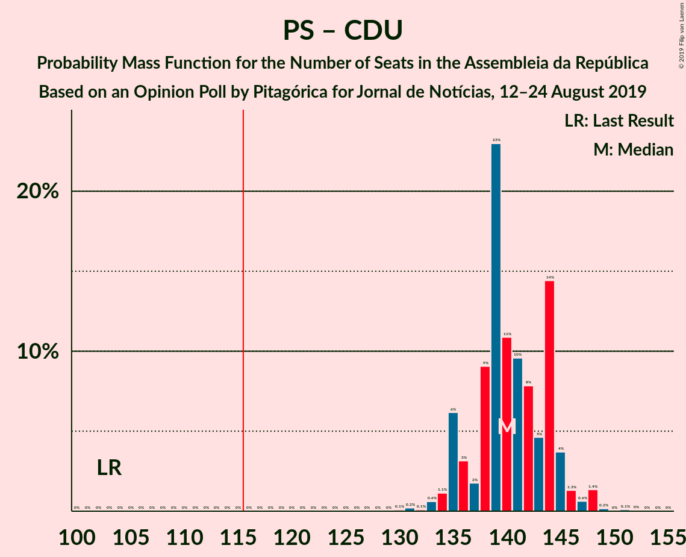

# Opinion Poll by Pitagórica for Jornal de Notícias, 12–24 August 2019

<a href="#voting-intentions">Voting Intentions</a> | <a href="#seats">Seats</a> | <a href="#coalitions">Coalitions</a> | <a href="#technical-information">Technical Information</a>

## Voting Intentions

### Confidence Intervals

| Party | Last Result | Poll Result | 80% Confidence Interval | 90% Confidence Interval | 95% Confidence Interval | 99% Confidence Interval |
|:-----:|:-----------:|:-----------:|:-----------------------:|:-----------------------:|:-----------------------:|:-----------------------:|
| Partido Socialista | 32.3% | 43.6% | 42.0–45.3% |41.5–45.7% |41.1–46.1% |40.4–46.9% |
| Partido Social Democrata | 36.9% | 20.4% | 19.1–21.8% |18.7–22.2% |18.4–22.5% |17.8–23.2% |
| Bloco de Esquerda | 10.2% | 10.0% | 9.1–11.1% |8.8–11.4% |8.6–11.6% |8.2–12.2% |
| Coligação Democrática Unitária | 8.2% | 6.6% | 5.9–7.5% |5.7–7.8% |5.5–8.0% |5.1–8.4% |
| CDS–Partido Popular | 36.9% | 4.9% | 4.3–5.7% |4.1–5.9% |3.9–6.1% |3.6–6.5% |
| Pessoas–Animais–Natureza | 1.4% | 3.2% | 2.7–3.9% |2.6–4.1% |2.4–4.2% |2.2–4.6% |
| Aliança | 0.0% | 1.5% | 1.2–2.0% |1.1–2.1% |1.0–2.3% |0.9–2.5% |
| Iniciativa Liberal | 0.0% | 1.3% | 1.0–1.8% |0.9–1.9% |0.9–2.0% |0.7–2.3% |
| LIVRE | 0.7% | 0.6% | 0.4–0.9% |0.4–1.0% |0.3–1.1% |0.2–1.3% |

*Note:* The poll result column reflects the actual value used in the calculations. Published results may vary slightly, and in addition be rounded to fewer digits.

## Seats

### Confidence Intervals

| Party | Last Result | Median | 80% Confidence Interval | 90% Confidence Interval | 95% Confidence Interval | 99% Confidence Interval |
|:-----:|:-----------:|:------:|:-----------------------:|:-----------------------:|:-----------------------:|:-----------------------:|
| <a href="#partido-socialista">Partido Socialista</a> | 86 | 129 | 124–133 |124–135 |120–135 |120–138 |
| <a href="#partido-social-democrata">Partido Social Democrata</a> | 89 | 58 | 53–60 |53–61 |52–62 |50–63 |
| <a href="#bloco-de-esquerda">Bloco de Esquerda</a> | 19 | 22 | 18–24 |18–26 |18–26 |17–28 |
| <a href="#coligação-democrática-unitária">Coligação Democrática Unitária</a> | 17 | 12 | 9–15 |9–16 |7–17 |7–18 |
| <a href="#cds–partido-popular">CDS–Partido Popular</a> | 18 | 6 | 6–7 |4–7 |4–10 |4–10 |
| <a href="#pessoas–animais–natureza">Pessoas–Animais–Natureza</a> | 1 | 4 | 3–6 |3–6 |2–6 |2–6 |
| <a href="#aliança">Aliança</a> | 0 | 0 | 0 |0–1 |0–2 |0–2 |
| <a href="#iniciativa-liberal">Iniciativa Liberal</a> | 0 | 0 | 0–1 |0–1 |0–1 |0–2 |
| <a href="#livre">LIVRE</a> | 0 | 0 | 0–1 |0–1 |0–1 |0–1 |

### Partido Socialista

*For a full overview of the results for this party, see the [Partido Socialista](party-partidosocialista.html) page.*

| Number of Seats | Probability | Accumulated | Special Marks |
|:---------------:|:-----------:|:-----------:|:-------------:|
| 86 | 0% | 100% | Last Result |
| 87 | 0% | 100% |  |
| 88 | 0% | 100% |  |
| 89 | 0% | 100% |  |
| 90 | 0% | 100% |  |
| 91 | 0% | 100% |  |
| 92 | 0% | 100% |  |
| 93 | 0% | 100% |  |
| 94 | 0% | 100% |  |
| 95 | 0% | 100% |  |
| 96 | 0% | 100% |  |
| 97 | 0% | 100% |  |
| 98 | 0% | 100% |  |
| 99 | 0% | 100% |  |
| 100 | 0% | 100% |  |
| 101 | 0% | 100% |  |
| 102 | 0% | 100% |  |
| 103 | 0% | 100% |  |
| 104 | 0% | 100% |  |
| 105 | 0% | 100% |  |
| 106 | 0% | 100% |  |
| 107 | 0% | 100% |  |
| 108 | 0% | 100% |  |
| 109 | 0% | 100% |  |
| 110 | 0% | 100% |  |
| 111 | 0% | 100% |  |
| 112 | 0% | 100% |  |
| 113 | 0% | 100% |  |
| 114 | 0% | 100% |  |
| 115 | 0% | 100% |  |
| 116 | 0% | 100% | Majority |
| 117 | 0.1% | 99.9% |  |
| 118 | 0.1% | 99.8% |  |
| 119 | 0.1% | 99.7% |  |
| 120 | 2% | 99.6% |  |
| 121 | 0.4% | 97% |  |
| 122 | 0.4% | 97% |  |
| 123 | 0.9% | 96% |  |
| 124 | 8% | 95% |  |
| 125 | 0.3% | 87% |  |
| 126 | 19% | 87% |  |
| 127 | 3% | 68% |  |
| 128 | 6% | 65% |  |
| 129 | 15% | 59% | Median |
| 130 | 8% | 44% |  |
| 131 | 22% | 36% |  |
| 132 | 4% | 15% |  |
| 133 | 2% | 10% |  |
| 134 | 3% | 9% |  |
| 135 | 4% | 6% |  |
| 136 | 0.7% | 2% |  |
| 137 | 0.8% | 1.4% |  |
| 138 | 0.3% | 0.6% |  |
| 139 | 0.1% | 0.3% |  |
| 140 | 0% | 0.2% |  |
| 141 | 0.1% | 0.2% |  |
| 142 | 0% | 0.1% |  |
| 143 | 0.1% | 0.1% |  |
| 144 | 0% | 0% |  |

### Partido Social Democrata

*For a full overview of the results for this party, see the [Partido Social Democrata](party-partidosocialdemocrata.html) page.*

| Number of Seats | Probability | Accumulated | Special Marks |
|:---------------:|:-----------:|:-----------:|:-------------:|
| 45 | 0.1% | 100% |  |
| 46 | 0% | 99.9% |  |
| 47 | 0.1% | 99.9% |  |
| 48 | 0.1% | 99.8% |  |
| 49 | 0.1% | 99.7% |  |
| 50 | 0.3% | 99.6% |  |
| 51 | 0.1% | 99.3% |  |
| 52 | 2% | 99.2% |  |
| 53 | 20% | 97% |  |
| 54 | 1.3% | 78% |  |
| 55 | 4% | 76% |  |
| 56 | 9% | 72% |  |
| 57 | 7% | 63% |  |
| 58 | 36% | 56% | Median |
| 59 | 10% | 20% |  |
| 60 | 0.8% | 11% |  |
| 61 | 6% | 10% |  |
| 62 | 3% | 3% |  |
| 63 | 0.2% | 0.7% |  |
| 64 | 0.2% | 0.5% |  |
| 65 | 0% | 0.3% |  |
| 66 | 0% | 0.2% |  |
| 67 | 0.1% | 0.2% |  |
| 68 | 0% | 0.1% |  |
| 69 | 0% | 0% |  |
| 70 | 0% | 0% |  |
| 71 | 0% | 0% |  |
| 72 | 0% | 0% |  |
| 73 | 0% | 0% |  |
| 74 | 0% | 0% |  |
| 75 | 0% | 0% |  |
| 76 | 0% | 0% |  |
| 77 | 0% | 0% |  |
| 78 | 0% | 0% |  |
| 79 | 0% | 0% |  |
| 80 | 0% | 0% |  |
| 81 | 0% | 0% |  |
| 82 | 0% | 0% |  |
| 83 | 0% | 0% |  |
| 84 | 0% | 0% |  |
| 85 | 0% | 0% |  |
| 86 | 0% | 0% |  |
| 87 | 0% | 0% |  |
| 88 | 0% | 0% |  |
| 89 | 0% | 0% | Last Result |

### Bloco de Esquerda

*For a full overview of the results for this party, see the [Bloco de Esquerda](party-blocodeesquerda.html) page.*

| Number of Seats | Probability | Accumulated | Special Marks |
|:---------------:|:-----------:|:-----------:|:-------------:|
| 16 | 0.2% | 100% |  |
| 17 | 2% | 99.8% |  |
| 18 | 13% | 98% |  |
| 19 | 4% | 85% | Last Result |
| 20 | 12% | 81% |  |
| 21 | 14% | 69% |  |
| 22 | 14% | 55% | Median |
| 23 | 4% | 41% |  |
| 24 | 28% | 38% |  |
| 25 | 0.4% | 10% |  |
| 26 | 8% | 9% |  |
| 27 | 0.3% | 2% |  |
| 28 | 1.2% | 1.3% |  |
| 29 | 0% | 0% |  |

### Coligação Democrática Unitária

*For a full overview of the results for this party, see the [Coligação Democrática Unitária](party-coligaçãodemocráticaunitária.html) page.*

| Number of Seats | Probability | Accumulated | Special Marks |
|:---------------:|:-----------:|:-----------:|:-------------:|
| 6 | 0.1% | 100% |  |
| 7 | 4% | 99.8% |  |
| 8 | 0.5% | 96% |  |
| 9 | 19% | 96% |  |
| 10 | 13% | 76% |  |
| 11 | 10% | 63% |  |
| 12 | 17% | 53% | Median |
| 13 | 16% | 36% |  |
| 14 | 7% | 20% |  |
| 15 | 6% | 13% |  |
| 16 | 4% | 7% |  |
| 17 | 1.3% | 3% | Last Result |
| 18 | 1.1% | 1.4% |  |
| 19 | 0.3% | 0.3% |  |
| 20 | 0% | 0% |  |

### CDS–Partido Popular

*For a full overview of the results for this party, see the [CDS–Partido Popular](party-cds–partidopopular.html) page.*

| Number of Seats | Probability | Accumulated | Special Marks |
|:---------------:|:-----------:|:-----------:|:-------------:|
| 2 | 0.1% | 100% |  |
| 3 | 0% | 99.9% |  |
| 4 | 10% | 99.9% |  |
| 5 | 0% | 90% |  |
| 6 | 48% | 90% | Median |
| 7 | 37% | 42% |  |
| 8 | 0.6% | 4% |  |
| 9 | 0.2% | 4% |  |
| 10 | 3% | 4% |  |
| 11 | 0.2% | 0.3% |  |
| 12 | 0% | 0.1% |  |
| 13 | 0.1% | 0.1% |  |
| 14 | 0% | 0% |  |
| 15 | 0% | 0% |  |
| 16 | 0% | 0% |  |
| 17 | 0% | 0% |  |
| 18 | 0% | 0% | Last Result |

### Pessoas–Animais–Natureza

*For a full overview of the results for this party, see the [Pessoas–Animais–Natureza](party-pessoas–animais–natureza.html) page.*

| Number of Seats | Probability | Accumulated | Special Marks |
|:---------------:|:-----------:|:-----------:|:-------------:|
| 1 | 0.1% | 100% | Last Result |
| 2 | 3% | 99.9% |  |
| 3 | 18% | 97% |  |
| 4 | 55% | 79% | Median |
| 5 | 8% | 24% |  |
| 6 | 16% | 16% |  |
| 7 | 0% | 0% |  |

### Aliança

*For a full overview of the results for this party, see the [Aliança](party-aliança.html) page.*

| Number of Seats | Probability | Accumulated | Special Marks |
|:---------------:|:-----------:|:-----------:|:-------------:|
| 0 | 93% | 100% | Last Result, Median |
| 1 | 3% | 7% |  |
| 2 | 4% | 4% |  |
| 3 | 0% | 0% |  |

### Iniciativa Liberal

*For a full overview of the results for this party, see the [Iniciativa Liberal](party-iniciativaliberal.html) page.*

| Number of Seats | Probability | Accumulated | Special Marks |
|:---------------:|:-----------:|:-----------:|:-------------:|
| 0 | 87% | 100% | Last Result, Median |
| 1 | 11% | 13% |  |
| 2 | 2% | 2% |  |
| 3 | 0% | 0% |  |

### LIVRE

*For a full overview of the results for this party, see the [LIVRE](party-livre.html) page.*

| Number of Seats | Probability | Accumulated | Special Marks |
|:---------------:|:-----------:|:-----------:|:-------------:|
| 0 | 88% | 100% | Last Result, Median |
| 1 | 12% | 12% |  |
| 2 | 0% | 0% |  |

## Coalitions

### Confidence Intervals

| Coalition | Last Result | Median | Majority? | 80% Confidence Interval | 90% Confidence Interval | 95% Confidence Interval | 99% Confidence Interval |
|:---------:|:-----------:|:------:|:---------:|:-----------------------:|:-----------------------:|:-----------------------:|:-----------------------:|
| Partido Socialista – Bloco de Esquerda – Coligação Democrática Unitária | 122 | 162 | 100% | 159–166 | 158–166 | 158–167 | 155–168 |
| Partido Socialista – Bloco de Esquerda | 105 | 150 | 100% | 146–155 | 146–155 | 144–157 | 141–159 |
| Partido Socialista – Coligação Democrática Unitária | 103 | 140 | 100% | 136–144 | 136–146 | 134–148 | 133–149 |
| Partido Socialista | 86 | 129 | 100% | 124–133 | 124–135 | 120–135 | 120–138 |
| Partido Social Democrata – CDS–Partido Popular | 107 | 64 | 0% | 60–67 | 60–67 | 59–68 | 57–70 |

### Partido Socialista – Bloco de Esquerda – Coligação Democrática Unitária

| Number of Seats | Probability | Accumulated | Special Marks |
|:---------------:|:-----------:|:-----------:|:-------------:|
| 122 | 0% | 100% | Last Result |
| 123 | 0% | 100% |  |
| 124 | 0% | 100% |  |
| 125 | 0% | 100% |  |
| 126 | 0% | 100% |  |
| 127 | 0% | 100% |  |
| 128 | 0% | 100% |  |
| 129 | 0% | 100% |  |
| 130 | 0% | 100% |  |
| 131 | 0% | 100% |  |
| 132 | 0% | 100% |  |
| 133 | 0% | 100% |  |
| 134 | 0% | 100% |  |
| 135 | 0% | 100% |  |
| 136 | 0% | 100% |  |
| 137 | 0% | 100% |  |
| 138 | 0% | 100% |  |
| 139 | 0% | 100% |  |
| 140 | 0% | 100% |  |
| 141 | 0% | 100% |  |
| 142 | 0% | 100% |  |
| 143 | 0% | 100% |  |
| 144 | 0% | 100% |  |
| 145 | 0% | 100% |  |
| 146 | 0% | 100% |  |
| 147 | 0% | 100% |  |
| 148 | 0% | 100% |  |
| 149 | 0% | 100% |  |
| 150 | 0% | 100% |  |
| 151 | 0.1% | 100% |  |
| 152 | 0.2% | 99.9% |  |
| 153 | 0% | 99.7% |  |
| 154 | 0.2% | 99.7% |  |
| 155 | 0.3% | 99.5% |  |
| 156 | 0.1% | 99.3% |  |
| 157 | 1.4% | 99.1% |  |
| 158 | 5% | 98% |  |
| 159 | 5% | 93% |  |
| 160 | 8% | 88% |  |
| 161 | 6% | 80% |  |
| 162 | 46% | 73% |  |
| 163 | 2% | 27% | Median |
| 164 | 5% | 25% |  |
| 165 | 2% | 20% |  |
| 166 | 14% | 19% |  |
| 167 | 2% | 4% |  |
| 168 | 1.5% | 2% |  |
| 169 | 0.1% | 0.5% |  |
| 170 | 0.1% | 0.4% |  |
| 171 | 0% | 0.3% |  |
| 172 | 0.1% | 0.2% |  |
| 173 | 0% | 0.1% |  |
| 174 | 0.1% | 0.1% |  |
| 175 | 0% | 0% |  |

### Partido Socialista – Bloco de Esquerda

| Number of Seats | Probability | Accumulated | Special Marks |
|:---------------:|:-----------:|:-----------:|:-------------:|
| 105 | 0% | 100% | Last Result |
| 106 | 0% | 100% |  |
| 107 | 0% | 100% |  |
| 108 | 0% | 100% |  |
| 109 | 0% | 100% |  |
| 110 | 0% | 100% |  |
| 111 | 0% | 100% |  |
| 112 | 0% | 100% |  |
| 113 | 0% | 100% |  |
| 114 | 0% | 100% |  |
| 115 | 0% | 100% |  |
| 116 | 0% | 100% | Majority |
| 117 | 0% | 100% |  |
| 118 | 0% | 100% |  |
| 119 | 0% | 100% |  |
| 120 | 0% | 100% |  |
| 121 | 0% | 100% |  |
| 122 | 0% | 100% |  |
| 123 | 0% | 100% |  |
| 124 | 0% | 100% |  |
| 125 | 0% | 100% |  |
| 126 | 0% | 100% |  |
| 127 | 0% | 100% |  |
| 128 | 0% | 100% |  |
| 129 | 0% | 100% |  |
| 130 | 0% | 100% |  |
| 131 | 0% | 100% |  |
| 132 | 0% | 100% |  |
| 133 | 0% | 100% |  |
| 134 | 0% | 100% |  |
| 135 | 0% | 100% |  |
| 136 | 0% | 100% |  |
| 137 | 0.1% | 100% |  |
| 138 | 0.1% | 99.9% |  |
| 139 | 0.1% | 99.8% |  |
| 140 | 0.2% | 99.7% |  |
| 141 | 0.2% | 99.5% |  |
| 142 | 0.1% | 99.3% |  |
| 143 | 1.4% | 99.3% |  |
| 144 | 0.4% | 98% |  |
| 145 | 0.8% | 97% |  |
| 146 | 9% | 97% |  |
| 147 | 9% | 88% |  |
| 148 | 5% | 78% |  |
| 149 | 4% | 74% |  |
| 150 | 24% | 70% |  |
| 151 | 3% | 46% | Median |
| 152 | 6% | 43% |  |
| 153 | 19% | 36% |  |
| 154 | 4% | 18% |  |
| 155 | 9% | 13% |  |
| 156 | 0.9% | 4% |  |
| 157 | 1.5% | 3% |  |
| 158 | 0.3% | 1.3% |  |
| 159 | 0.6% | 0.9% |  |
| 160 | 0.2% | 0.3% |  |
| 161 | 0.1% | 0.2% |  |
| 162 | 0% | 0% |  |

### Partido Socialista – Coligação Democrática Unitária

| Number of Seats | Probability | Accumulated | Special Marks |
|:---------------:|:-----------:|:-----------:|:-------------:|
| 103 | 0% | 100% | Last Result |
| 104 | 0% | 100% |  |
| 105 | 0% | 100% |  |
| 106 | 0% | 100% |  |
| 107 | 0% | 100% |  |
| 108 | 0% | 100% |  |
| 109 | 0% | 100% |  |
| 110 | 0% | 100% |  |
| 111 | 0% | 100% |  |
| 112 | 0% | 100% |  |
| 113 | 0% | 100% |  |
| 114 | 0% | 100% |  |
| 115 | 0% | 100% |  |
| 116 | 0% | 100% | Majority |
| 117 | 0% | 100% |  |
| 118 | 0% | 100% |  |
| 119 | 0% | 100% |  |
| 120 | 0% | 100% |  |
| 121 | 0% | 100% |  |
| 122 | 0% | 100% |  |
| 123 | 0% | 100% |  |
| 124 | 0% | 100% |  |
| 125 | 0% | 100% |  |
| 126 | 0% | 100% |  |
| 127 | 0% | 100% |  |
| 128 | 0% | 100% |  |
| 129 | 0% | 100% |  |
| 130 | 0.1% | 99.9% |  |
| 131 | 0.1% | 99.9% |  |
| 132 | 0.1% | 99.8% |  |
| 133 | 1.3% | 99.7% |  |
| 134 | 1.4% | 98% |  |
| 135 | 0.5% | 97% |  |
| 136 | 7% | 96% |  |
| 137 | 3% | 89% |  |
| 138 | 14% | 87% |  |
| 139 | 14% | 73% |  |
| 140 | 17% | 59% |  |
| 141 | 6% | 42% | Median |
| 142 | 13% | 36% |  |
| 143 | 4% | 22% |  |
| 144 | 10% | 18% |  |
| 145 | 1.3% | 8% |  |
| 146 | 2% | 6% |  |
| 147 | 1.5% | 4% |  |
| 148 | 2% | 3% |  |
| 149 | 0.3% | 0.6% |  |
| 150 | 0% | 0.3% |  |
| 151 | 0.2% | 0.3% |  |
| 152 | 0.1% | 0.1% |  |
| 153 | 0% | 0% |  |

### Partido Socialista

| Number of Seats | Probability | Accumulated | Special Marks |
|:---------------:|:-----------:|:-----------:|:-------------:|
| 86 | 0% | 100% | Last Result |
| 87 | 0% | 100% |  |
| 88 | 0% | 100% |  |
| 89 | 0% | 100% |  |
| 90 | 0% | 100% |  |
| 91 | 0% | 100% |  |
| 92 | 0% | 100% |  |
| 93 | 0% | 100% |  |
| 94 | 0% | 100% |  |
| 95 | 0% | 100% |  |
| 96 | 0% | 100% |  |
| 97 | 0% | 100% |  |
| 98 | 0% | 100% |  |
| 99 | 0% | 100% |  |
| 100 | 0% | 100% |  |
| 101 | 0% | 100% |  |
| 102 | 0% | 100% |  |
| 103 | 0% | 100% |  |
| 104 | 0% | 100% |  |
| 105 | 0% | 100% |  |
| 106 | 0% | 100% |  |
| 107 | 0% | 100% |  |
| 108 | 0% | 100% |  |
| 109 | 0% | 100% |  |
| 110 | 0% | 100% |  |
| 111 | 0% | 100% |  |
| 112 | 0% | 100% |  |
| 113 | 0% | 100% |  |
| 114 | 0% | 100% |  |
| 115 | 0% | 100% |  |
| 116 | 0% | 100% | Majority |
| 117 | 0.1% | 99.9% |  |
| 118 | 0.1% | 99.8% |  |
| 119 | 0.1% | 99.7% |  |
| 120 | 2% | 99.6% |  |
| 121 | 0.4% | 97% |  |
| 122 | 0.4% | 97% |  |
| 123 | 0.9% | 96% |  |
| 124 | 8% | 95% |  |
| 125 | 0.3% | 87% |  |
| 126 | 19% | 87% |  |
| 127 | 3% | 68% |  |
| 128 | 6% | 65% |  |
| 129 | 15% | 59% | Median |
| 130 | 8% | 44% |  |
| 131 | 22% | 36% |  |
| 132 | 4% | 15% |  |
| 133 | 2% | 10% |  |
| 134 | 3% | 9% |  |
| 135 | 4% | 6% |  |
| 136 | 0.7% | 2% |  |
| 137 | 0.8% | 1.4% |  |
| 138 | 0.3% | 0.6% |  |
| 139 | 0.1% | 0.3% |  |
| 140 | 0% | 0.2% |  |
| 141 | 0.1% | 0.2% |  |
| 142 | 0% | 0.1% |  |
| 143 | 0.1% | 0.1% |  |
| 144 | 0% | 0% |  |

### Partido Social Democrata – CDS–Partido Popular

| Number of Seats | Probability | Accumulated | Special Marks |
|:---------------:|:-----------:|:-----------:|:-------------:|
| 53 | 0.1% | 100% |  |
| 54 | 0% | 99.9% |  |
| 55 | 0.2% | 99.8% |  |
| 56 | 0% | 99.7% |  |
| 57 | 0.2% | 99.6% |  |
| 58 | 0.1% | 99.4% |  |
| 59 | 2% | 99.3% |  |
| 60 | 20% | 97% |  |
| 61 | 4% | 77% |  |
| 62 | 4% | 74% |  |
| 63 | 15% | 69% |  |
| 64 | 36% | 54% | Median |
| 65 | 6% | 18% |  |
| 66 | 1.0% | 12% |  |
| 67 | 7% | 11% |  |
| 68 | 3% | 5% |  |
| 69 | 2% | 2% |  |
| 70 | 0.1% | 0.6% |  |
| 71 | 0% | 0.4% |  |
| 72 | 0% | 0.4% |  |
| 73 | 0.1% | 0.4% |  |
| 74 | 0.3% | 0.3% |  |
| 75 | 0% | 0% |  |
| 76 | 0% | 0% |  |
| 77 | 0% | 0% |  |
| 78 | 0% | 0% |  |
| 79 | 0% | 0% |  |
| 80 | 0% | 0% |  |
| 81 | 0% | 0% |  |
| 82 | 0% | 0% |  |
| 83 | 0% | 0% |  |
| 84 | 0% | 0% |  |
| 85 | 0% | 0% |  |
| 86 | 0% | 0% |  |
| 87 | 0% | 0% |  |
| 88 | 0% | 0% |  |
| 89 | 0% | 0% |  |
| 90 | 0% | 0% |  |
| 91 | 0% | 0% |  |
| 92 | 0% | 0% |  |
| 93 | 0% | 0% |  |
| 94 | 0% | 0% |  |
| 95 | 0% | 0% |  |
| 96 | 0% | 0% |  |
| 97 | 0% | 0% |  |
| 98 | 0% | 0% |  |
| 99 | 0% | 0% |  |
| 100 | 0% | 0% |  |
| 101 | 0% | 0% |  |
| 102 | 0% | 0% |  |
| 103 | 0% | 0% |  |
| 104 | 0% | 0% |  |
| 105 | 0% | 0% |  |
| 106 | 0% | 0% |  |
| 107 | 0% | 0% | Last Result |

## Technical Information

### Opinion Poll

+ **Polling firm:** Pitagórica
+ **Commissioner(s):** Jornal de Notícias
+ **Fieldwork period:** 12–24 August 2019

### Calculations

+ **Sample size:** 1525
+ **Simulations done:** 65,536
+ **Error estimate:** 2.21%

