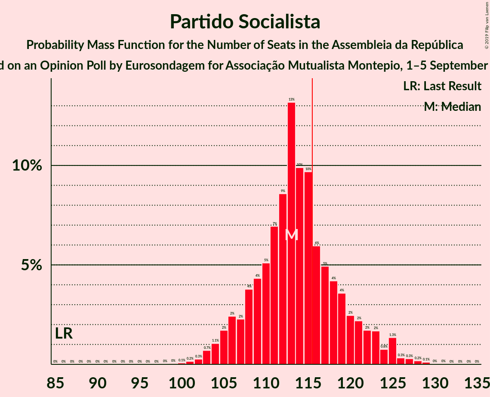
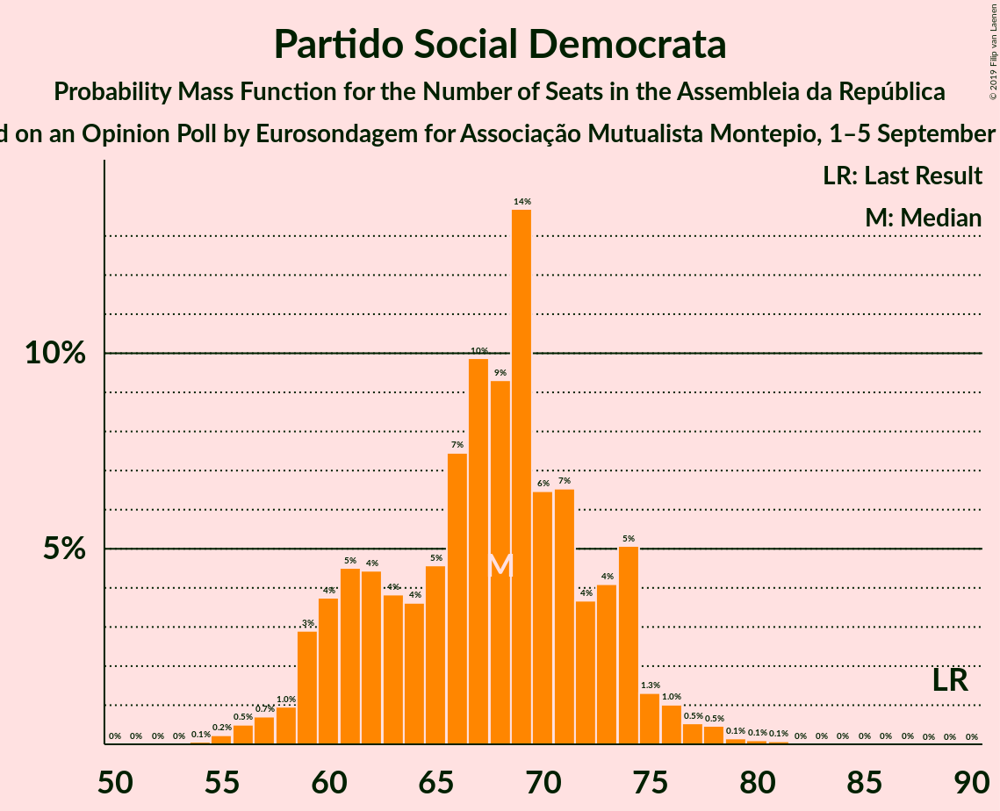
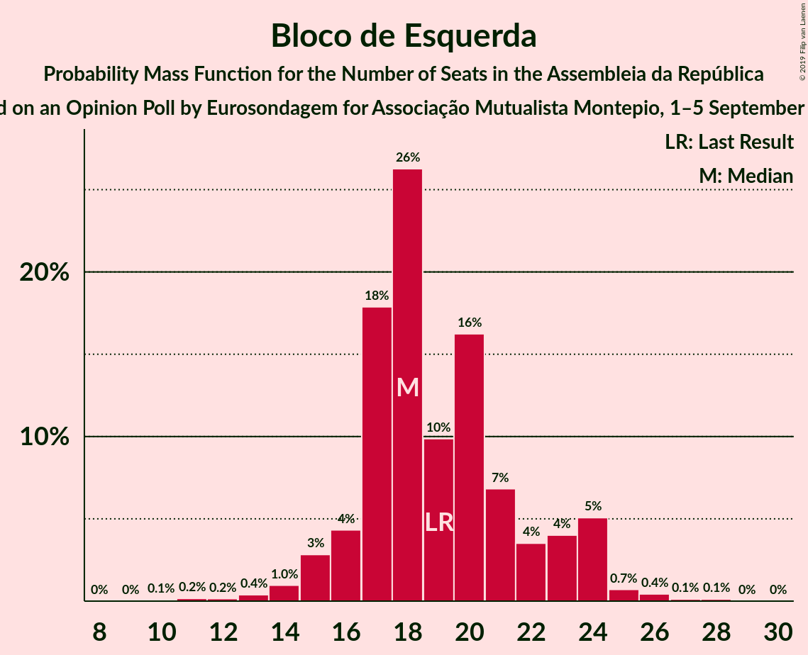
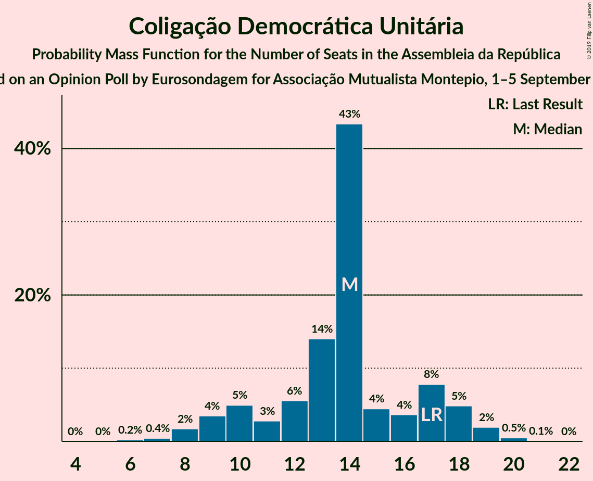

# Opinion Poll by Eurosondagem for Associação Mutualista Montepio, 1–5 September 2019

<a href="#voting-intentions">Voting Intentions</a> | <a href="#seats">Seats</a> | <a href="#coalitions">Coalitions</a> | <a href="#technical-information">Technical Information</a>

## Voting Intentions

### Confidence Intervals

| Party | Last Result | Poll Result | 80% Confidence Interval | 90% Confidence Interval | 95% Confidence Interval | 99% Confidence Interval |
|:-----:|:-----------:|:-----------:|:-----------------------:|:-----------------------:|:-----------------------:|:-----------------------:|
| Partido Socialista | 32.3% | 38.1% | 36.1–40.0% |35.6–40.6% |35.1–41.1% |34.2–42.0% |
| Partido Social Democrata | 36.9% | 23.3% | 21.6–25.1% |21.2–25.5% |20.8–26.0% |20.0–26.8% |
| Bloco de Esquerda | 10.2% | 9.0% | 7.9–10.3% |7.7–10.6% |7.4–10.9% |6.9–11.6% |
| Coligação Democrática Unitária | 8.2% | 6.9% | 6.0–8.1% |5.8–8.4% |5.5–8.7% |5.1–9.3% |
| CDS–Partido Popular | 36.9% | 6.0% | 5.1–7.0% |4.9–7.3% |4.7–7.6% |4.3–8.1% |
| Pessoas–Animais–Natureza | 1.4% | 4.4% | 3.7–5.3% |3.5–5.6% |3.3–5.9% |3.0–6.3% |
| Aliança | 0.0% | 1.7% | 1.2–2.3% |1.1–2.5% |1.0–2.7% |0.9–3.0% |

*Note:* The poll result column reflects the actual value used in the calculations. Published results may vary slightly, and in addition be rounded to fewer digits.

## Seats

### Confidence Intervals

| Party | Last Result | Median | 80% Confidence Interval | 90% Confidence Interval | 95% Confidence Interval | 99% Confidence Interval |
|:-----:|:-----------:|:------:|:-----------------------:|:-----------------------:|:-----------------------:|:-----------------------:|
| <a href="#partido-socialista">Partido Socialista</a> | 86 | 113 | 108–120 |106–123 |105–125 |102–126 |
| <a href="#partido-social-democrata">Partido Social Democrata</a> | 89 | 69 | 61–73 |59–74 |58–76 |56–78 |
| <a href="#bloco-de-esquerda">Bloco de Esquerda</a> | 19 | 18 | 16–21 |16–24 |15–24 |13–25 |
| <a href="#coligação-democrática-unitária">Coligação Democrática Unitária</a> | 17 | 14 | 10–18 |9–18 |8–18 |7–20 |
| <a href="#cds–partido-popular">CDS–Partido Popular</a> | 18 | 9 | 8–12 |7–13 |6–15 |6–18 |
| <a href="#pessoas–animais–natureza">Pessoas–Animais–Natureza</a> | 1 | 6 | 4–8 |4–8 |4–9 |3–11 |
| <a href="#aliança">Aliança</a> | 0 | 0 | 0–2 |0–2 |0–2 |0–2 |

### Partido Socialista

*For a full overview of the results for this party, see the [Partido Socialista](party-partidosocialista.html) page.*

| Number of Seats | Probability | Accumulated | Special Marks |
|:---------------:|:-----------:|:-----------:|:-------------:|
| 86 | 0% | 100% | Last Result |
| 87 | 0% | 100% |  |
| 88 | 0% | 100% |  |
| 89 | 0% | 100% |  |
| 90 | 0% | 100% |  |
| 91 | 0% | 100% |  |
| 92 | 0% | 100% |  |
| 93 | 0% | 100% |  |
| 94 | 0% | 100% |  |
| 95 | 0% | 100% |  |
| 96 | 0% | 100% |  |
| 97 | 0% | 100% |  |
| 98 | 0% | 100% |  |
| 99 | 0% | 100% |  |
| 100 | 0.1% | 99.9% |  |
| 101 | 0.1% | 99.9% |  |
| 102 | 0.3% | 99.8% |  |
| 103 | 0.3% | 99.4% |  |
| 104 | 1.3% | 99.2% |  |
| 105 | 2% | 98% |  |
| 106 | 3% | 96% |  |
| 107 | 0.9% | 93% |  |
| 108 | 3% | 92% |  |
| 109 | 2% | 88% |  |
| 110 | 8% | 86% |  |
| 111 | 3% | 79% |  |
| 112 | 12% | 75% |  |
| 113 | 18% | 64% | Median |
| 114 | 9% | 46% |  |
| 115 | 9% | 37% |  |
| 116 | 7% | 27% | Majority |
| 117 | 4% | 20% |  |
| 118 | 3% | 15% |  |
| 119 | 2% | 12% |  |
| 120 | 0.8% | 11% |  |
| 121 | 3% | 10% |  |
| 122 | 0.7% | 7% |  |
| 123 | 1.2% | 6% |  |
| 124 | 2% | 5% |  |
| 125 | 3% | 3% |  |
| 126 | 0.3% | 0.7% |  |
| 127 | 0.1% | 0.4% |  |
| 128 | 0.1% | 0.2% |  |
| 129 | 0% | 0.1% |  |
| 130 | 0.1% | 0.1% |  |
| 131 | 0% | 0.1% |  |
| 132 | 0% | 0% |  |

### Partido Social Democrata

*For a full overview of the results for this party, see the [Partido Social Democrata](party-partidosocialdemocrata.html) page.*

| Number of Seats | Probability | Accumulated | Special Marks |
|:---------------:|:-----------:|:-----------:|:-------------:|
| 54 | 0.1% | 100% |  |
| 55 | 0.2% | 99.9% |  |
| 56 | 0.6% | 99.8% |  |
| 57 | 0.7% | 99.1% |  |
| 58 | 2% | 98% |  |
| 59 | 4% | 97% |  |
| 60 | 2% | 93% |  |
| 61 | 4% | 91% |  |
| 62 | 2% | 87% |  |
| 63 | 1.2% | 86% |  |
| 64 | 2% | 84% |  |
| 65 | 9% | 82% |  |
| 66 | 7% | 73% |  |
| 67 | 7% | 65% |  |
| 68 | 8% | 58% |  |
| 69 | 23% | 50% | Median |
| 70 | 3% | 27% |  |
| 71 | 8% | 24% |  |
| 72 | 4% | 15% |  |
| 73 | 3% | 11% |  |
| 74 | 4% | 8% |  |
| 75 | 1.3% | 4% |  |
| 76 | 2% | 3% |  |
| 77 | 0.2% | 1.1% |  |
| 78 | 0.6% | 0.9% |  |
| 79 | 0.1% | 0.2% |  |
| 80 | 0.1% | 0.1% |  |
| 81 | 0% | 0% |  |
| 82 | 0% | 0% |  |
| 83 | 0% | 0% |  |
| 84 | 0% | 0% |  |
| 85 | 0% | 0% |  |
| 86 | 0% | 0% |  |
| 87 | 0% | 0% |  |
| 88 | 0% | 0% |  |
| 89 | 0% | 0% | Last Result |

### Bloco de Esquerda

*For a full overview of the results for this party, see the [Bloco de Esquerda](party-blocodeesquerda.html) page.*

| Number of Seats | Probability | Accumulated | Special Marks |
|:---------------:|:-----------:|:-----------:|:-------------:|
| 10 | 0.1% | 100% |  |
| 11 | 0.2% | 99.9% |  |
| 12 | 0.1% | 99.7% |  |
| 13 | 0.3% | 99.6% |  |
| 14 | 0.5% | 99.2% |  |
| 15 | 3% | 98.7% |  |
| 16 | 7% | 95% |  |
| 17 | 13% | 88% |  |
| 18 | 36% | 75% | Median |
| 19 | 6% | 39% | Last Result |
| 20 | 14% | 33% |  |
| 21 | 10% | 20% |  |
| 22 | 1.2% | 10% |  |
| 23 | 2% | 9% |  |
| 24 | 6% | 7% |  |
| 25 | 0.7% | 1.2% |  |
| 26 | 0.2% | 0.5% |  |
| 27 | 0.2% | 0.3% |  |
| 28 | 0.1% | 0.1% |  |
| 29 | 0% | 0% |  |

### Coligação Democrática Unitária

*For a full overview of the results for this party, see the [Coligação Democrática Unitária](party-coligaçãodemocráticaunitária.html) page.*

| Number of Seats | Probability | Accumulated | Special Marks |
|:---------------:|:-----------:|:-----------:|:-------------:|
| 6 | 0.2% | 100% |  |
| 7 | 0.6% | 99.8% |  |
| 8 | 2% | 99.1% |  |
| 9 | 3% | 97% |  |
| 10 | 5% | 95% |  |
| 11 | 3% | 89% |  |
| 12 | 6% | 87% |  |
| 13 | 13% | 81% |  |
| 14 | 41% | 68% | Median |
| 15 | 7% | 27% |  |
| 16 | 2% | 20% |  |
| 17 | 8% | 18% | Last Result |
| 18 | 8% | 10% |  |
| 19 | 2% | 2% |  |
| 20 | 0.7% | 0.7% |  |
| 21 | 0.1% | 0.1% |  |
| 22 | 0% | 0% |  |

### CDS–Partido Popular

*For a full overview of the results for this party, see the [CDS–Partido Popular](party-cds–partidopopular.html) page.*

| Number of Seats | Probability | Accumulated | Special Marks |
|:---------------:|:-----------:|:-----------:|:-------------:|
| 5 | 0% | 100% |  |
| 6 | 4% | 99.9% |  |
| 7 | 6% | 96% |  |
| 8 | 33% | 90% |  |
| 9 | 13% | 57% | Median |
| 10 | 20% | 45% |  |
| 11 | 9% | 25% |  |
| 12 | 9% | 17% |  |
| 13 | 4% | 7% |  |
| 14 | 0.7% | 3% |  |
| 15 | 1.3% | 3% |  |
| 16 | 0.4% | 1.5% |  |
| 17 | 0.4% | 1.1% |  |
| 18 | 0.4% | 0.7% | Last Result |
| 19 | 0.3% | 0.4% |  |
| 20 | 0% | 0% |  |

### Pessoas–Animais–Natureza

*For a full overview of the results for this party, see the [Pessoas–Animais–Natureza](party-pessoas–animais–natureza.html) page.*

| Number of Seats | Probability | Accumulated | Special Marks |
|:---------------:|:-----------:|:-----------:|:-------------:|
| 1 | 0% | 100% | Last Result |
| 2 | 0% | 100% |  |
| 3 | 0.7% | 100% |  |
| 4 | 10% | 99.2% |  |
| 5 | 3% | 89% |  |
| 6 | 66% | 86% | Median |
| 7 | 4% | 20% |  |
| 8 | 11% | 15% |  |
| 9 | 3% | 4% |  |
| 10 | 0.6% | 1.2% |  |
| 11 | 0.2% | 0.5% |  |
| 12 | 0.1% | 0.4% |  |
| 13 | 0.2% | 0.2% |  |
| 14 | 0% | 0% |  |

### Aliança

*For a full overview of the results for this party, see the [Aliança](party-aliança.html) page.*

| Number of Seats | Probability | Accumulated | Special Marks |
|:---------------:|:-----------:|:-----------:|:-------------:|
| 0 | 80% | 100% | Last Result, Median |
| 1 | 0.8% | 20% |  |
| 2 | 19% | 19% |  |
| 3 | 0% | 0.1% |  |
| 4 | 0% | 0% |  |

## Coalitions

### Confidence Intervals

| Coalition | Last Result | Median | Majority? | 80% Confidence Interval | 90% Confidence Interval | 95% Confidence Interval | 99% Confidence Interval |
|:---------:|:-----------:|:------:|:---------:|:-----------------------:|:-----------------------:|:-----------------------:|:-----------------------:|
| Partido Socialista – Bloco de Esquerda – Coligação Democrática Unitária | 122 | 146 | 100% | 141–153 | 139–156 | 137–157 | 135–158 |
| Partido Socialista – Bloco de Esquerda | 105 | 132 | 100% | 127–139 | 125–142 | 123–143 | 121–146 |
| Partido Socialista – Coligação Democrática Unitária | 103 | 127 | 99.6% | 122–134 | 120–137 | 118–139 | 116–139 |
| Partido Socialista | 86 | 113 | 27% | 108–120 | 106–123 | 105–125 | 102–126 |
| Partido Social Democrata – CDS–Partido Popular | 107 | 78 | 0% | 70–82 | 68–84 | 67–86 | 65–88 |

### Partido Socialista – Bloco de Esquerda – Coligação Democrática Unitária

| Number of Seats | Probability | Accumulated | Special Marks |
|:---------------:|:-----------:|:-----------:|:-------------:|
| 122 | 0% | 100% | Last Result |
| 123 | 0% | 100% |  |
| 124 | 0% | 100% |  |
| 125 | 0% | 100% |  |
| 126 | 0% | 100% |  |
| 127 | 0% | 100% |  |
| 128 | 0% | 100% |  |
| 129 | 0% | 100% |  |
| 130 | 0% | 100% |  |
| 131 | 0% | 100% |  |
| 132 | 0% | 99.9% |  |
| 133 | 0.1% | 99.9% |  |
| 134 | 0.1% | 99.8% |  |
| 135 | 0.3% | 99.7% |  |
| 136 | 0.6% | 99.4% |  |
| 137 | 2% | 98.7% |  |
| 138 | 1.3% | 97% |  |
| 139 | 2% | 96% |  |
| 140 | 3% | 94% |  |
| 141 | 3% | 91% |  |
| 142 | 9% | 88% |  |
| 143 | 7% | 80% |  |
| 144 | 6% | 72% |  |
| 145 | 13% | 66% | Median |
| 146 | 6% | 53% |  |
| 147 | 16% | 47% |  |
| 148 | 6% | 31% |  |
| 149 | 1.2% | 25% |  |
| 150 | 2% | 24% |  |
| 151 | 6% | 21% |  |
| 152 | 4% | 15% |  |
| 153 | 2% | 11% |  |
| 154 | 1.3% | 9% |  |
| 155 | 1.2% | 8% |  |
| 156 | 3% | 7% |  |
| 157 | 3% | 4% |  |
| 158 | 0.5% | 1.0% |  |
| 159 | 0.1% | 0.5% |  |
| 160 | 0.4% | 0.4% |  |
| 161 | 0% | 0% |  |

### Partido Socialista – Bloco de Esquerda

| Number of Seats | Probability | Accumulated | Special Marks |
|:---------------:|:-----------:|:-----------:|:-------------:|
| 105 | 0% | 100% | Last Result |
| 106 | 0% | 100% |  |
| 107 | 0% | 100% |  |
| 108 | 0% | 100% |  |
| 109 | 0% | 100% |  |
| 110 | 0% | 100% |  |
| 111 | 0% | 100% |  |
| 112 | 0% | 100% |  |
| 113 | 0% | 100% |  |
| 114 | 0% | 100% |  |
| 115 | 0% | 100% |  |
| 116 | 0% | 100% | Majority |
| 117 | 0% | 100% |  |
| 118 | 0% | 99.9% |  |
| 119 | 0.1% | 99.9% |  |
| 120 | 0.2% | 99.8% |  |
| 121 | 0.3% | 99.6% |  |
| 122 | 1.0% | 99.3% |  |
| 123 | 1.0% | 98% |  |
| 124 | 1.0% | 97% |  |
| 125 | 2% | 96% |  |
| 126 | 3% | 95% |  |
| 127 | 5% | 92% |  |
| 128 | 4% | 87% |  |
| 129 | 3% | 82% |  |
| 130 | 13% | 79% |  |
| 131 | 15% | 66% | Median |
| 132 | 5% | 51% |  |
| 133 | 14% | 46% |  |
| 134 | 5% | 32% |  |
| 135 | 3% | 27% |  |
| 136 | 4% | 23% |  |
| 137 | 6% | 19% |  |
| 138 | 2% | 13% |  |
| 139 | 2% | 11% |  |
| 140 | 0.7% | 9% |  |
| 141 | 0.9% | 8% |  |
| 142 | 2% | 7% |  |
| 143 | 3% | 4% |  |
| 144 | 1.0% | 2% |  |
| 145 | 0% | 0.7% |  |
| 146 | 0.2% | 0.7% |  |
| 147 | 0.3% | 0.4% |  |
| 148 | 0.1% | 0.2% |  |
| 149 | 0% | 0.1% |  |
| 150 | 0% | 0% |  |

### Partido Socialista – Coligação Democrática Unitária

| Number of Seats | Probability | Accumulated | Special Marks |
|:---------------:|:-----------:|:-----------:|:-------------:|
| 103 | 0% | 100% | Last Result |
| 104 | 0% | 100% |  |
| 105 | 0% | 100% |  |
| 106 | 0% | 100% |  |
| 107 | 0% | 100% |  |
| 108 | 0% | 100% |  |
| 109 | 0% | 100% |  |
| 110 | 0% | 100% |  |
| 111 | 0% | 100% |  |
| 112 | 0% | 100% |  |
| 113 | 0.1% | 100% |  |
| 114 | 0.1% | 99.9% |  |
| 115 | 0.1% | 99.7% |  |
| 116 | 0.3% | 99.6% | Majority |
| 117 | 1.4% | 99.3% |  |
| 118 | 0.5% | 98% |  |
| 119 | 2% | 97% |  |
| 120 | 1.0% | 95% |  |
| 121 | 3% | 94% |  |
| 122 | 5% | 91% |  |
| 123 | 2% | 86% |  |
| 124 | 5% | 84% |  |
| 125 | 10% | 79% |  |
| 126 | 10% | 69% |  |
| 127 | 20% | 60% | Median |
| 128 | 3% | 39% |  |
| 129 | 9% | 36% |  |
| 130 | 2% | 27% |  |
| 131 | 4% | 25% |  |
| 132 | 4% | 21% |  |
| 133 | 2% | 17% |  |
| 134 | 6% | 16% |  |
| 135 | 2% | 9% |  |
| 136 | 2% | 7% |  |
| 137 | 1.1% | 5% |  |
| 138 | 0.8% | 4% |  |
| 139 | 3% | 3% |  |
| 140 | 0.2% | 0.4% |  |
| 141 | 0.1% | 0.2% |  |
| 142 | 0.1% | 0.1% |  |
| 143 | 0% | 0.1% |  |
| 144 | 0% | 0% |  |

### Partido Socialista

| Number of Seats | Probability | Accumulated | Special Marks |
|:---------------:|:-----------:|:-----------:|:-------------:|
| 86 | 0% | 100% | Last Result |
| 87 | 0% | 100% |  |
| 88 | 0% | 100% |  |
| 89 | 0% | 100% |  |
| 90 | 0% | 100% |  |
| 91 | 0% | 100% |  |
| 92 | 0% | 100% |  |
| 93 | 0% | 100% |  |
| 94 | 0% | 100% |  |
| 95 | 0% | 100% |  |
| 96 | 0% | 100% |  |
| 97 | 0% | 100% |  |
| 98 | 0% | 100% |  |
| 99 | 0% | 100% |  |
| 100 | 0.1% | 99.9% |  |
| 101 | 0.1% | 99.9% |  |
| 102 | 0.3% | 99.8% |  |
| 103 | 0.3% | 99.4% |  |
| 104 | 1.3% | 99.2% |  |
| 105 | 2% | 98% |  |
| 106 | 3% | 96% |  |
| 107 | 0.9% | 93% |  |
| 108 | 3% | 92% |  |
| 109 | 2% | 88% |  |
| 110 | 8% | 86% |  |
| 111 | 3% | 79% |  |
| 112 | 12% | 75% |  |
| 113 | 18% | 64% | Median |
| 114 | 9% | 46% |  |
| 115 | 9% | 37% |  |
| 116 | 7% | 27% | Majority |
| 117 | 4% | 20% |  |
| 118 | 3% | 15% |  |
| 119 | 2% | 12% |  |
| 120 | 0.8% | 11% |  |
| 121 | 3% | 10% |  |
| 122 | 0.7% | 7% |  |
| 123 | 1.2% | 6% |  |
| 124 | 2% | 5% |  |
| 125 | 3% | 3% |  |
| 126 | 0.3% | 0.7% |  |
| 127 | 0.1% | 0.4% |  |
| 128 | 0.1% | 0.2% |  |
| 129 | 0% | 0.1% |  |
| 130 | 0.1% | 0.1% |  |
| 131 | 0% | 0.1% |  |
| 132 | 0% | 0% |  |

### Partido Social Democrata – CDS–Partido Popular

| Number of Seats | Probability | Accumulated | Special Marks |
|:---------------:|:-----------:|:-----------:|:-------------:|
| 63 | 0% | 100% |  |
| 64 | 0.1% | 99.9% |  |
| 65 | 0.3% | 99.8% |  |
| 66 | 0.5% | 99.5% |  |
| 67 | 3% | 98.9% |  |
| 68 | 3% | 96% |  |
| 69 | 2% | 93% |  |
| 70 | 2% | 91% |  |
| 71 | 1.5% | 89% |  |
| 72 | 0.9% | 88% |  |
| 73 | 7% | 87% |  |
| 74 | 4% | 80% |  |
| 75 | 3% | 76% |  |
| 76 | 6% | 72% |  |
| 77 | 16% | 66% |  |
| 78 | 9% | 50% | Median |
| 79 | 18% | 41% |  |
| 80 | 6% | 23% |  |
| 81 | 4% | 17% |  |
| 82 | 3% | 12% |  |
| 83 | 3% | 10% |  |
| 84 | 2% | 7% |  |
| 85 | 1.5% | 5% |  |
| 86 | 1.0% | 3% |  |
| 87 | 1.4% | 2% |  |
| 88 | 0.4% | 0.8% |  |
| 89 | 0.4% | 0.5% |  |
| 90 | 0% | 0.1% |  |
| 91 | 0% | 0.1% |  |
| 92 | 0% | 0.1% |  |
| 93 | 0% | 0% |  |
| 94 | 0% | 0% |  |
| 95 | 0% | 0% |  |
| 96 | 0% | 0% |  |
| 97 | 0% | 0% |  |
| 98 | 0% | 0% |  |
| 99 | 0% | 0% |  |
| 100 | 0% | 0% |  |
| 101 | 0% | 0% |  |
| 102 | 0% | 0% |  |
| 103 | 0% | 0% |  |
| 104 | 0% | 0% |  |
| 105 | 0% | 0% |  |
| 106 | 0% | 0% |  |
| 107 | 0% | 0% | Last Result |

## Technical Information

### Opinion Poll

+ **Polling firm:** Eurosondagem
+ **Commissioner(s):** Associação Mutualista Montepio
+ **Fieldwork period:** 1–5 September 2019

### Calculations

+ **Sample size:** 1022
+ **Simulations done:** 131,072
+ **Error estimate:** 0.82%

