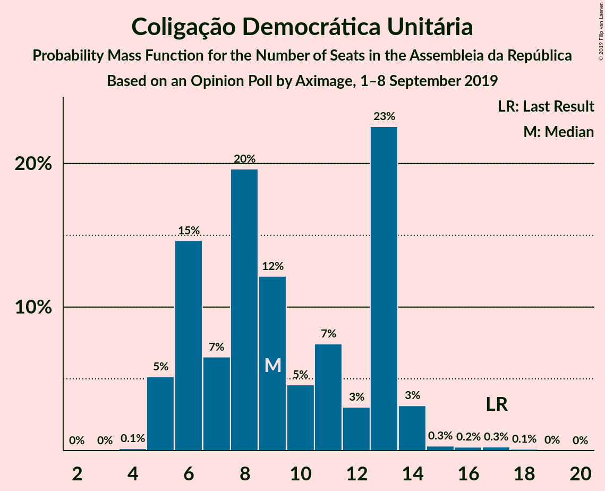
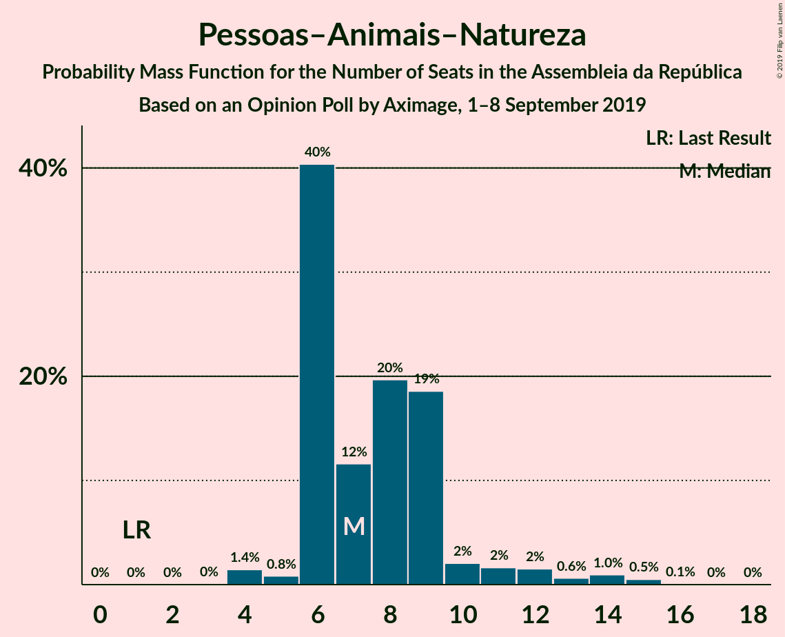

# Opinion Poll by Aximage, 1–8 September 2019

<a href="#voting-intentions">Voting Intentions</a> | <a href="#seats">Seats</a> | <a href="#coalitions">Coalitions</a> | <a href="#technical-information">Technical Information</a>

## Voting Intentions

### Confidence Intervals

| Party | Last Result | Poll Result | 80% Confidence Interval | 90% Confidence Interval | 95% Confidence Interval | 99% Confidence Interval |
|:-----:|:-----------:|:-----------:|:-----------------------:|:-----------------------:|:-----------------------:|:-----------------------:|
| Partido Socialista | 32.3% | 38.4% | 36.4–40.4% |35.9–41.0% |35.4–41.5% |34.5–42.4% |
| Partido Social Democrata | 36.9% | 20.6% | 19.0–22.3% |18.6–22.8% |18.2–23.3% |17.5–24.1% |
| Bloco de Esquerda | 10.2% | 10.2% | 9.0–11.5% |8.7–11.9% |8.4–12.2% |7.9–12.9% |
| Coligação Democrática Unitária | 8.2% | 5.4% | 4.6–6.4% |4.3–6.7% |4.1–7.0% |3.8–7.5% |
| Pessoas–Animais–Natureza | 1.4% | 4.9% | 4.1–5.9% |3.9–6.2% |3.7–6.4% |3.4–6.9% |
| CDS–Partido Popular | 36.9% | 4.6% | 3.8–5.5% |3.6–5.8% |3.4–6.1% |3.1–6.6% |

*Note:* The poll result column reflects the actual value used in the calculations. Published results may vary slightly, and in addition be rounded to fewer digits.

## Seats

### Confidence Intervals

| Party | Last Result | Median | 80% Confidence Interval | 90% Confidence Interval | 95% Confidence Interval | 99% Confidence Interval |
|:-----:|:-----------:|:------:|:-----------------------:|:-----------------------:|:-----------------------:|:-----------------------:|
| <a href="#partido-socialista">Partido Socialista</a> | 86 | 121 | 114–128 |112–130 |111–131 |108–134 |
| <a href="#partido-social-democrata">Partido Social Democrata</a> | 89 | 60 | 56–68 |55–69 |54–70 |51–73 |
| <a href="#bloco-de-esquerda">Bloco de Esquerda</a> | 19 | 24 | 20–27 |19–28 |18–28 |17–31 |
| <a href="#coligação-democrática-unitária">Coligação Democrática Unitária</a> | 17 | 9 | 6–13 |5–13 |5–14 |5–16 |
| <a href="#pessoas–animais–natureza">Pessoas–Animais–Natureza</a> | 1 | 7 | 6–9 |6–11 |6–12 |4–15 |
| <a href="#cds–partido-popular">CDS–Partido Popular</a> | 18 | 7 | 5–8 |4–10 |4–11 |3–12 |

### Partido Socialista

*For a full overview of the results for this party, see the [Partido Socialista](party-partidosocialista.html) page.*

| Number of Seats | Probability | Accumulated | Special Marks |
|:---------------:|:-----------:|:-----------:|:-------------:|
| 86 | 0% | 100% | Last Result |
| 87 | 0% | 100% |  |
| 88 | 0% | 100% |  |
| 89 | 0% | 100% |  |
| 90 | 0% | 100% |  |
| 91 | 0% | 100% |  |
| 92 | 0% | 100% |  |
| 93 | 0% | 100% |  |
| 94 | 0% | 100% |  |
| 95 | 0% | 100% |  |
| 96 | 0% | 100% |  |
| 97 | 0% | 100% |  |
| 98 | 0% | 100% |  |
| 99 | 0% | 100% |  |
| 100 | 0% | 100% |  |
| 101 | 0% | 100% |  |
| 102 | 0% | 100% |  |
| 103 | 0% | 100% |  |
| 104 | 0% | 100% |  |
| 105 | 0% | 99.9% |  |
| 106 | 0.1% | 99.9% |  |
| 107 | 0.2% | 99.8% |  |
| 108 | 0.2% | 99.6% |  |
| 109 | 0.4% | 99.4% |  |
| 110 | 0.7% | 99.0% |  |
| 111 | 0.9% | 98% |  |
| 112 | 3% | 97% |  |
| 113 | 2% | 95% |  |
| 114 | 3% | 92% |  |
| 115 | 3% | 89% |  |
| 116 | 4% | 86% | Majority |
| 117 | 5% | 82% |  |
| 118 | 5% | 76% |  |
| 119 | 9% | 72% |  |
| 120 | 7% | 63% |  |
| 121 | 7% | 56% | Median |
| 122 | 9% | 49% |  |
| 123 | 5% | 41% |  |
| 124 | 6% | 36% |  |
| 125 | 8% | 30% |  |
| 126 | 4% | 22% |  |
| 127 | 6% | 18% |  |
| 128 | 3% | 12% |  |
| 129 | 3% | 9% |  |
| 130 | 2% | 6% |  |
| 131 | 1.5% | 4% |  |
| 132 | 1.0% | 2% |  |
| 133 | 0.4% | 1.1% |  |
| 134 | 0.3% | 0.6% |  |
| 135 | 0.2% | 0.3% |  |
| 136 | 0.1% | 0.2% |  |
| 137 | 0.1% | 0.1% |  |
| 138 | 0% | 0.1% |  |
| 139 | 0% | 0% |  |

### Partido Social Democrata

*For a full overview of the results for this party, see the [Partido Social Democrata](party-partidosocialdemocrata.html) page.*

| Number of Seats | Probability | Accumulated | Special Marks |
|:---------------:|:-----------:|:-----------:|:-------------:|
| 50 | 0.3% | 100% |  |
| 51 | 0.3% | 99.7% |  |
| 52 | 0.6% | 99.4% |  |
| 53 | 1.0% | 98.9% |  |
| 54 | 2% | 98% |  |
| 55 | 4% | 96% |  |
| 56 | 8% | 92% |  |
| 57 | 10% | 84% |  |
| 58 | 9% | 74% |  |
| 59 | 12% | 65% |  |
| 60 | 13% | 53% | Median |
| 61 | 5% | 40% |  |
| 62 | 4% | 35% |  |
| 63 | 4% | 31% |  |
| 64 | 6% | 28% |  |
| 65 | 2% | 21% |  |
| 66 | 3% | 20% |  |
| 67 | 5% | 17% |  |
| 68 | 3% | 12% |  |
| 69 | 4% | 9% |  |
| 70 | 2% | 4% |  |
| 71 | 1.1% | 2% |  |
| 72 | 0.4% | 1.4% |  |
| 73 | 0.4% | 0.9% |  |
| 74 | 0.2% | 0.5% |  |
| 75 | 0.1% | 0.3% |  |
| 76 | 0% | 0.1% |  |
| 77 | 0% | 0.1% |  |
| 78 | 0% | 0% |  |
| 79 | 0% | 0% |  |
| 80 | 0% | 0% |  |
| 81 | 0% | 0% |  |
| 82 | 0% | 0% |  |
| 83 | 0% | 0% |  |
| 84 | 0% | 0% |  |
| 85 | 0% | 0% |  |
| 86 | 0% | 0% |  |
| 87 | 0% | 0% |  |
| 88 | 0% | 0% |  |
| 89 | 0% | 0% | Last Result |

### Bloco de Esquerda

*For a full overview of the results for this party, see the [Bloco de Esquerda](party-blocodeesquerda.html) page.*

| Number of Seats | Probability | Accumulated | Special Marks |
|:---------------:|:-----------:|:-----------:|:-------------:|
| 16 | 0.1% | 100% |  |
| 17 | 1.0% | 99.9% |  |
| 18 | 2% | 98.8% |  |
| 19 | 4% | 97% | Last Result |
| 20 | 13% | 93% |  |
| 21 | 7% | 80% |  |
| 22 | 9% | 73% |  |
| 23 | 10% | 64% |  |
| 24 | 22% | 54% | Median |
| 25 | 14% | 32% |  |
| 26 | 5% | 18% |  |
| 27 | 4% | 13% |  |
| 28 | 7% | 9% |  |
| 29 | 1.0% | 2% |  |
| 30 | 0.3% | 0.9% |  |
| 31 | 0.3% | 0.6% |  |
| 32 | 0.1% | 0.3% |  |
| 33 | 0.1% | 0.2% |  |
| 34 | 0% | 0.1% |  |
| 35 | 0.1% | 0.1% |  |
| 36 | 0% | 0% |  |

### Coligação Democrática Unitária

*For a full overview of the results for this party, see the [Coligação Democrática Unitária](party-coligaçãodemocráticaunitária.html) page.*

| Number of Seats | Probability | Accumulated | Special Marks |
|:---------------:|:-----------:|:-----------:|:-------------:|
| 4 | 0.1% | 100% |  |
| 5 | 5% | 99.9% |  |
| 6 | 15% | 95% |  |
| 7 | 7% | 80% |  |
| 8 | 20% | 74% |  |
| 9 | 12% | 54% | Median |
| 10 | 5% | 42% |  |
| 11 | 7% | 37% |  |
| 12 | 3% | 30% |  |
| 13 | 23% | 27% |  |
| 14 | 3% | 4% |  |
| 15 | 0.3% | 1.0% |  |
| 16 | 0.2% | 0.7% |  |
| 17 | 0.3% | 0.4% | Last Result |
| 18 | 0.1% | 0.2% |  |
| 19 | 0% | 0.1% |  |
| 20 | 0% | 0% |  |

### Pessoas–Animais–Natureza

*For a full overview of the results for this party, see the [Pessoas–Animais–Natureza](party-pessoas–animais–natureza.html) page.*

| Number of Seats | Probability | Accumulated | Special Marks |
|:---------------:|:-----------:|:-----------:|:-------------:|
| 1 | 0% | 100% | Last Result |
| 2 | 0% | 100% |  |
| 3 | 0% | 100% |  |
| 4 | 1.4% | 100% |  |
| 5 | 0.8% | 98.5% |  |
| 6 | 40% | 98% |  |
| 7 | 12% | 57% | Median |
| 8 | 20% | 46% |  |
| 9 | 19% | 26% |  |
| 10 | 2% | 7% |  |
| 11 | 2% | 5% |  |
| 12 | 2% | 4% |  |
| 13 | 0.6% | 2% |  |
| 14 | 1.0% | 2% |  |
| 15 | 0.5% | 0.6% |  |
| 16 | 0.1% | 0.1% |  |
| 17 | 0% | 0.1% |  |
| 18 | 0% | 0% |  |

### CDS–Partido Popular

*For a full overview of the results for this party, see the [CDS–Partido Popular](party-cds–partidopopular.html) page.*

| Number of Seats | Probability | Accumulated | Special Marks |
|:---------------:|:-----------:|:-----------:|:-------------:|
| 2 | 0.3% | 100% |  |
| 3 | 0.5% | 99.7% |  |
| 4 | 6% | 99.2% |  |
| 5 | 4% | 93% |  |
| 6 | 31% | 90% |  |
| 7 | 26% | 59% | Median |
| 8 | 24% | 33% |  |
| 9 | 4% | 9% |  |
| 10 | 2% | 5% |  |
| 11 | 3% | 3% |  |
| 12 | 0.3% | 0.7% |  |
| 13 | 0.1% | 0.4% |  |
| 14 | 0.1% | 0.2% |  |
| 15 | 0.1% | 0.2% |  |
| 16 | 0% | 0.1% |  |
| 17 | 0% | 0% |  |
| 18 | 0% | 0% | Last Result |

## Coalitions

### Confidence Intervals

| Coalition | Last Result | Median | Majority? | 80% Confidence Interval | 90% Confidence Interval | 95% Confidence Interval | 99% Confidence Interval |
|:---------:|:-----------:|:------:|:---------:|:-----------------------:|:-----------------------:|:-----------------------:|:-----------------------:|
| Partido Socialista – Bloco de Esquerda – Coligação Democrática Unitária | 122 | 154 | 100% | 147–160 | 146–161 | 144–162 | 141–164 |
| Partido Socialista – Bloco de Esquerda | 105 | 145 | 100% | 137–151 | 136–153 | 135–154 | 132–157 |
| Partido Socialista – Coligação Democrática Unitária | 103 | 132 | 99.9% | 124–137 | 122–138 | 121–140 | 118–142 |
| Partido Socialista | 86 | 121 | 86% | 114–128 | 112–130 | 111–131 | 108–134 |
| Partido Social Democrata – CDS–Partido Popular | 107 | 67 | 0% | 62–75 | 62–77 | 61–78 | 58–80 |

### Partido Socialista – Bloco de Esquerda – Coligação Democrática Unitária

| Number of Seats | Probability | Accumulated | Special Marks |
|:---------------:|:-----------:|:-----------:|:-------------:|
| 122 | 0% | 100% | Last Result |
| 123 | 0% | 100% |  |
| 124 | 0% | 100% |  |
| 125 | 0% | 100% |  |
| 126 | 0% | 100% |  |
| 127 | 0% | 100% |  |
| 128 | 0% | 100% |  |
| 129 | 0% | 100% |  |
| 130 | 0% | 100% |  |
| 131 | 0% | 100% |  |
| 132 | 0% | 100% |  |
| 133 | 0% | 100% |  |
| 134 | 0% | 100% |  |
| 135 | 0% | 100% |  |
| 136 | 0% | 100% |  |
| 137 | 0% | 100% |  |
| 138 | 0% | 100% |  |
| 139 | 0.1% | 99.9% |  |
| 140 | 0.2% | 99.8% |  |
| 141 | 0.3% | 99.6% |  |
| 142 | 0.3% | 99.3% |  |
| 143 | 0.5% | 99.0% |  |
| 144 | 1.4% | 98.6% |  |
| 145 | 2% | 97% |  |
| 146 | 3% | 95% |  |
| 147 | 3% | 92% |  |
| 148 | 4% | 90% |  |
| 149 | 5% | 85% |  |
| 150 | 2% | 80% |  |
| 151 | 4% | 78% |  |
| 152 | 6% | 74% |  |
| 153 | 9% | 68% |  |
| 154 | 10% | 60% | Median |
| 155 | 6% | 50% |  |
| 156 | 9% | 44% |  |
| 157 | 9% | 36% |  |
| 158 | 8% | 27% |  |
| 159 | 7% | 19% |  |
| 160 | 4% | 12% |  |
| 161 | 4% | 7% |  |
| 162 | 2% | 4% |  |
| 163 | 0.8% | 2% |  |
| 164 | 0.5% | 1.0% |  |
| 165 | 0.3% | 0.5% |  |
| 166 | 0.1% | 0.2% |  |
| 167 | 0.1% | 0.1% |  |
| 168 | 0% | 0% |  |

### Partido Socialista – Bloco de Esquerda

| Number of Seats | Probability | Accumulated | Special Marks |
|:---------------:|:-----------:|:-----------:|:-------------:|
| 105 | 0% | 100% | Last Result |
| 106 | 0% | 100% |  |
| 107 | 0% | 100% |  |
| 108 | 0% | 100% |  |
| 109 | 0% | 100% |  |
| 110 | 0% | 100% |  |
| 111 | 0% | 100% |  |
| 112 | 0% | 100% |  |
| 113 | 0% | 100% |  |
| 114 | 0% | 100% |  |
| 115 | 0% | 100% |  |
| 116 | 0% | 100% | Majority |
| 117 | 0% | 100% |  |
| 118 | 0% | 100% |  |
| 119 | 0% | 100% |  |
| 120 | 0% | 100% |  |
| 121 | 0% | 100% |  |
| 122 | 0% | 100% |  |
| 123 | 0% | 100% |  |
| 124 | 0% | 100% |  |
| 125 | 0% | 100% |  |
| 126 | 0% | 100% |  |
| 127 | 0% | 100% |  |
| 128 | 0.1% | 100% |  |
| 129 | 0.1% | 99.9% |  |
| 130 | 0.1% | 99.8% |  |
| 131 | 0.2% | 99.7% |  |
| 132 | 0.4% | 99.5% |  |
| 133 | 0.6% | 99.2% |  |
| 134 | 0.9% | 98.6% |  |
| 135 | 2% | 98% |  |
| 136 | 3% | 96% |  |
| 137 | 3% | 93% |  |
| 138 | 3% | 90% |  |
| 139 | 3% | 87% |  |
| 140 | 6% | 84% |  |
| 141 | 7% | 78% |  |
| 142 | 5% | 71% |  |
| 143 | 8% | 66% |  |
| 144 | 5% | 59% |  |
| 145 | 9% | 53% | Median |
| 146 | 5% | 44% |  |
| 147 | 6% | 39% |  |
| 148 | 7% | 33% |  |
| 149 | 8% | 26% |  |
| 150 | 4% | 18% |  |
| 151 | 4% | 14% |  |
| 152 | 3% | 10% |  |
| 153 | 2% | 7% |  |
| 154 | 2% | 5% |  |
| 155 | 1.1% | 2% |  |
| 156 | 0.6% | 1.2% |  |
| 157 | 0.2% | 0.6% |  |
| 158 | 0.2% | 0.4% |  |
| 159 | 0.1% | 0.1% |  |
| 160 | 0% | 0% |  |

### Partido Socialista – Coligação Democrática Unitária

| Number of Seats | Probability | Accumulated | Special Marks |
|:---------------:|:-----------:|:-----------:|:-------------:|
| 103 | 0% | 100% | Last Result |
| 104 | 0% | 100% |  |
| 105 | 0% | 100% |  |
| 106 | 0% | 100% |  |
| 107 | 0% | 100% |  |
| 108 | 0% | 100% |  |
| 109 | 0% | 100% |  |
| 110 | 0% | 100% |  |
| 111 | 0% | 100% |  |
| 112 | 0% | 100% |  |
| 113 | 0% | 100% |  |
| 114 | 0% | 100% |  |
| 115 | 0.1% | 99.9% |  |
| 116 | 0.1% | 99.9% | Majority |
| 117 | 0.2% | 99.7% |  |
| 118 | 0.3% | 99.5% |  |
| 119 | 0.6% | 99.2% |  |
| 120 | 0.6% | 98.6% |  |
| 121 | 2% | 98% |  |
| 122 | 3% | 96% |  |
| 123 | 3% | 93% |  |
| 124 | 4% | 90% |  |
| 125 | 2% | 87% |  |
| 126 | 4% | 84% |  |
| 127 | 4% | 81% |  |
| 128 | 6% | 76% |  |
| 129 | 6% | 71% |  |
| 130 | 6% | 65% | Median |
| 131 | 8% | 59% |  |
| 132 | 11% | 51% |  |
| 133 | 10% | 39% |  |
| 134 | 8% | 30% |  |
| 135 | 7% | 22% |  |
| 136 | 4% | 14% |  |
| 137 | 3% | 10% |  |
| 138 | 2% | 7% |  |
| 139 | 2% | 5% |  |
| 140 | 1.2% | 3% |  |
| 141 | 0.9% | 2% |  |
| 142 | 0.4% | 0.7% |  |
| 143 | 0.2% | 0.4% |  |
| 144 | 0.1% | 0.2% |  |
| 145 | 0% | 0.1% |  |
| 146 | 0% | 0% |  |

### Partido Socialista

| Number of Seats | Probability | Accumulated | Special Marks |
|:---------------:|:-----------:|:-----------:|:-------------:|
| 86 | 0% | 100% | Last Result |
| 87 | 0% | 100% |  |
| 88 | 0% | 100% |  |
| 89 | 0% | 100% |  |
| 90 | 0% | 100% |  |
| 91 | 0% | 100% |  |
| 92 | 0% | 100% |  |
| 93 | 0% | 100% |  |
| 94 | 0% | 100% |  |
| 95 | 0% | 100% |  |
| 96 | 0% | 100% |  |
| 97 | 0% | 100% |  |
| 98 | 0% | 100% |  |
| 99 | 0% | 100% |  |
| 100 | 0% | 100% |  |
| 101 | 0% | 100% |  |
| 102 | 0% | 100% |  |
| 103 | 0% | 100% |  |
| 104 | 0% | 100% |  |
| 105 | 0% | 99.9% |  |
| 106 | 0.1% | 99.9% |  |
| 107 | 0.2% | 99.8% |  |
| 108 | 0.2% | 99.6% |  |
| 109 | 0.4% | 99.4% |  |
| 110 | 0.7% | 99.0% |  |
| 111 | 0.9% | 98% |  |
| 112 | 3% | 97% |  |
| 113 | 2% | 95% |  |
| 114 | 3% | 92% |  |
| 115 | 3% | 89% |  |
| 116 | 4% | 86% | Majority |
| 117 | 5% | 82% |  |
| 118 | 5% | 76% |  |
| 119 | 9% | 72% |  |
| 120 | 7% | 63% |  |
| 121 | 7% | 56% | Median |
| 122 | 9% | 49% |  |
| 123 | 5% | 41% |  |
| 124 | 6% | 36% |  |
| 125 | 8% | 30% |  |
| 126 | 4% | 22% |  |
| 127 | 6% | 18% |  |
| 128 | 3% | 12% |  |
| 129 | 3% | 9% |  |
| 130 | 2% | 6% |  |
| 131 | 1.5% | 4% |  |
| 132 | 1.0% | 2% |  |
| 133 | 0.4% | 1.1% |  |
| 134 | 0.3% | 0.6% |  |
| 135 | 0.2% | 0.3% |  |
| 136 | 0.1% | 0.2% |  |
| 137 | 0.1% | 0.1% |  |
| 138 | 0% | 0.1% |  |
| 139 | 0% | 0% |  |

### Partido Social Democrata – CDS–Partido Popular

| Number of Seats | Probability | Accumulated | Special Marks |
|:---------------:|:-----------:|:-----------:|:-------------:|
| 56 | 0.1% | 100% |  |
| 57 | 0.2% | 99.9% |  |
| 58 | 0.4% | 99.7% |  |
| 59 | 0.6% | 99.3% |  |
| 60 | 1.1% | 98.7% |  |
| 61 | 2% | 98% |  |
| 62 | 7% | 96% |  |
| 63 | 10% | 89% |  |
| 64 | 6% | 79% |  |
| 65 | 9% | 73% |  |
| 66 | 10% | 64% |  |
| 67 | 11% | 53% | Median |
| 68 | 6% | 42% |  |
| 69 | 4% | 36% |  |
| 70 | 6% | 32% |  |
| 71 | 5% | 26% |  |
| 72 | 3% | 22% |  |
| 73 | 3% | 19% |  |
| 74 | 4% | 16% |  |
| 75 | 4% | 12% |  |
| 76 | 3% | 9% |  |
| 77 | 2% | 5% |  |
| 78 | 1.4% | 3% |  |
| 79 | 0.7% | 2% |  |
| 80 | 0.4% | 0.9% |  |
| 81 | 0.2% | 0.5% |  |
| 82 | 0.1% | 0.2% |  |
| 83 | 0.1% | 0.2% |  |
| 84 | 0% | 0.1% |  |
| 85 | 0% | 0% |  |
| 86 | 0% | 0% |  |
| 87 | 0% | 0% |  |
| 88 | 0% | 0% |  |
| 89 | 0% | 0% |  |
| 90 | 0% | 0% |  |
| 91 | 0% | 0% |  |
| 92 | 0% | 0% |  |
| 93 | 0% | 0% |  |
| 94 | 0% | 0% |  |
| 95 | 0% | 0% |  |
| 96 | 0% | 0% |  |
| 97 | 0% | 0% |  |
| 98 | 0% | 0% |  |
| 99 | 0% | 0% |  |
| 100 | 0% | 0% |  |
| 101 | 0% | 0% |  |
| 102 | 0% | 0% |  |
| 103 | 0% | 0% |  |
| 104 | 0% | 0% |  |
| 105 | 0% | 0% |  |
| 106 | 0% | 0% |  |
| 107 | 0% | 0% | Last Result |

## Technical Information

### Opinion Poll

+ **Polling firm:** Aximage
+ **Commissioner(s):** —
+ **Fieldwork period:** 1–8 September 2019

### Calculations

+ **Sample size:** 985
+ **Simulations done:** 1,048,576
+ **Error estimate:** 0.94%

