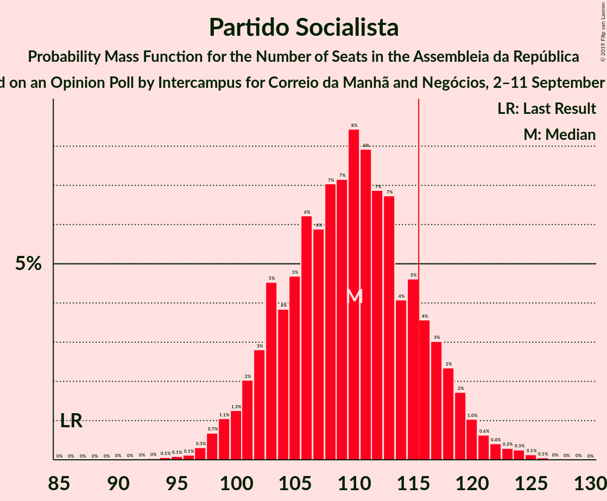
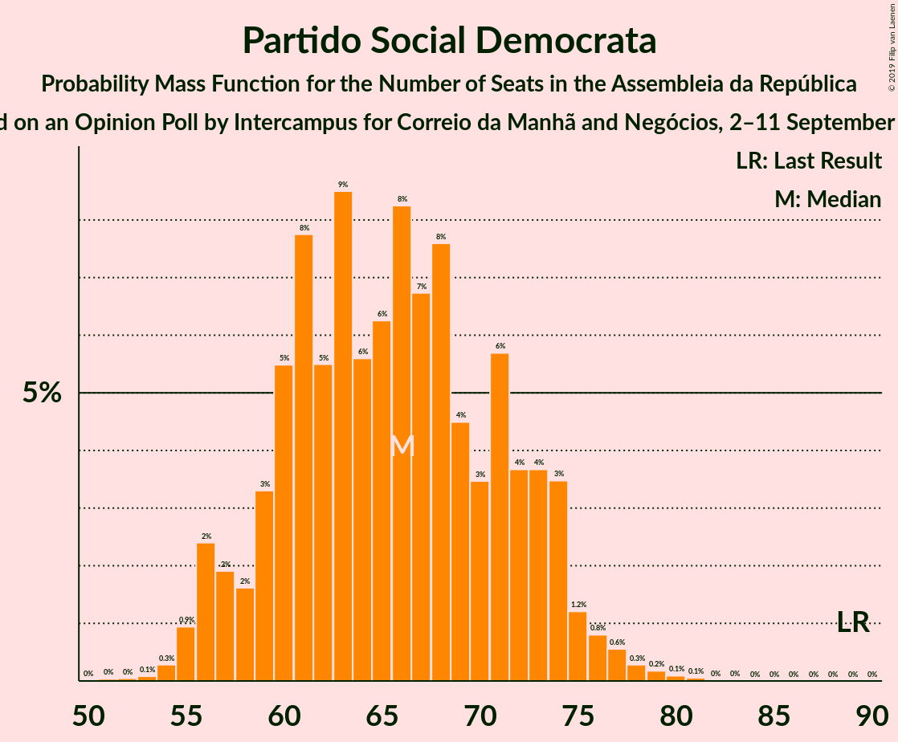
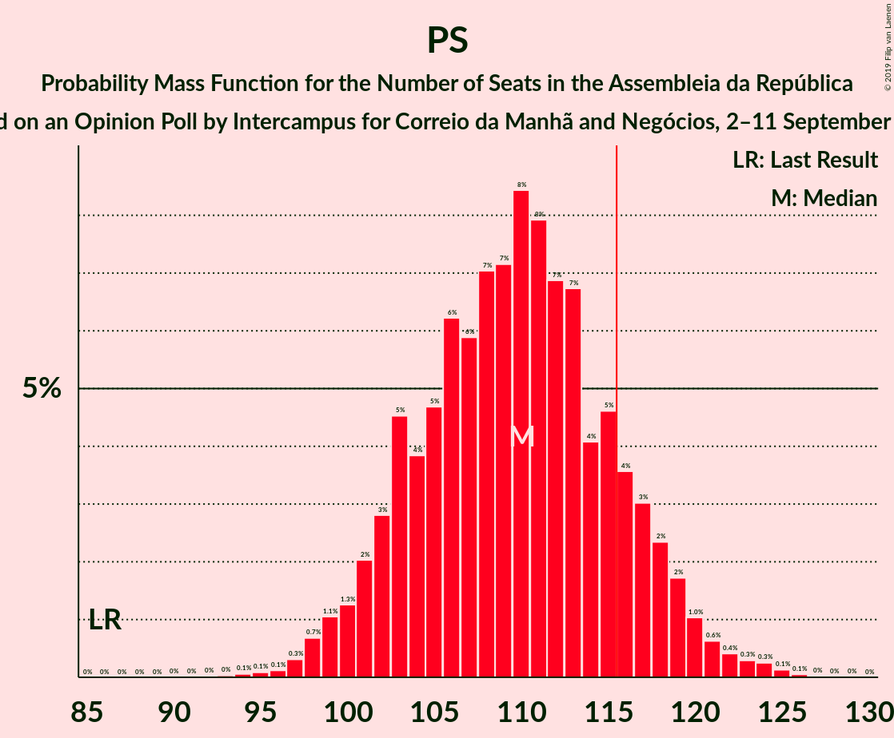

# Opinion Poll by Intercampus for Correio da Manhã and Negócios, 2–11 September 2019

<a href="#voting-intentions">Voting Intentions</a> | <a href="#seats">Seats</a> | <a href="#coalitions">Coalitions</a> | <a href="#technical-information">Technical Information</a>

## Voting Intentions

### Confidence Intervals

| Party | Last Result | Poll Result | 80% Confidence Interval | 90% Confidence Interval | 95% Confidence Interval | 99% Confidence Interval |
|:-----:|:-----------:|:-----------:|:-----------------------:|:-----------------------:|:-----------------------:|:-----------------------:|
| Partido Socialista | 32.3% | 38.0% | 35.8–40.2% |35.2–40.8% |34.6–41.4% |33.6–42.4% |
| Partido Social Democrata | 36.9% | 23.6% | 21.7–25.6% |21.2–26.2% |20.8–26.7% |19.9–27.6% |
| Bloco de Esquerda | 10.2% | 9.7% | 8.5–11.2% |8.2–11.6% |7.9–12.0% |7.3–12.7% |
| Coligação Democrática Unitária | 8.2% | 8.6% | 7.5–10.0% |7.1–10.4% |6.9–10.8% |6.3–11.5% |
| CDS–Partido Popular | 36.9% | 6.2% | 5.3–7.5% |5.0–7.8% |4.8–8.1% |4.3–8.8% |
| Pessoas–Animais–Natureza | 1.4% | 5.2% | 4.4–6.4% |4.1–6.7% |3.9–7.0% |3.5–7.6% |

*Note:* The poll result column reflects the actual value used in the calculations. Published results may vary slightly, and in addition be rounded to fewer digits.

## Seats

### Confidence Intervals

| Party | Last Result | Median | 80% Confidence Interval | 90% Confidence Interval | 95% Confidence Interval | 99% Confidence Interval |
|:-----:|:-----------:|:------:|:-----------------------:|:-----------------------:|:-----------------------:|:-----------------------:|
| <a href="#partido-socialista">Partido Socialista</a> | 86 | 109 | 102–116 |101–119 |99–120 |97–124 |
| <a href="#partido-social-democrata">Partido Social Democrata</a> | 89 | 67 | 58–73 |56–74 |56–75 |54–77 |
| <a href="#bloco-de-esquerda">Bloco de Esquerda</a> | 19 | 19 | 17–24 |16–25 |15–26 |13–28 |
| <a href="#coligação-democrática-unitária">Coligação Democrática Unitária</a> | 17 | 18 | 14–20 |13–21 |13–22 |11–24 |
| <a href="#cds–partido-popular">CDS–Partido Popular</a> | 18 | 9 | 7–15 |7–16 |6–17 |6–18 |
| <a href="#pessoas–animais–natureza">Pessoas–Animais–Natureza</a> | 1 | 6 | 6–9 |6–11 |5–13 |4–15 |

### Partido Socialista

*For a full overview of the results for this party, see the [Partido Socialista](party-partidosocialista.html) page.*

| Number of Seats | Probability | Accumulated | Special Marks |
|:---------------:|:-----------:|:-----------:|:-------------:|
| 86 | 0% | 100% | Last Result |
| 87 | 0% | 100% |  |
| 88 | 0% | 100% |  |
| 89 | 0% | 100% |  |
| 90 | 0% | 100% |  |
| 91 | 0% | 100% |  |
| 92 | 0% | 100% |  |
| 93 | 0% | 100% |  |
| 94 | 0.1% | 99.9% |  |
| 95 | 0.2% | 99.8% |  |
| 96 | 0.1% | 99.7% |  |
| 97 | 0.3% | 99.5% |  |
| 98 | 0.8% | 99.2% |  |
| 99 | 1.1% | 98% |  |
| 100 | 2% | 97% |  |
| 101 | 1.5% | 96% |  |
| 102 | 4% | 94% |  |
| 103 | 5% | 90% |  |
| 104 | 6% | 85% |  |
| 105 | 4% | 78% |  |
| 106 | 3% | 74% |  |
| 107 | 7% | 72% |  |
| 108 | 11% | 65% |  |
| 109 | 4% | 54% | Median |
| 110 | 7% | 50% |  |
| 111 | 9% | 43% |  |
| 112 | 8% | 33% |  |
| 113 | 3% | 25% |  |
| 114 | 3% | 22% |  |
| 115 | 5% | 19% |  |
| 116 | 4% | 14% | Majority |
| 117 | 2% | 10% |  |
| 118 | 2% | 7% |  |
| 119 | 3% | 5% |  |
| 120 | 0.8% | 3% |  |
| 121 | 0.1% | 2% |  |
| 122 | 0.6% | 2% |  |
| 123 | 0.3% | 0.9% |  |
| 124 | 0.4% | 0.6% |  |
| 125 | 0.1% | 0.2% |  |
| 126 | 0.1% | 0.1% |  |
| 127 | 0% | 0.1% |  |
| 128 | 0% | 0% |  |

### Partido Social Democrata

*For a full overview of the results for this party, see the [Partido Social Democrata](party-partidosocialdemocrata.html) page.*

| Number of Seats | Probability | Accumulated | Special Marks |
|:---------------:|:-----------:|:-----------:|:-------------:|
| 52 | 0% | 100% |  |
| 53 | 0.2% | 99.9% |  |
| 54 | 0.3% | 99.7% |  |
| 55 | 1.2% | 99.4% |  |
| 56 | 5% | 98% |  |
| 57 | 2% | 93% |  |
| 58 | 2% | 91% |  |
| 59 | 3% | 89% |  |
| 60 | 6% | 85% |  |
| 61 | 7% | 79% |  |
| 62 | 5% | 72% |  |
| 63 | 5% | 66% |  |
| 64 | 3% | 62% |  |
| 65 | 3% | 59% |  |
| 66 | 5% | 56% |  |
| 67 | 5% | 51% | Median |
| 68 | 8% | 46% |  |
| 69 | 5% | 38% |  |
| 70 | 3% | 32% |  |
| 71 | 4% | 29% |  |
| 72 | 7% | 25% |  |
| 73 | 8% | 17% |  |
| 74 | 6% | 10% |  |
| 75 | 2% | 3% |  |
| 76 | 0.9% | 2% |  |
| 77 | 0.4% | 0.7% |  |
| 78 | 0.2% | 0.3% |  |
| 79 | 0% | 0.1% |  |
| 80 | 0% | 0.1% |  |
| 81 | 0% | 0% |  |
| 82 | 0% | 0% |  |
| 83 | 0% | 0% |  |
| 84 | 0% | 0% |  |
| 85 | 0% | 0% |  |
| 86 | 0% | 0% |  |
| 87 | 0% | 0% |  |
| 88 | 0% | 0% |  |
| 89 | 0% | 0% | Last Result |

### Bloco de Esquerda

*For a full overview of the results for this party, see the [Bloco de Esquerda](party-blocodeesquerda.html) page.*

| Number of Seats | Probability | Accumulated | Special Marks |
|:---------------:|:-----------:|:-----------:|:-------------:|
| 10 | 0.1% | 100% |  |
| 11 | 0.2% | 99.9% |  |
| 12 | 0.1% | 99.7% |  |
| 13 | 0.2% | 99.7% |  |
| 14 | 0.9% | 99.5% |  |
| 15 | 2% | 98.5% |  |
| 16 | 2% | 97% |  |
| 17 | 14% | 94% |  |
| 18 | 14% | 80% |  |
| 19 | 17% | 67% | Last Result, Median |
| 20 | 17% | 49% |  |
| 21 | 12% | 33% |  |
| 22 | 3% | 21% |  |
| 23 | 8% | 18% |  |
| 24 | 4% | 10% |  |
| 25 | 2% | 6% |  |
| 26 | 3% | 4% |  |
| 27 | 0.3% | 1.2% |  |
| 28 | 0.8% | 0.9% |  |
| 29 | 0% | 0% |  |

### Coligação Democrática Unitária

*For a full overview of the results for this party, see the [Coligação Democrática Unitária](party-coligaçãodemocráticaunitária.html) page.*

| Number of Seats | Probability | Accumulated | Special Marks |
|:---------------:|:-----------:|:-----------:|:-------------:|
| 9 | 0.2% | 100% |  |
| 10 | 0.2% | 99.8% |  |
| 11 | 0.1% | 99.6% |  |
| 12 | 0.5% | 99.5% |  |
| 13 | 8% | 99.0% |  |
| 14 | 11% | 91% |  |
| 15 | 4% | 80% |  |
| 16 | 3% | 76% |  |
| 17 | 21% | 72% | Last Result |
| 18 | 17% | 51% | Median |
| 19 | 13% | 34% |  |
| 20 | 13% | 21% |  |
| 21 | 4% | 8% |  |
| 22 | 2% | 4% |  |
| 23 | 0.9% | 2% |  |
| 24 | 0.7% | 0.7% |  |
| 25 | 0% | 0.1% |  |
| 26 | 0% | 0% |  |

### CDS–Partido Popular

*For a full overview of the results for this party, see the [CDS–Partido Popular](party-cds–partidopopular.html) page.*

| Number of Seats | Probability | Accumulated | Special Marks |
|:---------------:|:-----------:|:-----------:|:-------------:|
| 4 | 0.3% | 100% |  |
| 5 | 0.1% | 99.7% |  |
| 6 | 4% | 99.5% |  |
| 7 | 7% | 96% |  |
| 8 | 34% | 88% |  |
| 9 | 8% | 54% | Median |
| 10 | 10% | 46% |  |
| 11 | 11% | 36% |  |
| 12 | 7% | 26% |  |
| 13 | 4% | 18% |  |
| 14 | 3% | 15% |  |
| 15 | 5% | 12% |  |
| 16 | 2% | 7% |  |
| 17 | 2% | 4% |  |
| 18 | 2% | 2% | Last Result |
| 19 | 0.2% | 0.4% |  |
| 20 | 0.1% | 0.2% |  |
| 21 | 0% | 0% |  |

### Pessoas–Animais–Natureza

*For a full overview of the results for this party, see the [Pessoas–Animais–Natureza](party-pessoas–animais–natureza.html) page.*

| Number of Seats | Probability | Accumulated | Special Marks |
|:---------------:|:-----------:|:-----------:|:-------------:|
| 1 | 0% | 100% | Last Result |
| 2 | 0% | 100% |  |
| 3 | 0.2% | 100% |  |
| 4 | 2% | 99.8% |  |
| 5 | 1.3% | 98% |  |
| 6 | 50% | 97% | Median |
| 7 | 7% | 47% |  |
| 8 | 16% | 40% |  |
| 9 | 15% | 24% |  |
| 10 | 3% | 9% |  |
| 11 | 2% | 7% |  |
| 12 | 1.1% | 5% |  |
| 13 | 2% | 4% |  |
| 14 | 0.9% | 1.4% |  |
| 15 | 0.3% | 0.5% |  |
| 16 | 0.1% | 0.2% |  |
| 17 | 0.1% | 0.1% |  |
| 18 | 0% | 0% |  |

## Coalitions

### Confidence Intervals

| Coalition | Last Result | Median | Majority? | 80% Confidence Interval | 90% Confidence Interval | 95% Confidence Interval | 99% Confidence Interval |
|:---------:|:-----------:|:------:|:---------:|:-----------------------:|:-----------------------:|:-----------------------:|:-----------------------:|
| Partido Socialista – Bloco de Esquerda – Coligação Democrática Unitária | 122 | 146 | 100% | 140–154 | 138–156 | 136–158 | 135–160 |
| Partido Socialista – Bloco de Esquerda | 105 | 129 | 99.7% | 122–137 | 120–139 | 119–141 | 116–143 |
| Partido Socialista – Coligação Democrática Unitária | 103 | 126 | 98.7% | 120–134 | 118–136 | 117–138 | 114–140 |
| Partido Socialista | 86 | 109 | 14% | 102–116 | 101–119 | 99–120 | 97–124 |
| Partido Social Democrata – CDS–Partido Popular | 107 | 76 | 0% | 68–83 | 66–84 | 65–85 | 63–88 |

### Partido Socialista – Bloco de Esquerda – Coligação Democrática Unitária

| Number of Seats | Probability | Accumulated | Special Marks |
|:---------------:|:-----------:|:-----------:|:-------------:|
| 122 | 0% | 100% | Last Result |
| 123 | 0% | 100% |  |
| 124 | 0% | 100% |  |
| 125 | 0% | 100% |  |
| 126 | 0% | 100% |  |
| 127 | 0% | 100% |  |
| 128 | 0% | 100% |  |
| 129 | 0% | 100% |  |
| 130 | 0.1% | 100% |  |
| 131 | 0% | 99.9% |  |
| 132 | 0.1% | 99.9% |  |
| 133 | 0.1% | 99.8% |  |
| 134 | 0.2% | 99.7% |  |
| 135 | 0.6% | 99.5% |  |
| 136 | 1.4% | 98.9% |  |
| 137 | 2% | 97% |  |
| 138 | 1.5% | 95% |  |
| 139 | 1.5% | 94% |  |
| 140 | 7% | 92% |  |
| 141 | 6% | 85% |  |
| 142 | 6% | 79% |  |
| 143 | 4% | 74% |  |
| 144 | 3% | 70% |  |
| 145 | 10% | 66% |  |
| 146 | 8% | 56% | Median |
| 147 | 8% | 49% |  |
| 148 | 8% | 41% |  |
| 149 | 6% | 32% |  |
| 150 | 3% | 26% |  |
| 151 | 2% | 23% |  |
| 152 | 4% | 20% |  |
| 153 | 3% | 17% |  |
| 154 | 5% | 14% |  |
| 155 | 2% | 8% |  |
| 156 | 1.4% | 6% |  |
| 157 | 2% | 5% |  |
| 158 | 1.3% | 3% |  |
| 159 | 1.0% | 2% |  |
| 160 | 0.6% | 0.8% |  |
| 161 | 0.1% | 0.2% |  |
| 162 | 0% | 0.1% |  |
| 163 | 0% | 0.1% |  |
| 164 | 0% | 0% |  |

### Partido Socialista – Bloco de Esquerda

| Number of Seats | Probability | Accumulated | Special Marks |
|:---------------:|:-----------:|:-----------:|:-------------:|
| 105 | 0% | 100% | Last Result |
| 106 | 0% | 100% |  |
| 107 | 0% | 100% |  |
| 108 | 0% | 100% |  |
| 109 | 0% | 100% |  |
| 110 | 0% | 100% |  |
| 111 | 0% | 100% |  |
| 112 | 0% | 100% |  |
| 113 | 0% | 100% |  |
| 114 | 0.1% | 99.9% |  |
| 115 | 0.1% | 99.9% |  |
| 116 | 0.3% | 99.7% | Majority |
| 117 | 0.4% | 99.4% |  |
| 118 | 1.0% | 99.0% |  |
| 119 | 1.2% | 98% |  |
| 120 | 2% | 97% |  |
| 121 | 4% | 95% |  |
| 122 | 3% | 91% |  |
| 123 | 5% | 88% |  |
| 124 | 4% | 83% |  |
| 125 | 8% | 79% |  |
| 126 | 4% | 72% |  |
| 127 | 7% | 68% |  |
| 128 | 8% | 61% | Median |
| 129 | 9% | 53% |  |
| 130 | 8% | 44% |  |
| 131 | 4% | 36% |  |
| 132 | 5% | 32% |  |
| 133 | 5% | 27% |  |
| 134 | 4% | 23% |  |
| 135 | 3% | 18% |  |
| 136 | 2% | 15% |  |
| 137 | 4% | 13% |  |
| 138 | 4% | 10% |  |
| 139 | 2% | 6% |  |
| 140 | 1.1% | 4% |  |
| 141 | 1.5% | 3% |  |
| 142 | 1.1% | 2% |  |
| 143 | 0.2% | 0.7% |  |
| 144 | 0.2% | 0.5% |  |
| 145 | 0.2% | 0.3% |  |
| 146 | 0% | 0.1% |  |
| 147 | 0% | 0% |  |

### Partido Socialista – Coligação Democrática Unitária

| Number of Seats | Probability | Accumulated | Special Marks |
|:---------------:|:-----------:|:-----------:|:-------------:|
| 103 | 0% | 100% | Last Result |
| 104 | 0% | 100% |  |
| 105 | 0% | 100% |  |
| 106 | 0% | 100% |  |
| 107 | 0% | 100% |  |
| 108 | 0% | 100% |  |
| 109 | 0% | 100% |  |
| 110 | 0% | 100% |  |
| 111 | 0.1% | 99.9% |  |
| 112 | 0.2% | 99.9% |  |
| 113 | 0.1% | 99.7% |  |
| 114 | 0.3% | 99.6% |  |
| 115 | 0.5% | 99.3% |  |
| 116 | 0.4% | 98.7% | Majority |
| 117 | 2% | 98% |  |
| 118 | 2% | 97% |  |
| 119 | 2% | 95% |  |
| 120 | 4% | 93% |  |
| 121 | 6% | 88% |  |
| 122 | 7% | 82% |  |
| 123 | 5% | 75% |  |
| 124 | 7% | 70% |  |
| 125 | 8% | 64% |  |
| 126 | 6% | 56% |  |
| 127 | 3% | 50% | Median |
| 128 | 6% | 47% |  |
| 129 | 10% | 40% |  |
| 130 | 5% | 30% |  |
| 131 | 5% | 24% |  |
| 132 | 5% | 19% |  |
| 133 | 3% | 14% |  |
| 134 | 3% | 11% |  |
| 135 | 2% | 8% |  |
| 136 | 2% | 6% |  |
| 137 | 1.0% | 4% |  |
| 138 | 2% | 3% |  |
| 139 | 0.3% | 1.0% |  |
| 140 | 0.3% | 0.7% |  |
| 141 | 0.2% | 0.4% |  |
| 142 | 0.1% | 0.2% |  |
| 143 | 0.1% | 0.1% |  |
| 144 | 0% | 0% |  |

### Partido Socialista

| Number of Seats | Probability | Accumulated | Special Marks |
|:---------------:|:-----------:|:-----------:|:-------------:|
| 86 | 0% | 100% | Last Result |
| 87 | 0% | 100% |  |
| 88 | 0% | 100% |  |
| 89 | 0% | 100% |  |
| 90 | 0% | 100% |  |
| 91 | 0% | 100% |  |
| 92 | 0% | 100% |  |
| 93 | 0% | 100% |  |
| 94 | 0.1% | 99.9% |  |
| 95 | 0.2% | 99.8% |  |
| 96 | 0.1% | 99.7% |  |
| 97 | 0.3% | 99.5% |  |
| 98 | 0.8% | 99.2% |  |
| 99 | 1.1% | 98% |  |
| 100 | 2% | 97% |  |
| 101 | 1.5% | 96% |  |
| 102 | 4% | 94% |  |
| 103 | 5% | 90% |  |
| 104 | 6% | 85% |  |
| 105 | 4% | 78% |  |
| 106 | 3% | 74% |  |
| 107 | 7% | 72% |  |
| 108 | 11% | 65% |  |
| 109 | 4% | 54% | Median |
| 110 | 7% | 50% |  |
| 111 | 9% | 43% |  |
| 112 | 8% | 33% |  |
| 113 | 3% | 25% |  |
| 114 | 3% | 22% |  |
| 115 | 5% | 19% |  |
| 116 | 4% | 14% | Majority |
| 117 | 2% | 10% |  |
| 118 | 2% | 7% |  |
| 119 | 3% | 5% |  |
| 120 | 0.8% | 3% |  |
| 121 | 0.1% | 2% |  |
| 122 | 0.6% | 2% |  |
| 123 | 0.3% | 0.9% |  |
| 124 | 0.4% | 0.6% |  |
| 125 | 0.1% | 0.2% |  |
| 126 | 0.1% | 0.1% |  |
| 127 | 0% | 0.1% |  |
| 128 | 0% | 0% |  |

### Partido Social Democrata – CDS–Partido Popular

| Number of Seats | Probability | Accumulated | Special Marks |
|:---------------:|:-----------:|:-----------:|:-------------:|
| 61 | 0.2% | 100% |  |
| 62 | 0.1% | 99.8% |  |
| 63 | 0.3% | 99.7% |  |
| 64 | 1.4% | 99.3% |  |
| 65 | 1.3% | 98% |  |
| 66 | 3% | 97% |  |
| 67 | 2% | 93% |  |
| 68 | 2% | 91% |  |
| 69 | 2% | 89% |  |
| 70 | 5% | 87% |  |
| 71 | 2% | 83% |  |
| 72 | 5% | 80% |  |
| 73 | 2% | 75% |  |
| 74 | 5% | 73% |  |
| 75 | 12% | 68% |  |
| 76 | 9% | 56% | Median |
| 77 | 5% | 47% |  |
| 78 | 7% | 42% |  |
| 79 | 6% | 35% |  |
| 80 | 5% | 29% |  |
| 81 | 8% | 24% |  |
| 82 | 5% | 16% |  |
| 83 | 3% | 11% |  |
| 84 | 4% | 7% |  |
| 85 | 2% | 4% |  |
| 86 | 0.4% | 2% |  |
| 87 | 0.5% | 1.5% |  |
| 88 | 0.6% | 1.0% |  |
| 89 | 0.1% | 0.4% |  |
| 90 | 0.1% | 0.3% |  |
| 91 | 0.1% | 0.1% |  |
| 92 | 0% | 0.1% |  |
| 93 | 0% | 0% |  |
| 94 | 0% | 0% |  |
| 95 | 0% | 0% |  |
| 96 | 0% | 0% |  |
| 97 | 0% | 0% |  |
| 98 | 0% | 0% |  |
| 99 | 0% | 0% |  |
| 100 | 0% | 0% |  |
| 101 | 0% | 0% |  |
| 102 | 0% | 0% |  |
| 103 | 0% | 0% |  |
| 104 | 0% | 0% |  |
| 105 | 0% | 0% |  |
| 106 | 0% | 0% |  |
| 107 | 0% | 0% | Last Result |

## Technical Information

### Opinion Poll

+ **Polling firm:** Intercampus
+ **Commissioner(s):** Correio da Manhã and Negócios
+ **Fieldwork period:** 2–11 September 2019

### Calculations

+ **Sample size:** 801
+ **Simulations done:** 131,072
+ **Error estimate:** 1.42%

