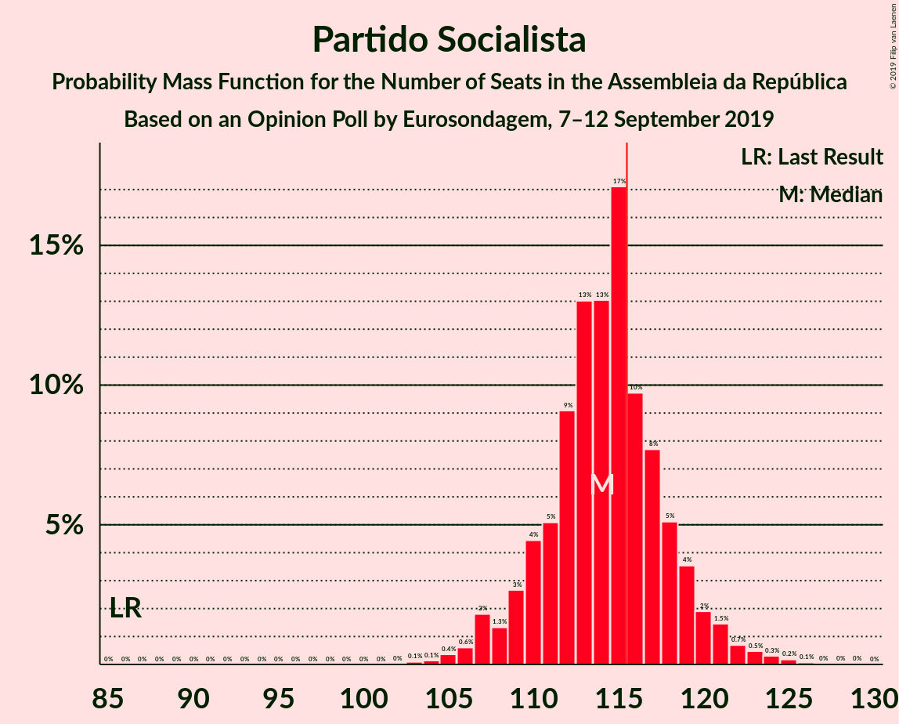
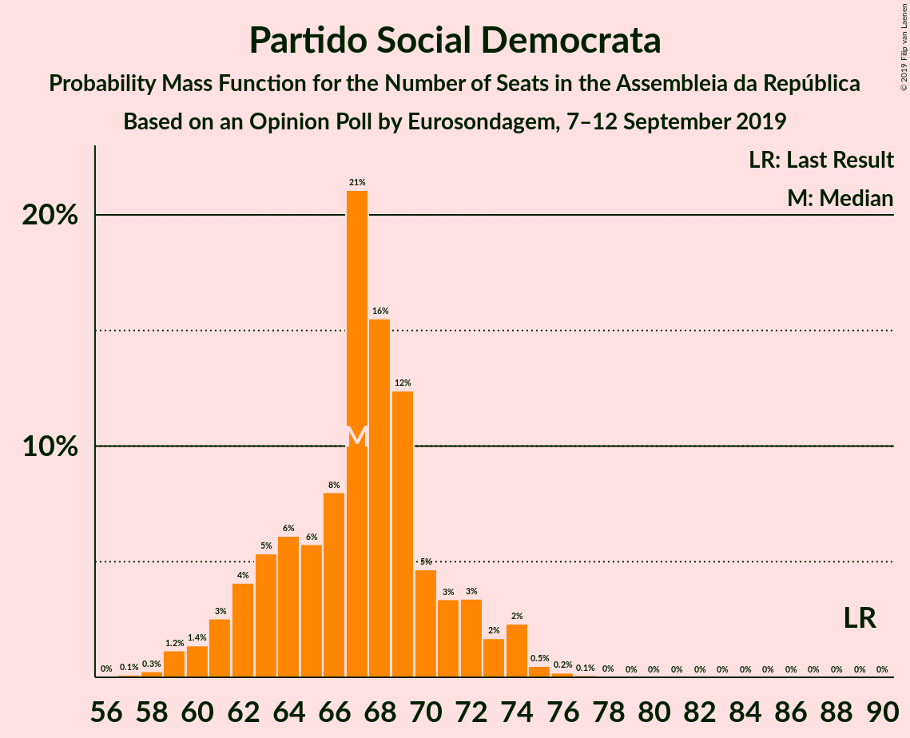
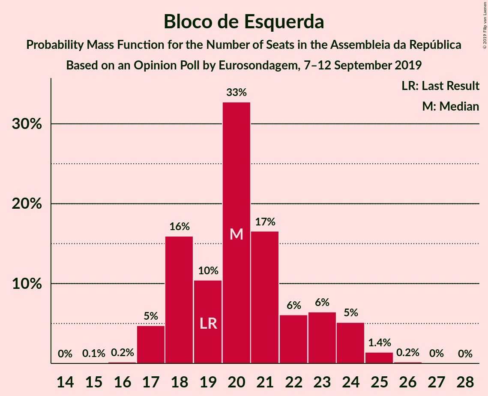
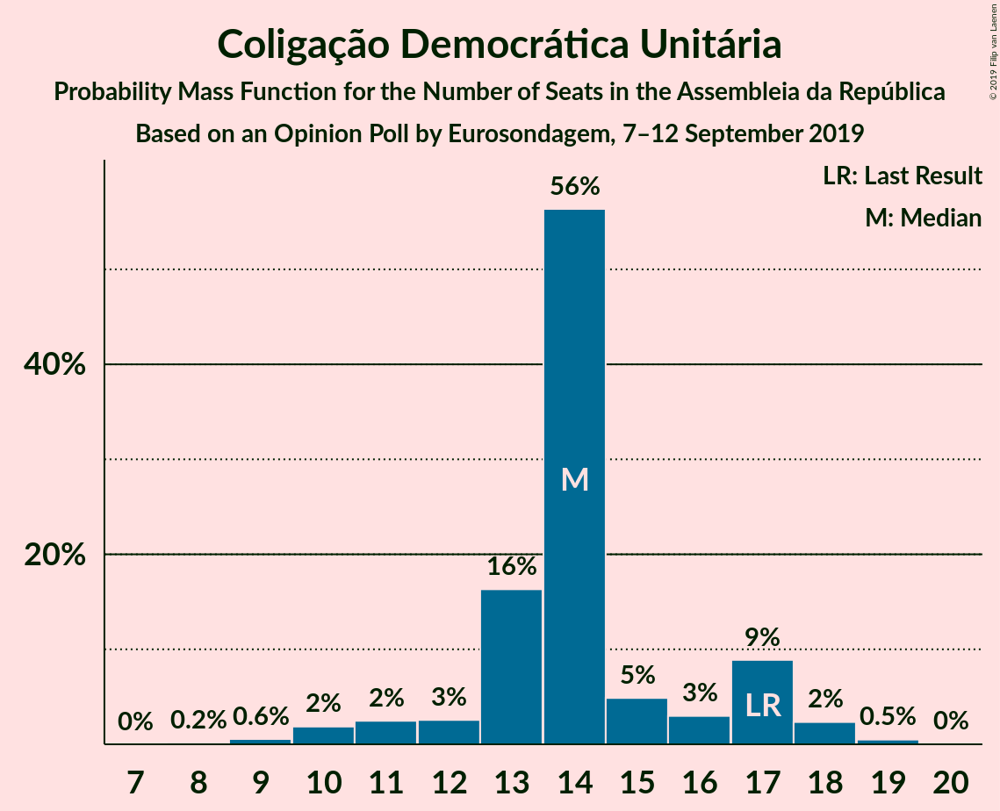
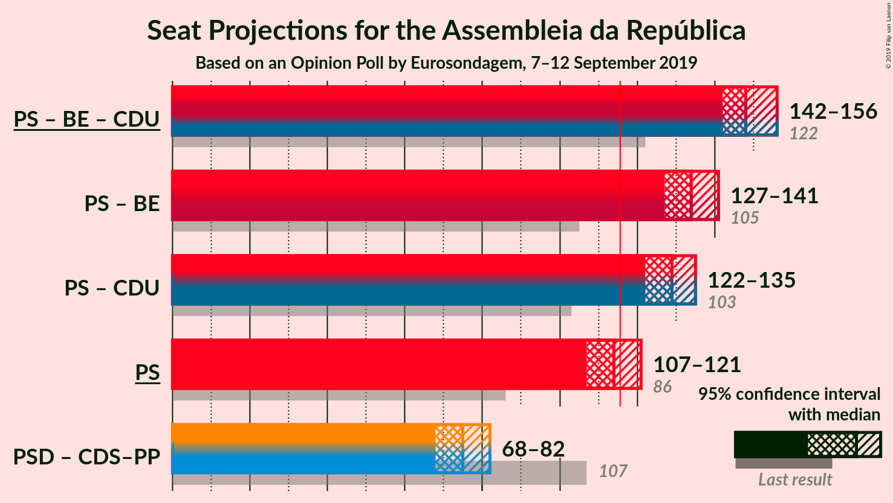
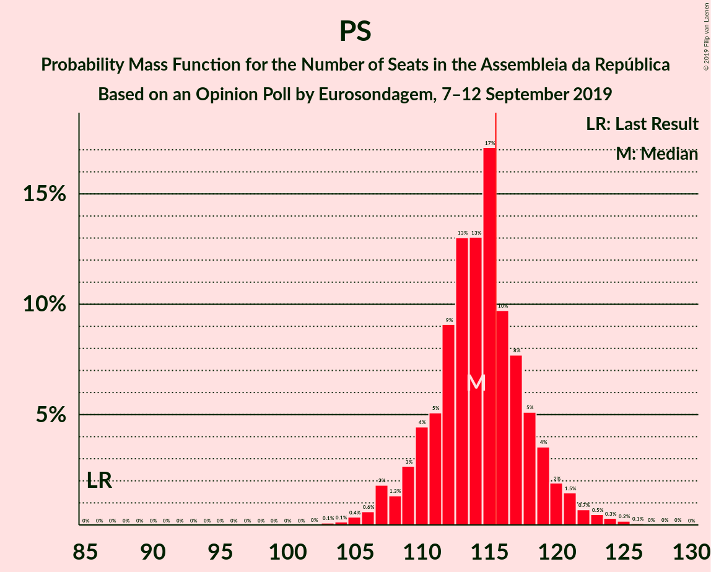
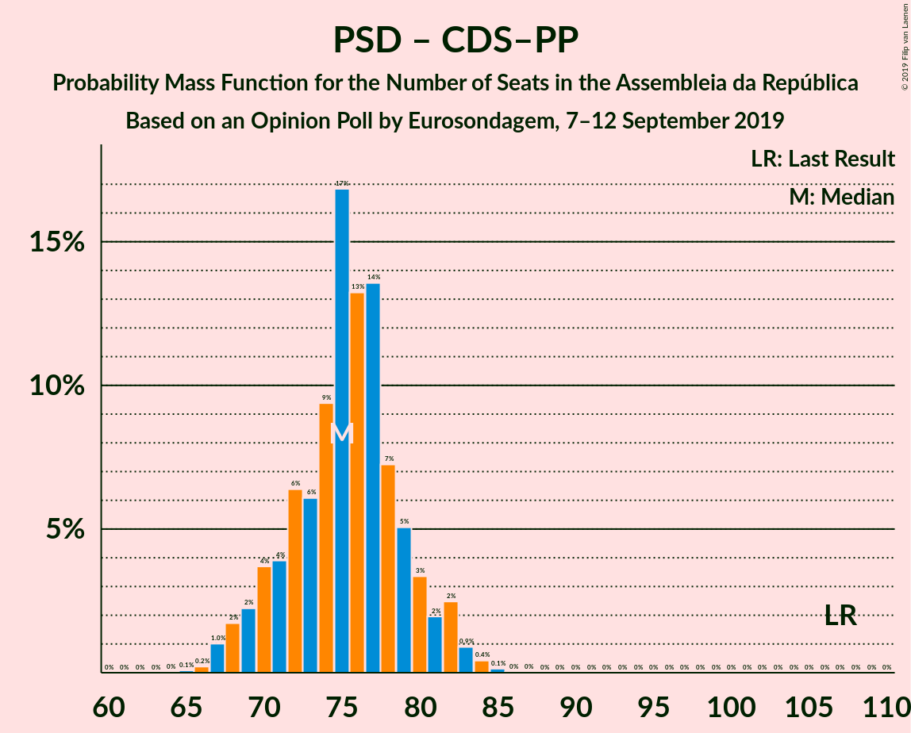

# Opinion Poll by Eurosondagem, 7–12 September 2019

<a href="#voting-intentions">Voting Intentions</a> | <a href="#seats">Seats</a> | <a href="#coalitions">Coalitions</a> | <a href="#technical-information">Technical Information</a>

## Voting Intentions

### Confidence Intervals

| Party | Last Result | Poll Result | 80% Confidence Interval | 90% Confidence Interval | 95% Confidence Interval | 99% Confidence Interval |
|:-----:|:-----------:|:-----------:|:-----------------------:|:-----------------------:|:-----------------------:|:-----------------------:|
| Partido Socialista | 32.3% | 38.3% | 36.9–39.7% |36.5–40.1% |36.2–40.4% |35.5–41.1% |
| Partido Social Democrata | 36.9% | 23.3% | 22.1–24.5% |21.8–24.9% |21.5–25.2% |21.0–25.8% |
| Bloco de Esquerda | 10.2% | 9.5% | 8.7–10.4% |8.5–10.7% |8.3–10.9% |8.0–11.3% |
| Coligação Democrática Unitária | 8.2% | 7.1% | 6.4–7.9% |6.2–8.1% |6.0–8.3% |5.7–8.7% |
| CDS–Partido Popular | 36.9% | 5.5% | 4.9–6.2% |4.7–6.4% |4.6–6.6% |4.3–7.0% |
| Pessoas–Animais–Natureza | 1.4% | 4.5% | 3.9–5.1% |3.8–5.3% |3.7–5.5% |3.4–5.8% |

*Note:* The poll result column reflects the actual value used in the calculations. Published results may vary slightly, and in addition be rounded to fewer digits.

## Seats

### Confidence Intervals

| Party | Last Result | Median | 80% Confidence Interval | 90% Confidence Interval | 95% Confidence Interval | 99% Confidence Interval |
|:-----:|:-----------:|:------:|:-----------------------:|:-----------------------:|:-----------------------:|:-----------------------:|
| <a href="#partido-socialista">Partido Socialista</a> | 86 | 114 | 110–118 |109–120 |107–121 |105–124 |
| <a href="#partido-social-democrata">Partido Social Democrata</a> | 89 | 67 | 63–71 |61–72 |60–74 |59–75 |
| <a href="#bloco-de-esquerda">Bloco de Esquerda</a> | 19 | 20 | 18–23 |18–24 |17–24 |17–25 |
| <a href="#coligação-democrática-unitária">Coligação Democrática Unitária</a> | 17 | 14 | 13–17 |11–17 |10–18 |9–18 |
| <a href="#cds–partido-popular">CDS–Partido Popular</a> | 18 | 8 | 7–10 |7–10 |6–11 |6–12 |
| <a href="#pessoas–animais–natureza">Pessoas–Animais–Natureza</a> | 1 | 6 | 6–7 |5–8 |4–8 |4–9 |

### Partido Socialista

*For a full overview of the results for this party, see the [Partido Socialista](party-partidosocialista.html) page.*

| Number of Seats | Probability | Accumulated | Special Marks |
|:---------------:|:-----------:|:-----------:|:-------------:|
| 86 | 0% | 100% | Last Result |
| 87 | 0% | 100% |  |
| 88 | 0% | 100% |  |
| 89 | 0% | 100% |  |
| 90 | 0% | 100% |  |
| 91 | 0% | 100% |  |
| 92 | 0% | 100% |  |
| 93 | 0% | 100% |  |
| 94 | 0% | 100% |  |
| 95 | 0% | 100% |  |
| 96 | 0% | 100% |  |
| 97 | 0% | 100% |  |
| 98 | 0% | 100% |  |
| 99 | 0% | 100% |  |
| 100 | 0% | 100% |  |
| 101 | 0% | 100% |  |
| 102 | 0% | 100% |  |
| 103 | 0.1% | 100% |  |
| 104 | 0.2% | 99.9% |  |
| 105 | 0.3% | 99.7% |  |
| 106 | 0.6% | 99.4% |  |
| 107 | 2% | 98.8% |  |
| 108 | 1.4% | 97% |  |
| 109 | 2% | 95% |  |
| 110 | 5% | 93% |  |
| 111 | 6% | 88% |  |
| 112 | 9% | 83% |  |
| 113 | 14% | 74% |  |
| 114 | 13% | 59% | Median |
| 115 | 15% | 46% |  |
| 116 | 10% | 31% | Majority |
| 117 | 6% | 21% |  |
| 118 | 6% | 15% |  |
| 119 | 4% | 9% |  |
| 120 | 2% | 5% |  |
| 121 | 1.3% | 3% |  |
| 122 | 0.8% | 2% |  |
| 123 | 0.5% | 1.0% |  |
| 124 | 0.3% | 0.6% |  |
| 125 | 0.2% | 0.3% |  |
| 126 | 0.1% | 0.1% |  |
| 127 | 0% | 0% |  |

### Partido Social Democrata

*For a full overview of the results for this party, see the [Partido Social Democrata](party-partidosocialdemocrata.html) page.*

| Number of Seats | Probability | Accumulated | Special Marks |
|:---------------:|:-----------:|:-----------:|:-------------:|
| 57 | 0.1% | 100% |  |
| 58 | 0.3% | 99.9% |  |
| 59 | 1.1% | 99.6% |  |
| 60 | 1.2% | 98.5% |  |
| 61 | 3% | 97% |  |
| 62 | 4% | 94% |  |
| 63 | 6% | 90% |  |
| 64 | 6% | 85% |  |
| 65 | 5% | 79% |  |
| 66 | 8% | 74% |  |
| 67 | 21% | 66% | Median |
| 68 | 15% | 45% |  |
| 69 | 14% | 30% |  |
| 70 | 5% | 16% |  |
| 71 | 3% | 11% |  |
| 72 | 4% | 8% |  |
| 73 | 1.3% | 4% |  |
| 74 | 2% | 3% |  |
| 75 | 0.4% | 0.8% |  |
| 76 | 0.2% | 0.4% |  |
| 77 | 0.1% | 0.1% |  |
| 78 | 0% | 0% |  |
| 79 | 0% | 0% |  |
| 80 | 0% | 0% |  |
| 81 | 0% | 0% |  |
| 82 | 0% | 0% |  |
| 83 | 0% | 0% |  |
| 84 | 0% | 0% |  |
| 85 | 0% | 0% |  |
| 86 | 0% | 0% |  |
| 87 | 0% | 0% |  |
| 88 | 0% | 0% |  |
| 89 | 0% | 0% | Last Result |

### Bloco de Esquerda

*For a full overview of the results for this party, see the [Bloco de Esquerda](party-blocodeesquerda.html) page.*

| Number of Seats | Probability | Accumulated | Special Marks |
|:---------------:|:-----------:|:-----------:|:-------------:|
| 15 | 0.1% | 100% |  |
| 16 | 0.2% | 99.9% |  |
| 17 | 5% | 99.7% |  |
| 18 | 16% | 95% |  |
| 19 | 10% | 80% | Last Result |
| 20 | 32% | 70% | Median |
| 21 | 16% | 37% |  |
| 22 | 7% | 21% |  |
| 23 | 7% | 14% |  |
| 24 | 5% | 7% |  |
| 25 | 1.3% | 2% |  |
| 26 | 0.2% | 0.2% |  |
| 27 | 0% | 0.1% |  |
| 28 | 0% | 0% |  |

### Coligação Democrática Unitária

*For a full overview of the results for this party, see the [Coligação Democrática Unitária](party-coligaçãodemocráticaunitária.html) page.*

| Number of Seats | Probability | Accumulated | Special Marks |
|:---------------:|:-----------:|:-----------:|:-------------:|
| 8 | 0.2% | 100% |  |
| 9 | 0.5% | 99.8% |  |
| 10 | 2% | 99.3% |  |
| 11 | 3% | 97% |  |
| 12 | 3% | 94% |  |
| 13 | 16% | 91% |  |
| 14 | 56% | 75% | Median |
| 15 | 4% | 19% |  |
| 16 | 3% | 15% |  |
| 17 | 10% | 12% | Last Result |
| 18 | 2% | 3% |  |
| 19 | 0.4% | 0.5% |  |
| 20 | 0% | 0% |  |

### CDS–Partido Popular

*For a full overview of the results for this party, see the [CDS–Partido Popular](party-cds–partidopopular.html) page.*

| Number of Seats | Probability | Accumulated | Special Marks |
|:---------------:|:-----------:|:-----------:|:-------------:|
| 6 | 4% | 100% |  |
| 7 | 17% | 96% |  |
| 8 | 52% | 79% | Median |
| 9 | 8% | 27% |  |
| 10 | 16% | 20% |  |
| 11 | 3% | 4% |  |
| 12 | 1.3% | 1.5% |  |
| 13 | 0.1% | 0.2% |  |
| 14 | 0% | 0.1% |  |
| 15 | 0.1% | 0.1% |  |
| 16 | 0% | 0% |  |
| 17 | 0% | 0% |  |
| 18 | 0% | 0% | Last Result |

### Pessoas–Animais–Natureza

*For a full overview of the results for this party, see the [Pessoas–Animais–Natureza](party-pessoas–animais–natureza.html) page.*

| Number of Seats | Probability | Accumulated | Special Marks |
|:---------------:|:-----------:|:-----------:|:-------------:|
| 1 | 0% | 100% | Last Result |
| 2 | 0% | 100% |  |
| 3 | 0% | 100% |  |
| 4 | 3% | 100% |  |
| 5 | 3% | 97% |  |
| 6 | 78% | 94% | Median |
| 7 | 8% | 15% |  |
| 8 | 6% | 8% |  |
| 9 | 1.4% | 1.5% |  |
| 10 | 0% | 0.1% |  |
| 11 | 0% | 0% |  |

## Coalitions

### Confidence Intervals

| Coalition | Last Result | Median | Majority? | 80% Confidence Interval | 90% Confidence Interval | 95% Confidence Interval | 99% Confidence Interval |
|:---------:|:-----------:|:------:|:---------:|:-----------------------:|:-----------------------:|:-----------------------:|:-----------------------:|
| Partido Socialista – Bloco de Esquerda – Coligação Democrática Unitária | 122 | 148 | 100% | 144–153 | 143–155 | 142–156 | 140–157 |
| Partido Socialista – Bloco de Esquerda | 105 | 134 | 100% | 130–139 | 128–140 | 127–142 | 126–143 |
| Partido Socialista – Coligação Democrática Unitária | 103 | 128 | 100% | 124–133 | 123–134 | 121–135 | 119–138 |
| Partido Socialista | 86 | 114 | 31% | 110–118 | 109–120 | 107–121 | 105–124 |
| Partido Social Democrata – CDS–Partido Popular | 107 | 75 | 0% | 71–79 | 69–81 | 68–82 | 67–84 |

### Partido Socialista – Bloco de Esquerda – Coligação Democrática Unitária

| Number of Seats | Probability | Accumulated | Special Marks |
|:---------------:|:-----------:|:-----------:|:-------------:|
| 122 | 0% | 100% | Last Result |
| 123 | 0% | 100% |  |
| 124 | 0% | 100% |  |
| 125 | 0% | 100% |  |
| 126 | 0% | 100% |  |
| 127 | 0% | 100% |  |
| 128 | 0% | 100% |  |
| 129 | 0% | 100% |  |
| 130 | 0% | 100% |  |
| 131 | 0% | 100% |  |
| 132 | 0% | 100% |  |
| 133 | 0% | 100% |  |
| 134 | 0% | 100% |  |
| 135 | 0% | 100% |  |
| 136 | 0% | 100% |  |
| 137 | 0% | 100% |  |
| 138 | 0% | 100% |  |
| 139 | 0.2% | 99.9% |  |
| 140 | 0.5% | 99.7% |  |
| 141 | 1.1% | 99.2% |  |
| 142 | 2% | 98% |  |
| 143 | 2% | 96% |  |
| 144 | 4% | 94% |  |
| 145 | 6% | 89% |  |
| 146 | 8% | 84% |  |
| 147 | 13% | 76% |  |
| 148 | 15% | 63% | Median |
| 149 | 15% | 48% |  |
| 150 | 9% | 33% |  |
| 151 | 6% | 24% |  |
| 152 | 5% | 18% |  |
| 153 | 4% | 13% |  |
| 154 | 4% | 9% |  |
| 155 | 2% | 5% |  |
| 156 | 2% | 3% |  |
| 157 | 0.5% | 0.8% |  |
| 158 | 0.2% | 0.3% |  |
| 159 | 0.1% | 0.1% |  |
| 160 | 0% | 0% |  |

### Partido Socialista – Bloco de Esquerda

| Number of Seats | Probability | Accumulated | Special Marks |
|:---------------:|:-----------:|:-----------:|:-------------:|
| 105 | 0% | 100% | Last Result |
| 106 | 0% | 100% |  |
| 107 | 0% | 100% |  |
| 108 | 0% | 100% |  |
| 109 | 0% | 100% |  |
| 110 | 0% | 100% |  |
| 111 | 0% | 100% |  |
| 112 | 0% | 100% |  |
| 113 | 0% | 100% |  |
| 114 | 0% | 100% |  |
| 115 | 0% | 100% |  |
| 116 | 0% | 100% | Majority |
| 117 | 0% | 100% |  |
| 118 | 0% | 100% |  |
| 119 | 0% | 100% |  |
| 120 | 0% | 100% |  |
| 121 | 0% | 100% |  |
| 122 | 0% | 100% |  |
| 123 | 0% | 100% |  |
| 124 | 0.1% | 99.9% |  |
| 125 | 0.2% | 99.8% |  |
| 126 | 0.7% | 99.6% |  |
| 127 | 2% | 99.0% |  |
| 128 | 3% | 97% |  |
| 129 | 2% | 95% |  |
| 130 | 4% | 93% |  |
| 131 | 6% | 89% |  |
| 132 | 6% | 83% |  |
| 133 | 14% | 77% |  |
| 134 | 14% | 63% | Median |
| 135 | 16% | 49% |  |
| 136 | 8% | 33% |  |
| 137 | 7% | 24% |  |
| 138 | 5% | 17% |  |
| 139 | 4% | 12% |  |
| 140 | 3% | 8% |  |
| 141 | 2% | 5% |  |
| 142 | 2% | 3% |  |
| 143 | 0.8% | 1.2% |  |
| 144 | 0.2% | 0.4% |  |
| 145 | 0.1% | 0.2% |  |
| 146 | 0% | 0.1% |  |
| 147 | 0% | 0% |  |

### Partido Socialista – Coligação Democrática Unitária

| Number of Seats | Probability | Accumulated | Special Marks |
|:---------------:|:-----------:|:-----------:|:-------------:|
| 103 | 0% | 100% | Last Result |
| 104 | 0% | 100% |  |
| 105 | 0% | 100% |  |
| 106 | 0% | 100% |  |
| 107 | 0% | 100% |  |
| 108 | 0% | 100% |  |
| 109 | 0% | 100% |  |
| 110 | 0% | 100% |  |
| 111 | 0% | 100% |  |
| 112 | 0% | 100% |  |
| 113 | 0% | 100% |  |
| 114 | 0% | 100% |  |
| 115 | 0% | 100% |  |
| 116 | 0% | 100% | Majority |
| 117 | 0.1% | 100% |  |
| 118 | 0.2% | 99.9% |  |
| 119 | 0.3% | 99.7% |  |
| 120 | 0.7% | 99.5% |  |
| 121 | 1.3% | 98.8% |  |
| 122 | 2% | 97% |  |
| 123 | 3% | 96% |  |
| 124 | 7% | 93% |  |
| 125 | 6% | 86% |  |
| 126 | 8% | 80% |  |
| 127 | 14% | 72% |  |
| 128 | 11% | 59% | Median |
| 129 | 15% | 48% |  |
| 130 | 11% | 33% |  |
| 131 | 6% | 22% |  |
| 132 | 6% | 16% |  |
| 133 | 4% | 10% |  |
| 134 | 3% | 7% |  |
| 135 | 1.4% | 4% |  |
| 136 | 1.2% | 2% |  |
| 137 | 0.5% | 1.1% |  |
| 138 | 0.4% | 0.6% |  |
| 139 | 0.2% | 0.2% |  |
| 140 | 0.1% | 0.1% |  |
| 141 | 0% | 0% |  |

### Partido Socialista

| Number of Seats | Probability | Accumulated | Special Marks |
|:---------------:|:-----------:|:-----------:|:-------------:|
| 86 | 0% | 100% | Last Result |
| 87 | 0% | 100% |  |
| 88 | 0% | 100% |  |
| 89 | 0% | 100% |  |
| 90 | 0% | 100% |  |
| 91 | 0% | 100% |  |
| 92 | 0% | 100% |  |
| 93 | 0% | 100% |  |
| 94 | 0% | 100% |  |
| 95 | 0% | 100% |  |
| 96 | 0% | 100% |  |
| 97 | 0% | 100% |  |
| 98 | 0% | 100% |  |
| 99 | 0% | 100% |  |
| 100 | 0% | 100% |  |
| 101 | 0% | 100% |  |
| 102 | 0% | 100% |  |
| 103 | 0.1% | 100% |  |
| 104 | 0.2% | 99.9% |  |
| 105 | 0.3% | 99.7% |  |
| 106 | 0.6% | 99.4% |  |
| 107 | 2% | 98.8% |  |
| 108 | 1.4% | 97% |  |
| 109 | 2% | 95% |  |
| 110 | 5% | 93% |  |
| 111 | 6% | 88% |  |
| 112 | 9% | 83% |  |
| 113 | 14% | 74% |  |
| 114 | 13% | 59% | Median |
| 115 | 15% | 46% |  |
| 116 | 10% | 31% | Majority |
| 117 | 6% | 21% |  |
| 118 | 6% | 15% |  |
| 119 | 4% | 9% |  |
| 120 | 2% | 5% |  |
| 121 | 1.3% | 3% |  |
| 122 | 0.8% | 2% |  |
| 123 | 0.5% | 1.0% |  |
| 124 | 0.3% | 0.6% |  |
| 125 | 0.2% | 0.3% |  |
| 126 | 0.1% | 0.1% |  |
| 127 | 0% | 0% |  |

### Partido Social Democrata – CDS–Partido Popular

| Number of Seats | Probability | Accumulated | Special Marks |
|:---------------:|:-----------:|:-----------:|:-------------:|
| 65 | 0.1% | 100% |  |
| 66 | 0.2% | 99.9% |  |
| 67 | 1.0% | 99.7% |  |
| 68 | 2% | 98.7% |  |
| 69 | 2% | 97% |  |
| 70 | 4% | 95% |  |
| 71 | 4% | 90% |  |
| 72 | 5% | 86% |  |
| 73 | 6% | 81% |  |
| 74 | 9% | 75% |  |
| 75 | 17% | 67% | Median |
| 76 | 15% | 50% |  |
| 77 | 14% | 35% |  |
| 78 | 7% | 21% |  |
| 79 | 5% | 14% |  |
| 80 | 4% | 9% |  |
| 81 | 2% | 5% |  |
| 82 | 2% | 4% |  |
| 83 | 0.8% | 1.4% |  |
| 84 | 0.3% | 0.5% |  |
| 85 | 0.2% | 0.2% |  |
| 86 | 0% | 0% |  |
| 87 | 0% | 0% |  |
| 88 | 0% | 0% |  |
| 89 | 0% | 0% |  |
| 90 | 0% | 0% |  |
| 91 | 0% | 0% |  |
| 92 | 0% | 0% |  |
| 93 | 0% | 0% |  |
| 94 | 0% | 0% |  |
| 95 | 0% | 0% |  |
| 96 | 0% | 0% |  |
| 97 | 0% | 0% |  |
| 98 | 0% | 0% |  |
| 99 | 0% | 0% |  |
| 100 | 0% | 0% |  |
| 101 | 0% | 0% |  |
| 102 | 0% | 0% |  |
| 103 | 0% | 0% |  |
| 104 | 0% | 0% |  |
| 105 | 0% | 0% |  |
| 106 | 0% | 0% |  |
| 107 | 0% | 0% | Last Result |

## Technical Information

### Opinion Poll

+ **Polling firm:** Eurosondagem
+ **Commissioner(s):** —
+ **Fieldwork period:** 7–12 September 2019

### Calculations

+ **Sample size:** 2048
+ **Simulations done:** 524,288
+ **Error estimate:** 1.05%

