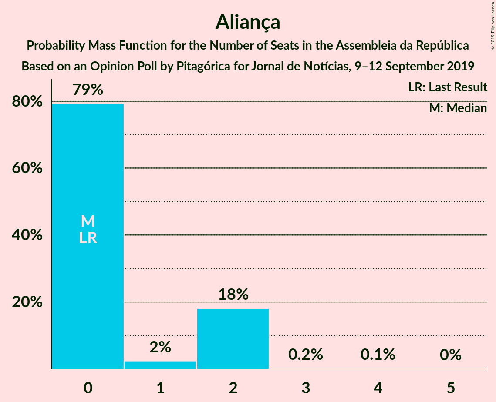
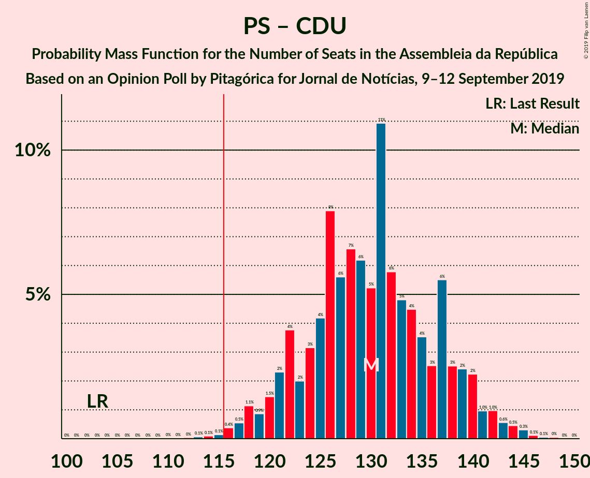

# Opinion Poll by Pitagórica for Jornal de Notícias, 9–12 September 2019

<a href="#voting-intentions">Voting Intentions</a> | <a href="#seats">Seats</a> | <a href="#coalitions">Coalitions</a> | <a href="#technical-information">Technical Information</a>

## Voting Intentions

### Confidence Intervals

| Party | Last Result | Poll Result | 80% Confidence Interval | 90% Confidence Interval | 95% Confidence Interval | 99% Confidence Interval |
|:-----:|:-----------:|:-----------:|:-----------------------:|:-----------------------:|:-----------------------:|:-----------------------:|
| Partido Socialista | 32.3% | 39.2% | 36.7–41.8% |36.0–42.5% |35.4–43.1% |34.2–44.4% |
| Partido Social Democrata | 36.9% | 23.3% | 21.2–25.6% |20.6–26.3% |20.1–26.8% |19.1–28.0% |
| Bloco de Esquerda | 10.2% | 10.1% | 8.7–11.8% |8.3–12.3% |7.9–12.8% |7.3–13.6% |
| Coligação Democrática Unitária | 8.2% | 7.8% | 6.5–9.3% |6.2–9.8% |5.9–10.2% |5.3–11.0% |
| CDS–Partido Popular | 36.9% | 5.6% | 4.6–7.0% |4.3–7.4% |4.1–7.8% |3.6–8.5% |
| Pessoas–Animais–Natureza | 1.4% | 3.1% | 2.4–4.3% |2.2–4.6% |2.0–4.9% |1.7–5.5% |
| Aliança | 0.0% | 1.5% | 1.0–2.3% |0.9–2.6% |0.8–2.8% |0.6–3.3% |
| LIVRE | 0.7% | 0.8% | 0.5–1.5% |0.4–1.7% |0.4–1.9% |0.2–2.3% |

*Note:* The poll result column reflects the actual value used in the calculations. Published results may vary slightly, and in addition be rounded to fewer digits.

## Seats

### Confidence Intervals

| Party | Last Result | Median | 80% Confidence Interval | 90% Confidence Interval | 95% Confidence Interval | 99% Confidence Interval |
|:-----:|:-----------:|:------:|:-----------------------:|:-----------------------:|:-----------------------:|:-----------------------:|
| <a href="#partido-socialista">Partido Socialista</a> | 86 | 116 | 107–120 |106–125 |104–126 |101–129 |
| <a href="#partido-social-democrata">Partido Social Democrata</a> | 89 | 64 | 58–71 |57–73 |56–76 |54–78 |
| <a href="#bloco-de-esquerda">Bloco de Esquerda</a> | 19 | 23 | 18–26 |17–27 |16–28 |13–30 |
| <a href="#coligação-democrática-unitária">Coligação Democrática Unitária</a> | 17 | 14 | 13–19 |12–20 |11–20 |8–23 |
| <a href="#cds–partido-popular">CDS–Partido Popular</a> | 18 | 10 | 6–12 |6–14 |6–16 |4–18 |
| <a href="#pessoas–animais–natureza">Pessoas–Animais–Natureza</a> | 1 | 4 | 2–6 |2–6 |2–6 |1–7 |
| <a href="#aliança">Aliança</a> | 0 | 0 | 0–2 |0–2 |0–2 |0–2 |
| <a href="#livre">LIVRE</a> | 0 | 0 | 0–1 |0–1 |0–1 |0–2 |

### Partido Socialista

*For a full overview of the results for this party, see the [Partido Socialista](party-partidosocialista.html) page.*

| Number of Seats | Probability | Accumulated | Special Marks |
|:---------------:|:-----------:|:-----------:|:-------------:|
| 86 | 0% | 100% | Last Result |
| 87 | 0% | 100% |  |
| 88 | 0% | 100% |  |
| 89 | 0% | 100% |  |
| 90 | 0% | 100% |  |
| 91 | 0% | 100% |  |
| 92 | 0% | 100% |  |
| 93 | 0% | 100% |  |
| 94 | 0% | 100% |  |
| 95 | 0% | 100% |  |
| 96 | 0% | 99.9% |  |
| 97 | 0.1% | 99.9% |  |
| 98 | 0.1% | 99.9% |  |
| 99 | 0% | 99.7% |  |
| 100 | 0.2% | 99.7% |  |
| 101 | 0.5% | 99.5% |  |
| 102 | 0.4% | 99.1% |  |
| 103 | 0.5% | 98.7% |  |
| 104 | 0.9% | 98% |  |
| 105 | 2% | 97% |  |
| 106 | 3% | 96% |  |
| 107 | 3% | 93% |  |
| 108 | 0.8% | 89% |  |
| 109 | 2% | 89% |  |
| 110 | 3% | 86% |  |
| 111 | 2% | 84% |  |
| 112 | 8% | 82% |  |
| 113 | 6% | 74% |  |
| 114 | 2% | 68% |  |
| 115 | 13% | 66% |  |
| 116 | 5% | 53% | Median, Majority |
| 117 | 16% | 48% |  |
| 118 | 18% | 31% |  |
| 119 | 2% | 14% |  |
| 120 | 2% | 12% |  |
| 121 | 1.0% | 10% |  |
| 122 | 1.1% | 9% |  |
| 123 | 0.4% | 8% |  |
| 124 | 0.8% | 7% |  |
| 125 | 4% | 6% |  |
| 126 | 1.4% | 3% |  |
| 127 | 0.7% | 1.4% |  |
| 128 | 0.2% | 0.7% |  |
| 129 | 0% | 0.5% |  |
| 130 | 0.3% | 0.5% |  |
| 131 | 0.1% | 0.2% |  |
| 132 | 0% | 0.1% |  |
| 133 | 0% | 0.1% |  |
| 134 | 0% | 0% |  |

### Partido Social Democrata

*For a full overview of the results for this party, see the [Partido Social Democrata](party-partidosocialdemocrata.html) page.*

| Number of Seats | Probability | Accumulated | Special Marks |
|:---------------:|:-----------:|:-----------:|:-------------:|
| 51 | 0% | 100% |  |
| 52 | 0.1% | 99.9% |  |
| 53 | 0.3% | 99.8% |  |
| 54 | 1.4% | 99.6% |  |
| 55 | 0.4% | 98% |  |
| 56 | 2% | 98% |  |
| 57 | 2% | 96% |  |
| 58 | 4% | 94% |  |
| 59 | 6% | 90% |  |
| 60 | 18% | 83% |  |
| 61 | 5% | 66% |  |
| 62 | 2% | 60% |  |
| 63 | 2% | 59% |  |
| 64 | 10% | 56% | Median |
| 65 | 13% | 46% |  |
| 66 | 9% | 33% |  |
| 67 | 7% | 24% |  |
| 68 | 2% | 17% |  |
| 69 | 3% | 15% |  |
| 70 | 1.3% | 12% |  |
| 71 | 1.1% | 11% |  |
| 72 | 2% | 10% |  |
| 73 | 3% | 8% |  |
| 74 | 0.5% | 5% |  |
| 75 | 0.5% | 4% |  |
| 76 | 1.1% | 4% |  |
| 77 | 0.7% | 2% |  |
| 78 | 1.4% | 2% |  |
| 79 | 0% | 0.4% |  |
| 80 | 0.2% | 0.3% |  |
| 81 | 0.1% | 0.2% |  |
| 82 | 0% | 0.1% |  |
| 83 | 0% | 0.1% |  |
| 84 | 0% | 0.1% |  |
| 85 | 0% | 0% |  |
| 86 | 0% | 0% |  |
| 87 | 0% | 0% |  |
| 88 | 0% | 0% |  |
| 89 | 0% | 0% | Last Result |

### Bloco de Esquerda

*For a full overview of the results for this party, see the [Bloco de Esquerda](party-blocodeesquerda.html) page.*

| Number of Seats | Probability | Accumulated | Special Marks |
|:---------------:|:-----------:|:-----------:|:-------------:|
| 10 | 0.1% | 100% |  |
| 11 | 0% | 99.9% |  |
| 12 | 0.1% | 99.9% |  |
| 13 | 0.9% | 99.8% |  |
| 14 | 0.1% | 98.9% |  |
| 15 | 0.7% | 98.8% |  |
| 16 | 1.0% | 98% |  |
| 17 | 2% | 97% |  |
| 18 | 10% | 95% |  |
| 19 | 4% | 84% | Last Result |
| 20 | 12% | 80% |  |
| 21 | 11% | 69% |  |
| 22 | 2% | 58% |  |
| 23 | 26% | 56% | Median |
| 24 | 18% | 30% |  |
| 25 | 0.2% | 12% |  |
| 26 | 2% | 12% |  |
| 27 | 5% | 9% |  |
| 28 | 4% | 5% |  |
| 29 | 0.4% | 1.0% |  |
| 30 | 0.2% | 0.7% |  |
| 31 | 0% | 0.4% |  |
| 32 | 0% | 0.4% |  |
| 33 | 0.3% | 0.3% |  |
| 34 | 0% | 0.1% |  |
| 35 | 0% | 0.1% |  |
| 36 | 0% | 0% |  |

### Coligação Democrática Unitária

*For a full overview of the results for this party, see the [Coligação Democrática Unitária](party-coligaçãodemocráticaunitária.html) page.*

| Number of Seats | Probability | Accumulated | Special Marks |
|:---------------:|:-----------:|:-----------:|:-------------:|
| 6 | 0.1% | 100% |  |
| 7 | 0.2% | 99.9% |  |
| 8 | 0.5% | 99.6% |  |
| 9 | 0.7% | 99.1% |  |
| 10 | 0.7% | 98% |  |
| 11 | 0.8% | 98% |  |
| 12 | 5% | 97% |  |
| 13 | 20% | 92% |  |
| 14 | 28% | 72% | Median |
| 15 | 8% | 44% |  |
| 16 | 4% | 36% |  |
| 17 | 10% | 32% | Last Result |
| 18 | 6% | 23% |  |
| 19 | 7% | 16% |  |
| 20 | 7% | 9% |  |
| 21 | 0.3% | 2% |  |
| 22 | 0.8% | 2% |  |
| 23 | 0.5% | 0.8% |  |
| 24 | 0.2% | 0.3% |  |
| 25 | 0% | 0% |  |

### CDS–Partido Popular

*For a full overview of the results for this party, see the [CDS–Partido Popular](party-cds–partidopopular.html) page.*

| Number of Seats | Probability | Accumulated | Special Marks |
|:---------------:|:-----------:|:-----------:|:-------------:|
| 2 | 0.1% | 100% |  |
| 3 | 0.1% | 99.9% |  |
| 4 | 0.6% | 99.8% |  |
| 5 | 0.3% | 99.2% |  |
| 6 | 11% | 98.9% |  |
| 7 | 27% | 88% |  |
| 8 | 9% | 61% |  |
| 9 | 1.2% | 52% |  |
| 10 | 35% | 51% | Median |
| 11 | 4% | 16% |  |
| 12 | 5% | 12% |  |
| 13 | 2% | 7% |  |
| 14 | 0.7% | 5% |  |
| 15 | 0.6% | 5% |  |
| 16 | 3% | 4% |  |
| 17 | 0.6% | 1.3% |  |
| 18 | 0.4% | 0.7% | Last Result |
| 19 | 0.3% | 0.3% |  |
| 20 | 0% | 0% |  |

### Pessoas–Animais–Natureza

*For a full overview of the results for this party, see the [Pessoas–Animais–Natureza](party-pessoas–animais–natureza.html) page.*

| Number of Seats | Probability | Accumulated | Special Marks |
|:---------------:|:-----------:|:-----------:|:-------------:|
| 1 | 1.4% | 100% | Last Result |
| 2 | 10% | 98.6% |  |
| 3 | 31% | 89% |  |
| 4 | 19% | 58% | Median |
| 5 | 17% | 39% |  |
| 6 | 21% | 22% |  |
| 7 | 0.4% | 0.8% |  |
| 8 | 0.1% | 0.4% |  |
| 9 | 0.2% | 0.2% |  |
| 10 | 0% | 0% |  |

### Aliança

*For a full overview of the results for this party, see the [Aliança](party-aliança.html) page.*

| Number of Seats | Probability | Accumulated | Special Marks |
|:---------------:|:-----------:|:-----------:|:-------------:|
| 0 | 82% | 100% | Last Result, Median |
| 1 | 5% | 18% |  |
| 2 | 13% | 13% |  |
| 3 | 0.1% | 0.2% |  |
| 4 | 0.1% | 0.2% |  |
| 5 | 0% | 0% |  |

### LIVRE

*For a full overview of the results for this party, see the [LIVRE](party-livre.html) page.*

| Number of Seats | Probability | Accumulated | Special Marks |
|:---------------:|:-----------:|:-----------:|:-------------:|
| 0 | 75% | 100% | Last Result, Median |
| 1 | 24% | 25% |  |
| 2 | 0.7% | 0.7% |  |
| 3 | 0% | 0% |  |

## Coalitions

### Confidence Intervals

| Coalition | Last Result | Median | Majority? | 80% Confidence Interval | 90% Confidence Interval | 95% Confidence Interval | 99% Confidence Interval |
|:---------:|:-----------:|:------:|:---------:|:-----------------------:|:-----------------------:|:-----------------------:|:-----------------------:|
| Partido Socialista – Bloco de Esquerda – Coligação Democrática Unitária | 122 | 154 | 100% | 146–159 | 143–161 | 142–162 | 138–165 |
| Partido Socialista – Bloco de Esquerda | 105 | 138 | 100% | 130–142 | 128–148 | 125–149 | 120–151 |
| Partido Socialista – Coligação Democrática Unitária | 103 | 131 | 99.7% | 124–137 | 120–138 | 119–141 | 117–145 |
| Partido Socialista | 86 | 116 | 53% | 107–120 | 106–125 | 104–126 | 101–129 |
| Partido Social Democrata – CDS–Partido Popular | 107 | 72 | 0% | 66–80 | 65–82 | 63–84 | 61–87 |

### Partido Socialista – Bloco de Esquerda – Coligação Democrática Unitária

| Number of Seats | Probability | Accumulated | Special Marks |
|:---------------:|:-----------:|:-----------:|:-------------:|
| 122 | 0% | 100% | Last Result |
| 123 | 0% | 100% |  |
| 124 | 0% | 100% |  |
| 125 | 0% | 100% |  |
| 126 | 0% | 100% |  |
| 127 | 0% | 100% |  |
| 128 | 0% | 100% |  |
| 129 | 0% | 100% |  |
| 130 | 0% | 100% |  |
| 131 | 0% | 100% |  |
| 132 | 0% | 100% |  |
| 133 | 0.1% | 100% |  |
| 134 | 0% | 99.9% |  |
| 135 | 0.1% | 99.9% |  |
| 136 | 0.1% | 99.8% |  |
| 137 | 0.1% | 99.7% |  |
| 138 | 0.4% | 99.6% |  |
| 139 | 0.2% | 99.2% |  |
| 140 | 0.7% | 99.1% |  |
| 141 | 0.7% | 98% |  |
| 142 | 2% | 98% |  |
| 143 | 3% | 95% |  |
| 144 | 0.5% | 92% |  |
| 145 | 2% | 92% |  |
| 146 | 1.1% | 90% |  |
| 147 | 4% | 89% |  |
| 148 | 8% | 85% |  |
| 149 | 10% | 76% |  |
| 150 | 0.9% | 67% |  |
| 151 | 5% | 66% |  |
| 152 | 2% | 61% |  |
| 153 | 5% | 59% | Median |
| 154 | 21% | 54% |  |
| 155 | 14% | 34% |  |
| 156 | 3% | 19% |  |
| 157 | 1.3% | 16% |  |
| 158 | 0.8% | 15% |  |
| 159 | 4% | 14% |  |
| 160 | 2% | 10% |  |
| 161 | 5% | 8% |  |
| 162 | 0.3% | 3% |  |
| 163 | 0.7% | 2% |  |
| 164 | 0.3% | 2% |  |
| 165 | 1.2% | 1.3% |  |
| 166 | 0% | 0.2% |  |
| 167 | 0% | 0.1% |  |
| 168 | 0.1% | 0.1% |  |
| 169 | 0% | 0% |  |

### Partido Socialista – Bloco de Esquerda

| Number of Seats | Probability | Accumulated | Special Marks |
|:---------------:|:-----------:|:-----------:|:-------------:|
| 105 | 0% | 100% | Last Result |
| 106 | 0% | 100% |  |
| 107 | 0% | 100% |  |
| 108 | 0% | 100% |  |
| 109 | 0% | 100% |  |
| 110 | 0% | 100% |  |
| 111 | 0% | 100% |  |
| 112 | 0% | 100% |  |
| 113 | 0% | 100% |  |
| 114 | 0% | 100% |  |
| 115 | 0% | 100% |  |
| 116 | 0% | 100% | Majority |
| 117 | 0% | 99.9% |  |
| 118 | 0% | 99.9% |  |
| 119 | 0.1% | 99.9% |  |
| 120 | 0.3% | 99.8% |  |
| 121 | 0.1% | 99.5% |  |
| 122 | 0.4% | 99.4% |  |
| 123 | 0.4% | 99.0% |  |
| 124 | 0.6% | 98.6% |  |
| 125 | 2% | 98% |  |
| 126 | 0.4% | 96% |  |
| 127 | 0.5% | 96% |  |
| 128 | 0.5% | 95% |  |
| 129 | 3% | 95% |  |
| 130 | 3% | 91% |  |
| 131 | 3% | 88% |  |
| 132 | 1.5% | 85% |  |
| 133 | 11% | 84% |  |
| 134 | 2% | 72% |  |
| 135 | 11% | 71% |  |
| 136 | 3% | 59% |  |
| 137 | 6% | 57% |  |
| 138 | 3% | 51% |  |
| 139 | 4% | 48% | Median |
| 140 | 16% | 44% |  |
| 141 | 9% | 28% |  |
| 142 | 10% | 20% |  |
| 143 | 0.9% | 10% |  |
| 144 | 1.1% | 9% |  |
| 145 | 1.2% | 8% |  |
| 146 | 0.6% | 7% |  |
| 147 | 1.1% | 6% |  |
| 148 | 1.3% | 5% |  |
| 149 | 3% | 4% |  |
| 150 | 0.3% | 0.9% |  |
| 151 | 0.2% | 0.6% |  |
| 152 | 0.1% | 0.4% |  |
| 153 | 0% | 0.2% |  |
| 154 | 0.1% | 0.2% |  |
| 155 | 0% | 0% |  |

### Partido Socialista – Coligação Democrática Unitária

| Number of Seats | Probability | Accumulated | Special Marks |
|:---------------:|:-----------:|:-----------:|:-------------:|
| 103 | 0% | 100% | Last Result |
| 104 | 0% | 100% |  |
| 105 | 0% | 100% |  |
| 106 | 0% | 100% |  |
| 107 | 0% | 100% |  |
| 108 | 0% | 100% |  |
| 109 | 0% | 100% |  |
| 110 | 0% | 100% |  |
| 111 | 0% | 100% |  |
| 112 | 0.1% | 100% |  |
| 113 | 0.1% | 99.9% |  |
| 114 | 0.1% | 99.9% |  |
| 115 | 0.1% | 99.8% |  |
| 116 | 0.2% | 99.7% | Majority |
| 117 | 0.4% | 99.5% |  |
| 118 | 0.6% | 99.1% |  |
| 119 | 2% | 98% |  |
| 120 | 3% | 97% |  |
| 121 | 0.7% | 94% |  |
| 122 | 1.4% | 93% |  |
| 123 | 2% | 92% |  |
| 124 | 3% | 90% |  |
| 125 | 1.4% | 87% |  |
| 126 | 2% | 86% |  |
| 127 | 8% | 84% |  |
| 128 | 2% | 76% |  |
| 129 | 10% | 74% |  |
| 130 | 3% | 64% | Median |
| 131 | 28% | 61% |  |
| 132 | 4% | 33% |  |
| 133 | 8% | 29% |  |
| 134 | 6% | 21% |  |
| 135 | 2% | 15% |  |
| 136 | 1.2% | 13% |  |
| 137 | 6% | 11% |  |
| 138 | 2% | 6% |  |
| 139 | 0.5% | 4% |  |
| 140 | 0.3% | 3% |  |
| 141 | 0.6% | 3% |  |
| 142 | 0.5% | 2% |  |
| 143 | 0.2% | 2% |  |
| 144 | 0.6% | 2% |  |
| 145 | 0.8% | 1.0% |  |
| 146 | 0.1% | 0.2% |  |
| 147 | 0.1% | 0.1% |  |
| 148 | 0% | 0% |  |

### Partido Socialista

| Number of Seats | Probability | Accumulated | Special Marks |
|:---------------:|:-----------:|:-----------:|:-------------:|
| 86 | 0% | 100% | Last Result |
| 87 | 0% | 100% |  |
| 88 | 0% | 100% |  |
| 89 | 0% | 100% |  |
| 90 | 0% | 100% |  |
| 91 | 0% | 100% |  |
| 92 | 0% | 100% |  |
| 93 | 0% | 100% |  |
| 94 | 0% | 100% |  |
| 95 | 0% | 100% |  |
| 96 | 0% | 99.9% |  |
| 97 | 0.1% | 99.9% |  |
| 98 | 0.1% | 99.9% |  |
| 99 | 0% | 99.7% |  |
| 100 | 0.2% | 99.7% |  |
| 101 | 0.5% | 99.5% |  |
| 102 | 0.4% | 99.1% |  |
| 103 | 0.5% | 98.7% |  |
| 104 | 0.9% | 98% |  |
| 105 | 2% | 97% |  |
| 106 | 3% | 96% |  |
| 107 | 3% | 93% |  |
| 108 | 0.8% | 89% |  |
| 109 | 2% | 89% |  |
| 110 | 3% | 86% |  |
| 111 | 2% | 84% |  |
| 112 | 8% | 82% |  |
| 113 | 6% | 74% |  |
| 114 | 2% | 68% |  |
| 115 | 13% | 66% |  |
| 116 | 5% | 53% | Median, Majority |
| 117 | 16% | 48% |  |
| 118 | 18% | 31% |  |
| 119 | 2% | 14% |  |
| 120 | 2% | 12% |  |
| 121 | 1.0% | 10% |  |
| 122 | 1.1% | 9% |  |
| 123 | 0.4% | 8% |  |
| 124 | 0.8% | 7% |  |
| 125 | 4% | 6% |  |
| 126 | 1.4% | 3% |  |
| 127 | 0.7% | 1.4% |  |
| 128 | 0.2% | 0.7% |  |
| 129 | 0% | 0.5% |  |
| 130 | 0.3% | 0.5% |  |
| 131 | 0.1% | 0.2% |  |
| 132 | 0% | 0.1% |  |
| 133 | 0% | 0.1% |  |
| 134 | 0% | 0% |  |

### Partido Social Democrata – CDS–Partido Popular

| Number of Seats | Probability | Accumulated | Special Marks |
|:---------------:|:-----------:|:-----------:|:-------------:|
| 59 | 0.1% | 100% |  |
| 60 | 0.1% | 99.8% |  |
| 61 | 1.2% | 99.7% |  |
| 62 | 0.7% | 98.5% |  |
| 63 | 0.7% | 98% |  |
| 64 | 1.4% | 97% |  |
| 65 | 4% | 96% |  |
| 66 | 5% | 92% |  |
| 67 | 1.5% | 87% |  |
| 68 | 2% | 86% |  |
| 69 | 1.5% | 84% |  |
| 70 | 16% | 82% |  |
| 71 | 5% | 66% |  |
| 72 | 18% | 61% |  |
| 73 | 2% | 43% |  |
| 74 | 2% | 41% | Median |
| 75 | 3% | 39% |  |
| 76 | 13% | 36% |  |
| 77 | 9% | 23% |  |
| 78 | 1.4% | 14% |  |
| 79 | 2% | 13% |  |
| 80 | 4% | 11% |  |
| 81 | 0.8% | 7% |  |
| 82 | 1.3% | 6% |  |
| 83 | 0.4% | 4% |  |
| 84 | 3% | 4% |  |
| 85 | 0.2% | 0.9% |  |
| 86 | 0.1% | 0.8% |  |
| 87 | 0.3% | 0.6% |  |
| 88 | 0.1% | 0.4% |  |
| 89 | 0.1% | 0.3% |  |
| 90 | 0.1% | 0.2% |  |
| 91 | 0.1% | 0.2% |  |
| 92 | 0% | 0.1% |  |
| 93 | 0% | 0% |  |
| 94 | 0% | 0% |  |
| 95 | 0% | 0% |  |
| 96 | 0% | 0% |  |
| 97 | 0% | 0% |  |
| 98 | 0% | 0% |  |
| 99 | 0% | 0% |  |
| 100 | 0% | 0% |  |
| 101 | 0% | 0% |  |
| 102 | 0% | 0% |  |
| 103 | 0% | 0% |  |
| 104 | 0% | 0% |  |
| 105 | 0% | 0% |  |
| 106 | 0% | 0% |  |
| 107 | 0% | 0% | Last Result |

## Technical Information

### Opinion Poll

+ **Polling firm:** Pitagórica
+ **Commissioner(s):** Jornal de Notícias
+ **Fieldwork period:** 9–12 September 2019

### Calculations

+ **Sample size:** 605
+ **Simulations done:** 131,072
+ **Error estimate:** 1.66%

