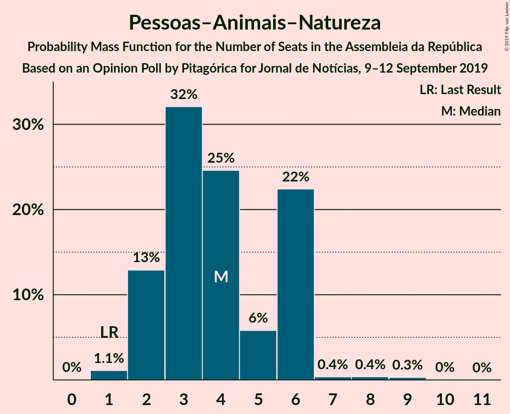
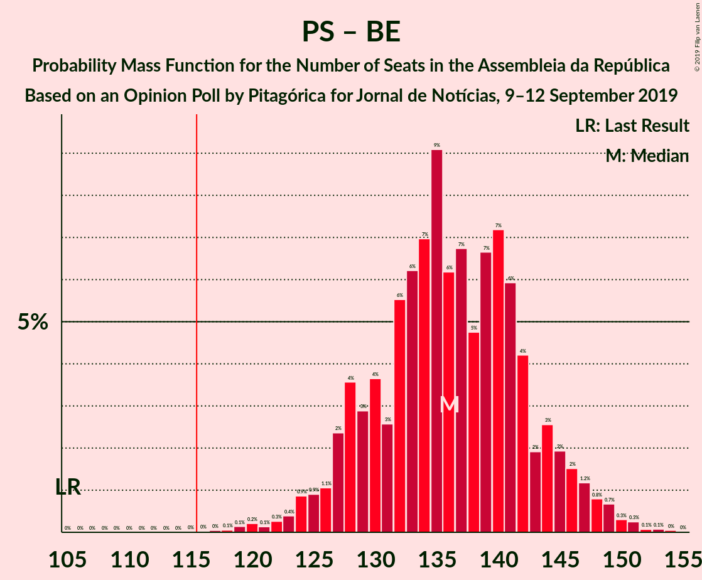

# Opinion Poll by Pitagórica for Jornal de Notícias, 9–12 September 2019

<a href="#voting-intentions">Voting Intentions</a> | <a href="#seats">Seats</a> | <a href="#coalitions">Coalitions</a> | <a href="#technical-information">Technical Information</a>

## Voting Intentions

### Confidence Intervals

| Party | Last Result | Poll Result | 80% Confidence Interval | 90% Confidence Interval | 95% Confidence Interval | 99% Confidence Interval |
|:-----:|:-----------:|:-----------:|:-----------------------:|:-----------------------:|:-----------------------:|:-----------------------:|
| Partido Socialista | 32.3% | 39.2% | 36.7–41.8% |36.0–42.5% |35.4–43.1% |34.2–44.4% |
| Partido Social Democrata | 36.9% | 23.3% | 21.2–25.6% |20.6–26.3% |20.1–26.8% |19.1–28.0% |
| Bloco de Esquerda | 10.2% | 10.1% | 8.7–11.8% |8.3–12.3% |7.9–12.8% |7.3–13.6% |
| Coligação Democrática Unitária | 8.2% | 7.8% | 6.5–9.3% |6.2–9.8% |5.9–10.2% |5.3–11.0% |
| CDS–Partido Popular | 36.9% | 5.6% | 4.6–7.0% |4.3–7.4% |4.1–7.8% |3.6–8.5% |
| Pessoas–Animais–Natureza | 1.4% | 3.1% | 2.4–4.3% |2.2–4.6% |2.0–4.9% |1.7–5.5% |
| Aliança | 0.0% | 1.5% | 1.0–2.3% |0.9–2.6% |0.8–2.8% |0.6–3.3% |
| LIVRE | 0.7% | 0.8% | 0.5–1.5% |0.4–1.7% |0.4–1.9% |0.2–2.3% |

*Note:* The poll result column reflects the actual value used in the calculations. Published results may vary slightly, and in addition be rounded to fewer digits.

## Seats

### Confidence Intervals

| Party | Last Result | Median | 80% Confidence Interval | 90% Confidence Interval | 95% Confidence Interval | 99% Confidence Interval |
|:-----:|:-----------:|:------:|:-----------------------:|:-----------------------:|:-----------------------:|:-----------------------:|
| <a href="#partido-socialista">Partido Socialista</a> | 86 | 113 | 111–113 |111–113 |111–114 |111–114 |
| <a href="#partido-social-democrata">Partido Social Democrata</a> | 89 | 65 | 65 |65–66 |65–72 |65–72 |
| <a href="#bloco-de-esquerda">Bloco de Esquerda</a> | 19 | 23 | 23–24 |23–24 |23–24 |23–24 |
| <a href="#coligação-democrática-unitária">Coligação Democrática Unitária</a> | 17 | 19 | 19–20 |17–20 |9–20 |9–20 |
| <a href="#cds–partido-popular">CDS–Partido Popular</a> | 18 | 7 | 7 |7 |7–11 |7–11 |
| <a href="#pessoas–animais–natureza">Pessoas–Animais–Natureza</a> | 1 | 3 | 3 |3 |2–3 |2–3 |
| <a href="#aliança">Aliança</a> | 0 | 0 | 0 |0 |0 |0 |
| <a href="#livre">LIVRE</a> | 0 | 0 | 0 |0 |0–1 |0–1 |

### Partido Socialista

*For a full overview of the results for this party, see the [Partido Socialista](party-partidosocialista.html) page.*

| Number of Seats | Probability | Accumulated | Special Marks |
|:---------------:|:-----------:|:-----------:|:-------------:|
| 86 | 0% | 100% | Last Result |
| 87 | 0% | 100% |  |
| 88 | 0% | 100% |  |
| 89 | 0% | 100% |  |
| 90 | 0% | 100% |  |
| 91 | 0% | 100% |  |
| 92 | 0% | 100% |  |
| 93 | 0% | 100% |  |
| 94 | 0% | 100% |  |
| 95 | 0% | 100% |  |
| 96 | 0% | 100% |  |
| 97 | 0% | 100% |  |
| 98 | 0% | 100% |  |
| 99 | 0% | 100% |  |
| 100 | 0% | 100% |  |
| 101 | 0% | 100% |  |
| 102 | 0% | 100% |  |
| 103 | 0% | 100% |  |
| 104 | 0% | 100% |  |
| 105 | 0% | 100% |  |
| 106 | 0% | 99.9% |  |
| 107 | 0% | 99.9% |  |
| 108 | 0% | 99.9% |  |
| 109 | 0% | 99.9% |  |
| 110 | 0.1% | 99.9% |  |
| 111 | 17% | 99.8% |  |
| 112 | 0% | 83% |  |
| 113 | 80% | 83% | Median |
| 114 | 2% | 3% |  |
| 115 | 0% | 0.2% |  |
| 116 | 0% | 0.2% | Majority |
| 117 | 0% | 0.2% |  |
| 118 | 0% | 0.2% |  |
| 119 | 0% | 0.1% |  |
| 120 | 0% | 0.1% |  |
| 121 | 0% | 0.1% |  |
| 122 | 0% | 0.1% |  |
| 123 | 0% | 0.1% |  |
| 124 | 0% | 0.1% |  |
| 125 | 0.1% | 0.1% |  |
| 126 | 0% | 0% |  |

### Partido Social Democrata

*For a full overview of the results for this party, see the [Partido Social Democrata](party-partidosocialdemocrata.html) page.*

| Number of Seats | Probability | Accumulated | Special Marks |
|:---------------:|:-----------:|:-----------:|:-------------:|
| 55 | 0.1% | 100% |  |
| 56 | 0% | 99.9% |  |
| 57 | 0% | 99.9% |  |
| 58 | 0% | 99.9% |  |
| 59 | 0% | 99.9% |  |
| 60 | 0% | 99.9% |  |
| 61 | 0% | 99.8% |  |
| 62 | 0% | 99.8% |  |
| 63 | 0% | 99.8% |  |
| 64 | 0% | 99.8% |  |
| 65 | 93% | 99.8% | Median |
| 66 | 2% | 6% |  |
| 67 | 0% | 4% |  |
| 68 | 0.1% | 4% |  |
| 69 | 0% | 4% |  |
| 70 | 0% | 4% |  |
| 71 | 0.1% | 4% |  |
| 72 | 4% | 4% |  |
| 73 | 0% | 0% |  |
| 74 | 0% | 0% |  |
| 75 | 0% | 0% |  |
| 76 | 0% | 0% |  |
| 77 | 0% | 0% |  |
| 78 | 0% | 0% |  |
| 79 | 0% | 0% |  |
| 80 | 0% | 0% |  |
| 81 | 0% | 0% |  |
| 82 | 0% | 0% |  |
| 83 | 0% | 0% |  |
| 84 | 0% | 0% |  |
| 85 | 0% | 0% |  |
| 86 | 0% | 0% |  |
| 87 | 0% | 0% |  |
| 88 | 0% | 0% |  |
| 89 | 0% | 0% | Last Result |

### Bloco de Esquerda

*For a full overview of the results for this party, see the [Bloco de Esquerda](party-blocodeesquerda.html) page.*

| Number of Seats | Probability | Accumulated | Special Marks |
|:---------------:|:-----------:|:-----------:|:-------------:|
| 10 | 0.1% | 100% |  |
| 11 | 0% | 99.9% |  |
| 12 | 0% | 99.9% |  |
| 13 | 0% | 99.9% |  |
| 14 | 0% | 99.9% |  |
| 15 | 0% | 99.9% |  |
| 16 | 0.1% | 99.9% |  |
| 17 | 0% | 99.8% |  |
| 18 | 0% | 99.8% |  |
| 19 | 0% | 99.8% | Last Result |
| 20 | 0% | 99.8% |  |
| 21 | 0% | 99.8% |  |
| 22 | 0% | 99.8% |  |
| 23 | 82% | 99.8% | Median |
| 24 | 17% | 17% |  |
| 25 | 0% | 0% |  |

### Coligação Democrática Unitária

*For a full overview of the results for this party, see the [Coligação Democrática Unitária](party-coligaçãodemocráticaunitária.html) page.*

| Number of Seats | Probability | Accumulated | Special Marks |
|:---------------:|:-----------:|:-----------:|:-------------:|
| 9 | 4% | 100% |  |
| 10 | 0% | 96% |  |
| 11 | 0.1% | 96% |  |
| 12 | 0% | 96% |  |
| 13 | 0% | 96% |  |
| 14 | 0% | 96% |  |
| 15 | 0% | 96% |  |
| 16 | 0% | 96% |  |
| 17 | 2% | 96% | Last Result |
| 18 | 0% | 94% |  |
| 19 | 80% | 94% | Median |
| 20 | 13% | 14% |  |
| 21 | 0% | 0.2% |  |
| 22 | 0% | 0.2% |  |
| 23 | 0% | 0.2% |  |
| 24 | 0.1% | 0.2% |  |
| 25 | 0.1% | 0.1% |  |
| 26 | 0% | 0% |  |

### CDS–Partido Popular

*For a full overview of the results for this party, see the [CDS–Partido Popular](party-cds–partidopopular.html) page.*

| Number of Seats | Probability | Accumulated | Special Marks |
|:---------------:|:-----------:|:-----------:|:-------------:|
| 6 | 0.1% | 100% |  |
| 7 | 96% | 99.9% | Median |
| 8 | 0% | 4% |  |
| 9 | 0% | 4% |  |
| 10 | 0% | 4% |  |
| 11 | 4% | 4% |  |
| 12 | 0.1% | 0.1% |  |
| 13 | 0% | 0% |  |
| 14 | 0% | 0% |  |
| 15 | 0% | 0% |  |
| 16 | 0% | 0% |  |
| 17 | 0% | 0% |  |
| 18 | 0% | 0% | Last Result |

### Pessoas–Animais–Natureza

*For a full overview of the results for this party, see the [Pessoas–Animais–Natureza](party-pessoas–animais–natureza.html) page.*

| Number of Seats | Probability | Accumulated | Special Marks |
|:---------------:|:-----------:|:-----------:|:-------------:|
| 1 | 0% | 100% | Last Result |
| 2 | 4% | 100% |  |
| 3 | 96% | 96% | Median |
| 4 | 0% | 0.1% |  |
| 5 | 0% | 0.1% |  |
| 6 | 0.1% | 0.1% |  |
| 7 | 0% | 0% |  |

### Aliança

*For a full overview of the results for this party, see the [Aliança](party-aliança.html) page.*

| Number of Seats | Probability | Accumulated | Special Marks |
|:---------------:|:-----------:|:-----------:|:-------------:|
| 0 | 100% | 100% | Last Result, Median |

### LIVRE

*For a full overview of the results for this party, see the [LIVRE](party-livre.html) page.*

| Number of Seats | Probability | Accumulated | Special Marks |
|:---------------:|:-----------:|:-----------:|:-------------:|
| 0 | 96% | 100% | Last Result, Median |
| 1 | 4% | 4% |  |
| 2 | 0% | 0% |  |

## Coalitions

### Confidence Intervals

| Coalition | Last Result | Median | Majority? | 80% Confidence Interval | 90% Confidence Interval | 95% Confidence Interval | 99% Confidence Interval |
|:---------:|:-----------:|:------:|:---------:|:-----------------------:|:-----------------------:|:-----------------------:|:-----------------------:|
| Partido Socialista – Bloco de Esquerda – Coligação Democrática Unitária | 122 | 155 | 100% | 155 | 154–155 | 144–155 | 144–155 |
| Partido Socialista – Bloco de Esquerda | 105 | 136 | 100% | 135–136 | 135–136 | 135–136 | 135–137 |
| Partido Socialista – Coligação Democrática Unitária | 103 | 132 | 100% | 131–132 | 131–132 | 120–132 | 120–132 |
| Partido Socialista | 86 | 113 | 0.2% | 111–113 | 111–113 | 111–114 | 111–114 |
| Partido Social Democrata – CDS–Partido Popular | 107 | 72 | 0% | 72 | 72–73 | 72–83 | 72–83 |

### Partido Socialista – Bloco de Esquerda – Coligação Democrática Unitária

| Number of Seats | Probability | Accumulated | Special Marks |
|:---------------:|:-----------:|:-----------:|:-------------:|
| 122 | 0% | 100% | Last Result |
| 123 | 0% | 100% |  |
| 124 | 0% | 100% |  |
| 125 | 0% | 100% |  |
| 126 | 0% | 100% |  |
| 127 | 0% | 100% |  |
| 128 | 0% | 100% |  |
| 129 | 0% | 100% |  |
| 130 | 0% | 100% |  |
| 131 | 0% | 100% |  |
| 132 | 0% | 100% |  |
| 133 | 0% | 100% |  |
| 134 | 0% | 100% |  |
| 135 | 0% | 100% |  |
| 136 | 0% | 100% |  |
| 137 | 0% | 100% |  |
| 138 | 0% | 100% |  |
| 139 | 0% | 100% |  |
| 140 | 0% | 100% |  |
| 141 | 0% | 100% |  |
| 142 | 0% | 100% |  |
| 143 | 0% | 100% |  |
| 144 | 4% | 100% |  |
| 145 | 0.1% | 96% |  |
| 146 | 0% | 96% |  |
| 147 | 0% | 96% |  |
| 148 | 0.1% | 96% |  |
| 149 | 0% | 96% |  |
| 150 | 0% | 96% |  |
| 151 | 0% | 96% |  |
| 152 | 0% | 96% |  |
| 153 | 0% | 96% |  |
| 154 | 2% | 96% |  |
| 155 | 93% | 94% | Median |
| 156 | 0% | 0.1% |  |
| 157 | 0% | 0.1% |  |
| 158 | 0% | 0.1% |  |
| 159 | 0% | 0.1% |  |
| 160 | 0% | 0.1% |  |
| 161 | 0% | 0.1% |  |
| 162 | 0% | 0.1% |  |
| 163 | 0% | 0.1% |  |
| 164 | 0% | 0.1% |  |
| 165 | 0% | 0.1% |  |
| 166 | 0.1% | 0.1% |  |
| 167 | 0% | 0% |  |

### Partido Socialista – Bloco de Esquerda

| Number of Seats | Probability | Accumulated | Special Marks |
|:---------------:|:-----------:|:-----------:|:-------------:|
| 105 | 0% | 100% | Last Result |
| 106 | 0% | 100% |  |
| 107 | 0% | 100% |  |
| 108 | 0% | 100% |  |
| 109 | 0% | 100% |  |
| 110 | 0% | 100% |  |
| 111 | 0% | 100% |  |
| 112 | 0% | 100% |  |
| 113 | 0% | 100% |  |
| 114 | 0% | 100% |  |
| 115 | 0% | 100% |  |
| 116 | 0% | 100% | Majority |
| 117 | 0% | 100% |  |
| 118 | 0% | 100% |  |
| 119 | 0% | 100% |  |
| 120 | 0% | 100% |  |
| 121 | 0% | 100% |  |
| 122 | 0% | 100% |  |
| 123 | 0% | 100% |  |
| 124 | 0.1% | 100% |  |
| 125 | 0% | 99.9% |  |
| 126 | 0% | 99.9% |  |
| 127 | 0% | 99.9% |  |
| 128 | 0% | 99.9% |  |
| 129 | 0% | 99.9% |  |
| 130 | 0% | 99.9% |  |
| 131 | 0% | 99.9% |  |
| 132 | 0% | 99.9% |  |
| 133 | 0% | 99.9% |  |
| 134 | 0.1% | 99.9% |  |
| 135 | 17% | 99.8% |  |
| 136 | 80% | 83% | Median |
| 137 | 2% | 2% |  |
| 138 | 0% | 0.2% |  |
| 139 | 0% | 0.2% |  |
| 140 | 0% | 0.2% |  |
| 141 | 0.1% | 0.2% |  |
| 142 | 0% | 0% |  |

### Partido Socialista – Coligação Democrática Unitária

| Number of Seats | Probability | Accumulated | Special Marks |
|:---------------:|:-----------:|:-----------:|:-------------:|
| 103 | 0% | 100% | Last Result |
| 104 | 0% | 100% |  |
| 105 | 0% | 100% |  |
| 106 | 0% | 100% |  |
| 107 | 0% | 100% |  |
| 108 | 0% | 100% |  |
| 109 | 0% | 100% |  |
| 110 | 0% | 100% |  |
| 111 | 0% | 100% |  |
| 112 | 0% | 100% |  |
| 113 | 0% | 100% |  |
| 114 | 0% | 100% |  |
| 115 | 0% | 100% |  |
| 116 | 0% | 100% | Majority |
| 117 | 0% | 100% |  |
| 118 | 0% | 100% |  |
| 119 | 0% | 100% |  |
| 120 | 4% | 100% |  |
| 121 | 0.2% | 96% |  |
| 122 | 0% | 96% |  |
| 123 | 0% | 96% |  |
| 124 | 0% | 96% |  |
| 125 | 0% | 96% |  |
| 126 | 0% | 96% |  |
| 127 | 0% | 96% |  |
| 128 | 0% | 96% |  |
| 129 | 0% | 96% |  |
| 130 | 0% | 96% |  |
| 131 | 16% | 96% |  |
| 132 | 80% | 80% | Median |
| 133 | 0% | 0.2% |  |
| 134 | 0% | 0.2% |  |
| 135 | 0% | 0.2% |  |
| 136 | 0% | 0.2% |  |
| 137 | 0% | 0.2% |  |
| 138 | 0.1% | 0.2% |  |
| 139 | 0% | 0.1% |  |
| 140 | 0% | 0.1% |  |
| 141 | 0% | 0.1% |  |
| 142 | 0% | 0.1% |  |
| 143 | 0% | 0.1% |  |
| 144 | 0% | 0.1% |  |
| 145 | 0% | 0.1% |  |
| 146 | 0% | 0.1% |  |
| 147 | 0% | 0.1% |  |
| 148 | 0% | 0.1% |  |
| 149 | 0% | 0.1% |  |
| 150 | 0.1% | 0.1% |  |
| 151 | 0% | 0% |  |

### Partido Socialista

| Number of Seats | Probability | Accumulated | Special Marks |
|:---------------:|:-----------:|:-----------:|:-------------:|
| 86 | 0% | 100% | Last Result |
| 87 | 0% | 100% |  |
| 88 | 0% | 100% |  |
| 89 | 0% | 100% |  |
| 90 | 0% | 100% |  |
| 91 | 0% | 100% |  |
| 92 | 0% | 100% |  |
| 93 | 0% | 100% |  |
| 94 | 0% | 100% |  |
| 95 | 0% | 100% |  |
| 96 | 0% | 100% |  |
| 97 | 0% | 100% |  |
| 98 | 0% | 100% |  |
| 99 | 0% | 100% |  |
| 100 | 0% | 100% |  |
| 101 | 0% | 100% |  |
| 102 | 0% | 100% |  |
| 103 | 0% | 100% |  |
| 104 | 0% | 100% |  |
| 105 | 0% | 100% |  |
| 106 | 0% | 99.9% |  |
| 107 | 0% | 99.9% |  |
| 108 | 0% | 99.9% |  |
| 109 | 0% | 99.9% |  |
| 110 | 0.1% | 99.9% |  |
| 111 | 17% | 99.8% |  |
| 112 | 0% | 83% |  |
| 113 | 80% | 83% | Median |
| 114 | 2% | 3% |  |
| 115 | 0% | 0.2% |  |
| 116 | 0% | 0.2% | Majority |
| 117 | 0% | 0.2% |  |
| 118 | 0% | 0.2% |  |
| 119 | 0% | 0.1% |  |
| 120 | 0% | 0.1% |  |
| 121 | 0% | 0.1% |  |
| 122 | 0% | 0.1% |  |
| 123 | 0% | 0.1% |  |
| 124 | 0% | 0.1% |  |
| 125 | 0.1% | 0.1% |  |
| 126 | 0% | 0% |  |

### Partido Social Democrata – CDS–Partido Popular

| Number of Seats | Probability | Accumulated | Special Marks |
|:---------------:|:-----------:|:-----------:|:-------------:|
| 61 | 0.1% | 100% |  |
| 62 | 0% | 99.9% |  |
| 63 | 0% | 99.9% |  |
| 64 | 0% | 99.9% |  |
| 65 | 0% | 99.9% |  |
| 66 | 0% | 99.9% |  |
| 67 | 0% | 99.9% |  |
| 68 | 0% | 99.9% |  |
| 69 | 0% | 99.9% |  |
| 70 | 0% | 99.9% |  |
| 71 | 0% | 99.9% |  |
| 72 | 93% | 99.9% | Median |
| 73 | 2% | 6% |  |
| 74 | 0% | 4% |  |
| 75 | 0% | 4% |  |
| 76 | 0% | 4% |  |
| 77 | 0% | 4% |  |
| 78 | 0% | 4% |  |
| 79 | 0% | 4% |  |
| 80 | 0.1% | 4% |  |
| 81 | 0% | 4% |  |
| 82 | 0.1% | 4% |  |
| 83 | 4% | 4% |  |
| 84 | 0% | 0% |  |
| 85 | 0% | 0% |  |
| 86 | 0% | 0% |  |
| 87 | 0% | 0% |  |
| 88 | 0% | 0% |  |
| 89 | 0% | 0% |  |
| 90 | 0% | 0% |  |
| 91 | 0% | 0% |  |
| 92 | 0% | 0% |  |
| 93 | 0% | 0% |  |
| 94 | 0% | 0% |  |
| 95 | 0% | 0% |  |
| 96 | 0% | 0% |  |
| 97 | 0% | 0% |  |
| 98 | 0% | 0% |  |
| 99 | 0% | 0% |  |
| 100 | 0% | 0% |  |
| 101 | 0% | 0% |  |
| 102 | 0% | 0% |  |
| 103 | 0% | 0% |  |
| 104 | 0% | 0% |  |
| 105 | 0% | 0% |  |
| 106 | 0% | 0% |  |
| 107 | 0% | 0% | Last Result |

## Technical Information

### Opinion Poll

+ **Polling firm:** Pitagórica
+ **Commissioner(s):** Jornal de Notícias
+ **Fieldwork period:** 9–12 September 2019

### Calculations

+ **Sample size:** 605
+ **Simulations done:** 1,024
+ **Error estimate:** 4.05%

