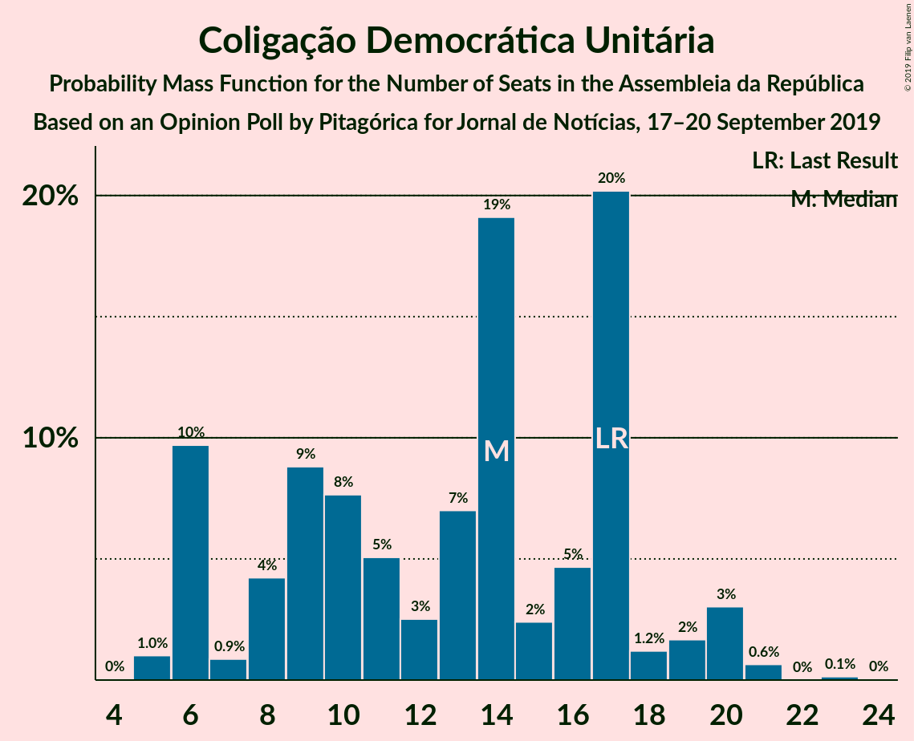
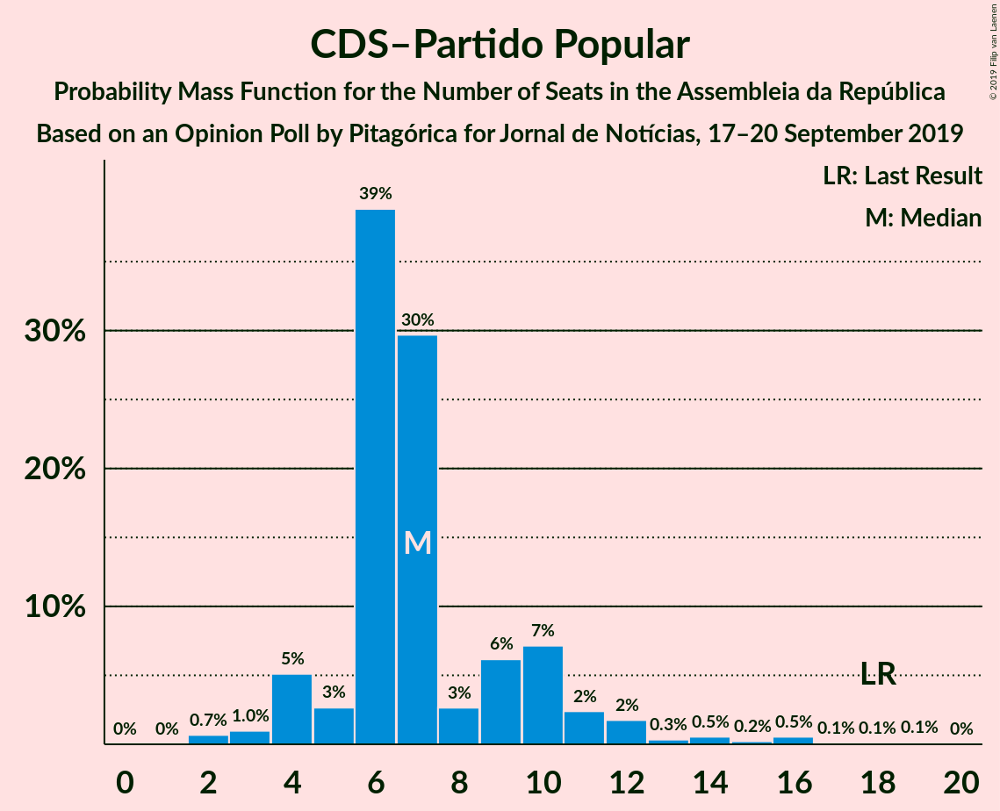

# Opinion Poll by Pitagórica for Jornal de Notícias, 17–20 September 2019

<a href="#voting-intentions">Voting Intentions</a> | <a href="#seats">Seats</a> | <a href="#coalitions">Coalitions</a> | <a href="#technical-information">Technical Information</a>

## Voting Intentions

### Confidence Intervals

| Party | Last Result | Poll Result | 80% Confidence Interval | 90% Confidence Interval | 95% Confidence Interval | 99% Confidence Interval |
|:-----:|:-----------:|:-----------:|:-----------------------:|:-----------------------:|:-----------------------:|:-----------------------:|
| Partido Socialista | 32.3% | 40.7% | 38.1–43.3% |37.4–44.0% |36.8–44.7% |35.6–45.9% |
| Partido Social Democrata | 36.9% | 26.7% | 24.4–29.1% |23.8–29.8% |23.3–30.4% |22.3–31.5% |
| Bloco de Esquerda | 10.2% | 8.8% | 7.5–10.5% |7.1–11.0% |6.8–11.4% |6.2–12.2% |
| Coligação Democrática Unitária | 8.2% | 6.8% | 5.7–8.3% |5.3–8.8% |5.1–9.1% |4.6–9.9% |
| CDS–Partido Popular | 36.9% | 5.2% | 4.2–6.5% |3.9–6.9% |3.7–7.3% |3.2–8.0% |
| Pessoas–Animais–Natureza | 1.4% | 3.7% | 2.9–4.9% |2.6–5.2% |2.4–5.5% |2.1–6.1% |
| Aliança | 0.0% | 1.2% | 0.8–2.0% |0.7–2.2% |0.6–2.4% |0.4–2.8% |

*Note:* The poll result column reflects the actual value used in the calculations. Published results may vary slightly, and in addition be rounded to fewer digits.

## Seats

### Confidence Intervals

| Party | Last Result | Median | 80% Confidence Interval | 90% Confidence Interval | 95% Confidence Interval | 99% Confidence Interval |
|:-----:|:-----------:|:------:|:-----------------------:|:-----------------------:|:-----------------------:|:-----------------------:|
| <a href="#partido-socialista">Partido Socialista</a> | 86 | 115 | 107–122 |105–125 |103–127 |100–131 |
| <a href="#partido-social-democrata">Partido Social Democrata</a> | 89 | 74 | 67–81 |64–82 |62–84 |59–88 |
| <a href="#bloco-de-esquerda">Bloco de Esquerda</a> | 19 | 18 | 14–22 |12–23 |11–24 |10–25 |
| <a href="#coligação-democrática-unitária">Coligação Democrática Unitária</a> | 17 | 13 | 8–17 |7–17 |6–18 |5–20 |
| <a href="#cds–partido-popular">CDS–Partido Popular</a> | 18 | 7 | 5–10 |4–11 |4–12 |2–14 |
| <a href="#pessoas–animais–natureza">Pessoas–Animais–Natureza</a> | 1 | 4 | 3–6 |2–6 |2–7 |2–9 |
| <a href="#aliança">Aliança</a> | 0 | 0 | 0 |0–2 |0–2 |0–2 |

### Partido Socialista

*For a full overview of the results for this party, see the [Partido Socialista](party-partidosocialista.html) page.*

| Number of Seats | Probability | Accumulated | Special Marks |
|:---------------:|:-----------:|:-----------:|:-------------:|
| 86 | 0% | 100% | Last Result |
| 87 | 0% | 100% |  |
| 88 | 0% | 100% |  |
| 89 | 0% | 100% |  |
| 90 | 0% | 100% |  |
| 91 | 0% | 100% |  |
| 92 | 0% | 100% |  |
| 93 | 0% | 100% |  |
| 94 | 0% | 100% |  |
| 95 | 0% | 100% |  |
| 96 | 0% | 100% |  |
| 97 | 0.1% | 99.9% |  |
| 98 | 0.1% | 99.9% |  |
| 99 | 0.1% | 99.8% |  |
| 100 | 0.2% | 99.6% |  |
| 101 | 0.4% | 99.5% |  |
| 102 | 0.6% | 99.0% |  |
| 103 | 1.2% | 98% |  |
| 104 | 1.0% | 97% |  |
| 105 | 2% | 96% |  |
| 106 | 2% | 95% |  |
| 107 | 3% | 92% |  |
| 108 | 3% | 90% |  |
| 109 | 5% | 86% |  |
| 110 | 6% | 81% |  |
| 111 | 5% | 76% |  |
| 112 | 5% | 70% |  |
| 113 | 5% | 65% |  |
| 114 | 9% | 60% |  |
| 115 | 9% | 51% | Median |
| 116 | 9% | 42% | Majority |
| 117 | 6% | 33% |  |
| 118 | 4% | 27% |  |
| 119 | 4% | 23% |  |
| 120 | 3% | 18% |  |
| 121 | 4% | 15% |  |
| 122 | 2% | 11% |  |
| 123 | 2% | 10% |  |
| 124 | 1.4% | 7% |  |
| 125 | 2% | 6% |  |
| 126 | 1.1% | 4% |  |
| 127 | 0.6% | 3% |  |
| 128 | 0.8% | 2% |  |
| 129 | 0.6% | 2% |  |
| 130 | 0.4% | 1.1% |  |
| 131 | 0.3% | 0.6% |  |
| 132 | 0.2% | 0.3% |  |
| 133 | 0.1% | 0.2% |  |
| 134 | 0.1% | 0.1% |  |
| 135 | 0% | 0% |  |

### Partido Social Democrata

*For a full overview of the results for this party, see the [Partido Social Democrata](party-partidosocialdemocrata.html) page.*

| Number of Seats | Probability | Accumulated | Special Marks |
|:---------------:|:-----------:|:-----------:|:-------------:|
| 56 | 0% | 100% |  |
| 57 | 0.1% | 99.9% |  |
| 58 | 0.1% | 99.8% |  |
| 59 | 0.4% | 99.7% |  |
| 60 | 0.8% | 99.3% |  |
| 61 | 0.6% | 98.6% |  |
| 62 | 0.9% | 98% |  |
| 63 | 1.1% | 97% |  |
| 64 | 2% | 96% |  |
| 65 | 2% | 94% |  |
| 66 | 2% | 93% |  |
| 67 | 4% | 90% |  |
| 68 | 4% | 87% |  |
| 69 | 5% | 82% |  |
| 70 | 9% | 77% |  |
| 71 | 6% | 68% |  |
| 72 | 5% | 62% |  |
| 73 | 6% | 57% |  |
| 74 | 9% | 51% | Median |
| 75 | 5% | 43% |  |
| 76 | 6% | 38% |  |
| 77 | 5% | 32% |  |
| 78 | 7% | 27% |  |
| 79 | 5% | 19% |  |
| 80 | 3% | 15% |  |
| 81 | 4% | 11% |  |
| 82 | 2% | 7% |  |
| 83 | 2% | 5% |  |
| 84 | 1.2% | 3% |  |
| 85 | 0.9% | 2% |  |
| 86 | 0.4% | 1.3% |  |
| 87 | 0.3% | 0.9% |  |
| 88 | 0.2% | 0.6% |  |
| 89 | 0.2% | 0.4% | Last Result |
| 90 | 0.1% | 0.2% |  |
| 91 | 0% | 0.1% |  |
| 92 | 0% | 0.1% |  |
| 93 | 0% | 0.1% |  |
| 94 | 0% | 0% |  |

### Bloco de Esquerda

*For a full overview of the results for this party, see the [Bloco de Esquerda](party-blocodeesquerda.html) page.*

| Number of Seats | Probability | Accumulated | Special Marks |
|:---------------:|:-----------:|:-----------:|:-------------:|
| 9 | 0.4% | 100% |  |
| 10 | 2% | 99.6% |  |
| 11 | 1.5% | 98% |  |
| 12 | 2% | 96% |  |
| 13 | 4% | 94% |  |
| 14 | 7% | 90% |  |
| 15 | 8% | 84% |  |
| 16 | 5% | 76% |  |
| 17 | 18% | 71% |  |
| 18 | 24% | 53% | Median |
| 19 | 8% | 28% | Last Result |
| 20 | 6% | 20% |  |
| 21 | 3% | 14% |  |
| 22 | 2% | 10% |  |
| 23 | 3% | 8% |  |
| 24 | 3% | 5% |  |
| 25 | 2% | 2% |  |
| 26 | 0.2% | 0.5% |  |
| 27 | 0.2% | 0.3% |  |
| 28 | 0.1% | 0.1% |  |
| 29 | 0% | 0% |  |

### Coligação Democrática Unitária

*For a full overview of the results for this party, see the [Coligação Democrática Unitária](party-coligaçãodemocráticaunitária.html) page.*

| Number of Seats | Probability | Accumulated | Special Marks |
|:---------------:|:-----------:|:-----------:|:-------------:|
| 5 | 0.8% | 100% |  |
| 6 | 3% | 99.2% |  |
| 7 | 2% | 96% |  |
| 8 | 5% | 94% |  |
| 9 | 12% | 89% |  |
| 10 | 6% | 77% |  |
| 11 | 6% | 71% |  |
| 12 | 8% | 65% |  |
| 13 | 12% | 57% | Median |
| 14 | 26% | 44% |  |
| 15 | 4% | 18% |  |
| 16 | 3% | 14% |  |
| 17 | 7% | 11% | Last Result |
| 18 | 3% | 4% |  |
| 19 | 0.8% | 2% |  |
| 20 | 0.7% | 0.9% |  |
| 21 | 0.2% | 0.2% |  |
| 22 | 0% | 0.1% |  |
| 23 | 0% | 0% |  |

### CDS–Partido Popular

*For a full overview of the results for this party, see the [CDS–Partido Popular](party-cds–partidopopular.html) page.*

| Number of Seats | Probability | Accumulated | Special Marks |
|:---------------:|:-----------:|:-----------:|:-------------:|
| 2 | 0.9% | 100% |  |
| 3 | 0.8% | 99.1% |  |
| 4 | 6% | 98% |  |
| 5 | 3% | 93% |  |
| 6 | 34% | 89% |  |
| 7 | 15% | 56% | Median |
| 8 | 22% | 41% |  |
| 9 | 6% | 19% |  |
| 10 | 6% | 13% |  |
| 11 | 4% | 7% |  |
| 12 | 1.3% | 3% |  |
| 13 | 1.0% | 2% |  |
| 14 | 0.2% | 0.6% |  |
| 15 | 0.1% | 0.4% |  |
| 16 | 0.1% | 0.3% |  |
| 17 | 0.1% | 0.2% |  |
| 18 | 0.1% | 0.2% | Last Result |
| 19 | 0.1% | 0.1% |  |
| 20 | 0% | 0% |  |

### Pessoas–Animais–Natureza

*For a full overview of the results for this party, see the [Pessoas–Animais–Natureza](party-pessoas–animais–natureza.html) page.*

| Number of Seats | Probability | Accumulated | Special Marks |
|:---------------:|:-----------:|:-----------:|:-------------:|
| 1 | 0.2% | 100% | Last Result |
| 2 | 5% | 99.8% |  |
| 3 | 18% | 95% |  |
| 4 | 34% | 76% | Median |
| 5 | 5% | 42% |  |
| 6 | 33% | 37% |  |
| 7 | 2% | 4% |  |
| 8 | 2% | 2% |  |
| 9 | 0.6% | 0.8% |  |
| 10 | 0.1% | 0.2% |  |
| 11 | 0% | 0.1% |  |
| 12 | 0% | 0.1% |  |
| 13 | 0% | 0% |  |

### Aliança

*For a full overview of the results for this party, see the [Aliança](party-aliança.html) page.*

| Number of Seats | Probability | Accumulated | Special Marks |
|:---------------:|:-----------:|:-----------:|:-------------:|
| 0 | 93% | 100% | Last Result, Median |
| 1 | 2% | 7% |  |
| 2 | 5% | 5% |  |
| 3 | 0% | 0% |  |

## Coalitions

### Confidence Intervals

| Coalition | Last Result | Median | Majority? | 80% Confidence Interval | 90% Confidence Interval | 95% Confidence Interval | 99% Confidence Interval |
|:---------:|:-----------:|:------:|:---------:|:-----------------------:|:-----------------------:|:-----------------------:|:-----------------------:|
| Partido Socialista – Bloco de Esquerda – Coligação Democrática Unitária | 122 | 144 | 100% | 138–152 | 136–154 | 134–157 | 130–160 |
| Partido Socialista – Bloco de Esquerda | 105 | 132 | 99.8% | 125–140 | 123–142 | 121–144 | 117–148 |
| Partido Socialista – Coligação Democrática Unitária | 103 | 127 | 98% | 120–134 | 118–137 | 116–139 | 112–142 |
| Partido Socialista | 86 | 115 | 42% | 107–122 | 105–125 | 103–127 | 100–131 |
| Partido Social Democrata – CDS–Partido Popular | 107 | 81 | 0% | 74–87 | 71–90 | 69–91 | 66–95 |

### Partido Socialista – Bloco de Esquerda – Coligação Democrática Unitária

| Number of Seats | Probability | Accumulated | Special Marks |
|:---------------:|:-----------:|:-----------:|:-------------:|
| 122 | 0% | 100% | Last Result |
| 123 | 0% | 100% |  |
| 124 | 0% | 100% |  |
| 125 | 0% | 100% |  |
| 126 | 0% | 99.9% |  |
| 127 | 0.1% | 99.9% |  |
| 128 | 0.1% | 99.8% |  |
| 129 | 0.1% | 99.7% |  |
| 130 | 0.3% | 99.6% |  |
| 131 | 0.3% | 99.3% |  |
| 132 | 0.5% | 99.0% |  |
| 133 | 0.8% | 98.5% |  |
| 134 | 1.3% | 98% |  |
| 135 | 1.2% | 96% |  |
| 136 | 2% | 95% |  |
| 137 | 2% | 93% |  |
| 138 | 4% | 91% |  |
| 139 | 5% | 87% |  |
| 140 | 7% | 81% |  |
| 141 | 6% | 74% |  |
| 142 | 7% | 68% |  |
| 143 | 5% | 61% |  |
| 144 | 7% | 56% |  |
| 145 | 6% | 49% |  |
| 146 | 8% | 43% | Median |
| 147 | 6% | 35% |  |
| 148 | 5% | 29% |  |
| 149 | 5% | 25% |  |
| 150 | 4% | 20% |  |
| 151 | 5% | 16% |  |
| 152 | 2% | 11% |  |
| 153 | 3% | 9% |  |
| 154 | 1.2% | 6% |  |
| 155 | 1.4% | 5% |  |
| 156 | 0.9% | 3% |  |
| 157 | 1.0% | 3% |  |
| 158 | 0.7% | 2% |  |
| 159 | 0.4% | 0.9% |  |
| 160 | 0.2% | 0.5% |  |
| 161 | 0.2% | 0.3% |  |
| 162 | 0.1% | 0.1% |  |
| 163 | 0% | 0.1% |  |
| 164 | 0% | 0% |  |

### Partido Socialista – Bloco de Esquerda

| Number of Seats | Probability | Accumulated | Special Marks |
|:---------------:|:-----------:|:-----------:|:-------------:|
| 105 | 0% | 100% | Last Result |
| 106 | 0% | 100% |  |
| 107 | 0% | 100% |  |
| 108 | 0% | 100% |  |
| 109 | 0% | 100% |  |
| 110 | 0% | 100% |  |
| 111 | 0% | 100% |  |
| 112 | 0% | 100% |  |
| 113 | 0% | 100% |  |
| 114 | 0% | 99.9% |  |
| 115 | 0.1% | 99.9% |  |
| 116 | 0.1% | 99.8% | Majority |
| 117 | 0.2% | 99.7% |  |
| 118 | 0.3% | 99.5% |  |
| 119 | 0.5% | 99.2% |  |
| 120 | 0.7% | 98.7% |  |
| 121 | 0.9% | 98% |  |
| 122 | 1.2% | 97% |  |
| 123 | 2% | 96% |  |
| 124 | 2% | 94% |  |
| 125 | 3% | 92% |  |
| 126 | 5% | 90% |  |
| 127 | 6% | 85% |  |
| 128 | 8% | 79% |  |
| 129 | 6% | 72% |  |
| 130 | 7% | 66% |  |
| 131 | 6% | 59% |  |
| 132 | 8% | 53% |  |
| 133 | 7% | 45% | Median |
| 134 | 7% | 38% |  |
| 135 | 5% | 31% |  |
| 136 | 3% | 25% |  |
| 137 | 5% | 22% |  |
| 138 | 3% | 17% |  |
| 139 | 3% | 14% |  |
| 140 | 2% | 11% |  |
| 141 | 2% | 9% |  |
| 142 | 2% | 6% |  |
| 143 | 1.3% | 5% |  |
| 144 | 1.0% | 3% |  |
| 145 | 0.7% | 2% |  |
| 146 | 0.6% | 2% |  |
| 147 | 0.4% | 1.1% |  |
| 148 | 0.2% | 0.7% |  |
| 149 | 0.2% | 0.5% |  |
| 150 | 0.1% | 0.3% |  |
| 151 | 0.1% | 0.2% |  |
| 152 | 0.1% | 0.1% |  |
| 153 | 0% | 0% |  |

### Partido Socialista – Coligação Democrática Unitária

| Number of Seats | Probability | Accumulated | Special Marks |
|:---------------:|:-----------:|:-----------:|:-------------:|
| 103 | 0% | 100% | Last Result |
| 104 | 0% | 100% |  |
| 105 | 0% | 100% |  |
| 106 | 0% | 100% |  |
| 107 | 0% | 100% |  |
| 108 | 0% | 100% |  |
| 109 | 0.1% | 99.9% |  |
| 110 | 0.1% | 99.9% |  |
| 111 | 0.1% | 99.8% |  |
| 112 | 0.3% | 99.7% |  |
| 113 | 0.3% | 99.4% |  |
| 114 | 0.6% | 99.0% |  |
| 115 | 0.8% | 98% |  |
| 116 | 1.0% | 98% | Majority |
| 117 | 1.2% | 97% |  |
| 118 | 2% | 95% |  |
| 119 | 2% | 93% |  |
| 120 | 3% | 91% |  |
| 121 | 5% | 87% |  |
| 122 | 5% | 83% |  |
| 123 | 7% | 77% |  |
| 124 | 6% | 70% |  |
| 125 | 6% | 64% |  |
| 126 | 5% | 59% |  |
| 127 | 6% | 53% |  |
| 128 | 7% | 47% | Median |
| 129 | 7% | 40% |  |
| 130 | 4% | 33% |  |
| 131 | 6% | 28% |  |
| 132 | 4% | 23% |  |
| 133 | 5% | 19% |  |
| 134 | 4% | 14% |  |
| 135 | 2% | 10% |  |
| 136 | 2% | 8% |  |
| 137 | 1.2% | 6% |  |
| 138 | 1.2% | 5% |  |
| 139 | 1.2% | 3% |  |
| 140 | 0.9% | 2% |  |
| 141 | 0.6% | 1.2% |  |
| 142 | 0.2% | 0.6% |  |
| 143 | 0.2% | 0.4% |  |
| 144 | 0.1% | 0.2% |  |
| 145 | 0.1% | 0.1% |  |
| 146 | 0% | 0.1% |  |
| 147 | 0% | 0% |  |

### Partido Socialista

| Number of Seats | Probability | Accumulated | Special Marks |
|:---------------:|:-----------:|:-----------:|:-------------:|
| 86 | 0% | 100% | Last Result |
| 87 | 0% | 100% |  |
| 88 | 0% | 100% |  |
| 89 | 0% | 100% |  |
| 90 | 0% | 100% |  |
| 91 | 0% | 100% |  |
| 92 | 0% | 100% |  |
| 93 | 0% | 100% |  |
| 94 | 0% | 100% |  |
| 95 | 0% | 100% |  |
| 96 | 0% | 100% |  |
| 97 | 0.1% | 99.9% |  |
| 98 | 0.1% | 99.9% |  |
| 99 | 0.1% | 99.8% |  |
| 100 | 0.2% | 99.6% |  |
| 101 | 0.4% | 99.5% |  |
| 102 | 0.6% | 99.0% |  |
| 103 | 1.2% | 98% |  |
| 104 | 1.0% | 97% |  |
| 105 | 2% | 96% |  |
| 106 | 2% | 95% |  |
| 107 | 3% | 92% |  |
| 108 | 3% | 90% |  |
| 109 | 5% | 86% |  |
| 110 | 6% | 81% |  |
| 111 | 5% | 76% |  |
| 112 | 5% | 70% |  |
| 113 | 5% | 65% |  |
| 114 | 9% | 60% |  |
| 115 | 9% | 51% | Median |
| 116 | 9% | 42% | Majority |
| 117 | 6% | 33% |  |
| 118 | 4% | 27% |  |
| 119 | 4% | 23% |  |
| 120 | 3% | 18% |  |
| 121 | 4% | 15% |  |
| 122 | 2% | 11% |  |
| 123 | 2% | 10% |  |
| 124 | 1.4% | 7% |  |
| 125 | 2% | 6% |  |
| 126 | 1.1% | 4% |  |
| 127 | 0.6% | 3% |  |
| 128 | 0.8% | 2% |  |
| 129 | 0.6% | 2% |  |
| 130 | 0.4% | 1.1% |  |
| 131 | 0.3% | 0.6% |  |
| 132 | 0.2% | 0.3% |  |
| 133 | 0.1% | 0.2% |  |
| 134 | 0.1% | 0.1% |  |
| 135 | 0% | 0% |  |

### Partido Social Democrata – CDS–Partido Popular

| Number of Seats | Probability | Accumulated | Special Marks |
|:---------------:|:-----------:|:-----------:|:-------------:|
| 63 | 0% | 100% |  |
| 64 | 0.1% | 99.9% |  |
| 65 | 0.2% | 99.8% |  |
| 66 | 0.4% | 99.7% |  |
| 67 | 0.5% | 99.3% |  |
| 68 | 0.7% | 98.8% |  |
| 69 | 0.9% | 98% |  |
| 70 | 1.3% | 97% |  |
| 71 | 2% | 96% |  |
| 72 | 1.3% | 94% |  |
| 73 | 2% | 93% |  |
| 74 | 3% | 90% |  |
| 75 | 4% | 87% |  |
| 76 | 4% | 83% |  |
| 77 | 6% | 79% |  |
| 78 | 9% | 73% |  |
| 79 | 5% | 64% |  |
| 80 | 6% | 59% |  |
| 81 | 6% | 53% | Median |
| 82 | 6% | 47% |  |
| 83 | 7% | 41% |  |
| 84 | 8% | 34% |  |
| 85 | 6% | 25% |  |
| 86 | 5% | 19% |  |
| 87 | 4% | 14% |  |
| 88 | 2% | 10% |  |
| 89 | 2% | 8% |  |
| 90 | 2% | 5% |  |
| 91 | 1.3% | 4% |  |
| 92 | 0.9% | 2% |  |
| 93 | 0.5% | 2% |  |
| 94 | 0.4% | 1.0% |  |
| 95 | 0.2% | 0.7% |  |
| 96 | 0.2% | 0.5% |  |
| 97 | 0.1% | 0.2% |  |
| 98 | 0.1% | 0.2% |  |
| 99 | 0% | 0.1% |  |
| 100 | 0% | 0.1% |  |
| 101 | 0% | 0% |  |
| 102 | 0% | 0% |  |
| 103 | 0% | 0% |  |
| 104 | 0% | 0% |  |
| 105 | 0% | 0% |  |
| 106 | 0% | 0% |  |
| 107 | 0% | 0% | Last Result |

## Technical Information

### Opinion Poll

+ **Polling firm:** Pitagórica
+ **Commissioner(s):** Jornal de Notícias
+ **Fieldwork period:** 17–20 September 2019

### Calculations

+ **Sample size:** 600
+ **Simulations done:** 1,048,576
+ **Error estimate:** 1.02%

