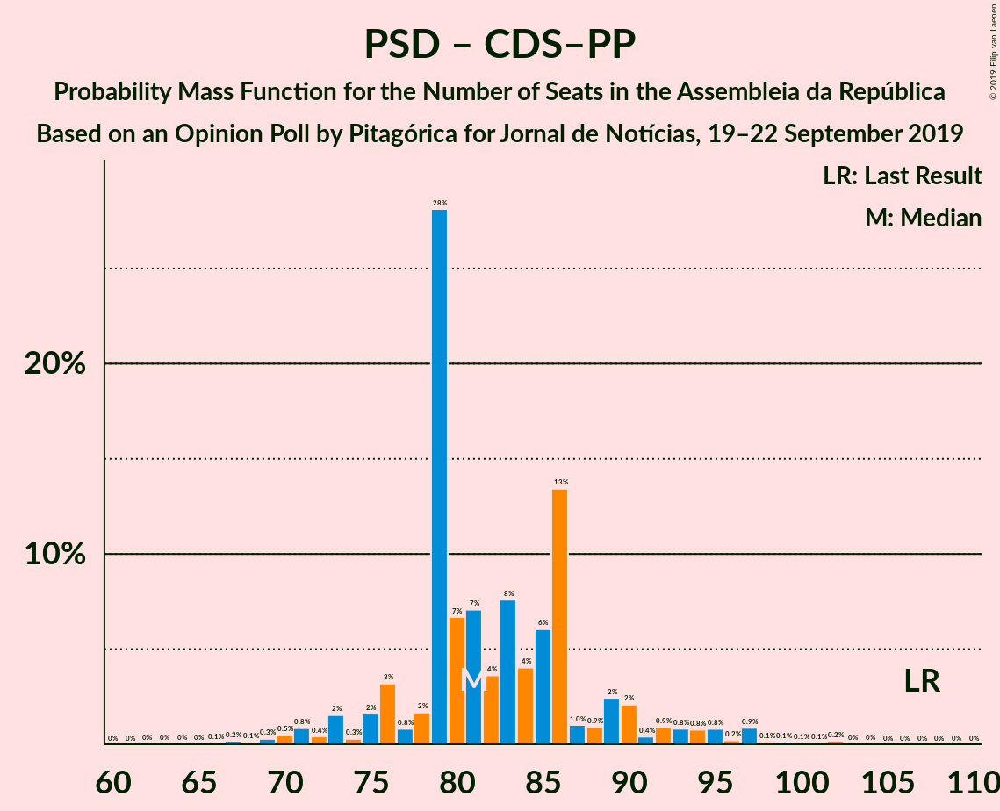

# Opinion Poll by Pitagórica for Jornal de Notícias, 19–22 September 2019

<a href="#voting-intentions">Voting Intentions</a> | <a href="#seats">Seats</a> | <a href="#coalitions">Coalitions</a> | <a href="#technical-information">Technical Information</a>

## Voting Intentions

### Confidence Intervals

| Party | Last Result | Poll Result | 80% Confidence Interval | 90% Confidence Interval | 95% Confidence Interval | 99% Confidence Interval |
|:-----:|:-----------:|:-----------:|:-----------------------:|:-----------------------:|:-----------------------:|:-----------------------:|
| Partido Socialista | 32.3% | 37.7% | 35.2–40.3% |34.5–41.0% |33.9–41.6% |32.7–42.9% |
| Partido Social Democrata | 36.9% | 27.7% | 25.4–30.1% |24.8–30.8% |24.2–31.4% |23.2–32.6% |
| Bloco de Esquerda | 10.2% | 10.3% | 8.9–12.1% |8.5–12.6% |8.1–13.0% |7.5–13.9% |
| Coligação Democrática Unitária | 8.2% | 7.7% | 6.4–9.2% |6.1–9.7% |5.8–10.1% |5.3–10.9% |
| CDS–Partido Popular | 36.9% | 4.7% | 3.7–6.0% |3.5–6.3% |3.2–6.7% |2.9–7.3% |
| Pessoas–Animais–Natureza | 1.4% | 3.3% | 2.6–4.5% |2.3–4.8% |2.2–5.1% |1.8–5.7% |
| Aliança | 0.0% | 0.7% | 0.4–1.3% |0.3–1.5% |0.3–1.7% |0.2–2.1% |

*Note:* The poll result column reflects the actual value used in the calculations. Published results may vary slightly, and in addition be rounded to fewer digits.

## Seats

### Confidence Intervals

| Party | Last Result | Median | 80% Confidence Interval | 90% Confidence Interval | 95% Confidence Interval | 99% Confidence Interval |
|:-----:|:-----------:|:------:|:-----------------------:|:-----------------------:|:-----------------------:|:-----------------------:|
| <a href="#partido-socialista">Partido Socialista</a> | 86 | 105 | 100–114 |98–116 |95–117 |90–121 |
| <a href="#partido-social-democrata">Partido Social Democrata</a> | 89 | 78 | 70–84 |68–86 |67–88 |63–93 |
| <a href="#bloco-de-esquerda">Bloco de Esquerda</a> | 19 | 21 | 18–25 |17–27 |16–27 |13–29 |
| <a href="#coligação-democrática-unitária">Coligação Democrática Unitária</a> | 17 | 14 | 10–18 |9–20 |8–20 |7–22 |
| <a href="#cds–partido-popular">CDS–Partido Popular</a> | 18 | 6 | 4–8 |3–10 |2–10 |2–12 |
| <a href="#pessoas–animais–natureza">Pessoas–Animais–Natureza</a> | 1 | 4 | 2–6 |2–6 |2–6 |1–8 |
| <a href="#aliança">Aliança</a> | 0 | 0 | 0 |0 |0 |0 |

### Partido Socialista

*For a full overview of the results for this party, see the [Partido Socialista](party-partidosocialista.html) page.*

| Number of Seats | Probability | Accumulated | Special Marks |
|:---------------:|:-----------:|:-----------:|:-------------:|
| 86 | 0% | 100% | Last Result |
| 87 | 0.1% | 100% |  |
| 88 | 0.1% | 99.9% |  |
| 89 | 0.2% | 99.8% |  |
| 90 | 0.3% | 99.6% |  |
| 91 | 0.3% | 99.4% |  |
| 92 | 0.3% | 99.1% |  |
| 93 | 0.4% | 98.8% |  |
| 94 | 0.8% | 98% |  |
| 95 | 0.7% | 98% |  |
| 96 | 0.8% | 97% |  |
| 97 | 1.0% | 96% |  |
| 98 | 2% | 95% |  |
| 99 | 2% | 93% |  |
| 100 | 3% | 91% |  |
| 101 | 6% | 88% |  |
| 102 | 6% | 82% |  |
| 103 | 8% | 76% |  |
| 104 | 9% | 67% |  |
| 105 | 10% | 59% | Median |
| 106 | 7% | 49% |  |
| 107 | 5% | 42% |  |
| 108 | 5% | 36% |  |
| 109 | 5% | 32% |  |
| 110 | 5% | 27% |  |
| 111 | 4% | 23% |  |
| 112 | 4% | 18% |  |
| 113 | 4% | 15% |  |
| 114 | 2% | 11% |  |
| 115 | 2% | 9% |  |
| 116 | 3% | 7% | Majority |
| 117 | 1.3% | 4% |  |
| 118 | 0.8% | 2% |  |
| 119 | 0.5% | 1.4% |  |
| 120 | 0.3% | 0.9% |  |
| 121 | 0.1% | 0.6% |  |
| 122 | 0.1% | 0.4% |  |
| 123 | 0.1% | 0.3% |  |
| 124 | 0.1% | 0.2% |  |
| 125 | 0.1% | 0.2% |  |
| 126 | 0% | 0.1% |  |
| 127 | 0% | 0.1% |  |
| 128 | 0% | 0% |  |

### Partido Social Democrata

*For a full overview of the results for this party, see the [Partido Social Democrata](party-partidosocialdemocrata.html) page.*

| Number of Seats | Probability | Accumulated | Special Marks |
|:---------------:|:-----------:|:-----------:|:-------------:|
| 59 | 0% | 100% |  |
| 60 | 0.1% | 99.9% |  |
| 61 | 0.1% | 99.8% |  |
| 62 | 0.2% | 99.7% |  |
| 63 | 0.2% | 99.5% |  |
| 64 | 0.3% | 99.3% |  |
| 65 | 0.5% | 99.0% |  |
| 66 | 0.6% | 98.5% |  |
| 67 | 2% | 98% |  |
| 68 | 2% | 96% |  |
| 69 | 2% | 94% |  |
| 70 | 2% | 92% |  |
| 71 | 3% | 90% |  |
| 72 | 3% | 87% |  |
| 73 | 4% | 84% |  |
| 74 | 6% | 79% |  |
| 75 | 9% | 73% |  |
| 76 | 6% | 64% |  |
| 77 | 7% | 57% |  |
| 78 | 9% | 51% | Median |
| 79 | 9% | 42% |  |
| 80 | 5% | 32% |  |
| 81 | 5% | 27% |  |
| 82 | 5% | 22% |  |
| 83 | 4% | 17% |  |
| 84 | 3% | 13% |  |
| 85 | 3% | 10% |  |
| 86 | 1.4% | 6% |  |
| 87 | 2% | 5% |  |
| 88 | 1.0% | 3% |  |
| 89 | 0.6% | 2% | Last Result |
| 90 | 0.3% | 2% |  |
| 91 | 0.3% | 1.2% |  |
| 92 | 0.3% | 0.9% |  |
| 93 | 0.2% | 0.6% |  |
| 94 | 0.2% | 0.5% |  |
| 95 | 0.1% | 0.3% |  |
| 96 | 0.1% | 0.1% |  |
| 97 | 0% | 0% |  |

### Bloco de Esquerda

*For a full overview of the results for this party, see the [Bloco de Esquerda](party-blocodeesquerda.html) page.*

| Number of Seats | Probability | Accumulated | Special Marks |
|:---------------:|:-----------:|:-----------:|:-------------:|
| 10 | 0% | 100% |  |
| 11 | 0% | 99.9% |  |
| 12 | 0.1% | 99.9% |  |
| 13 | 0.3% | 99.8% |  |
| 14 | 0.4% | 99.5% |  |
| 15 | 0.8% | 99.1% |  |
| 16 | 1.5% | 98% |  |
| 17 | 4% | 97% |  |
| 18 | 17% | 93% |  |
| 19 | 10% | 75% | Last Result |
| 20 | 11% | 65% |  |
| 21 | 6% | 55% | Median |
| 22 | 6% | 49% |  |
| 23 | 11% | 43% |  |
| 24 | 12% | 32% |  |
| 25 | 12% | 20% |  |
| 26 | 1.1% | 9% |  |
| 27 | 5% | 7% |  |
| 28 | 2% | 2% |  |
| 29 | 0.3% | 0.7% |  |
| 30 | 0.1% | 0.4% |  |
| 31 | 0.1% | 0.3% |  |
| 32 | 0.1% | 0.3% |  |
| 33 | 0.1% | 0.1% |  |
| 34 | 0% | 0.1% |  |
| 35 | 0% | 0.1% |  |
| 36 | 0% | 0% |  |

### Coligação Democrática Unitária

*For a full overview of the results for this party, see the [Coligação Democrática Unitária](party-coligaçãodemocráticaunitária.html) page.*

| Number of Seats | Probability | Accumulated | Special Marks |
|:---------------:|:-----------:|:-----------:|:-------------:|
| 5 | 0.1% | 100% |  |
| 6 | 0.3% | 99.9% |  |
| 7 | 0.6% | 99.7% |  |
| 8 | 2% | 99.1% |  |
| 9 | 5% | 97% |  |
| 10 | 3% | 93% |  |
| 11 | 5% | 89% |  |
| 12 | 4% | 85% |  |
| 13 | 13% | 81% |  |
| 14 | 20% | 68% | Median |
| 15 | 6% | 48% |  |
| 16 | 6% | 42% |  |
| 17 | 21% | 37% | Last Result |
| 18 | 7% | 16% |  |
| 19 | 2% | 9% |  |
| 20 | 4% | 6% |  |
| 21 | 2% | 2% |  |
| 22 | 0.3% | 0.8% |  |
| 23 | 0.2% | 0.5% |  |
| 24 | 0.2% | 0.3% |  |
| 25 | 0% | 0% |  |

### CDS–Partido Popular

*For a full overview of the results for this party, see the [CDS–Partido Popular](party-cds–partidopopular.html) page.*

| Number of Seats | Probability | Accumulated | Special Marks |
|:---------------:|:-----------:|:-----------:|:-------------:|
| 2 | 4% | 100% |  |
| 3 | 4% | 96% |  |
| 4 | 12% | 92% |  |
| 5 | 5% | 81% |  |
| 6 | 43% | 75% | Median |
| 7 | 10% | 32% |  |
| 8 | 13% | 22% |  |
| 9 | 3% | 9% |  |
| 10 | 4% | 6% |  |
| 11 | 1.1% | 2% |  |
| 12 | 0.3% | 0.7% |  |
| 13 | 0.2% | 0.4% |  |
| 14 | 0.1% | 0.2% |  |
| 15 | 0% | 0.1% |  |
| 16 | 0% | 0.1% |  |
| 17 | 0% | 0% |  |
| 18 | 0% | 0% | Last Result |

### Pessoas–Animais–Natureza

*For a full overview of the results for this party, see the [Pessoas–Animais–Natureza](party-pessoas–animais–natureza.html) page.*

| Number of Seats | Probability | Accumulated | Special Marks |
|:---------------:|:-----------:|:-----------:|:-------------:|
| 1 | 0.9% | 100% | Last Result |
| 2 | 12% | 99.1% |  |
| 3 | 27% | 87% |  |
| 4 | 32% | 60% | Median |
| 5 | 4% | 28% |  |
| 6 | 23% | 24% |  |
| 7 | 0.6% | 2% |  |
| 8 | 0.7% | 0.9% |  |
| 9 | 0.2% | 0.3% |  |
| 10 | 0% | 0.1% |  |
| 11 | 0% | 0% |  |

### Aliança

*For a full overview of the results for this party, see the [Aliança](party-aliança.html) page.*

| Number of Seats | Probability | Accumulated | Special Marks |
|:---------------:|:-----------:|:-----------:|:-------------:|
| 0 | 99.5% | 100% | Last Result, Median |
| 1 | 0.1% | 0.5% |  |
| 2 | 0.3% | 0.3% |  |
| 3 | 0% | 0% |  |

## Coalitions

### Confidence Intervals

| Coalition | Last Result | Median | Majority? | 80% Confidence Interval | 90% Confidence Interval | 95% Confidence Interval | 99% Confidence Interval |
|:---------:|:-----------:|:------:|:---------:|:-----------------------:|:-----------------------:|:-----------------------:|:-----------------------:|
| Partido Socialista – Bloco de Esquerda – Coligação Democrática Unitária | 122 | 142 | 100% | 135–149 | 133–152 | 131–153 | 126–158 |
| Partido Socialista – Bloco de Esquerda | 105 | 128 | 98% | 120–135 | 118–137 | 116–140 | 112–143 |
| Partido Socialista – Coligação Democrática Unitária | 103 | 121 | 85% | 114–128 | 112–131 | 110–133 | 105–137 |
| Partido Socialista | 86 | 105 | 7% | 100–114 | 98–116 | 95–117 | 90–121 |
| Partido Social Democrata – CDS–Partido Popular | 107 | 84 | 0% | 77–90 | 75–93 | 73–94 | 69–99 |

### Partido Socialista – Bloco de Esquerda – Coligação Democrática Unitária

| Number of Seats | Probability | Accumulated | Special Marks |
|:---------------:|:-----------:|:-----------:|:-------------:|
| 122 | 0% | 100% | Last Result |
| 123 | 0% | 100% |  |
| 124 | 0.1% | 99.9% |  |
| 125 | 0.2% | 99.8% |  |
| 126 | 0.2% | 99.6% |  |
| 127 | 0.2% | 99.4% |  |
| 128 | 0.3% | 99.3% |  |
| 129 | 0.4% | 98.9% |  |
| 130 | 0.5% | 98.5% |  |
| 131 | 0.7% | 98% |  |
| 132 | 1.0% | 97% |  |
| 133 | 1.4% | 96% |  |
| 134 | 2% | 95% |  |
| 135 | 3% | 92% |  |
| 136 | 4% | 90% |  |
| 137 | 4% | 86% |  |
| 138 | 5% | 82% |  |
| 139 | 6% | 77% |  |
| 140 | 6% | 71% | Median |
| 141 | 8% | 65% |  |
| 142 | 9% | 57% |  |
| 143 | 8% | 47% |  |
| 144 | 6% | 39% |  |
| 145 | 6% | 33% |  |
| 146 | 5% | 27% |  |
| 147 | 5% | 22% |  |
| 148 | 4% | 17% |  |
| 149 | 3% | 13% |  |
| 150 | 2% | 10% |  |
| 151 | 2% | 8% |  |
| 152 | 2% | 6% |  |
| 153 | 2% | 4% |  |
| 154 | 0.8% | 2% |  |
| 155 | 0.5% | 2% |  |
| 156 | 0.2% | 1.2% |  |
| 157 | 0.4% | 0.9% |  |
| 158 | 0.3% | 0.5% |  |
| 159 | 0.1% | 0.3% |  |
| 160 | 0.1% | 0.2% |  |
| 161 | 0% | 0.1% |  |
| 162 | 0% | 0% |  |

### Partido Socialista – Bloco de Esquerda

| Number of Seats | Probability | Accumulated | Special Marks |
|:---------------:|:-----------:|:-----------:|:-------------:|
| 105 | 0% | 100% | Last Result |
| 106 | 0% | 100% |  |
| 107 | 0% | 100% |  |
| 108 | 0% | 99.9% |  |
| 109 | 0.1% | 99.9% |  |
| 110 | 0.1% | 99.8% |  |
| 111 | 0.2% | 99.7% |  |
| 112 | 0.3% | 99.5% |  |
| 113 | 0.2% | 99.2% |  |
| 114 | 0.5% | 99.0% |  |
| 115 | 0.4% | 98.5% |  |
| 116 | 0.7% | 98% | Majority |
| 117 | 1.1% | 97% |  |
| 118 | 2% | 96% |  |
| 119 | 3% | 95% |  |
| 120 | 3% | 92% |  |
| 121 | 3% | 89% |  |
| 122 | 4% | 86% |  |
| 123 | 5% | 82% |  |
| 124 | 5% | 77% |  |
| 125 | 6% | 72% |  |
| 126 | 6% | 66% | Median |
| 127 | 8% | 60% |  |
| 128 | 8% | 51% |  |
| 129 | 8% | 43% |  |
| 130 | 6% | 35% |  |
| 131 | 7% | 29% |  |
| 132 | 4% | 22% |  |
| 133 | 3% | 18% |  |
| 134 | 4% | 15% |  |
| 135 | 2% | 11% |  |
| 136 | 2% | 9% |  |
| 137 | 2% | 7% |  |
| 138 | 0.9% | 5% |  |
| 139 | 1.1% | 4% |  |
| 140 | 1.3% | 3% |  |
| 141 | 0.5% | 1.4% |  |
| 142 | 0.2% | 0.9% |  |
| 143 | 0.3% | 0.7% |  |
| 144 | 0.2% | 0.4% |  |
| 145 | 0.1% | 0.2% |  |
| 146 | 0.1% | 0.1% |  |
| 147 | 0% | 0.1% |  |
| 148 | 0% | 0% |  |

### Partido Socialista – Coligação Democrática Unitária

| Number of Seats | Probability | Accumulated | Special Marks |
|:---------------:|:-----------:|:-----------:|:-------------:|
| 100 | 0% | 100% |  |
| 101 | 0.1% | 99.9% |  |
| 102 | 0.1% | 99.9% |  |
| 103 | 0.1% | 99.8% | Last Result |
| 104 | 0.1% | 99.6% |  |
| 105 | 0.2% | 99.5% |  |
| 106 | 0.2% | 99.3% |  |
| 107 | 0.3% | 99.1% |  |
| 108 | 0.5% | 98.8% |  |
| 109 | 0.5% | 98% |  |
| 110 | 0.7% | 98% |  |
| 111 | 1.4% | 97% |  |
| 112 | 2% | 96% |  |
| 113 | 2% | 93% |  |
| 114 | 3% | 91% |  |
| 115 | 3% | 88% |  |
| 116 | 5% | 85% | Majority |
| 117 | 5% | 80% |  |
| 118 | 6% | 75% |  |
| 119 | 9% | 69% | Median |
| 120 | 8% | 60% |  |
| 121 | 9% | 52% |  |
| 122 | 7% | 43% |  |
| 123 | 7% | 36% |  |
| 124 | 6% | 29% |  |
| 125 | 5% | 23% |  |
| 126 | 3% | 18% |  |
| 127 | 4% | 15% |  |
| 128 | 2% | 12% |  |
| 129 | 2% | 10% |  |
| 130 | 1.4% | 7% |  |
| 131 | 2% | 6% |  |
| 132 | 1.4% | 4% |  |
| 133 | 1.3% | 3% |  |
| 134 | 0.5% | 2% |  |
| 135 | 0.4% | 1.1% |  |
| 136 | 0.2% | 0.7% |  |
| 137 | 0.2% | 0.5% |  |
| 138 | 0.1% | 0.3% |  |
| 139 | 0.1% | 0.2% |  |
| 140 | 0.1% | 0.1% |  |
| 141 | 0% | 0.1% |  |
| 142 | 0% | 0% |  |

### Partido Socialista

| Number of Seats | Probability | Accumulated | Special Marks |
|:---------------:|:-----------:|:-----------:|:-------------:|
| 86 | 0% | 100% | Last Result |
| 87 | 0.1% | 100% |  |
| 88 | 0.1% | 99.9% |  |
| 89 | 0.2% | 99.8% |  |
| 90 | 0.3% | 99.6% |  |
| 91 | 0.3% | 99.4% |  |
| 92 | 0.3% | 99.1% |  |
| 93 | 0.4% | 98.8% |  |
| 94 | 0.8% | 98% |  |
| 95 | 0.7% | 98% |  |
| 96 | 0.8% | 97% |  |
| 97 | 1.0% | 96% |  |
| 98 | 2% | 95% |  |
| 99 | 2% | 93% |  |
| 100 | 3% | 91% |  |
| 101 | 6% | 88% |  |
| 102 | 6% | 82% |  |
| 103 | 8% | 76% |  |
| 104 | 9% | 67% |  |
| 105 | 10% | 59% | Median |
| 106 | 7% | 49% |  |
| 107 | 5% | 42% |  |
| 108 | 5% | 36% |  |
| 109 | 5% | 32% |  |
| 110 | 5% | 27% |  |
| 111 | 4% | 23% |  |
| 112 | 4% | 18% |  |
| 113 | 4% | 15% |  |
| 114 | 2% | 11% |  |
| 115 | 2% | 9% |  |
| 116 | 3% | 7% | Majority |
| 117 | 1.3% | 4% |  |
| 118 | 0.8% | 2% |  |
| 119 | 0.5% | 1.4% |  |
| 120 | 0.3% | 0.9% |  |
| 121 | 0.1% | 0.6% |  |
| 122 | 0.1% | 0.4% |  |
| 123 | 0.1% | 0.3% |  |
| 124 | 0.1% | 0.2% |  |
| 125 | 0.1% | 0.2% |  |
| 126 | 0% | 0.1% |  |
| 127 | 0% | 0.1% |  |
| 128 | 0% | 0% |  |

### Partido Social Democrata – CDS–Partido Popular

| Number of Seats | Probability | Accumulated | Special Marks |
|:---------------:|:-----------:|:-----------:|:-------------:|
| 65 | 0% | 100% |  |
| 66 | 0.1% | 99.9% |  |
| 67 | 0.2% | 99.9% |  |
| 68 | 0.2% | 99.7% |  |
| 69 | 0.3% | 99.5% |  |
| 70 | 0.4% | 99.2% |  |
| 71 | 0.3% | 98.8% |  |
| 72 | 0.5% | 98% |  |
| 73 | 1.3% | 98% |  |
| 74 | 2% | 97% |  |
| 75 | 2% | 95% |  |
| 76 | 3% | 93% |  |
| 77 | 2% | 90% |  |
| 78 | 3% | 88% |  |
| 79 | 6% | 85% |  |
| 80 | 5% | 79% |  |
| 81 | 7% | 74% |  |
| 82 | 8% | 67% |  |
| 83 | 7% | 59% |  |
| 84 | 9% | 52% | Median |
| 85 | 10% | 43% |  |
| 86 | 5% | 33% |  |
| 87 | 5% | 27% |  |
| 88 | 5% | 22% |  |
| 89 | 4% | 18% |  |
| 90 | 4% | 14% |  |
| 91 | 3% | 10% |  |
| 92 | 1.5% | 7% |  |
| 93 | 2% | 5% |  |
| 94 | 1.2% | 4% |  |
| 95 | 0.7% | 2% |  |
| 96 | 0.4% | 2% |  |
| 97 | 0.3% | 1.4% |  |
| 98 | 0.4% | 1.1% |  |
| 99 | 0.2% | 0.7% |  |
| 100 | 0.2% | 0.5% |  |
| 101 | 0.1% | 0.3% |  |
| 102 | 0.1% | 0.2% |  |
| 103 | 0% | 0.1% |  |
| 104 | 0% | 0% |  |
| 105 | 0% | 0% |  |
| 106 | 0% | 0% |  |
| 107 | 0% | 0% | Last Result |

## Technical Information

### Opinion Poll

+ **Polling firm:** Pitagórica
+ **Commissioner(s):** Jornal de Notícias
+ **Fieldwork period:** 19–22 September 2019

### Calculations

+ **Sample size:** 600
+ **Simulations done:** 1,048,576
+ **Error estimate:** 0.87%

