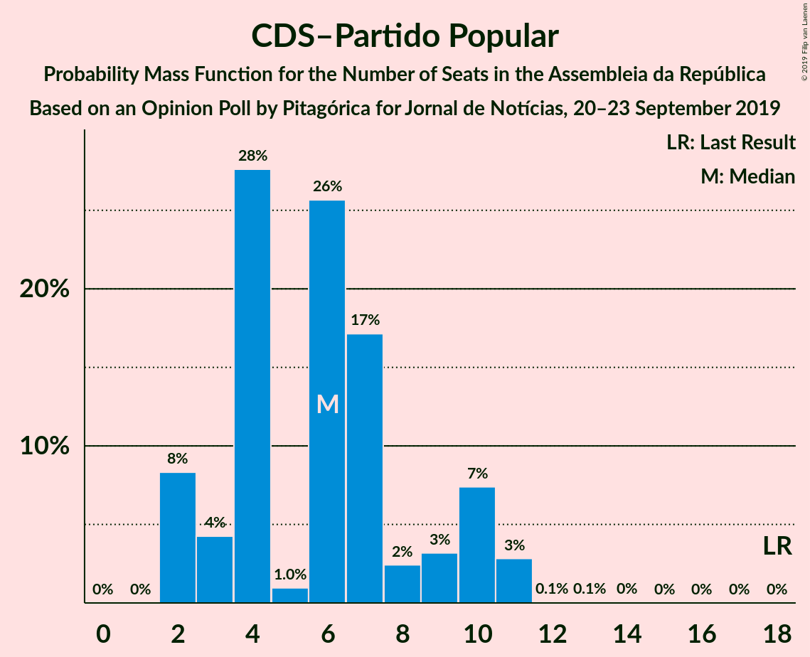
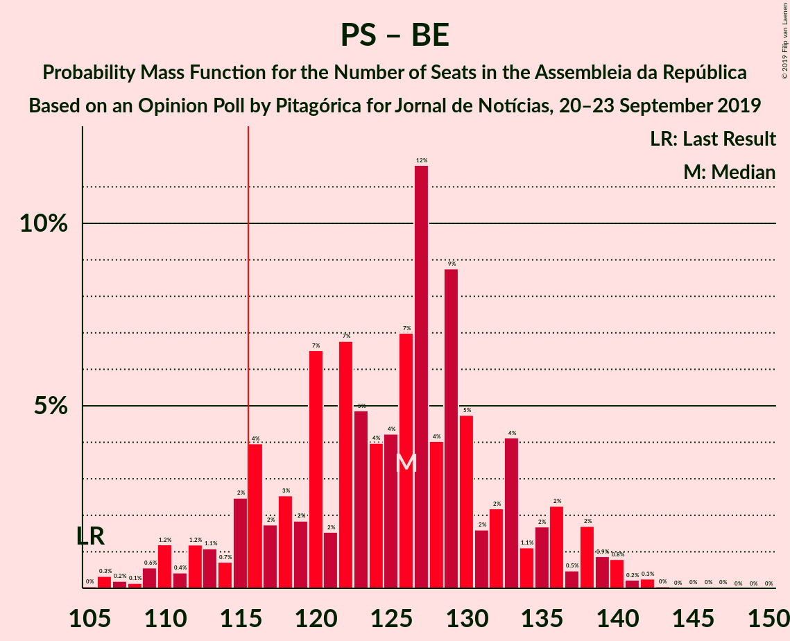

# Opinion Poll by Pitagórica for Jornal de Notícias, 20–23 September 2019

<a href="#voting-intentions">Voting Intentions</a> | <a href="#seats">Seats</a> | <a href="#coalitions">Coalitions</a> | <a href="#technical-information">Technical Information</a>

## Voting Intentions

### Confidence Intervals

| Party | Last Result | Poll Result | 80% Confidence Interval | 90% Confidence Interval | 95% Confidence Interval | 99% Confidence Interval |
|:-----:|:-----------:|:-----------:|:-----------------------:|:-----------------------:|:-----------------------:|:-----------------------:|
| Partido Socialista | 32.3% | 36.0% | 33.5–38.6% |32.8–39.3% |32.3–39.9% |31.1–41.2% |
| Partido Social Democrata | 36.9% | 28.5% | 26.2–31.0% |25.6–31.6% |25.0–32.3% |24.0–33.4% |
| Bloco de Esquerda | 10.2% | 10.5% | 9.0–12.3% |8.6–12.8% |8.3–13.2% |7.6–14.1% |
| Coligação Democrática Unitária | 8.2% | 6.8% | 5.7–8.3% |5.3–8.8% |5.1–9.1% |4.6–9.9% |
| CDS–Partido Popular | 36.9% | 4.3% | 3.4–5.6% |3.2–6.0% |3.0–6.3% |2.6–6.9% |
| Pessoas–Animais–Natureza | 1.4% | 3.7% | 2.9–4.9% |2.6–5.2% |2.4–5.5% |2.1–6.1% |
| Iniciativa Liberal | 0.0% | 1.2% | 0.8–2.0% |0.7–2.2% |0.6–2.4% |0.4–2.8% |
| LIVRE | 0.7% | 0.8% | 0.5–1.5% |0.4–1.8% |0.4–1.9% |0.2–2.3% |
| Aliança | 0.0% | 0.5% | 0.3–1.1% |0.2–1.3% |0.2–1.5% |0.1–1.8% |
| Chega | 0.0% | 0.5% | 0.3–1.1% |0.2–1.3% |0.2–1.5% |0.1–1.8% |

*Note:* The poll result column reflects the actual value used in the calculations. Published results may vary slightly, and in addition be rounded to fewer digits.

## Seats

### Confidence Intervals

| Party | Last Result | Median | 80% Confidence Interval | 90% Confidence Interval | 95% Confidence Interval | 99% Confidence Interval |
|:-----:|:-----------:|:------:|:-----------------------:|:-----------------------:|:-----------------------:|:-----------------------:|
| <a href="#partido-socialista">Partido Socialista</a> | 86 | 101 | 101 |101 |101 |95–110 |
| <a href="#partido-social-democrata">Partido Social Democrata</a> | 89 | 82 | 82 |82 |75–82 |74–82 |
| <a href="#bloco-de-esquerda">Bloco de Esquerda</a> | 19 | 18 | 18 |18 |18–21 |18–24 |
| <a href="#coligação-democrática-unitária">Coligação Democrática Unitária</a> | 17 | 13 | 13 |13 |13–14 |13–14 |
| <a href="#cds–partido-popular">CDS–Partido Popular</a> | 18 | 4 | 4 |4 |4 |3–17 |
| <a href="#pessoas–animais–natureza">Pessoas–Animais–Natureza</a> | 1 | 10 | 10 |10 |3–10 |2–10 |
| <a href="#iniciativa-liberal">Iniciativa Liberal</a> | 0 | 2 | 2 |2 |0–2 |0–2 |
| <a href="#livre">LIVRE</a> | 0 | 0 | 0 |0 |0–2 |0–5 |
| <a href="#aliança">Aliança</a> | 0 | 0 | 0 |0 |0 |0 |
| <a href="#chega">Chega</a> | 0 | 0 | 0 |0 |0 |0 |

### Partido Socialista

*For a full overview of the results for this party, see the [Partido Socialista](party-partidosocialista.html) page.*

| Number of Seats | Probability | Accumulated | Special Marks |
|:---------------:|:-----------:|:-----------:|:-------------:|
| 85 | 0.1% | 100% |  |
| 86 | 0% | 99.9% | Last Result |
| 87 | 0% | 99.9% |  |
| 88 | 0% | 99.9% |  |
| 89 | 0% | 99.9% |  |
| 90 | 0% | 99.9% |  |
| 91 | 0% | 99.9% |  |
| 92 | 0% | 99.9% |  |
| 93 | 0% | 99.9% |  |
| 94 | 0% | 99.9% |  |
| 95 | 0.7% | 99.9% |  |
| 96 | 0% | 99.2% |  |
| 97 | 0% | 99.2% |  |
| 98 | 0% | 99.2% |  |
| 99 | 0.4% | 99.2% |  |
| 100 | 0% | 98.7% |  |
| 101 | 96% | 98.7% | Median |
| 102 | 0% | 2% |  |
| 103 | 0% | 2% |  |
| 104 | 0% | 2% |  |
| 105 | 0% | 2% |  |
| 106 | 0% | 2% |  |
| 107 | 0% | 2% |  |
| 108 | 0.2% | 2% |  |
| 109 | 0% | 2% |  |
| 110 | 2% | 2% |  |
| 111 | 0% | 0.3% |  |
| 112 | 0% | 0.3% |  |
| 113 | 0.2% | 0.3% |  |
| 114 | 0.1% | 0.1% |  |
| 115 | 0% | 0% |  |

### Partido Social Democrata

*For a full overview of the results for this party, see the [Partido Social Democrata](party-partidosocialdemocrata.html) page.*

| Number of Seats | Probability | Accumulated | Special Marks |
|:---------------:|:-----------:|:-----------:|:-------------:|
| 71 | 0.2% | 100% |  |
| 72 | 0.3% | 99.8% |  |
| 73 | 0% | 99.5% |  |
| 74 | 0.5% | 99.5% |  |
| 75 | 2% | 99.0% |  |
| 76 | 0.5% | 97% |  |
| 77 | 0% | 97% |  |
| 78 | 0% | 97% |  |
| 79 | 0% | 97% |  |
| 80 | 0.2% | 97% |  |
| 81 | 0% | 96% |  |
| 82 | 96% | 96% | Median |
| 83 | 0% | 0.1% |  |
| 84 | 0% | 0.1% |  |
| 85 | 0% | 0.1% |  |
| 86 | 0% | 0.1% |  |
| 87 | 0% | 0.1% |  |
| 88 | 0% | 0.1% |  |
| 89 | 0% | 0.1% | Last Result |
| 90 | 0% | 0% |  |

### Bloco de Esquerda

*For a full overview of the results for this party, see the [Bloco de Esquerda](party-blocodeesquerda.html) page.*

| Number of Seats | Probability | Accumulated | Special Marks |
|:---------------:|:-----------:|:-----------:|:-------------:|
| 17 | 0% | 100% |  |
| 18 | 96% | 99.9% | Median |
| 19 | 0% | 3% | Last Result |
| 20 | 0% | 3% |  |
| 21 | 2% | 3% |  |
| 22 | 0% | 1.3% |  |
| 23 | 0% | 1.3% |  |
| 24 | 1.1% | 1.3% |  |
| 25 | 0% | 0.2% |  |
| 26 | 0.1% | 0.2% |  |
| 27 | 0% | 0.1% |  |
| 28 | 0% | 0.1% |  |
| 29 | 0% | 0% |  |

### Coligação Democrática Unitária

*For a full overview of the results for this party, see the [Coligação Democrática Unitária](party-coligaçãodemocráticaunitária.html) page.*

| Number of Seats | Probability | Accumulated | Special Marks |
|:---------------:|:-----------:|:-----------:|:-------------:|
| 6 | 0.1% | 100% |  |
| 7 | 0% | 99.9% |  |
| 8 | 0.2% | 99.9% |  |
| 9 | 0% | 99.7% |  |
| 10 | 0% | 99.7% |  |
| 11 | 0% | 99.7% |  |
| 12 | 0% | 99.7% |  |
| 13 | 97% | 99.7% | Median |
| 14 | 2% | 3% |  |
| 15 | 0% | 0.5% |  |
| 16 | 0% | 0.5% |  |
| 17 | 0% | 0.5% | Last Result |
| 18 | 0% | 0.5% |  |
| 19 | 0% | 0.4% |  |
| 20 | 0% | 0.4% |  |
| 21 | 0.2% | 0.4% |  |
| 22 | 0% | 0.2% |  |
| 23 | 0.2% | 0.2% |  |
| 24 | 0% | 0% |  |

### CDS–Partido Popular

*For a full overview of the results for this party, see the [CDS–Partido Popular](party-cds–partidopopular.html) page.*

| Number of Seats | Probability | Accumulated | Special Marks |
|:---------------:|:-----------:|:-----------:|:-------------:|
| 2 | 0.2% | 100% |  |
| 3 | 2% | 99.8% |  |
| 4 | 96% | 98% | Median |
| 5 | 0% | 2% |  |
| 6 | 0.1% | 2% |  |
| 7 | 0.2% | 1.5% |  |
| 8 | 0.4% | 1.3% |  |
| 9 | 0.2% | 0.9% |  |
| 10 | 0.1% | 0.6% |  |
| 11 | 0% | 0.5% |  |
| 12 | 0% | 0.5% |  |
| 13 | 0% | 0.5% |  |
| 14 | 0% | 0.5% |  |
| 15 | 0% | 0.5% |  |
| 16 | 0% | 0.5% |  |
| 17 | 0% | 0.5% |  |
| 18 | 0% | 0.5% | Last Result |
| 19 | 0% | 0.5% |  |
| 20 | 0.5% | 0.5% |  |
| 21 | 0% | 0% |  |

### Pessoas–Animais–Natureza

*For a full overview of the results for this party, see the [Pessoas–Animais–Natureza](party-pessoas–animais–natureza.html) page.*

| Number of Seats | Probability | Accumulated | Special Marks |
|:---------------:|:-----------:|:-----------:|:-------------:|
| 1 | 0.1% | 100% | Last Result |
| 2 | 2% | 99.9% |  |
| 3 | 0.7% | 98% |  |
| 4 | 0.4% | 97% |  |
| 5 | 0% | 97% |  |
| 6 | 0.5% | 97% |  |
| 7 | 0% | 96% |  |
| 8 | 0% | 96% |  |
| 9 | 0% | 96% |  |
| 10 | 96% | 96% | Median |
| 11 | 0% | 0% |  |

### Iniciativa Liberal

*For a full overview of the results for this party, see the [Iniciativa Liberal](party-iniciativaliberal.html) page.*

| Number of Seats | Probability | Accumulated | Special Marks |
|:---------------:|:-----------:|:-----------:|:-------------:|
| 0 | 3% | 100% | Last Result |
| 1 | 0.5% | 97% |  |
| 2 | 97% | 97% | Median |
| 3 | 0% | 0% |  |

### LIVRE

*For a full overview of the results for this party, see the [LIVRE](party-livre.html) page.*

| Number of Seats | Probability | Accumulated | Special Marks |
|:---------------:|:-----------:|:-----------:|:-------------:|
| 0 | 97% | 100% | Last Result, Median |
| 1 | 0.6% | 3% |  |
| 2 | 0.4% | 3% |  |
| 3 | 0.2% | 2% |  |
| 4 | 0% | 2% |  |
| 5 | 2% | 2% |  |
| 6 | 0% | 0% |  |

### Aliança

*For a full overview of the results for this party, see the [Aliança](party-aliança.html) page.*

| Number of Seats | Probability | Accumulated | Special Marks |
|:---------------:|:-----------:|:-----------:|:-------------:|
| 0 | 100% | 100% | Last Result, Median |

### Chega

*For a full overview of the results for this party, see the [Chega](party-chega.html) page.*

| Number of Seats | Probability | Accumulated | Special Marks |
|:---------------:|:-----------:|:-----------:|:-------------:|
| 0 | 100% | 100% | Last Result, Median |

## Coalitions

### Confidence Intervals

| Coalition | Last Result | Median | Majority? | 80% Confidence Interval | 90% Confidence Interval | 95% Confidence Interval | 99% Confidence Interval |
|:---------:|:-----------:|:------:|:---------:|:-----------------------:|:-----------------------:|:-----------------------:|:-----------------------:|
| Partido Socialista – Bloco de Esquerda – Coligação Democrática Unitária | 122 | 132 | 100% | 132 | 132 | 132–137 | 132–145 |
| Partido Socialista – Bloco de Esquerda | 105 | 119 | 99.7% | 119 | 119 | 119–123 | 119–131 |
| Partido Socialista – Coligação Democrática Unitária | 103 | 114 | 3% | 114 | 114 | 114–116 | 108–124 |
| Partido Socialista | 86 | 101 | 0% | 101 | 101 | 101 | 95–110 |
| Partido Social Democrata – CDS–Partido Popular | 107 | 86 | 0% | 86 | 86 | 84–86 | 78–94 |

### Partido Socialista – Bloco de Esquerda – Coligação Democrática Unitária

| Number of Seats | Probability | Accumulated | Special Marks |
|:---------------:|:-----------:|:-----------:|:-------------:|
| 122 | 0% | 100% | Last Result |
| 123 | 0% | 100% |  |
| 124 | 0% | 100% |  |
| 125 | 0% | 100% |  |
| 126 | 0% | 100% |  |
| 127 | 0% | 100% |  |
| 128 | 0% | 99.9% |  |
| 129 | 0% | 99.9% |  |
| 130 | 0% | 99.9% |  |
| 131 | 0% | 99.9% |  |
| 132 | 97% | 99.9% | Median |
| 133 | 0% | 3% |  |
| 134 | 0.2% | 3% |  |
| 135 | 0% | 3% |  |
| 136 | 0% | 3% |  |
| 137 | 0.4% | 3% |  |
| 138 | 0% | 2% |  |
| 139 | 0% | 2% |  |
| 140 | 0% | 2% |  |
| 141 | 0% | 2% |  |
| 142 | 0% | 2% |  |
| 143 | 0% | 2% |  |
| 144 | 0% | 2% |  |
| 145 | 2% | 2% |  |
| 146 | 0.1% | 0.3% |  |
| 147 | 0% | 0.2% |  |
| 148 | 0% | 0.2% |  |
| 149 | 0% | 0.2% |  |
| 150 | 0% | 0.2% |  |
| 151 | 0% | 0.2% |  |
| 152 | 0.2% | 0.2% |  |
| 153 | 0% | 0% |  |

### Partido Socialista – Bloco de Esquerda

| Number of Seats | Probability | Accumulated | Special Marks |
|:---------------:|:-----------:|:-----------:|:-------------:|
| 105 | 0% | 100% | Last Result |
| 106 | 0% | 100% |  |
| 107 | 0% | 100% |  |
| 108 | 0% | 100% |  |
| 109 | 0% | 100% |  |
| 110 | 0% | 100% |  |
| 111 | 0% | 100% |  |
| 112 | 0% | 100% |  |
| 113 | 0.2% | 100% |  |
| 114 | 0% | 99.7% |  |
| 115 | 0% | 99.7% |  |
| 116 | 0% | 99.7% | Majority |
| 117 | 0% | 99.7% |  |
| 118 | 0% | 99.7% |  |
| 119 | 97% | 99.7% | Median |
| 120 | 0% | 3% |  |
| 121 | 0% | 3% |  |
| 122 | 0% | 3% |  |
| 123 | 0.4% | 3% |  |
| 124 | 0% | 2% |  |
| 125 | 0% | 2% |  |
| 126 | 0% | 2% |  |
| 127 | 0% | 2% |  |
| 128 | 0% | 2% |  |
| 129 | 0.2% | 2% |  |
| 130 | 0% | 2% |  |
| 131 | 2% | 2% |  |
| 132 | 0% | 0.3% |  |
| 133 | 0% | 0.3% |  |
| 134 | 0% | 0.3% |  |
| 135 | 0% | 0.3% |  |
| 136 | 0% | 0.3% |  |
| 137 | 0.2% | 0.3% |  |
| 138 | 0% | 0.1% |  |
| 139 | 0% | 0.1% |  |
| 140 | 0.1% | 0.1% |  |
| 141 | 0% | 0% |  |

### Partido Socialista – Coligação Democrática Unitária

| Number of Seats | Probability | Accumulated | Special Marks |
|:---------------:|:-----------:|:-----------:|:-------------:|
| 102 | 0% | 100% |  |
| 103 | 0% | 99.9% | Last Result |
| 104 | 0% | 99.9% |  |
| 105 | 0% | 99.9% |  |
| 106 | 0% | 99.9% |  |
| 107 | 0% | 99.9% |  |
| 108 | 0.5% | 99.9% |  |
| 109 | 0% | 99.4% |  |
| 110 | 0% | 99.4% |  |
| 111 | 0% | 99.4% |  |
| 112 | 0% | 99.4% |  |
| 113 | 0.4% | 99.4% |  |
| 114 | 96% | 98.9% | Median |
| 115 | 0% | 3% |  |
| 116 | 0.2% | 3% | Majority |
| 117 | 0% | 2% |  |
| 118 | 0% | 2% |  |
| 119 | 0% | 2% |  |
| 120 | 0.1% | 2% |  |
| 121 | 0.2% | 2% |  |
| 122 | 0% | 2% |  |
| 123 | 0% | 2% |  |
| 124 | 2% | 2% |  |
| 125 | 0% | 0.2% |  |
| 126 | 0% | 0.2% |  |
| 127 | 0% | 0.2% |  |
| 128 | 0% | 0.2% |  |
| 129 | 0% | 0.2% |  |
| 130 | 0% | 0.2% |  |
| 131 | 0.2% | 0.2% |  |
| 132 | 0% | 0% |  |

### Partido Socialista

| Number of Seats | Probability | Accumulated | Special Marks |
|:---------------:|:-----------:|:-----------:|:-------------:|
| 85 | 0.1% | 100% |  |
| 86 | 0% | 99.9% | Last Result |
| 87 | 0% | 99.9% |  |
| 88 | 0% | 99.9% |  |
| 89 | 0% | 99.9% |  |
| 90 | 0% | 99.9% |  |
| 91 | 0% | 99.9% |  |
| 92 | 0% | 99.9% |  |
| 93 | 0% | 99.9% |  |
| 94 | 0% | 99.9% |  |
| 95 | 0.7% | 99.9% |  |
| 96 | 0% | 99.2% |  |
| 97 | 0% | 99.2% |  |
| 98 | 0% | 99.2% |  |
| 99 | 0.4% | 99.2% |  |
| 100 | 0% | 98.7% |  |
| 101 | 96% | 98.7% | Median |
| 102 | 0% | 2% |  |
| 103 | 0% | 2% |  |
| 104 | 0% | 2% |  |
| 105 | 0% | 2% |  |
| 106 | 0% | 2% |  |
| 107 | 0% | 2% |  |
| 108 | 0.2% | 2% |  |
| 109 | 0% | 2% |  |
| 110 | 2% | 2% |  |
| 111 | 0% | 0.3% |  |
| 112 | 0% | 0.3% |  |
| 113 | 0.2% | 0.3% |  |
| 114 | 0.1% | 0.1% |  |
| 115 | 0% | 0% |  |

### Partido Social Democrata – CDS–Partido Popular

| Number of Seats | Probability | Accumulated | Special Marks |
|:---------------:|:-----------:|:-----------:|:-------------:|
| 73 | 0.2% | 100% |  |
| 74 | 0% | 99.8% |  |
| 75 | 0% | 99.8% |  |
| 76 | 0% | 99.8% |  |
| 77 | 0% | 99.8% |  |
| 78 | 2% | 99.8% |  |
| 79 | 0.2% | 98% |  |
| 80 | 0% | 98% |  |
| 81 | 0% | 98% |  |
| 82 | 0.1% | 98% |  |
| 83 | 0% | 98% |  |
| 84 | 0.4% | 98% |  |
| 85 | 0% | 97% |  |
| 86 | 96% | 97% | Median |
| 87 | 0% | 0.9% |  |
| 88 | 0% | 0.8% |  |
| 89 | 0.2% | 0.8% |  |
| 90 | 0% | 0.6% |  |
| 91 | 0% | 0.6% |  |
| 92 | 0.1% | 0.6% |  |
| 93 | 0% | 0.5% |  |
| 94 | 0.5% | 0.5% |  |
| 95 | 0% | 0.1% |  |
| 96 | 0% | 0% |  |
| 97 | 0% | 0% |  |
| 98 | 0% | 0% |  |
| 99 | 0% | 0% |  |
| 100 | 0% | 0% |  |
| 101 | 0% | 0% |  |
| 102 | 0% | 0% |  |
| 103 | 0% | 0% |  |
| 104 | 0% | 0% |  |
| 105 | 0% | 0% |  |
| 106 | 0% | 0% |  |
| 107 | 0% | 0% | Last Result |

## Technical Information

### Opinion Poll

+ **Polling firm:** Pitagórica
+ **Commissioner(s):** Jornal de Notícias
+ **Fieldwork period:** 20–23 September 2019

### Calculations

+ **Sample size:** 600
+ **Simulations done:** 1,024
+ **Error estimate:** 2.87%

