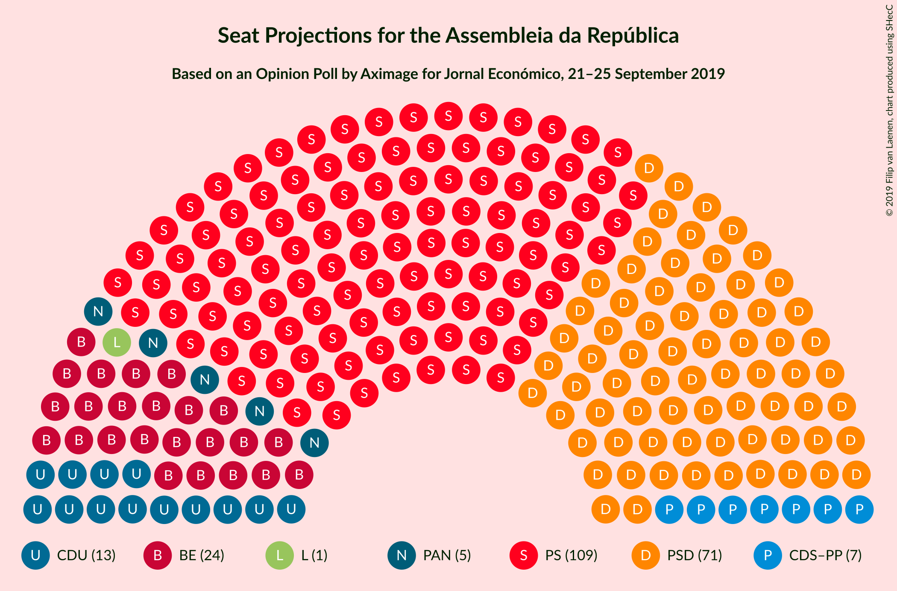
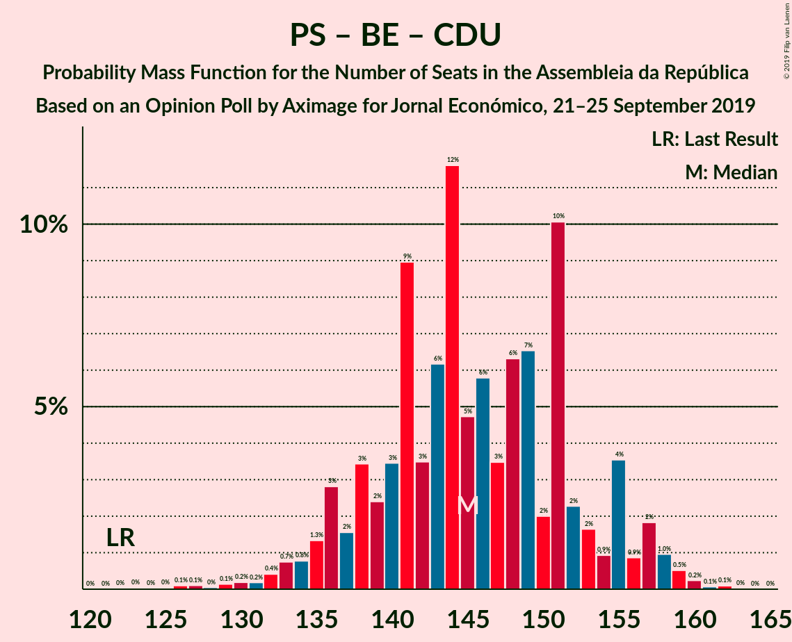

# Opinion Poll by Aximage for Jornal Económico, 21–25 September 2019

<a href="#voting-intentions">Voting Intentions</a> | <a href="#seats">Seats</a> | <a href="#coalitions">Coalitions</a> | <a href="#technical-information">Technical Information</a>

## Voting Intentions

### Confidence Intervals

| Party | Last Result | Poll Result | 80% Confidence Interval | 90% Confidence Interval | 95% Confidence Interval | 99% Confidence Interval |
|:-----:|:-----------:|:-----------:|:-----------------------:|:-----------------------:|:-----------------------:|:-----------------------:|
| Partido Socialista | 32.3% | 37.5% | 35.0–40.1% |34.3–40.8% |33.7–41.5% |32.5–42.7% |
| Partido Social Democrata | 36.9% | 25.3% | 23.2–27.7% |22.5–28.4% |22.0–29.0% |21.0–30.1% |
| Bloco de Esquerda | 10.2% | 11.0% | 9.5–12.8% |9.1–13.3% |8.7–13.8% |8.1–14.7% |
| Coligação Democrática Unitária | 8.2% | 6.8% | 5.7–8.3% |5.3–8.8% |5.1–9.1% |4.6–9.9% |
| CDS–Partido Popular | 36.9% | 5.2% | 4.2–6.5% |3.9–6.9% |3.7–7.3% |3.2–8.0% |
| Pessoas–Animais–Natureza | 1.4% | 3.7% | 2.9–4.9% |2.6–5.2% |2.4–5.5% |2.1–6.1% |

*Note:* The poll result column reflects the actual value used in the calculations. Published results may vary slightly, and in addition be rounded to fewer digits.

## Seats

### Confidence Intervals

| Party | Last Result | Median | 80% Confidence Interval | 90% Confidence Interval | 95% Confidence Interval | 99% Confidence Interval |
|:-----:|:-----------:|:------:|:-----------------------:|:-----------------------:|:-----------------------:|:-----------------------:|
| <a href="#partido-socialista">Partido Socialista</a> | 86 | 95 | 94–112 |89–112 |88–113 |88–117 |
| <a href="#partido-social-democrata">Partido Social Democrata</a> | 89 | 77 | 73–87 |71–88 |71–90 |68–90 |
| <a href="#bloco-de-esquerda">Bloco de Esquerda</a> | 19 | 24 | 23–25 |23–26 |22–26 |12–27 |
| <a href="#coligação-democrática-unitária">Coligação Democrática Unitária</a> | 17 | 16 | 7–17 |7–17 |7–17 |5–17 |
| <a href="#cds–partido-popular">CDS–Partido Popular</a> | 18 | 10 | 2–12 |2–12 |2–12 |2–12 |
| <a href="#pessoas–animais–natureza">Pessoas–Animais–Natureza</a> | 1 | 6 | 6 |6 |5–6 |1–7 |

### Partido Socialista

*For a full overview of the results for this party, see the [Partido Socialista](party-partidosocialista.html) page.*

| Number of Seats | Probability | Accumulated | Special Marks |
|:---------------:|:-----------:|:-----------:|:-------------:|
| 86 | 0% | 100% | Last Result |
| 87 | 0% | 100% |  |
| 88 | 4% | 100% |  |
| 89 | 6% | 96% |  |
| 90 | 0% | 90% |  |
| 91 | 0.2% | 90% |  |
| 92 | 0% | 90% |  |
| 93 | 0% | 90% |  |
| 94 | 0% | 90% |  |
| 95 | 44% | 90% | Median |
| 96 | 4% | 46% |  |
| 97 | 0% | 43% |  |
| 98 | 0.2% | 43% |  |
| 99 | 17% | 43% |  |
| 100 | 0.4% | 26% |  |
| 101 | 0.1% | 25% |  |
| 102 | 0% | 25% |  |
| 103 | 0% | 25% |  |
| 104 | 0% | 25% |  |
| 105 | 0% | 25% |  |
| 106 | 0% | 25% |  |
| 107 | 0% | 25% |  |
| 108 | 0.1% | 25% |  |
| 109 | 0% | 25% |  |
| 110 | 0.1% | 25% |  |
| 111 | 0% | 25% |  |
| 112 | 22% | 25% |  |
| 113 | 0.2% | 3% |  |
| 114 | 0.3% | 2% |  |
| 115 | 1.4% | 2% |  |
| 116 | 0% | 0.8% | Majority |
| 117 | 0.7% | 0.8% |  |
| 118 | 0% | 0.1% |  |
| 119 | 0% | 0.1% |  |
| 120 | 0% | 0.1% |  |
| 121 | 0% | 0.1% |  |
| 122 | 0% | 0.1% |  |
| 123 | 0% | 0.1% |  |
| 124 | 0% | 0% |  |

### Partido Social Democrata

*For a full overview of the results for this party, see the [Partido Social Democrata](party-partidosocialdemocrata.html) page.*

| Number of Seats | Probability | Accumulated | Special Marks |
|:---------------:|:-----------:|:-----------:|:-------------:|
| 61 | 0.1% | 100% |  |
| 62 | 0% | 99.9% |  |
| 63 | 0% | 99.9% |  |
| 64 | 0% | 99.9% |  |
| 65 | 0% | 99.8% |  |
| 66 | 0% | 99.8% |  |
| 67 | 0% | 99.8% |  |
| 68 | 0.9% | 99.8% |  |
| 69 | 0.9% | 99.0% |  |
| 70 | 0.3% | 98% |  |
| 71 | 6% | 98% |  |
| 72 | 0.3% | 91% |  |
| 73 | 16% | 91% |  |
| 74 | 0% | 75% |  |
| 75 | 0% | 75% |  |
| 76 | 0.2% | 75% |  |
| 77 | 31% | 75% | Median |
| 78 | 0.5% | 44% |  |
| 79 | 0% | 43% |  |
| 80 | 16% | 43% |  |
| 81 | 3% | 27% |  |
| 82 | 14% | 24% |  |
| 83 | 0.2% | 10% |  |
| 84 | 0% | 10% |  |
| 85 | 0% | 10% |  |
| 86 | 0.2% | 10% |  |
| 87 | 0.3% | 10% |  |
| 88 | 6% | 10% |  |
| 89 | 0% | 4% | Last Result |
| 90 | 4% | 4% |  |
| 91 | 0% | 0% |  |

### Bloco de Esquerda

*For a full overview of the results for this party, see the [Bloco de Esquerda](party-blocodeesquerda.html) page.*

| Number of Seats | Probability | Accumulated | Special Marks |
|:---------------:|:-----------:|:-----------:|:-------------:|
| 11 | 0.4% | 100% |  |
| 12 | 0.1% | 99.5% |  |
| 13 | 0.2% | 99.5% |  |
| 14 | 0.1% | 99.3% |  |
| 15 | 0% | 99.2% |  |
| 16 | 0% | 99.1% |  |
| 17 | 0% | 99.1% |  |
| 18 | 0% | 99.1% |  |
| 19 | 0% | 99.1% | Last Result |
| 20 | 0% | 99.1% |  |
| 21 | 0% | 99.1% |  |
| 22 | 4% | 99.1% |  |
| 23 | 13% | 96% |  |
| 24 | 59% | 83% | Median |
| 25 | 16% | 24% |  |
| 26 | 7% | 8% |  |
| 27 | 1.1% | 2% |  |
| 28 | 0% | 0.4% |  |
| 29 | 0% | 0.4% |  |
| 30 | 0% | 0.4% |  |
| 31 | 0% | 0.4% |  |
| 32 | 0% | 0.4% |  |
| 33 | 0% | 0.4% |  |
| 34 | 0% | 0.4% |  |
| 35 | 0% | 0.4% |  |
| 36 | 0% | 0.4% |  |
| 37 | 0% | 0.4% |  |
| 38 | 0% | 0.4% |  |
| 39 | 0% | 0.4% |  |
| 40 | 0% | 0.4% |  |
| 41 | 0.1% | 0.4% |  |
| 42 | 0% | 0.3% |  |
| 43 | 0.3% | 0.3% |  |
| 44 | 0% | 0% |  |

### Coligação Democrática Unitária

*For a full overview of the results for this party, see the [Coligação Democrática Unitária](party-coligaçãodemocráticaunitária.html) page.*

| Number of Seats | Probability | Accumulated | Special Marks |
|:---------------:|:-----------:|:-----------:|:-------------:|
| 5 | 0.9% | 100% |  |
| 6 | 0% | 99.1% |  |
| 7 | 14% | 99.1% |  |
| 8 | 4% | 85% |  |
| 9 | 0.1% | 81% |  |
| 10 | 0% | 81% |  |
| 11 | 0% | 81% |  |
| 12 | 16% | 81% |  |
| 13 | 8% | 65% |  |
| 14 | 0% | 57% |  |
| 15 | 0% | 57% |  |
| 16 | 20% | 57% | Median |
| 17 | 37% | 37% | Last Result |
| 18 | 0% | 0% |  |

### CDS–Partido Popular

*For a full overview of the results for this party, see the [CDS–Partido Popular](party-cds–partidopopular.html) page.*

| Number of Seats | Probability | Accumulated | Special Marks |
|:---------------:|:-----------:|:-----------:|:-------------:|
| 2 | 22% | 100% |  |
| 3 | 0.2% | 78% |  |
| 4 | 0% | 78% |  |
| 5 | 0.1% | 78% |  |
| 6 | 11% | 78% |  |
| 7 | 0.3% | 66% |  |
| 8 | 0.7% | 66% |  |
| 9 | 0% | 65% |  |
| 10 | 17% | 65% | Median |
| 11 | 31% | 48% |  |
| 12 | 17% | 17% |  |
| 13 | 0% | 0.5% |  |
| 14 | 0.1% | 0.5% |  |
| 15 | 0% | 0.4% |  |
| 16 | 0% | 0.4% |  |
| 17 | 0% | 0.4% |  |
| 18 | 0% | 0.4% | Last Result |
| 19 | 0% | 0.4% |  |
| 20 | 0.4% | 0.4% |  |
| 21 | 0% | 0% |  |

### Pessoas–Animais–Natureza

*For a full overview of the results for this party, see the [Pessoas–Animais–Natureza](party-pessoas–animais–natureza.html) page.*

| Number of Seats | Probability | Accumulated | Special Marks |
|:---------------:|:-----------:|:-----------:|:-------------:|
| 1 | 1.2% | 100% | Last Result |
| 2 | 0% | 98.8% |  |
| 3 | 0.9% | 98.8% |  |
| 4 | 0.3% | 98% |  |
| 5 | 0.2% | 98% |  |
| 6 | 97% | 97% | Median |
| 7 | 0.7% | 0.7% |  |
| 8 | 0% | 0% |  |

## Coalitions

### Confidence Intervals

| Coalition | Last Result | Median | Majority? | 80% Confidence Interval | 90% Confidence Interval | 95% Confidence Interval | 99% Confidence Interval |
|:---------:|:-----------:|:------:|:---------:|:-----------------------:|:-----------------------:|:-----------------------:|:-----------------------:|
| Partido Socialista – Bloco de Esquerda – Coligação Democrática Unitária | 122 | 136 | 100% | 130–149 | 130–151 | 128–151 | 128–155 |
| Partido Socialista – Bloco de Esquerda | 105 | 119 | 90% | 116–137 | 113–138 | 112–140 | 112–142 |
| Partido Socialista – Coligação Democrática Unitária | 103 | 112 | 25% | 106–124 | 106–125 | 104–125 | 104–128 |
| Partido Socialista | 86 | 95 | 0.8% | 94–112 | 89–112 | 88–113 | 88–117 |
| Partido Social Democrata – CDS–Partido Popular | 107 | 88 | 0% | 75–94 | 73–94 | 73–96 | 73–96 |

### Partido Socialista – Bloco de Esquerda – Coligação Democrática Unitária

| Number of Seats | Probability | Accumulated | Special Marks |
|:---------------:|:-----------:|:-----------:|:-------------:|
| 122 | 0% | 100% | Last Result |
| 123 | 0% | 100% |  |
| 124 | 0% | 100% |  |
| 125 | 0% | 100% |  |
| 126 | 0% | 100% |  |
| 127 | 0% | 100% |  |
| 128 | 4% | 100% |  |
| 129 | 0.2% | 96% |  |
| 130 | 20% | 96% |  |
| 131 | 3% | 76% |  |
| 132 | 0.3% | 73% |  |
| 133 | 0.2% | 73% |  |
| 134 | 16% | 73% |  |
| 135 | 0.1% | 56% | Median |
| 136 | 31% | 56% |  |
| 137 | 0% | 25% |  |
| 138 | 0.2% | 25% |  |
| 139 | 0.3% | 25% |  |
| 140 | 0% | 25% |  |
| 141 | 0% | 25% |  |
| 142 | 0% | 25% |  |
| 143 | 0% | 25% |  |
| 144 | 0% | 25% |  |
| 145 | 0.2% | 25% |  |
| 146 | 0.6% | 24% |  |
| 147 | 0% | 24% |  |
| 148 | 0% | 24% |  |
| 149 | 16% | 24% |  |
| 150 | 0.4% | 8% |  |
| 151 | 6% | 8% |  |
| 152 | 0% | 1.2% |  |
| 153 | 0% | 1.2% |  |
| 154 | 0.3% | 1.2% |  |
| 155 | 0.9% | 0.9% |  |
| 156 | 0% | 0% |  |

### Partido Socialista – Bloco de Esquerda

| Number of Seats | Probability | Accumulated | Special Marks |
|:---------------:|:-----------:|:-----------:|:-------------:|
| 105 | 0% | 100% | Last Result |
| 106 | 0% | 100% |  |
| 107 | 0% | 100% |  |
| 108 | 0% | 100% |  |
| 109 | 0% | 100% |  |
| 110 | 0% | 100% |  |
| 111 | 0% | 100% |  |
| 112 | 4% | 100% |  |
| 113 | 6% | 96% |  |
| 114 | 0% | 90% |  |
| 115 | 0% | 90% |  |
| 116 | 0.2% | 90% | Majority |
| 117 | 0% | 90% |  |
| 118 | 16% | 90% |  |
| 119 | 31% | 74% | Median |
| 120 | 0% | 43% |  |
| 121 | 0% | 43% |  |
| 122 | 0.3% | 43% |  |
| 123 | 17% | 42% |  |
| 124 | 0.4% | 26% |  |
| 125 | 0.2% | 25% |  |
| 126 | 0.3% | 25% |  |
| 127 | 0% | 25% |  |
| 128 | 0% | 25% |  |
| 129 | 0% | 25% |  |
| 130 | 0% | 25% |  |
| 131 | 0% | 25% |  |
| 132 | 0% | 25% |  |
| 133 | 0% | 25% |  |
| 134 | 0% | 25% |  |
| 135 | 0% | 25% |  |
| 136 | 0% | 25% |  |
| 137 | 16% | 25% |  |
| 138 | 6% | 9% |  |
| 139 | 0% | 3% |  |
| 140 | 0.2% | 3% |  |
| 141 | 0.9% | 2% |  |
| 142 | 1.2% | 1.4% |  |
| 143 | 0% | 0.1% |  |
| 144 | 0% | 0.1% |  |
| 145 | 0% | 0.1% |  |
| 146 | 0% | 0.1% |  |
| 147 | 0% | 0.1% |  |
| 148 | 0% | 0% |  |

### Partido Socialista – Coligação Democrática Unitária

| Number of Seats | Probability | Accumulated | Special Marks |
|:---------------:|:-----------:|:-----------:|:-------------:|
| 103 | 0% | 100% | Last Result |
| 104 | 4% | 100% |  |
| 105 | 0.2% | 96% |  |
| 106 | 20% | 96% |  |
| 107 | 4% | 76% |  |
| 108 | 0.5% | 73% |  |
| 109 | 0% | 72% |  |
| 110 | 0.1% | 72% |  |
| 111 | 13% | 72% | Median |
| 112 | 35% | 60% |  |
| 113 | 0% | 25% |  |
| 114 | 0% | 25% |  |
| 115 | 0% | 25% |  |
| 116 | 0% | 25% | Majority |
| 117 | 0% | 25% |  |
| 118 | 0.2% | 25% |  |
| 119 | 0% | 25% |  |
| 120 | 0.1% | 25% |  |
| 121 | 0% | 25% |  |
| 122 | 0.8% | 25% |  |
| 123 | 0% | 24% |  |
| 124 | 16% | 24% |  |
| 125 | 6% | 8% |  |
| 126 | 0% | 2% |  |
| 127 | 0.3% | 2% |  |
| 128 | 1.4% | 1.4% |  |
| 129 | 0% | 0.1% |  |
| 130 | 0% | 0.1% |  |
| 131 | 0% | 0.1% |  |
| 132 | 0% | 0.1% |  |
| 133 | 0% | 0.1% |  |
| 134 | 0% | 0.1% |  |
| 135 | 0% | 0% |  |

### Partido Socialista

| Number of Seats | Probability | Accumulated | Special Marks |
|:---------------:|:-----------:|:-----------:|:-------------:|
| 86 | 0% | 100% | Last Result |
| 87 | 0% | 100% |  |
| 88 | 4% | 100% |  |
| 89 | 6% | 96% |  |
| 90 | 0% | 90% |  |
| 91 | 0.2% | 90% |  |
| 92 | 0% | 90% |  |
| 93 | 0% | 90% |  |
| 94 | 0% | 90% |  |
| 95 | 44% | 90% | Median |
| 96 | 4% | 46% |  |
| 97 | 0% | 43% |  |
| 98 | 0.2% | 43% |  |
| 99 | 17% | 43% |  |
| 100 | 0.4% | 26% |  |
| 101 | 0.1% | 25% |  |
| 102 | 0% | 25% |  |
| 103 | 0% | 25% |  |
| 104 | 0% | 25% |  |
| 105 | 0% | 25% |  |
| 106 | 0% | 25% |  |
| 107 | 0% | 25% |  |
| 108 | 0.1% | 25% |  |
| 109 | 0% | 25% |  |
| 110 | 0.1% | 25% |  |
| 111 | 0% | 25% |  |
| 112 | 22% | 25% |  |
| 113 | 0.2% | 3% |  |
| 114 | 0.3% | 2% |  |
| 115 | 1.4% | 2% |  |
| 116 | 0% | 0.8% | Majority |
| 117 | 0.7% | 0.8% |  |
| 118 | 0% | 0.1% |  |
| 119 | 0% | 0.1% |  |
| 120 | 0% | 0.1% |  |
| 121 | 0% | 0.1% |  |
| 122 | 0% | 0.1% |  |
| 123 | 0% | 0.1% |  |
| 124 | 0% | 0% |  |

### Partido Social Democrata – CDS–Partido Popular

| Number of Seats | Probability | Accumulated | Special Marks |
|:---------------:|:-----------:|:-----------:|:-------------:|
| 73 | 6% | 100% |  |
| 74 | 0.9% | 94% |  |
| 75 | 16% | 93% |  |
| 76 | 0% | 77% |  |
| 77 | 1.0% | 77% |  |
| 78 | 0% | 76% |  |
| 79 | 0.2% | 76% |  |
| 80 | 0% | 75% |  |
| 81 | 0% | 75% |  |
| 82 | 0% | 75% |  |
| 83 | 0% | 75% |  |
| 84 | 0% | 75% |  |
| 85 | 0% | 75% |  |
| 86 | 0% | 75% |  |
| 87 | 0% | 75% | Median |
| 88 | 32% | 75% |  |
| 89 | 0% | 44% |  |
| 90 | 16% | 44% |  |
| 91 | 0% | 28% |  |
| 92 | 0.6% | 28% |  |
| 93 | 3% | 27% |  |
| 94 | 20% | 24% |  |
| 95 | 0.2% | 4% |  |
| 96 | 4% | 4% |  |
| 97 | 0% | 0% |  |
| 98 | 0% | 0% |  |
| 99 | 0% | 0% |  |
| 100 | 0% | 0% |  |
| 101 | 0% | 0% |  |
| 102 | 0% | 0% |  |
| 103 | 0% | 0% |  |
| 104 | 0% | 0% |  |
| 105 | 0% | 0% |  |
| 106 | 0% | 0% |  |
| 107 | 0% | 0% | Last Result |

## Technical Information

### Opinion Poll

+ **Polling firm:** Aximage
+ **Commissioner(s):** Jornal Económico
+ **Fieldwork period:** 21–25 September 2019

### Calculations

+ **Sample size:** 600
+ **Simulations done:** 1,024
+ **Error estimate:** 2.65%

