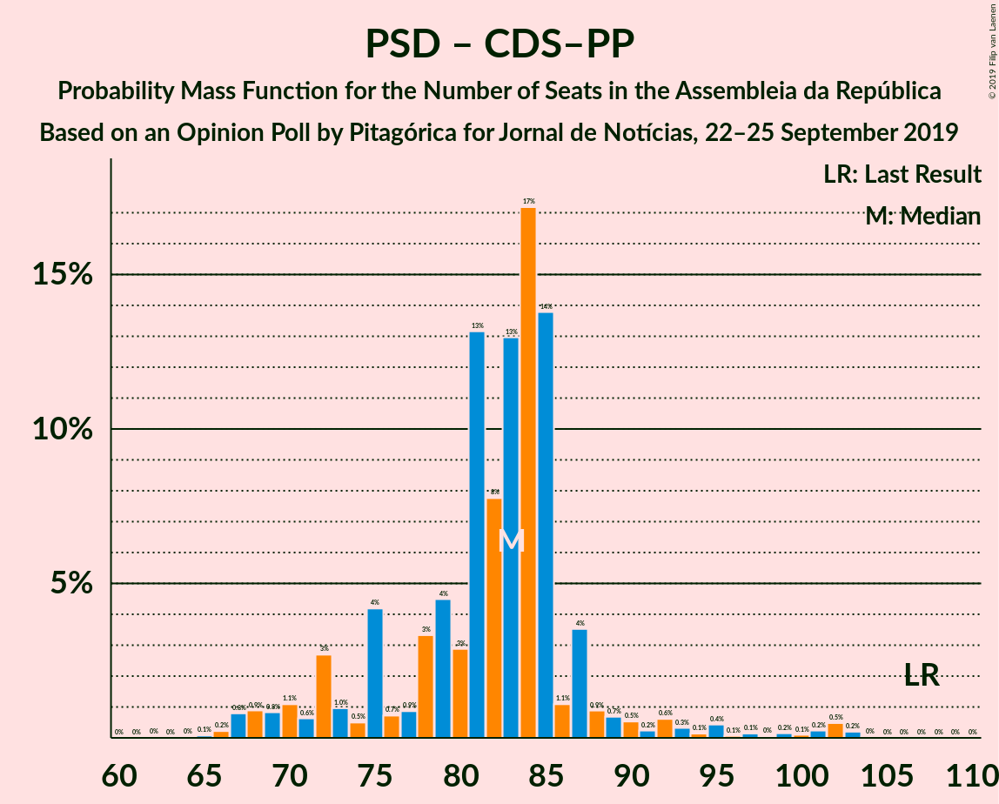

# Opinion Poll by Pitagórica for Jornal de Notícias, 22–25 September 2019

<a href="#voting-intentions">Voting Intentions</a> | <a href="#seats">Seats</a> | <a href="#coalitions">Coalitions</a> | <a href="#technical-information">Technical Information</a>

## Voting Intentions

### Confidence Intervals

| Party | Last Result | Poll Result | 80% Confidence Interval | 90% Confidence Interval | 95% Confidence Interval | 99% Confidence Interval |
|:-----:|:-----------:|:-----------:|:-----------------------:|:-----------------------:|:-----------------------:|:-----------------------:|
| Partido Socialista | 32.3% | 38.3% | 35.8–40.9% |35.1–41.7% |34.5–42.3% |33.3–43.5% |
| Partido Social Democrata | 36.9% | 26.8% | 24.6–29.2% |24.0–29.9% |23.4–30.5% |22.4–31.7% |
| Bloco de Esquerda | 10.2% | 10.7% | 9.2–12.5% |8.8–13.0% |8.4–13.4% |7.8–14.3% |
| Coligação Democrática Unitária | 8.2% | 5.3% | 4.3–6.7% |4.0–7.1% |3.8–7.4% |3.4–8.2% |
| CDS–Partido Popular | 36.9% | 4.3% | 3.4–5.6% |3.2–6.0% |3.0–6.3% |2.6–6.9% |
| Pessoas–Animais–Natureza | 1.4% | 3.3% | 2.6–4.5% |2.3–4.8% |2.2–5.1% |1.8–5.7% |
| Aliança | 0.0% | 0.7% | 0.4–1.3% |0.3–1.5% |0.3–1.7% |0.2–2.1% |

*Note:* The poll result column reflects the actual value used in the calculations. Published results may vary slightly, and in addition be rounded to fewer digits.

## Seats

### Confidence Intervals

| Party | Last Result | Median | 80% Confidence Interval | 90% Confidence Interval | 95% Confidence Interval | 99% Confidence Interval |
|:-----:|:-----------:|:------:|:-----------------------:|:-----------------------:|:-----------------------:|:-----------------------:|
| <a href="#partido-socialista">Partido Socialista</a> | 86 | 112 | 105–118 |103–120 |101–123 |97–129 |
| <a href="#partido-social-democrata">Partido Social Democrata</a> | 89 | 77 | 70–84 |68–86 |66–88 |62–93 |
| <a href="#bloco-de-esquerda">Bloco de Esquerda</a> | 19 | 24 | 18–27 |18–28 |17–29 |15–34 |
| <a href="#coligação-democrática-unitária">Coligação Democrática Unitária</a> | 17 | 8 | 5–13 |5–14 |5–14 |4–17 |
| <a href="#cds–partido-popular">CDS–Partido Popular</a> | 18 | 6 | 3–8 |2–8 |2–10 |2–12 |
| <a href="#pessoas–animais–natureza">Pessoas–Animais–Natureza</a> | 1 | 4 | 2–6 |2–6 |2–6 |1–8 |
| <a href="#aliança">Aliança</a> | 0 | 0 | 0 |0 |0 |0–1 |

### Partido Socialista

*For a full overview of the results for this party, see the [Partido Socialista](party-partidosocialista.html) page.*

| Number of Seats | Probability | Accumulated | Special Marks |
|:---------------:|:-----------:|:-----------:|:-------------:|
| 86 | 0% | 100% | Last Result |
| 87 | 0% | 100% |  |
| 88 | 0% | 100% |  |
| 89 | 0% | 100% |  |
| 90 | 0.1% | 100% |  |
| 91 | 0.1% | 99.9% |  |
| 92 | 0% | 99.9% |  |
| 93 | 0.1% | 99.8% |  |
| 94 | 0.1% | 99.7% |  |
| 95 | 0.1% | 99.7% |  |
| 96 | 0.1% | 99.6% |  |
| 97 | 0.4% | 99.5% |  |
| 98 | 0.3% | 99.2% |  |
| 99 | 0.7% | 98.9% |  |
| 100 | 0.6% | 98% |  |
| 101 | 1.0% | 98% |  |
| 102 | 1.3% | 97% |  |
| 103 | 2% | 95% |  |
| 104 | 2% | 93% |  |
| 105 | 2% | 91% |  |
| 106 | 3% | 89% |  |
| 107 | 4% | 85% |  |
| 108 | 9% | 81% |  |
| 109 | 8% | 72% |  |
| 110 | 7% | 65% |  |
| 111 | 6% | 58% |  |
| 112 | 4% | 51% | Median |
| 113 | 10% | 47% |  |
| 114 | 7% | 37% |  |
| 115 | 9% | 31% |  |
| 116 | 7% | 22% | Majority |
| 117 | 4% | 15% |  |
| 118 | 3% | 11% |  |
| 119 | 2% | 8% |  |
| 120 | 1.5% | 6% |  |
| 121 | 1.2% | 4% |  |
| 122 | 0.6% | 3% |  |
| 123 | 0.6% | 3% |  |
| 124 | 0.4% | 2% |  |
| 125 | 0.3% | 2% |  |
| 126 | 0.3% | 1.3% |  |
| 127 | 0.2% | 1.0% |  |
| 128 | 0.2% | 0.9% |  |
| 129 | 0.3% | 0.7% |  |
| 130 | 0.2% | 0.4% |  |
| 131 | 0.1% | 0.3% |  |
| 132 | 0% | 0.2% |  |
| 133 | 0.1% | 0.1% |  |
| 134 | 0% | 0% |  |

### Partido Social Democrata

*For a full overview of the results for this party, see the [Partido Social Democrata](party-partidosocialdemocrata.html) page.*

| Number of Seats | Probability | Accumulated | Special Marks |
|:---------------:|:-----------:|:-----------:|:-------------:|
| 58 | 0% | 100% |  |
| 59 | 0.1% | 99.9% |  |
| 60 | 0.1% | 99.9% |  |
| 61 | 0.1% | 99.7% |  |
| 62 | 0.3% | 99.6% |  |
| 63 | 0.4% | 99.2% |  |
| 64 | 0.4% | 98.8% |  |
| 65 | 0.4% | 98% |  |
| 66 | 0.8% | 98% |  |
| 67 | 2% | 97% |  |
| 68 | 1.4% | 96% |  |
| 69 | 3% | 94% |  |
| 70 | 3% | 91% |  |
| 71 | 5% | 88% |  |
| 72 | 4% | 83% |  |
| 73 | 7% | 79% |  |
| 74 | 4% | 72% |  |
| 75 | 4% | 67% |  |
| 76 | 7% | 63% |  |
| 77 | 10% | 56% | Median |
| 78 | 5% | 46% |  |
| 79 | 8% | 42% |  |
| 80 | 4% | 33% |  |
| 81 | 5% | 29% |  |
| 82 | 6% | 24% |  |
| 83 | 7% | 18% |  |
| 84 | 3% | 11% |  |
| 85 | 2% | 8% |  |
| 86 | 1.3% | 6% |  |
| 87 | 1.4% | 5% |  |
| 88 | 1.0% | 3% |  |
| 89 | 0.7% | 2% | Last Result |
| 90 | 0.5% | 1.4% |  |
| 91 | 0.2% | 0.9% |  |
| 92 | 0.2% | 0.7% |  |
| 93 | 0.2% | 0.6% |  |
| 94 | 0.2% | 0.4% |  |
| 95 | 0.1% | 0.2% |  |
| 96 | 0.1% | 0.2% |  |
| 97 | 0.1% | 0.1% |  |
| 98 | 0% | 0% |  |

### Bloco de Esquerda

*For a full overview of the results for this party, see the [Bloco de Esquerda](party-blocodeesquerda.html) page.*

| Number of Seats | Probability | Accumulated | Special Marks |
|:---------------:|:-----------:|:-----------:|:-------------:|
| 13 | 0% | 100% |  |
| 14 | 0.2% | 99.9% |  |
| 15 | 0.4% | 99.7% |  |
| 16 | 0.6% | 99.3% |  |
| 17 | 2% | 98.7% |  |
| 18 | 8% | 97% |  |
| 19 | 6% | 89% | Last Result |
| 20 | 5% | 82% |  |
| 21 | 7% | 77% |  |
| 22 | 7% | 70% |  |
| 23 | 10% | 64% |  |
| 24 | 18% | 54% | Median |
| 25 | 20% | 36% |  |
| 26 | 2% | 16% |  |
| 27 | 7% | 14% |  |
| 28 | 4% | 7% |  |
| 29 | 1.1% | 3% |  |
| 30 | 0.4% | 1.4% |  |
| 31 | 0.2% | 1.0% |  |
| 32 | 0.2% | 0.8% |  |
| 33 | 0.1% | 0.6% |  |
| 34 | 0.2% | 0.5% |  |
| 35 | 0.2% | 0.3% |  |
| 36 | 0.1% | 0.1% |  |
| 37 | 0% | 0.1% |  |
| 38 | 0% | 0% |  |

### Coligação Democrática Unitária

*For a full overview of the results for this party, see the [Coligação Democrática Unitária](party-coligaçãodemocráticaunitária.html) page.*

| Number of Seats | Probability | Accumulated | Special Marks |
|:---------------:|:-----------:|:-----------:|:-------------:|
| 3 | 0.1% | 100% |  |
| 4 | 1.4% | 99.9% |  |
| 5 | 15% | 98% |  |
| 6 | 15% | 84% |  |
| 7 | 13% | 68% |  |
| 8 | 16% | 55% | Median |
| 9 | 16% | 39% |  |
| 10 | 4% | 23% |  |
| 11 | 5% | 19% |  |
| 12 | 4% | 14% |  |
| 13 | 5% | 10% |  |
| 14 | 4% | 5% |  |
| 15 | 0.4% | 1.5% |  |
| 16 | 0.4% | 1.1% |  |
| 17 | 0.5% | 0.7% | Last Result |
| 18 | 0.1% | 0.1% |  |
| 19 | 0% | 0% |  |

### CDS–Partido Popular

*For a full overview of the results for this party, see the [CDS–Partido Popular](party-cds–partidopopular.html) page.*

| Number of Seats | Probability | Accumulated | Special Marks |
|:---------------:|:-----------:|:-----------:|:-------------:|
| 2 | 5% | 100% |  |
| 3 | 7% | 95% |  |
| 4 | 15% | 88% |  |
| 5 | 8% | 73% |  |
| 6 | 40% | 64% | Median |
| 7 | 10% | 25% |  |
| 8 | 10% | 15% |  |
| 9 | 2% | 5% |  |
| 10 | 2% | 3% |  |
| 11 | 1.0% | 2% |  |
| 12 | 0.3% | 0.5% |  |
| 13 | 0.2% | 0.3% |  |
| 14 | 0% | 0.1% |  |
| 15 | 0% | 0% |  |
| 16 | 0% | 0% |  |
| 17 | 0% | 0% |  |
| 18 | 0% | 0% | Last Result |

### Pessoas–Animais–Natureza

*For a full overview of the results for this party, see the [Pessoas–Animais–Natureza](party-pessoas–animais–natureza.html) page.*

| Number of Seats | Probability | Accumulated | Special Marks |
|:---------------:|:-----------:|:-----------:|:-------------:|
| 1 | 0.7% | 100% | Last Result |
| 2 | 10% | 99.3% |  |
| 3 | 19% | 89% |  |
| 4 | 40% | 71% | Median |
| 5 | 3% | 30% |  |
| 6 | 26% | 28% |  |
| 7 | 0.3% | 2% |  |
| 8 | 1.1% | 1.4% |  |
| 9 | 0.2% | 0.4% |  |
| 10 | 0.1% | 0.1% |  |
| 11 | 0% | 0% |  |

### Aliança

*For a full overview of the results for this party, see the [Aliança](party-aliança.html) page.*

| Number of Seats | Probability | Accumulated | Special Marks |
|:---------------:|:-----------:|:-----------:|:-------------:|
| 0 | 99.4% | 100% | Last Result, Median |
| 1 | 0.2% | 0.6% |  |
| 2 | 0.4% | 0.4% |  |
| 3 | 0% | 0% |  |

## Coalitions

### Confidence Intervals

| Coalition | Last Result | Median | Majority? | 80% Confidence Interval | 90% Confidence Interval | 95% Confidence Interval | 99% Confidence Interval |
|:---------:|:-----------:|:------:|:---------:|:-----------------------:|:-----------------------:|:-----------------------:|:-----------------------:|
| Partido Socialista – Bloco de Esquerda – Coligação Democrática Unitária | 122 | 143 | 100% | 136–150 | 134–152 | 132–154 | 127–159 |
| Partido Socialista – Bloco de Esquerda | 105 | 135 | 99.9% | 128–142 | 126–144 | 124–146 | 119–151 |
| Partido Socialista – Coligação Democrática Unitária | 103 | 120 | 81% | 113–126 | 111–129 | 109–131 | 104–136 |
| Partido Socialista | 86 | 112 | 22% | 105–118 | 103–120 | 101–123 | 97–129 |
| Partido Social Democrata – CDS–Partido Popular | 107 | 83 | 0% | 76–90 | 74–92 | 72–94 | 67–99 |

### Partido Socialista – Bloco de Esquerda – Coligação Democrática Unitária

| Number of Seats | Probability | Accumulated | Special Marks |
|:---------------:|:-----------:|:-----------:|:-------------:|
| 122 | 0% | 100% | Last Result |
| 123 | 0% | 99.9% |  |
| 124 | 0.1% | 99.9% |  |
| 125 | 0.1% | 99.8% |  |
| 126 | 0.2% | 99.8% |  |
| 127 | 0.1% | 99.6% |  |
| 128 | 0.2% | 99.5% |  |
| 129 | 0.3% | 99.3% |  |
| 130 | 0.5% | 98.9% |  |
| 131 | 0.7% | 98% |  |
| 132 | 1.0% | 98% |  |
| 133 | 1.4% | 97% |  |
| 134 | 2% | 95% |  |
| 135 | 2% | 93% |  |
| 136 | 3% | 91% |  |
| 137 | 4% | 88% |  |
| 138 | 6% | 84% |  |
| 139 | 5% | 78% |  |
| 140 | 7% | 72% |  |
| 141 | 5% | 65% |  |
| 142 | 7% | 60% |  |
| 143 | 10% | 54% |  |
| 144 | 7% | 44% | Median |
| 145 | 3% | 37% |  |
| 146 | 4% | 34% |  |
| 147 | 7% | 30% |  |
| 148 | 7% | 22% |  |
| 149 | 4% | 15% |  |
| 150 | 3% | 12% |  |
| 151 | 3% | 9% |  |
| 152 | 2% | 6% |  |
| 153 | 0.7% | 4% |  |
| 154 | 0.9% | 3% |  |
| 155 | 0.6% | 2% |  |
| 156 | 0.6% | 2% |  |
| 157 | 0.3% | 1.1% |  |
| 158 | 0.3% | 0.8% |  |
| 159 | 0.2% | 0.5% |  |
| 160 | 0.1% | 0.3% |  |
| 161 | 0.1% | 0.2% |  |
| 162 | 0.1% | 0.1% |  |
| 163 | 0% | 0.1% |  |
| 164 | 0% | 0% |  |

### Partido Socialista – Bloco de Esquerda

| Number of Seats | Probability | Accumulated | Special Marks |
|:---------------:|:-----------:|:-----------:|:-------------:|
| 105 | 0% | 100% | Last Result |
| 106 | 0% | 100% |  |
| 107 | 0% | 100% |  |
| 108 | 0% | 100% |  |
| 109 | 0% | 100% |  |
| 110 | 0% | 100% |  |
| 111 | 0% | 100% |  |
| 112 | 0% | 100% |  |
| 113 | 0% | 100% |  |
| 114 | 0% | 100% |  |
| 115 | 0.1% | 99.9% |  |
| 116 | 0% | 99.9% | Majority |
| 117 | 0.1% | 99.8% |  |
| 118 | 0.2% | 99.7% |  |
| 119 | 0.1% | 99.6% |  |
| 120 | 0.2% | 99.4% |  |
| 121 | 0.4% | 99.2% |  |
| 122 | 0.5% | 98.9% |  |
| 123 | 0.9% | 98% |  |
| 124 | 1.0% | 98% |  |
| 125 | 0.8% | 96% |  |
| 126 | 2% | 96% |  |
| 127 | 3% | 93% |  |
| 128 | 4% | 91% |  |
| 129 | 6% | 87% |  |
| 130 | 4% | 80% |  |
| 131 | 6% | 76% |  |
| 132 | 8% | 71% |  |
| 133 | 5% | 62% |  |
| 134 | 5% | 57% |  |
| 135 | 7% | 52% |  |
| 136 | 7% | 46% | Median |
| 137 | 5% | 39% |  |
| 138 | 5% | 33% |  |
| 139 | 6% | 28% |  |
| 140 | 6% | 22% |  |
| 141 | 4% | 15% |  |
| 142 | 3% | 11% |  |
| 143 | 3% | 8% |  |
| 144 | 1.5% | 5% |  |
| 145 | 0.9% | 4% |  |
| 146 | 0.7% | 3% |  |
| 147 | 0.4% | 2% |  |
| 148 | 0.6% | 2% |  |
| 149 | 0.3% | 1.1% |  |
| 150 | 0.2% | 0.8% |  |
| 151 | 0.1% | 0.5% |  |
| 152 | 0.2% | 0.4% |  |
| 153 | 0.1% | 0.3% |  |
| 154 | 0% | 0.1% |  |
| 155 | 0% | 0.1% |  |
| 156 | 0% | 0.1% |  |
| 157 | 0% | 0% |  |

### Partido Socialista – Coligação Democrática Unitária

| Number of Seats | Probability | Accumulated | Special Marks |
|:---------------:|:-----------:|:-----------:|:-------------:|
| 98 | 0% | 100% |  |
| 99 | 0% | 99.9% |  |
| 100 | 0% | 99.9% |  |
| 101 | 0.1% | 99.9% |  |
| 102 | 0.1% | 99.8% |  |
| 103 | 0.2% | 99.7% | Last Result |
| 104 | 0.1% | 99.5% |  |
| 105 | 0.3% | 99.4% |  |
| 106 | 0.3% | 99.1% |  |
| 107 | 0.2% | 98.8% |  |
| 108 | 0.4% | 98.5% |  |
| 109 | 1.3% | 98% |  |
| 110 | 2% | 97% |  |
| 111 | 1.2% | 95% |  |
| 112 | 3% | 94% |  |
| 113 | 5% | 91% |  |
| 114 | 2% | 87% |  |
| 115 | 3% | 84% |  |
| 116 | 7% | 81% | Majority |
| 117 | 8% | 75% |  |
| 118 | 7% | 67% |  |
| 119 | 8% | 60% |  |
| 120 | 6% | 52% | Median |
| 121 | 8% | 46% |  |
| 122 | 8% | 38% |  |
| 123 | 8% | 30% |  |
| 124 | 5% | 23% |  |
| 125 | 4% | 18% |  |
| 126 | 4% | 14% |  |
| 127 | 2% | 10% |  |
| 128 | 2% | 8% |  |
| 129 | 1.4% | 6% |  |
| 130 | 1.1% | 4% |  |
| 131 | 1.0% | 3% |  |
| 132 | 0.5% | 2% |  |
| 133 | 0.4% | 2% |  |
| 134 | 0.4% | 2% |  |
| 135 | 0.5% | 1.1% |  |
| 136 | 0.2% | 0.6% |  |
| 137 | 0.1% | 0.4% |  |
| 138 | 0.1% | 0.3% |  |
| 139 | 0.1% | 0.2% |  |
| 140 | 0% | 0.1% |  |
| 141 | 0% | 0% |  |

### Partido Socialista

| Number of Seats | Probability | Accumulated | Special Marks |
|:---------------:|:-----------:|:-----------:|:-------------:|
| 86 | 0% | 100% | Last Result |
| 87 | 0% | 100% |  |
| 88 | 0% | 100% |  |
| 89 | 0% | 100% |  |
| 90 | 0.1% | 100% |  |
| 91 | 0.1% | 99.9% |  |
| 92 | 0% | 99.9% |  |
| 93 | 0.1% | 99.8% |  |
| 94 | 0.1% | 99.7% |  |
| 95 | 0.1% | 99.7% |  |
| 96 | 0.1% | 99.6% |  |
| 97 | 0.4% | 99.5% |  |
| 98 | 0.3% | 99.2% |  |
| 99 | 0.7% | 98.9% |  |
| 100 | 0.6% | 98% |  |
| 101 | 1.0% | 98% |  |
| 102 | 1.3% | 97% |  |
| 103 | 2% | 95% |  |
| 104 | 2% | 93% |  |
| 105 | 2% | 91% |  |
| 106 | 3% | 89% |  |
| 107 | 4% | 85% |  |
| 108 | 9% | 81% |  |
| 109 | 8% | 72% |  |
| 110 | 7% | 65% |  |
| 111 | 6% | 58% |  |
| 112 | 4% | 51% | Median |
| 113 | 10% | 47% |  |
| 114 | 7% | 37% |  |
| 115 | 9% | 31% |  |
| 116 | 7% | 22% | Majority |
| 117 | 4% | 15% |  |
| 118 | 3% | 11% |  |
| 119 | 2% | 8% |  |
| 120 | 1.5% | 6% |  |
| 121 | 1.2% | 4% |  |
| 122 | 0.6% | 3% |  |
| 123 | 0.6% | 3% |  |
| 124 | 0.4% | 2% |  |
| 125 | 0.3% | 2% |  |
| 126 | 0.3% | 1.3% |  |
| 127 | 0.2% | 1.0% |  |
| 128 | 0.2% | 0.9% |  |
| 129 | 0.3% | 0.7% |  |
| 130 | 0.2% | 0.4% |  |
| 131 | 0.1% | 0.3% |  |
| 132 | 0% | 0.2% |  |
| 133 | 0.1% | 0.1% |  |
| 134 | 0% | 0% |  |

### Partido Social Democrata – CDS–Partido Popular

| Number of Seats | Probability | Accumulated | Special Marks |
|:---------------:|:-----------:|:-----------:|:-------------:|
| 63 | 0% | 100% |  |
| 64 | 0% | 99.9% |  |
| 65 | 0.1% | 99.9% |  |
| 66 | 0.1% | 99.8% |  |
| 67 | 0.2% | 99.7% |  |
| 68 | 0.3% | 99.5% |  |
| 69 | 0.5% | 99.2% |  |
| 70 | 0.6% | 98.7% |  |
| 71 | 0.6% | 98% |  |
| 72 | 0.6% | 98% |  |
| 73 | 1.1% | 97% |  |
| 74 | 2% | 96% |  |
| 75 | 3% | 94% |  |
| 76 | 3% | 91% |  |
| 77 | 6% | 88% |  |
| 78 | 4% | 82% |  |
| 79 | 8% | 78% |  |
| 80 | 7% | 70% |  |
| 81 | 4% | 63% |  |
| 82 | 3% | 59% |  |
| 83 | 8% | 57% | Median |
| 84 | 9% | 48% |  |
| 85 | 7% | 39% |  |
| 86 | 6% | 31% |  |
| 87 | 4% | 26% |  |
| 88 | 7% | 22% |  |
| 89 | 4% | 15% |  |
| 90 | 3% | 10% |  |
| 91 | 2% | 7% |  |
| 92 | 2% | 5% |  |
| 93 | 0.9% | 4% |  |
| 94 | 0.7% | 3% |  |
| 95 | 0.7% | 2% |  |
| 96 | 0.5% | 1.3% |  |
| 97 | 0.1% | 0.9% |  |
| 98 | 0.2% | 0.7% |  |
| 99 | 0.2% | 0.5% |  |
| 100 | 0.1% | 0.3% |  |
| 101 | 0.1% | 0.2% |  |
| 102 | 0% | 0.1% |  |
| 103 | 0.1% | 0.1% |  |
| 104 | 0% | 0% |  |
| 105 | 0% | 0% |  |
| 106 | 0% | 0% |  |
| 107 | 0% | 0% | Last Result |

## Technical Information

### Opinion Poll

+ **Polling firm:** Pitagórica
+ **Commissioner(s):** Jornal de Notícias
+ **Fieldwork period:** 22–25 September 2019

### Calculations

+ **Sample size:** 600
+ **Simulations done:** 1,048,576
+ **Error estimate:** 0.47%

